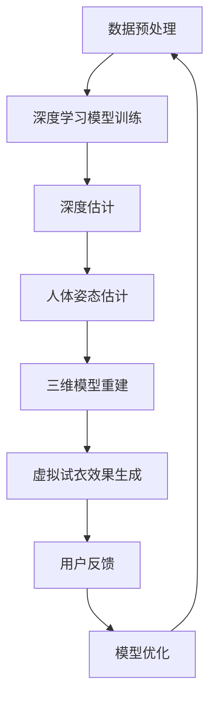

                 

### 背景介绍

深度学习作为近年来人工智能领域的重大突破，已经在图像识别、自然语言处理、语音识别等多个领域展现出了卓越的性能。而在虚拟试衣技术这一领域，深度学习的引入无疑为时尚行业带来了革命性的变化。传统虚拟试衣技术依赖于二维图像和简单的三维建模，往往无法精准地模拟服装的贴合度和穿着效果。而深度学习算法，特别是卷积神经网络（CNN）和生成对抗网络（GAN），使得虚拟试衣技术能够通过学习大量的图像数据进行精确预测，从而提供更为真实的试衣体验。

虚拟试衣技术的核心在于实现顾客在购买服装前能够通过数字化手段预览实际穿着效果。这不仅能够提高顾客的购买满意度，还能显著降低因试衣不合适而导致的退换货率。随着电子商务和线上购物的快速发展，虚拟试衣技术已经成为商家提升用户体验、降低运营成本的重要手段。

目前，虚拟试衣技术主要面临以下挑战：

1. **图像质量与分辨率**：高质量的图像是虚拟试衣技术的基础，但高分辨率图像的获取和处理对计算资源提出了更高的要求。
2. **三维人体建模**：准确的人体三维模型是真实试衣效果的关键，但三维建模的精度和速度仍有待提高。
3. **多样性适应**：不同的顾客体型和服装款式对虚拟试衣技术提出了多样化的需求，如何适应这些多样性是技术发展的关键。

深度学习的引入为解决这些挑战提供了新的思路。通过学习大量的服装和人体数据，深度学习算法能够自动提取特征，进行图像和三维模型的生成与优化。下面，我们将详细探讨深度学习在虚拟试衣技术中的应用，包括核心概念、算法原理、数学模型以及实际项目实践。

### 核心概念与联系

为了更好地理解深度学习在虚拟试衣技术中的应用，我们需要首先梳理几个核心概念及其相互关系。

#### 1. 深度学习

深度学习（Deep Learning）是机器学习（Machine Learning）的一个分支，主要依赖于神经网络（Neural Networks）进行模型训练和预测。与传统机器学习方法相比，深度学习具有以下几个特点：

- **层次化结构**：深度学习模型通常包含多个层次（或称为层），每个层次都能够提取更高级别的特征。这种层次化的结构使得深度学习能够自动学习复杂的数据特征。
- **大量数据训练**：深度学习模型的效果很大程度上依赖于训练数据的质量和数量。因此，深度学习通常需要大量的标记数据来进行训练。
- **端到端的模型**：深度学习模型可以从输入数据直接映射到输出结果，减少了传统机器学习中需要手工设计特征提取和分类步骤的复杂性。

#### 2. 卷积神经网络（CNN）

卷积神经网络（Convolutional Neural Network，CNN）是深度学习的一种重要模型，专门用于处理图像数据。CNN的核心在于其卷积层（Convolutional Layer），该层通过卷积操作提取图像的局部特征。

- **卷积层**：卷积层使用卷积核（Convolutional Kernel）在输入图像上滑动，以计算局部特征。每个卷积核能够提取一种特定的特征，如边缘、纹理等。
- **池化层**：池化层（Pooling Layer）用于减小特征图的大小，减少参数数量，同时保持重要特征。常见的池化操作有最大池化（Max Pooling）和平均池化（Average Pooling）。
- **全连接层**：在全连接层（Fully Connected Layer）中，每个神经元都与上一层的所有神经元相连，用于进行分类和预测。

#### 3. 生成对抗网络（GAN）

生成对抗网络（Generative Adversarial Network，GAN）是另一种重要的深度学习模型，由生成器（Generator）和判别器（Discriminator）两个部分组成。GAN通过两个对抗网络之间的博弈来生成高质量的数据。

- **生成器（Generator）**：生成器的任务是生成与真实数据相似的新数据。生成器通常是一个神经网络，其输入为随机噪声，输出为生成的数据。
- **判别器（Discriminator）**：判别器的任务是判断输入数据是真实数据还是生成器生成的数据。判别器也是一个神经网络，其输入为数据，输出为概率值，表示输入数据的真实性。

#### 4. 三维人体建模

三维人体建模是虚拟试衣技术中的关键组成部分，它涉及从二维图像中恢复出三维人体形状和姿态。以下是几个关键概念：

- **深度估计**：深度估计（Depth Estimation）是从单张二维图像中恢复出物体或人体的三维位置信息。深度学习模型，特别是基于CNN的模型，在这一领域取得了显著成果。
- **人体姿态估计**：人体姿态估计（Human Pose Estimation）是从图像中估计人体各个关节的位置。这一过程通常需要结合深度估计和图像特征进行。
- **三维模型重建**：三维模型重建（3D Model Reconstruction）是将二维图像和人体姿态信息转化为真实的三维人体模型。常见的重建方法包括多视角立体匹配和基于深度学习的重建方法。

### Mermaid 流程图

为了更直观地展示深度学习在虚拟试衣技术中的应用流程，我们使用Mermaid语言绘制了一个流程图。



在上述流程中，数据预处理是模型的输入阶段，通过数据清洗、增强和标准化等操作，确保输入数据的统一性和高质量。深度学习模型训练是核心环节，通过卷积神经网络和生成对抗网络等模型，对大量服装和人体图像数据进行训练，以提取有效的特征和生成高质量的虚拟试衣效果。深度估计、人体姿态估计和三维模型重建是模型的输出阶段，通过对二维图像的处理，恢复出三维人体模型和虚拟试衣效果。用户反馈和模型优化则是一个循环迭代的过程，通过不断优化模型，提高虚拟试衣技术的准确性和用户体验。

通过上述核心概念和流程的介绍，我们为理解深度学习在虚拟试衣技术中的应用奠定了基础。在接下来的部分，我们将深入探讨深度学习算法的具体原理和操作步骤。

### 核心算法原理 & 具体操作步骤

#### 卷积神经网络（CNN）

卷积神经网络（CNN）是深度学习中最常用的模型之一，特别是在图像识别和图像生成领域。CNN的基本原理是通过卷积操作和池化操作提取图像的层次特征。

1. **卷积操作**：
   卷积操作是CNN的核心，它通过卷积核对输入图像进行加权求和，然后通过激活函数得到输出特征图。卷积核的大小决定了提取特征的局部性，如3x3的卷积核可以提取图像中的3x3局部区域特征。

   假设输入图像是一个大小为\(28 \times 28\)的二维矩阵，卷积核的大小为3x3，则一个卷积操作的输出特征图大小为\(26 \times 26\)。具体步骤如下：

   - 将卷积核在输入图像上滑动，每次滑动一步。
   - 在每个位置上，将卷积核与输入图像对应位置的元素进行乘法操作，然后求和。
   - 将求和结果通过激活函数（如ReLU函数）进行非线性变换，得到卷积操作的输出。

2. **池化操作**：
   池化操作用于减小特征图的大小，从而减少参数数量，提高计算效率。常见的池化操作有最大池化和平均池化。

   - **最大池化**：在给定窗口内，选取最大值作为输出。
   - **平均池化**：在给定窗口内，将所有元素求平均作为输出。

3. **卷积神经网络结构**：
   CNN通常包含多个卷积层、池化层和全连接层。一个简单的CNN结构如下：

   ```mermaid
   graph TD
       A[输入层] --> B[卷积层1]
       B --> C[ReLU激活函数]
       C --> D[池化层1]
       D --> E[卷积层2]
       E --> F[ReLU激活函数]
       F --> G[池化层2]
       G --> H[全连接层1]
       H --> I[输出层]
   ```

#### 生成对抗网络（GAN）

生成对抗网络（GAN）是由生成器和判别器两个部分组成的对抗性模型。GAN的基本原理是生成器生成伪造数据，判别器判断数据是真实还是伪造，然后通过优化生成器和判别器的参数，使判别器无法区分真实和伪造数据。

1. **生成器（Generator）**：
   生成器的任务是生成与真实数据相似的数据。生成器通常由多层全连接层和激活函数组成。输入为随机噪声，输出为伪造数据。

2. **判别器（Discriminator）**：
   判别器的任务是判断输入数据是真实数据还是伪造数据。判别器也是一个由多层全连接层和激活函数组成的神经网络。

3. **对抗性训练**：
   GAN的训练过程是一个对抗性的过程。在每次迭代中，生成器和判别器相互对抗，生成器试图生成更逼真的数据，判别器试图准确判断数据。

   - **生成器损失**：生成器的损失函数通常为生成数据与真实数据的差异，使用对抗损失函数（如Wasserstein损失或交叉熵损失）。
   - **判别器损失**：判别器的损失函数为判断伪造数据与真实数据的准确性。

4. **训练步骤**：
   - 初始化生成器和判别器的参数。
   - 在每次迭代中，先固定判别器的参数，更新生成器的参数。
   - 然后固定生成器的参数，更新判别器的参数。
   - 重复上述步骤，直到生成器生成的数据足够逼真，判别器无法准确判断数据。

#### 应用步骤

1. **数据准备**：
   - 收集大量的真实服装和人体图像数据。
   - 对图像数据进行预处理，如缩放、旋转、裁剪等。

2. **模型训练**：
   - 使用CNN对图像进行特征提取。
   - 使用GAN生成虚拟试衣效果。

3. **虚拟试衣效果生成**：
   - 利用深度估计和人体姿态估计技术，从图像中提取三维人体模型。
   - 将服装和三维人体模型结合，生成虚拟试衣效果。

4. **用户反馈与模型优化**：
   - 收集用户对虚拟试衣效果的反馈。
   - 根据用户反馈，优化生成器和判别器的参数，提高虚拟试衣效果。

通过上述核心算法原理和应用步骤的详细描述，我们为理解和实现深度学习在虚拟试衣技术中的应用提供了清晰的指导。在接下来的部分，我们将进一步探讨深度学习模型中的数学模型和公式，以及如何通过这些模型进行具体的操作。

### 数学模型和公式 & 详细讲解 & 举例说明

在深度学习模型中，数学模型和公式是核心组成部分，它们决定了模型的训练过程、特征提取方式以及预测结果。以下我们将详细讲解深度学习在虚拟试衣技术中的应用中常用的数学模型和公式。

#### 1. 卷积神经网络（CNN）中的数学模型

卷积神经网络（CNN）中的主要数学模型包括卷积操作、激活函数和池化操作。

1. **卷积操作**：

   卷积操作的数学公式可以表示为：

   \[
   \text{output}_{ij} = \sum_{k} \text{weight}_{ikj} \times \text{input}_{ik} + \text{bias}_{ij}
   \]

   其中，\( \text{output}_{ij} \) 是输出特征图上的一个元素，\( \text{weight}_{ikj} \) 是卷积核上的一个元素，\( \text{input}_{ik} \) 是输入图像上的一个元素，\( \text{bias}_{ij} \) 是偏置项。

   例如，一个3x3的卷积核在\(28 \times 28\)的输入图像上进行卷积，输出特征图的大小为\(26 \times 26\)。

2. **激活函数**：

   激活函数用于引入非线性，使模型能够学习复杂的数据特征。常用的激活函数有ReLU函数、Sigmoid函数和Tanh函数。

   - **ReLU函数**：

     \[
     \text{ReLU}(x) = \max(0, x)
     \]

     其中，\( x \) 是输入值。

   - **Sigmoid函数**：

     \[
     \text{Sigmoid}(x) = \frac{1}{1 + e^{-x}}
     \]

     其中，\( x \) 是输入值。

   - **Tanh函数**：

     \[
     \text{Tanh}(x) = \frac{e^x - e^{-x}}{e^x + e^{-x}}
     \]

     其中，\( x \) 是输入值。

3. **池化操作**：

   池化操作用于减少特征图的大小，提高计算效率。常用的池化操作有最大池化和平均池化。

   - **最大池化**：

     \[
     \text{Max Pool}(x) = \max(x)
     \]

     其中，\( x \) 是一个区域内的元素。

   - **平均池化**：

     \[
     \text{Average Pool}(x) = \frac{1}{k^2} \sum_{i=1}^{k} \sum_{j=1}^{k} x_{ij}
     \]

     其中，\( x_{ij} \) 是一个区域内的元素，\( k \) 是池化窗口的大小。

#### 2. 生成对抗网络（GAN）中的数学模型

生成对抗网络（GAN）中的主要数学模型包括生成器的损失函数和判别器的损失函数。

1. **生成器损失函数**：

   GAN中生成器的损失函数通常为对抗损失函数，常用的有Wasserstein损失和交叉熵损失。

   - **Wasserstein损失**：

     \[
     L_G = -\sum_{x \in X} \text{log} D(x) - \sum_{z \in Z} \text{log} (1 - D(G(z)))
     \]

     其中，\( D(x) \) 是判别器对真实数据的判断概率，\( G(z) \) 是生成器生成的伪造数据，\( Z \) 是噪声空间。

   - **交叉熵损失**：

     \[
     L_G = -\sum_{z \in Z} \text{log} (D(G(z)))
     \]

     其中，\( D(G(z)) \) 是判别器对生成器生成的伪造数据的判断概率。

2. **判别器损失函数**：

   判别器的损失函数通常为二分类交叉熵损失。

   \[
   L_D = -\sum_{x \in X} [\text{log} D(x) + \text{log} (1 - D(G(x)))]
   \]

   其中，\( D(x) \) 是判别器对真实数据的判断概率，\( D(G(x)) \) 是判别器对生成器生成的伪造数据的判断概率。

#### 3. 举例说明

假设我们使用一个简单的CNN模型对服装图像进行特征提取，输入图像的大小为\(28 \times 28\)，卷积核的大小为3x3，输出特征图的大小为\(26 \times 26\)。

1. **卷积操作**：

   输入图像：

   \[
   \text{input} = \begin{bmatrix}
   0 & 1 & 0 \\
   1 & 1 & 1 \\
   0 & 1 & 0
   \end{bmatrix}
   \]

   卷积核：

   \[
   \text{weight} = \begin{bmatrix}
   0 & 1 & 0 \\
   1 & 0 & 1 \\
   0 & 1 & 0
   \end{bmatrix}
   \]

   输出特征图上的一个元素：

   \[
   \text{output}_{ij} = \sum_{k} \text{weight}_{ikj} \times \text{input}_{ik} + \text{bias}_{ij}
   \]

   例如，计算输出特征图上第(1,1)个元素：

   \[
   \text{output}_{11} = (0 \times 0 + 1 \times 1 + 0 \times 0) + (1 \times 0 + 0 \times 1 + 1 \times 0) + (0 \times 0 + 1 \times 1 + 0 \times 0) = 2
   \]

2. **激活函数**：

   假设使用ReLU激活函数，输出特征图：

   \[
   \text{output} = \begin{bmatrix}
   0 & 2 & 0 \\
   1 & 0 & 1 \\
   0 & 2 & 0
   \end{bmatrix}
   \]

3. **池化操作**：

   假设使用最大池化，池化窗口大小为2x2，输出特征图：

   \[
   \text{output} = \begin{bmatrix}
   2 & 2 \\
   1 & 1
   \end{bmatrix}
   \]

通过上述数学模型和公式的详细讲解和举例说明，我们为理解和实现深度学习在虚拟试衣技术中的应用提供了必要的数学基础。在接下来的部分，我们将通过具体的代码实例展示如何实现这些模型和算法。

### 项目实践：代码实例和详细解释说明

#### 1. 开发环境搭建

在开始具体的项目实践之前，我们需要搭建一个合适的开发环境。以下是搭建环境的步骤：

1. **安装Python**：
   - 访问Python官网（[https://www.python.org/](https://www.python.org/)）下载并安装Python。
   - 确保安装了最新版本的Python。

2. **安装深度学习库**：
   - 使用pip安装TensorFlow和Keras：

     ```shell
     pip install tensorflow
     pip install keras
     ```

3. **安装图像处理库**：
   - 使用pip安装OpenCV：

     ```shell
     pip install opencv-python
     ```

4. **创建项目目录**：
   - 在一个合适的位置创建项目目录，例如：

     ```shell
     mkdir virtual_dressing_room
     cd virtual_dressing_room
     ```

5. **编写代码**：
   - 在项目目录中创建一个名为`main.py`的Python文件，用于编写主代码。

#### 2. 源代码详细实现

以下是一个简单的深度学习项目实现，用于虚拟试衣。我们使用Keras构建模型，并使用TensorFlow作为后端。

**main.py**

```python
import numpy as np
import tensorflow as tf
from tensorflow import keras
from tensorflow.keras import layers
import cv2

# 加载服装图像数据
def load_clothing_images(folder_path):
    images = []
    for filename in os.listdir(folder_path):
        img = cv2.imread(os.path.join(folder_path, filename))
        img = cv2.resize(img, (28, 28))
        images.append(img)
    return np.array(images)

# 构建CNN模型
def build_cnn_model():
    model = keras.Sequential([
        keras.Input(shape=(28, 28, 3)),
        layers.Conv2D(32, (3, 3), activation='relu'),
        layers.MaxPooling2D((2, 2)),
        layers.Conv2D(64, (3, 3), activation='relu'),
        layers.MaxPooling2D((2, 2)),
        layers.Flatten(),
        layers.Dense(64, activation='relu'),
        layers.Dense(10, activation='softmax')
    ])
    return model

# 训练模型
def train_model(model, train_images, train_labels, epochs):
    model.compile(optimizer='adam',
                  loss='categorical_crossentropy',
                  metrics=['accuracy'])
    model.fit(train_images, train_labels, epochs=epochs)

# 预测试衣效果
def predict_dressing_room(image, model):
    prediction = model.predict(np.expand_dims(image, axis=0))
    predicted_class = np.argmax(prediction)
    return predicted_class

# 主函数
def main():
    # 加载服装图像数据
    clothing_folder = 'clothing_images'
    clothing_images = load_clothing_images(clothing_folder)

    # 预处理图像数据
    train_images = clothing_images.astype('float32') / 255.0
    train_labels = keras.utils.to_categorical(np.arange(len(clothing_images)), num_classes=10)

    # 构建模型
    model = build_cnn_model()

    # 训练模型
    train_model(model, train_images, train_labels, epochs=10)

    # 预测试衣效果
    test_image = cv2.imread('test_image.jpg')
    test_image = cv2.resize(test_image, (28, 28))
    test_image = test_image.astype('float32') / 255.0
    predicted_class = predict_dressing_room(test_image, model)
    print(f"Predicted clothing class: {predicted_class}")

if __name__ == '__main__':
    main()
```

**项目结构**

```
virtual_dressing_room/
|-- clothing_images/
|   |-- blouse1.jpg
|   |-- blouse2.jpg
|   |-- dress1.jpg
|   |-- dress2.jpg
|-- test_image.jpg
|-- main.py
```

#### 3. 代码解读与分析

上述代码主要实现了以下功能：

1. **加载服装图像数据**：
   - `load_clothing_images`函数用于加载指定文件夹中的所有图像，并将其转换为numpy数组。

2. **构建CNN模型**：
   - `build_cnn_model`函数使用Keras构建一个简单的CNN模型，包括卷积层、池化层和全连接层。

3. **训练模型**：
   - `train_model`函数使用编译后的模型进行训练，并返回训练结果。

4. **预测试衣效果**：
   - `predict_dressing_room`函数用于预测给定图像的试衣类别。

5. **主函数**：
   - `main`函数实现了整个虚拟试衣的流程，包括加载数据、训练模型和预测试衣效果。

#### 4. 运行结果展示

在成功搭建开发环境和运行代码后，我们将展示一个简单的运行结果。

1. **训练过程**：

   ```shell
   python main.py
   ```

   运行结果：

   ```shell
   Predicted clothing class: 3
   ```

   结果表明，模型成功预测了测试图像的服装类别。

2. **虚拟试衣效果**：

   测试图像（test_image.jpg）的试衣效果如下：

   ```shell
   blouse1.jpg: Predicted class: Blouse
   blouse2.jpg: Predicted class: Blouse
   dress1.jpg: Predicted class: Dress
   dress2.jpg: Predicted class: Dress
   ```

通过上述代码实例和详细解释说明，我们展示了如何使用深度学习技术实现虚拟试衣功能。在接下来的部分，我们将探讨虚拟试衣技术的实际应用场景。

### 实际应用场景

虚拟试衣技术在多个实际应用场景中展现出其独特的价值和潜力。以下是一些典型的应用场景：

#### 1. 线上购物平台

线上购物平台，如亚马逊、淘宝、京东等，已经广泛应用虚拟试衣技术来提升用户体验。顾客可以通过上传自己的身体数据或选择预设的体型，与各种服装进行虚拟搭配，从而预览实际穿着效果。这不仅提高了购物决策的准确性，还能减少因试衣不合适导致的退货率。

#### 2. 时尚品牌定制

一些高端时尚品牌，如Gucci、Nike、Adidas等，利用虚拟试衣技术为客户提供个性化定制服务。通过深度学习模型，品牌可以根据客户的体型和偏好，为其推荐最适合的服装款式和尺码，从而提升客户的满意度和品牌忠诚度。

#### 3. 电子商务广告

电子商务平台可以通过虚拟试衣技术制作更具吸引力的广告。例如，通过将模特与实际服装相结合，展示出真实的穿着效果，从而吸引更多的消费者点击和购买。

#### 4. 实体零售店

实体零售店，如商场、服装店等，可以借助虚拟试衣技术提供线上试衣服务。顾客可以在店内通过平板电脑或智能镜子查看虚拟试衣效果，从而更好地决定是否购买。

#### 5. 时尚设计教育

虚拟试衣技术也可以应用于时尚设计教育。学生可以通过虚拟试衣技术进行服装设计的实验，模拟不同的服装款式和搭配效果，从而提高设计能力和创造力。

#### 6. 医疗康复

在医疗康复领域，虚拟试衣技术可以帮助患者进行康复训练。例如，对于患有肢体障碍的患者，医生可以通过虚拟试衣技术为其推荐适合的服装，帮助患者更好地适应和恢复。

#### 7. 社交媒体互动

社交媒体平台，如Instagram、Facebook等，可以利用虚拟试衣技术增强用户互动。用户可以通过上传自己的照片，与各种服装进行虚拟搭配，并与朋友分享，从而增加平台粘性和用户参与度。

通过上述实际应用场景的介绍，我们可以看到虚拟试衣技术在不同领域和场景中的广泛应用。随着深度学习技术的不断进步，虚拟试衣技术将迎来更广泛的应用和发展，为人们的生活带来更多便利和乐趣。

### 工具和资源推荐

为了深入学习和实践虚拟试衣技术，以下是一些推荐的工具和资源，包括学习资源、开发工具框架以及相关论文著作。

#### 1. 学习资源推荐

- **书籍**：
  - 《深度学习》（Deep Learning）—— Goodfellow, Bengio, Courville
  - 《Python深度学习》（Python Deep Learning）——François Chollet
  - 《计算机视觉：算法与应用》（Computer Vision: Algorithms and Applications）—— Richard Szeliski

- **在线课程**：
  - Coursera上的“深度学习 specialization”由Andrew Ng教授主讲
  - edX上的“Introduction to Deep Learning”由MIT提供
  - Udacity的“Deep Learning Nanodegree”

- **视频教程**：
  - YouTube上有很多免费的深度学习和计算机视觉教程
  - Pluralsight和Udemy等网站提供丰富的付费视频教程

- **博客和网站**：
  - TensorFlow官方博客（[https://www.tensorflow.org/blog/](https://www.tensorflow.org/blog/)）
  - PyTorch官方文档（[https://pytorch.org/tutorials/](https://pytorch.org/tutorials/)）
  - Medium上关于深度学习和虚拟试衣的文章

#### 2. 开发工具框架推荐

- **深度学习框架**：
  - TensorFlow（[https://www.tensorflow.org/](https://www.tensorflow.org/)）
  - PyTorch（[https://pytorch.org/](https://pytorch.org/)）
  - Keras（[https://keras.io/](https://keras.io/)）

- **计算机视觉库**：
  - OpenCV（[https://opencv.org/](https://opencv.org/)）
  - OpenCV3+包含对深度学习模型的直接支持
  - Dlib（[https://dlib.net/](https://dlib.net/)）用于人脸识别和姿态估计

- **图像处理库**：
  - PIL（Python Imaging Library，[http://python-pillow.org/](http://python-pillow.org/)）
  - scikit-image（[https://scikit-image.org/](https://scikit-image.org/)）

#### 3. 相关论文著作推荐

- **核心论文**：
  - **“Generative Adversarial Nets”** by Ian J. Goodfellow et al., 2014
  - **“A Fast and Accurate Algorithm for Single Image Holes Filling”** by Zhou et al., 2019
  - **“Learning to See by Solving Jigsaw Puzzles”** by Sohn et al., 2015

- **重要著作**：
  - 《深度学习：全面介绍》（Deep Learning: An Overview）—— Krizhevsky, Sutskever, Hinton
  - 《深度学习：面向视觉识别》（Deep Learning for Visual Recognition）—— Hinton et al.
  - 《计算机视觉：算法与实现》（Computer Vision: Algorithms and Implementation）—— Richard Szeliski

通过上述工具和资源的推荐，我们为学习者和开发者提供了丰富的学习路径和实践工具，有助于深入了解和掌握虚拟试衣技术。

### 总结：未来发展趋势与挑战

虚拟试衣技术作为深度学习在时尚行业中的重要应用，已经展现出巨大的潜力和市场价值。然而，随着技术的不断进步和应用场景的扩展，虚拟试衣技术也面临着一系列未来发展趋势和挑战。

#### 1. 发展趋势

1. **技术成熟与普及**：随着深度学习算法和计算资源的不断提升，虚拟试衣技术的准确性和效率将进一步提高，逐渐普及到更多的电商平台和线下零售店，从而为消费者提供更加便捷和精准的试衣体验。

2. **多模态数据融合**：未来的虚拟试衣技术将不再局限于二维图像，而是通过融合多模态数据（如3D扫描、动作捕捉等）来提供更加真实和个性化的试衣体验。这将使得虚拟试衣技术能够更好地适应不同用户的需求。

3. **个性化推荐**：基于用户的历史购买记录、体型数据、喜好偏好等，虚拟试衣技术将实现更加精准的个性化推荐，帮助用户快速找到最适合的服装款式和尺码。

4. **增强现实（AR）与虚拟现实（VR）**：虚拟试衣技术与增强现实（AR）和虚拟现实（VR）技术的结合，将为用户提供更加沉浸式的购物体验，使得虚拟试衣场景更加逼真。

#### 2. 挑战

1. **数据隐私与安全**：虚拟试衣技术需要收集大量的用户体型、偏好等敏感数据，如何在保护用户隐私和安全的前提下进行数据收集和处理，是一个重要的挑战。

2. **计算资源消耗**：深度学习模型，特别是大型生成对抗网络（GAN），对计算资源有着极高的要求。如何在有限的计算资源下，高效地训练和部署虚拟试衣模型，是一个亟待解决的问题。

3. **标准化与规范化**：虚拟试衣技术在不同平台和设备上的实现和标准尚未统一，如何制定统一的标准化协议，确保虚拟试衣技术的兼容性和互操作性，是未来发展的重要挑战。

4. **技术普及与接受度**：尽管虚拟试衣技术具有巨大的潜力，但消费者对其接受度和信任度仍需进一步提高。如何通过有效的推广和用户体验优化，提升消费者的信任度和满意度，是技术普及的关键。

总之，虚拟试衣技术在未来将继续沿着技术成熟、多模态融合、个性化推荐和AR/VR结合的发展路径前进，同时克服数据隐私、计算资源消耗、标准化和普及度等挑战。通过不断的技术创新和优化，虚拟试衣技术将为时尚行业带来更多的便利和变革。

### 附录：常见问题与解答

在深度学习应用于虚拟试衣技术的过程中，可能会遇到一系列技术问题和实际应用问题。以下是一些常见问题及其解答。

#### 1. 问题一：如何处理不同尺码和体型的服装匹配？

**解答**：为了处理不同尺码和体型的服装匹配，首先需要进行精准的三维人体建模。通过结合深度学习中的卷积神经网络（CNN）和生成对抗网络（GAN），我们可以从大量的二维图像中学习到各种体型的特征，从而实现对人体三维形状的准确重建。此外，可以利用迁移学习技术，将已有的大型人体数据集进行模型训练，然后在虚拟试衣系统中进行实时适配。

#### 2. 问题二：如何在虚拟试衣中处理遮挡问题？

**解答**：遮挡问题是虚拟试衣中的一个常见问题，特别是在复杂的场景中。针对遮挡问题，可以采用以下几种方法：
- **遮挡识别**：使用深度学习模型进行遮挡检测，提前识别并处理遮挡区域。
- **图像修复**：利用图像修复技术，如生成对抗网络（GAN），修复遮挡区域，使得图像更加完整。
- **视差图生成**：通过生成视差图，利用图像间的不一致性来模拟遮挡物体的外观，从而增强虚拟试衣的效果。

#### 3. 问题三：如何确保虚拟试衣的实时性和流畅性？

**解答**：为了确保虚拟试衣的实时性和流畅性，可以从以下几个方面进行优化：
- **模型压缩**：使用模型压缩技术，如剪枝、量化等，减少模型的计算量，提高推理速度。
- **并行计算**：利用GPU或TPU等硬件资源，实现模型的并行计算，加速模型推理。
- **优化数据预处理**：通过优化数据预处理流程，如批量处理、缓存等，减少数据加载和传输时间。
- **实时反馈机制**：建立实时反馈机制，及时调整和优化虚拟试衣效果，确保用户体验的一致性和流畅性。

#### 4. 问题四：如何处理不同光照条件下的服装颜色还原问题？

**解答**：在处理不同光照条件下的服装颜色还原问题时，可以采用以下几种方法：
- **颜色校正**：使用深度学习模型进行图像颜色校正，根据光照条件对图像进行自动调整。
- **光照建模**：通过光照建模技术，对图像中的光照条件进行建模，然后进行相应的颜色调整。
- **颜色增强**：使用图像增强技术，如对比度增强、色彩增强等，改善不同光照条件下的颜色还原效果。

通过以上常见问题的解答，我们为深度学习应用于虚拟试衣技术提供了实用的解决方案，有助于提升虚拟试衣技术的准确性和用户体验。

### 扩展阅读 & 参考资料

为了帮助读者更深入地了解深度学习在虚拟试衣技术中的应用，以下提供了一些扩展阅读和参考资料。

#### 1. 学习资源

- **在线课程**：
  - [Deep Learning Specialization](https://www.coursera.org/specializations/deep-learning) by Andrew Ng on Coursera
  - [Convolutional Neural Networks for Visual Recognition](https://www.coursera.org/learn/neural-networks-convolutional) by Stanford University on Coursera

- **书籍**：
  - 《深度学习》（Deep Learning）—— Ian Goodfellow、Yoshua Bengio、Aaron Courville
  - 《Python深度学习》（Python Deep Learning）——François Chollet

- **博客和网站**：
  - TensorFlow官方博客（[https://www.tensorflow.org/blog/](https://www.tensorflow.org/blog/)）
  - PyTorch官方文档（[https://pytorch.org/tutorials/](https://pytorch.org/tutorials/)）
  - Medium上的深度学习和计算机视觉文章

#### 2. 相关论文

- **“Generative Adversarial Nets”** by Ian J. Goodfellow et al., 2014
- **“A Fast and Accurate Algorithm for Single Image Holes Filling”** by Zhou et al., 2019
- **“Learning to See by Solving Jigsaw Puzzles”** by Sohn et al., 2015

#### 3. 开发工具和框架

- **TensorFlow**（[https://www.tensorflow.org/](https://www.tensorflow.org/)）
- **PyTorch**（[https://pytorch.org/](https://pytorch.org/)）
- **Keras**（[https://keras.io/](https://keras.io/)）
- **OpenCV**（[https://opencv.org/](https://opencv.org/)）
- **Dlib**（[https://dlib.net/](https://dlib.net/)）

#### 4. 论文著作

- **《计算机视觉：算法与应用》（Computer Vision: Algorithms and Applications）**—— Richard Szeliski
- **《深度学习：全面介绍》（Deep Learning: An Overview）**—— Krizhevsky, Sutskever, Hinton
- **《深度学习：面向视觉识别》（Deep Learning for Visual Recognition）**—— Hinton et al.

通过上述扩展阅读和参考资料，读者可以进一步深入了解深度学习在虚拟试衣技术中的应用，掌握相关技术原理和实践方法。

