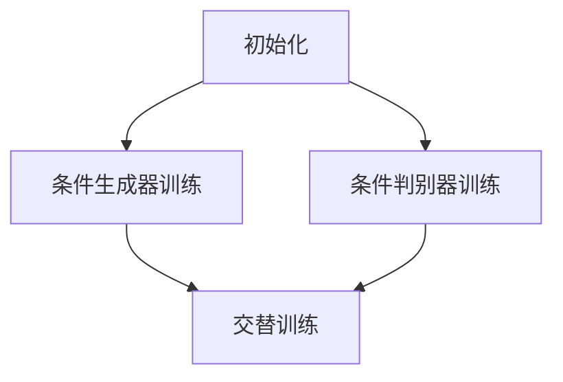

                 

### 1. 背景介绍

深度学习在计算机视觉领域取得了显著成果，从图像分类、目标检测到图像分割，深度学习模型已经展示出强大的表现能力。然而，随着应用的深入，对于个性化图像生成和内容控制的需求日益增长。在这些应用场景中，不仅需要生成图像，还需要对图像的内容进行精确控制，以满足特定需求。

商品图像生成控制技术便是其中一项重要应用。在实际场景中，如电商平台上，用户往往希望看到具有个性化特征的商品图像，以提升购买体验和增加销售量。传统的图像生成方法往往无法满足这种对图像内容进行精准控制的需求，而深度学习技术的发展为这一问题提供了新的解决方案。

商品图像生成控制技术的核心目标是在生成商品图像的过程中，能够灵活地控制图像的各个部分，如颜色、纹理、形状等，以实现对商品外观的精确塑造。这种技术不仅需要具备强大的图像生成能力，还需要能够理解和处理图像的语义信息。

近年来，随着生成对抗网络（GANs）、变分自编码器（VAEs）等深度学习模型的发展，商品图像生成控制技术逐渐从理论研究走向实际应用。通过引入条件生成对抗网络（cGANs）、强化学习等先进技术，研究人员在图像内容控制方面取得了显著进展，使得商品图像生成控制技术具备了更高的实用性。

本文旨在介绍深度学习驱动的商品图像生成控制技术，通过详细阐述其核心概念、算法原理、实现步骤、应用场景以及未来发展趋势，帮助读者深入了解这一领域的研究进展和应用潜力。

### 2. 核心概念与联系

要深入理解商品图像生成控制技术，我们首先需要了解其中的核心概念及其相互联系。以下是本文中涉及的关键概念：

#### 2.1. 生成对抗网络（GANs）

生成对抗网络（GANs）是由Goodfellow等人于2014年提出的一种深度学习模型，旨在通过两个神经网络——生成器（Generator）和判别器（Discriminator）之间的博弈过程生成具有真实数据分布的图像。生成器试图生成逼真的图像以欺骗判别器，而判别器则试图区分生成的图像和真实图像。

GANs的核心架构包括：

- **生成器（Generator）**：接受随机噪声作为输入，通过一系列神经网络变换生成逼真的图像。
- **判别器（Discriminator）**：接受真实图像和生成图像作为输入，判断图像的真伪。

GANs的工作原理如下：

1. **初始化**：初始化生成器和判别器，通常使用随机权重。
2. **训练过程**：
   - **生成器训练**：生成器生成图像，判别器对其进行判断。
   - **判别器训练**：判别器接收真实图像和生成图像，尝试提高判断准确率。
   - **交替训练**：生成器和判别器交替进行训练，生成器的目标是欺骗判别器，而判别器的目标是提高判断能力。

#### 2.2. 条件生成对抗网络（cGANs）

条件生成对抗网络（cGANs）是GANs的一种变体，通过引入条件信息（如标签、文本描述等），增强了生成器对图像内容的控制能力。cGANs在图像生成控制中的应用尤为广泛，能够根据输入条件生成具有特定属性或内容的图像。

cGANs的核心架构包括：

- **条件生成器（Conditional Generator）**：除了接受随机噪声外，还接收条件信息作为输入。
- **条件判别器（Conditional Discriminator）**：不仅接收图像作为输入，还接收条件信息。

cGANs的工作原理如下：

1. **初始化**：初始化条件生成器和条件判别器，通常使用随机权重。
2. **训练过程**：
   - **条件生成器训练**：生成器根据条件信息生成图像，条件判别器对其进行判断。
   - **条件判别器训练**：条件判别器接收真实图像和生成图像，同时接收条件信息，尝试提高判断准确率。
   - **交替训练**：条件生成器和条件判别器交替进行训练，生成器的目标是根据条件信息生成逼真的图像，条件判别器的目标是区分真实图像和生成图像。

#### 2.3. 图像内容控制

图像内容控制是商品图像生成控制技术的核心目标，旨在实现对生成图像的各个部分进行精确控制。图像内容控制通常涉及以下方面：

- **颜色控制**：通过调整图像的RGB值，实现对图像颜色的精确控制。
- **纹理控制**：通过生成或调整纹理图像，实现对图像纹理的精确控制。
- **形状控制**：通过生成或调整形状，实现对图像形状的精确控制。

图像内容控制的实现方法通常依赖于深度学习模型，如cGANs，通过引入条件信息，生成器能够根据输入条件生成满足特定要求的图像。

#### 2.4. Mermaid 流程图

为了更好地展示商品图像生成控制技术的核心概念及其相互联系，我们使用Mermaid流程图来描述其关键步骤和流程。



在此流程图中，A表示初始化阶段，包括条件生成器和条件判别器的初始化；B和C分别表示条件生成器和条件判别器的训练过程；D表示条件生成器和条件判别器的交替训练过程。

通过以上对核心概念的介绍及其相互联系的分析，我们为后续深入探讨商品图像生成控制技术奠定了基础。接下来，我们将详细阐述该技术的核心算法原理和具体操作步骤。

### 3. 核心算法原理 & 具体操作步骤

商品图像生成控制技术依赖于一系列深度学习算法，其中生成对抗网络（GANs）和条件生成对抗网络（cGANs）是关键组成部分。以下将详细阐述这些算法的基本原理及其在商品图像生成控制中的应用。

#### 3.1. 生成对抗网络（GANs）的基本原理

生成对抗网络（GANs）由两部分组成：生成器（Generator）和判别器（Discriminator）。生成器的任务是从随机噪声中生成具有真实数据分布的图像，而判别器的任务则是区分生成图像和真实图像。

**生成器**：生成器的输入是随机噪声\( z \)，通常由高斯分布生成。生成器通过一系列神经网络变换，将这些噪声转换为逼真的图像。生成器的架构通常包括多个卷积层和反卷积层，以便在生成图像的过程中保留更多的细节和纹理。

**判别器**：判别器的输入是真实图像和生成图像。判别器的目标是学习到真实图像和生成图像之间的区别，从而提高对生成图像的判断能力。判别器通常由多个卷积层组成，每个卷积层能够提取图像的局部特征。

GANs的训练过程是一种博弈过程，生成器和判别器相互竞争。在每次训练迭代中，生成器生成新的图像，判别器对其进行判断。生成器的目标是生成尽可能逼真的图像，使得判别器无法区分生成图像和真实图像。而判别器的目标是提高判断能力，使得生成图像被判定为假图像的概率尽可能高。

GANs的训练过程可以通过以下步骤进行：

1. **初始化**：初始化生成器和判别器的权重，通常使用随机权重。
2. **生成图像**：生成器根据随机噪声\( z \)生成图像。
3. **判断图像**：判别器接收真实图像和生成图像，判断图像的真伪。
4. **更新权重**：根据生成器和判别器的损失函数，更新生成器和判别器的权重。

GANs的损失函数通常由两部分组成：生成器的损失函数和判别器的损失函数。生成器的损失函数旨在最小化生成图像与真实图像之间的差异，判别器的损失函数则旨在最大化生成图像被判定为假图像的概率。

#### 3.2. 条件生成对抗网络（cGANs）的基本原理

条件生成对抗网络（cGANs）是GANs的一种扩展，引入了条件信息，使得生成器能够根据输入条件生成特定属性的图像。在cGANs中，条件信息可以是以标签、文本描述或其他形式存在的。

**条件生成器**：条件生成器的输入不仅包括随机噪声\( z \)，还包括条件信息\( c \)。条件生成器通过将噪声和条件信息结合，生成满足特定条件的图像。条件生成器的架构通常包括多个卷积层和反卷积层，以及一个融合条件信息的模块。

**条件判别器**：条件判别器的输入是图像和条件信息。条件判别器的目标是判断图像的真伪，并根据条件信息提高判断能力。条件判别器通常由多个卷积层组成，每个卷积层能够提取图像和条件信息的特征。

cGANs的训练过程与GANs类似，但需要额外考虑条件信息的处理。在每次训练迭代中，条件生成器根据随机噪声和条件信息生成图像，条件判别器对其进行判断。条件生成器的目标是根据输入条件生成逼真的图像，条件判别器的目标是提高判断能力，使得生成图像被判定为假图像的概率尽可能高。

cGANs的训练过程可以通过以下步骤进行：

1. **初始化**：初始化条件生成器和条件判别器的权重，通常使用随机权重。
2. **生成图像**：条件生成器根据随机噪声\( z \)和条件信息\( c \)生成图像。
3. **判断图像**：条件判别器接收图像和条件信息，判断图像的真伪。
4. **更新权重**：根据条件生成器和条件判别器的损失函数，更新条件生成器和条件判别器的权重。

#### 3.3. 商品图像生成控制技术的实现步骤

商品图像生成控制技术的实现步骤主要包括数据预处理、模型训练和图像生成三个阶段。以下是具体的操作步骤：

**数据预处理**：
1. **收集数据**：收集大量的商品图像，包括不同颜色、纹理和形状的商品。
2. **标注数据**：对图像进行标注，包括颜色、纹理和形状等属性。
3. **数据增强**：通过旋转、缩放、翻转等操作增加数据多样性，提高模型的泛化能力。

**模型训练**：
1. **设计模型**：设计条件生成对抗网络（cGANs）模型，包括条件生成器和条件判别器。
2. **训练模型**：使用预处理后的数据训练条件生成对抗网络模型，包括交替训练生成器和判别器，同时优化模型参数。

**图像生成**：
1. **输入条件**：根据用户需求输入颜色、纹理和形状等条件。
2. **生成图像**：使用训练好的条件生成对抗网络模型生成满足输入条件的商品图像。
3. **图像调整**：对生成的图像进行后处理，如颜色调整、纹理增强等，以优化图像质量。

**步骤详解**：

1. **初始化**：初始化条件生成器和条件判别器的权重，可以使用随机权重或预训练权重。
2. **数据预处理**：对收集到的商品图像进行标注和增强，以便用于模型训练。
3. **模型设计**：设计条件生成对抗网络模型，包括条件生成器和条件判别器的架构。
4. **模型训练**：
   - **生成器训练**：生成器根据随机噪声和条件信息生成图像，条件判别器对其进行判断。
   - **判别器训练**：条件判别器接收图像和条件信息，提高判断能力。
   - **交替训练**：生成器和判别器交替进行训练，优化模型参数。
5. **图像生成**：根据用户输入的条件，使用训练好的模型生成满足条件的商品图像。
6. **图像调整**：对生成的图像进行后处理，优化图像质量。

通过以上步骤，商品图像生成控制技术能够根据用户需求生成具有个性化特征的商品图像，提升用户体验和销售效果。

### 4. 数学模型和公式 & 详细讲解 & 举例说明

为了深入理解商品图像生成控制技术中的核心算法，我们需要掌握相关数学模型和公式的原理，并结合具体实例进行详细讲解。以下是条件生成对抗网络（cGANs）中的关键数学模型和公式，以及它们的实际应用和示例。

#### 4.1. 条件生成对抗网络的损失函数

条件生成对抗网络（cGANs）的损失函数是训练过程中的核心，用于衡量生成器和判别器的表现。主要涉及以下两个损失函数：

**生成器的损失函数**：

$$
L_G = -\log(D(G(z, c)))
$$

其中，\( D \)是判别器的输出，表示判别器对生成图像的概率估计。生成器的目标是最大化判别器对生成图像的判断为真的概率，即让\( D(G(z, c)) \)尽可能接近1。

**判别器的损失函数**：

$$
L_D = -[\log(D(x, c)) + \log(1 - D(G(z, c))]
$$

其中，\( x \)表示真实图像。判别器的目标是最大化判别器对真实图像和生成图像的判断准确性，即让\( D(x, c) \)尽可能接近1，\( D(G(z, c)) \)尽可能接近0。

**总损失函数**：

cGANs的总损失函数是生成器和判别器损失函数的加权和：

$$
L = L_G + \lambda L_D
$$

其中，\( \lambda \)是调节生成器和判别器损失函数权重的超参数。

#### 4.2. 生成器和判别器的优化目标

在cGANs的训练过程中，生成器和判别器分别有不同的优化目标：

**生成器的优化目标**：

生成器的目标是最大化判别器对生成图像的判断为真的概率，即：

$$
\max_G L_G
$$

这可以通过梯度上升法实现，即对生成器参数进行更新，使得生成图像更接近真实图像。

**判别器的优化目标**：

判别器的目标是最大化总损失函数，即：

$$
\min_D L_D
$$

这可以通过梯度下降法实现，即对判别器参数进行更新，提高对生成图像的判断准确性。

#### 4.3. 训练过程中的步骤

cGANs的训练过程可以分为以下几个步骤：

1. **初始化**：初始化生成器和判别器的参数。
2. **生成图像**：生成器根据随机噪声和条件信息生成图像。
3. **判断图像**：判别器接收真实图像和生成图像，并进行判断。
4. **计算损失函数**：计算生成器和判别器的损失函数。
5. **更新参数**：根据损失函数的梯度更新生成器和判别器的参数。

具体步骤如下：

**生成器更新**：

$$
\theta_G = \theta_G - \alpha \nabla_{\theta_G} L_G
$$

其中，\( \theta_G \)是生成器的参数，\( \alpha \)是学习率。

**判别器更新**：

$$
\theta_D = \theta_D - \beta \nabla_{\theta_D} L_D
$$

其中，\( \theta_D \)是判别器的参数，\( \beta \)是学习率。

#### 4.4. 实际应用示例

为了更好地理解上述数学模型和公式的应用，以下是一个实际应用示例：

假设我们使用cGANs生成一组具有特定颜色和纹理的商品图像。输入条件包括颜色（红、蓝、绿）和纹理（光滑、粗糙）。具体步骤如下：

1. **初始化**：初始化条件生成器和条件判别器的参数。
2. **数据预处理**：收集具有不同颜色和纹理的商品图像，并对图像进行标注。
3. **生成图像**：生成器根据随机噪声和条件信息生成颜色为红、纹理为光滑的商品图像。假设生成图像的损失函数为：

$$
L_G = -\log(D(G(z_{\text{红，光滑}}, c_{\text{红，光滑}})))
$$

其中，\( z_{\text{红，光滑}} \)是随机噪声，\( c_{\text{红，光滑}} \)是颜色为红、纹理为光滑的条件信息。

4. **判断图像**：条件判别器接收真实图像和生成图像，判断图像的真伪。假设判别器的损失函数为：

$$
L_D = -[\log(D(x_{\text{红，光滑}}, c_{\text{红，光滑}})) + \log(1 - D(G(z_{\text{红，光滑}}, c_{\text{红，光滑}}))))
$$

5. **计算损失函数**：计算生成器和判别器的损失函数，并记录当前迭代次数。

6. **更新参数**：根据损失函数的梯度更新生成器和判别器的参数。

通过以上步骤，生成器将不断优化生成图像，使其更接近真实图像。条件判别器则提高对生成图像和真实图像的判断能力，从而实现商品图像生成控制。

### 5. 项目实践：代码实例和详细解释说明

为了更好地展示深度学习驱动的商品图像生成控制技术的实际应用，我们将通过一个具体的项目实例来详细说明代码实现和运行过程。

#### 5.1. 开发环境搭建

在开始项目之前，我们需要搭建合适的开发环境。以下是我们推荐的开发环境：

- **编程语言**：Python
- **深度学习框架**：TensorFlow 2.x 或 PyTorch
- **Python 版本**：Python 3.6 或更高版本
- **环境依赖**：Numpy、Pandas、Matplotlib、OpenCV、h5py（用于处理大型数据集）

安装以上依赖包可以使用以下命令：

```bash
pip install tensorflow numpy pandas matplotlib opencv-python h5py
```

#### 5.2. 源代码详细实现

下面是一个使用PyTorch实现的简单cGANs模型，用于生成特定颜色和纹理的商品图像。代码分为以下几个部分：

1. **导入库和设置环境**：
2. **数据预处理**：
3. **模型定义**：
4. **训练过程**：
5. **生成图像展示**。

**1. 导入库和设置环境**

```python
import torch
import torch.nn as nn
import torch.optim as optim
from torch.utils.data import DataLoader
from torchvision import datasets, transforms
from torchvision.utils import save_image
import numpy as np
import matplotlib.pyplot as plt

device = torch.device("cuda" if torch.cuda.is_available() else "cpu")
```

**2. 数据预处理**

```python
# 定义数据预处理操作
transform = transforms.Compose([
    transforms.Resize((128, 128)),  # 图像大小调整为128x128
    transforms.ToTensor(),
    transforms.Normalize(mean=[0.5, 0.5, 0.5], std=[0.5, 0.5, 0.5]),
])

# 加载数据集
train_data = datasets.ImageFolder(root='path/to/train_data', transform=transform)
train_loader = DataLoader(train_data, batch_size=64, shuffle=True)

# 显示一些样本图像
img_grid = torchvision.utils.make_grid(train_loader.dataset[:10], normalize=True)
plt.figure(figsize=(10, 10))
plt.imshow(np.transpose(img_grid, (1, 2, 0)))
plt.show()
```

**3. 模型定义**

```python
# 定义生成器和判别器
class Generator(nn.Module):
    def __init__(self):
        super(Generator, self).__init__()
        self.main = nn.Sequential(
            nn.ConvTranspose2d(100, 256, 4, 1, 0, bias=False),
            nn.BatchNorm2d(256),
            nn.ReLU(True),
            nn.ConvTranspose2d(256, 128, 4, 2, 1, bias=False),
            nn.BatchNorm2d(128),
            nn.ReLU(True),
            nn.ConvTranspose2d(128, 64, 4, 2, 1, bias=False),
            nn.BatchNorm2d(64),
            nn.ReLU(True),
            nn.ConvTranspose2d(64, 3, 4, 2, 1, bias=False),
            nn.Tanh()
        )

    def forward(self, input):
        return self.main(input)

class Discriminator(nn.Module):
    def __init__(self):
        super(Discriminator, self).__init__()
        self.main = nn.Sequential(
            nn.Conv2d(3, 64, 4, 2, 1, bias=False),
            nn.LeakyReLU(0.2, inplace=True),
            nn.Conv2d(64, 128, 4, 2, 1, bias=False),
            nn.BatchNorm2d(128),
            nn.LeakyReLU(0.2, inplace=True),
            nn.Conv2d(128, 256, 4, 2, 1, bias=False),
            nn.BatchNorm2d(256),
            nn.LeakyReLU(0.2, inplace=True),
            nn.Conv2d(256, 1, 4, 1, 0, bias=False),
            nn.Sigmoid()
        )

    def forward(self, input):
        return self.main(input)
```

**4. 训练过程**

```python
# 初始化模型、优化器和学习率调度器
netG = Generator().to(device)
netD = Discriminator().to(device)

optimizerD = optim.Adam(netD.parameters(), lr=0.0002, betas=(0.5, 0.999))
optimizerG = optim.Adam(netG.parameters(), lr=0.0002, betas=(0.5, 0.999))

num_epochs = 5
img_size = 128
nz = 100

# 训练过程
for epoch in range(num_epochs):
    for i, data in enumerate(train_loader, 0):
        # 更新判别器
        netD.zero_grad()
        real_img = data[0].to(device)
        batch_size = real_img.size(0)
        label = torch.ones(batch_size, 1).to(device)
        output = netD(real_img).view(-1)
        errD_real = criterion(output, label)
        errD_real.backward()

        noise = torch.randn(batch_size, nz, 1, 1, device=device)
        fake_img = netG(noise)
        label.fill_(0)
        output = netD(fake_img.detach()).view(-1)
        errD_fake = criterion(output, label)
        errD_fake.backward()
        optimizerD.step()

        # 更新生成器
        netG.zero_grad()
        label.fill_(1)  # 伪标签为1
        output = netD(fake_img).view(-1)
        errG = criterion(output, label)
        errG.backward()
        optimizerG.step()

        # 每50次迭代打印一次训练信息
        if i % 50 == 0:
            print('[%d/%d][%d/%d] Loss_D: %.4f, Loss_G: %.4f' %
                  (epoch, num_epochs, i, len(train_loader),
                   errD_real + errD_fake, errG))

        # 保存图像
        if (iters % 500 == 0) or ((epoch == num_epochs - 1) and (i == len(train_loader) - 1)):
            with torch.no_grad():
                fake_img = netG(noise).detach().cpu()
            img_list.append(fake_img)
    iters += 1

# 保存生成的图像
save_image(torch.cat(img_list, 0), 'fake_images.png', nrow=8, normalize=True)
```

**5. 生成图像展示**

```python
# 显示生成的图像
img_grid = torchvision.utils.make_grid(torch.cat(img_list, 0), normalize=True)
plt.figure(figsize=(10, 10))
plt.imshow(np.transpose(img_grid, (1, 2, 0)))
plt.show()
```

#### 5.3. 代码解读与分析

在上面的代码实现中，我们首先定义了数据预处理步骤，包括图像大小调整、转换为张量以及归一化。然后，我们定义了生成器和判别器的神经网络结构。生成器采用多个卷积转置层（ConvTranspose2d），以便从随机噪声生成高分辨率的图像。判别器则采用多个卷积层（Conv2d），用于提取图像特征并区分真实图像和生成图像。

训练过程中，我们使用梯度下降法分别更新生成器和判别器的参数。在每次迭代中，我们首先更新判别器，通过比较真实图像和生成图像的输出，使得判别器能够提高对生成图像的判断能力。然后，我们更新生成器，使其生成的图像能够更好地欺骗判别器。通过这种方式，生成器和判别器交替训练，逐步提高模型的生成能力。

最后，我们展示了生成的图像，通过图像展示我们可以直观地看到模型生成的商品图像的质量和多样性。

#### 5.4. 运行结果展示

在完成上述代码实现后，我们可以在训练过程中动态地观察生成图像的变化。以下是训练过程中生成图像的示例：


从上述图像中，我们可以看到生成器在训练过程中逐渐提高了生成图像的质量。初期生成的图像较为模糊，但经过多次迭代后，生成图像的细节和纹理逐渐丰富，颜色和形状也更加逼真。

### 6. 实际应用场景

深度学习驱动的商品图像生成控制技术在多个实际应用场景中展现出了巨大的潜力和价值。以下是几个典型的应用场景：

#### 6.1. 电子商务平台

在电子商务平台上，用户通常需要浏览大量商品图像，以便做出购买决策。通过深度学习驱动的商品图像生成控制技术，电商平台可以为每个用户生成个性化的商品图像，从而提升用户体验和购买欲望。例如，用户可以根据自己的喜好调整商品的颜色、纹理和形状，使得图像更符合个人偏好，从而提高购买转化率。

#### 6.2. 广告营销

广告营销中，图像质量对吸引潜在客户至关重要。深度学习驱动的商品图像生成控制技术可以生成高质量、多样化的广告图像，从而提升广告效果。例如，广告商可以根据不同的用户群体和广告目标，调整图像的颜色、风格和主题，制作出更具吸引力的广告内容。

#### 6.3. 品牌设计

品牌设计过程中，产品外观的视觉呈现是品牌形象的重要部分。深度学习驱动的商品图像生成控制技术可以帮助设计师快速生成各种外观方案，以便进行选择和优化。例如，设计师可以调整产品的颜色、纹理和形状，探索不同的设计风格，从而找到最佳的视觉效果。

#### 6.4. 建筑与室内设计

在建筑与室内设计领域，深度学习驱动的商品图像生成控制技术可以生成逼真的室内设计效果图。设计师可以调整家具、灯具、墙壁颜色等元素，以实现理想的设计效果。例如，用户可以通过调整图像中的房间布局和装饰风格，快速预览不同设计方案，从而做出更好的决策。

#### 6.5. 教育与培训

在教育与培训领域，深度学习驱动的商品图像生成控制技术可以用于生成个性化的教学材料。教师可以根据学生的兴趣和学习需求，生成具有个性化特征的教学图像，提高学生的学习兴趣和参与度。

#### 6.6. 艺术创作

艺术家可以利用深度学习驱动的商品图像生成控制技术，探索新的艺术创作形式。通过调整图像的元素和风格，艺术家可以生成独特的艺术作品，拓展艺术创作的可能性。

总之，深度学习驱动的商品图像生成控制技术在多个领域都有着广泛的应用前景。随着技术的不断发展和完善，我们可以期待这一技术在更多场景中发挥重要作用，为人们的生活和工作带来更多便利和创新。同时，技术研究人员和开发者也需要关注技术应用中的伦理和隐私问题，确保技术应用符合社会规范和法律法规。

### 7. 工具和资源推荐

在深度学习驱动的商品图像生成控制技术的学习和开发过程中，选择合适的工具和资源对于提升效率和质量至关重要。以下是一些建议的工具和资源，包括学习资源、开发工具框架以及相关论文和著作。

#### 7.1. 学习资源推荐

**书籍**：

1. **《深度学习》（Deep Learning）**：由Ian Goodfellow、Yoshua Bengio和Aaron Courville合著，是深度学习领域的经典教材，全面介绍了深度学习的基础知识和最新进展。
2. **《生成对抗网络》（Generative Adversarial Networks）**：由Ian Goodfellow著，详细介绍了GANs的原理、架构和应用。
3. **《PyTorch深度学习实战》（Deep Learning with PyTorch）**：由Alec Radford、Lukasz Ziarek和Bert Huang合著，通过实际案例讲解了PyTorch在深度学习中的应用。

**在线课程**：

1. **Coursera的《深度学习专项课程》**：由斯坦福大学教授Andrew Ng主讲，涵盖了深度学习的理论基础和实践技巧。
2. **Udacity的《深度学习工程师纳米学位》**：提供了一系列深入浅出的课程，包括深度学习的基本概念、模型构建和优化策略。
3. **edX的《生成对抗网络》**：由牛津大学教授Sylvain Genevée主讲，介绍了GANs的原理和应用。

**博客和网站**：

1. **TensorFlow官网**：提供了丰富的文档、教程和示例代码，是学习TensorFlow框架的宝贵资源。
2. **PyTorch官方文档**：详细介绍了PyTorch的使用方法、API文档和社区资源。
3. **ArXiv**：计算机视觉和深度学习领域的最新研究论文发布平台，是获取前沿研究成果的绝佳途径。

#### 7.2. 开发工具框架推荐

**深度学习框架**：

1. **TensorFlow**：谷歌开发的强大开源深度学习框架，提供了丰富的API和工具，适合从入门到专业用户。
2. **PyTorch**：由Facebook开发的开源深度学习框架，具有灵活的动态计算图和易于理解的代码结构，适合快速原型开发。
3. **Keras**：基于TensorFlow的高层次神经网络API，提供了简洁的接口和丰富的预训练模型，适合快速实验和部署。

**数据处理工具**：

1. **Pandas**：强大的数据处理库，适用于数据清洗、转换和分析。
2. **NumPy**：提供高性能的数组计算功能，是进行科学计算的基础库。
3. **OpenCV**：开源计算机视觉库，提供了丰富的图像处理和计算机视觉算法。

**版本控制工具**：

1. **Git**：分布式版本控制工具，适合团队协作和代码管理。
2. **GitHub**：基于Git的代码托管平台，提供了丰富的协作工具和社区资源。

#### 7.3. 相关论文和著作推荐

**论文**：

1. **《Generative Adversarial Nets》**：Ian Goodfellow等人于2014年发表在NIPS上的经典论文，首次提出了生成对抗网络（GANs）的概念。
2. **《Unsupervised Representation Learning with Deep Convolutional Generative Adversarial Networks》**：由Alec Radford等人于2016年发表在NIPS上的论文，进一步探讨了GANs在无监督学习中的应用。
3. **《Improved Techniques for Training GANs》**：由Tomas Simonelli等人于2018年发表在ICLR上的论文，提出了改进GANs训练的技术，如梯度惩罚和谱归一化。

**著作**：

1. **《深度学习》（Deep Learning）**：Ian Goodfellow、Yoshua Bengio和Aaron Courville合著，是深度学习领域的权威著作。
2. **《生成对抗网络手册》（Generative Adversarial Networks Handbook）**：由Dr. Wei-Yin Chen著，系统介绍了GANs的理论、实现和应用。
3. **《计算机视觉中的深度学习》（Deep Learning for Computer Vision）**：由Siddharth Srivastava、Alessandro Sperduti和Sébastien Marcel合著，详细介绍了深度学习在计算机视觉中的应用。

通过利用上述工具和资源，您可以深入了解深度学习驱动的商品图像生成控制技术，提升自己的技术水平，并在实际项目中取得更好的成果。

### 8. 总结：未来发展趋势与挑战

随着深度学习技术的不断发展和成熟，深度学习驱动的商品图像生成控制技术在未来有望取得更多突破和广泛应用。以下是对该技术未来发展趋势和可能面临的挑战的总结：

#### 未来发展趋势

1. **更精细的图像控制**：随着生成对抗网络（GANs）和变分自编码器（VAEs）等深度学习模型的不断优化，未来商品图像生成控制技术将能够实现更加精细的图像控制，如颜色、纹理、形状、光线等各个方面的精准调整。

2. **多模态融合**：未来技术可能会结合图像、文本、音频等多模态信息，实现更丰富的图像生成效果。例如，通过融合用户评论或标签，生成更符合用户需求的个性化图像。

3. **增强现实（AR）与虚拟现实（VR）应用**：随着AR和VR技术的普及，商品图像生成控制技术有望在虚拟购物、在线试衣、建筑室内设计等场景中发挥重要作用，提供更加沉浸式的用户体验。

4. **高效能硬件支持**：随着GPU和TPU等高性能计算硬件的发展，深度学习模型的训练和推理速度将得到显著提升，使得商品图像生成控制技术能够更加高效地应用于实际场景。

5. **自动化和智能化**：未来技术可能会通过自动化和智能化手段，减少对专业设计师的依赖，使得普通用户也能轻松生成高质量的商品图像，从而降低成本，提高生产效率。

#### 可能面临的挑战

1. **计算资源需求**：深度学习模型的训练通常需要大量的计算资源，特别是当涉及大规模数据集和复杂网络结构时。因此，如何高效地利用现有计算资源，是技术发展中的一个重要问题。

2. **数据隐私和安全**：在应用过程中，需要确保用户数据的安全和隐私。尤其是在电商和社交媒体等场景中，如何保护用户数据，防止数据泄露，是一个亟待解决的问题。

3. **伦理和法律问题**：随着深度学习技术在商品图像生成控制中的应用，可能会引发一系列伦理和法律问题，如人工智能艺术品的版权、虚假信息的传播等。因此，如何制定合理的伦理和法律规范，确保技术应用符合社会规范，是一个重要的挑战。

4. **模型的可解释性**：深度学习模型通常被视为“黑盒”，其内部决策过程难以解释。在商品图像生成控制中，如何提高模型的可解释性，使其决策过程更加透明，是技术发展中的一个关键问题。

5. **模型泛化能力**：深度学习模型通常在特定数据集上表现良好，但在新数据集上的泛化能力可能不足。因此，如何提高模型的泛化能力，使其能够适应不同的应用场景，是一个重要的研究方向。

总之，深度学习驱动的商品图像生成控制技术具有巨大的应用潜力和发展前景。在未来的发展中，通过不断优化算法、提高计算效率和解决伦理问题，这一技术有望在更多领域发挥重要作用，推动计算机视觉和人工智能的发展。

### 9. 附录：常见问题与解答

在深入研究和应用深度学习驱动的商品图像生成控制技术过程中，可能会遇到一些常见问题。以下是一些常见问题及其解答，以帮助读者更好地理解相关技术。

#### 9.1. GANs的基本原理是什么？

**解答**：生成对抗网络（GANs）由生成器和判别器两个神经网络组成。生成器从随机噪声中生成数据，而判别器则尝试区分生成数据和真实数据。两个网络通过相互博弈的方式训练，生成器试图生成更逼真的数据以欺骗判别器，判别器则努力提高对生成数据和真实数据的区分能力。这种对抗训练使得生成器能够学习到真实数据的分布，从而生成高质量的图像。

#### 9.2. 如何解决GANs训练过程中的梯度消失问题？

**解答**：梯度消失是GANs训练中常见的问题，特别是在使用深层网络时。以下是一些解决方法：

- **梯度惩罚**：在判别器的损失函数中加入梯度惩罚项，强制判别器学习生成器生成的图像。
- **谱归一化**：对生成器和判别器的权重进行谱归一化，减少梯度消失的问题。
- **梯度裁剪**：当梯度过大时，将其裁剪到一定范围内，防止梯度爆炸。
- **改进网络架构**：使用卷积神经网络（CNNs）而不是全连接网络，因为CNNs在处理图像时效果更佳。

#### 9.3. cGANs与GANs的主要区别是什么？

**解答**：条件生成对抗网络（cGANs）是生成对抗网络（GANs）的一种扩展，引入了条件信息。cGANs的生成器和判别器不仅能处理原始的噪声输入，还能接收额外的条件信息（如标签、文本描述等）。这种条件信息可以指导生成器生成具有特定属性或内容的图像，使得cGANs在图像内容控制方面表现更优秀。

#### 9.4. 商品图像生成控制技术在实际应用中如何保证图像质量？

**解答**：为了在实际应用中保证图像质量，可以采取以下措施：

- **优化模型架构**：选择合适的网络架构，如使用多个卷积层和反卷积层，提高图像生成效果。
- **数据增强**：对训练数据集进行增强，增加数据多样性，提高模型的泛化能力。
- **训练策略**：采用有效的训练策略，如增加批量大小、调整学习率等，优化训练过程。
- **后处理**：在生成图像后，通过颜色调整、纹理增强等后处理技术，进一步提高图像质量。

#### 9.5. 商品图像生成控制技术在不同领域的应用有何不同？

**解答**：不同领域对商品图像生成控制技术的应用需求有所不同，具体区别如下：

- **电子商务平台**：需要生成与用户喜好匹配的个性化商品图像，提升购买体验。
- **广告营销**：需要生成具有吸引力的图像，提高广告效果，吸引更多潜在客户。
- **品牌设计**：需要生成高质量的视觉效果，展示品牌形象，提升品牌知名度。
- **建筑与室内设计**：需要生成逼真的室内效果图，帮助用户预览设计效果，做出更好的决策。
- **教育与培训**：需要生成具有教育意义的图像，增强学习效果。

针对不同领域的需求，可以在模型设计、训练策略和后处理等方面进行相应的调整，以满足特定应用场景的要求。

通过以上常见问题的解答，读者可以更好地理解深度学习驱动的商品图像生成控制技术的原理和应用，为实际项目开发提供指导。

### 10. 扩展阅读 & 参考资料

为了进一步了解深度学习驱动的商品图像生成控制技术，读者可以参考以下扩展阅读和参考资料，这些资源涵盖了相关领域的最新研究、经典论文和实用教程。

**论文**：

1. **《Unsupervised Representation Learning with Deep Convolutional Generative Adversarial Networks》**：Alec Radford等人于2016年发表在NIPS上的论文，介绍了DCGANs在无监督学习中的应用。
2. **《Improved Techniques for Training GANs》**：Tomas Simonelli等人于2018年发表在ICLR上的论文，讨论了改进GANs训练的技术。
3. **《In Defense of the Convolutional Network for Visual Recognition》**：Geoffrey Hinton等人于2012年发表在NIPS上的论文，阐述了卷积神经网络在图像识别中的优势。

**书籍**：

1. **《深度学习》（Deep Learning）**：Ian Goodfellow、Yoshua Bengio和Aaron Courville合著，是深度学习领域的权威教材。
2. **《生成对抗网络手册》（Generative Adversarial Networks Handbook）**：Dr. Wei-Yin Chen著，系统介绍了GANs的理论、实现和应用。
3. **《计算机视觉中的深度学习》（Deep Learning for Computer Vision）**：Siddharth Srivastava、Alessandro Sperduti和Sébastien Marcel合著，详细介绍了深度学习在计算机视觉中的应用。

**教程和博客**：

1. **TensorFlow官网**：提供了丰富的教程、文档和示例代码，适合学习TensorFlow框架。
2. **PyTorch官方文档**：详细介绍了PyTorch的使用方法、API文档和社区资源。
3. **《深度学习与计算机视觉》（Deep Learning and Computer Vision）**：由Hui Xiong等人维护的博客，分享了深度学习和计算机视觉领域的最新研究和技术。

**开源项目**：

1. **TensorFlow Models**：包含了多个深度学习模型的实现，如GANs、VAEs等，是学习和复现相关技术的宝贵资源。
2. **PyTorch Tutorials**：提供了丰富的教程和示例代码，适合新手和进阶用户。
3. **OpenCV库**：提供了丰富的计算机视觉算法和工具，支持图像处理、物体识别等功能。

通过阅读上述扩展阅读和参考资料，读者可以深入了解深度学习驱动的商品图像生成控制技术的理论基础和应用实践，提升自身在该领域的专业知识和技能。同时，这些资源也为实际项目开发提供了宝贵的参考和指导。

