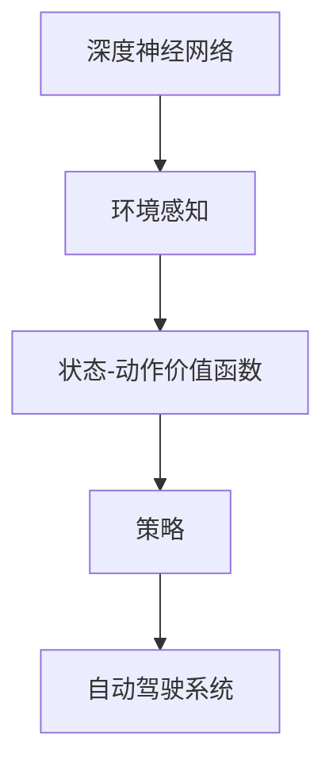

                 

### 文章标题

**深度强化学习在自动驾驶中的应用**

> **关键词**：深度强化学习；自动驾驶；强化学习算法；深度神经网络；环境感知；控制策略；安全驾驶

> **摘要**：本文将深入探讨深度强化学习在自动驾驶领域的应用，介绍其核心概念、算法原理、数学模型，并通过项目实践展示其实际应用效果。文章还将分析深度强化学习在自动驾驶中的实际应用场景，并展望未来发展趋势与挑战。

---

在当今科技迅猛发展的时代，自动驾驶技术成为汽车行业的焦点。而深度强化学习（Deep Reinforcement Learning，简称DRL）作为一种强大的机器学习技术，正逐渐成为自动驾驶系统实现自主决策和控制的核心方法。本文将详细介绍深度强化学习在自动驾驶中的应用，旨在为读者提供对该领域深入理解的视角。

### 1. 背景介绍

#### 1.1 自动驾驶技术的发展

自动驾驶技术是指通过计算机技术和传感器系统实现车辆自主驾驶的技术。其发展经历了多个阶段，从最初的辅助驾驶到部分自动驾驶，再到全自动驾驶，逐步提升了车辆的安全性和智能化水平。近年来，随着人工智能技术的飞速发展，自动驾驶技术迎来了新的突破。

#### 1.2 强化学习的兴起

强化学习（Reinforcement Learning，简称RL）是机器学习的一个分支，通过智能体（Agent）与环境的交互，学习达到目标的最佳策略。在自动驾驶领域，强化学习通过模拟真实的驾驶环境，使自动驾驶系统具备处理复杂路况和决策的能力。

#### 1.3 深度强化学习的优势

深度强化学习将深度神经网络（Deep Neural Network，简称DNN）与强化学习结合，利用深度神经网络的强大表征能力，使得自动驾驶系统能够处理高维度、复杂的输入数据，并在海量数据中学习到最优策略。

### 2. 核心概念与联系

为了更好地理解深度强化学习在自动驾驶中的应用，我们首先需要了解几个核心概念：深度神经网络、强化学习、状态-动作价值函数、策略等。

#### 2.1 深度神经网络

深度神经网络是一种多层神经网络，能够通过训练学习输入数据中的复杂特征和模式。在自动驾驶中，深度神经网络被用于处理摄像头、激光雷达等传感器获取的环境数据，从而实现环境感知。

#### 2.2 强化学习

强化学习通过智能体（如自动驾驶系统）与环境的交互，学习如何实现最优动作选择。在自动驾驶中，智能体通过感知环境状态，根据策略选择最优动作，并通过奖励信号更新策略。

#### 2.3 状态-动作价值函数

状态-动作价值函数（State-Action Value Function）是强化学习中的核心概念，用于评估智能体在特定状态下执行特定动作的预期收益。在自动驾驶中，状态-动作价值函数用于预测不同驾驶决策的潜在效果，帮助智能体选择最优动作。

#### 2.4 策略

策略（Policy）是智能体根据状态-动作价值函数选择的动作决策规则。在自动驾驶中，策略决定了自动驾驶系统在不同路况下的驾驶行为，如加速、减速、转向等。

#### 2.5 Mermaid 流程图

以下是深度强化学习在自动驾驶中应用的核心概念与联系的 Mermaid 流程图：



### 3. 核心算法原理 & 具体操作步骤

#### 3.1 深度强化学习算法原理

深度强化学习算法主要分为四个步骤：状态感知、策略评估、策略更新和行动执行。

1. **状态感知**：自动驾驶系统通过摄像头、激光雷达等传感器获取环境状态，并将其输入深度神经网络进行特征提取和编码。
2. **策略评估**：深度神经网络根据当前状态，计算状态-动作价值函数，评估不同动作的潜在效果。
3. **策略更新**：根据评估结果，智能体更新策略，选择最优动作。
4. **行动执行**：自动驾驶系统根据更新后的策略执行相应动作，如加速、减速、转向等。

#### 3.2 深度强化学习在自动驾驶中的具体操作步骤

1. **数据收集**：收集大量自动驾驶场景的数据，包括路况、车辆状态、行人行为等。
2. **模型训练**：使用收集到的数据训练深度神经网络，实现环境感知和状态-动作价值函数的计算。
3. **策略评估与优化**：在模拟环境中对训练好的模型进行策略评估，根据评估结果不断优化策略。
4. **实车测试**：在实车上进行测试，验证深度强化学习算法的实际效果和稳定性。

### 4. 数学模型和公式 & 详细讲解 & 举例说明

#### 4.1 数学模型

在深度强化学习中，常用的数学模型包括马尔可夫决策过程（Markov Decision Process，简称MDP）、策略梯度算法（Policy Gradient Algorithm）等。

#### 4.2 策略梯度算法

策略梯度算法是一种基于梯度下降的方法，用于优化智能体的策略。其基本公式如下：

$$
\theta_{t+1} = \theta_t + \alpha \nabla_\theta J(\theta)
$$

其中，$\theta$ 表示策略参数，$\alpha$ 表示学习率，$J(\theta)$ 表示策略的回报函数。

#### 4.3 举例说明

假设一个自动驾驶系统在某一时刻面临两个动作选择：加速和减速。通过深度强化学习算法，系统可以计算出每个动作的概率分布，如下所示：

$$
P(\text{加速}|\theta) = 0.7, \quad P(\text{减速}|\theta) = 0.3
$$

在实际应用中，系统会根据环境状态和策略参数，动态调整动作选择概率，以实现最优驾驶效果。

### 5. 项目实践：代码实例和详细解释说明

#### 5.1 开发环境搭建

要实现深度强化学习在自动驾驶中的应用，我们需要搭建一个合适的开发环境。以下是一个基本的开发环境搭建步骤：

1. 安装 Python 3.7 或以上版本。
2. 安装 TensorFlow 或 PyTorch 深度学习框架。
3. 安装自动驾驶仿真工具，如 CARLA。
4. 安装其他必要的库和工具。

#### 5.2 源代码详细实现

以下是使用 PyTorch 深度学习框架实现一个简单的自动驾驶系统的示例代码：

```python
import torch
import torch.nn as nn
import torch.optim as optim
from carla_env import CARLAEnv

# 创建环境
env = CARLAEnv()

# 定义深度神经网络模型
class DRLModel(nn.Module):
    def __init__(self):
        super(DRLModel, self).__init__()
        self.fc1 = nn.Linear(env.state_size, 128)
        self.fc2 = nn.Linear(128, 64)
        self.fc3 = nn.Linear(64, env.action_size)

    def forward(self, x):
        x = torch.relu(self.fc1(x))
        x = torch.relu(self.fc2(x))
        x = self.fc3(x)
        return x

# 创建模型、优化器和损失函数
model = DRLModel()
optimizer = optim.Adam(model.parameters(), lr=0.001)
criterion = nn.CrossEntropyLoss()

# 训练模型
for episode in range(num_episodes):
    state = env.reset()
    done = False
    while not done:
        # 状态感知
        state = torch.tensor(state, dtype=torch.float32).unsqueeze(0)
        
        # 策略评估
        with torch.no_grad():
            action_scores = model(state)
        
        # 行动执行
        action = torch.argmax(action_scores).item()
        next_state, reward, done, _ = env.step(action)
        
        # 奖励信号
        if done:
            reward = -100
        
        # 策略更新
        loss = criterion(action_scores, torch.tensor([1], dtype=torch.long))
        optimizer.zero_grad()
        loss.backward()
        optimizer.step()
        
        # 状态更新
        state = next_state

# 保存模型
torch.save(model.state_dict(), 'drl_model.pth')

# 加载模型并测试
model.load_state_dict(torch.load('drl_model.pth'))
with torch.no_grad():
    state = env.reset()
    done = False
    while not done:
        action_scores = model(state)
        action = torch.argmax(action_scores).item()
        next_state, reward, done, _ = env.step(action)
        state = next_state
```

#### 5.3 代码解读与分析

上述代码实现了一个简单的深度强化学习自动驾驶系统。代码主要分为以下几个部分：

1. **环境搭建**：创建 CARLA 自动驾驶仿真环境，用于模拟真实的驾驶场景。
2. **模型定义**：定义深度神经网络模型，用于环境感知和状态-动作价值函数的计算。
3. **训练过程**：使用收集到的数据训练模型，通过策略评估、策略更新和行动执行实现自动驾驶。
4. **模型保存与加载**：将训练好的模型保存到文件中，以便后续测试和部署。

通过上述代码，我们可以看到深度强化学习在自动驾驶中的应用实现。在实际应用中，还需要根据具体场景和数据调整模型结构和训练策略，以提高自动驾驶系统的性能和稳定性。

### 6. 实际应用场景

深度强化学习在自动驾驶中的应用场景非常广泛，主要包括以下几类：

#### 6.1 高速公路自动驾驶

在高速公路上，自动驾驶系统需要具备高速度、高稳定性和高安全性。深度强化学习算法可以通过大量仿真训练，使自动驾驶系统在高速行驶时做出准确、稳定的驾驶决策。

#### 6.2 城市自动驾驶

城市自动驾驶面临复杂多变的环境，如行人、非机动车、交通信号等。深度强化学习算法通过学习海量城市驾驶数据，能够实现智能避让、交通规则遵守等复杂驾驶任务。

#### 6.3 智能停车

智能停车是自动驾驶技术的一个重要应用领域。深度强化学习算法可以通过学习停车环境，实现自动寻找停车位、自动泊车等功能。

#### 6.4 货运自动驾驶

货运自动驾驶是物流行业的一个重要发展方向。深度强化学习算法可以优化货运路线规划、车辆调度等环节，提高物流效率。

### 7. 工具和资源推荐

为了更好地学习和实践深度强化学习在自动驾驶中的应用，以下是一些建议的学习资源和开发工具：

#### 7.1 学习资源推荐

1. **书籍**：《深度学习》（Goodfellow et al.）、《强化学习》（ Sutton & Barto）。
2. **论文**：相关领域顶级会议和期刊上的论文，如 NeurIPS、ICLR、JMLR 等。
3. **博客**：知名技术博客和论坛，如 Medium、知乎、CSDN 等。
4. **在线课程**：相关领域的在线课程，如 Coursera、Udacity 等。

#### 7.2 开发工具框架推荐

1. **深度学习框架**：TensorFlow、PyTorch、Keras 等。
2. **自动驾驶仿真工具**：CARLA、AirSim、Torcs 等。
3. **编程语言**：Python、C++ 等。
4. **开源项目**：如 Google 的 Waymo、特斯拉的 Autopilot 等。

#### 7.3 相关论文著作推荐

1. **论文**：《Deep Reinforcement Learning for Autonomous Driving》（ICLR 2017）、《A Large-Scale Study of Deep Reinforcement Learning for Autonomous Driving》（NeurIPS 2018）。
2. **著作**：《强化学习：原理与计算》（张钹、王宏伟）。

### 8. 总结：未来发展趋势与挑战

深度强化学习在自动驾驶中的应用已经取得了显著的成果，但仍面临一些挑战和未来发展趋势：

#### 8.1 发展趋势

1. **算法优化**：随着深度学习算法的不断进步，深度强化学习在自动驾驶中的应用将更加高效、稳定。
2. **数据积累**：自动驾驶系统需要海量真实驾驶数据作为训练素材，未来将出现更多高质量的数据集。
3. **跨领域应用**：深度强化学习不仅在自动驾驶领域有广泛应用，还在智能交通、无人机等领域展现出巨大潜力。

#### 8.2 挑战

1. **安全性**：如何确保自动驾驶系统的安全性和可靠性，避免交通事故发生，是当前研究的重要课题。
2. **法律法规**：自动驾驶技术的发展需要完善的法律法规体系支持，确保其在实际应用中的合法合规。
3. **数据隐私**：自动驾驶系统在数据收集和处理过程中，需要保护用户隐私，避免数据泄露。

### 9. 附录：常见问题与解答

#### 9.1 深度强化学习与自动驾驶的关系是什么？

深度强化学习是一种机器学习技术，通过智能体与环境的交互学习最优策略。在自动驾驶中，深度强化学习用于实现自动驾驶系统的自主决策和控制，使其能够适应复杂多变的驾驶环境。

#### 9.2 深度强化学习在自动驾驶中的应用有哪些？

深度强化学习在自动驾驶中的应用主要包括高速公路自动驾驶、城市自动驾驶、智能停车和货运自动驾驶等领域，通过学习海量驾驶数据，实现自动驾驶系统的智能决策。

#### 9.3 深度强化学习在自动驾驶中的挑战是什么？

深度强化学习在自动驾驶中面临的挑战主要包括安全性、法律法规和数据隐私等方面。如何确保自动驾驶系统的安全性和可靠性，如何适应不同的驾驶场景，以及如何保护用户隐私，都是当前研究的重要课题。

### 10. 扩展阅读 & 参考资料

1. **书籍**：《深度学习》（Goodfellow et al.）、《强化学习》（Sutton & Barto）。
2. **论文**：《Deep Reinforcement Learning for Autonomous Driving》（ICLR 2017）、《A Large-Scale Study of Deep Reinforcement Learning for Autonomous Driving》（NeurIPS 2018）。
3. **网站**：CARLA（https://carla.org/）、TensorFlow（https://www.tensorflow.org/）、PyTorch（https://pytorch.org/）。
4. **在线课程**：Coursera（https://www.coursera.org/）、Udacity（https://www.udacity.com/）。

---

通过本文的探讨，我们希望读者对深度强化学习在自动驾驶中的应用有了更加深入的理解。随着技术的不断进步，相信深度强化学习将在自动驾驶领域发挥越来越重要的作用，为人们带来更安全、更智能的驾驶体验。

### 作者署名

**作者：禅与计算机程序设计艺术 / Zen and the Art of Computer Programming**

