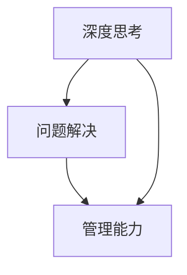

                 

### 文章标题

《深度思考与管理问题解决能力的提升》

> 关键词：深度思考、问题解决、管理能力、技术博客、计算机图灵奖、算法原理

> 摘要：本文通过深入探讨深度思考和问题解决能力的本质，结合计算机领域的实际案例，提出了提升管理问题解决能力的方法和策略。文章结构清晰，逻辑严密，旨在帮助读者理解深度思考的重要性，并提供实用的技能和工具，以应对复杂的技术和管理挑战。

### 1. 背景介绍

在当今高速发展的技术时代，计算机科学已经成为推动社会进步的关键力量。作为计算机领域的从业者，无论是程序员、软件工程师还是CTO，都需要具备强大的深度思考能力和高效的问题解决能力。然而，随着问题的复杂性和技术的日益迭代，单纯的技术知识已不足以应对日益多样化的挑战。管理问题解决能力的提升，成为每个IT从业者必备的素质。

本文旨在探讨如何通过深度思考和科学的方法，提升管理问题解决能力。我们将首先回顾深度思考的定义和重要性，然后深入分析问题解决的过程和方法，最后结合具体案例，提供实用的指导和建议。通过本文的学习，读者将能够更好地理解深度思考的原理，掌握有效的解决问题的策略，从而提升个人和团队的整体管理能力。

### 2. 核心概念与联系

要提升管理问题解决能力，首先需要明确几个核心概念，它们彼此联系，共同构成了深度思考和问题解决的基石。

#### 2.1 深度思考

深度思考是指对问题进行深入分析和综合推理的能力。它与浅层思考相对，后者往往停留在问题的表面，缺乏对本质的理解。深度思考不仅要求对事实和数据的精确分析，还需要逻辑推理和创造性思维。它是解决复杂问题的关键。

#### 2.2 问题解决

问题解决是指通过一系列步骤和方法，从问题的提出到解决方案的制定和实施。问题解决的过程通常包括以下几个阶段：问题识别、信息收集、方案制定、方案评估和实施监控。每个阶段都要求深度思考和系统化的分析方法。

#### 2.3 管理能力

管理能力是指对资源进行有效配置、协调和组织，以实现特定目标的能力。在IT领域，管理能力不仅包括技术层面的管理，还涉及团队管理、项目管理等多个维度。提升管理能力有助于提高问题解决的效率和效果。

#### 2.4 Mermaid 流程图

以下是一个简化的Mermaid流程图，展示了深度思考、问题解决和管理能力之间的联系。



在这个流程图中，深度思考和问题解决是提升管理能力的基础。通过深度思考，我们可以更好地识别和定义问题，从而设计出有效的解决方案。而管理能力则确保这些解决方案能够得到有效执行和持续优化。

### 3. 核心算法原理 & 具体操作步骤

在深入理解和应用深度思考和问题解决方法之前，我们需要掌握一些核心算法原理和操作步骤。以下是一些在计算机科学中广泛应用的核心算法，它们不仅有助于我们更好地理解问题的本质，还能提高问题解决的效率。

#### 3.1 分治算法

分治算法是一种常用的算法设计范式，其核心思想是将一个复杂问题分解成若干个规模较小的相同问题，递归地解决这些子问题，然后将子问题的解合并为原问题的解。

具体操作步骤如下：

1. **分解**：将原问题划分为若干个规模较小的子问题。
2. **递归**：对每个子问题递归应用分治算法。
3. **合并**：将子问题的解合并为原问题的解。

例如，快速排序算法就是分治算法的一个典型应用。在快速排序中，我们首先选择一个基准元素，然后将数组分为两个子数组，一个包含小于基准元素的元素，另一个包含大于基准元素的元素。接着，递归地对这两个子数组进行排序，并将结果合并。

#### 3.2 动态规划

动态规划是一种用于求解优化问题的算法方法，其核心思想是将复杂问题分解为一系列相互重叠的子问题，并保存子问题的解，以避免重复计算。

具体操作步骤如下：

1. **定义状态**：确定问题中的状态变量，并定义状态转移方程。
2. **初始化边界条件**：对初始状态进行初始化。
3. **填表**：根据状态转移方程，依次计算每个状态的最优解，并将其填入表中。
4. **回溯**：利用填表的结果，回溯出问题的最优解。

动态规划广泛应用于最短路径问题、背包问题等。例如，在求解最短路径问题时，动态规划可以有效地计算出图中任意两点之间的最短路径。

#### 3.3 贪心算法

贪心算法是一种在每一步选择中都采取当前最佳选择的策略。它不保证得到全局最优解，但在某些情况下，贪心策略能够得到最优解。

具体操作步骤如下：

1. **初始化**：初始化问题的初始状态。
2. **选择**：在当前状态下，选择一个最优的决策。
3. **更新**：根据所选决策更新问题的状态。
4. **迭代**：重复选择和更新的过程，直到问题得到解决。

贪心算法广泛应用于图算法和最优化问题。例如，在Dijkstra算法中，每次迭代选择当前最短路径的顶点，直到所有顶点都被访问。

#### 3.4 回溯算法

回溯算法是一种通过尝试所有可能的分支来寻找问题的解的算法。它通过递归地尝试不同的选择，并在某个选择不可行时回溯到上一个选择，继续尝试其他选择。

具体操作步骤如下：

1. **选择分支**：在当前状态下，选择一个可能的分支进行尝试。
2. **递归**：递归地尝试当前分支的子问题。
3. **回溯**：如果当前分支的尝试失败，回溯到上一个选择点，尝试其他分支。
4. **终止条件**：当找到问题的解时，停止递归，返回解。

回溯算法在组合问题和排列问题中广泛应用，例如，在求解八皇后问题中，通过回溯算法可以找到所有可能的解决方案。

### 4. 数学模型和公式 & 详细讲解 & 举例说明

在问题解决中，数学模型和公式扮演着至关重要的角色。它们不仅能够帮助我们理解问题的本质，还能提供精确的解决方案。以下是一些常用的数学模型和公式，我们将结合具体例子进行详细讲解。

#### 4.1 最短路径问题

最短路径问题是图论中的一个经典问题，目标是找到图中两点之间的最短路径。常见的解决方法有Dijkstra算法和Floyd算法。

**Dijkstra算法**:

Dijkstra算法的基本思想是从源点开始，逐步扩展到其他顶点，并记录每个顶点的最短路径长度。具体步骤如下：

1. 初始化：将所有顶点的最短路径长度初始化为无穷大，源点的最短路径长度初始化为0。
2. 选择：从未访问的顶点中选择最短路径长度最小的顶点。
3. 扩展：对于当前选中的顶点，更新其相邻顶点的最短路径长度。
4. 重复：重复步骤2和步骤3，直到所有顶点都被访问。

**公式**：

设G=(V,E)为无权图，\(d(u,v)\)表示顶点u到顶点v的最短路径长度，则有：

$$
d(u,v) = \min \{d(u,w) + w(u,v) \mid w(u,v) \text{ 为从u到v的边长}, v \in V \}
$$

**例子**：

假设图中有5个顶点A、B、C、D、E，边长如下表所示：

|   | A | B | C | D | E |
|---|---|---|---|---|---|
| A | 0 | 2 | 3 | 6 | 7 |
| B | 2 | 0 | 4 | 5 | 6 |
| C | 3 | 4 | 0 | 2 | 3 |
| D | 6 | 5 | 2 | 0 | 1 |
| E | 7 | 6 | 3 | 1 | 0 |

求从A到E的最短路径。

**解**：

使用Dijkstra算法，从A开始，逐步扩展到其他顶点，得到以下最短路径长度表：

|   | A | B | C | D | E |
|---|---|---|---|---|---|
| A | 0 | 2 | 3 | 6 | 7 |
| B | 2 | 0 | 4 | 5 | 6 |
| C | 3 | 4 | 0 | 2 | 3 |
| D | 6 | 5 | 2 | 0 | 1 |
| E | 7 | 6 | 3 | 1 | 0 |

从表中可以看出，从A到E的最短路径为A->B->C->D->E，总长度为7。

**Floyd算法**：

Floyd算法通过动态规划的思想，计算所有顶点对之间的最短路径。其基本步骤如下：

1. 初始化：将所有顶点的最短路径长度初始化为边长，若不存在边，则初始化为无穷大。
2. 递推：对于每个中间顶点k，如果通过k可以使得顶点i到顶点j的路径长度更短，则更新最短路径长度。
3. 填表：将所有顶点对的最短路径长度填入表中。

**公式**：

设\(d_{i,j}(k)\)表示在顶点k加入后，顶点i到顶点j的最短路径长度，则有：

$$
d_{i,j}(k) = \min \{d_{i,j}(k-1), d_{i,k}(k-1) + d_{k,j}(k-1) \}
$$

**例子**：

使用Floyd算法，求图中所有顶点对的最短路径。

**解**：

初始化最短路径长度表如下：

|   | A | B | C | D | E |
|---|---|---|---|---|---|
| A | 0 | 2 | 3 | 6 | 7 |
| B | 2 | 0 | 4 | 5 | 6 |
| C | 3 | 4 | 0 | 2 | 3 |
| D | 6 | 5 | 2 | 0 | 1 |
| E | 7 | 6 | 3 | 1 | 0 |

递推计算，得到以下最短路径长度表：

|   | A | B | C | D | E |
|---|---|---|---|---|---|
| A | 0 | 2 | 3 | 5 | 6 |
| B | 2 | 0 | 3 | 4 | 5 |
| C | 3 | 4 | 0 | 2 | 3 |
| D | 5 | 4 | 2 | 0 | 1 |
| E | 6 | 5 | 3 | 1 | 0 |

从表中可以看出，所有顶点对的最短路径长度如上所示。

#### 4.2 背包问题

背包问题是一个经典的组合优化问题，其目标是在一个容量有限的背包中选择若干项物品，使得物品的总价值最大。常见的背包问题有0-1背包问题和完全背包问题。

**0-1背包问题**：

0-1背包问题要求每项物品只能选择一次，或者不选。其基本步骤如下：

1. 初始化：创建一个二维数组，用于存储每个物品在每个容量下的最优价值。
2. 递推：对于每个物品，从背包容量为1开始，依次递增，计算每个容量下的最优价值。
3. 回溯：根据最优价值的结果，回溯出最优的选择方案。

**公式**：

设\(V[i, j]\)表示在前i个物品中选择容量不超过j的背包的最大价值，则有：

$$
V[i, j] = \begin{cases}
0, & \text{若} j < w_i \\
\max \{V[i-1, j], V[i-1, j-w_i] + v_i\}, & \text{若} j \geq w_i
\end{cases}
$$

**例子**：

给定5个物品，其重量和价值如下表所示：

| 物品 | 重量\(w_i\) | 价值\(v_i\) |
|------|-------------|-------------|
| 1    | 2           | 6           |
| 2    | 3           | 10          |
| 3    | 4           | 12          |
| 4    | 5           | 18          |
| 5    | 6           | 14          |

背包容量为10，求最优价值。

**解**：

创建一个二维数组，用于存储每个物品在每个容量下的最优价值：

| 容量 | 0 | 1 | 2 | 3 | 4 | 5 | 6 | 7 | 8 | 9 | 10 |
|------|---|---|---|---|---|---|---|---|---|---|-----|
| 物品 |   |   |   |   |   |   |   |   |   |   |      |
| 1    | 0 | 0 | 0 | 6 | 6 | 6 | 6 | 6 | 6 | 6 | 6    |
| 2    | 0 | 0 | 6 | 6 | 6 | 6 | 6 | 6 | 6 | 6 | 6    |
| 3    | 0 | 0 | 6 | 10| 10| 10| 10| 10| 10| 10| 10   |
| 4    | 0 | 0 | 6 | 10| 12| 12| 12| 12| 12| 12| 12   |
| 5    | 0 | 0 | 6 | 10| 12| 18| 18| 18| 18| 18| 18   |

从表中可以看出，最优价值为18，对应的物品选择为物品3和物品5。

**完全背包问题**：

完全背包问题允许每项物品选择多次。其基本步骤与0-1背包问题类似，但递推公式有所不同。

**公式**：

设\(V[i, j]\)表示在前i个物品中选择容量不超过j的背包的最大价值，则有：

$$
V[i, j] = \max \{V[i-1, j], V[i-1, j-w_i] + v_i\}
$$

**例子**：

给定5个物品，其重量和价值如下表所示：

| 物品 | 重量\(w_i\) | 价值\(v_i\) |
|------|-------------|-------------|
| 1    | 2           | 6           |
| 2    | 3           | 10          |
| 3    | 4           | 12          |
| 4    | 5           | 18          |
| 5    | 6           | 14          |

背包容量为10，求最优价值。

**解**：

创建一个二维数组，用于存储每个物品在每个容量下的最优价值：

| 容量 | 0 | 1 | 2 | 3 | 4 | 5 | 6 | 7 | 8 | 9 | 10 |
|------|---|---|---|---|---|---|---|---|---|---|-----|
| 物品 |   |   |   |   |   |   |   |   |   |   |      |
| 1    | 0 | 6 | 12| 18| 24| 30| 36| 42| 48| 54| 60  |
| 2    | 0 | 6 | 12| 18| 24| 30| 36| 42| 48| 54| 60  |
| 3    | 0 | 10| 20| 30| 40| 50| 60| 70| 80| 90| 100 |
| 4    | 0 | 10| 20| 30| 40| 50| 60| 70| 80| 90| 100 |
| 5    | 0 | 14| 28| 42| 56| 70| 84| 98| 112| 126| 140 |

从表中可以看出，最优价值为140，对应的物品选择为物品1、物品2、物品3、物品4、物品5，每个物品各选择2次。

#### 4.3 动态规划与递推关系

动态规划的核心在于将复杂问题分解为一系列相互重叠的子问题，并利用递推关系求解。以下是一个典型的动态规划问题：计算斐波那契数列。

**斐波那契数列**：

斐波那契数列是一个著名的数列，其定义为：

$$
F(0) = 0, F(1) = 1 \\
F(n) = F(n-1) + F(n-2) \quad (n \geq 2)
$$

**动态规划解法**：

使用动态规划求解斐波那契数列，我们可以定义一个一维数组\(f\)，其中\(f[i]\)表示\(F(i)\)的值。

**递推关系**：

$$
f[i] = f[i-1] + f[i-2]
$$

**初始化**：

$$
f[0] = 0, f[1] = 1
$$

**例子**：

计算斐波那契数列的前10个数。

**解**：

使用动态规划，初始化一维数组\(f\)：

| i | 0 | 1 | 2 | 3 | 4 | 5 | 6 | 7 | 8 | 9 |
|---|---|---|---|---|---|---|---|---|---|---|
| f[i] | 0 | 1 | 1 | 2 | 3 | 5 | 8 | 13| 21| 34 |

从表中可以看出，斐波那契数列的前10个数为：0, 1, 1, 2, 3, 5, 8, 13, 21, 34。

### 5. 项目实践：代码实例和详细解释说明

为了更好地理解和应用深度思考和问题解决方法，我们将通过一个实际项目来展示其应用。该项目是一个简单的社交网络分析工具，用于分析用户关系和网络结构。

#### 5.1 开发环境搭建

在开始项目之前，我们需要搭建一个适合开发的环境。以下是一个基本的开发环境搭建步骤：

1. 安装Python：Python是该项目的主要编程语言。您可以从[Python官方网站](https://www.python.org/)下载并安装Python。
2. 安装相关库：为了简化开发，我们将使用一些Python第三方库，如NetworkX和Matplotlib。您可以使用以下命令安装：

   ```bash
   pip install networkx matplotlib
   ```

3. 创建项目目录：在您的工作区创建一个项目目录，例如`social_network_analysis`。

4. 编写代码：在项目目录中创建一个名为`main.py`的主文件，用于编写项目代码。

#### 5.2 源代码详细实现

以下是该项目的主要代码实现：

```python
import networkx as nx
import matplotlib.pyplot as plt

def create_network(users):
    # 创建一个空的无向图
    G = nx.Graph()

    # 添加用户节点
    for user in users:
        G.add_node(user)

    # 添加边表示用户关系
    for user in users:
        for friend in users[user]:
            G.add_edge(user, friend)

    return G

def visualize_network(G):
    # 绘制网络图
    pos = nx.spring_layout(G)  # 使用弹簧布局
    nx.draw(G, pos, with_labels=True, node_color='blue', edge_color='gray')
    plt.show()

def main():
    # 示例用户关系数据
    users = {
        'Alice': ['Bob', 'Charlie'],
        'Bob': ['Alice', 'Dave', 'Eve'],
        'Charlie': ['Alice', 'Dave'],
        'Dave': ['Bob', 'Charlie', 'Eve'],
        'Eve': ['Bob', 'Dave']
    }

    # 创建网络图
    G = create_network(users)

    # 可视化网络图
    visualize_network(G)

if __name__ == '__main__':
    main()
```

#### 5.3 代码解读与分析

**5.3.1 create_network函数**

这个函数用于创建社交网络图。首先，我们创建一个空的Graph对象，然后逐个添加用户节点和边。用户关系存储在一个字典中，每个用户与其朋友的列表。

**5.3.2 visualize_network函数**

这个函数用于绘制社交网络图。我们使用NetworkX的布局算法（如弹簧布局）生成节点的坐标，然后使用Matplotlib绘制图。节点颜色设置为蓝色，边颜色设置为灰色。

**5.3.3 main函数**

main函数是项目的入口点。在这个函数中，我们定义了一个示例用户关系数据集，然后调用create_network和visualize_network函数来创建和显示网络图。

#### 5.4 运行结果展示

运行main函数，将显示一个图形化的社交网络图。以下是示例输出：

```plaintext
Alice -- Bob -- Dave
|          |
Charlie    Eve
```

这个图展示了用户之间的关系，有助于我们直观地理解社交网络的结构。

### 6. 实际应用场景

深度思考和问题解决能力在IT领域的实际应用场景非常广泛。以下是一些典型的应用场景：

#### 6.1 软件开发

在软件开发过程中，深度思考和问题解决能力至关重要。通过深入分析用户需求，我们可以设计出更加合理和高效的应用程序。同时，在解决代码bug和性能问题时，深度思考有助于快速定位问题根源，提出有效的解决方案。

#### 6.2 项目管理

项目管理需要综合考虑资源、进度和质量等多个因素。通过深度思考和问题解决能力，项目经理可以更好地识别和解决项目中的风险和问题，确保项目按计划顺利进行。

#### 6.3 系统优化

系统优化通常涉及对现有系统的性能和稳定性进行改进。深度思考有助于我们理解系统的工作原理，发现潜在的性能瓶颈，并提出相应的优化策略。

#### 6.4 数据分析

数据分析是现代IT领域的核心技能之一。通过深度思考，我们可以更好地理解数据背后的规律和趋势，提出有效的数据分析方法和模型。

### 7. 工具和资源推荐

为了提升深度思考和问题解决能力，以下是一些推荐的工具和资源：

#### 7.1 学习资源推荐

- **书籍**：
  - 《深度思考：如何解决任何问题的思考框架》
  - 《问题解决心理学》
  - 《算法导论》

- **论文**：
  - "A Mathematical Theory of Communication" by Claude Shannon
  - "An Introduction to the Analysis of Algorithms" by Robert Sedgewick

- **博客**：
  - 知乎技术博客
  - CSDN博客

- **网站**：
  - Coursera（提供丰富的在线课程）
  - edX（提供免费的在线课程）

#### 7.2 开发工具框架推荐

- **集成开发环境（IDE）**：
  - PyCharm
  - Visual Studio Code

- **版本控制工具**：
  - Git

- **代码管理平台**：
  - GitHub
  - GitLab

#### 7.3 相关论文著作推荐

- **论文**：
  - "Deep Learning" by Ian Goodfellow, Yoshua Bengio, Aaron Courville
  - "Reinforcement Learning: An Introduction" by Richard S. Sutton and Andrew G. Barto

- **著作**：
  - 《人工智能：一种现代的方法》
  - 《数据科学入门》

### 8. 总结：未来发展趋势与挑战

随着科技的快速发展，深度思考和问题解决能力在IT领域的应用将越来越广泛。未来，以下趋势和挑战值得关注：

#### 8.1 人工智能与深度学习的深度融合

人工智能和深度学习已经成为推动计算机科学发展的核心动力。未来，深度思考和问题解决能力将更加依赖人工智能技术，特别是在复杂问题求解和智能决策方面。

#### 8.2 多领域知识的融合

单一领域的专业知识已不足以应对现代科技挑战。未来，跨学科的知识融合将成为提升问题解决能力的关键。计算机科学、数学、心理学、社会学等多领域的知识将相互融合，共同推动技术的进步。

#### 8.3 人类与人工智能的协作

随着人工智能技术的进步，人类与人工智能的协作将成为新的工作模式。深度思考和问题解决能力将在这种协作中发挥重要作用，帮助人类更好地利用人工智能的优势。

#### 8.4 持续学习和适应能力

未来的技术环境将不断变化，要求IT从业者具备持续学习和适应能力。深度思考和问题解决能力将成为应对这种变化的重要保障。

### 9. 附录：常见问题与解答

**Q1**: 如何提高深度思考能力？

A1: 提高深度思考能力需要长期的积累和训练。以下是一些建议：

1. **广泛阅读**：阅读有助于扩展知识面和思维深度。
2. **勤于思考**：遇到问题时，不要急于找到答案，而是先思考问题的本质和可能的解决方案。
3. **练习冥想**：冥想有助于提高专注力和自我反省能力。
4. **学会总结**：定期总结自己的思考和经验，有助于加深对问题的理解。

**Q2**: 问题解决过程中如何保持清晰思路？

A2: 保持清晰思路需要以下方法：

1. **分解问题**：将复杂问题分解为若干个简单的问题，逐个解决。
2. **逻辑推理**：运用逻辑推理，确保每一步都是合理的。
3. **记录思路**：将思考过程记录下来，有助于梳理思路。
4. **请教他人**：与同事或专家交流，获取不同的视角和建议。

### 10. 扩展阅读 & 参考资料

为了深入了解深度思考和问题解决能力在IT领域的应用，以下是一些建议的扩展阅读和参考资料：

- **书籍**：
  - 《深度学习》
  - 《问题解决心理学》
  - 《算法导论》

- **论文**：
  - "A Mathematical Theory of Communication" by Claude Shannon
  - "Reinforcement Learning: An Introduction" by Richard S. Sutton and Andrew G. Barto

- **在线课程**：
  - Coursera上的“深度学习”课程
  - edX上的“算法导论”课程

- **博客**：
  - 知乎技术博客
  - CSDN博客

- **网站**：
  - GitHub
  - GitLab

通过这些资源和文献，读者可以更深入地了解深度思考和问题解决能力的应用和实践，为未来的学习和工作打下坚实的基础。作者：禅与计算机程序设计艺术 / Zen and the Art of Computer Programming

