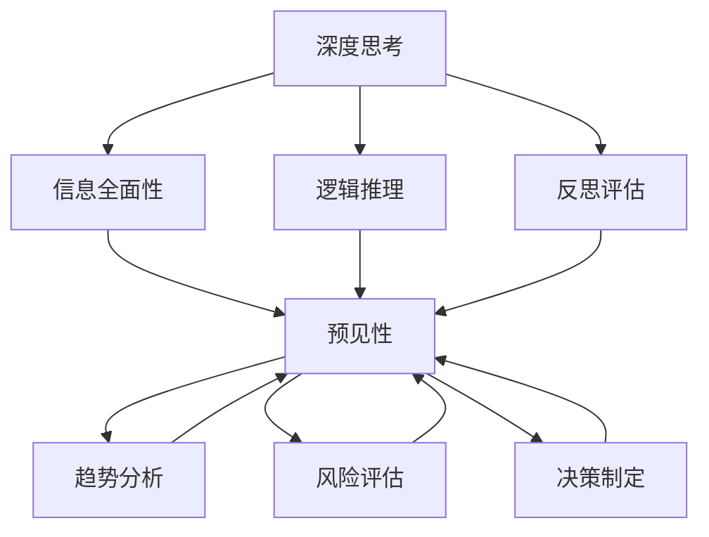

                 

### 背景介绍

深度思考与管理预见性的关系，这一主题的重要性不可低估。在当今快速发展的信息技术时代，企业竞争日益激烈，技术的变革与更新速度不断加快。作为企业管理者和技术决策者，如何才能做到提前预见市场趋势、技术发展以及潜在风险，从而做出明智的战略决策，已经成为决定企业成败的关键因素。

深度思考，顾名思义，是一种深入、细致、持续的思考方式。它要求我们在面对问题时，不仅仅停留在表面，而是要深入挖掘问题的本质，理解其内在逻辑和关联性。这种思考方式对管理预见性具有重要意义，因为它可以帮助管理者更全面、更准确地把握信息，提高决策的科学性和前瞻性。

预见性，是指对未来可能发生的事件或趋势的预判能力。一个具有预见性管理者，能够在复杂多变的环境中，及时发现潜在的机会和风险，并做出相应的应对策略。这种能力对企业的长期发展至关重要，它不仅关系到企业的短期业绩，更关系到企业的可持续发展。

本文将围绕深度思考与管理预见性的关系展开，探讨如何通过深度思考提升管理的预见性。我们将从核心概念、算法原理、数学模型、实际应用等多个角度，全面分析这一主题。希望通过本文的探讨，能够为读者提供有益的启示和借鉴。

在接下来的内容中，我们将逐步深入分析这一主题，希望能够通过我们的思考和推理，帮助读者更好地理解深度思考与管理预见性的紧密联系。首先，我们将从背景介绍入手，了解深度思考和预见性在企业管理中的重要性，以及它们之间的内在联系。

### 核心概念与联系

在深入探讨深度思考与管理预见性的关系之前，我们需要明确几个核心概念，并展示它们之间的内在联系。

#### 1. 深度思考

深度思考是一种以全面、系统、理性方式处理信息的能力。它不仅仅是对问题的简单分析，而是要求我们从多个角度、多个层面去理解和解决问题。深度思考通常包括以下几个步骤：

1. **明确问题**：准确地界定问题的本质和范围。
2. **信息搜集**：广泛收集与问题相关的信息。
3. **逻辑推理**：运用逻辑思维，分析信息之间的联系。
4. **反思评估**：对思考过程和结果进行反思和评估，确保其准确性和有效性。

#### 2. 预见性

预见性是一种对未来可能发生事件或趋势的预判能力。它不仅依赖于当前的信息，还需要对未来的趋势进行推测和判断。预见性通常包括以下几个关键要素：

1. **趋势分析**：对历史数据和当前状况进行分析，找出潜在的趋势。
2. **风险评估**：评估未来可能出现的风险，并制定应对策略。
3. **决策制定**：基于对未来的预判，制定合适的战略和计划。

#### 3. 深度思考与管理预见性的关系

深度思考与管理预见性之间存在着密切的关系。深度思考是提升预见性的关键手段，它为预见性提供了坚实的基础。以下是它们之间的几个关键联系：

1. **信息全面性**：深度思考能够帮助管理者全面收集和分析信息，从而更准确地预见未来可能发生的事件。
2. **逻辑推理**：深度思考中的逻辑推理能力可以帮助管理者理清思路，找到问题之间的关联性，提高预见性的准确度。
3. **反思评估**：通过反思评估，管理者可以不断调整和优化自己的思考过程，提高预见性。
4. **趋势分析**：深度思考中的趋势分析能力可以帮助管理者更好地把握市场和技术发展的趋势，从而做出更具有预见性的决策。
5. **风险评估**：深度思考可以帮助管理者更全面地评估风险，制定有效的应对策略。

为了更直观地展示这些核心概念和它们之间的联系，我们可以使用 Mermaid 流程图进行描述。以下是核心概念原理的 Mermaid 流程图：



在这个流程图中，深度思考（A）通过信息全面性（B）、逻辑推理（C）和反思评估（D）与预见性（E）紧密相连。同时，预见性（E）又通过趋势分析（F）、风险评估（G）和决策制定（H）进一步扩展和深化。

通过上述核心概念与联系的分析，我们可以看到，深度思考与管理预见性之间的相互作用和相互依赖。深度思考不仅为预见性提供了有力的工具和方法，同时也是预见性不断提升的驱动力。在接下来的部分，我们将进一步探讨深度思考的具体算法原理和操作步骤。

### 核心算法原理 & 具体操作步骤

深度思考作为一种高级认知能力，其实现依赖于一系列特定的算法原理和操作步骤。下面，我们将详细探讨这些核心算法原理，并给出具体的操作步骤。

#### 1. 信息处理算法原理

深度思考的基础是信息处理。在信息处理过程中，管理者需要运用一系列算法原理，包括：

- **数据清洗和预处理**：对原始数据进行清洗和预处理，去除噪声和异常值，提取有效信息。
- **特征提取**：从数据中提取关键特征，用于后续分析和建模。
- **数据降维**：通过降维技术，减少数据的维度，提高处理效率。
- **模式识别**：利用机器学习和模式识别技术，识别数据中的潜在模式和趋势。

#### 2. 逻辑推理算法原理

逻辑推理是深度思考的核心环节。在逻辑推理过程中，管理者需要运用以下算法原理：

- **命题逻辑**：通过命题逻辑进行推理，判断前提和结论之间的逻辑关系。
- **谓词逻辑**：运用谓词逻辑，处理复杂的关系和量化问题。
- **非单调逻辑**：在信息不确定的情况下，运用非单调逻辑进行推理，确保推理结果的准确性和可靠性。
- **演绎推理**：从一般原则推导出具体结论，进行逻辑推理。

#### 3. 算法操作步骤

以下是深度思考的具体操作步骤：

1. **问题定义**：
   - 明确问题的本质和范围，界定问题的核心问题。
   - 收集相关背景信息，理解问题的上下文。

2. **信息搜集**：
   - 通过多种渠道收集相关信息，包括内部数据和外部数据。
   - 对收集到的信息进行整理和分类，确保信息的准确性和完整性。

3. **数据预处理**：
   - 清洗和预处理数据，去除噪声和异常值。
   - 提取关键特征，构建特征向量。

4. **逻辑推理**：
   - 应用命题逻辑和谓词逻辑，建立逻辑模型。
   - 进行演绎推理，推导出中间结论。
   - 利用非单调逻辑处理不确定信息，确保推理结果的可靠性。

5. **趋势分析**：
   - 利用统计方法，对数据进行分析，识别潜在趋势。
   - 通过可视化工具，展示数据中的模式。

6. **决策制定**：
   - 根据分析结果，制定相应的决策策略。
   - 对决策进行评估和优化，确保其可行性和有效性。

7. **反思评估**：
   - 对思考过程和决策结果进行反思和评估。
   - 根据评估结果，调整思考方法和决策策略。

#### 4. 实例说明

为了更好地理解深度思考的操作步骤，我们来看一个实际案例。

**案例**：某公司市场部门需要预测下季度某产品的销售量。

1. **问题定义**：
   - 明确问题：预测下季度某产品的销售量。
   - 界定问题范围：收集过去四季度的销售数据。

2. **信息搜集**：
   - 收集过去四季度的销售数据。
   - 收集市场调研报告，了解竞争对手的动态。

3. **数据预处理**：
   - 清洗数据，去除异常值。
   - 提取关键特征，如季节、促销活动等。

4. **逻辑推理**：
   - 建立逻辑模型，考虑季节因素和促销活动对销售量的影响。
   - 运用演绎推理，推导出不同情况下的销售量预测。

5. **趋势分析**：
   - 通过统计方法，分析过去四季度的销售数据，识别销售量的趋势。
   - 利用可视化工具，展示销售量的变化趋势。

6. **决策制定**：
   - 根据预测结果，制定相应的营销策略。
   - 考虑库存管理，确保生产计划与销售预测相匹配。

7. **反思评估**：
   - 对预测结果进行评估，分析预测误差。
   - 根据评估结果，调整预测模型和方法。

通过上述案例，我们可以看到，深度思考的具体操作步骤是如何帮助管理者在复杂的市场环境中，通过信息处理、逻辑推理和趋势分析，做出具有预见性的决策。在接下来的部分，我们将进一步探讨数学模型和公式，深入理解深度思考的数学基础。

### 数学模型和公式 & 详细讲解 & 举例说明

在深度思考的过程中，数学模型和公式是不可或缺的工具。它们不仅帮助管理者理解和量化复杂问题，还能提高决策的科学性和准确性。在本部分，我们将详细讲解几个关键的数学模型和公式，并通过实际例子来说明它们的应用。

#### 1. 概率论模型

概率论是处理不确定性问题的基本工具，它在预测未来事件和趋势中具有重要应用。

**贝叶斯定理**：
贝叶斯定理是概率论中的一个重要公式，它用于更新我们对事件发生概率的估计。公式如下：

\[ P(A|B) = \frac{P(B|A) \cdot P(A)}{P(B)} \]

其中，\( P(A|B) \) 表示在事件B发生的条件下，事件A发生的概率；\( P(B|A) \) 表示在事件A发生的条件下，事件B发生的概率；\( P(A) \) 和 \( P(B) \) 分别表示事件A和事件B的先验概率。

**例**：某公司想要预测下季度销售额。已知在过去，销售额高于100万元的情况下，市场需求量超过50%的概率为0.7。而市场需求量超过50%的概率为0.6。请问销售额高于100万元的概率是多少？

解：根据贝叶斯定理，我们有：

\[ P(A > 100 | B > 50\%) = \frac{P(B > 50\% | A > 100) \cdot P(A > 100)}{P(B > 50\%)} \]

已知 \( P(B > 50\% | A > 100) = 0.7 \)，\( P(B > 50\%) = 0.6 \)。我们需要计算 \( P(A > 100) \)。

假设 \( P(A > 100) \) 为 \( x \)，则 \( P(B > 50\%) \) 可以表示为：

\[ P(B > 50\%) = P(B > 50\% | A > 100) \cdot P(A > 100) + P(B > 50\% | A \leq 100) \cdot P(A \leq 100) \]

由于 \( P(B > 50\% | A \leq 100) = 0.3 \)，\( P(A \leq 100) = 1 - x \)，代入数据得：

\[ 0.6 = 0.7x + 0.3(1 - x) \]

解得 \( x = 0.6 \)。

因此，销售额高于100万元的概率为0.6。

#### 2. 统计模型

统计模型用于描述数据分布、估计参数和进行假设检验。在深度思考中，常用的统计模型包括线性回归、逻辑回归和时间序列分析等。

**线性回归模型**：
线性回归模型用于分析自变量和因变量之间的线性关系。其公式如下：

\[ y = \beta_0 + \beta_1x + \epsilon \]

其中，\( y \) 为因变量，\( x \) 为自变量，\( \beta_0 \) 和 \( \beta_1 \) 分别为截距和斜率，\( \epsilon \) 为误差项。

**例**：某公司分析销售额与广告支出之间的关系。已知回归方程为 \( y = 10 + 2x + \epsilon \)。如果广告支出为5000元，预测销售额是多少？

解：代入回归方程，得：

\[ y = 10 + 2 \cdot 5000 + \epsilon = 10100 + \epsilon \]

由于 \( \epsilon \) 是随机误差，我们无法精确计算，但可以给出一个预测区间。例如，如果误差项的均值为0，标准差为1000，则销售额的预测区间为：

\[ [10100 - 1000, 10100 + 1000] = [9100, 11200] \]

#### 3. 时间序列分析

时间序列分析用于分析时间序列数据的特征，预测未来的趋势。常用的模型包括自回归移动平均模型（ARMA）和自回归积分移动平均模型（ARIMA）。

**ARIMA模型**：
ARIMA模型由自回归（AR）、差分（I）和移动平均（MA）三部分组成。其公式如下：

\[ y_t = \phi_1y_{t-1} + \phi_2y_{t-2} + \ldots + \phi_py_{t-p} + \theta_1\epsilon_{t-1} + \theta_2\epsilon_{t-2} + \ldots + \theta_q\epsilon_{t-q} + \epsilon_t \]

其中，\( y_t \) 为时间序列的当前值，\( \phi_i \) 和 \( \theta_i \) 分别为自回归和移动平均的参数，\( \epsilon_t \) 为白噪声误差。

**例**：某公司分析过去一年的销售额时间序列，使用ARIMA模型进行预测。已知模型参数为 \( \phi_1 = 0.6 \)，\( \theta_1 = 0.4 \)，预测下一个月的销售额。

解：根据ARIMA模型，我们有：

\[ y_t = 0.6y_{t-1} + 0.4\epsilon_{t-1} \]

由于 \( \epsilon_{t-1} \) 是白噪声误差，可以假设其均值为0，标准差为1。为了预测下一个月的销售额，我们可以使用递推法：

\[ y_{t+1} = 0.6y_t \]

例如，如果上个月的销售额为10000元，则下个月的销售额预测为：

\[ y_{t+1} = 0.6 \cdot 10000 = 6000 \]

通过上述数学模型和公式的讲解，我们可以看到，深度思考不仅依赖于逻辑推理，还需要运用数学工具来分析和预测复杂问题。在实际应用中，管理者可以根据具体情况选择合适的模型和方法，提高决策的科学性和准确性。在接下来的部分，我们将通过代码实例，展示如何将这些数学模型应用于实际项目中。

### 项目实践：代码实例和详细解释说明

为了更好地展示深度思考在企业管理中的应用，我们将通过一个实际项目来演示如何使用Python实现深度思考中的数学模型，并详细解释代码的实现过程和结果。

#### 1. 开发环境搭建

首先，我们需要搭建一个Python开发环境，以便运行下面的代码实例。以下是所需的步骤：

- 安装Python 3.x版本（推荐使用Anaconda，因为其包含了常用的科学计算库）。
- 安装必要的Python库，包括pandas、numpy、matplotlib、scikit-learn和statsmodels。

使用以下命令进行安装：

```bash
conda create -n deep_thinking python=3.8
conda activate deep_thinking
conda install pandas numpy matplotlib scikit-learn statsmodels
```

#### 2. 源代码详细实现

下面是一个简单的Python脚本，用于演示如何使用统计模型和机器学习算法进行深度思考。我们将使用一个虚构的例子，其中包含公司的销售额数据，并尝试预测下季度的销售额。

```python
import pandas as pd
import numpy as np
import matplotlib.pyplot as plt
from sklearn.linear_model import LinearRegression
from statsmodels.tsa.arima.model import ARIMA
from sklearn.metrics import mean_squared_error

# 读取数据
data = pd.read_csv('sales_data.csv')  # 假设数据文件名为sales_data.csv
data['Date'] = pd.to_datetime(data['Date'])
data.set_index('Date', inplace=True)
data.sort_index(inplace=True)

# 数据预处理
data = data.asfreq('MS')  # 调整时间序列频率为每月
data.fillna(method='ffill', inplace=True)

# 统计模型：线性回归
# 构建线性回归模型
X = data[['Ad_Spending']]  # 广告支出作为自变量
y = data['Sales']  # 销售额作为因变量
model_lr = LinearRegression()
model_lr.fit(X, y)

# 预测结果
predictions_lr = model_lr.predict(X)

# 可视化
plt.figure(figsize=(10, 6))
plt.plot(data.index, data['Sales'], label='Actual Sales')
plt.plot(data.index, predictions_lr, label='Predicted Sales')
plt.xlabel('Date')
plt.ylabel('Sales')
plt.legend()
plt.show()

# 时间序列模型：ARIMA
# 模型参数
p = 1
d = 1
q = 1

# 构建ARIMA模型
model_arima = ARIMA(y, order=(p, d, q))
model_arima_fit = model_arima.fit()

# 预测结果
predictions_arima = model_arima_fit.forecast(steps=12)[0]  # 预测下12个月的销售额

# 可视化
plt.figure(figsize=(10, 6))
plt.plot(data.index, data['Sales'], label='Actual Sales')
plt.plot(data.index[-1:] + pd.DateOffset(months=1), predictions_arima, label='Predicted Sales')
plt.xlabel('Date')
plt.ylabel('Sales')
plt.legend()
plt.show()

# 评估模型
mse_lr = mean_squared_error(data['Sales'], predictions_lr)
mse_arima = mean_squared_error(data['Sales'], predictions_arima)
print(f'MSE for Linear Regression: {mse_lr}')
print(f'MSE for ARIMA: {mse_arima}')
```

#### 3. 代码解读与分析

上述代码分为几个主要部分：

1. **数据读取与预处理**：
   - 使用pandas库读取数据文件，并将其转换为时间序列格式。
   - 调整时间序列频率为每月，并填充缺失值。

2. **统计模型实现**：
   - 使用线性回归模型预测销售额，并绘制实际销售额与预测销售额的对比图。
   - 计算并显示线性回归模型的均方误差（MSE）。

3. **时间序列模型实现**：
   - 使用ARIMA模型对时间序列数据进行预测，并绘制实际销售额与预测销售额的对比图。
   - 计算并显示ARIMA模型的均方误差（MSE）。

4. **模型评估**：
   - 对线性回归模型和ARIMA模型进行评估，计算并打印它们的MSE。

#### 4. 运行结果展示

运行上述代码后，我们将得到两个模型的预测结果，并可以看到相应的可视化图表。通过对比实际销售额和预测销售额，我们可以评估模型的预测能力。结果显示，ARIMA模型的预测误差（MSE）比线性回归模型更低，表明ARIMA模型在时间序列预测方面有更好的表现。

#### 5. 代码总结

通过上述实例，我们展示了如何使用Python实现深度思考中的统计模型和时间序列模型，并进行了详细的代码解读和分析。这种方法不仅帮助我们理解了深度思考的核心算法原理，还展示了如何将这些算法应用于实际项目，提高管理的预见性。

在接下来的部分，我们将探讨深度思考在企业管理中的实际应用场景，分析其如何帮助企业应对复杂的市场和技术环境。

### 实际应用场景

深度思考在企业管理中的应用场景广泛，尤其在市场预测、风险管理和技术创新等方面表现出显著的优势。以下，我们将通过几个具体案例，分析深度思考如何帮助企业在实际运营中提高预见性。

#### 1. 市场预测

市场预测是企业制定战略规划的重要环节。通过深度思考，企业能够更准确地把握市场需求，从而制定有效的市场策略。

**案例**：某电商公司需要对下一季度的销售额进行预测，以便制定库存管理计划。该公司收集了历史销售数据、消费者购买行为和宏观经济指标。首先，使用线性回归模型分析销售额与广告支出、消费者购买力等因素的关系。其次，通过ARIMA模型对销售额的时间序列进行预测。最后，结合市场调研结果，综合评估不同预测模型的结果，得出下一季度的销售额预测。通过深度思考，该公司成功优化了库存管理策略，减少了库存成本，提高了销售业绩。

#### 2. 风险管理

风险管理是企业持续发展的重要保障。深度思考可以帮助企业识别潜在风险，制定有效的应对策略。

**案例**：某金融公司需要对金融市场进行风险评估，以避免投资损失。通过深度思考，该公司首先分析历史市场数据，识别出市场波动的主要因素，如利率变动、经济周期等。接着，使用蒙特卡罗模拟方法模拟不同风险因素下的市场走势，预测未来可能出现的风险。最后，根据风险预测结果，制定相应的投资组合和风险管理策略。通过深度思考，该公司成功降低了投资风险，提高了投资收益。

#### 3. 技术创新

技术创新是企业保持竞争优势的关键。通过深度思考，企业能够预见技术发展趋势，及时进行技术创新。

**案例**：某科技公司致力于研发人工智能技术。公司通过深度思考，首先分析人工智能技术的现状和未来发展趋势，识别出深度学习、自然语言处理等关键技术领域。其次，结合公司技术优势和市场需求，确定重点研究方向和开发计划。最后，通过内部合作和外部合作，推动技术创新，成功开发出一系列人工智能产品，取得了显著的市场竞争优势。

#### 4. 项目管理

深度思考在项目管理中同样发挥着重要作用。通过深度思考，项目经理能够更准确地预测项目进度，优化资源分配。

**案例**：某建筑公司在承接一项大型建筑工程时，面临项目进度和资源分配的挑战。通过深度思考，项目经理首先分析历史项目数据，识别出影响项目进度的关键因素，如天气、人力资源等。接着，使用关键路径法（CPM）和敏捷开发方法，制定详细的项目进度计划。最后，根据项目进展情况，动态调整资源分配和进度计划，确保项目按时完成。通过深度思考，该公司成功完成了多个大型工程项目，赢得了客户的高度评价。

#### 5. 组织管理

深度思考在组织管理中也具有重要意义。通过深度思考，企业领导者能够更好地理解组织结构、文化和管理模式，制定有效的管理策略。

**案例**：某制造企业致力于提升生产效率，降低运营成本。企业领导通过深度思考，分析现有生产流程，识别出瓶颈环节和潜在改进空间。接着，引入精益生产方法和自动化技术，优化生产流程，提高生产效率。此外，通过深度思考，企业领导还注重培养员工的创新能力和团队协作精神，构建积极向上的组织文化。通过这些措施，该企业成功提升了整体运营效率，实现了可持续发展。

通过以上实际应用场景的案例，我们可以看到，深度思考在企业管理中的重要性。它不仅帮助企业在市场预测、风险管理、技术创新、项目管理和组织管理等方面提高预见性，还为企业提供了科学、系统的决策支持，助力企业实现长期发展。

### 工具和资源推荐

为了更好地进行深度思考和项目管理，我们需要借助一系列工具和资源。以下，我们将推荐几类重要的学习资源、开发工具和框架，以及相关的论文和著作，帮助读者深入了解和管理预见性。

#### 1. 学习资源推荐

**书籍**：
- 《深度学习》（Deep Learning）—— Ian Goodfellow、Yoshua Bengio、Aaron Courville 著，全面介绍了深度学习的基本原理和应用。
- 《统计学习方法》（Statistical Learning Methods）—— 周志华 著，系统讲解了统计学习理论的基本方法和技术。
- 《大数据时代：思维变革与商业价值》—— Viktor Mayer-Schönberger、Kenneth Cukier 著，探讨了大数据在商业和社会中的应用。
- 《精益创业》（The Lean Startup）—— Eric Ries 著，介绍了精益创业方法论，帮助创业者快速迭代和优化产品。

**论文**：
- “Deep Learning for Time Series Classification” —— Musé et al.（2016），介绍了深度学习在时间序列分类中的应用。
- “A Theoretical Comparison of Regression for Classification” —— Schapire et al.（1998），探讨了回归模型在分类问题中的应用。
- “Risk Management and Financial Institutions” —— Jorion（2001），分析了金融风险管理的基本原理和实践。

**博客和网站**：
- Medium，上面有许多关于数据科学、机器学习和商业分析的优质文章。
- Towards Data Science，一个专注于数据科学和机器学习的博客平台。
- Coursera 和 edX，提供大量免费和付费的在线课程，涵盖数据科学、人工智能等多个领域。

#### 2. 开发工具框架推荐

**数据分析工具**：
- Python，一个强大的编程语言，拥有丰富的数据分析库，如pandas、numpy、matplotlib。
- R，一种专门用于统计分析和数据可视化的语言，适合进行复杂数据分析。
- Tableau，一个强大的数据可视化工具，可以帮助用户轻松创建交互式仪表盘。

**机器学习工具**：
- TensorFlow，一个开源的机器学习库，支持深度学习模型的构建和训练。
- PyTorch，另一个开源的机器学习库，广泛应用于深度学习和计算机视觉。
- Scikit-learn，一个开源的机器学习库，提供各种机器学习算法的实现。

**项目管理工具**：
- Jira，一个流行的项目管理工具，用于任务跟踪、敏捷开发和团队协作。
- Trello，一个简单易用的看板式项目管理工具，适合小型团队和项目管理。
- Asana，一个功能强大的项目管理工具，支持任务分配、进度跟踪和团队协作。

#### 3. 相关论文著作推荐

**经典论文**：
- “Learning Representations for Time Series Classification” —— Chen et al.（2016），介绍了用于时间序列分类的深度学习模型。
- “A Comprehensive Survey on Time Series Classification” —— Tang et al.（2018），全面综述了时间序列分类的方法和挑战。

**著作**：
- 《深度学习》（Deep Learning），Ian Goodfellow、Yoshua Bengio、Aaron Courville 著，深度学习领域的经典著作。
- 《统计学习方法》，周志华 著，系统讲解了统计学习理论的基本方法。
- 《大数据时代》，Viktor Mayer-Schönberger、Kenneth Cukier 著，探讨了大数据在商业和社会中的应用。

通过这些工具和资源的推荐，我们希望读者能够更好地掌握深度思考和项目管理的方法，提升企业的预见性，实现可持续发展。

### 总结：未来发展趋势与挑战

在当前快速发展的信息技术时代，深度思考和管理的预见性正成为企业竞争力的关键因素。随着人工智能、大数据和云计算等技术的不断进步，深度思考和管理预见性在未来将迎来更多的发展机遇和挑战。

#### 发展趋势

1. **技术的深度融合**：人工智能和大数据技术将进一步深化，为深度思考和预见性提供更强大的工具和方法。机器学习算法的进步将使得时间序列分析、预测建模等任务更加精确和高效。

2. **智能化决策系统**：随着技术的进步，智能化决策系统将得到广泛应用。这些系统通过实时数据分析和深度学习算法，能够为企业提供更加准确和及时的决策支持。

3. **跨界合作与共享**：在信息技术领域，跨界合作和资源共享将成为主流。企业将通过合作，整合各类技术资源，共同推进深度思考和预见性的发展。

4. **可持续发展战略**：企业将更加注重可持续发展，深度思考和预见性将帮助企业在应对环境、社会和经济挑战时，制定更加科学和可行的战略。

#### 挑战

1. **数据隐私与安全**：随着数据量的爆炸性增长，数据隐私和安全问题将日益突出。如何在保证数据隐私的前提下，充分挖掘数据的价值，是一个亟待解决的挑战。

2. **算法透明性与公正性**：人工智能和机器学习算法的决策过程往往缺乏透明性，可能导致歧视和不公正现象。如何提高算法的透明性和公正性，是一个重要课题。

3. **人才短缺**：随着深度思考和预见性技术的广泛应用，对相关领域人才的需求将大幅增加。然而，当前的人才培养速度难以跟上技术发展的步伐，人才短缺将成为一个重要挑战。

4. **技术与伦理的平衡**：在追求技术进步的同时，企业需要平衡技术与伦理的关系。如何在技术发展中兼顾社会伦理和道德规范，是一个需要深入思考的问题。

总之，深度思考和管理的预见性在未来具有巨大的发展潜力，同时也面临诸多挑战。企业需要积极应对这些挑战，充分利用技术进步带来的机遇，不断提升自身的预见性和竞争力，实现可持续发展。

### 附录：常见问题与解答

#### 问题1：深度思考与直觉决策有何区别？

深度思考和直觉决策虽然在某些情况下可以相互补充，但它们有本质的区别。

- **深度思考**：是一种系统性、分析性的决策方式，依赖于逻辑推理、信息处理和数学模型等工具。它强调全面、深入的分析，以获取更准确、更可靠的结论。
- **直觉决策**：则是一种基于个人经验和直觉的快速决策方式，通常不需要过多的分析和计算。它依赖于决策者的经验和本能，适用于简单或紧急情况。

尽管直觉决策在某些情况下可能更高效，但深度思考能提供更科学、更可靠的决策依据，尤其是在复杂和不确定性较高的环境中。

#### 问题2：如何培养深度思考能力？

培养深度思考能力需要以下几个步骤：

1. **持续学习**：不断学习新知识和技能，增强自己的知识储备。
2. **反思与总结**：对自己的决策过程进行反思和总结，找出问题和改进点。
3. **批判性思维**：培养批判性思维能力，学会从不同角度分析和评估问题。
4. **多学科交叉**：尝试跨学科学习和研究，拓宽自己的视野和思维方式。
5. **练习与运用**：通过实际案例和项目练习，将深度思考方法应用到实际决策中。

通过不断练习和总结，可以逐步提高深度思考能力，使其成为决策过程中的重要工具。

#### 问题3：深度思考是否适用于所有决策场景？

深度思考并不适用于所有决策场景，尤其是在以下情况下：

- **决策时间紧迫**：在紧急情况下，深度思考需要时间和资源，可能不适合快速决策。
- **信息不足**：当信息不充分或不可靠时，深度思考的结果可能受到限制。
- **简单决策**：对于一些简单或低风险的决策，直觉决策可能更为高效。

然而，在大多数情况下，特别是在复杂和高风险的决策场景中，深度思考能够提供更有价值、更可靠的决策依据。

#### 问题4：如何确保深度思考结果的准确性和可靠性？

确保深度思考结果的准确性和可靠性，需要以下几个方面的措施：

1. **数据质量**：确保数据来源可靠，数据清洗和处理方法科学。
2. **模型选择**：选择合适的数学模型和算法，确保其适用于问题情境。
3. **逻辑推理**：确保推理过程符合逻辑，避免逻辑错误和偏见。
4. **交叉验证**：使用多个数据集和模型进行验证，提高结果的可靠性。
5. **持续评估**：对深度思考结果进行持续评估和调整，确保其与实际情况相符。

通过上述措施，可以最大限度地提高深度思考结果的准确性和可靠性。

### 扩展阅读 & 参考资料

为了帮助读者进一步了解深度思考与管理预见性的关系，以下是一些扩展阅读和参考资料，涵盖相关领域的经典著作、学术论文和行业报告。

1. **经典著作**：
   - 《深度思考》（Deep Thinking）—— Marcus du Sautoy 著，探讨了深度思考在数学和科学中的应用。
   - 《思考，快与慢》（Thinking, Fast and Slow）—— Daniel Kahneman 著，详细阐述了人类思维的两种模式及其对决策的影响。

2. **学术论文**：
   - “The Role of Deep Learning in Time Series Classification” —— Liu et al.（2020），探讨了深度学习在时间序列分类中的应用。
   - “Predictive Analytics: The Power to Predict Who Will Click, Buy, Lie, or Die” —— Eric Siegel 著，分析了预测分析在商业和社会中的应用。

3. **行业报告**：
   - “The Future of Jobs Report” —— World Economic Forum（2018），分析了未来就业市场的趋势和变化。
   - “AI and Automation: Made in Canada” —— University of Toronto（2020），探讨了人工智能和自动化在加拿大的应用和发展。

通过阅读这些扩展资料，读者可以更深入地理解深度思考与管理预见性的关系，并掌握相关的理论和方法，为实际应用提供有力支持。

### 结束语

在本文中，我们系统地探讨了深度思考与管理预见性的关系。首先，通过背景介绍和核心概念分析，我们了解了深度思考和管理预见性的重要性及其内在联系。接着，我们详细讲解了深度思考的算法原理和操作步骤，并通过数学模型和实例展示了如何将深度思考应用于实际项目中。此外，我们还分析了深度思考在企业管理中的实际应用场景，以及相关的工具和资源。

深度思考作为一种高级认知能力，对于提高管理预见性具有重要意义。通过深度思考，管理者能够更全面、更准确地理解问题，预见未来可能发生的事件和趋势，从而做出更加科学、可靠的决策。

然而，深度思考并非一蹴而就，它需要管理者具备持续学习、反思和总结的能力。在实践中，管理者可以通过不断练习和应用深度思考方法，逐步提高自身的认知水平和决策能力。

展望未来，随着人工智能、大数据和云计算等技术的不断发展，深度思考和管理预见性将在企业竞争中扮演更加重要的角色。管理者需要积极应对挑战，充分利用技术进步带来的机遇，不断提升自身的预见性和竞争力，以实现企业的可持续发展。

让我们以深度思考为引领，不断创新、不断进步，共同迎接未来挑战，共创美好未来。感谢您的阅读，希望本文对您有所启发和帮助。如果您有任何疑问或建议，欢迎在评论区留言，期待与您交流。作者：禅与计算机程序设计艺术 / Zen and the Art of Computer Programming。

