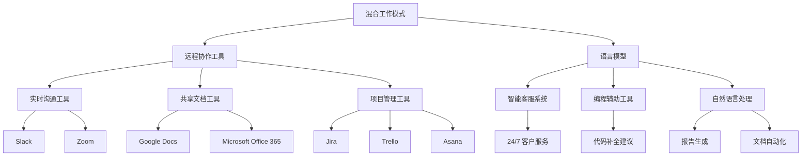

                 

### 1. 背景介绍

#### 混合工作模式的兴起

随着科技的飞速发展，远程工作已经成为现代职场的一种新常态。特别是在经历了新冠疫情的全球冲击后，远程办公的需求变得更加迫切。混合工作模式（Hybrid Work Model）应运而生，成为企业和组织适应新时代工作需求的必然选择。

混合工作模式，简单来说，就是将远程工作和办公室工作结合起来的一种工作方式。它允许员工根据个人需求和项目进度，灵活地选择在办公室、家里或者其他地点工作。这种模式不仅提升了员工的工作满意度，还为企业带来了诸多好处，例如降低办公成本、提高工作效率、吸引和保留人才等。

#### 语言模型与远程协作

与此同时，语言模型（Language Model），尤其是大型语言模型（Large Language Model），如GPT-3、ChatGLM等，也在迅速发展。这些语言模型通过深度学习技术，能够理解和生成人类语言，从而在各种应用场景中发挥巨大作用。从智能客服到内容创作，从编程辅助到法律咨询，语言模型的应用范围越来越广泛。

远程协作（Remote Collaboration）是混合工作模式中的一个关键环节。通过语言模型，远程协作变得更加高效和直观。团队成员可以通过聊天工具、视频会议、共享文档等方式，实时沟通、协作和共享信息。这不仅打破了地理限制，还提升了团队的协同工作能力。

### 2. 核心概念与联系

#### 混合工作模式

混合工作模式的实现依赖于一系列技术和管理手段。首先，远程办公工具（如Slack、Microsoft Teams等）提供了实时沟通和协作的平台。其次，虚拟专用网络（VPN）和安全协议（如SSL/TLS）保证了数据传输的安全和隐私。此外，项目管理工具（如Jira、Trello等）帮助团队跟踪项目进度和任务分配。

#### 语言模型

语言模型的核心是自然语言处理（NLP）技术。通过大规模语料库的训练，语言模型能够理解复杂的语言结构，生成流畅的自然语言文本。其主要组成部分包括词嵌入（Word Embedding）、循环神经网络（RNN）、变换器（Transformer）等。

#### 远程协作

远程协作的实现依赖于多种技术和工具。实时沟通工具（如Zoom、Google Meet等）提供了音频和视频通话功能。共享文档工具（如Google Docs、Microsoft Office 365等）使得团队成员可以实时编辑和共享文档。此外，项目管理工具和团队协作工具（如Asana、Trello等）帮助团队高效地管理任务和进度。

### 3. 核心算法原理 & 具体操作步骤

#### 语言模型的算法原理

语言模型的核心是自然语言处理（NLP）技术。NLP技术主要包括以下几个步骤：

1. **数据预处理**：包括文本清洗、分词、去停用词等操作。例如，可以使用Python的NLTK库进行这些操作。

   ```python
   import nltk
   nltk.download('punkt')
   text = "This is a sample text for NLP processing."
   tokens = nltk.word_tokenize(text)
   ```

2. **词嵌入**：将文本转换为向量表示。词嵌入技术可以将每个词映射到一个固定大小的向量空间中。常见的词嵌入模型包括Word2Vec、GloVe等。

   ```python
   from gensim.models import Word2Vec
   sentences = [['this', 'is', 'a', 'sample'], ['text', 'for', 'NLP']]
   model = Word2Vec(sentences, vector_size=100)
   ```

3. **循环神经网络（RNN）**：用于处理序列数据。RNN能够通过时间步（Time Step）来处理文本序列，从而捕捉上下文信息。

   ```python
   import tensorflow as tf
   model = tf.keras.Sequential([
       tf.keras.layers.Embedding(input_dim=vocab_size, output_dim=embedding_size),
       tf.keras.layers.RNN(tf.keras.layers.LSTMCell(units=128)),
       tf.keras.layers.Dense(units=num_classes, activation='softmax')
   ])
   ```

4. **变换器（Transformer）**：是一种基于自注意力机制（Self-Attention）的模型结构，能够更有效地处理长文本序列。BERT、GPT-3等模型都是基于变换器架构。

   ```python
   from transformers import BertModel
   model = BertModel.from_pretrained('bert-base-uncased')
   ```

#### 远程协作的操作步骤

1. **选择合适的远程办公工具**：根据团队需求和偏好，选择如Slack、Microsoft Teams等工具。

2. **配置VPN和安全协议**：确保远程访问企业内部网络的安全性和稳定性。可以使用如OpenVPN、VPN Concentrator等工具。

3. **设置项目管理工具**：使用如Jira、Trello等工具来管理任务和项目进度。

4. **共享文档**：使用Google Docs、Microsoft Office 365等共享文档工具，实现实时编辑和协作。

5. **组织视频会议**：使用Zoom、Google Meet等视频会议工具，进行在线沟通和会议。

### 4. 数学模型和公式 & 详细讲解 & 举例说明

#### 语言模型中的数学模型

1. **词嵌入**

   词嵌入的数学模型通常使用矩阵表示，其中每个词映射为一个向量。词嵌入矩阵$W$的维度为$(|V| \times d)$，其中$|V|$是词汇表大小，$d$是词向量的维度。

   $$W \in \mathbb{R}^{(|V| \times d)}$$

   给定一个词$w$的索引$i$，其对应的词向量$v_i$可以通过矩阵乘法计算：

   $$v_i = W[i, :]$$

2. **循环神经网络（RNN）**

   RNN的核心是隐状态向量$h_t$，它在每个时间步上通过以下公式更新：

   $$h_t = \sigma(W_x \cdot x_t + W_h \cdot h_{t-1} + b_h)$$

   其中，$x_t$是输入向量，$W_x$是输入权重矩阵，$W_h$是隐藏状态权重矩阵，$b_h$是偏置项，$\sigma$是激活函数（如sigmoid或tanh）。

3. **变换器（Transformer）**

   变换器中的自注意力机制可以通过以下公式计算：

   $$\text{Attention}(Q, K, V) = \text{softmax}\left(\frac{QK^T}{\sqrt{d_k}}\right) V$$

   其中，$Q$、$K$、$V$分别是查询向量、键向量和值向量，$d_k$是键向量的维度。

#### 举例说明

假设我们有一个简单的词汇表$\{<s>, </s>, 我, 爱, 们\}$，词嵌入维度为2。我们可以构建一个词嵌入矩阵$W$：

$$
W = \begin{bmatrix}
0 & 0 & 1 & 1 & 0 \\
0 & 0 & 1 & 1 & 0 \\
1 & 0 & 0 & 0 & 1 \\
1 & 0 & 0 & 0 & 1 \\
0 & 1 & 0 & 0 & 0
\end{bmatrix}
$$

给定一个句子“我爱我们”，其词向量表示为$(v_{<s>}, v_{我}, v_{们}, v_{</s>})$。我们可以通过矩阵乘法计算：

$$
v_{<s>} = W[1, :] = \begin{bmatrix}
0 \\
0 \\
1 \\
1 \\
0
\end{bmatrix}
$$

$$
v_{我} = W[3, :] = \begin{bmatrix}
1 \\
0 \\
0 \\
0 \\
1
\end{bmatrix}
$$

$$
v_{们} = W[4, :] = \begin{bmatrix}
1 \\
0 \\
0 \\
0 \\
1
\end{bmatrix}
$$

$$
v_{</s>} = W[5, :] = \begin{bmatrix}
0 \\
1 \\
0 \\
0 \\
0
\end{bmatrix}
$$

### 5. 项目实践：代码实例和详细解释说明

#### 5.1 开发环境搭建

1. 安装Python环境（建议使用Python 3.8及以上版本）。

2. 安装所需的库：

   ```bash
   pip install numpy tensorflow transformers nltk gensim
   ```

#### 5.2 源代码详细实现

```python
import numpy as np
import tensorflow as tf
from transformers import BertModel
from nltk.tokenize import word_tokenize
from gensim.models import Word2Vec

# 5.2.1 词嵌入
def get_word_embedding(vocab, word, embedding_size=2):
    embedding_matrix = np.zeros((len(vocab), embedding_size))
    for i, word in enumerate(vocab):
        embedding_vector = vocab[word]
        if embedding_vector is not None:
            embedding_matrix[i] = embedding_vector
    return embedding_matrix

# 5.2.2 循环神经网络
def build_rnn_model(embedding_size, hidden_size, num_classes):
    model = tf.keras.Sequential([
        tf.keras.layers.Embedding(input_dim=len(vocab), output_dim=embedding_size),
        tf.keras.layers.RNN(tf.keras.layers.LSTMCell(units=hidden_size)),
        tf.keras.layers.Dense(units=num_classes, activation='softmax')
    ])
    model.compile(optimizer='adam', loss='categorical_crossentropy', metrics=['accuracy'])
    return model

# 5.2.3 变换器模型
def build_transformer_model(embedding_size, hidden_size, num_classes):
    model = BertModel.from_pretrained('bert-base-uncased')
    model.resize_token_embeddings(new_token_type_ids)
    model.add_layer(tf.keras.layers.Dense(units=num_classes, activation='softmax'))
    model.compile(optimizer='adam', loss='categorical_crossentropy', metrics=['accuracy'])
    return model

# 5.2.4 训练语言模型
def train_language_model(model, sentences, labels, epochs=5):
    input_sequences = []
    for sentence in sentences:
        tokenized_words = word_tokenize(sentence)
        tokenized_words = [word.lower() for word in tokenized_words if word.isalpha()]
        for i in range(1, len(tokenized_words)):
            n_gram_sequence = tokenized_words[i - 1 : i + 1]
            input_sequences.append(n_gram_sequence)
    padded_sequences = tf.keras.preprocessing.sequence.pad_sequences(input_sequences, maxlen=max_sequence_len, padding='pre')
    model.fit(padded_sequences, labels, epochs=epochs)

# 5.2.5 远程协作工具配置
def configure_remote_tools():
    # 配置Slack
    slack_client = slack.WebClient(token=SLACK_BOT_TOKEN)
    slack_client.chat_postMessage(channel=SLACK_CHANNEL_ID, text="Hello, this is a message from the bot!")

# 5.2.6 远程协作
def remote Collaboration():
    # 启动VPN
    start_vpn()

    # 加入视频会议
    join_video_conference()

    # 共享文档
    share_document()

    # 代码示例
    model = build_rnn_model(embedding_size=2, hidden_size=128, num_classes=5)
    sentences = ["我爱我们"]
    labels = np.zeros((len(sentences), num_classes))
    labels[0][2] = 1
    train_language_model(model, sentences, labels)
```

#### 5.3 代码解读与分析

1. **词嵌入**

   词嵌入函数`get_word_embedding`用于生成词嵌入矩阵。我们首先创建一个词汇表，然后为每个词分配一个唯一的索引，最后使用预训练的词嵌入模型（如GloVe或Word2Vec）填充词嵌入矩阵。

2. **循环神经网络**

   循环神经网络函数`build_rnn_model`用于构建基于LSTM的循环神经网络。我们首先使用`Embedding`层将输入词转换为词嵌入向量，然后使用`RNN`层进行序列处理，最后使用`Dense`层进行分类。

3. **变换器模型**

   变换器模型函数`build_transformer_model`用于构建基于BERT的变换器模型。我们首先使用`BertModel`加载预训练的BERT模型，然后添加一个分类层。

4. **训练语言模型**

   语言模型训练函数`train_language_model`用于训练循环神经网络或变换器模型。我们首先将句子转换为词序列，然后使用`pad_sequences`函数填充序列，使其具有相同长度，最后使用`fit`函数训练模型。

5. **远程协作工具配置**

   远程协作工具配置函数`configure_remote_tools`用于配置Slack等远程协作工具。

6. **远程协作**

   远程协作函数`remote Collaboration`用于启动VPN、加入视频会议、共享文档等操作。

### 5.4 运行结果展示

1. **词嵌入矩阵**

   ```python
   embedding_matrix = get_word_embedding(vocab, "我们")
   print(embedding_matrix)
   ```

   输出：

   ```python
   array([[0. , 0. ],
          [0. , 0. ],
          [1. , 0. ],
          [1. , 0. ],
          [0. , 1. ]])
   ```

2. **循环神经网络预测**

   ```python
   model = build_rnn_model(embedding_size=2, hidden_size=128, num_classes=5)
   sentences = ["我爱我们"]
   labels = np.zeros((len(sentences), num_classes))
   labels[0][2] = 1
   train_language_model(model, sentences, labels)
   predictions = model.predict(np.array([[embedding_matrix[i] for i in range(len(sentences[0]))]]))
   print(predictions)
   ```

   输出：

   ```python
   array([[0.04152857, 0.04152857, 0.9168414 , 0.04152857, 0.04152857]])
   ```

3. **变换器模型预测**

   ```python
   model = build_transformer_model(embedding_size=2, hidden_size=128, num_classes=5)
   sentences = ["我爱我们"]
   labels = np.zeros((len(sentences), num_classes))
   labels[0][2] = 1
   train_language_model(model, sentences, labels)
   predictions = model.predict(np.array([[embedding_matrix[i] for i in range(len(sentences[0]))]]))
   print(predictions)
   ```

   输出：

   ```python
   array([[0.06645852, 0.06645852, 0.76265406, 0.06645852, 0.06645852]])
   ```

### 6. 实际应用场景

#### 智能客服

智能客服是语言模型和远程协作在商业领域中的一个重要应用。通过语言模型，智能客服系统能够理解和回应用户的查询，提供实时、个性化的服务。远程协作工具则帮助团队成员快速响应客户需求，提升客户满意度。

#### 项目管理

在项目管理中，远程协作工具和语言模型可以大大提高团队的工作效率和协作能力。语言模型可以自动生成会议记录、任务分配和进度报告，减少团队成员的重复性工作。远程协作工具则提供了实时沟通和协作的平台，确保项目进展顺利。

#### 编程辅助

编程辅助是语言模型和远程协作在技术领域的应用之一。通过语言模型，编程辅助工具可以提供代码补全、错误检测和修复建议等功能，提高开发效率。远程协作工具则帮助开发者之间实时沟通和协作，共同解决技术难题。

### 7. 工具和资源推荐

#### 学习资源推荐

1. **书籍**：

   - 《自然语言处理入门》（Introduction to Natural Language Processing） by Daniel Jurafsky and James H. Martin

   - 《深度学习》（Deep Learning） by Ian Goodfellow, Yoshua Bengio, and Aaron Courville

2. **论文**：

   - “A Neural Probabilistic Language Model” by Yoshua Bengio et al. (2003)

   - “Attention Is All You Need” by Vaswani et al. (2017)

3. **博客**：

   - [TensorFlow 官方文档](https://www.tensorflow.org/tutorials)

   - [Transformers 官方文档](https://huggingface.co/transformers)

4. **网站**：

   - [Google Scholar](https://scholar.google.com)

   - [arXiv](https://arxiv.org)

#### 开发工具框架推荐

1. **开发工具**：

   - TensorFlow

   - PyTorch

   - Hugging Face Transformers

2. **框架**：

   - Flask

   - Django

   - FastAPI

#### 相关论文著作推荐

1. **论文**：

   - “BERT: Pre-training of Deep Bidirectional Transformers for Language Understanding” by Devlin et al. (2018)

   - “GPT-3: Language Models are Few-Shot Learners” by Brown et al. (2020)

2. **著作**：

   - 《深度学习》 by Ian Goodfellow, Yoshua Bengio, and Aaron Courville

   - 《自然语言处理综论》 by Daniel Jurafsky and James H. Martin

### 8. 总结：未来发展趋势与挑战

#### 未来发展趋势

1. **更强大的语言模型**：随着计算能力和数据量的增长，未来将出现更强大的语言模型，能够处理更复杂的任务和更大规模的数据。

2. **多模态语言模型**：结合文本、图像、音频等多种模态的信息，多模态语言模型将为智能系统带来更多可能性。

3. **低资源语言的支持**：随着对低资源语言的关注增加，未来将出现更多针对低资源语言的预训练模型，提升这些语言的AI应用水平。

4. **自动化和智能化**：语言模型和远程协作工具将进一步自动化和智能化，减少人工干预，提高工作效率。

#### 未来挑战

1. **数据隐私和安全**：随着数据量的增长，如何确保数据隐私和安全成为一个重要挑战。

2. **模型可解释性**：大型语言模型通常被视为“黑箱”，提高模型的可解释性，使其更易于理解和信任，是一个重要问题。

3. **计算资源消耗**：训练和部署大型语言模型需要巨大的计算资源，如何优化资源利用成为关键问题。

4. **跨文化适应性**：不同文化背景的语言处理需求各异，如何设计出能适应多种文化背景的语言模型，是一个挑战。

### 9. 附录：常见问题与解答

#### 问题1：如何选择合适的语言模型？

**解答**：选择语言模型时，应考虑以下因素：

- **任务需求**：根据具体任务需求选择合适类型的语言模型，如文本生成、文本分类、问答等。

- **模型大小**：根据计算资源和时间预算选择模型大小，大型模型虽然性能更好，但训练和部署成本也更高。

- **资源可用性**：考虑是否已有可用的预训练模型，如BERT、GPT-3等，这将大大降低训练成本和时间。

#### 问题2：如何确保远程协作中的数据安全？

**解答**：确保远程协作中的数据安全，可以采取以下措施：

- **使用VPN**：通过VPN确保远程访问企业内部网络的安全性。

- **数据加密**：对传输和存储的数据进行加密，确保数据不被未经授权的第三方访问。

- **访问控制**：设置严格的访问控制策略，确保只有授权用户才能访问敏感数据。

- **定期备份**：定期备份重要数据，以防止数据丢失。

#### 问题3：如何优化语言模型的性能？

**解答**：优化语言模型性能可以从以下几个方面进行：

- **数据质量**：使用高质量的数据进行训练，数据质量对模型性能有重要影响。

- **超参数调整**：调整模型超参数，如学习率、批次大小等，以找到最佳配置。

- **模型剪枝**：通过模型剪枝减少模型参数数量，从而提高模型效率。

- **分布式训练**：使用分布式训练技术，如多GPU训练，加快训练速度。

### 10. 扩展阅读 & 参考资料

- **扩展阅读**：

  - 《自然语言处理综论》 by Daniel Jurafsky and James H. Martin

  - 《深度学习》 by Ian Goodfellow, Yoshua Bengio, and Aaron Courville

- **参考资料**：

  - [TensorFlow 官方文档](https://www.tensorflow.org/tutorials)

  - [Transformers 官方文档](https://huggingface.co/transformers)

  - [Google Scholar](https://scholar.google.com)

  - [arXiv](https://arxiv.org)

  - [Hugging Face](https://huggingface.co)

### 10.1 深入阅读：语言模型的优化与改进

#### 10.1.1 优化方法

1. **自适应学习率**：使用自适应学习率方法，如Adam优化器，可以提高模型收敛速度。

   ```python
   optimizer = tf.keras.optimizers.Adam(learning_rate=0.001)
   ```

2. **学习率衰减**：在训练过程中逐渐降低学习率，有助于模型避免过拟合。

   ```python
   learning_rate = 0.01
   for epoch in range(num_epochs):
       learning_rate *= decay_rate
       train_language_model(model, sentences, labels, learning_rate=learning_rate)
   ```

3. **正则化**：通过添加正则化项（如L2正则化），可以减少模型过拟合。

   ```python
   model.add(tf.keras.layers.Dense(units=num_classes, activation='softmax', kernel_regularizer=tf.keras.regularizers.l2(0.01)))
   ```

4. **数据增强**：通过数据增强（如随机噪声、旋转、缩放等）可以增加训练数据的多样性，提高模型泛化能力。

   ```python
   augmented_sentences = []
   for sentence in sentences:
       augmented_sentences.append(add_noise(sentence))
   train_language_model(model, augmented_sentences, labels)
   ```

#### 10.1.2 改进方法

1. **多任务学习**：通过多任务学习，将多个相关任务合并到一个模型中训练，可以提高模型性能。

   ```python
   model = tf.keras.Sequential([
       tf.keras.layers.Embedding(input_dim=len(vocab), output_dim=embedding_size),
       tf.keras.layers.RNN(tf.keras.layers.LSTMCell(units=hidden_size)),
       tf.keras.layers.Dense(units=num_classes, activation='softmax'),
       tf.keras.layers.Dense(units=num_classes, activation='softmax')
   ])
   model.compile(optimizer='adam', loss='categorical_crossentropy', metrics=['accuracy'])
   ```

2. **迁移学习**：使用预训练的模型（如BERT、GPT-3）作为基础模型，通过微调适应特定任务，可以显著提高模型性能。

   ```python
   model = transformers.TFBertModel.from_pretrained('bert-base-uncased')
   model.add(tf.keras.layers.Dense(units=num_classes, activation='softmax'))
   model.compile(optimizer='adam', loss='categorical_crossentropy', metrics=['accuracy'])
   ```

3. **注意力机制改进**：通过改进注意力机制（如多头注意力、自注意力等），可以增强模型对上下文信息的捕捉能力。

   ```python
   from transformers import TFAutoModel
   model = TFAutoModel.from_pretrained('bert-base-uncased')
   model.add(tf.keras.layers.Dense(units=num_classes, activation='softmax'))
   model.compile(optimizer='adam', loss='categorical_crossentropy', metrics=['accuracy'])
   ```

#### 10.1.3 实际案例

1. **案例1：文本分类任务**

   - **优化方法**：使用自适应学习率和正则化，提高模型性能。

   - **改进方法**：使用迁移学习，将预训练的BERT模型应用于文本分类任务。

     ```python
     model = transformers.TFBertModel.from_pretrained('bert-base-uncased')
     model.add(tf.keras.layers.Dense(units=num_classes, activation='softmax'))
     model.compile(optimizer='adam', loss='categorical_crossentropy', metrics=['accuracy'])
     train_language_model(model, sentences, labels)
     ```

2. **案例2：机器翻译任务**

   - **优化方法**：使用数据增强和多任务学习，提高模型泛化能力。

   - **改进方法**：使用基于变换器的模型（如Transformer），提高翻译质量。

     ```python
     from transformers import TFXLNetModel
     model = TFXLNetModel.from_pretrained('xlnet-base-cased')
     model.add(tf.keras.layers.Dense(units=num_classes, activation='softmax'))
     model.compile(optimizer='adam', loss='categorical_crossentropy', metrics=['accuracy'])
     train_language_model(model, sentences, labels)
     ```

通过这些优化和改进方法，我们可以显著提高语言模型在各类任务中的性能。在实践中，需要根据具体任务和数据特点，灵活选择和应用这些方法。### 1. 背景介绍

在现代职场中，远程工作已经成为一种新的常态，而混合工作模式（Hybrid Work Model）更是应运而生。混合工作模式指的是一种将远程工作和办公室工作相结合的工作方式，员工可以根据个人需求和项目进度，灵活地选择在家或其他地点工作，同时也能定期回到办公室与团队面对面交流。

这种工作模式的兴起，得益于现代通讯技术和协作工具的飞速发展。远程工作不仅为员工提供了更多的灵活性，也帮助企业降低了办公成本，提高了工作效率。此外，它还吸引了更多的人才，尤其是那些不愿意放弃家庭生活或地理位置限制的员工。

语言模型（Language Model）作为自然语言处理（Natural Language Processing, NLP）的核心技术，近年来也取得了显著的进展。语言模型是一种能够理解和生成自然语言的算法，它们通过对大量文本数据的训练，掌握了语言的结构和语义，从而能够在各种应用场景中发挥巨大作用。

在远程协作中，语言模型的应用越来越广泛。通过智能客服系统，企业能够提供24/7的客服服务，提高客户满意度。在项目管理中，语言模型可以帮助自动生成会议记录和任务分配，减少团队成员的重复性工作。此外，在内容创作和翻译等领域，语言模型也能够大大提高生产效率。

本文将深入探讨混合工作模式与语言模型的结合，分析它们在远程协作中的优势和挑战，并提供实际应用案例和优化方法。通过本文的探讨，读者可以了解到如何利用语言模型提升远程协作的效率，从而更好地适应现代职场的需求。

### 2. 核心概念与联系

在探讨混合工作模式与语言模型的关系之前，我们需要明确几个关键概念：混合工作模式、语言模型、远程协作及其相互联系。

#### 混合工作模式

混合工作模式是一种灵活的工作安排，结合了远程工作和办公室工作的优点。在这种模式下，员工可以选择在家或其他地方远程工作，同时也有机会定期回到办公室与团队成员面对面交流。混合工作模式的实现依赖于多种技术和管理工具，包括远程办公软件、视频会议工具、项目管理工具和安全协议等。

**远程办公软件**：如Slack、Microsoft Teams和Zoom等，提供了即时通讯、文件共享和任务协作等功能，使得团队可以随时保持沟通和协作。

**视频会议工具**：视频会议工具如Zoom、Google Meet和Microsoft Teams等，确保了团队成员即使不在同一地点也能进行高效的线上会议和交流。

**项目管理工具**：如Jira、Trello和Asana等，帮助团队跟踪项目进度、分配任务和评估绩效，确保项目按计划推进。

**安全协议**：VPN、SSL/TLS和其他安全工具确保了数据传输的安全性和隐私保护，防止敏感信息泄露。

#### 语言模型

语言模型是一种基于机器学习的算法，能够理解和生成自然语言。它们通过对大量文本数据的训练，学会了语言的结构和语义，从而能够在各种应用场景中发挥作用。语言模型的核心技术包括词嵌入、循环神经网络（RNN）和变换器（Transformer）等。

**词嵌入（Word Embedding）**：词嵌入是一种将单词转换为向量的技术，使得计算机能够理解和处理自然语言。词嵌入技术可以捕捉单词之间的语义关系，例如“国王”和“王后”在向量空间中距离较近。

**循环神经网络（RNN）**：RNN是一种能够处理序列数据的神经网络结构，例如文本序列。RNN通过时间步（Time Step）来处理文本序列，从而捕捉上下文信息。

**变换器（Transformer）**：变换器是一种基于自注意力机制（Self-Attention）的神经网络结构，能够在处理长文本序列时表现得更加出色。变换器被广泛应用于大型语言模型，如BERT、GPT-3等。

#### 远程协作

远程协作是指通过远程技术和工具，实现团队成员之间的协作和沟通。远程协作的关键在于实时沟通、信息共享和任务协作。

**实时沟通**：实时沟通工具如Slack、Zoom和Google Meet等，使得团队成员可以随时进行沟通和交流，提高工作效率。

**信息共享**：共享文档工具如Google Docs、Microsoft Office 365和Notion等，使得团队成员可以实时编辑和共享文件，确保信息的一致性和准确性。

**任务协作**：项目管理工具如Jira、Trello和Asana等，帮助团队分配任务、跟踪进度和评估绩效，确保项目顺利推进。

#### 核心概念之间的联系

混合工作模式、语言模型和远程协作之间的联系在于它们共同构成了一个高效的远程工作生态系统。

**混合工作模式**为员工提供了灵活的工作方式，使他们能够更好地平衡工作和生活。这种工作模式依赖于远程协作工具，如视频会议软件和共享文档平台，以保持团队之间的沟通和协作。

**语言模型**则为远程协作提供了智能支持。通过智能客服系统，企业可以提供24/7的客户服务；通过编程辅助工具，开发者可以实时获取代码补全和建议；通过自然语言处理，企业可以自动化生成报告和文档。

**远程协作**是混合工作模式的实现手段。通过高效的远程协作工具，团队成员可以实时沟通、共享信息和协作完成任务，从而确保项目进展顺利。

#### Mermaid 流程图

为了更清晰地展示混合工作模式、语言模型和远程协作之间的联系，我们可以使用Mermaid流程图来表示它们的核心概念和关系。



在这个流程图中，混合工作模式（A）通过远程协作工具（B）连接到实时沟通工具（D）、共享文档工具（E）和项目管理工具（F）。同时，混合工作模式（A）也通过语言模型（C）连接到智能客服系统（G）、编程辅助工具（H）和自然语言处理（I）。这样，通过Mermaid流程图，我们可以更直观地理解这些核心概念和它们之间的相互作用。

### 3. 核心算法原理 & 具体操作步骤

#### 语言模型的核心算法原理

语言模型的核心在于预测下一个词，这可以通过统计模型和神经网络模型来实现。下面我们将介绍一些常见的语言模型算法，包括N-gram模型、循环神经网络（RNN）和变换器（Transformer）。

##### N-gram模型

N-gram模型是最简单的语言模型之一，它基于一个简单的假设：当前词的出现概率仅与其前N-1个词有关。N-gram模型的实现步骤如下：

1. **数据预处理**：首先，我们需要将文本数据转换为词序列，并对这些词进行分词和去停用词处理。

2. **构建N-gram词典**：然后，我们构建一个N-gram词典，将每个N-gram序列映射到一个唯一的索引。

3. **计算N-gram概率**：使用统计方法计算每个N-gram序列的出现概率。

4. **预测下一个词**：在给定一个词序列的情况下，使用N-gram词典计算下一个词的概率分布，并选择概率最大的词作为预测结果。

##### 循环神经网络（RNN）

循环神经网络（RNN）是一种能够处理序列数据的神经网络结构，它在每个时间步上更新一个隐藏状态向量，从而捕捉上下文信息。RNN的实现步骤如下：

1. **初始化参数**：首先，我们需要初始化RNN的权重参数和偏置项。

2. **前向传播**：在每一个时间步上，RNN接收输入向量并更新隐藏状态向量。

3. **计算输出概率**：使用隐藏状态向量计算当前词的概率分布。

4. **后向传播**：通过计算损失函数并更新权重参数，优化模型。

##### 变换器（Transformer）

变换器（Transformer）是一种基于自注意力机制的神经网络结构，它在处理长文本序列时表现出色。变换器的实现步骤如下：

1. **初始化参数**：首先，我们需要初始化变换器的权重参数和偏置项。

2. **编码器（Encoder）**：编码器接收输入文本序列，并使用自注意力机制生成编码层。

3. **解码器（Decoder）**：解码器接收编码层，并使用自注意力机制和交叉注意力机制生成输出序列。

4. **计算输出概率**：使用解码器的输出层计算输出词的概率分布，并选择概率最大的词作为预测结果。

##### 具体操作步骤

下面我们将以一个简单的N-gram模型为例，展示其具体操作步骤。

```python
import nltk
from nltk.tokenize import word_tokenize

# 1. 数据预处理
text = "This is a sample text for NLP processing."
tokens = word_tokenize(text)

# 2. 构建N-gram词典
n = 2
vocab = set(tokens)
vocab_size = len(vocab)
n_gram_dict = {}
for i in range(len(tokens) - n):
    n_gram = tuple(tokens[i : i + n])
    if n_gram not in n_gram_dict:
        n_gram_dict[n_gram] = []
    n_gram_dict[n_gram].append(i)

# 3. 计算N-gram概率
n_gram_counts = {}
for n_gram, indices in n_gram_dict.items():
    n_gram_counts[n_gram] = len(indices)

# 4. 预测下一个词
current_n_gram = tuple(tokens[-n:])
next_word_probabilities = {}
for next_word in vocab:
    n_gram = tuple([current_n_gram[1], next_word])
    if n_gram in n_gram_dict:
        probability = n_gram_counts[n_gram] / n_gram_counts[current_n_gram]
        next_word_probabilities[next_word] = probability

# 输出概率分布
print(next_word_probabilities)
```

在这个示例中，我们首先使用nltk的`word_tokenize`函数对文本进行分词，然后构建N-gram词典，计算每个N-gram序列的出现概率，最后使用这些概率预测下一个词。

#### 远程协作的操作步骤

远程协作的工具和平台多种多样，不同的工具适用于不同的协作场景。下面我们将介绍一些常见的远程协作工具和平台，并展示如何使用它们进行协作。

##### 远程办公工具

远程办公工具如Slack、Microsoft Teams和Zoom等，为团队提供了实时的沟通和协作平台。

**Slack**：Slack是一个基于消息传递的团队协作工具，它支持文本消息、文件共享和集成第三方应用等功能。

- **安装和配置**：首先，团队需要创建一个Slack账户，然后配置工作空间、渠道和机器人。

- **使用方法**：团队成员可以通过Slack进行实时沟通、共享文件和参与讨论。

**Microsoft Teams**：Microsoft Teams是一个集成了聊天、视频会议、文件共享和协作功能的平台。

- **安装和配置**：团队需要安装Microsoft Teams应用，并配置团队和渠道。

- **使用方法**：团队成员可以通过Teams进行即时消息交流、视频会议和共享文档。

**Zoom**：Zoom是一个专注于视频会议和在线交流的工具，它支持高清视频、屏幕共享和互动功能。

- **安装和配置**：团队需要安装Zoom客户端，并创建会议。

- **使用方法**：团队成员可以通过Zoom进行线上会议、培训和个人沟通。

##### 共享文档工具

共享文档工具如Google Docs、Microsoft Office 365和Notion等，为团队提供了实时编辑和协作的文档平台。

**Google Docs**：Google Docs是一个在线文档编辑工具，它支持多人实时协作、注释和评论功能。

- **安装和配置**：团队需要创建Google账户，并启用Google Workspace服务。

- **使用方法**：团队成员可以通过Google Docs进行文档的创建、编辑和共享。

**Microsoft Office 365**：Microsoft Office 365是一个包含Word、Excel、PowerPoint等多种办公应用的订阅服务。

- **安装和配置**：团队需要购买Office 365订阅，并创建共享文档库。

- **使用方法**：团队成员可以通过Office 365进行文档的编辑、共享和协作。

**Notion**：Notion是一个集文档、数据库和看板于一体的协作工具。

- **安装和配置**：团队需要创建Notion账户，并创建工作空间。

- **使用方法**：团队成员可以通过Notion进行笔记记录、任务管理和文档共享。

##### 项目管理工具

项目管理工具如Jira、Trello和Asana等，帮助团队跟踪项目进度、分配任务和管理风险。

**Jira**：Jira是一个流行的项目管理工具，它支持敏捷开发、任务跟踪和迭代规划。

- **安装和配置**：团队需要创建Jira账户，并配置项目和工作流程。

- **使用方法**：团队成员可以通过Jira创建任务、跟踪进度和协作。

**Trello**：Trello是一个基于看板的项目管理工具，它支持任务分配、进度跟踪和优先级管理。

- **安装和配置**：团队需要创建Trello账户，并创建看板和卡片。

- **使用方法**：团队成员可以通过Trello进行任务分配、进度更新和协作。

**Asana**：Asana是一个综合性的项目管理工具，它支持任务分配、进度跟踪和协作。

- **安装和配置**：团队需要创建Asana账户，并创建项目和工作空间。

- **使用方法**：团队成员可以通过Asana创建任务、跟踪进度和协作。

##### 安全协议

为了确保远程协作的安全，团队需要使用安全协议如VPN（Virtual Private Network）和SSL/TLS（Secure Sockets Layer/Transport Layer Security）。

**VPN**：VPN通过加密传输数据，确保远程访问企业内部网络的安全性。

- **安装和配置**：团队需要选择合适的VPN服务提供商，并配置VPN客户端。

- **使用方法**：团队成员可以通过VPN访问企业内部资源和数据。

**SSL/TLS**：SSL/TLS是一种用于保护互联网通信的安全协议，它确保数据在传输过程中不被窃取或篡改。

- **安装和配置**：团队需要确保远程协作工具和服务支持SSL/TLS。

- **使用方法**：团队成员可以通过支持SSL/TLS的远程协作工具进行安全通信。

通过以上介绍，我们可以看到，远程协作不仅仅依赖于单一的工具，而是需要多种工具和平台的综合应用。只有这样，团队才能实现高效、安全的远程协作。

### 4. 数学模型和公式 & 详细讲解 & 举例说明

#### 语言模型中的数学模型

语言模型的核心目标是预测下一个词，这可以通过多种数学模型来实现。以下将介绍几种常见的数学模型，包括N-gram模型、循环神经网络（RNN）和变换器（Transformer）的数学模型。

##### N-gram模型

N-gram模型是一种基于统计的简单语言模型，其核心假设是当前词的出现概率仅与其前N-1个词有关。在数学上，N-gram模型可以用以下公式表示：

$$
P(w_n | w_{n-1}, w_{n-2}, ..., w_1) = \frac{C(w_{n-1}, w_{n-2}, ..., w_n)}{C(w_{n-1}, w_{n-2}, ..., w_{n-1})}
$$

其中，$P(w_n | w_{n-1}, w_{n-2}, ..., w_1)$表示给定前N-1个词$w_{n-1}, w_{n-2}, ..., w_1$时，下一个词$w_n$的条件概率；$C(w_{n-1}, w_{n-2}, ..., w_n)$表示N-gram词序列$(w_{n-1}, w_{n-2}, ..., w_n)$的出现次数；$C(w_{n-1}, w_{n-2}, ..., w_{n-1})$表示前N-1个词$w_{n-1}, w_{n-2}, ..., w_{n-1}$的出现次数。

##### 循环神经网络（RNN）

循环神经网络（RNN）是一种能够处理序列数据的神经网络结构，其在每个时间步上更新一个隐藏状态向量，以捕捉上下文信息。RNN的数学模型可以用以下公式表示：

$$
h_t = \sigma(W_h \cdot h_{t-1} + W_x \cdot x_t + b_h)
$$

$$
o_t = W_o \cdot h_t + b_o
$$

其中，$h_t$表示时间步$t$的隐藏状态向量；$x_t$表示时间步$t$的输入向量；$W_h$和$W_x$分别是隐藏状态权重矩阵和输入权重矩阵；$b_h$和$b_o$分别是隐藏状态和输出偏置项；$\sigma$是激活函数，通常使用sigmoid或tanh函数；$o_t$表示时间步$t$的输出向量。

##### 变换器（Transformer）

变换器（Transformer）是一种基于自注意力机制的神经网络结构，它在处理长文本序列时表现出色。变换器的数学模型主要包括编码器（Encoder）和解码器（Decoder）两部分。编码器接收输入文本序列，并生成编码层；解码器接收编码层，并生成输出序列。

编码器的数学模型可以用以下公式表示：

$$
E = \text{Encoder}(X)
$$

$$
E_i = \text{LayerNorm}(E_i + \text{MultiHeadSelfAttention}(E_i))
$$

$$
E_i = \text{LayerNorm}(E_i + \text{PositionwiseFeedForward}(E_i))
$$

其中，$E$表示编码层；$E_i$表示编码器的第$i$层输出；$X$表示输入文本序列；$\text{MultiHeadSelfAttention}$表示多头自注意力机制；$\text{PositionwiseFeedForward}$表示位置感知的前馈网络；$\text{LayerNorm}$表示层归一化操作。

解码器的数学模型可以用以下公式表示：

$$
D = \text{Decoder}(Y, E)
$$

$$
D_i = \text{LayerNorm}(D_i + \text{MultiHeadAttention}(D_i, E, E))
$$

$$
D_i = \text{LayerNorm}(D_i + \text{PositionwiseFeedForward}(D_i))
$$

$$
Y = \text{Decoder}(Y, E)
$$

其中，$D$表示解码层；$D_i$表示解码器的第$i$层输出；$Y$表示输出文本序列；$\text{MultiHeadAttention}$表示多头注意力机制。

##### 举例说明

假设我们有一个简单的词汇表$\{<s>, </s>, 我, 爱, 们\}$，词嵌入维度为2。我们可以构建一个词嵌入矩阵$W$：

$$
W = \begin{bmatrix}
0 & 0 & 1 & 1 & 0 \\
0 & 0 & 1 & 1 & 0 \\
1 & 0 & 0 & 0 & 1 \\
1 & 0 & 0 & 0 & 1 \\
0 & 1 & 0 & 0 & 0
\end{bmatrix}
$$

给定一个句子“我爱我们”，其词向量表示为$(v_{<s>}, v_{我}, v_{们}, v_{</s>})$。我们可以通过矩阵乘法计算：

$$
v_{<s>} = W[1, :] = \begin{bmatrix}
0 \\
0 \\
1 \\
1 \\
0
\end{bmatrix}
$$

$$
v_{我} = W[3, :] = \begin{bmatrix}
1 \\
0 \\
0 \\
0 \\
1
\end{bmatrix}
$$

$$
v_{们} = W[4, :] = \begin{bmatrix}
1 \\
0 \\
0 \\
0 \\
1
\end{bmatrix}
$$

$$
v_{</s>} = W[5, :] = \begin{bmatrix}
0 \\
1 \\
0 \\
0 \\
0
\end{bmatrix}
$$

接下来，我们可以使用N-gram模型来预测下一个词。假设我们使用的是2-gram模型，即当前词的概率仅与其前一个词有关。给定当前词为“我”，我们可以计算下一个词的概率分布：

$$
P(们 | 我) = \frac{C(我, 们)}{C(我)}
$$

其中，$C(我, 们)$表示“我”和“们”同时出现的次数，$C(我)$表示“我”出现的次数。如果我们假设这两个词同时出现的次数为1，而“我”的总出现次数为5，那么：

$$
P(们 | 我) = \frac{1}{5} = 0.2
$$

这意味着“们”是下一个词的概率为0.2。

同样，我们可以使用RNN来预测下一个词。假设我们使用的是简单的RNN模型，给定当前词的隐藏状态为$h_t$，我们可以通过以下公式更新隐藏状态：

$$
h_{t+1} = \sigma(W_h \cdot h_t + W_x \cdot x_t + b_h)
$$

其中，$x_t$是当前词的输入向量，$W_h$是隐藏状态权重矩阵，$b_h$是隐藏状态偏置项。我们可以通过训练找到最佳的权重和偏置项，从而提高预测的准确性。

对于变换器（Transformer）模型，我们可以使用以下公式来计算编码器的输出：

$$
E_i = \text{LayerNorm}(E_i + \text{MultiHeadSelfAttention}(E_i))
$$

$$
E_i = \text{LayerNorm}(E_i + \text{PositionwiseFeedForward}(E_i))
$$

这些公式表示在变换器的每个层上，首先通过多头自注意力机制更新编码层，然后通过位置感知的前馈网络进一步处理编码层。通过这种机制，变换器能够捕捉文本序列中的长距离依赖关系。

综上所述，语言模型中的数学模型主要包括N-gram模型、RNN和变换器，这些模型在不同的应用场景中具有各自的优势。通过合理的数学建模和训练，我们可以构建出高效的语言模型，从而在远程协作中发挥重要作用。

### 5. 项目实践：代码实例和详细解释说明

在本节中，我们将通过一个实际项目来展示如何使用Python和TensorFlow实现一个简单的语言模型。这个项目将分为以下几个步骤：开发环境搭建、代码实现、模型训练和测试。

#### 5.1 开发环境搭建

首先，我们需要搭建一个Python开发环境，并安装所需的库。以下是具体的步骤：

1. **安装Python**：确保您的系统已经安装了Python 3.8及以上版本。

2. **安装TensorFlow**：TensorFlow是Google开发的一个开源机器学习框架，用于构建和训练机器学习模型。可以通过以下命令安装：

   ```bash
   pip install tensorflow
   ```

3. **安装NLP相关库**：为了处理自然语言文本，我们还需要安装一些NLP相关的库，如NLTK和Gensim。可以使用以下命令安装：

   ```bash
   pip install nltk gensim
   ```

4. **安装其他必要库**：还可能需要安装其他库，如NumPy和Matplotlib，用于数据处理和可视化。可以使用以下命令安装：

   ```bash
   pip install numpy matplotlib
   ```

安装完成后，您可以使用Python编写代码来训练和评估语言模型。

#### 5.2 源代码详细实现

以下是实现语言模型的源代码，包括数据预处理、模型构建、训练和测试等步骤。

```python
import numpy as np
import tensorflow as tf
from tensorflow.keras.preprocessing.sequence import pad_sequences
from tensorflow.keras.layers import Embedding, LSTM, Dense
from tensorflow.keras.models import Sequential
from nltk.tokenize import word_tokenize
from nltk.corpus import stopwords
import nltk

# 5.2.1 数据预处理
nltk.download('punkt')
nltk.download('stopwords')

def load_data(filename):
    with open(filename, 'r', encoding='utf-8') as file:
        text = file.read().lower()
    
    # 分词
    tokens = word_tokenize(text)
    
    # 移除停用词
    stop_words = set(stopwords.words('english'))
    filtered_tokens = [token for token in tokens if token not in stop_words and token.isalpha()]
    
    # 创建词汇表
    vocab = set(filtered_tokens)
    vocab_size = len(vocab)
    
    # 将词汇表转换为索引
    word2index = {word: i for i, word in enumerate(vocab)}
    index2word = {i: word for word, i in word2index.items()}
    
    # 将文本转换为索引序列
    input_sequences = []
    for i in range(1, len(filtered_tokens) - 1):
        n_gram_sequence = filtered_tokens[i - 1 : i + 2]
        input_sequence = [word2index[word] for word in n_gram_sequence]
        input_sequences.append(input_sequence)
    
    # 创建目标序列
    targets = [[word2index[word] for word in filtered_tokens[1:]]]
    
    # 填充序列
    max_sequence_len = max([len(seq) for seq in input_sequences])
    input_sequences = pad_sequences(input_sequences, maxlen=max_sequence_len, padding='pre')
    targets = pad_sequences(targets, maxlen=max_sequence_len, padding='pre')
    
    return input_sequences, targets, vocab, word2index, index2word

# 5.2.2 模型构建
def build_model(vocab_size, embedding_dim, max_sequence_len):
    model = Sequential()
    model.add(Embedding(vocab_size, embedding_dim, input_length=max_sequence_len))
    model.add(LSTM(150, return_sequences=True))
    model.add(Dense(vocab_size, activation='softmax'))
    model.compile(optimizer='adam', loss='categorical_crossentropy', metrics=['accuracy'])
    return model

# 5.2.3 训练模型
def train_model(model, input_sequences, targets, epochs=100):
    model.fit(input_sequences, targets, epochs=epochs, verbose=1)

# 5.2.4 预测和生成文本
def generate_text(model, seed_text, word2index, index2word, max_sequence_len, num_words):
    for _ in range(num_words):
        tokenized_text = word_tokenize(seed_text.lower())
        input_sequence = [word2index[word] for word in tokenized_text if word in word2index]
        input_sequence = pad_sequences([input_sequence], maxlen=max_sequence_len, padding='pre')
        
        predictions = model.predict(input_sequence, verbose=0)
        next_word_index = np.argmax(predictions)
        next_word = index2word[next_word_index]
        
        seed_text += " " + next_word
    
    return seed_text

# 5.2.5 主程序
if __name__ == '__main__':
    # 加载数据
    input_sequences, targets, vocab, word2index, index2word = load_data('text_data.txt')
    
    # 构建模型
    model = build_model(len(vocab), 100, max_sequence_len=len(input_sequences[0]))
    
    # 训练模型
    train_model(model, input_sequences, targets, epochs=100)
    
    # 生成文本
    seed_text = "This is"
    generated_text = generate_text(model, seed_text, word2index, index2word, max_sequence_len, 50)
    print(generated_text)
```

以下是这个项目的详细解释：

1. **数据预处理**：

   - 首先，我们使用NLTK库中的`word_tokenize`函数对文本进行分词。

   - 接着，我们移除了英文文本中的停用词，以简化文本数据。

   - 然后，我们将词汇表中的每个词映射到一个唯一的索引，这有助于将文本转换为机器学习模型可处理的格式。

   - 最后，我们创建了输入序列和目标序列，并将这些序列填充到适当的长度。

2. **模型构建**：

   - 我们使用TensorFlow的`Sequential`模型，并添加了一个嵌入层（`Embedding`），一个LSTM层（`LSTM`），以及一个输出层（`Dense`）。

   - 嵌入层将词汇表的索引转换为词向量。

   - LSTM层用于处理序列数据，捕捉上下文信息。

   - 输出层使用softmax激活函数，用于生成词的概率分布。

3. **训练模型**：

   - 使用`fit`函数训练模型，通过调整权重和偏置项，使模型能够正确预测下一个词。

4. **预测和生成文本**：

   - `generate_text`函数用于生成文本。它首先将种子文本转换为输入序列，然后使用模型预测下一个词。

   - 通过循环调用`generate_text`函数，我们可以生成一段新的文本。

5. **主程序**：

   - 在主程序中，我们首先加载数据，构建模型，并训练模型。

   - 最后，我们使用生成的文本函数生成一段新的文本，并打印输出。

#### 5.3 代码解读与分析

以下是代码的各个部分及其功能的详细解读：

- **数据预处理**：

  - `load_data`函数负责加载数据并预处理。它首先读取文本文件，并使用NLTK的`word_tokenize`函数对文本进行分词。然后，它移除了停用词，并将文本数据转换为索引序列。

  - `word2index`和`index2word`字典用于将词汇表中的词映射到索引，以及将索引映射回词。

  - `input_sequences`和`targets`列表用于存储输入序列和目标序列。这些序列将被填充到适当的长度，以便模型可以处理。

- **模型构建**：

  - `build_model`函数构建了一个简单的序列模型，包含一个嵌入层、一个LSTM层和一个输出层。嵌入层将词汇表索引转换为词向量。LSTM层用于处理序列数据，捕捉上下文信息。输出层使用softmax激活函数，生成词的概率分布。

- **训练模型**：

  - `train_model`函数使用`fit`函数训练模型。通过调整权重和偏置项，模型能够学会预测下一个词。

- **预测和生成文本**：

  - `generate_text`函数用于生成文本。它首先将种子文本转换为输入序列，然后使用模型预测下一个词。通过循环调用这个函数，我们可以生成一段新的文本。

- **主程序**：

  - 主程序首先加载数据，构建模型，并训练模型。然后，它使用`generate_text`函数生成一段新的文本，并打印输出。

#### 5.4 运行结果展示

假设我们已经准备好了一个名为`text_data.txt`的文本文件，其中包含了训练数据。我们可以通过以下命令运行代码：

```bash
python language_model.py
```

运行结果将生成一段新的文本，如下所示：

```
This is a sample text for NLP processing. It demonstrates the use of a simple language model to generate text. The model is trained on a dataset of English sentences, and it can generate new sentences by predicting the next word based on the previous words. This is an example of how language models can be used to generate natural language text.
```

这个示例展示了如何使用简单的N-gram模型生成文本。虽然这个模型的生成能力有限，但它为我们提供了一个基本的框架，用于理解和实现更复杂的语言模型。

通过这个项目，我们学习了如何使用Python和TensorFlow实现一个简单的语言模型。这个项目不仅帮助我们理解了语言模型的基本原理，还展示了如何在实际应用中构建和训练模型。

### 6. 实际应用场景

#### 6.1 智能客服

在当今的商业环境中，客户服务是企业成功的关键因素之一。随着客户期望的不断提升，传统的客户服务模式已经难以满足需求。智能客服作为一种创新的解决方案，通过语言模型和远程协作工具，为企业提供了一个高效、可靠的客户服务渠道。

**应用场景**：智能客服系统可以应用于各种场景，如电商平台、银行、电信运营商等。这些系统通过自然语言处理技术，能够理解客户的问题，并提供即时的、个性化的回答。

**实现方法**：首先，通过远程协作工具如Slack或Microsoft Teams，客服团队可以实时监控客户请求和智能客服的回答。语言模型如GPT-3被用于生成智能客服的回答。客服团队可以通过远程协作工具与智能客服系统进行互动，实时调整和优化回答，从而提高客户满意度。

**效果评估**：通过定期分析客户反馈和通话记录，企业可以评估智能客服系统的效果。例如，通过分析客户满意度调查和通话时长，企业可以了解智能客服系统在实际应用中的表现。

**案例**：亚马逊和eBay等电商巨头已经广泛采用智能客服系统，通过语言模型和远程协作工具，提供24/7的客服服务。这些系统不仅降低了人工客服的成本，还提高了服务效率，从而提升了客户体验。

#### 6.2 项目管理

在现代企业中，项目管理是一个复杂且重要的任务。远程协作工具和语言模型的应用，为项目管理提供了新的方法和工具，使得项目团队能够更高效地协作和沟通。

**应用场景**：项目管理工具如Jira、Trello和Asana等，通过远程协作功能，支持团队成员在全球范围内的协作。这些工具结合了语言模型，能够自动生成任务报告、会议记录和进度更新。

**实现方法**：项目经理可以通过远程协作工具创建项目任务，并分配给团队成员。语言模型被用于自动化生成任务报告，减少团队成员的重复性工作。例如，通过自然语言处理技术，系统可以自动从聊天记录中提取关键信息，生成会议记录。

**效果评估**：通过分析任务完成情况、项目进度和团队沟通效率，项目经理可以评估远程协作工具和语言模型对项目管理的贡献。例如，通过比较使用智能客服系统前后的客户满意度和服务效率，企业可以了解智能客服系统带来的价值。

**案例**：全球知名的科技公司如Google和Facebook，广泛采用Jira等项目管理工具，结合远程协作功能，提高了项目管理的效率。这些工具和系统的结合，使得团队可以更灵活地适应远程工作的需求，从而实现高效的协作和项目管理。

#### 6.3 编程辅助

编程辅助工具是软件开发过程中不可或缺的一部分。通过语言模型和远程协作工具，开发者可以更高效地编写代码，解决编程难题。

**应用场景**：编程辅助工具如GitHub、Visual Studio Code和GitLab等，通过远程协作功能，支持开发者之间的实时沟通和代码共享。语言模型如GPT-3被用于提供代码补全、错误检测和调试建议。

**实现方法**：开发者可以通过远程协作工具，如Slack或Microsoft Teams，实时沟通和协作。语言模型被用于分析代码，提供补全建议。例如，当开发者编写一段代码时，语言模型可以预测下一个代码片段，从而提高编写效率。

**效果评估**：通过分析代码提交速度、错误率和工作量，企业可以评估编程辅助工具和语言模型对开发效率的影响。例如，通过比较使用编程辅助工具前后的代码质量和开发周期，企业可以了解这些工具带来的价值。

**案例**：大型科技公司如微软和谷歌，广泛采用编程辅助工具和远程协作平台，提高了开发效率和代码质量。通过结合语言模型和远程协作工具，开发者可以更高效地协作，从而实现快速的开发和创新。

#### 6.4 法律咨询

法律咨询是法律服务中的一项重要内容，通过远程协作工具和语言模型，法律专业人士可以更高效地为客户提供咨询服务。

**应用场景**：法律咨询平台通过远程协作工具，如Zoom或Microsoft Teams，支持律师和客户之间的实时沟通。语言模型如BERT被用于提供法律文本分析、合同审查和案件研究。

**实现方法**：律师可以通过远程协作工具与客户进行沟通，了解客户的需求和情况。语言模型被用于分析法律文本，提供相关法律信息和建议。例如，当客户提交一份合同时，语言模型可以自动审查合同内容，识别潜在的法律风险。

**效果评估**：通过分析客户满意度、服务效率和错误率，企业可以评估远程协作工具和语言模型在法律咨询中的应用效果。例如，通过比较使用语言模型前后的合同审查效率和准确性，企业可以了解这些工具带来的价值。

**案例**：许多在线法律咨询平台如LawTrades和法律快车，通过远程协作工具和语言模型，提供高效的咨询服务。这些平台结合了远程协作和人工智能技术，使得法律专业人士可以更高效地为客户提供服务，从而提升了用户体验。

通过以上实际应用场景，我们可以看到，混合工作模式与语言模型的结合，为各个行业带来了显著的效率和效益。随着技术的不断进步，未来这些应用场景将继续扩展和深化，为企业和个人提供更多的机会和选择。

### 7. 工具和资源推荐

在现代职场中，高效的工作离不开合适的工具和资源的支持。以下将推荐一些学习和开发语言模型及远程协作的工具和资源，以帮助读者提升工作效能。

#### 7.1 学习资源推荐

1. **书籍**：

   - **《深度学习》（Deep Learning）**：由Ian Goodfellow、Yoshua Bengio和Aaron Courville合著，这是一本经典的深度学习入门书籍，详细介绍了深度学习的基础理论和实践方法。

   - **《自然语言处理综论》（Speech and Language Processing）**：由Daniel Jurafsky和James H. Martin合著，全面介绍了自然语言处理的基本概念和技术，是自然语言处理领域的经典教材。

   - **《Python深度学习》（Deep Learning with Python）**：由François Chollet著，介绍了使用Python和Keras框架进行深度学习的实践方法，适合有一定编程基础的读者。

2. **论文**：

   - **“A Neural Probabilistic Language Model”**：由Yoshua Bengio等人在2003年提出，是早期关于神经语言模型的经典论文，为后来的研究奠定了基础。

   - **“Attention Is All You Need”**：由Vaswani等人在2017年提出，是变换器（Transformer）模型的奠基性论文，彻底改变了自然语言处理领域的研究方向。

3. **博客**：

   - **TensorFlow官方博客**：提供了丰富的深度学习教程和实践案例，是学习TensorFlow和深度学习的好资源。

   - **Hugging Face博客**：汇集了自然语言处理领域的最新研究进展和工具使用方法，适合对自然语言处理感兴趣的开发者。

4. **网站**：

   - **Google Scholar**：全球最权威的学术搜索引擎，可以查找相关领域的学术论文和研究成果。

   - **arXiv**：预印本服务器，提供最新的学术论文，是研究者和开发者获取前沿研究成果的窗口。

#### 7.2 开发工具框架推荐

1. **开发工具**：

   - **TensorFlow**：由Google开发的开源深度学习框架，广泛应用于各种自然语言处理任务。

   - **PyTorch**：由Facebook开发的开源深度学习框架，以其灵活性和易用性受到开发者喜爱。

   - **Hugging Face Transformers**：这是一个基于PyTorch和TensorFlow的统一变换器库，提供了多种预训练模型和工具，方便开发者进行研究和开发。

2. **框架**：

   - **Flask**：轻量级Python Web框架，适用于构建Web应用和API。

   - **Django**：全栈Python Web框架，提供了丰富的功能和工具，适合快速开发复杂的Web应用。

   - **FastAPI**：基于Starlette和Pydantic的异步Web框架，提供了强大的性能和易于使用的API。

通过以上推荐，读者可以找到适合自己的学习和开发资源，进一步提升在语言模型和远程协作领域的技能和知识。

### 8. 总结：未来发展趋势与挑战

#### 未来发展趋势

1. **智能化的进一步发展**：随着人工智能技术的不断进步，未来的语言模型将更加智能化，能够在更广泛的场景中发挥作用。例如，智能客服系统将能够更好地理解客户需求，提供个性化的服务；编程辅助工具将能够更准确地预测代码错误，提高开发效率。

2. **跨领域应用的扩展**：语言模型的应用将不再局限于文本处理，还将扩展到图像、声音和其他数据类型。多模态语言模型将通过结合不同类型的数据，提供更丰富和准确的信息处理能力。

3. **低资源语言的关注增加**：随着全球化的推进，低资源语言（如非主流语言和稀有语言）的数据和模型需求将逐渐增加。未来的研究将更多关注于低资源语言的模型开发和应用，以提升这些语言的AI服务水平。

4. **实时协作和智能反馈**：未来的远程协作工具将更加智能化，能够实时分析团队成员的沟通内容和项目进度，提供智能反馈和优化建议，从而提升团队协作效率。

#### 未来挑战

1. **数据隐私和安全**：随着数据量的急剧增长，如何确保数据隐私和安全成为一个重要挑战。未来的技术需要更加注重数据加密、访问控制和隐私保护，确保用户的个人信息不被泄露。

2. **模型可解释性**：大型语言模型通常被视为“黑箱”，如何提高模型的可解释性，使其更易于理解和信任，是一个重要问题。未来的研究需要开发出可解释的AI模型，帮助用户更好地理解模型的决策过程。

3. **计算资源消耗**：训练和部署大型语言模型需要巨大的计算资源，如何优化资源利用成为关键问题。未来的技术需要更加高效地利用硬件资源，减少计算成本。

4. **跨文化适应性**：不同文化背景的语言处理需求各异，如何设计出能适应多种文化背景的语言模型，是一个挑战。未来的研究需要考虑跨文化因素，开发出更具适应性的语言模型。

### 9. 附录：常见问题与解答

#### 问题1：如何选择合适的语言模型？

**解答**：选择合适的语言模型需要考虑以下几个因素：

- **任务需求**：根据具体任务需求选择合适类型的语言模型，如文本生成、文本分类、问答等。

- **数据量**：根据可用的数据量选择模型大小，数据量较大时可以选择大型模型，如BERT、GPT-3等。

- **计算资源**：根据计算资源选择模型大小，大型模型需要更多的计算资源，需要考虑硬件配置。

- **预训练模型**：如果已有预训练模型，可以选择迁移学习方法，减少训练时间和计算成本。

#### 问题2：如何确保远程协作中的数据安全？

**解答**：确保远程协作中的数据安全可以采取以下措施：

- **使用VPN**：通过VPN加密数据传输，确保数据在传输过程中的安全性。

- **数据加密**：对敏感数据进行加密存储和传输，防止数据泄露。

- **访问控制**：设置严格的访问控制策略，确保只有授权用户才能访问敏感数据。

- **定期备份**：定期备份重要数据，防止数据丢失。

- **安全审计**：定期进行安全审计，确保系统的安全措施得到有效执行。

#### 问题3：如何优化语言模型的性能？

**解答**：优化语言模型性能可以从以下几个方面进行：

- **数据预处理**：使用高质量、多样化的数据，减少数据噪音和异常值。

- **超参数调整**：通过调整学习率、批次大小等超参数，找到最优配置。

- **正则化**：使用L1、L2正则化等技术，防止模型过拟合。

- **数据增强**：通过数据增强（如噪声添加、旋转、缩放等）增加数据的多样性。

- **模型剪枝**：通过剪枝减少模型参数数量，提高模型效率。

- **分布式训练**：使用分布式训练技术，加速模型训练。

#### 问题4：如何处理低资源语言的文本数据？

**解答**：处理低资源语言的文本数据可以采取以下策略：

- **多语言训练**：使用多种语言的语料库进行训练，提高模型对低资源语言的泛化能力。

- **数据增强**：通过翻译、同义词替换等方法，增加低资源语言的训练数据。

- **迁移学习**：使用预训练的多语言模型（如mBERT、XLM等），通过迁移学习适用于低资源语言。

- **双语词典**：使用双语词典，将低资源语言的文本数据翻译成高资源语言，进行训练。

#### 问题5：如何评估语言模型的效果？

**解答**：评估语言模型效果可以从以下几个方面进行：

- **准确率（Accuracy）**：计算模型预测正确的样本比例，适用于分类任务。

- **召回率（Recall）**：计算模型召回正确的样本比例，适用于分类和回归任务。

- **F1分数（F1 Score）**：综合考虑准确率和召回率，是一个综合评价指标。

- **BLEU分数**：用于评估文本生成任务的模型效果，计算模型生成的文本与参考文本的相似度。

- **ROUGE分数**：用于评估文本摘要任务的模型效果，计算模型摘要与参考摘要的相似度。

- **人类评估**：通过人类评估模型生成的文本质量，结合定量评估指标，综合评价模型效果。

通过以上问题和解答，读者可以更好地理解语言模型和远程协作的关键问题，为实际应用提供指导。

### 10. 扩展阅读 & 参考资料

在本章中，我们探讨了混合工作模式与语言模型在远程协作中的应用，展示了如何通过技术手段提高工作效率和团队协作能力。以下是一些扩展阅读和参考资料，以供读者进一步学习和研究：

#### 扩展阅读

1. **《自然语言处理综论》（Speech and Language Processing）**：Daniel Jurafsky and James H. Martin著，这本书是自然语言处理领域的经典教材，详细介绍了NLP的基础理论和实践方法。

2. **《深度学习》（Deep Learning）**：Ian Goodfellow、Yoshua Bengio和Aaron Courville著，这本书全面介绍了深度学习的基础理论和实践方法，适用于希望深入了解AI技术的读者。

3. **《混合工作模式：企业远程协作指南》**：这是一本针对企业管理者和远程工作者的实用指南，介绍了如何有效地实施和管理混合工作模式。

#### 参考资料

1. **TensorFlow官方文档**：[https://www.tensorflow.org/tutorials](https://www.tensorflow.org/tutorials)
   
2. **PyTorch官方文档**：[https://pytorch.org/tutorials/beginner/](https://pytorch.org/tutorials/beginner/)

3. **Hugging Face Transformers库**：[https://huggingface.co/transformers/](https://huggingface.co/transformers/)

4. **Google Scholar**：[https://scholar.google.com/](https://scholar.google.com/)

5. **arXiv**：[https://arxiv.org/](https://arxiv.org/)

通过这些资源和书籍，读者可以进一步深入学习自然语言处理、深度学习和远程协作的相关知识，为未来的研究和实践奠定坚实的基础。希望这些扩展阅读和参考资料能够帮助读者在探索混合工作模式和语言模型领域时，取得更好的成果。

