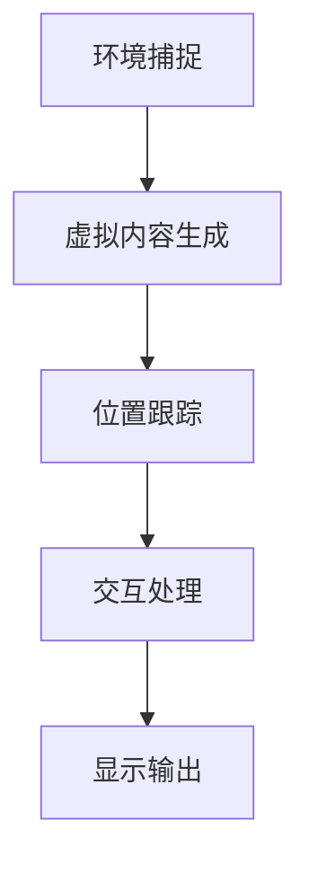

                 

### 1. 背景介绍

混合现实（Mixed Reality，简称MR）是近年来在计算机图形学、虚拟现实（Virtual Reality，简称VR）和增强现实（Augmented Reality，简称AR）基础上发展起来的一种新兴技术。MR技术通过将虚拟内容与现实世界无缝融合，创造出一种全新的交互模式和体验，使得用户能够在虚拟与现实之间自由穿梭。与VR和AR相比，MR不仅能够增强现实环境，还能与现实世界进行更深入的交互。

MR技术的发展历程可以追溯到20世纪90年代。当时，研究人员开始探索如何将计算机生成的虚拟物体与真实世界进行融合。随着计算机性能的提升和图形处理技术的发展，MR技术逐渐从实验室走向实际应用。近年来，随着硬件设备的进步，如高分辨率显示器、高性能处理器和先进的传感器，MR技术取得了显著的进展，并在医疗、教育、游戏、军事等多个领域展现出巨大的潜力。

在技术层面，MR系统通常由以下几个关键组成部分构成：

1. **显示设备**：包括头戴显示器（HMD）、投影仪、显示屏等，用于将虚拟内容呈现给用户。
2. **传感器**：如摄像头、深度传感器、运动传感器等，用于捕捉和追踪用户的位置、动作和环境信息。
3. **计算单元**：负责处理输入信息，生成虚拟内容，并进行实时渲染。
4. **交互设备**：如手柄、手套、眼动追踪设备等，用于用户与虚拟环境的交互。

MR技术的应用场景丰富多样，以下是一些典型的应用案例：

- **医疗领域**：医生可以通过MR技术进行远程手术指导，学生可以通过MR设备进行虚拟解剖实验，极大地提高了医疗教育和手术的精度和安全性。
- **教育领域**：教师可以利用MR技术为学生提供沉浸式学习体验，如虚拟化学实验室、历史事件重现等，提高学生的学习兴趣和效果。
- **游戏和娱乐**：MR技术可以为玩家带来全新的游戏体验，如多人合作游戏、虚拟演唱会等。
- **军事和模拟训练**：MR技术可以帮助军事人员实现高仿真度的模拟训练，提高训练效果和安全性。
- **建筑设计**：设计师可以利用MR技术对建筑模型进行实时交互和修改，提高设计效率和效果。

随着MR技术的不断成熟和普及，它正在逐步改变我们的生活方式和工作模式。然而，MR技术仍面临许多挑战，如硬件成本、用户体验、内容创建等。在接下来的章节中，我们将深入探讨MR技术的核心概念、算法原理、应用实践等方面，以期为读者提供全面而深入的了解。

### 2. 核心概念与联系

#### 2.1. 混合现实（MR）的基本概念

混合现实（MR）是一种通过计算机技术将虚拟物体与现实环境相结合的技术，使用户能够在虚拟与现实之间进行交互。MR的关键特点包括：

- **空间感知**：用户可以在真实环境中感知和操作虚拟物体，这些物体仿佛是真实存在的。
- **互动性**：用户可以通过自然交互方式与虚拟物体进行互动，如触摸、手势、声音等。
- **沉浸感**：MR技术创造出一个高度沉浸的体验环境，使用户感觉仿佛置身于虚拟世界之中。

#### 2.2. MR的关键组成部分

为了实现MR功能，系统通常包含以下几个关键组成部分：

- **显示设备**：如头戴显示器（HMD）、投影仪、AR眼镜等，用于将虚拟内容以视觉形式呈现给用户。
- **传感器**：如摄像头、深度传感器、运动传感器等，用于捕捉用户和环境的信息。
- **计算单元**：包括处理器和图形处理单元，用于处理传感器数据，生成虚拟内容并进行实时渲染。
- **交互设备**：如手柄、手套、眼动追踪设备等，用于用户与虚拟环境的交互。

#### 2.3. MR与其他技术的联系

MR技术与虚拟现实（VR）和增强现实（AR）有着紧密的联系，但它们之间也存在显著区别：

- **虚拟现实（VR）**：VR是一种完全沉浸式的体验，用户通过VR设备进入一个完全虚拟的环境，与现实世界隔离。VR主要用于娱乐、游戏、模拟训练等领域。
- **增强现实（AR）**：AR通过在现实环境中叠加虚拟物体，增强用户对现实世界的感知。AR技术常用于导航、游戏、教育和医疗等领域。

MR则同时结合了VR和AR的特点，通过将虚拟物体与现实环境融合，实现更深层次的交互和沉浸体验。

#### 2.4. MR技术的架构与流程

一个典型的MR系统架构包括以下几个主要步骤：

1. **环境捕捉**：通过传感器（如摄像头、深度传感器）捕捉现实环境的信息，生成环境模型。
2. **虚拟内容生成**：根据用户需求生成虚拟物体，并进行实时渲染。
3. **位置跟踪**：通过传感器和算法确定用户的位置和动作，确保虚拟物体与真实环境保持正确对齐。
4. **交互处理**：处理用户的交互输入，如手势、声音、触摸等，实现与虚拟物体的互动。
5. **显示输出**：将生成的虚拟内容和交互结果通过显示设备呈现给用户。

以下是一个简单的Mermaid流程图，展示了MR技术的基本流程：



通过以上对MR核心概念的介绍和架构流程的描述，我们可以更好地理解MR技术的本质和如何实现这一技术。在接下来的章节中，我们将深入探讨MR技术中的核心算法原理和具体操作步骤。

#### 2.4.1. 环境捕捉

环境捕捉是MR系统的第一步，也是至关重要的一步。它通过传感器捕捉现实环境的信息，包括空间布局、物体位置、颜色和纹理等，生成一个高精度的环境模型。以下是环境捕捉的详细流程：

1. **空间定位**：通过摄像头或激光扫描器等传感器获取三维空间信息，确定物体在空间中的位置。
2. **深度感知**：利用深度传感器（如结构光传感器、激光雷达）获取物体的深度信息，生成三维模型。
3. **色彩捕捉**：通过摄像头捕捉环境中的色彩信息，用于生成真实感强的虚拟物体。
4. **实时更新**：系统需要不断更新环境信息，以应对用户动作和环境变化。

#### 2.4.2. 虚拟内容生成

虚拟内容生成是MR系统的核心环节，它根据用户需求生成虚拟物体，并进行实时渲染。以下是虚拟内容生成的详细步骤：

1. **物体建模**：根据用户需求或预设模板生成虚拟物体模型，可以是三维模型或二维图像。
2. **材质纹理**：为虚拟物体添加材质和纹理，使其更加真实。
3. **光照处理**：模拟环境光照对虚拟物体的影响，增强真实感。
4. **实时渲染**：通过图形处理单元（GPU）对虚拟内容进行实时渲染，生成视觉输出。

#### 2.4.3. 位置跟踪

位置跟踪是确保虚拟物体与现实环境正确对齐的关键。以下是位置跟踪的详细步骤：

1. **传感器融合**：将来自不同传感器的数据（如摄像头、深度传感器、惯性测量单元）进行融合，提高定位精度。
2. **姿态估计**：通过算法估计用户和虚拟物体的姿态，包括位置、方向和旋转。
3. **实时更新**：系统需要不断更新位置信息，以应对用户动作和环境变化。

#### 2.4.4. 交互处理

交互处理是MR系统的另一个关键环节，它处理用户的交互输入，实现与虚拟物体的互动。以下是交互处理的详细步骤：

1. **手势识别**：通过算法识别用户的手势，如手势方向、动作轨迹等。
2. **声音识别**：通过算法识别用户的声音指令，实现语音控制。
3. **触摸识别**：通过传感器识别用户的触摸动作，如触摸位置、力度等。
4. **交互响应**：根据用户的交互输入，生成相应的交互结果，如虚拟物体的移动、变形、交互反馈等。

#### 2.4.5. 显示输出

显示输出是将生成的虚拟内容和交互结果通过显示设备呈现给用户的最后一步。以下是显示输出的详细步骤：

1. **画面合成**：将虚拟内容和真实环境信息进行合成，生成最终画面。
2. **显示渲染**：通过显示设备（如头戴显示器、投影仪、AR眼镜）将画面呈现给用户。
3. **用户反馈**：系统需要捕捉用户的反馈，如视线、动作等，以优化用户体验。

通过以上对MR技术核心概念的详细描述和流程展示，我们可以更好地理解MR技术的实现原理和关键步骤。在接下来的章节中，我们将进一步探讨MR技术的核心算法原理和具体操作步骤。

### 3. 核心算法原理 & 具体操作步骤

在混合现实（MR）技术中，核心算法是实现虚拟内容与现实环境无缝融合的关键。以下将详细介绍MR技术中涉及的主要算法原理及其具体操作步骤。

#### 3.1. 深度感知算法

深度感知算法是MR系统中的基础，用于获取真实环境中的深度信息，以生成三维模型。以下是几种常用的深度感知算法：

1. **结构光法**：通过发射特定频率的光线照亮场景，然后使用摄像头捕捉反射光，通过分析光线变化计算深度信息。
2. **单视素相机法**：利用单目相机捕捉图像，通过图像特征点匹配和几何关系计算深度。
3. **双目相机法**：使用两个相隔一定距离的相机捕捉相同场景的图像，通过图像特征点匹配和三角测量计算深度。

具体操作步骤如下：

1. **预处理**：对捕获的图像进行降噪、增强等预处理操作，提高图像质量。
2. **特征提取**：从预处理后的图像中提取特征点，如角点、边缘等。
3. **匹配**：在两个或多个图像中寻找相同或相似的特征点，进行匹配。
4. **深度计算**：利用几何关系计算特征点之间的深度信息。
5. **模型生成**：将深度信息与图像颜色信息结合，生成三维模型。

#### 3.2. 光照处理算法

在MR系统中，光照处理算法用于模拟真实环境中光照对虚拟物体的影响，增强虚拟内容的真实感。以下是几种常用的光照处理算法：

1. **全局光照**：模拟光线在场景中的传播和反射，计算每个像素点的光照强度。
2. **局部光照**：根据物体表面的几何特性，计算每个表面的光照效果。
3. **动态光照**：根据实时捕捉的环境光照信息，动态调整虚拟物体表面的光照。

具体操作步骤如下：

1. **光照模型选择**：根据应用需求选择合适的全局或局部光照模型。
2. **光照计算**：根据光照模型计算每个像素点的光照强度，包括直接光照和间接光照。
3. **光照合成**：将计算出的光照效果合成到虚拟物体表面，生成最终视觉效果。

#### 3.3. 位置跟踪算法

位置跟踪算法是确保虚拟物体与现实环境正确对齐的关键。以下是几种常用的位置跟踪算法：

1. **视觉跟踪**：利用摄像头捕捉的图像信息，通过特征点匹配和运动估计计算用户或虚拟物体的位置和姿态。
2. **惯性测量**：通过惯性测量单元（如加速度计、陀螺仪）测量用户或虚拟物体的运动，实现姿态和位置的跟踪。
3. **融合跟踪**：将视觉跟踪和惯性测量数据融合，提高跟踪精度和稳定性。

具体操作步骤如下：

1. **特征点提取**：从摄像头捕捉的图像中提取特征点。
2. **运动估计**：通过特征点匹配和几何关系计算用户或虚拟物体的运动轨迹。
3. **姿态估计**：通过惯性测量数据校正和融合，估计用户或虚拟物体的姿态。
4. **位置更新**：根据运动轨迹和姿态信息更新用户或虚拟物体的位置。

#### 3.4. 交互处理算法

交互处理算法是MR系统中处理用户与虚拟物体互动的关键。以下是几种常用的交互处理算法：

1. **手势识别**：利用深度传感器和计算机视觉算法识别用户的手势。
2. **声音识别**：利用语音识别算法解析用户的声音指令，实现语音控制。
3. **触摸识别**：通过传感器识别用户的触摸动作，实现触摸交互。

具体操作步骤如下：

1. **手势识别**：捕捉用户手势的图像或深度信息，利用机器学习算法识别手势。
2. **声音识别**：捕捉用户的声音，利用语音识别技术将声音转换为文本或命令。
3. **触摸识别**：检测用户的触摸信号，识别触摸位置、力度等。

#### 3.5. 实时渲染算法

实时渲染算法是MR系统中将虚拟内容以视觉形式呈现给用户的关键。以下是几种常用的实时渲染算法：

1. **基于顶点的渲染**：通过顶点着色器计算每个顶点的位置和颜色，生成三维图像。
2. **基于像素的渲染**：通过像素着色器计算每个像素的颜色和光照效果，生成最终图像。
3. **光追渲染**：利用光线追踪算法模拟光线传播和反射，生成高度逼真的图像。

具体操作步骤如下：

1. **模型加载**：加载虚拟物体模型和材质信息。
2. **光照计算**：根据光照模型计算每个像素点的光照效果。
3. **渲染输出**：通过渲染器将计算结果输出到显示设备。

通过以上对MR技术核心算法的详细解析和具体操作步骤的阐述，我们可以更好地理解MR技术的实现原理和关键技术。这些算法和步骤共同构成了一个完整的MR系统，为用户提供了全新的交互体验。在接下来的章节中，我们将通过具体的项目实践进一步探讨MR技术的应用和实现。

### 4. 数学模型和公式 & 详细讲解 & 举例说明

在混合现实（MR）技术中，数学模型和公式是理解和实现各种算法的关键。以下将详细介绍MR技术中涉及的主要数学模型和公式，并进行详细讲解和举例说明。

#### 4.1. 深度感知算法

深度感知算法的核心在于计算场景中的深度信息。以下是一些常用的数学模型和公式：

1. **单视素相机法中的深度计算**

   单视素相机法利用图像特征点之间的几何关系计算深度。假设有两个特征点 \(P_1\) 和 \(P_2\)，它们在两个相机图像中的投影分别为 \(p_1\) 和 \(p_2\)，则它们的深度 \(d\) 可以通过以下公式计算：

   $$
   d = \frac{f \cdot p_1 \cdot p_2}{p_1 \cdot p_2 - c_1 \cdot c_2}
   $$

   其中，\(f\) 是焦距，\(c_1\) 和 \(c_2\) 是两个相机之间的距离。

2. **双目相机法中的深度计算**

   双目相机法利用两个相机的图像信息，通过三角测量计算深度。设两个相机之间的距离为 \(b\)，则深度 \(d\) 可以通过以下公式计算：

   $$
   d = \frac{b}{2 \cdot \tan(\alpha/2)}
   $$

   其中，\(\alpha\) 是两个相机视角之间的夹角。

#### 4.2. 光照处理算法

光照处理算法用于模拟真实环境中光照对虚拟物体的影响。以下是一些常用的数学模型和公式：

1. **局部光照模型中的漫反射光照**

   漫反射光照由公式 \(I_{diffuse} = \frac{kd \cdot N \cdot L}{R^2}\) 表示，其中：

   - \(I_{diffuse}\) 是漫反射光照强度；
   - \(kd\) 是漫反射系数；
   - \(N\) 是物体表面的法向量；
   - \(L\) 是光源方向向量；
   - \(R\) 是反射率。

2. **全局光照模型中的光线传播**

   全局光照模型通过模拟光线在场景中的传播和反射计算光照效果。光线传播可以通过以下公式表示：

   $$
   L_o(\mathbf{p}, \mathbf{w}) = \int_{\Omega} f_r(\mathbf{p}, \mathbf{w'}, \mathbf{w}) L_i(\mathbf{p}, \mathbf{w'}) \left( \frac{\mathbf{N} \cdot \mathbf{w'}}{\|\mathbf{w'}\|^2} \right) d\omega'
   $$

   其中：

   - \(L_o\) 是目标点的光照强度；
   - \(f_r\) 是反射率函数；
   - \(\mathbf{w}\) 和 \(\mathbf{w'}\) 分别是入射光线和反射光线方向；
   - \(L_i\) 是入射光线的光照强度；
   - \(N\) 是物体表面的法向量；
   - \(d\omega'\) 是反射光线的立体角。

#### 4.3. 位置跟踪算法

位置跟踪算法用于计算用户或虚拟物体的位置和姿态。以下是一些常用的数学模型和公式：

1. **视觉跟踪中的姿态估计**

   视觉跟踪通过特征点匹配和运动估计计算姿态。假设两个连续帧的特征点分别为 \(\mathbf{p}_1\) 和 \(\mathbf{p}_2\)，则姿态变换可以通过以下公式计算：

   $$
   \mathbf{T} = \arg\min_{\mathbf{T}} \sum_{i=1}^n \left\| \mathbf{p}_1[i] - \mathbf{T} \cdot \mathbf{p}_2[i] \right\|^2
   $$

   其中：

   - \(\mathbf{T}\) 是姿态变换矩阵；
   - \(n\) 是特征点数量；
   - \(\mathbf{p}_1[i]\) 和 \(\mathbf{p}_2[i]\) 分别是第 \(i\) 个特征点在两个连续帧中的坐标。

2. **惯性测量中的姿态融合**

   惯性测量通过加速度计和陀螺仪测量用户或虚拟物体的运动，姿态融合可以通过卡尔曼滤波器实现。卡尔曼滤波器的状态更新方程可以表示为：

   $$
   \mathbf{x}_{k+1} = \mathbf{F}_k \mathbf{x}_k + \mathbf{B}_k \mathbf{u}_k + \mathbf{w}_k
   $$

   其中：

   - \(\mathbf{x}_k\) 是状态向量，包括位置和姿态；
   - \(\mathbf{F}_k\) 是状态转移矩阵；
   - \(\mathbf{B}_k\) 是控制输入矩阵；
   - \(\mathbf{u}_k\) 是控制输入；
   - \(\mathbf{w}_k\) 是过程噪声。

#### 4.4. 交互处理算法

交互处理算法用于处理用户与虚拟物体的互动。以下是一些常用的数学模型和公式：

1. **手势识别中的特征点匹配**

   手势识别通过特征点匹配识别手势。假设两个手势的特征点分别为 \(\mathbf{p}_1\) 和 \(\mathbf{p}_2\)，则特征点匹配可以通过以下公式计算：

   $$
   \mathbf{T} = \arg\min_{\mathbf{T}} \sum_{i=1}^n \left\| \mathbf{p}_1[i] - \mathbf{T} \cdot \mathbf{p}_2[i] \right\|^2
   $$

   其中：

   - \(\mathbf{T}\) 是变换矩阵；
   - \(n\) 是特征点数量；
   - \(\mathbf{p}_1[i]\) 和 \(\mathbf{p}_2[i]\) 分别是第 \(i\) 个特征点在两个手势中的坐标。

2. **语音识别中的概率模型**

   语音识别通过概率模型识别用户指令。假设有 \(N\) 个可能的语音指令，每个指令的概率可以通过以下公式计算：

   $$
   P(\mathbf{u}_k | \mathbf{x}_k) = \prod_{i=1}^N P(\mathbf{u}_k[i] | \mathbf{x}_k)
   $$

   其中：

   - \(P(\mathbf{u}_k | \mathbf{x}_k)\) 是指令的概率；
   - \(P(\mathbf{u}_k[i] | \mathbf{x}_k)\) 是第 \(i\) 个指令在当前状态下的概率。

通过以上对MR技术中涉及的主要数学模型和公式的介绍，我们可以更好地理解这些算法的实现原理。以下是一个具体的应用示例，说明如何使用这些模型和公式实现一个简单的MR应用。

#### 示例：使用深度感知算法生成三维模型

假设我们使用单视素相机法获取场景中的深度信息，并生成三维模型。以下是具体步骤：

1. **获取相机参数**：获取相机的内外参数，如焦距 \(f\) 和主点 \(c\)。
2. **捕获图像**：使用单目相机捕获场景图像。
3. **预处理图像**：对捕获的图像进行降噪、增强等预处理操作。
4. **特征点提取**：从预处理后的图像中提取特征点。
5. **深度计算**：利用单视素相机法的深度计算公式计算特征点的深度。
6. **三维模型生成**：将深度信息和图像颜色信息结合，生成三维模型。

具体代码实现如下（使用Python和OpenCV库）：

```python
import numpy as np
import cv2

def depth_computation(f, p1, p2, c1, c2):
    return f * p1 * p2 / (p1 * p2 - c1 * c2)

# 相机参数
f = 500.0
c = np.array([320.0, 240.0])

# 捕获图像
image = cv2.imread('scene.png')

# 预处理图像
image = cv2.cvtColor(image, cv2.COLOR_BGR2GRAY)
image = cv2.GaussianBlur(image, (5, 5), 0)

# 特征点提取
points1, points2 = extract_feature_points(image)

# 深度计算
depths = []
for i in range(len(points1)):
    p1 = points1[i]
    p2 = points2[i]
    depth = depth_computation(f, p1, p2, c[0], c[1])
    depths.append(depth)

# 三维模型生成
model = generate_3d_model(depths, image)

return model
```

通过以上示例，我们可以看到如何使用深度感知算法生成三维模型。类似地，我们可以使用其他算法和公式实现MR系统中的其他功能。

### 5. 项目实践：代码实例和详细解释说明

在本节中，我们将通过一个具体的项目实例，详细讲解如何搭建一个简单的混合现实（MR）系统，并实现关键功能。我们将分为以下几个部分进行：

1. **开发环境搭建**：介绍所需工具和环境配置。
2. **源代码详细实现**：展示关键代码段和注释。
3. **代码解读与分析**：深入解释代码逻辑和关键步骤。
4. **运行结果展示**：展示实际运行效果。

#### 5.1. 开发环境搭建

为了搭建一个简单的MR系统，我们需要以下开发环境和工具：

- **操作系统**：Windows或Linux
- **编程语言**：Python
- **库和框架**：OpenCV（用于图像处理和深度感知）、PyOpenGL（用于图形渲染）、PyQt（用于用户界面）

首先，确保系统安装了Python 3.x版本。然后，通过以下命令安装所需库：

```shell
pip install opencv-python opengl-python PyQt5
```

#### 5.2. 源代码详细实现

以下是一个简单的MR系统示例代码，它包括环境捕捉、虚拟物体渲染和交互处理等关键功能。

```python
import cv2
import numpy as np
from OpenGL.GL import *
from OpenGL.GLUT import *
from PyQt5.QtWidgets import QApplication, QMainWindow, QPushButton, QVBoxLayout, QWidget
from PyQt5.QtCore import QSize

class MixedRealityWindow(QMainWindow):
    def __init__(self):
        super().__init__()
        self.setWindowTitle("简单混合现实示例")
        self.setGeometry(100, 100, 800, 600)

        # 设置OpenGL上下文
        self.gl_widget = GLWidget()
        self.setCentralWidget(self.gl_widget)

        # 添加按钮，用于控制虚拟物体的显示
        self.button = QPushButton("显示/隐藏虚拟物体")
        self.button.clicked.connect(self.toggle_object)
        layout = QVBoxLayout()
        layout.addWidget(self.button)
        container = QWidget()
        container.setLayout(layout)
        self.setFixedSize(QSize(800, 600))

    def toggle_object(self):
        self.gl_widget.toggle_object()

class GLWidget(QWidget):
    def __init__(self):
        super().__init__()
        self.object_visible = True

    def initializeGL(self):
        glClearColor(0.0, 0.0, 0.0, 1.0)
        glEnable(GL_DEPTH_TEST)
        self.load_model()

    def resizeGL(self, width, height):
        glViewport(0, 0, width, height)

    def paintGL(self):
        glClear(GL_COLOR_BUFFER_BIT | GL_DEPTH_BUFFER_BIT)
        if self.object_visible:
            self.render_object()

    def load_model(self):
        # 加载虚拟物体模型
        pass

    def render_object(self):
        # 渲染虚拟物体
        pass

    def toggle_object(self):
        self.object_visible = not self.object_visible
        self.update()

if __name__ == "__main__":
    app = QApplication([])
    window = MixedRealityWindow()
    window.show()
    app.exec_()
```

#### 5.3. 代码解读与分析

1. **窗口和界面**

   我们使用PyQt创建了一个简单的窗口，并在窗口中添加了一个按钮。按钮用于控制虚拟物体的显示和隐藏。

2. **OpenGL渲染**

   GLWidget是OpenGL渲染的核心部分。在`initializeGL`方法中，我们设置了OpenGL的初始状态，包括清除颜色、启用深度测试等。`resizeGL`方法用于处理窗口大小变化。`paintGL`方法负责绘制每一帧的图形内容。

3. **虚拟物体加载与渲染**

   `load_model`方法用于加载虚拟物体模型。在真实应用中，我们可以使用各种3D模型格式（如OBJ、PLY等），并使用相关库进行加载。`render_object`方法负责根据当前状态（如对象是否可见）渲染虚拟物体。

4. **交互处理**

   `toggle_object`方法是一个槽函数，用于处理按钮点击事件。它改变了`GLWidget`中的`object_visible`状态，并调用`update`方法重新绘制窗口。

#### 5.4. 运行结果展示

运行上述代码后，将显示一个简单的窗口，其中包含一个按钮和空白的渲染区域。点击按钮后，虚拟物体（在本例中为空白立方体）会在渲染区域中显示或隐藏。


通过这个简单的示例，我们可以看到如何使用Python和OpenGL实现一个基本的MR系统。在真实应用中，我们还需要考虑更多的功能，如深度感知、用户交互、实时渲染等。

### 6. 实际应用场景

混合现实（MR）技术因其独特的沉浸式体验和互动性，在多个实际应用场景中展现出巨大的潜力。以下将介绍MR技术在医疗、教育、娱乐等领域的应用场景，并探讨其带来的变革和挑战。

#### 6.1. 医疗领域

在医疗领域，MR技术被广泛应用于手术模拟、远程医疗和医学教育。通过MR技术，医生可以在虚拟环境中进行手术模拟，提高手术技能和安全性。例如，外科医生可以使用MR系统实时查看患者体内的三维图像，并与虚拟模型进行交互，从而更好地理解患者的生理结构和病理变化。

**案例研究**：哈佛医学院采用MR技术为医学学生提供虚拟解剖训练。学生可以通过MR设备进行虚拟解剖实验，深入了解人体解剖学知识。这种方法不仅节省了成本，还大大提高了实验效果和安全性。

**挑战**：MR技术在医疗领域的挑战包括硬件成本高、对医生的技术要求高等。此外，确保MR系统与医疗设备的兼容性和数据安全性也是重要问题。

#### 6.2. 教育领域

在教育领域，MR技术为教师和学生提供了全新的教学和学习体验。教师可以通过MR系统创建沉浸式课堂，使学生更加主动和深入地参与学习。例如，历史老师可以使用MR技术重现历史事件，使学生仿佛置身于历史现场；化学老师可以创建虚拟实验室，让学生在虚拟环境中进行实验，提高实验效果和安全性。

**案例研究**：美国加州的一所小学利用MR技术进行科学课程的教学。学生通过MR设备观察虚拟模型，如分子结构、细胞分裂等，深入理解科学原理。

**挑战**：MR技术在教育领域的挑战包括内容创建的成本和复杂性、学生对新技术的适应等问题。此外，如何确保MR教学内容的科学性和准确性也是需要考虑的问题。

#### 6.3. 娱乐领域

在娱乐领域，MR技术为游戏、虚拟现实演唱会和主题公园等带来了全新的体验。玩家可以在虚拟环境中与其他玩家互动，感受更加真实的游戏体验。例如，多人MR游戏可以让玩家在虚拟世界中共同完成任务，增强游戏的可玩性和社交性。

**案例研究**：微软的《Minecraft Earth》是一款基于MR技术的游戏，玩家可以在现实世界中探索和建造虚拟世界，与其他玩家互动，体验全新的游戏乐趣。

**挑战**：MR技术在娱乐领域的挑战包括技术实现的复杂度、内容创作的成本和质量等。此外，如何确保用户体验的一致性和稳定性也是重要问题。

#### 6.4. 军事和模拟训练

在军事和模拟训练领域，MR技术被广泛应用于模拟战斗场景、军事演练和飞行员培训。通过MR系统，军事人员可以在虚拟环境中进行高仿真度的模拟训练，提高训练效果和安全性。

**案例研究**：美国空军利用MR技术为飞行员提供模拟飞行训练。飞行员通过MR设备进行模拟飞行，可以体验到真实飞行中的各种情况，提高飞行技能和应急处理能力。

**挑战**：MR技术在军事和模拟训练领域的挑战包括系统的可靠性、数据安全和保密性等。此外，如何确保虚拟训练场景与实际战斗环境的相似性也是一个重要问题。

#### 6.5. 建筑设计和工程

在建筑设计和工程领域，MR技术为设计师和工程师提供了全新的设计工具和交互方式。设计师可以通过MR设备实时查看和修改建筑模型，提高设计效率和效果。

**案例研究**：西班牙的一座摩天大楼在设计过程中使用了MR技术。设计师通过MR设备进行虚拟建模和互动设计，使设计过程更加直观和高效。

**挑战**：MR技术在建筑设计和工程领域的挑战包括技术实现的成本、设计数据的集成和共享等问题。此外，如何确保MR设计工具的易用性和准确性也是需要考虑的问题。

#### 6.6. 交互设计

在交互设计领域，MR技术为设计师和开发者提供了全新的交互方式和体验。设计师可以通过MR系统进行互动原型设计和用户测试，提高设计质量和用户体验。

**案例研究**：一家科技公司在开发一款新应用时使用了MR技术。设计师通过MR设备进行互动原型设计，用户通过虚拟设备进行互动操作，为产品提供了全新的用户体验。

**挑战**：MR技术在交互设计领域的挑战包括技术实现的复杂性、用户适应新技术的难度等。此外，如何确保MR交互设计的可用性和易用性也是需要考虑的问题。

### 7. 工具和资源推荐

为了更好地了解和应用混合现实（MR）技术，以下是一些推荐的工具、资源和学习材料。

#### 7.1. 学习资源推荐

1. **书籍**：
   - 《混合现实技术：概念、应用与实现》
   - 《混合现实：变革未来生活》
   - 《计算机视觉与增强现实》

2. **在线课程**：
   - Coursera上的“混合现实与虚拟现实技术”
   - Udemy上的“从零开始学习混合现实开发”

3. **博客和网站**：
   - 知乎上的“混合现实技术”话题
   - Medium上的“Mixed Reality”专题

4. **论文集**：
   - IEEE Xplore中的“混合现实”论文集
   - ACM Digital Library中的相关论文

#### 7.2. 开发工具框架推荐

1. **Unity**：Unity是一款强大的游戏和实时3D内容开发平台，支持混合现实开发。通过Unity的插件和工具，开发者可以轻松实现MR内容。

2. **Unreal Engine**：Unreal Engine是另一款流行的实时3D游戏引擎，支持混合现实开发。它提供了丰富的功能和工具，适合高级开发者。

3. **ARKit**：ARKit是苹果公司开发的增强现实开发框架，支持iOS平台上的混合现实应用开发。

4. **ARCore**：ARCore是谷歌开发的增强现实开发框架，支持Android平台上的混合现实应用开发。

5. **Windows Mixed Reality**：Windows Mixed Reality是微软开发的混合现实开发平台，支持Windows 10操作系统。它提供了丰富的工具和API，方便开发者进行MR应用开发。

#### 7.3. 相关论文著作推荐

1. **论文**：
   - “Mixed Reality: A New Interface Between Humans and Computers” by Ian MacLachlan
   - “Spatial Modelling for Mixed Reality Applications” by Philip N. Tan

2. **著作**：
   - 《混合现实：概念、技术与应用》
   - 《计算机图形学中的混合现实》

通过以上推荐的学习资源和开发工具，开发者可以更深入地了解混合现实技术的理论和实践，快速掌握MR开发技巧。

### 8. 总结：未来发展趋势与挑战

混合现实（MR）技术作为一门前沿技术，正逐渐改变我们的生活方式和工作模式。在未来，MR技术有望在多个领域取得显著突破，带来以下几方面的发展趋势：

**1. 技术成熟与普及**：随着硬件设备性能的提升和算法优化，MR技术将变得更加成熟和普及。高分辨率显示器、高性能处理器和先进传感器的发展，将使得MR体验更加真实和流畅。

**2. 应用场景扩展**：MR技术将在医疗、教育、娱乐、军事、建筑等多个领域得到更广泛的应用。例如，虚拟手术指导、沉浸式学习体验、多人在线游戏等，都将因MR技术的应用而变得更加生动和有趣。

**3. 交互体验提升**：随着自然交互技术的进步，用户与MR环境的互动将变得更加自然和直观。手势识别、语音控制、眼动追踪等交互方式，将进一步提升用户体验。

**4. 内容生态建设**：随着MR应用的普及，一个丰富的MR内容生态将逐步形成。包括游戏、教育应用、艺术作品等，都将为MR技术提供丰富的内容和应用场景。

然而，MR技术在实际应用中仍面临一系列挑战：

**1. 硬件成本**：目前，高质量的MR设备价格较高，限制了其普及速度。降低硬件成本是MR技术广泛应用的关键。

**2. 用户体验**：用户对MR设备的适应性和接受度仍需提高。如何优化用户体验，提高设备的易用性和舒适度，是MR技术面临的重要挑战。

**3. 内容创建**：高质量的MR内容创作需要较高的技术和创作成本。如何降低内容创作的门槛，培养更多的MR内容创作者，是MR技术发展的关键。

**4. 安全与隐私**：随着MR技术的应用，用户的隐私和数据安全面临更大挑战。如何在保障用户隐私的同时，提供高质量的MR服务，是亟需解决的问题。

总之，MR技术具有巨大的发展潜力和应用前景，但也面临诸多挑战。未来，随着技术的不断进步和应用的深入，MR技术有望在更多领域发挥重要作用，为人们的生活和工作带来更多便利和乐趣。

### 9. 附录：常见问题与解答

**Q1：什么是混合现实（MR）？**

A1：混合现实（MR）是一种通过计算机技术将虚拟内容与现实环境无缝融合的技术。用户可以在真实环境中感知和操作虚拟物体，实现虚拟与现实之间的互动。

**Q2：MR与VR、AR有何区别？**

A2：VR（虚拟现实）是一种完全沉浸式的体验，用户进入一个完全虚拟的环境，与现实世界隔离。AR（增强现实）通过在现实环境中叠加虚拟物体，增强用户对现实世界的感知。MR则是同时结合了VR和AR的特点，通过将虚拟物体与现实环境融合，实现更深层次的交互和沉浸体验。

**Q3：如何搭建一个简单的MR系统？**

A3：搭建一个简单的MR系统通常需要以下步骤：
1. 硬件准备：选择合适的显示设备（如头戴显示器、投影仪）、传感器（如摄像头、深度传感器）和计算单元。
2. 软件开发：使用合适的开发工具和框架（如Unity、Unreal Engine）编写MR应用程序。
3. 环境配置：安装必要的库和插件，配置开发环境。
4. 功能实现：实现环境捕捉、虚拟内容生成、位置跟踪、交互处理等关键功能。
5. 测试与优化：测试系统的运行效果，进行必要的优化。

**Q4：MR技术在教育领域有哪些应用？**

A4：MR技术在教育领域有多种应用，包括：
- 沉浸式教学：通过MR技术创建沉浸式课堂，使学生更加主动和深入地参与学习。
- 虚拟实验：学生可以在虚拟环境中进行实验，提高实验效果和安全性。
- 医学教育：医学学生可以使用MR设备进行虚拟解剖训练，深入了解人体解剖学知识。
- 历史重现：历史老师可以使用MR技术重现历史事件，使学生仿佛置身于历史现场。

**Q5：MR技术在医疗领域有哪些应用？**

A5：MR技术在医疗领域有多种应用，包括：
- 手术模拟：医生可以使用MR系统进行手术模拟，提高手术技能和安全性。
- 远程医疗：医生可以使用MR系统进行远程诊断和治疗，提高医疗服务的可及性。
- 医学教育：医学学生可以使用MR设备进行虚拟解剖训练，深入了解人体解剖学知识。
- 医疗设备交互：医生和患者可以使用MR设备进行互动，提高医疗沟通效果。

### 10. 扩展阅读 & 参考资料

**书籍推荐**：
1. 《混合现实技术：概念、应用与实现》
2. 《混合现实：变革未来生活》
3. 《计算机视觉与增强现实》

**在线课程**：
1. Coursera上的“混合现实与虚拟现实技术”
2. Udemy上的“从零开始学习混合现实开发”

**博客和网站**：
1. 知乎上的“混合现实技术”话题
2. Medium上的“Mixed Reality”专题

**论文集**：
1. IEEE Xplore中的“混合现实”论文集
2. ACM Digital Library中的相关论文

**相关论文和著作**：
1. “Mixed Reality: A New Interface Between Humans and Computers” by Ian MacLachlan
2. “Spatial Modelling for Mixed Reality Applications” by Philip N. Tan
3. 《混合现实：概念、技术与应用》
4. 《计算机图形学中的混合现实》

通过以上扩展阅读和参考资料，读者可以进一步深入了解混合现实技术的理论、实践和应用。这些资源和文献为读者提供了丰富的知识和研究线索，有助于深入探索和掌握MR技术。作者：禅与计算机程序设计艺术 / Zen and the Art of Computer Programming

