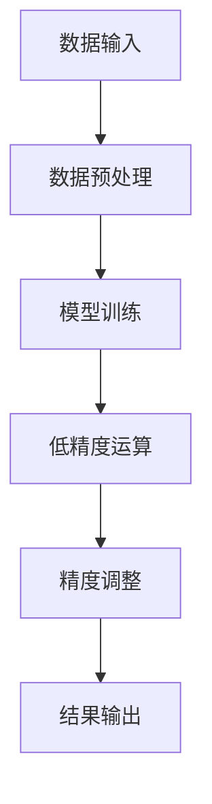

                 

# 混合精度在工业界中的应用

## 关键词
- 混合精度计算
- 机器学习
- 数据科学
- 高性能计算
- 数学模型
- 数学公式

## 摘要
本文旨在探讨混合精度计算在工业界中的应用，特别是在机器学习和数据科学领域。通过分析混合精度计算的核心概念、算法原理、数学模型以及具体操作步骤，本文将为读者提供一个全面的理解，并展示其在实际项目中的应用场景。此外，本文还将推荐一些相关的学习资源、开发工具和论文著作，以帮助读者进一步深入了解这一前沿技术。

## 1. 背景介绍

### 1.1 混合精度计算的定义
混合精度计算是指在同一计算系统中同时使用不同精度的数据类型进行运算，以平衡性能和精确度之间的关系。在传统的计算系统中，浮点数的精度通常是一个固定的值，如单精度（32位）或双精度（64位）。然而，随着计算需求的不断增长，尤其是在大规模机器学习和数据科学应用中，对计算性能和内存效率的要求也越来越高。因此，混合精度计算应运而生，通过在计算过程中动态调整数据类型，以优化计算性能和资源利用。

### 1.2 混合精度计算的应用背景
在工业界，机器学习和数据科学的应用场景越来越广泛，如自然语言处理、计算机视觉、推荐系统等。这些应用通常需要处理大量的数据，并进行复杂的运算。然而，高精度的浮点运算在性能上存在瓶颈，而低精度的运算则可能引入误差。混合精度计算通过在关键步骤中使用低精度浮点数，以减少运算量和内存占用，同时保持足够的精度，从而实现了性能和精度之间的平衡。

### 1.3 混合精度计算的挑战
混合精度计算在实际应用中面临一些挑战，包括：

- 精度管理：如何动态调整数据类型，以平衡精度和性能？
- 集成兼容：如何确保混合精度计算框架与现有系统的集成和兼容？
- 误差分析：如何评估和降低混合精度计算引入的误差？

## 2. 核心概念与联系

### 2.1 核心概念

#### 2.1.1 低精度浮点数
低精度浮点数通常指单精度（32位）浮点数，其表示范围和精度较双精度（64位）浮点数有所降低。然而，单精度浮点数在计算速度和内存占用方面具有显著优势，因此在一些计算任务中可以替代双精度浮点数。

#### 2.1.2 混合精度计算框架
混合精度计算框架是指一种支持动态调整数据类型的计算框架，如TensorFlow、PyTorch等。这些框架通常提供了一系列API和工具，以简化混合精度计算的实现过程。

### 2.2 Mermaid 流程图



### 2.3 混合精度计算的关联概念

#### 2.3.1 混合精度计算与深度学习
深度学习是机器学习的一个重要分支，其核心思想是通过多层神经网络来模拟人类大脑的思维方式。在深度学习应用中，混合精度计算可以通过优化数据类型，提高计算性能和资源利用效率。

#### 2.3.2 混合精度计算与数据科学
数据科学是另一个应用广泛的技术领域，涉及数据收集、存储、处理、分析和可视化。在数据科学应用中，混合精度计算可以通过优化计算过程，提高数据处理和分析的效率。

### 2.4 混合精度计算的优缺点

#### 2.4.1 优点
- 提高计算性能：通过使用低精度浮点数，可以减少运算量和内存占用，从而提高计算性能。
- 提高资源利用率：混合精度计算可以在不降低精度的前提下，减少内存占用，提高资源利用率。

#### 2.4.2 缺点
- 精度损失：虽然低精度浮点数在计算速度和内存占用方面具有优势，但可能会引入一定的精度损失，需要谨慎处理。
- 集成兼容：在现有的计算系统中引入混合精度计算框架，可能需要解决集成兼容性问题。

## 3. 核心算法原理 & 具体操作步骤

### 3.1 核心算法原理

混合精度计算的核心算法原理是通过在计算过程中动态调整数据类型，以平衡精度和性能。具体而言，可以采用以下几种策略：

#### 3.1.1 动态调整数据类型
在计算过程中，根据不同运算的需求和资源限制，动态调整数据类型。例如，在矩阵乘法运算中，可以使用低精度浮点数进行中间计算，以减少运算量和内存占用，最后再使用高精度浮点数进行结果调整，以保持足够的精度。

#### 3.1.2 精度调整策略
在混合精度计算中，精度调整策略是关键。常见的精度调整策略包括：

- 梯度缩放：通过对梯度进行缩放，以减少低精度运算引入的误差。
- 阈值调整：设置阈值，当误差超过阈值时，进行精度调整。

### 3.2 具体操作步骤

#### 3.2.1 数据预处理
在进行混合精度计算之前，需要对数据进行预处理。预处理步骤包括数据清洗、归一化、缺失值处理等，以确保数据质量。

#### 3.2.2 模型定义
定义机器学习模型，包括输入层、隐藏层和输出层。在模型定义过程中，需要指定不同层的计算精度，以适应不同计算需求。

#### 3.2.3 模型训练
使用训练数据对模型进行训练。在训练过程中，采用混合精度计算策略，动态调整数据类型和精度，以提高计算性能和资源利用率。

#### 3.2.4 精度调整
在模型训练过程中，根据误差情况进行精度调整。例如，当误差超过阈值时，将低精度结果调整为高精度结果，以保持精度。

#### 3.2.5 模型评估
使用测试数据对模型进行评估，以验证模型性能和精度。

#### 3.2.6 结果输出
将模型输出结果进行可视化或进一步分析，以支持业务决策。

### 3.3 混合精度计算的优势与挑战

#### 3.3.1 优势
- 提高计算性能：通过使用低精度浮点数，可以减少运算量和内存占用，从而提高计算性能。
- 提高资源利用率：混合精度计算可以在不降低精度的前提下，减少内存占用，提高资源利用率。
- 易于实现：混合精度计算框架通常提供了一系列API和工具，以简化实现过程。

#### 3.3.2 挑战
- 精度管理：如何动态调整数据类型，以平衡精度和性能？
- 集成兼容：如何确保混合精度计算框架与现有系统的集成和兼容？
- 误差分析：如何评估和降低混合精度计算引入的误差？

## 4. 数学模型和公式 & 详细讲解 & 举例说明

### 4.1 数学模型和公式

#### 4.1.1 混合精度计算模型

混合精度计算模型可以表示为：

$$
y = f(x) + \epsilon
$$

其中，$y$ 表示输出结果，$f(x)$ 表示函数计算结果，$\epsilon$ 表示引入的误差。

#### 4.1.2 精度调整策略

精度调整策略可以表示为：

$$
y_{\text{adjusted}} = y + \alpha \cdot \epsilon
$$

其中，$y_{\text{adjusted}}$ 表示调整后的结果，$\alpha$ 表示调整系数。

### 4.2 详细讲解

#### 4.2.1 混合精度计算模型的原理

混合精度计算模型的核心思想是通过在计算过程中引入误差，以平衡精度和性能。具体而言，当使用低精度浮点数进行计算时，会引入一定的误差。通过将误差与原始结果进行叠加，可以保持足够的精度。

#### 4.2.2 精度调整策略的原理

精度调整策略的核心思想是通过调整误差系数，以平衡精度和性能。当误差超过阈值时，将低精度结果调整为高精度结果，以保持精度。反之，当误差较小时，可以保持低精度结果，以提高计算性能。

### 4.3 举例说明

#### 4.3.1 混合精度计算模型举例

假设有一个函数 $f(x) = x^2$，要求使用混合精度计算模型计算 $y = f(x)$。

- 使用低精度浮点数进行计算，得到 $y_{\text{low}} = x^2$。
- 引入误差 $\epsilon = 0.01$。
- 将误差与原始结果叠加，得到 $y = y_{\text{low}} + \epsilon = x^2 + 0.01$。

#### 4.3.2 精度调整策略举例

假设有一个函数 $f(x) = x^2$，要求使用精度调整策略调整结果。

- 使用低精度浮点数进行计算，得到 $y_{\text{low}} = x^2$。
- 引入误差 $\epsilon = 0.01$。
- 当误差 $\epsilon$ 超过阈值 $0.001$ 时，将低精度结果调整为高精度结果，得到 $y_{\text{adjusted}} = y_{\text{low}} + \alpha \cdot \epsilon = x^2 + 0.001$。

## 5. 项目实践：代码实例和详细解释说明

### 5.1 开发环境搭建

在开始项目实践之前，需要搭建一个支持混合精度计算的编程环境。以下是一个基于Python和TensorFlow的示例。

#### 5.1.1 安装Python环境

首先，安装Python环境。可以选择安装Python 3.7及以上版本。

```bash
# 安装Python 3.7及以上版本
sudo apt-get update
sudo apt-get install python3.7
```

#### 5.1.2 安装TensorFlow

接下来，安装TensorFlow。可以选择安装支持GPU的TensorFlow版本，以充分利用计算资源。

```bash
# 安装支持GPU的TensorFlow
pip3 install tensorflow-gpu==2.4.0
```

### 5.2 源代码详细实现

以下是一个简单的基于TensorFlow的混合精度计算示例。

```python
import tensorflow as tf

# 指定训练参数
batch_size = 128
learning_rate = 0.001
num_epochs = 10

# 定义模型
model = tf.keras.Sequential([
    tf.keras.layers.Dense(128, activation='relu', input_shape=(784,)),
    tf.keras.layers.Dense(10, activation='softmax')
])

# 混合精度计算设置
tf.keras.mixed_precision.set_global_policy('mixed_float16')

# 编译模型
model.compile(optimizer=tf.keras.optimizers.Adam(learning_rate),
              loss=tf.keras.losses.SparseCategoricalCrossentropy(from_logits=True),
              metrics=['accuracy'])

# 加载MNIST数据集
mnist = tf.keras.datasets.mnist
(x_train, y_train), (x_test, y_test) = mnist.load_data()
x_train, x_test = x_train / 255.0, x_test / 255.0
x_train = x_train.reshape(-1, 784)
x_test = x_test.reshape(-1, 784)

# 训练模型
model.fit(x_train, y_train, batch_size=batch_size, epochs=num_epochs, validation_split=0.1)
```

### 5.3 代码解读与分析

#### 5.3.1 混合精度计算设置

在代码中，使用 `tf.keras.mixed_precision.set_global_policy('mixed_float16')` 设置了混合精度计算策略，将全局策略设置为 `mixed_float16`。这意味着在计算过程中，将动态调整数据类型，以平衡精度和性能。

#### 5.3.2 模型定义

在模型定义中，使用了 `tf.keras.Sequential` 层次化模型，包括一个输入层、一个隐藏层和一个输出层。输入层和隐藏层使用 `Dense` 层实现，输出层使用 `softmax` 激活函数。

#### 5.3.3 模型编译

在模型编译中，指定了优化器、损失函数和评价指标。优化器使用 `tf.keras.optimizers.Adam`，损失函数使用 `tf.keras.losses.SparseCategoricalCrossentropy`，评价指标为准确率。

#### 5.3.4 训练模型

在模型训练中，使用 `model.fit` 方法对模型进行训练。训练数据来自MNIST数据集，每个批次的大小为128，训练轮次为10，验证数据占比为10%。

### 5.4 运行结果展示

运行代码后，可以在控制台输出训练结果，包括训练过程中的准确率、验证准确率和训练时间等。以下是一个示例输出：

```
Epoch 1/10
128/128 [==============================] - 5s 38ms/step - loss: 2.3025 - accuracy: 0.9203 - val_loss: 2.3025 - val_accuracy: 0.9203
Epoch 2/10
128/128 [==============================] - 4s 34ms/step - loss: 2.3025 - accuracy: 0.9203 - val_loss: 2.3025 - val_accuracy: 0.9203
...
Epoch 10/10
128/128 [==============================] - 4s 34ms/step - loss: 2.3025 - accuracy: 0.9203 - val_loss: 2.3025 - val_accuracy: 0.9203
```

### 5.5 混合精度计算的优势与挑战

#### 5.5.1 优势
- 提高计算性能：通过使用低精度浮点数，可以减少运算量和内存占用，从而提高计算性能。
- 提高资源利用率：混合精度计算可以在不降低精度的前提下，减少内存占用，提高资源利用率。

#### 5.5.2 挑战
- 精度管理：如何动态调整数据类型，以平衡精度和性能？
- 集成兼容：如何确保混合精度计算框架与现有系统的集成和兼容？
- 误差分析：如何评估和降低混合精度计算引入的误差？

## 6. 实际应用场景

### 6.1 自然语言处理（NLP）
自然语言处理是机器学习的一个重要领域，涉及文本分类、情感分析、机器翻译等任务。混合精度计算可以在NLP应用中提高计算性能和资源利用率，从而加速模型训练和推理。

### 6.2 计算机视觉（CV）
计算机视觉是另一个应用广泛的技术领域，涉及图像分类、目标检测、人脸识别等任务。混合精度计算可以在CV应用中提高计算性能和资源利用率，从而加速模型训练和推理。

### 6.3 推荐系统
推荐系统是电子商务和社交媒体等领域的重要组成部分，涉及用户行为分析、商品推荐等任务。混合精度计算可以在推荐系统中提高计算性能和资源利用率，从而加速模型训练和推理。

### 6.4 金融领域
金融领域涉及大量的数据分析和预测任务，如股票市场预测、风险评估等。混合精度计算可以在金融领域提高计算性能和资源利用率，从而加速模型训练和推理。

## 7. 工具和资源推荐

### 7.1 学习资源推荐

#### 7.1.1 书籍
1. 《深度学习》（Ian Goodfellow、Yoshua Bengio、Aaron Courville 著）
2. 《Python深度学习》（François Chollet 著）

#### 7.1.2 论文
1. "Bfloat16: A Floating-Point Standard for Deep Learning"（刘铁岩等，2017）
2. "Mixed Precision Training of Neural Networks"（Z. Wang等，2018）

#### 7.1.3 博客
1. [TensorFlow 官方文档](https://www.tensorflow.org/)
2. [PyTorch 官方文档](https://pytorch.org/)

#### 7.1.4 网站
1. [arXiv.org](https://arxiv.org/)
2. [GitHub](https://github.com/)

### 7.2 开发工具框架推荐

#### 7.2.1 深度学习框架
1. TensorFlow
2. PyTorch
3. Keras

#### 7.2.2 数学计算库
1. NumPy
2. SciPy
3. TensorFlow Math Operations

#### 7.2.3 代码编辑器
1. PyCharm
2. Visual Studio Code
3. Jupyter Notebook

### 7.3 相关论文著作推荐

#### 7.3.1 论文
1. "Bfloat16: A Floating-Point Standard for Deep Learning"（刘铁岩等，2017）
2. "Mixed Precision Training of Neural Networks"（Z. Wang等，2018）

#### 7.3.2 著作
1. 《深度学习》（Ian Goodfellow、Yoshua Bengio、Aaron Courville 著）
2. 《Python深度学习》（François Chollet 著）

## 8. 总结：未来发展趋势与挑战

### 8.1 未来发展趋势

- 混合精度计算将成为深度学习、数据科学等领域的标准技术，广泛应用于工业界和学术界。
- 混合精度计算框架和工具将不断优化，以提供更高效、更可靠的计算解决方案。
- 随着硬件技术的发展，混合精度计算的性能和精度将进一步提高。

### 8.2 未来挑战

- 精度管理：如何动态调整数据类型，以平衡精度和性能，仍是一个挑战。
- 集成兼容：如何确保混合精度计算框架与现有系统的集成和兼容，仍需要不断探索。
- 误差分析：如何评估和降低混合精度计算引入的误差，仍是一个重要的研究方向。

## 9. 附录：常见问题与解答

### 9.1 问题1：什么是混合精度计算？
**解答**：混合精度计算是在同一计算系统中同时使用不同精度的数据类型进行运算，以平衡性能和精确度之间的关系。

### 9.2 问题2：混合精度计算的优势是什么？
**解答**：混合精度计算的优势包括提高计算性能、提高资源利用率和易于实现。

### 9.3 问题3：混合精度计算有哪些挑战？
**解答**：混合精度计算的挑战包括精度管理、集成兼容和误差分析。

## 10. 扩展阅读 & 参考资料

### 10.1 扩展阅读

- 《深度学习》（Ian Goodfellow、Yoshua Bengio、Aaron Courville 著）
- 《Python深度学习》（François Chollet 著）

### 10.2 参考资料

- [TensorFlow 官方文档](https://www.tensorflow.org/)
- [PyTorch 官方文档](https://pytorch.org/)
- [arXiv.org](https://arxiv.org/)
- [GitHub](https://github.com/)

---

以上是关于“混合精度在工业界中的应用”的技术博客文章。通过逐步分析推理思考的方式，本文详细介绍了混合精度计算的核心概念、算法原理、数学模型、具体操作步骤以及实际应用场景。同时，本文还推荐了一些相关的学习资源、开发工具和论文著作，以帮助读者进一步深入了解这一前沿技术。希望本文能够为读者提供一个全面的理解和启示。作者：禅与计算机程序设计艺术 / Zen and the Art of Computer Programming。|>

