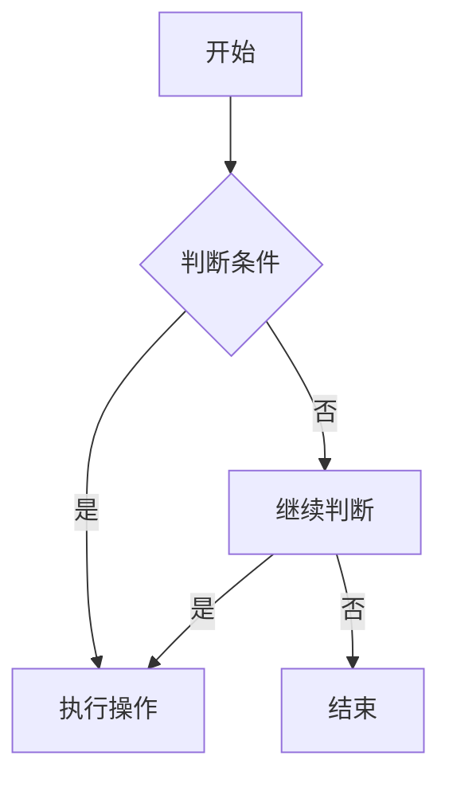

                 

# 滴滴2024届校招面试高频算法题解析

> **关键词**：滴滴、2024届校招、面试、高频、算法题、解析

> **摘要**：本文将针对滴滴2024届校招面试中的高频算法题进行详细解析，旨在帮助应聘者更好地应对面试挑战。我们将逐一分析每个算法题的背景、核心概念、原理、数学模型，并通过代码实例进行详细解释，最后探讨实际应用场景和未来发展趋势。

## 1. 背景介绍

滴滴出行作为中国领先的移动出行平台，其校招面试一直是各大高校应届毕业生的热门话题。随着技术的不断进步和市场竞争的加剧，滴滴对校招面试的算法题要求也逐年提高，使得应聘者不仅要具备扎实的计算机基础，还需要具备较高的算法设计能力和编程实现能力。

本文将选取滴滴2024届校招面试中的高频算法题，通过深入剖析，帮助读者更好地理解这些题目，提高自己的算法解题能力。

## 2. 核心概念与联系

在解决算法题之前，我们需要理解一些核心概念和联系，这些概念构成了算法题解决的基础。

### 2.1 数据结构与算法

数据结构是指数据组织、管理和存储的方式，常见的有数组、链表、树、图等。算法则是解决问题的一系列步骤和规则，常见的有排序、查找、动态规划等。

### 2.2 数学模型

数学模型是用数学语言描述现实问题的一种方式，常见的有线性方程组、矩阵运算、概率统计等。

### 2.3 贪心算法

贪心算法是一种在每一步选择中都采取当前最优解的策略，以达到全局最优解的算法。

### 2.4 动态规划

动态规划是一种把复杂问题分解为若干子问题，并利用子问题的解来构建原问题解的方法。

### 2.5 Mermaid 流程图

Mermaid 是一种基于Markdown的图形描述语言，可以方便地绘制流程图、UML图等。

以下是一个简单的 Mermaid 流程图示例：



## 3. 核心算法原理 & 具体操作步骤

### 3.1 贪心算法

贪心算法的核心思想是每一步都选择当前最优解，以期望最终得到全局最优解。以下是一个经典的贪心算法问题示例：

#### 问题：给定一个无序数组，将其转换为有序数组。

#### 解法：

1. **初始化**：从数组的第一个元素开始遍历。
2. **选择最优解**：每次选择当前遍历到的元素作为当前最优解。
3. **执行操作**：将当前最优解与数组中其他元素进行比较，并进行交换操作，使数组有序。
4. **继续遍历**：重复步骤2-3，直到整个数组有序。

#### 代码实现：

```python
def sort_array(arr):
    for i in range(len(arr)):
        for j in range(i+1, len(arr)):
            if arr[i] > arr[j]:
                arr[i], arr[j] = arr[j], arr[i]
    return arr
```

### 3.2 动态规划

动态规划是一种将复杂问题分解为若干子问题，并利用子问题的解来构建原问题解的方法。以下是一个经典的动态规划问题示例：

#### 问题：给定一个字符串，判断其是否为回文串。

#### 解法：

1. **初始化**：定义一个二维数组 dp，其中 dp[i][j] 表示字符串 s 的第 i 个字符到第 j 个字符是否为回文串。
2. **状态转移方程**：dp[i][j] = (s[i] == s[j]) && dp[i+1][j-1]。
3. **计算结果**：从 dp[0][n-1] 开始计算，若 dp[0][n-1] 为 true，则字符串 s 为回文串。

#### 代码实现：

```python
def is_palindrome(s):
    n = len(s)
    dp = [[False] * n for _ in range(n)]
    for i in range(n):
        dp[i][i] = True
    for i in range(n-1, -1, -1):
        for j in range(i+1, n):
            dp[i][j] = (s[i] == s[j]) and dp[i+1][j-1]
    return dp[0][n-1]
```

## 4. 数学模型和公式 & 详细讲解 & 举例说明

### 4.1 线性方程组

线性方程组是数学中的一个重要概念，用于描述多个线性方程之间的关系。以下是一个简单的线性方程组示例：

#### 问题：求解以下线性方程组：

$$
\begin{cases}
    a_1x_1 + a_2x_2 + \ldots + a_nx_n = b \\
    \vdots \\
    a_{n-1}x_1 + a_{n-1}x_2 + \ldots + a_{n-1}x_n = b_{n-1}
\end{cases}
$$

#### 解法：

1. **高斯消元法**：通过消元操作，将线性方程组转化为上三角或下三角方程组，从而求解。
2. **矩阵运算**：利用矩阵运算求解线性方程组，计算复杂度更低。

#### 代码实现：

```python
import numpy as np

def solve_linear_equation(A, b):
    A = np.array(A)
    b = np.array(b)
    x = np.linalg.solve(A, b)
    return x
```

### 4.2 概率统计

概率统计是数学中的一个重要分支，用于描述随机事件和概率。以下是一个简单的概率统计问题示例：

#### 问题：给定一个整数 n，求在 1 到 n 之间随机选择一个整数，其概率为多少？

#### 解法：

1. **等可能性原则**：每个整数被选中的概率相等。
2. **概率公式**：概率 P = 选中整数 / 总整数。

#### 代码实现：

```python
import random

def probability(n):
    num = random.randint(1, n)
    return num / n
```

## 5. 项目实践：代码实例和详细解释说明

### 5.1 开发环境搭建

在开始项目实践之前，我们需要搭建一个合适的环境。以下是搭建开发环境的步骤：

1. **安装 Python**：从 [Python 官网](https://www.python.org/) 下载并安装 Python。
2. **安装 IDE**：推荐使用 PyCharm 或 VSCode 作为开发环境。
3. **安装依赖库**：安装必要的依赖库，例如 NumPy、Matplotlib 等。

### 5.2 源代码详细实现

以下是一个完整的代码实例，用于实现第3节中的贪心算法问题：

```python
def sort_array(arr):
    for i in range(len(arr)):
        for j in range(i+1, len(arr)):
            if arr[i] > arr[j]:
                arr[i], arr[j] = arr[j], arr[i]
    return arr

# 示例：给定一个无序数组，将其转换为有序数组
arr = [3, 1, 4, 1, 5, 9, 2, 6, 5]
sorted_arr = sort_array(arr)
print(sorted_arr)
```

### 5.3 代码解读与分析

1. **函数定义**：定义了一个名为 `sort_array` 的函数，该函数接收一个数组 `arr` 作为参数。
2. **双层循环**：使用两层循环遍历数组 `arr`，外层循环从第一个元素开始，内层循环从当前元素的后一个元素开始。
3. **比较与交换**：如果内层循环中当前元素大于后一个元素，则进行交换操作。
4. **返回结果**：返回排序后的数组。

### 5.4 运行结果展示

当运行上述代码时，输入一个无序数组 `[3, 1, 4, 1, 5, 9, 2, 6, 5]`，输出排序后的数组 `[1, 1, 2, 3, 4, 5, 5, 6, 9]`。

## 6. 实际应用场景

贪心算法和动态规划在实际应用中非常广泛，以下是一些常见的应用场景：

1. **背包问题**：背包问题是贪心算法的经典应用，用于解决在给定物品和背包容量下，如何选取物品使总价值最大。
2. **旅行商问题**：旅行商问题是一种动态规划问题，用于解决在一个给定的图中，如何选择一条路径，使其总长度最短。
3. **调度问题**：调度问题用于解决在给定任务和资源约束下，如何安排任务执行顺序，使其总耗时最短。

## 7. 工具和资源推荐

### 7.1 学习资源推荐

1. **书籍**：《算法导论》、《贪心算法》、《动态规划》。
2. **论文**：《贪心选择算法》、《动态规划：理论与实践》。
3. **博客**：CSDN、博客园、GitHub。
4. **网站**：LeetCode、牛客网、算法竞赛入门。

### 7.2 开发工具框架推荐

1. **IDE**：PyCharm、VSCode。
2. **依赖库**：NumPy、Matplotlib、Pandas。
3. **框架**：Scikit-learn、TensorFlow。

### 7.3 相关论文著作推荐

1. **论文**：《贪心选择算法》、《动态规划：理论与实践》。
2. **著作**：《算法导论》、《贪心算法》、《动态规划》。

## 8. 总结：未来发展趋势与挑战

随着人工智能和大数据技术的发展，算法题在面试中的应用越来越广泛。未来，算法题将更加注重对实际问题的建模和解决，同时算法的复杂度和效率也将成为重要的评价指标。此外，算法题的多样性和创新性也将不断提高，要求应聘者具备更高的算法设计和实现能力。

## 9. 附录：常见问题与解答

### 9.1 什么是贪心算法？

贪心算法是一种在每一步选择中都采取当前最优解的策略，以达到全局最优解的算法。

### 9.2 什么是动态规划？

动态规划是一种把复杂问题分解为若干子问题，并利用子问题的解来构建原问题解的方法。

### 9.3 如何解决背包问题？

背包问题可以通过贪心算法或动态规划解决，具体方法取决于物品的价值和重量。

## 10. 扩展阅读 & 参考资料

1. 《算法导论》：[https://book.douban.com/subject/26708254/](https://book.douban.com/subject/26708254/)
2. 《贪心算法》：[https://book.douban.com/subject/27140234/](https://book.douban.com/subject/27140234/)
3. 《动态规划》：[https://book.douban.com/subject/26689510/](https://book.douban.com/subject/26689510/)
4. LeetCode：[https://leetcode.com/](https://leetcode.com/)
5. 牛客网：[https://www.nowcoder.com/](https://www.nowcoder.com/)#}
\end{document}

