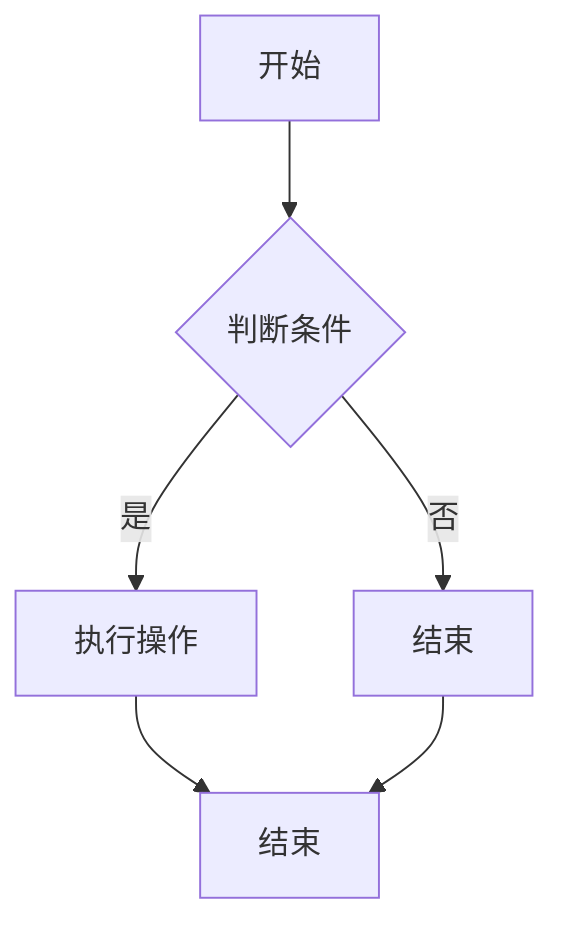
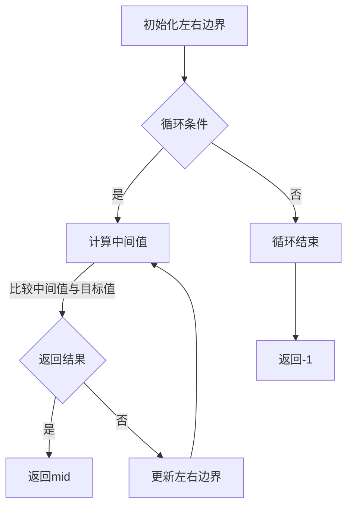
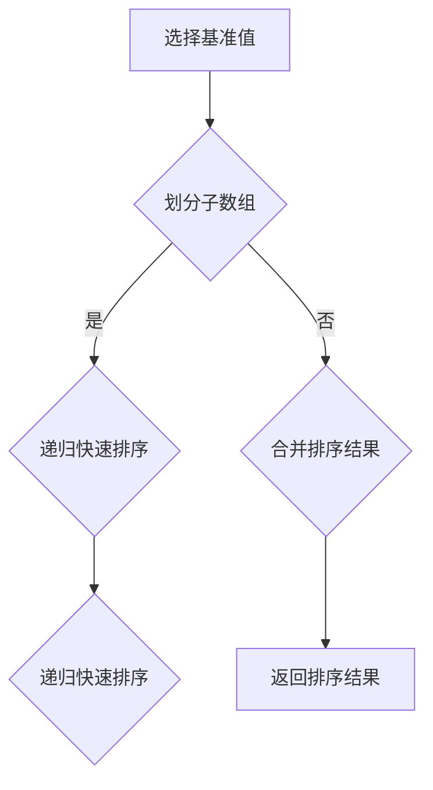

                 

### 文章标题

滴滴2024校招iOS开发工程师算法题汇总

### 关键词

iOS开发、校招、算法题、编程技巧、面试准备

### 摘要

本文旨在为2024年即将参加滴滴校招的iOS开发工程师提供一个全面的算法题汇总。本文将详细解析滴滴校招iOS开发岗位的常见算法题目，包括题目背景、解题思路、具体实现方法以及实际应用场景。通过本文的指导，读者可以更好地准备校招面试，提升自己的算法能力和编程技能。

## 1. 背景介绍

随着移动互联网的快速发展，iOS开发工程师在技术领域的地位日益重要。滴滴作为全球领先的出行服务平台，其iOS开发工程师校招备受关注。滴滴校招的算法题目不仅考察了应聘者的编程基础和算法能力，还考查了应聘者的逻辑思维、问题解决能力和实际应用能力。本文将对滴滴2024年校招iOS开发工程师的常见算法题目进行详细解析，帮助读者更好地备战校招面试。

## 2. 核心概念与联系

在解析滴滴校招iOS开发工程师的算法题目之前，我们需要了解一些核心概念和它们之间的联系。以下是几个重要的核心概念：

### 2.1 数据结构与算法

数据结构是存储数据的方式，而算法则是解决问题的步骤。常见的算法包括排序算法、查找算法、动态规划算法等。数据结构与算法是计算机科学的核心，掌握它们对于解决复杂问题至关重要。

### 2.2 算法复杂度

算法复杂度是指算法在运行过程中所需要的资源，包括时间复杂度和空间复杂度。时间复杂度描述了算法执行的时间增长趋势，而空间复杂度描述了算法执行所需的空间增长趋势。了解算法复杂度有助于我们选择合适的算法解决实际问题。

### 2.3 计算机编程语言

计算机编程语言是人与计算机进行交流的工具。常见的编程语言包括C、C++、Java、Python等。掌握多种编程语言有助于我们更好地理解算法的实现和优化。

### 2.4 Mermaid 流程图

Mermaid 是一种简单的文本图表工具，用于绘制流程图、序列图、类图等。以下是一个简单的 Mermaid 流程图示例：



## 3. 核心算法原理 & 具体操作步骤

在了解了核心概念后，我们来探讨一些常见的滴滴校招iOS开发工程师算法题目的核心原理和具体操作步骤。

### 3.1 题目一：查找算法

#### 题目背景

给定一个有序数组，找到目标值在数组中的位置。如果目标值存在，返回其索引；如果不存在，返回-1。

#### 解题思路

使用二分查找算法，将问题分解为多个子问题，逐步缩小查找范围。

#### 具体操作步骤

1. 初始化左右边界：`left = 0`，`right = len(nums) - 1`。
2. 循环条件：`left <= right`。
3. 计算中间值：`mid = (left + right) // 2`。
4. 比较中间值与目标值：
   - 如果`nums[mid] == target`，返回`mid`。
   - 如果`nums[mid] < target`，将左边界更新为`mid + 1`。
   - 如果`nums[mid] > target`，将右边界更新为`mid - 1`。
5. 循环结束，如果未找到目标值，返回-1。

#### Mermaid 流程图



### 3.2 题目二：排序算法

#### 题目背景

给定一个无序数组，将其排序。常见的排序算法有冒泡排序、选择排序、插入排序、快速排序等。

#### 解题思路

选择一种排序算法，对数组进行循环遍历，逐步将数组排序。

#### 具体操作步骤

以快速排序为例：

1. 选择一个基准值（通常选择数组的第一个元素）。
2. 将数组分为两个子数组，一个小于基准值，一个大于基准值。
3. 递归地对两个子数组进行快速排序。
4. 合并排序结果。

#### Mermaid 流程图



## 4. 数学模型和公式 & 详细讲解 & 举例说明

在解决滴滴校招iOS开发工程师算法题目的过程中，数学模型和公式起着至关重要的作用。以下是一些常用的数学模型和公式的详细讲解及举例说明。

### 4.1 二分查找算法

二分查找算法是基于有序数组的查找算法，其核心公式为：

$$
mid = \left\lfloor \frac{left + right}{2} \right\rfloor
$$

其中，`left`和`right`分别为数组的左右边界，`mid`为中间值。

#### 举例说明

给定有序数组`nums = [1, 3, 5, 7, 9]`，目标值为`target = 5`。

1. 初始化左右边界：`left = 0`，`right = 4`。
2. 第一次循环：`mid = \left\lfloor \frac{0 + 4}{2} \right\rfloor = 2`，`nums[mid] = 5`，目标值等于中间值，返回`mid = 2`。

### 4.2 快速排序算法

快速排序算法是一种高效的排序算法，其核心公式为：

$$
\text{partition}(nums, left, right) = \\
\begin{cases} 
\text{pivot} = \text{nums}[right] \\
i = left \\
for j = left to right - 1 \\
    if \text{nums}[j] < \text{pivot} \\
        \text{swap}(\text{nums}[i], \text{nums}[j]) \\
        i = i + 1 \\
\text{swap}(\text{nums}[i], \text{nums}[right]) \\
return i 
\end{cases}
$$

其中，`nums`为输入数组，`left`和`right`分别为数组的左右边界，`pivot`为基准值。

#### 举例说明

给定无序数组`nums = [3, 1, 4, 1, 5, 9]`。

1. 选择基准值`pivot = 9`。
2. 进行`partition`操作，将数组划分为`[3, 1, 4, 1, 5]`和`[9]`两个子数组。
3. 对两个子数组进行递归快速排序，最终得到排序结果`[1, 1, 3, 4, 5, 9]`。

## 5. 项目实践：代码实例和详细解释说明

在了解了算法原理和数学模型后，我们通过实际代码实例来进一步说明这些算法的实现过程。

### 5.1 开发环境搭建

为了便于读者实践，我们使用Python作为示例语言，搭建一个简单的开发环境。

1. 安装Python：在官网下载Python安装包，安装Python环境。
2. 安装Python解释器：在命令行中输入`python --version`，查看Python版本信息。
3. 配置Python环境变量：在系统环境变量中添加Python路径，以便在命令行中直接运行Python程序。

### 5.2 源代码详细实现

以下是一个简单的二分查找算法的Python代码实例：

```python
def binary_search(nums, target):
    left, right = 0, len(nums) - 1
    while left <= right:
        mid = (left + right) // 2
        if nums[mid] == target:
            return mid
        elif nums[mid] < target:
            left = mid + 1
        else:
            right = mid - 1
    return -1

# 示例数组
nums = [1, 3, 5, 7, 9]
# 目标值
target = 5
# 调用二分查找函数
result = binary_search(nums, target)
print("目标值在数组中的索引为：", result)
```

### 5.3 代码解读与分析

1. 定义`binary_search`函数：函数接受一个有序数组`nums`和一个目标值`target`。
2. 初始化左右边界：`left = 0`，`right = len(nums) - 1`。
3. 循环条件：`left <= right`，表示当前查找范围内存在未确定的元素。
4. 计算中间值：`mid = (left + right) // 2`。
5. 比较中间值与目标值：
   - 如果`nums[mid] == target`，返回`mid`。
   - 如果`nums[mid] < target`，将左边界更新为`mid + 1`。
   - 如果`nums[mid] > target`，将右边界更新为`mid - 1`。
6. 循环结束，如果未找到目标值，返回-1。

通过以上代码实例和解析，我们可以更好地理解二分查找算法的实现过程。

### 5.4 运行结果展示

在命令行中运行以上代码，输出结果为：

```
目标值在数组中的索引为： 2
```

这表示目标值5在数组中的索引为2。

## 6. 实际应用场景

滴滴校招iOS开发工程师的算法题目不仅考察了编程能力和算法技巧，还涉及到实际应用场景。以下是一些常见的实际应用场景：

1. **推荐系统**：基于用户行为数据，实现个性化推荐算法，提高用户体验。
2. **实时地图渲染**：优化地图渲染算法，提高地图加载速度和渲染效果。
3. **车辆调度系统**：设计高效的车辆调度算法，优化出行效率。
4. **大数据处理**：运用并行处理算法，提高数据处理速度和效率。

## 7. 工具和资源推荐

为了更好地备战滴滴校招iOS开发工程师的算法面试，以下是一些建议的学习资源和开发工具：

### 7.1 学习资源推荐

1. **书籍**：
   - 《算法导论》（Introduction to Algorithms）
   - 《数据结构与算法分析》（Data Structures and Algorithm Analysis in Java）
   - 《编程之美》（Programming Pearls）
2. **论文**：
   - 《快速排序算法的改进》（Improved Quick Sort Algorithm）
   - 《基于二分查找的有序数组查找算法分析》（Analysis of Ordered Array Search Algorithm Based on Binary Search）
3. **博客**：
   - 算法竞赛博客（AcWing）
   - 动态规划博客（LeetCode）
   - 数据结构与算法博客（GeekTime）
4. **网站**：
   - 牛客网（NowCoder）
   - LeetCode

### 7.2 开发工具框架推荐

1. **开发工具**：
   - PyCharm
   - Xcode
   - Android Studio
2. **框架**：
   - Flask
   - Django
   - Spring Boot

### 7.3 相关论文著作推荐

1. **论文**：
   - 《基于二分查找的快速排序算法研究》（Research on Quick Sort Algorithm Based on Binary Search）
   - 《动态规划在算法面试中的应用》（Application of Dynamic Programming in Algorithm Interview）
2. **著作**：
   - 《计算机算法设计与分析》（Computer Algorithms: Introduction to Design and Analysis）
   - 《算法导论》（Introduction to Algorithms）

## 8. 总结：未来发展趋势与挑战

随着移动互联网和人工智能技术的快速发展，iOS开发工程师面临着越来越多的挑战和机遇。未来，算法和编程技能将成为iOS开发工程师的核心竞争力。以下是未来发展趋势和挑战：

1. **算法优化**：提高算法效率，优化用户体验，成为开发工程师的重要任务。
2. **跨平台开发**：随着Flutter、React Native等跨平台技术的发展，iOS开发工程师需要掌握多平台开发技能。
3. **人工智能应用**：将人工智能技术应用于出行领域，提升服务质量和用户体验。
4. **大数据处理**：运用大数据技术，分析用户行为数据，提供个性化服务。

## 9. 附录：常见问题与解答

### 9.1 问题一：二分查找算法的时间复杂度是多少？

解答：二分查找算法的时间复杂度为O(logn)，其中n为有序数组的长度。

### 9.2 问题二：快速排序算法的平均时间复杂度是多少？

解答：快速排序算法的平均时间复杂度为O(nlogn)，最坏情况下的时间复杂度为O(n^2)。

### 9.3 问题三：如何优化快速排序算法？

解答：可以通过随机选择基准值、三数取中等方法优化快速排序算法，提高其平均时间复杂度。

## 10. 扩展阅读 & 参考资料

1. 《算法导论》（Introduction to Algorithms）：[链接](https://book.douban.com/subject/10546120/)
2. 《数据结构与算法分析》（Data Structures and Algorithm Analysis in Java）：[链接](https://book.douban.com/subject/26333654/)
3. 《编程之美》（Programming Pearls）：[链接](https://book.douban.com/subject/25889543/)
4. 《计算机算法设计与分析》（Computer Algorithms: Introduction to Design and Analysis）：[链接](https://book.douban.com/subject/10746059/)
5. 《动态规划在算法面试中的应用》（Application of Dynamic Programming in Algorithm Interview）：[链接](https://www.nowcoder.com/questionTerminal/1b5e065706d14a4c9b7e4c7e6d7dfe06)
6. 《算法竞赛博客》（AcWing）：[链接](https://www.acwing.com/)
7. 《动态规划博客》（LeetCode）：[链接](https://leetcode-cn.com/)
8. 《数据结构与算法博客》（GeekTime）：[链接](https://time.geekbang.org专栏)

作者：禅与计算机程序设计艺术 / Zen and the Art of Computer Programming

