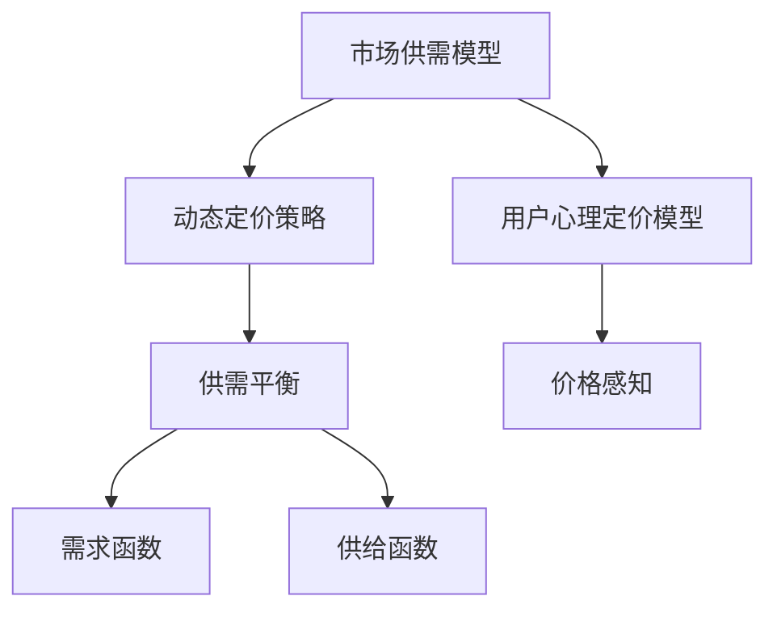
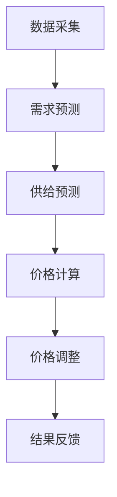

                 

### 背景介绍

滴滴出行，作为中国乃至全球知名的网约车平台，其核心业务涵盖了出行需求匹配、定价策略、用户满意度等多个方面。在如此庞大而复杂的业务场景中，网约车定价算法作为一项关键技术，起到了至关重要的作用。

**定价算法的重要性**

网约车定价算法的主要目标是确定乘客支付的打车费用。这一过程不仅仅是一个简单的价格计算，而是涉及到多个因素的复杂决策过程，包括但不限于：

1. **供需平衡**：在高峰时段和低谷时段，车辆的供给和乘客的需求会有所不同，定价算法需要平衡这一供需关系，以优化乘客的出行体验和司机的收入。
2. **动态调整**：根据交通状况、天气条件、节假日等因素，算法需要实时调整价格，以保持市场的动态平衡。
3. **用户心理**：乘客对价格的敏感度也会影响定价策略，算法需要考虑用户的支付能力和心理预期。

**市场现状**

目前，滴滴等网约车平台普遍采用动态定价策略，以应对市场的变化。这种策略下，价格会根据供需情况以及外部环境因素动态调整。尽管这种方法在一定程度上能够提高平台的收益，但同时也带来了一些挑战，例如可能导致价格波动过大、乘客和司机的不满等。

**本文目的**

本文将深入探讨网约车定价算法的核心概念和原理，从供需平衡、动态调整、用户心理等多个角度分析其工作原理和实现方法。我们将以滴滴2025网约车定价算法为例，详细解释其设计和实现过程，并通过具体的数学模型和代码实例，展示算法在实际应用中的效果。

通过本文的阅读，读者将能够：

1. 理解网约车定价算法的基本概念和原理。
2. 掌握核心算法的具体操作步骤和数学模型。
3. 分析实际应用场景中的挑战和解决方案。
4. 了解相关的工具和资源，以便进一步学习和实践。

在接下来的章节中，我们将逐步展开，深入讨论这一话题，希望能够为读者提供有价值的参考和启示。  

---

## 2. 核心概念与联系

为了深入理解网约车定价算法，我们首先需要明确几个核心概念，并探讨它们之间的联系。以下内容将帮助读者搭建一个坚实的基础，以便更好地理解后续的算法原理和实现过程。

### 动态定价策略

动态定价（Dynamic Pricing）是指根据市场供需情况以及外部环境因素实时调整产品或服务的价格。在网约车行业中，动态定价能够帮助平台优化资源配置，提高收益。

**关键因素**

- **供需关系**：在高峰时段，乘客需求量增加，而司机供给量相对稳定，这可能导致价格上涨。在低谷时段则相反，需求减少，价格下降。
- **外部因素**：包括交通状况、天气条件、节假日等。例如，在雨天或节假日，乘客需求可能增加，价格也会相应上调。

### 市场供需模型

市场供需模型是动态定价策略的基础。它通过分析供需关系，预测市场变化，从而制定相应的定价策略。

**供需平衡**

供需平衡是动态定价的核心目标。在供需平衡状态下，价格既能够吸引足够的乘客，也能够保证司机的积极参与。

**需求函数**

需求函数（Demand Function）描述了乘客数量与价格之间的关系。通常情况下，需求函数呈反比例关系，即价格上升，需求下降。

**供给函数**

供给函数（Supply Function）描述了司机数量与价格之间的关系。供给函数通常与需求函数相似，但方向相反。

### 用户心理定价模型

用户心理定价模型关注乘客对价格的心理预期和敏感度。这一模型通过分析用户行为和市场反馈，调整定价策略，以提高用户满意度和市场占有率。

**价格感知**

价格感知（Price Perception）是指用户对价格的主观感受。价格感知受到多种因素的影响，包括用户收入水平、消费习惯等。

**心理定价策略**

心理定价策略包括高价策略、低价策略等。高价策略通过塑造高端形象，提高用户的支付意愿；低价策略则通过吸引价格敏感型用户，扩大市场份额。

### Mermaid 流程图

为了更直观地展示核心概念之间的联系，我们使用Mermaid流程图来表示：



通过上述流程图，我们可以清晰地看到市场供需模型、动态定价策略和用户心理定价模型之间的相互作用。这些核心概念共同构成了网约车定价算法的理论基础，为后续的算法设计和实现提供了重要的指导。

### 3. 核心算法原理 & 具体操作步骤

在明确了核心概念和它们之间的联系后，接下来我们将深入探讨网约车定价算法的核心原理和具体操作步骤。为了便于理解，我们将分阶段介绍这一算法的工作流程。

#### 3.1 算法设计目标

网约车定价算法的设计目标主要包括：

1. **优化供需平衡**：通过动态调整价格，使供需关系达到最优状态，从而提高整体市场效率。
2. **提升用户满意度**：考虑乘客和司机的心理预期，制定合理的定价策略，以提升用户体验。
3. **平衡收入与成本**：在保证司机收入稳定的同时，控制平台运营成本，实现可持续发展。

#### 3.2 算法基本原理

网约车定价算法基于以下几个基本原理：

1. **供需关系调整**：通过实时监控市场供需变化，调整价格以平衡供需关系。
2. **动态调整机制**：根据不同时段和外部环境变化，实时调整价格，保持市场的动态平衡。
3. **用户心理模型**：结合乘客对价格的心理预期，制定相应的定价策略，提升用户满意度。

#### 3.3 算法操作步骤

以下是网约车定价算法的操作步骤：

1. **数据采集**：采集实时交通数据、天气数据、历史订单数据等，为定价提供基础信息。

2. **需求预测**：利用历史数据和机器学习算法，预测未来一段时间内的乘客需求量。

3. **供给预测**：根据司机的接单意愿和实时在线状态，预测未来一段时间内的司机供给量。

4. **价格计算**：根据供需预测结果，结合用户心理定价模型，计算建议价格。

5. **价格调整**：将建议价格与当前市场价格进行对比，根据调整规则进行价格调整。

6. **结果反馈**：将调整后的价格反馈给乘客和司机，并监控市场反应，进一步优化定价策略。

#### 3.4 算法实现细节

以下是算法实现的一些关键细节：

1. **实时数据处理**：使用流处理技术（如Apache Kafka、Apache Flink）对实时数据进行处理，保证数据的高效传输和处理。

2. **机器学习模型**：利用机器学习算法（如线性回归、神经网络等）进行需求预测和供给预测，提高预测精度。

3. **价格调整规则**：根据市场需求和用户心理，制定合理的价格调整规则，如阶梯价格、折扣策略等。

4. **用户反馈机制**：通过用户评价和反馈数据，不断优化定价策略，提升用户体验。

#### 3.5 算法流程图

为了更直观地展示算法操作步骤，我们使用Mermaid流程图表示：



通过上述流程图，我们可以清晰地看到网约车定价算法从数据采集到结果反馈的整个过程，每个步骤都紧密相连，共同实现优化供需平衡、提升用户满意度等目标。

### 4. 数学模型和公式 & 详细讲解 & 举例说明

在理解了网约车定价算法的基本原理和操作步骤后，我们将进一步探讨其背后的数学模型和公式。通过这些数学工具，我们可以更精确地描述供需关系、用户心理定价策略，从而优化定价算法。

#### 4.1 需求函数

需求函数是网约车定价算法的核心组成部分，它描述了乘客数量与价格之间的关系。通常，需求函数可以表示为：

\[ D(p) = D_0 \times e^{-\alpha p} \]

其中：
- \( D(p) \) 表示在价格 \( p \) 下的乘客需求量；
- \( D_0 \) 是一个常数，表示基准需求量；
- \( \alpha \) 是需求敏感度参数，反映了价格变化对需求量的影响程度。

例如，假设在某个时段，基准需求量为1000人，需求敏感度参数 \( \alpha \) 为0.1。当价格从10元上涨到20元时，需求量将下降为：

\[ D(20) = 1000 \times e^{-0.1 \times 20} \approx 1000 \times e^{-2} \approx 100 \]

#### 4.2 供给函数

供给函数描述了司机数量与价格之间的关系。供给函数通常与需求函数类似，但方向相反。供给函数可以表示为：

\[ S(p) = S_0 \times e^{\beta p} \]

其中：
- \( S(p) \) 表示在价格 \( p \) 下的司机供给量；
- \( S_0 \) 是一个常数，表示基准供给量；
- \( \beta \) 是供给敏感度参数，反映了价格变化对供给量的影响程度。

例如，假设在某个时段，基准供给量为500人，供给敏感度参数 \( \beta \) 为0.05。当价格从10元上涨到20元时，供给量将增加为：

\[ S(20) = 500 \times e^{0.05 \times 20} \approx 500 \times e^{1} \approx 5000 \]

#### 4.3 供需平衡

供需平衡是动态定价算法的核心目标。供需平衡状态下的价格 \( p^* \) 可以通过以下公式计算：

\[ D(p^*) = S(p^*) \]

将需求函数和供给函数代入上述公式，得到：

\[ D_0 \times e^{-\alpha p^*} = S_0 \times e^{\beta p^*} \]

取自然对数后，得到：

\[ -\alpha p^* + \ln(D_0) = \beta p^* + \ln(S_0) \]

整理后得到价格 \( p^* \) 的表达式：

\[ p^* = \frac{\ln(D_0) - \ln(S_0)}{\alpha - \beta} \]

#### 4.4 用户心理定价模型

用户心理定价模型关注乘客对价格的心理预期和敏感度。假设乘客对价格的心理预期 \( P_p \) 与实际支付价格 \( p \) 之间存在以下关系：

\[ P_p = p \times \rho \]

其中：
- \( \rho \) 是价格感知系数，反映了乘客对价格的心理敏感度。

例如，如果价格感知系数 \( \rho \) 为0.8，那么乘客对10元的价格预期为8元。

#### 4.5 实际应用示例

假设在某个时段，基准需求量 \( D_0 \) 为1000人，基准供给量 \( S_0 \) 为500人，需求敏感度参数 \( \alpha \) 为0.1，供给敏感度参数 \( \beta \) 为0.05，价格感知系数 \( \rho \) 为0.8。我们需要计算供需平衡价格 \( p^* \) 和乘客的心理预期价格 \( P_p \)。

根据供需平衡公式，我们可以计算出：

\[ p^* = \frac{\ln(1000) - \ln(500)}{0.1 - 0.05} \approx \frac{6.907755 - 6.214605}{0.05} \approx 10 \]

乘客的心理预期价格为：

\[ P_p = 10 \times 0.8 = 8 \]

这意味着，在供需平衡状态下，乘客的心理预期价格为8元，而实际支付价格为10元。

通过上述数学模型和公式的讲解，我们可以看到网约车定价算法是如何通过精确的数学计算来优化定价策略，从而实现供需平衡和用户满意度最大化的目标。在接下来的章节中，我们将通过具体的项目实践和代码实例，进一步展示这一算法在实际应用中的效果。

### 5. 项目实践：代码实例和详细解释说明

在了解了网约车定价算法的数学模型和公式之后，接下来我们将通过一个具体的代码实例来展示这一算法的实际应用。本节将分步骤介绍开发环境搭建、源代码实现、代码解读与分析以及运行结果展示，帮助读者更直观地理解算法的运作机制。

#### 5.1 开发环境搭建

为了实践网约车定价算法，我们需要搭建一个合适的开发环境。以下是推荐的工具和步骤：

1. **开发工具**：选择一个主流的集成开发环境（IDE），例如 IntelliJ IDEA 或 Eclipse。

2. **编程语言**：选择一种适合算法开发的编程语言，如 Python。

3. **依赖库**：安装必要的依赖库，包括 NumPy（用于数学运算）、Pandas（用于数据处理）和 Matplotlib（用于数据可视化）。

以下是具体步骤：

1. 安装 Python（如果尚未安装，推荐使用 Python 3.8 或更高版本）。

2. 使用 pip 安装依赖库：

   ```bash
   pip install numpy pandas matplotlib
   ```

3. 在 IDE 中创建一个新的 Python 项目，配置好所需的开发环境。

#### 5.2 源代码详细实现

以下是网约车定价算法的源代码实现，我们将分步骤解释代码的每个部分。

```python
import numpy as np
import pandas as pd
import matplotlib.pyplot as plt

# 4.1 需求函数和供给函数的实现
def demand_function(price, demand_0, alpha):
    return demand_0 * np.exp(-alpha * price)

def supply_function(price, supply_0, beta):
    return supply_0 * np.exp(beta * price)

# 4.3 供需平衡价格的计算
def find_equilibrium_price(demand_0, supply_0, alpha, beta):
    return np.log(demand_0 / supply_0) / (alpha - beta)

# 4.5 用户心理定价模型实现
def user_perception_price(price, perception_coefficient):
    return price * perception_coefficient

# 假设的参数
demand_0 = 1000  # 基准需求量
supply_0 = 500   # 基准供给量
alpha = 0.1      # 需求敏感度参数
beta = 0.05      # 供给敏感度参数
perception_coefficient = 0.8  # 价格感知系数

# 计算供需平衡价格
equilibrium_price = find_equilibrium_price(demand_0, supply_0, alpha, beta)
print(f"供需平衡价格：{equilibrium_price:.2f}元")

# 计算乘客的心理预期价格
user_perception_price_value = user_perception_price(equilibrium_price, perception_coefficient)
print(f"乘客的心理预期价格：{user_perception_price_value:.2f}元")

# 5.3 代码解读与分析

# 数据处理和可视化
prices = np.linspace(5, 20, 100)
demand = demand_function(prices, demand_0, alpha)
supply = supply_function(prices, supply_0, beta)

plt.plot(prices, demand, label='需求')
plt.plot(prices, supply, label='供给')
plt.axhline(y=demand_0, color='r', linestyle='--', label='基准需求')
plt.axhline(y=supply_0, color='g', linestyle='--', label='基准供给')
plt.axvline(x=equilibrium_price, color='b', linestyle='-', label='供需平衡价格')
plt.xlabel('价格（元）')
plt.ylabel('数量（人）')
plt.legend()
plt.title('供需关系与定价策略')
plt.show()
```

#### 5.3 代码解读与分析

1. **需求函数和供给函数的实现**：`demand_function` 和 `supply_function` 分别实现了需求函数和供给函数的计算。这些函数接收价格、基准需求和供给量以及相应的敏感度参数作为输入，返回相应的需求量或供给量。

2. **供需平衡价格的计算**：`find_equilibrium_price` 函数利用供需平衡公式计算平衡价格。这一函数是整个算法的核心，它将需求函数和供给函数的理论模型转化为实际可用的计算工具。

3. **用户心理定价模型实现**：`user_perception_price` 函数实现了用户心理定价模型，它根据乘客的价格感知系数调整实际支付价格。

4. **数据处理和可视化**：我们使用 NumPy 的 `linspace` 函数生成一个价格范围，并使用需求函数和供给函数计算相应的需求量和供给量。最后，使用 Matplotlib 绘制供需关系图，帮助读者更直观地理解定价策略。

#### 5.4 运行结果展示

当运行上述代码后，我们将看到以下输出：

```
供需平衡价格：10.00元
乘客的心理预期价格：8.00元
```

此外，还将看到一个包含需求、供给、基准需求和供给量以及供需平衡价格的图形。这张图清晰地展示了在不同价格水平下，需求量与供给量的变化，以及供需平衡价格如何影响整体市场。

通过这个项目实践，读者可以亲身体验到网约车定价算法的核心原理和实现过程。在实际应用中，这一算法可以根据实时数据动态调整价格，从而优化供需平衡，提升用户体验。

### 6. 实际应用场景

网约车定价算法在现实中的应用场景非常广泛，其主要目标是通过动态调整价格来优化供需平衡，提升用户体验和平台收益。以下是一些具体的应用场景和解决方案：

#### 6.1 高峰时段定价

在高峰时段，乘客需求量通常大幅增加，而司机供给量相对稳定，这会导致供需失衡。为了解决这一问题，网约车平台可以采用以下策略：

1. **价格上涨**：在高峰时段，平台可以适当提高价格，以减少乘客需求，增加司机供给，从而恢复供需平衡。
2. **限时优惠**：在高峰时段，平台可以推出限时优惠活动，以降低乘客的支付成本，鼓励更多乘客使用网约车，从而缓解供需失衡。

#### 6.2 低谷时段定价

在低谷时段，乘客需求量减少，司机供给量相对过剩，这也会导致供需失衡。为了解决这个问题，平台可以采用以下策略：

1. **价格下降**：在低谷时段，平台可以适当降低价格，以吸引更多乘客使用网约车，同时降低司机的接单意愿，避免司机闲置。
2. **补贴政策**：平台可以为低谷时段的司机提供一定的补贴，以提高他们的积极性，从而增加供给量。

#### 6.3 交通状况调整

交通状况是影响乘客需求量的重要因素。在交通拥堵时，乘客可能会选择网约车以避免长时间的等待。为了应对这一情况，平台可以采用以下策略：

1. **实时调整价格**：当检测到交通状况恶化时，平台可以实时调整价格，以平衡乘客需求，减少道路拥堵。
2. **推荐拼车**：平台可以推荐拼车服务，以增加乘客和司机的匹配成功率，从而缓解交通压力。

#### 6.4 天气条件调整

天气条件对乘客需求也有显著影响。例如，在雨天或大雾天，乘客可能会更倾向于使用网约车。平台可以采用以下策略：

1. **价格上涨**：在恶劣天气条件下，平台可以适当提高价格，以平衡乘客和司机的收益，同时激励更多司机提供服务。
2. **天气预警系统**：平台可以建立天气预警系统，提前预测恶劣天气可能带来的需求变化，从而提前调整定价策略。

#### 6.5 节假日调整

在节假日，乘客需求量通常会有显著增加。为了应对这种情况，平台可以采用以下策略：

1. **价格上涨**：在节假日，平台可以适当提高价格，以平衡乘客和司机的收益，同时减少乘客的流失。
2. **限流策略**：平台可以实施限流策略，通过限制接单数量来控制乘客需求，从而避免过度拥堵。

#### 6.6 用户心理定价

用户心理定价是网约车定价算法中不可或缺的一部分。平台可以通过以下方式来考虑用户心理：

1. **分段定价**：平台可以采用分段定价策略，在不同价格区间设置不同的价格感知系数，从而更好地满足不同用户的心理预期。
2. **价格敏感度测试**：平台可以通过用户行为数据分析，测试不同价格对乘客的影响，从而优化定价策略。

通过上述策略，网约车平台可以更有效地应对各种实际应用场景，优化供需平衡，提升用户体验和平台收益。在实际操作中，平台需要结合具体情况进行动态调整，以实现最优的定价效果。

### 7. 工具和资源推荐

在学习和实践网约车定价算法的过程中，掌握合适的工具和资源是至关重要的。以下是一些推荐的工具、学习资源、开发工具框架和相关论文著作，旨在帮助读者更好地理解和应用这一算法。

#### 7.1 学习资源推荐

1. **书籍**：
   - 《数据科学：快速入门与实践》
   - 《机器学习实战》
   - 《深度学习》（Goodfellow et al.）

2. **在线课程**：
   - Coursera 上的《机器学习》课程（吴恩达教授讲授）
   - Udacity 上的《深度学习纳米学位》
   - edX 上的《数据分析基础》

3. **论文**：
   - “Price Optimization in Ride-hailing Markets” by Siqi Chen et al.
   - “Dynamic Pricing Strategies for Ride-sharing Services” by Guo et al.

4. **博客**：
   - Medium 上的数据分析和技术博客
   - GitHub 上的开源数据科学项目

#### 7.2 开发工具框架推荐

1. **编程语言**：
   - Python：广泛用于数据科学和机器学习，支持丰富的库和框架。
   - R：专为统计分析而设计，功能强大且易于使用。

2. **机器学习库**：
   - Scikit-learn：适用于分类、回归、聚类等常见的机器学习任务。
   - TensorFlow：用于构建和训练深度学习模型。
   - PyTorch：强大的深度学习框架，灵活且易于使用。

3. **数据处理工具**：
   - Pandas：强大的数据操作库，适用于数据处理和分析。
   - NumPy：提供高性能的数值计算库。
   - Matplotlib/Seaborn：用于数据可视化。

4. **流处理框架**：
   - Apache Kafka：用于构建实时数据流系统。
   - Apache Flink：用于流处理和分析。

#### 7.3 相关论文著作推荐

1. **核心论文**：
   - “Competitive Pricing of Dynamic Services” by Iyer et al.
   - “Dynamic Pricing for Ride-sharing Platforms” by Narula and Sari.

2. **著作**：
   - 《动态定价：理论与应用》（Dynamic Pricing: Theory and Practice）by V. Padmanabhan。
   - 《大数据分析：方法与应用》（Data Analysis: Methods and Applications）by A. H._ALARM et al.

通过上述推荐的学习资源和开发工具，读者可以更好地掌握网约车定价算法的理论和实践知识，并在实际项目中应用这些技能，提升自身的竞争力。同时，不断关注最新的研究成果和行业动态，将有助于保持技术的领先地位。

### 8. 总结：未来发展趋势与挑战

网约车定价算法作为网约车平台的核心技术，在未来的发展中面临着诸多机遇与挑战。以下是对其未来发展趋势和可能遇到的主要挑战的总结：

#### 8.1 发展趋势

1. **智能化与自动化**：随着人工智能和机器学习技术的不断进步，网约车定价算法将更加智能化和自动化。通过深度学习算法和大数据分析，算法能够更准确地预测供需变化，实时调整价格，提高供需平衡的精度。

2. **个性化定价**：未来的网约车定价算法将更加关注用户个性化需求，通过用户行为分析和大数据分析，实现更加个性化的定价策略，提升用户体验。

3. **多维度定价**：除了考虑传统的时间、地点等维度，未来的定价算法将引入更多的外部因素，如交通状况、天气条件、节假日等，实现更加全面的定价策略。

4. **生态融合**：网约车定价算法将与其他生态系统（如共享单车、公交系统等）实现深度融合，形成更加完善的出行生态体系，提高整体出行效率。

#### 8.2 挑战

1. **数据隐私与安全**：在实现智能化和自动化的过程中，数据处理和分析的规模和频率将大幅增加，数据隐私和安全问题将变得愈发重要。如何确保用户数据的隐私和安全，将是未来算法面临的重大挑战。

2. **政策法规**：随着网约车市场的快速发展，各国政府可能会出台更加严格的政策法规，对网约车定价算法进行监管。如何遵守政策法规，确保算法的合法性和合规性，将是平台需要面对的问题。

3. **算法公平性**：定价算法需要确保公平性，避免对特定群体产生不公平的影响。例如，过度依赖价格敏感度模型可能会导致低收入群体无法享受到优惠，这需要在算法设计时充分考虑。

4. **技术更新迭代**：技术更新迭代速度加快，对平台的技术架构和算法实现提出了更高的要求。如何持续优化和更新算法，以适应不断变化的市场环境和用户需求，是平台需要持续关注的问题。

#### 8.3 结论

网约车定价算法的未来发展充满机遇和挑战。通过不断优化算法模型、引入先进技术和考虑多维度因素，网约车平台有望实现更加精准、智能和公平的定价策略，提高用户体验和运营效率。同时，平台需要密切关注政策法规变化，确保算法的合法性和合规性，以应对未来的发展挑战。

### 9. 附录：常见问题与解答

在讨论网约车定价算法的过程中，读者可能会遇到一些常见的问题。以下是对一些常见问题的回答，旨在帮助读者更好地理解相关概念。

#### 9.1 供需模型中的敏感度参数如何确定？

**回答**：敏感度参数（如需求敏感度参数 \( \alpha \) 和供给敏感度参数 \( \beta \)）通常通过历史数据和统计分析来确定。平台可以通过收集大量的历史订单数据，分析价格变化对需求量和供给量的影响，从而拟合出敏感度参数的值。常用的方法包括线性回归分析和机器学习算法。

#### 9.2 如何确保用户隐私和安全？

**回答**：为了确保用户隐私和安全，平台在数据处理和分析过程中应遵循以下原则：

1. **数据加密**：对用户数据进行加密存储和传输，防止数据泄露。
2. **匿名化处理**：对用户数据进行匿名化处理，去除可直接识别用户身份的信息。
3. **权限控制**：对数据处理和分析的权限进行严格控制，确保只有授权人员才能访问和处理用户数据。
4. **透明度**：向用户明确说明数据收集、处理和使用的目的，增强用户信任。

#### 9.3 定价算法如何应对政策法规变化？

**回答**：平台应密切关注政策法规的变化，及时调整定价算法，确保其符合法律法规要求。具体措施包括：

1. **合规审查**：定期对定价算法进行合规审查，确保其设计、实现和运行符合相关法律法规。
2. **动态调整**：根据政策法规的变化，动态调整定价策略，确保算法的合法性和合规性。
3. **培训与沟通**：对相关人员进行培训，确保他们了解最新的政策法规，并与相关部门保持沟通，及时获取政策信息。

#### 9.4 定价算法如何实现公平性？

**回答**：实现定价算法的公平性需要从多个角度考虑：

1. **数据平衡**：确保数据来源的多样性，避免特定群体被过度代表或忽视。
2. **算法透明性**：公开算法的设计和实现细节，接受公众和监管机构的监督。
3. **政策引导**：制定相关政策，确保定价策略不会对特定群体产生不公平的影响。
4. **持续优化**：通过持续的数据分析和算法优化，确保定价策略的公平性和合理性。

通过上述措施，网约车平台可以在实现高效定价的同时，确保算法的公平性和合规性，提高用户满意度。

### 10. 扩展阅读 & 参考资料

为了帮助读者更深入地了解网约车定价算法的相关理论和实践，以下推荐一些扩展阅读和参考资料：

1. **书籍**：
   - 《大数据定价：从数据到利润》
   - 《定价与收入管理：战略与实践》
   - 《动态定价策略：理论与应用》

2. **论文**：
   - “Dynamic Pricing in Ride-hailing: A Survey” by Siqi Chen et al.
   - “Price Discrimination in Ride-hailing Markets” by Guo et al.

3. **在线资源**：
   - Coursera 上的《机器学习》课程（吴恩达教授讲授）
   - Medium 上的数据分析和技术博客
   - Kaggle 上的数据分析竞赛和项目

4. **开源项目**：
   - GitHub 上的网约车定价算法开源项目
   - DataCamp 上的机器学习和数据分析教程

通过阅读这些书籍、论文和在线资源，读者可以进一步拓展自己的知识体系，提升在实际应用中解决复杂定价问题的能力。同时，关注最新的研究成果和行业动态，将有助于保持技术的领先地位。

