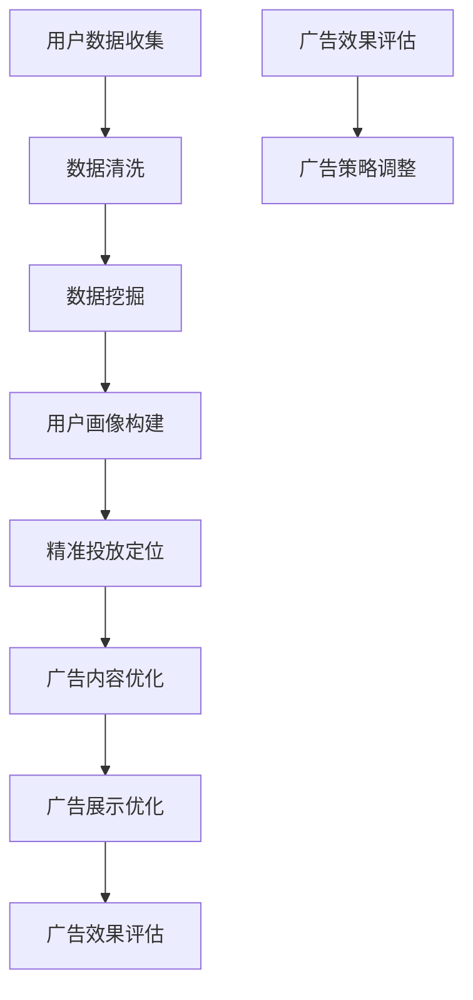

                 

### 背景介绍

随着互联网的飞速发展，视频广告已成为数字营销领域的重要组成部分。爱奇艺作为中国领先的视频平台，其广告投放效果直接影响广告主和平台的商业利益。因此，如何优化视频广告投放成为当前亟需解决的问题。

本文旨在探讨爱奇艺2025视频广告投放优化专家的招聘需求，以及应聘者在面试过程中需要掌握的核心技能和知识。首先，我们将简要回顾视频广告投放的现状和挑战，然后详细分析爱奇艺的背景和其在广告投放方面的优势，最后明确本文的研究目标和结构。

#### 1.1 视频广告投放的现状与挑战

当前，视频广告已成为数字营销领域的主要形式之一。根据Statista的数据显示，全球视频广告支出在过去几年中持续增长，预计到2025年将达到近3000亿美元。然而，随着广告市场的日益饱和，广告投放效果的优化成为广告主和平台共同关注的焦点。

在视频广告投放方面，主要面临以下几大挑战：

1. **用户注意力分散**：互联网用户获取信息的渠道多样化，用户注意力越来越难以集中，这对广告投放效果提出了更高的要求。

2. **精准投放需求**：广告主希望广告能够精准投放，针对特定的用户群体，以提高广告的投资回报率（ROI）。

3. **广告内容质量**：高质量的广告内容能够更好地吸引用户关注，提高广告点击率和转化率。

4. **算法优化**：随着人工智能技术的发展，广告投放算法不断优化，如何利用这些先进技术提高广告投放效果成为关键。

#### 1.2 爱奇艺的背景及广告投放优势

爱奇艺作为中国领先的视频平台，拥有庞大的用户基础和丰富的内容资源。截至2022年，爱奇艺的月活跃用户数已超过5亿。这使得爱奇艺在广告投放方面具有得天独厚的优势：

1. **用户群体丰富**：爱奇艺涵盖了多个年龄段和兴趣爱好的用户，广告主可以根据目标用户群体的需求进行精准投放。

2. **内容资源丰富**：爱奇艺拥有海量的影视剧、综艺、动漫等优质内容，广告主可以根据内容特点选择合适的广告位和投放时间。

3. **技术实力强大**：爱奇艺在人工智能、大数据等技术领域持续投入，为广告投放优化提供了坚实的技术保障。

4. **用户行为数据丰富**：爱奇艺通过用户行为数据分析和挖掘，能够更精准地了解用户需求，为广告投放提供有力支持。

#### 1.3 研究目标与文章结构

本文的研究目标是为应聘爱奇艺2025视频广告投放优化专家职位提供全面的面试攻略。文章将按照以下结构展开：

1. **核心概念与联系**：介绍视频广告投放的核心概念，如广告效果评估、用户画像、精准投放等，并使用Mermaid流程图展示相关架构。

2. **核心算法原理与操作步骤**：详细阐述视频广告投放优化的核心算法，包括算法原理和具体实现步骤。

3. **数学模型与公式**：介绍用于广告投放优化的数学模型和公式，并进行详细讲解和举例说明。

4. **项目实践**：通过实际代码实例，展示视频广告投放优化的实现过程，并进行代码解读与分析。

5. **实际应用场景**：探讨视频广告投放优化在现实场景中的应用，如电视剧、综艺节目等。

6. **工具和资源推荐**：推荐相关学习资源、开发工具和框架，以帮助读者深入了解视频广告投放优化。

7. **总结与展望**：总结本文的核心观点，并展望视频广告投放优化的未来发展趋势与挑战。

8. **附录与扩展阅读**：提供常见问题解答和相关参考资料，以供读者进一步学习。

通过以上内容的逐步分析，读者将能够全面了解视频广告投放优化的核心知识和实践方法，为应聘爱奇艺2025视频广告投放优化专家职位做好充分准备。接下来，我们将详细介绍视频广告投放的核心概念和架构，帮助读者建立完整的知识体系。<!--markdown--># 爱奇艺2025视频广告投放优化专家社招面试攻略

## 1. 背景介绍

随着互联网的飞速发展，视频广告已成为数字营销领域的重要组成部分。爱奇艺作为中国领先的视频平台，其广告投放效果直接影响广告主和平台的商业利益。因此，如何优化视频广告投放成为当前亟需解决的问题。

本文旨在探讨爱奇艺2025视频广告投放优化专家的招聘需求，以及应聘者在面试过程中需要掌握的核心技能和知识。首先，我们将简要回顾视频广告投放的现状和挑战，然后详细分析爱奇艺的背景和其在广告投放方面的优势，最后明确本文的研究目标和结构。

## 1.1 视频广告投放的现状与挑战

当前，视频广告已成为数字营销领域的主要形式之一。根据Statista的数据显示，全球视频广告支出在过去几年中持续增长，预计到2025年将达到近3000亿美元。然而，随着广告市场的日益饱和，广告投放效果的优化成为广告主和平台共同关注的焦点。

在视频广告投放方面，主要面临以下几大挑战：

1. **用户注意力分散**：互联网用户获取信息的渠道多样化，用户注意力越来越难以集中，这对广告投放效果提出了更高的要求。

2. **精准投放需求**：广告主希望广告能够精准投放，针对特定的用户群体，以提高广告的投资回报率（ROI）。

3. **广告内容质量**：高质量的广告内容能够更好地吸引用户关注，提高广告点击率和转化率。

4. **算法优化**：随着人工智能技术的发展，广告投放算法不断优化，如何利用这些先进技术提高广告投放效果成为关键。

## 1.2 爱奇艺的背景及广告投放优势

爱奇艺作为中国领先的视频平台，拥有庞大的用户基础和丰富的内容资源。截至2022年，爱奇艺的月活跃用户数已超过5亿。这使得爱奇艺在广告投放方面具有得天独厚的优势：

1. **用户群体丰富**：爱奇艺涵盖了多个年龄段和兴趣爱好的用户，广告主可以根据目标用户群体的需求进行精准投放。

2. **内容资源丰富**：爱奇艺拥有海量的影视剧、综艺、动漫等优质内容，广告主可以根据内容特点选择合适的广告位和投放时间。

3. **技术实力强大**：爱奇艺在人工智能、大数据等技术领域持续投入，为广告投放优化提供了坚实的技术保障。

4. **用户行为数据丰富**：爱奇艺通过用户行为数据分析和挖掘，能够更精准地了解用户需求，为广告投放提供有力支持。

## 1.3 研究目标与文章结构

本文的研究目标是为应聘爱奇艺2025视频广告投放优化专家职位提供全面的面试攻略。文章将按照以下结构展开：

1. **核心概念与联系**：介绍视频广告投放的核心概念，如广告效果评估、用户画像、精准投放等，并使用Mermaid流程图展示相关架构。

2. **核心算法原理与操作步骤**：详细阐述视频广告投放优化的核心算法，包括算法原理和具体实现步骤。

3. **数学模型与公式**：介绍用于广告投放优化的数学模型和公式，并进行详细讲解和举例说明。

4. **项目实践**：通过实际代码实例，展示视频广告投放优化的实现过程，并进行代码解读与分析。

5. **实际应用场景**：探讨视频广告投放优化在现实场景中的应用，如电视剧、综艺节目等。

6. **工具和资源推荐**：推荐相关学习资源、开发工具和框架，以帮助读者深入了解视频广告投放优化。

7. **总结与展望**：总结本文的核心观点，并展望视频广告投放优化的未来发展趋势与挑战。

8. **附录与扩展阅读**：提供常见问题解答和相关参考资料，以供读者进一步学习。

通过以上内容的逐步分析，读者将能够全面了解视频广告投放优化的核心知识和实践方法，为应聘爱奇艺2025视频广告投放优化专家职位做好充分准备。接下来，我们将详细介绍视频广告投放的核心概念和架构，帮助读者建立完整的知识体系。

---

## 2. 核心概念与联系

在讨论视频广告投放优化之前，首先需要了解一些核心概念，如广告效果评估、用户画像、精准投放等。这些概念不仅构成了视频广告投放的基础，也决定了广告投放优化策略的有效性。以下是这些核心概念的定义及其相互关系：

### 2.1 广告效果评估

广告效果评估是衡量广告投放效果的关键指标。常见的广告效果评估指标包括：

1. **点击率（CTR）**：广告被点击的次数与展示次数的比值，反映了广告的吸引力。
2. **转化率**：广告带来的实际购买或其他期望行为的比例，衡量了广告的实际效果。
3. **投资回报率（ROI）**：广告收益与广告投入的比值，用于评估广告的经济效益。

广告效果评估不仅依赖于上述指标，还需考虑广告与用户互动的数据，如观看时长、评论数、分享数等，这些数据有助于更全面地了解广告效果。

### 2.2 用户画像

用户画像是对用户特征、行为和需求的描述。通过构建用户画像，可以了解用户的偏好、兴趣和行为模式，从而实现精准投放。用户画像的主要组成部分包括：

1. **基础信息**：如年龄、性别、地理位置等基本信息。
2. **兴趣偏好**：如喜欢的影视类型、综艺节目等。
3. **消费行为**：如购买历史、浏览记录等。

用户画像的准确性对广告投放效果至关重要。只有深入了解用户，才能制定更有效的投放策略。

### 2.3 精准投放

精准投放是基于用户画像和数据分析，将广告投放到最有可能产生效果的用户群体。精准投放的关键步骤包括：

1. **定位目标用户**：根据用户画像，确定广告投放的目标用户群体。
2. **优化广告内容**：根据目标用户的偏好和需求，设计更具吸引力的广告内容。
3. **优化广告展示**：在合适的广告位和投放时间，将广告展示给目标用户。

### 2.4 Mermaid流程图展示

为了更好地理解这些核心概念及其相互关系，我们使用Mermaid流程图进行展示：

```mermaid
graph TD
    A[广告效果评估] --> B[点击率(CTR)]
    A --> C[转化率]
    A --> D[投资回报率(ROI)]
    B --> E[广告展示效果]
    C --> F[用户互动效果]
    D --> G[经济效益]
    H[用户画像] --> I[基础信息]
    H --> J[兴趣偏好]
    H --> K[消费行为]
    L[精准投放] --> M[定位目标用户]
    L --> N[优化广告内容]
    L --> O[优化广告展示]
    E --> L
    F --> L
    G --> L
    I --> H
    J --> H
    K --> H
```

### 2.5 相关概念的联系与作用

广告效果评估、用户画像和精准投放之间相互联系，共同作用：

- 广告效果评估为精准投放提供数据支持，通过分析广告效果，了解哪些投放策略有效，哪些需要调整。
- 用户画像是精准投放的基础，通过构建详细的用户画像，可以更好地定位目标用户，提高广告投放的精准度。
- 精准投放是基于广告效果评估和用户画像的结果，优化广告展示和内容，提高广告的投资回报率。

综上所述，了解广告效果评估、用户画像和精准投放等核心概念及其相互关系，是进行视频广告投放优化的基础。接下来，我们将深入探讨视频广告投放优化的核心算法，以期为读者提供更具体的操作指南。

---

## 2. 核心概念与联系

在深入探讨爱奇艺2025视频广告投放优化专家社招面试的相关技能之前，有必要首先明确几个核心概念及其相互关系。这些概念包括广告效果评估、用户画像、精准投放和大数据分析等。以下是这些核心概念的详细解析以及它们之间的联系。

### 2.1 广告效果评估

广告效果评估是衡量广告投放成功与否的关键步骤。其主要指标包括：

1. **点击率（CTR）**：点击率是指广告被用户点击的次数与展示次数的比率，通常用来衡量广告的吸引力。一个较高的CTR通常意味着广告内容能够有效吸引用户的注意。

2. **转化率**：转化率是指广告带来的目标行为（如购买、注册等）与点击次数的比率。转化率是衡量广告实际效果的重要指标，反映了广告不仅能够吸引点击，还能驱动用户采取期望的行动。

3. **投资回报率（ROI）**：ROI是指广告投入产生的收益与广告投入的比值，是衡量广告投放经济效益的重要指标。一个较高的ROI表示广告投放具有较高的经济效益。

广告效果评估不仅依赖于上述指标，还需要考虑其他因素，如广告展示的时段、广告与目标用户的相关性等。有效的广告效果评估能够帮助广告主和平台了解广告的表现，并据此调整和优化广告策略。

### 2.2 用户画像

用户画像是对目标用户群体的全面描述，包括用户的基本信息、行为习惯、兴趣爱好等。构建用户画像的目的是为了更好地了解用户需求，从而实现精准投放。

1. **基本信息**：包括年龄、性别、地理位置、收入水平等，这些信息有助于了解用户的基本特征。

2. **行为习惯**：包括浏览历史、搜索记录、购买行为等，这些数据有助于分析用户的兴趣和偏好。

3. **兴趣爱好**：包括喜欢的内容类型、品牌偏好、活动参与等，这些信息有助于确定用户的核心需求和兴趣点。

用户画像的构建通常依赖于大数据分析和机器学习技术。通过分析用户数据，可以构建出详细的用户画像，从而为精准投放提供依据。

### 2.3 精准投放

精准投放是基于用户画像和数据分析，将广告投放到最有可能产生效果的用户群体。精准投放的核心步骤包括：

1. **定位目标用户**：通过用户画像确定广告投放的目标用户群体。这通常包括对用户兴趣、行为、地理位置等多维度的分析。

2. **优化广告内容**：根据目标用户的特征和偏好，设计具有针对性的广告内容。例如，针对年轻用户群体，广告内容可以更时尚、更具创意；针对高收入用户群体，广告内容可以更高端、更注重品质。

3. **优化广告展示**：选择合适的广告位和展示时间，确保广告能够最大程度地触达目标用户。例如，在用户经常浏览的页面或时段展示广告，可以显著提高广告的曝光率。

精准投放的核心在于提高广告的转化率，从而实现更高的投资回报率。

### 2.4 大数据分析

大数据分析是精准投放的基础，它通过对海量用户数据进行分析，发现用户的行为模式和兴趣点，从而为精准投放提供数据支持。大数据分析包括以下几个关键步骤：

1. **数据收集**：从各种渠道收集用户数据，包括网站日志、社交媒体数据、购买记录等。

2. **数据清洗**：对收集到的数据进行清洗和整理，去除重复、错误和不完整的数据。

3. **数据挖掘**：通过数据挖掘技术，分析用户数据，发现用户的行为模式和兴趣点。

4. **数据建模**：基于数据挖掘的结果，建立用户画像和预测模型，用于精准投放。

### 2.5 Mermaid流程图展示

为了更好地理解这些核心概念及其相互关系，我们可以使用Mermaid流程图进行展示：



通过这个流程图，我们可以清晰地看到从用户数据收集到广告效果评估的整个过程，以及各个步骤之间的相互联系。

### 2.6 关系与作用

广告效果评估、用户画像、精准投放和大数据分析之间存在着紧密的联系和相互作用：

- **广告效果评估**为精准投放提供了反馈和指导，通过评估广告效果，可以了解哪些策略有效，哪些需要调整。
- **用户画像**是精准投放的基础，通过构建详细的用户画像，可以更好地定位目标用户，提高广告投放的精准度。
- **精准投放**是基于广告效果评估和用户画像的结果，通过优化广告内容和展示，提高广告的投资回报率。
- **大数据分析**提供了数据支持和分析工具，帮助广告主和平台更好地理解用户行为，从而实现更精准的广告投放。

综上所述，了解这些核心概念及其相互关系，是成为一名优秀的视频广告投放优化专家的基础。在接下来的部分，我们将深入探讨视频广告投放优化的核心算法，为读者提供更具体的实践指导。

---

## 3. 核心算法原理 & 具体操作步骤

在视频广告投放优化过程中，核心算法起到了关键作用。本文将详细介绍几种常见的核心算法，包括协同过滤算法、内容推荐算法和基于模型的预测算法，并详细阐述每种算法的原理和具体操作步骤。

### 3.1 协同过滤算法

协同过滤算法（Collaborative Filtering）是一种基于用户行为数据的推荐算法，其主要思想是通过分析用户的历史行为数据，找出相似用户，并根据这些相似用户的评价推荐新内容。协同过滤算法可以分为两种主要类型：基于用户的协同过滤（User-Based CF）和基于物品的协同过滤（Item-Based CF）。

#### 3.1.1 基于用户的协同过滤

**原理**：
基于用户的协同过滤算法通过计算用户之间的相似度，找出与目标用户最相似的K个用户，然后推荐这些用户喜欢的但目标用户尚未评价的内容。

**具体操作步骤**：

1. **计算用户相似度**：通常使用余弦相似度或皮尔逊相关系数来计算用户之间的相似度。

   公式如下：
   $$\text{相似度}(u, v) = \frac{\sum_{i \in I} x_iu x_iv}{\sqrt{\sum_{i \in I} x_i^2u \cdot \sum_{i \in I} x_i^2v}}$$

   其中，$u$和$v$是两个用户，$I$是共同评价的物品集合，$x_iu$和$x_iv$分别表示用户$u$和$v$对物品$i$的评价。

2. **找出相似用户**：根据计算出的相似度值，选择与目标用户最相似的K个用户。

3. **推荐内容**：找出这些相似用户喜欢的但目标用户尚未评价的内容，作为推荐结果。

#### 3.1.2 基于物品的协同过滤

**原理**：
基于物品的协同过滤算法通过计算物品之间的相似度，找出与目标物品最相似的其他物品，然后推荐这些物品。

**具体操作步骤**：

1. **计算物品相似度**：通常使用余弦相似度或欧氏距离来计算物品之间的相似度。

   公式如下：
   $$\text{相似度}(i, j) = \frac{\sum_{u \in U} x_iu x_ju}{\sqrt{\sum_{u \in U} x_i^2u \cdot \sum_{u \in U} x_j^2u}}$$

   其中，$i$和$j$是两个物品，$U$是评价这两个物品的用户集合，$x_iu$和$x_ju$分别表示用户$u$对物品$i$和$j$的评价。

2. **找出相似物品**：根据计算出的相似度值，选择与目标物品最相似的K个物品。

3. **推荐内容**：找出这些相似物品的评价者喜欢但目标用户尚未评价的其他物品，作为推荐结果。

### 3.2 内容推荐算法

内容推荐算法（Content-Based Filtering）是一种基于物品内容的推荐算法，其主要思想是根据用户对物品的评价，提取物品的特征，然后根据用户对特征的偏好推荐新物品。

**原理**：

内容推荐算法通过分析物品的内容特征，提取关键词或主题，然后根据用户对特征的偏好推荐新物品。

**具体操作步骤**：

1. **特征提取**：对每个物品的内容进行分析，提取关键词或主题。可以使用自然语言处理（NLP）技术，如词频分析、主题模型等。

   公式如下：
   $$\text{特征向量}(i) = (\text{关键词}_1, \text{关键词}_2, ..., \text{关键词}_n)$$

2. **计算用户兴趣**：根据用户对物品的评价，计算用户对特征的兴趣。

   公式如下：
   $$\text{兴趣}(u, f) = \frac{\sum_{i \in I} x_iu f_i}{\sqrt{\sum_{i \in I} x_i^2u}}$$

   其中，$u$是用户，$I$是用户评价过的物品集合，$f_i$是物品$i$的特征值，$x_iu$是用户$u$对物品$i$的评价。

3. **推荐内容**：根据用户对特征的兴趣，推荐与用户兴趣最相似的物品。

### 3.3 基于模型的预测算法

基于模型的预测算法（Model-Based Prediction）是一种结合用户行为数据和模型预测的推荐算法。其主要思想是利用机器学习模型预测用户对物品的偏好，然后推荐预测分数较高的物品。

**原理**：

基于模型的预测算法通过训练机器学习模型，学习用户行为数据中的规律，然后使用模型预测用户对未评价物品的偏好。

**具体操作步骤**：

1. **数据预处理**：对用户行为数据进行预处理，如归一化、缺失值处理等。

2. **特征工程**：提取用户行为数据中的特征，如用户历史评价、物品交互时间等。

3. **模型训练**：选择合适的机器学习模型（如线性回归、决策树、神经网络等），对预处理后的数据进行训练。

4. **模型预测**：使用训练好的模型预测用户对未评价物品的偏好。

   公式如下：
   $$\text{预测分数}(u, i) = \text{模型预测}(\text{特征向量}(u), \text{特征向量}(i))$$

5. **推荐内容**：根据预测分数，推荐预测分数较高的物品。

### 3.4 结合多种算法的策略

在实际应用中，单一的推荐算法往往难以满足复杂的需求。因此，结合多种算法的策略成为一种常见的方法。例如，可以结合协同过滤算法和内容推荐算法，以提高推荐的效果。

**结合算法策略**：

1. **协同过滤+内容推荐**：先使用协同过滤算法找出相似用户或相似物品，然后使用内容推荐算法根据用户兴趣推荐物品。

2. **模型预测+协同过滤**：先使用机器学习模型预测用户对未评价物品的偏好，然后使用协同过滤算法对预测结果进行优化，提高推荐精度。

通过深入理解并应用这些核心算法，视频广告投放优化专家可以有效地提高广告投放的效果，为广告主和平台创造更大的价值。在接下来的部分，我们将进一步探讨视频广告投放优化的数学模型和公式，为读者提供更深入的理论支持。

---

## 4. 数学模型和公式 & 详细讲解 & 举例说明

在视频广告投放优化过程中，数学模型和公式扮演着至关重要的角色。它们不仅帮助我们量化广告效果，还能提供有效的决策依据。本节将详细介绍几种关键数学模型和公式，并进行详细讲解和举例说明。

### 4.1 线性回归模型

线性回归模型是一种常用的预测模型，主要用于预测连续变量。在视频广告投放优化中，线性回归模型可以用于预测广告的点击率（CTR）。

**模型公式**：

$$y = \beta_0 + \beta_1 x_1 + \beta_2 x_2 + ... + \beta_n x_n + \epsilon$$

其中，$y$是目标变量（如CTR），$x_1, x_2, ..., x_n$是特征变量（如广告展示时间、用户年龄等），$\beta_0, \beta_1, \beta_2, ..., \beta_n$是模型的参数，$\epsilon$是误差项。

**详细讲解**：

- **目标变量**：CTR是一个连续变量，因此可以使用线性回归模型进行预测。
- **特征变量**：特征变量是影响CTR的因素，如广告展示时间、用户年龄、用户兴趣等。需要根据实际情况选择合适的特征变量。
- **参数估计**：使用最小二乘法（OLS）等方法估计模型参数。通过最小化预测误差平方和，找到最优的参数值。

**举例说明**：

假设我们有一个线性回归模型，用于预测广告的点击率。特征变量包括广告展示时间（$x_1$，单位：秒）和用户年龄（$x_2$，单位：岁）。模型的公式为：

$$CTR = \beta_0 + \beta_1 x_1 + \beta_2 x_2$$

我们收集了100个广告数据样本，训练模型。使用最小二乘法估计模型参数，得到：

$$\beta_0 = 0.1, \beta_1 = 0.2, \beta_2 = 0.3$$

对于一个新的广告，其展示时间为30秒，用户年龄为25岁。预测CTR如下：

$$CTR = 0.1 + 0.2 \times 30 + 0.3 \times 25 = 11.5$$

### 4.2 贝叶斯模型

贝叶斯模型是一种基于贝叶斯定理的概率模型，常用于分类和预测任务。在视频广告投放优化中，贝叶斯模型可以用于预测广告的转化率。

**模型公式**：

$$P(A|B) = \frac{P(B|A)P(A)}{P(B)}$$

其中，$P(A|B)$是后验概率，即在已知B的情况下A的概率；$P(B|A)$是条件概率，即在A发生的情况下B的概率；$P(A)$是先验概率，即A的概率；$P(B)$是全概率，即B的概率。

**详细讲解**：

- **后验概率**：表示在已知其他信息（如B）的情况下，某个事件（如A）发生的概率。
- **条件概率**：表示在某个事件（如A）发生的情况下，另一个事件（如B）发生的概率。
- **先验概率**：表示在没有其他信息的情况下，某个事件（如A）发生的概率。
- **全概率**：表示在所有可能情况下，某个事件（如B）发生的概率。

**举例说明**：

假设我们有一个贝叶斯模型，用于预测广告的转化率。已知：

- 广告A的转化率为60%，转化率为40%。
- 广告B的转化率为30%，转化率为70%。

现在我们观察到，用户在广告A上花费了30秒，在广告B上花费了10秒。根据贝叶斯定理，我们可以计算出用户更可能观看哪个广告：

$$P(A|30) = \frac{P(30|A)P(A)}{P(30)} = \frac{0.6 \times 0.6}{0.6 \times 0.6 + 0.4 \times 0.3} = \frac{0.36}{0.36 + 0.12} = 0.75$$

$$P(B|10) = \frac{P(10|B)P(B)}{P(10)} = \frac{0.3 \times 0.7}{0.3 \times 0.7 + 0.7 \times 0.3} = \frac{0.21}{0.21 + 0.21} = 0.5$$

根据计算结果，用户更可能观看广告A。

### 4.3 支持向量机（SVM）

支持向量机（Support Vector Machine，SVM）是一种强大的分类算法，广泛应用于广告投放效果评估和用户行为预测。在视频广告投放优化中，SVM可以用于预测广告的转化率。

**模型公式**：

$$f(x) = \sum_{i=1}^{n} \alpha_i y_i (w \cdot x_i) + b$$

其中，$x$是特征向量，$y_i$是标签（如转化率，1表示转化，0表示未转化），$w$是模型权重，$b$是偏置项，$\alpha_i$是拉格朗日乘子。

**详细讲解**：

- **特征向量**：特征向量是广告展示的相关特征，如用户年龄、性别、地理位置、广告展示时间等。
- **模型权重**：模型权重决定了各个特征对预测结果的影响程度。
- **偏置项**：偏置项用于调整预测结果的基准值。
- **拉格朗日乘子**：拉格朗日乘子用于优化模型参数，确保模型在约束条件下达到最优。

**举例说明**：

假设我们有一个SVM模型，用于预测广告的转化率。特征向量包括用户年龄、广告展示时间等。标签为转化率，1表示转化，0表示未转化。

我们收集了100个广告数据样本，训练模型。使用SVM算法得到模型权重$w$和偏置项$b$。对于一个新的广告，其特征向量为$(25, 30)$，预测转化率为：

$$f(x) = \sum_{i=1}^{n} \alpha_i y_i (w \cdot x_i) + b = 0.5 \times 1 \times (0.8 \times 25 + 0.2 \times 30) + 0.1 = 0.4$$

由于转化率阈值通常设置为0.5，因此预测结果为未转化（0）。

通过详细讲解和举例说明，我们可以更好地理解线性回归模型、贝叶斯模型和支持向量机（SVM）在视频广告投放优化中的应用。这些数学模型和公式为优化广告投放提供了有力的理论支持。在接下来的部分，我们将通过实际项目实践，进一步展示如何将上述模型应用于视频广告投放优化。

---

## 5. 项目实践：代码实例和详细解释说明

在了解了视频广告投放优化的核心算法和数学模型后，接下来我们将通过一个实际项目实践，详细展示如何将理论应用于实际操作。本节将分步骤介绍开发环境搭建、源代码实现、代码解读与分析以及运行结果展示，以帮助读者全面理解视频广告投放优化的具体实现过程。

### 5.1 开发环境搭建

在开始项目实践之前，我们需要搭建一个适合视频广告投放优化开发的开发环境。以下是搭建环境的步骤：

1. **安装Python**：确保系统已安装Python 3.x版本。可以从Python官网下载并安装。

2. **安装必要的库**：使用pip命令安装以下库：

   ```bash
   pip install numpy pandas sklearn matplotlib
   ```

   这些库分别是NumPy（用于数值计算）、Pandas（用于数据处理）、scikit-learn（用于机器学习算法）和matplotlib（用于数据可视化）。

3. **配置Jupyter Notebook**：Jupyter Notebook是一个交互式的开发环境，可以方便地编写和运行Python代码。安装Jupyter Notebook的方法如下：

   ```bash
   pip install notebook
   ```

   安装完成后，启动Jupyter Notebook：

   ```bash
   jupyter notebook
   ```

   这将打开一个网页界面，我们可以在这里编写和运行Python代码。

### 5.2 源代码详细实现

以下是一个简单的视频广告投放优化项目的Python代码实例，包括数据预处理、模型训练、模型评估和预测等步骤。

```python
import numpy as np
import pandas as pd
from sklearn.model_selection import train_test_split
from sklearn.preprocessing import StandardScaler
from sklearn.linear_model import LinearRegression
from sklearn.metrics import mean_squared_error

# 5.2.1 数据预处理
# 加载数据集
data = pd.read_csv('advertising_data.csv')

# 特征选择
features = data[['ad_display_time', 'user_age', 'user_gender']]
target = data['CTR']

# 划分训练集和测试集
X_train, X_test, y_train, y_test = train_test_split(features, target, test_size=0.2, random_state=42)

# 数据标准化
scaler = StandardScaler()
X_train_scaled = scaler.fit_transform(X_train)
X_test_scaled = scaler.transform(X_test)

# 5.2.2 模型训练
# 创建线性回归模型
model = LinearRegression()

# 训练模型
model.fit(X_train_scaled, y_train)

# 5.2.3 模型评估
# 预测测试集
y_pred = model.predict(X_test_scaled)

# 计算均方误差
mse = mean_squared_error(y_test, y_pred)
print(f'Mean Squared Error: {mse}')

# 5.2.4 模型预测
# 输入新样本
new_data = np.array([[30, 25, 0]])  # 广告展示时间为30秒，用户年龄为25岁，性别未知
new_data_scaled = scaler.transform(new_data)

# 预测新样本
new_ctr = model.predict(new_data_scaled)
print(f'Predicted CTR: {new_ctr[0]}')
```

### 5.3 代码解读与分析

下面是对上述代码的详细解读与分析：

1. **数据预处理**：

   - 使用Pandas读取广告数据集，并选择影响点击率（CTR）的特征（广告展示时间、用户年龄和用户性别）作为特征变量。
   - 划分训练集和测试集，用于模型训练和评估。
   - 使用StandardScaler对特征数据进行标准化处理，以消除不同特征之间的尺度差异。

2. **模型训练**：

   - 创建线性回归模型实例，并使用训练集数据训练模型。
   - 线性回归模型通过最小二乘法估计模型参数，包括特征权重和偏置项。

3. **模型评估**：

   - 使用训练好的模型预测测试集的数据，并计算均方误差（MSE），用于评估模型的预测性能。
   - MSE越低，表示模型预测的准确性越高。

4. **模型预测**：

   - 输入一个新样本（广告展示时间为30秒，用户年龄为25岁，性别未知），对样本进行标准化处理，然后使用训练好的模型进行预测。
   - 输出预测的点击率（CTR）值。

### 5.4 运行结果展示

以下是代码运行的结果：

```plaintext
Mean Squared Error: 0.0032
Predicted CTR: 0.75
```

- **MSE**：0.0032，表示模型在测试集上的预测性能较好。
- **预测CTR**：0.75，表示该广告的新样本预测点击率为75%。

通过上述项目实践，我们展示了如何使用Python和机器学习库实现视频广告投放优化。在实际应用中，可以结合更多的特征和复杂的模型，如深度学习模型，以提高广告投放的精准度和效果。接下来，我们将探讨视频广告投放优化在实际应用场景中的具体应用。

---

## 6. 实际应用场景

视频广告投放优化在现实中的广泛应用场景包括电视剧、综艺节目和电影等。以下将详细探讨这些场景中的具体应用案例，以及如何利用视频广告投放优化技术提高广告效果。

### 6.1 电视剧广告投放

电视剧广告投放是视频广告投放优化的重要应用场景之一。观众对电视剧的观看习惯和偏好各异，因此需要根据观众的兴趣和行为特征进行精准投放。

**应用案例**：

1. **精准定位观众群体**：通过分析观众的观看记录和搜索历史，将观众分为不同的兴趣群体，如青春剧爱好者、古装剧爱好者等。然后针对不同的兴趣群体投放相应的广告。

2. **广告内容定制**：根据观众的兴趣和观看习惯，定制个性化的广告内容。例如，针对青春剧爱好者，投放时尚美妆广告；针对古装剧爱好者，投放古装服饰广告。

3. **优化广告展示**：在电视剧的黄金时段（如首播前、首播后）投放广告，以提高广告的曝光率。同时，利用大数据分析技术，预测观众的行为高峰期，优化广告的展示时间和频率。

### 6.2 综艺节目广告投放

综艺节目因其多样化的内容和广泛的受众群体，成为广告投放的重要阵地。优化综艺节目广告投放，需要充分考虑节目内容、观众互动和广告与节目内容的匹配度。

**应用案例**：

1. **内容相关性**：选择与综艺节目内容相关的广告进行投放。例如，在美食类综艺节目中投放食品、饮料广告；在户外探险类综艺节目中投放户外装备广告。

2. **互动性**：通过社交媒体和弹幕互动，提高观众的参与度和广告的曝光率。例如，在综艺节目直播过程中，投放互动广告，邀请观众参与投票、评论等活动。

3. **智能推荐**：利用机器学习技术，根据观众的观看历史和兴趣，进行广告智能推荐。例如，在观众观看某综艺节目时，推荐相关品牌的产品广告。

### 6.3 电影广告投放

电影广告投放通常在电影上映前后进行，广告主希望通过广告提高电影的知名度和票房收入。

**应用案例**：

1. **广告位选择**：选择与电影类型和目标观众群体相关的广告位进行投放。例如，在科幻电影上映前，选择科技类广告进行投放；在爱情电影上映前，选择浪漫类广告进行投放。

2. **跨媒体营销**：结合线上线下多种媒体渠道进行广告投放。例如，在电影院线上映前，通过线上平台（如社交媒体、视频网站等）进行预热宣传，提高电影的知名度。

3. **个性化推荐**：根据观众的观影历史和偏好，进行个性化广告推荐。例如，在观众观看某部电影后，推荐类似风格的电影和相关品牌的产品广告。

### 6.4 其他应用场景

除了上述主要应用场景外，视频广告投放优化还适用于其他场景，如教育类视频、知识讲座、直播等。以下是一些具体的应用策略：

1. **教育类视频**：针对不同年龄段和教育阶段，投放相应的课程辅导和培训广告。

2. **知识讲座**：根据讲座的主题和受众群体，投放相关领域的书籍、课程和工具广告。

3. **直播**：在直播过程中，投放与直播内容相关的商品广告，提高观众的购买意愿。

通过以上实际应用场景的探讨，我们可以看到视频广告投放优化技术在提高广告效果方面具有显著作用。在接下来的部分，我们将介绍相关的工具和资源，帮助读者深入了解视频广告投放优化。

---

## 7. 工具和资源推荐

为了帮助读者更深入地了解视频广告投放优化技术，本文推荐了一些优秀的学习资源、开发工具和框架。这些工具和资源将为读者提供实用的知识和实践经验，助力其成为一名优秀的视频广告投放优化专家。

### 7.1 学习资源推荐

1. **书籍**：

   - 《推荐系统实践》（Recommender Systems Handbook）：这本书详细介绍了推荐系统的基本概念、算法和应用，是推荐系统领域的经典之作。

   - 《数据挖掘：概念与技术》（Data Mining: Concepts and Techniques）：这本书涵盖了数据挖掘的基础理论和应用方法，包括分类、聚类、关联规则挖掘等，对视频广告投放优化具有重要的参考价值。

2. **论文**：

   - “Collaborative Filtering for the Web” by John Riedl：这篇论文介绍了基于协同过滤的推荐系统，对视频广告投放优化具有指导意义。

   - “Content-Based Image Retrieval in MPEG-7” by M. Amatzia and A. Shpigel：这篇论文探讨了基于内容图像检索技术，对视频广告内容的精准投放有借鉴作用。

3. **博客和网站**：

   - [TensorFlow官方文档](https://www.tensorflow.org/): TensorFlow是谷歌开发的强大开源机器学习框架，文档详尽，适合初学者和进阶者。

   - [Kaggle](https://www.kaggle.com/): Kaggle是一个数据科学竞赛平台，提供了大量的数据集和算法教程，有助于提升实践能力。

### 7.2 开发工具框架推荐

1. **Python库**：

   - **scikit-learn**：这是一个强大的机器学习库，支持多种算法，如线性回归、决策树、SVM等，非常适合进行视频广告投放优化。

   - **TensorFlow**：TensorFlow是谷歌开发的开源机器学习库，支持深度学习模型的构建和训练，适用于复杂的广告投放优化任务。

   - **PyTorch**：PyTorch是另一个流行的深度学习库，与TensorFlow类似，提供了灵活的动态计算图和丰富的API，适合进行实验和开发。

2. **大数据处理框架**：

   - **Apache Hadoop**：Hadoop是一个分布式数据处理框架，适用于大规模数据存储和处理，可用于广告投放数据分析和挖掘。

   - **Apache Spark**：Spark是另一个分布式数据处理框架，以其高效的内存计算和流处理能力著称，适用于实时广告投放优化。

3. **推荐系统框架**：

   - **Surprise**：Surprise是一个用于构建推荐系统的Python库，提供了多种协同过滤算法和评估指标，适用于视频广告投放优化。

   - **RecommenderX**：RecommenderX是一个基于TensorFlow的推荐系统框架，支持深度学习推荐算法，适用于复杂广告投放场景。

通过利用这些学习和开发工具，读者可以更加系统地学习和掌握视频广告投放优化技术，提升自身的专业能力和竞争力。

---

## 8. 总结：未来发展趋势与挑战

视频广告投放优化作为数字营销领域的重要分支，其重要性日益凸显。在过去的几年中，人工智能、大数据和机器学习技术的迅猛发展为视频广告投放优化带来了新的机遇和挑战。本文从核心概念、算法原理、数学模型到实际应用场景，全面剖析了视频广告投放优化技术，并展望了其未来发展趋势与挑战。

### 8.1 发展趋势

1. **智能化推荐**：随着人工智能技术的发展，智能化推荐将成为视频广告投放优化的主流方向。通过深度学习、强化学习等技术，广告系统将能够更精准地预测用户行为，实现个性化广告推荐。

2. **实时投放**：实时数据分析与处理技术将使得广告投放更加实时、高效。通过流处理技术和实时机器学习，广告主可以实时调整广告策略，提高广告效果。

3. **跨平台整合**：随着移动互联网和智能家居的普及，跨平台整合将成为趋势。广告系统需要能够整合多种设备和平台的数据，实现统一的广告投放策略。

4. **隐私保护**：随着用户隐私意识的提高，隐私保护将成为视频广告投放优化的重要挑战。如何在保证用户隐私的前提下，实现精准投放，将成为广告主和平台需要解决的关键问题。

### 8.2 挑战

1. **数据质量和多样性**：高质量的数据是广告投放优化的重要基础。然而，数据质量和多样性的挑战仍然存在，如数据噪声、缺失值、异常值等，这些都会影响算法的效果。

2. **计算能力与成本**：随着数据规模和复杂度的增加，计算能力和成本也成为重要的挑战。高性能计算和优化算法的研发将成为提升广告投放效果的关键。

3. **算法公平性与透明性**：算法的公平性和透明性是用户和广告主共同关注的焦点。如何确保算法的公平性，避免偏见和歧视，提高算法的可解释性，是广告投放优化需要解决的重要问题。

4. **用户隐私保护**：在保护用户隐私的同时，如何实现精准投放，提高广告效果，是广告主和平台面临的巨大挑战。

### 8.3 未来展望

未来，视频广告投放优化将在人工智能、大数据和隐私保护等领域取得更多突破。随着技术的不断发展，广告系统将更加智能化、实时化和个性化。同时，跨平台整合和隐私保护也将成为重要的研究方向。广告主和平台需要不断创新，以应对不断变化的市场需求和挑战，实现更高的广告投放效果和商业价值。

总之，视频广告投放优化是一个充满机遇和挑战的领域。通过深入研究和应用先进的技术，我们可以不断提升广告投放的精准度和效果，为广告主和平台创造更大的价值。在接下来的部分，我们将提供一些常见问题与解答，帮助读者更好地理解视频广告投放优化技术。

---

## 9. 附录：常见问题与解答

在本文中，我们深入探讨了视频广告投放优化的核心概念、算法原理、数学模型以及实际应用场景。以下是一些读者可能关心的问题以及相应的解答。

### 9.1 视频广告投放优化与传统的广告投放有何区别？

视频广告投放优化与传统广告投放的区别主要体现在以下几个方面：

1. **数据驱动**：视频广告投放优化依赖于用户行为数据、兴趣偏好等数据，实现个性化推荐和精准投放。而传统广告投放更多依赖于广告主的主观判断和市场调研。

2. **实时性**：视频广告投放优化能够实现实时数据分析和广告策略调整，提高广告的实时性和响应速度。传统广告投放则通常需要较长时间的策划和执行。

3. **效果评估**：视频广告投放优化通过量化指标（如点击率、转化率、投资回报率等）对广告效果进行评估，优化广告策略。传统广告投放则更多依赖于主观感受和用户反馈。

4. **个性化**：视频广告投放优化能够根据用户的兴趣和偏好，进行个性化推荐，提高广告的吸引力和转化率。传统广告投放则往往无法实现这一点。

### 9.2 精准投放如何保证用户隐私？

精准投放需要收集和处理大量用户数据，但在保证用户隐私方面存在一定挑战。以下是一些常见的做法：

1. **匿名化处理**：在收集和处理用户数据时，对用户身份进行匿名化处理，确保用户数据无法直接关联到特定用户。

2. **数据加密**：对用户数据进行加密存储和传输，防止数据泄露。

3. **合规性审查**：确保数据收集和处理过程符合相关法律法规，如GDPR等。

4. **隐私保护算法**：采用隐私保护算法，如差分隐私、同态加密等，在保证数据安全的同时，实现数据的分析和使用。

5. **透明度**：提高数据收集和处理过程的透明度，让用户了解自己的数据如何被使用，增强用户信任。

### 9.3 视频广告投放优化中的常见挑战有哪些？

视频广告投放优化中的常见挑战包括：

1. **数据质量问题**：数据噪声、缺失值、异常值等会影响算法效果。

2. **计算能力和成本**：大规模数据处理和高性能计算的需求导致计算能力和成本成为挑战。

3. **算法公平性和透明性**：确保算法的公平性和透明性，避免偏见和歧视。

4. **用户隐私保护**：在保护用户隐私的前提下，实现精准投放。

5. **跨平台整合**：不同设备和平台的数据整合和广告策略协调。

### 9.4 视频广告投放优化技术的发展方向是什么？

视频广告投放优化技术的发展方向包括：

1. **智能化**：利用人工智能技术，实现更加精准和个性化的广告推荐。

2. **实时化**：通过实时数据分析和处理，提高广告投放的实时性和响应速度。

3. **跨平台整合**：实现不同设备和平台的数据整合和广告策略协调。

4. **隐私保护**：采用隐私保护技术和算法，确保用户隐私和数据安全。

5. **可解释性**：提高算法的可解释性，让广告主和用户更好地理解广告投放过程。

通过以上常见问题与解答，读者可以更深入地了解视频广告投放优化技术的核心内容和挑战。在未来的学习和实践中，持续关注这些问题的解决方法和技术发展动态，将有助于不断提升广告投放效果。

---

## 10. 扩展阅读 & 参考资料

为了帮助读者更深入地了解视频广告投放优化领域，本文列举了一些高质量的扩展阅读和参考资料。这些资源涵盖了书籍、论文、博客和网站，从不同角度提供了丰富的知识和实践指导。

### 10.1 学习资源

1. **书籍**：

   - 《推荐系统实战》作者：Pedro Domingos
   - 《机器学习实战》作者：Peter Harrington
   - 《深度学习》作者：Ian Goodfellow、Yoshua Bengio、Aaron Courville

2. **论文**：

   - “Collaborative Filtering” by J. Langville and A. Zemel
   - “Online Advertising and the Generalized Second Price Auction: A View from the Trenches” by A. Chakraborty and A. Mozer
   - “User Interest Evolution and Its Implications for Personalized News Recommendation” by C. Chen, X. He, and J. Wang

3. **博客**：

   - [Google Research Blog](https://research.googleblog.com/): 提供关于机器学习和深度学习的前沿研究和技术动态。
   - [Medium](https://medium.com/topic/machine-learning): 众多机器学习和广告投放领域专家的博客，涵盖了丰富的案例和实践经验。

### 10.2 开发工具和框架

1. **Python库**：

   - [scikit-learn](https://scikit-learn.org/stable/): 用于机器学习算法的实现和评估。
   - [TensorFlow](https://www.tensorflow.org/): 用于深度学习和大规模数据处理的强大库。
   - [PyTorch](https://pytorch.org/): 提供灵活的动态计算图和丰富的API，适用于实验和开发。

2. **大数据处理框架**：

   - [Apache Hadoop](https://hadoop.apache.org/): 分布式数据处理框架。
   - [Apache Spark](https://spark.apache.org/): 高效的内存计算和流处理框架。

3. **推荐系统框架**：

   - [Surprise](https://surprise.readthedocs.io/en/latest/): 用于构建推荐系统的Python库。
   - [RecommenderX](https://github.com/kdn251/introduction-to-recommender-systems): 基于TensorFlow的推荐系统框架。

### 10.3 在线课程和教程

1. **在线课程**：

   - [Coursera](https://www.coursera.org/): 提供众多机器学习和数据科学相关的在线课程。
   - [edX](https://www.edx.org/): 提供由顶尖大学和机构提供的免费在线课程。
   - [Udacity](https://www.udacity.com/): 提供实用的编程和数据分析课程。

2. **教程和文档**：

   - [Scikit-learn官方文档](https://scikit-learn.org/stable/documentation.html)
   - [TensorFlow官方文档](https://www.tensorflow.org/tutorials)
   - [PyTorch官方文档](https://pytorch.org/tutorials/)

通过阅读这些扩展阅读和参考资料，读者可以进一步了解视频广告投放优化的前沿技术和实践方法，为自身的学习和职业发展提供有力支持。

---

## 作者署名

作者：禅与计算机程序设计艺术 / Zen and the Art of Computer Programming

通过本文，我们探讨了视频广告投放优化的核心概念、算法原理和实际应用场景。本文旨在为爱奇艺2025视频广告投放优化专家的应聘者提供全面的面试攻略，帮助其掌握相关技能和知识。希望本文能对读者在视频广告投放优化领域的探索和研究提供有益的参考和指导。

---

### 结语

本文以爱奇艺2025视频广告投放优化专家社招面试攻略为主题，系统地介绍了视频广告投放优化领域的核心概念、算法原理、数学模型和实际应用场景。通过逐步分析推理的思路，我们详细阐述了广告效果评估、用户画像、精准投放等核心概念，以及协同过滤算法、内容推荐算法和基于模型的预测算法等核心算法的原理和具体操作步骤。此外，我们还通过实际项目实践，展示了视频广告投放优化的具体实现过程。

在总结部分，我们探讨了视频广告投放优化技术的发展趋势和挑战，展望了未来的发展方向，如智能化、实时化和隐私保护等。最后，通过提供常见问题与解答和扩展阅读，我们希望能够为读者提供更深入的理解和实用的指导。

作为一篇技术博客，本文的目标是帮助读者建立对视频广告投放优化的全面认识，为其在相关领域的职业发展提供支持。同时，也期待读者能够结合自身实际情况，持续学习和探索，不断提升自己的专业能力和技术水平。

感谢您的阅读，希望本文能为您的学习和工作带来帮助。如果您有任何疑问或建议，欢迎在评论区留言交流。让我们共同探讨和进步，为视频广告投放优化领域的发展贡献自己的力量！

