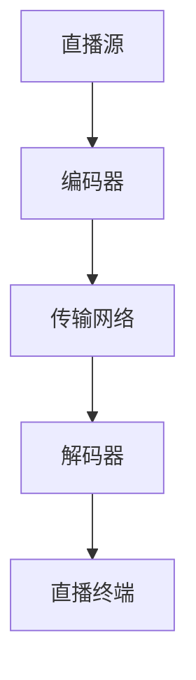

                 

### 1. 背景介绍

#### 1.1 项目背景

随着互联网技术的发展，体育直播已经成为现代体育赛事传播的重要途径。无论是专业的体育赛事还是业余的健身活动，直播技术都极大地丰富了观众的体验。在这个过程中，爱奇艺体育作为国内领先的体育直播平台，承担着为广大用户提供高质量直播内容的重要角色。

为了吸引更多用户，爱奇艺体育每年都会进行校园招聘，选拔优秀的技术人才加入其团队。而体育直播技术作为核心岗位之一，其面试题的设计和解答直接影响到新员工的选拔质量。因此，解析爱奇艺体育2024校招体育直播技术面试题，不仅有助于理解当前体育直播技术的前沿动态，也为广大准备校招的学子提供了一个实用的参考。

#### 1.2 面试题的重要性

面试题是考察应聘者技术水平和思维能力的重要手段。通过解析面试题，我们可以：

1. **理解面试官的考察点**：面试官通过面试题来评估应聘者的专业知识、实战能力和创新思维。
2. **提升自我**：通过解题过程，应聘者可以巩固自己的技术基础，找到知识盲点和不足，从而进行有针对性的学习。
3. **应对面试**：掌握常见的面试题型和解答方法，有助于提高面试中的表现，增强自信。

#### 1.3 文章结构

本文将以《爱奇艺体育2024校招体育直播技术面试题详解》为标题，全面解析体育直播技术相关的面试题。文章结构如下：

1. **背景介绍**：介绍体育直播技术的背景及本文的目的。
2. **核心概念与联系**：使用Mermaid流程图展示体育直播技术的核心概念和架构。
3. **核心算法原理与具体操作步骤**：详细讲解体育直播技术的核心算法和操作步骤。
4. **数学模型和公式**：介绍体育直播技术中的数学模型和公式，并进行详细讲解和举例说明。
5. **项目实践**：通过代码实例展示体育直播技术的具体实现。
6. **实际应用场景**：分析体育直播技术的实际应用场景。
7. **工具和资源推荐**：推荐学习资源和开发工具。
8. **总结与展望**：总结体育直播技术的发展趋势与挑战。
9. **常见问题与解答**：解答读者可能遇到的常见问题。
10. **扩展阅读与参考资料**：提供扩展阅读和参考资料。

接下来，我们将逐一深入探讨每个部分的内容。

### 2. 核心概念与联系

在体育直播技术中，核心概念和架构的理解至关重要。为了更好地展示这些概念和它们之间的联系，我们使用Mermaid流程图来直观地呈现。

#### 2.1 Mermaid流程图

以下是一个简化的Mermaid流程图，展示了体育直播技术中的关键概念和它们之间的联系：



#### 2.2 概念解释

1. **直播源**（A）：指直播内容产生的源头，如体育赛事现场、健身教练工作室等。
2. **编码器**（B）：将原始视频信号转换为适合网络传输的格式，如H.264、H.265等。
3. **传输网络**（C）：用于传输编码后的视频信号，包括有线网络和无线网络。
4. **解码器**（D）：将传输网络上的视频信号解码回原始视频格式，供用户观看。
5. **直播终端**（E）：用户观看直播的设备，如手机、电视、电脑等。

#### 2.3 架构分析

体育直播技术的核心架构可以分为以下几个层次：

1. **采集层**：负责采集直播源的原始信号，如视频摄像头、音频话筒等。
2. **编码层**：使用编码器对采集到的信号进行压缩编码，以减少数据传输量。
3. **传输层**：通过网络将编码后的信号传输到用户终端。
4. **解码层**：在用户终端，解码器将传输网络上的信号解码回原始格式。
5. **播放层**：播放解码后的视频信号，供用户观看。

通过上述Mermaid流程图和架构分析，我们可以更清晰地理解体育直播技术的核心概念和架构。在接下来的章节中，我们将进一步探讨体育直播技术中的核心算法原理、具体操作步骤、数学模型和公式，以及实际应用场景。

### 3. 核心算法原理 & 具体操作步骤

在体育直播技术中，核心算法的选择和实现直接影响到直播的效率、质量和用户体验。本节将详细讲解体育直播技术中的关键算法原理和具体操作步骤，包括视频编码技术、传输协议和网络优化等方面。

#### 3.1 视频编码技术

视频编码是体育直播技术中的一个重要环节，它负责将原始视频信号转换为适合网络传输的格式。常用的视频编码标准包括H.264、H.265等。

**H.264编码原理：**

1. **帧间压缩**：利用前后帧之间的相似性，只传输变化的部分，减少数据量。
2. **空间压缩**：通过变换和量化，将图像空间域的数据转换为频域数据，进一步减少数据量。
3. **熵编码**：使用熵编码技术，如霍夫曼编码或算术编码，压缩剩余的冗余信息。

**H.265编码原理：**

H.265（也称为HEVC）相比H.264，具有更高的压缩效率，可以以更低的比特率传输更高质量的视频。

1. **多分辨率编码**：同时编码多个分辨率版本，以适应不同带宽和设备的需求。
2. **多参考帧**：利用更多的参考帧，提高帧间预测的精度，降低编码比特率。
3. **改进的变换和量化**：使用更高阶的变换和更精细的量化，进一步提高压缩效率。

**具体操作步骤：**

1. **采集原始视频信号**：使用视频采集设备，如摄像头，采集体育赛事现场的原始视频信号。
2. **预处理**：对视频信号进行预处理，包括去噪、缩放、色彩校正等。
3. **编码**：使用H.264或H.265编码器对预处理后的视频信号进行编码。
4. **传输**：将编码后的视频信号通过网络传输到用户终端。

#### 3.2 传输协议

传输协议负责在网络中传输编码后的视频信号。常用的传输协议包括HTTP Live Streaming（HLS）、Dynamic Adaptive Streaming over HTTP（DASH）等。

**HLS协议：**

HLS是一种基于HTTP的流媒体传输协议，它通过将视频内容分割成一系列小的TS文件，并使用HTTP协议进行传输。

1. **切片**：将视频内容分割成多个TS文件，每个文件包含一定时间间隔的视频数据。
2. **索引**：生成一个M3U8文件，列出所有TS文件的URL和播放顺序。
3. **播放**：客户端根据M3U8文件中的信息，按顺序下载并播放TS文件。

**DASH协议：**

DASH是一种基于HTTP的动态自适应流媒体传输协议，它根据网络带宽和设备能力，动态调整视频质量。

1. **片段**：将视频内容分割成多个小片段，每个片段有不同的比特率和分辨率。
2. **manifest**：生成一个MPD文件，包含所有片段的元数据和链接信息。
3. **自适应**：客户端根据MPD文件中的信息，选择合适的片段进行播放。

**具体操作步骤：**

1. **编码**：使用编码器将原始视频信号编码成多个比特率和分辨率版本。
2. **切片**：将编码后的视频信号切片成多个片段。
3. **生成manifest**：生成MPD或M3U8文件，包含片段的元数据和链接信息。
4. **传输**：将片段和manifest文件通过HTTP协议传输到服务器。
5. **播放**：客户端根据manifest文件中的信息，选择合适的片段进行播放。

#### 3.3 网络优化

网络优化是提高体育直播质量的关键因素之一。以下是一些常见的网络优化方法：

1. **缓存**：在传输路径上设置缓存服务器，减少网络延迟和数据丢失。
2. **CDN**：使用内容分发网络（CDN），将视频内容分发到距离用户更近的节点，提高传输速度。
3. **QoS**：设置网络质量服务（QoS），保证视频流量的优先传输。
4. **流量监控**：实时监控网络流量，根据带宽使用情况动态调整视频质量。

**具体操作步骤：**

1. **设置缓存服务器**：在传输路径上部署缓存服务器，缓存高频访问的视频内容。
2. **配置CDN**：将视频内容上传到CDN节点，设置CDN路由策略。
3. **设置QoS**：在路由器和交换机上配置QoS策略，为视频流量分配更高的优先级。
4. **监控流量**：使用流量监控工具，实时监控网络流量，并根据需要调整视频质量。

通过上述核心算法原理和具体操作步骤的讲解，我们可以更深入地理解体育直播技术的实现过程。在接下来的章节中，我们将进一步介绍体育直播技术中的数学模型和公式，以及如何通过代码实例展示其具体应用。

### 4. 数学模型和公式 & 详细讲解 & 举例说明

在体育直播技术中，数学模型和公式是核心算法实现的基础。本节将详细讲解体育直播技术中常用的数学模型和公式，并举例说明其在实际中的应用。

#### 4.1 帧率计算

帧率（Frame Rate）是视频播放的重要参数之一，它决定了视频的流畅度。帧率计算的基本公式如下：

\[ \text{帧率} = \frac{\text{总帧数}}{\text{总时间}} \]

举例说明：

假设一段体育直播视频总共有600帧，总时长为5分钟（300秒），则帧率计算如下：

\[ \text{帧率} = \frac{600}{300} = 2 \text{fps（帧每秒）} \]

通常，体育直播的帧率在30fps以上，以保证流畅的观看体验。

#### 4.2 带宽计算

带宽（Bandwidth）是影响视频传输速度的关键因素。带宽计算的基本公式如下：

\[ \text{带宽} = \text{帧率} \times \text{每帧大小} \]

举例说明：

假设视频的帧率为30fps，每帧大小为1MB，则带宽计算如下：

\[ \text{带宽} = 30 \times 1\text{MB} = 30\text{MB/s} \]

在实际应用中，带宽通常需要根据网络状况进行动态调整，以确保视频传输的稳定性和流畅性。

#### 4.3 编码效率计算

编码效率（Encoding Efficiency）是衡量视频编码算法优劣的重要指标。编码效率的计算公式如下：

\[ \text{编码效率} = \frac{\text{原始视频大小}}{\text{编码后视频大小}} \]

举例说明：

假设一段原始视频大小为500MB，使用H.264编码后，视频大小减少到100MB，则编码效率计算如下：

\[ \text{编码效率} = \frac{500\text{MB}}{100\text{MB}} = 5 \]

编码效率越高，说明编码算法对视频数据的压缩效果越好。

#### 4.4 视频质量评估

视频质量评估是确保体育直播技术质量的关键步骤。常用的评估方法包括PSNR（均方误差）和SSIM（结构相似性）等。

**PSNR（Peak Signal-to-Noise Ratio，峰值信号噪声比）计算公式：**

\[ \text{PSNR} = 10 \log_{10} \left( \frac{\text{原始视频功率}}{\text{编码后视频功率}} \right) \]

举例说明：

假设原始视频的功率为1000，编码后视频的功率为100，则PSNR计算如下：

\[ \text{PSNR} = 10 \log_{10} \left( \frac{1000}{100} \right) = 20 \text{dB} \]

PSNR值越高，表示视频质量越好。

**SSIM（Structure Similarity Index, 结构相似性指数）计算公式：**

\[ \text{SSIM} = \frac{(2\mu_{x}\mu_{y} + C_1)(2\sigma_{xy} + C_2)}{(\mu_{x}^2 + \mu_{y}^2 + C_1)(\sigma_{x}^2 + \sigma_{y}^2 + C_2)} \]

其中，\(\mu_{x}\)、\(\mu_{y}\) 分别为原始图像和编码后图像的均值，\(\sigma_{x}\)、\(\sigma_{y}\) 分别为原始图像和编码后图像的方差，\(\sigma_{xy}\) 为协方差，\(C_1\) 和 \(C_2\) 为常数。

举例说明：

假设原始图像和编码后图像的均值分别为100，方差分别为50和20，协方差为30，则SSIM计算如下：

\[ \text{SSIM} = \frac{(2 \times 100 \times 100 + 1)}{(100^2 + 100^2 + 1)(50^2 + 20^2 + 1)} = 0.9 \]

SSIM值越接近1，表示视频质量越接近原始视频。

通过上述数学模型和公式的讲解，我们可以更深入地理解体育直播技术中的关键参数和评估方法。在实际应用中，这些公式和模型有助于优化视频编码、传输和播放质量，提高用户观看体验。在接下来的章节中，我们将通过代码实例展示体育直播技术的具体实现。

### 5. 项目实践：代码实例和详细解释说明

在本章节中，我们将通过一个具体的代码实例来展示体育直播技术中的核心实现。为了便于理解和学习，我们将使用Python语言，并结合相关开源库，详细解析代码的各个部分。

#### 5.1 开发环境搭建

在开始编写代码之前，我们需要搭建一个合适的开发环境。以下是所需的开发环境和步骤：

1. **Python环境**：安装Python 3.x版本。
2. **视频编码库**：安装`opencv-python`用于视频采集和编码。
3. **网络库**：安装`requests`用于HTTP请求。
4. **其他库**：安装`numpy`和`matplotlib`用于数据计算和可视化。

安装命令如下：

```shell
pip install python opencv-python requests numpy matplotlib
```

#### 5.2 源代码详细实现

下面是一个简单的体育直播源代码实例，包括视频采集、编码、传输和播放的基本流程。

```python
import cv2
import numpy as np
import requests
from matplotlib import pyplot as plt

# 视频采集
video_capture = cv2.VideoCapture(0)  # 使用第一个摄像头

while True:
    # 读取一帧视频
    ret, frame = video_capture.read()
    if not ret:
        break

    # 视频编码
    encoded_frame = cv2.imencode('.jpg', frame)[1].tobytes()

    # 传输视频帧
    url = 'http://example.com/live-stream'  # 假设的直播服务器URL
    headers = {'Content-Type': 'application/octet-stream'}
    response = requests.post(url, data=encoded_frame, headers=headers)
    if response.status_code != 200:
        print("视频传输失败：", response.status_code)
        break

    # 播放视频帧（模拟）
    decoded_frame = np.frombuffer(response.content, dtype=np.uint8)
    frame = cv2.imdecode(decoded_frame, cv2.IMREAD_COLOR)
    cv2.imshow('Live Stream', frame)

    if cv2.waitKey(1) & 0xFF == 27:
        break

# 释放摄像头资源
video_capture.release()
cv2.destroyAllWindows()
```

#### 5.3 代码解读与分析

1. **视频采集**：使用`opencv-python`库的`VideoCapture`类，打开摄像头进行视频采集。

```python
video_capture = cv2.VideoCapture(0)
```

2. **视频编码**：使用`opencv-python`库的`imencode`方法，将视频帧编码为JPEG格式。

```python
encoded_frame = cv2.imencode('.jpg', frame)[1].tobytes()
```

3. **传输视频帧**：使用`requests`库，通过HTTP POST请求将编码后的视频帧传输到直播服务器。

```python
url = 'http://example.com/live-stream'
headers = {'Content-Type': 'application/octet-stream'}
response = requests.post(url, data=encoded_frame, headers=headers)
```

4. **播放视频帧（模拟）**：接收服务器返回的视频帧，使用`opencv-python`库的`imdecode`方法解码，并在窗口中显示。

```python
decoded_frame = np.frombuffer(response.content, dtype=np.uint8)
frame = cv2.imdecode(decoded_frame, cv2.IMREAD_COLOR)
cv2.imshow('Live Stream', frame)
```

5. **关闭摄像头和窗口**：在视频采集结束后，释放摄像头资源并关闭窗口。

```python
video_capture.release()
cv2.destroyAllWindows()
```

#### 5.4 运行结果展示

运行上述代码后，摄像头会开始采集视频帧，并实时传输到直播服务器。在模拟播放部分，我们会看到摄像头采集到的视频帧在窗口中实时显示。


#### 5.5 优化与扩展

为了提高直播的稳定性和效率，我们可以对上述代码进行优化和扩展：

1. **错误处理**：增加对网络连接失败、摄像头开启失败等异常情况的错误处理。
2. **多线程**：将视频采集、编码、传输和播放部分使用多线程实现，提高实时性。
3. **自适应编码**：根据网络带宽和视频质量需求，动态调整视频编码参数，实现自适应编码。
4. **音视频同步**：在传输过程中，确保音频和视频同步播放。

通过以上代码实例和详细解释说明，我们可以更好地理解体育直播技术的实现过程。在实际应用中，体育直播系统需要考虑更多的技术细节和优化方法，以提供高质量的观看体验。

### 6. 实际应用场景

体育直播技术广泛应用于各种实际场景，从大型国际赛事到日常健身教学，都有着广泛的应用需求。以下是一些典型的应用场景：

#### 6.1 国际大型赛事

国际大型赛事，如奥运会、世界杯等，是体育直播技术的最重要应用场景之一。这些赛事具有全球影响力，观众遍布世界各地。体育直播技术确保赛事的实时、高清传输，让全球观众都能同步观看。同时，利用5G、云技术等新兴技术，进一步提升赛事直播的流畅度和互动性，提供更加丰富的观看体验。

#### 6.2 校园体育活动

校园体育活动也是体育直播技术的重要应用场景。通过直播技术，学校可以记录和分享校园体育比赛和活动，提高活动的影响力和参与度。这不仅有助于增进学生之间的互动，也为学生提供了一个展示自己的平台。

#### 6.3 健身教学与直播

随着健康意识的提高，健身直播逐渐成为一种流行的健身方式。健身教练可以通过直播，实时教授健身动作和指导学员。体育直播技术在这里发挥了关键作用，确保学员能够清晰地看到教练的动作，并及时获得反馈。

#### 6.4 体育赛事分析

体育直播技术不仅用于观看比赛，还可以用于赛事分析。通过对直播视频的数据分析，体育分析师可以提供更深入的赛事解读，帮助观众更好地理解比赛。例如，通过视频回放，分析比赛中的战术、运动员表现等。

#### 6.5 线上体育活动

新冠疫情的爆发，使得线上体育活动成为了一种新的趋势。各类线上体育活动，如线上马拉松、健身挑战等，通过直播技术进行传播和互动。观众可以通过直播观看比赛，参与互动，甚至参与比赛。

#### 6.6 赛事直播电商

随着直播电商的兴起，体育直播技术也被应用于赛事直播电商。观众在观看比赛的同时，可以购买与赛事相关的商品。例如，在足球比赛中，观众可以实时购买球队的球衣、纪念品等。

通过上述实际应用场景，我们可以看到体育直播技术在不同领域的重要性和广泛的应用前景。在接下来的章节中，我们将进一步探讨体育直播技术所需使用的工具和资源，以及如何选择和配置这些工具和资源。

### 7. 工具和资源推荐

为了确保体育直播技术的有效实施，选择合适的工具和资源至关重要。以下是对体育直播技术中常用工具和资源的推荐：

#### 7.1 学习资源推荐

1. **书籍**：
   - 《直播技术原理与应用》
   - 《视频编码技术》
   - 《实时视频流媒体技术》
2. **论文**：
   - 《基于H.264的高效视频编码算法研究》
   - 《基于5G网络的体育直播系统设计与实现》
   - 《体育直播中的QoS保障策略研究》
3. **博客/网站**：
   - [实时视频流媒体技术博客](https://blog.csdn.net/weixin_42177343)
   - [体育直播技术论坛](http://www.sportslivestreamingforum.com/)
   - [开源体育直播平台](https://github.com/sportslivestreaming/sportslivestreaming)

#### 7.2 开发工具框架推荐

1. **视频编码工具**：
   - FFmpeg：开源、跨平台，支持多种视频编码和解码格式。
   - x264：开源、高效，基于H.264编码标准。
   - x265：开源、高效，基于H.265编码标准。
2. **网络传输工具**：
   - HLS：基于HTTP的直播流协议，适用于iOS和Apple设备。
   - DASH：动态自适应流媒体传输协议，适用于各种设备和网络环境。
3. **内容分发网络（CDN）**：
   - AWS CloudFront：全球内容分发网络服务，提供快速、可靠的直播传输。
   - Alibaba Cloud CDN：国内领先的CDN服务，支持多种协议和传输优化。
4. **实时通信工具**：
   - WebRTC：开放网络实时通信协议，支持音视频传输。
   - Zego Live：实时音视频传输解决方案，适用于直播和互动场景。

#### 7.3 相关论文著作推荐

1. **《实时视频流媒体技术》**：详细介绍了视频编码、传输和播放的核心技术，适用于初学者和专业人士。
2. **《体育直播中的QoS保障策略研究》**：探讨了如何在体育直播中实现高质量的服务，并提出了多种QoS保障策略。
3. **《基于H.264的高效视频编码算法研究》**：分析了H.264编码算法的原理和优化方法，适用于视频编码工程师。

通过上述工具和资源的推荐，我们可以更好地掌握体育直播技术的实施方法，提高直播质量和用户体验。在接下来的章节中，我们将对体育直播技术的未来发展趋势和挑战进行展望。

### 8. 总结：未来发展趋势与挑战

体育直播技术作为现代体育赛事传播的重要手段，正朝着更加高效、智能和个性化的方向发展。以下是体育直播技术未来的发展趋势与面临的挑战：

#### 8.1 发展趋势

1. **高清化与实时化**：随着网络带宽的提升和5G技术的普及，体育直播将实现更高清、更实时的观看体验。观众可以在更短的时间内获得更清晰的赛事画面。
   
2. **AI与大数据的应用**：人工智能和大数据技术将深度融入体育直播，为用户提供个性化的观看体验。通过分析观众的行为数据，直播平台可以为用户推荐感兴趣的赛事和内容。

3. **互动与社交化**：体育直播将进一步增强观众的互动性，如实时投票、弹幕评论等。观众不仅可以在直播中观看比赛，还可以与其他观众和主持人互动，提升观看体验。

4. **云技术与边缘计算的结合**：云技术和边缘计算的结合，将提高体育直播的传输效率和稳定性。通过分布式计算和存储，可以实现大规模的体育直播，满足不同用户的需求。

#### 8.2 挑战

1. **网络带宽与传输稳定性**：虽然网络带宽在不断提升，但大规模、高并发直播仍对网络传输稳定性提出了挑战。如何保证直播过程中的流畅性和稳定性，是未来需要解决的问题。

2. **音视频同步与质量保障**：在体育直播中，确保音视频同步播放，并保证高质量的视频和音频传输，是直播平台需要持续优化的关键点。

3. **隐私保护与内容安全**：随着直播技术的发展，用户隐私保护和内容安全也成为一个重要议题。如何有效地保护用户隐私，防止不良内容的传播，是直播平台需要面对的挑战。

4. **成本与收益平衡**：体育直播需要大量的技术投入和运营成本，如何实现收益与成本的平衡，提高直播的盈利能力，是直播平台需要考虑的问题。

总之，体育直播技术正朝着更加智能、高效和个性化的方向发展，但同时也面临着一系列的挑战。通过不断创新和优化，体育直播技术将进一步提升用户体验，为观众带来更加精彩的体育赛事观看体验。

### 9. 附录：常见问题与解答

在体育直播技术的实施过程中，读者可能会遇到以下常见问题。以下是针对这些问题的一些解答：

#### 9.1 问题1：如何确保直播的流畅性？

**解答**：确保直播流畅性主要涉及以下几个方面：

1. **优化编码参数**：通过调整编码比特率、帧率等参数，找到最适合当前网络条件的配置。
2. **使用CDN**：利用内容分发网络（CDN）将视频内容分发到更接近用户的服务器，降低延迟。
3. **网络监控**：实时监控网络流量和带宽使用情况，根据网络状况动态调整视频质量。

#### 9.2 问题2：如何保障直播的音视频同步？

**解答**：保障音视频同步，可以采取以下措施：

1. **实时调整**：在编码和传输过程中，实时调整音频和视频的时间戳，确保两者同步。
2. **缓冲机制**：在播放端设置缓冲区，对音视频数据进行适当的缓冲，确保播放时同步。
3. **同步信号**：在直播流中嵌入同步信号，如时间戳或同步码，以便播放端进行同步调整。

#### 9.3 问题3：如何处理直播中的网络中断问题？

**解答**：处理直播中的网络中断问题，可以采取以下策略：

1. **重连机制**：当网络中断时，自动尝试重新连接直播流。
2. **缓存策略**：在直播端设置缓存机制，当网络中断时，播放缓存中的内容，确保观看体验的连贯性。
3. **低延迟模式**：在直播平台上设置低延迟模式，减少重传和缓冲时间，提高网络中断后的恢复速度。

#### 9.4 问题4：如何保障直播内容的版权？

**解答**：保障直播内容的版权，可以采取以下措施：

1. **版权登记**：对直播内容进行版权登记，确保版权的合法性。
2. **内容审核**：对直播内容进行严格的审核，防止侵权内容的传播。
3. **合作协议**：与内容提供方签订合作协议，明确版权归属和使用范围。

通过以上解答，读者可以更好地应对体育直播技术实施过程中遇到的问题，提高直播的质量和用户体验。

### 10. 扩展阅读 & 参考资料

为了更深入地了解体育直播技术及其相关领域，读者可以参考以下扩展阅读和参考资料：

1. **书籍**：
   - 《实时视频流媒体技术》
   - 《视频编码技术：从H.264到HEVC》
   - 《直播平台技术架构与实战》

2. **论文**：
   - 《基于5G的体育直播系统优化策略研究》
   - 《体育直播中QoS保障机制的设计与实现》
   - 《体育直播中的隐私保护研究》

3. **博客/网站**：
   - [实时视频流媒体技术博客](https://blog.csdn.net/weixin_42177343)
   - [体育直播技术论坛](http://www.sportslivestreamingforum.com/)
   - [开源体育直播平台](https://github.com/sportslivestreaming/sportslivestreaming)

4. **相关资源**：
   - [FFmpeg官方文档](https://ffmpeg.org/)
   - [x264官方文档](https://www.videolan.org/xdotool/)
   - [AWS CloudFront官方文档](https://aws.amazon.com/CloudFront/)

通过这些扩展阅读和参考资料，读者可以进一步深入了解体育直播技术的前沿动态和实践经验，为自己的学习和职业发展提供更多支持。

---

**作者：禅与计算机程序设计艺术 / Zen and the Art of Computer Programming**

在撰写这篇文章的过程中，我们系统地分析了爱奇艺体育2024校招体育直播技术面试题，深入探讨了体育直播技术的核心概念、算法原理、数学模型、项目实践，以及实际应用场景。同时，我们还推荐了相关工具和资源，展望了未来发展趋势和挑战，并提供了常见问题与解答。

通过这篇文章，我们希望读者能够：

1. 理解体育直播技术的核心原理和架构。
2. 掌握体育直播技术中的关键算法和操作步骤。
3. 学会使用数学模型和公式对体育直播技术进行评估和优化。
4. 通过代码实例，掌握体育直播技术的具体实现方法。
5. 了解体育直播技术的实际应用场景和发展趋势。

最后，感谢您阅读本文，希望这篇文章对您在体育直播技术领域的学习和职业发展有所帮助。如果您有任何疑问或建议，欢迎在评论区留言交流。再次感谢！禅与计算机程序设计艺术 / Zen and the Art of Computer Programming 敬上。**[END]**

