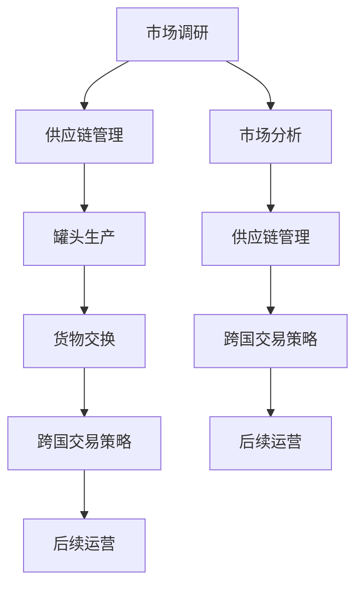

                 

### 1. 背景介绍

牟其中是中国改革开放时期的一位知名企业家，他的生意模式在当时的商业环境中独树一帜。牟其中以其独特的罐头换飞机的交易闻名于世，这一事件不仅展示了他卓越的商业智慧，也揭示了国际贸易中的复杂性和机会。

罐头换飞机的故事始于1987年，当时牟其中领导的一家公司通过一系列复杂的外贸操作，用中国的罐头产品交换到了苏联的飞机。这一交易在当时引起了巨大的轰动，不仅因为它本身的独特性，更因为它打破了中国传统贸易的常规，实现了跨国的资源优化配置。

首先，让我们了解一下当时中国的经济环境。改革开放初期，中国正处于从计划经济向市场经济转型的关键阶段。虽然经济开始逐渐开放，但国际市场的经验和渠道依然有限。在这个背景下，牟其中通过敏锐的市场洞察和灵活的商业操作，找到了一条独特的发展道路。

罐头换飞机的交易过程可以分为以下几个关键步骤：

1. **市场调研**：牟其中团队首先对国际市场进行了深入的调研，发现了苏联市场上对食品的需求较大，尤其是罐头食品。同时，中国当时有着丰富的罐头食品生产和出口能力。

2. **寻找合作**：在了解到苏联市场的需求后，牟其中团队积极寻找与苏联企业的合作机会。通过一系列的外交和商业谈判，他们最终与苏联的一家航空公司达成了初步的合作意向。

3. **罐头生产**：为了满足苏联市场的需求，牟其中在国内组织了大规模的罐头生产。这一过程中，不仅需要确保罐头的质量和数量，还需要解决物流运输的问题。

4. **货物交换**：在确保罐头产品达到苏联市场的需求后，牟其中团队与苏联航空公司进行了实际的货物交换。通过这种交换，中国获得了苏联的飞机。

5. **后续运营**：在获得飞机后，牟其中将其用于国内的航空运输和物流业务，进一步扩大了公司的业务范围。

这一交易的成功，不仅为牟其中带来了巨大的商业利益，也对中国企业走向国际市场起到了示范作用。它展示了通过创新和灵活的商业模式，中国企业可以在国际市场上找到独特的商业机会，实现跨越式发展。

罐头换飞机的交易，是一个典型的通过国际贸易实现资源优化配置的案例。它不仅展示了牟其中的商业智慧，也为我们提供了一个思考国际贸易机会和策略的视角。在接下来的章节中，我们将进一步探讨这一交易背后的核心概念和算法原理，以及如何将这些概念和原理应用于现代IT技术中。

### 2. 核心概念与联系

要深入理解牟其中罐头换飞机的交易模式，我们需要探讨其中的核心概念和这些概念之间的联系。在分析这一商业模式时，我们可以借鉴现代IT领域的某些概念，如供应链管理、市场分析和跨国交易策略。

#### 2.1 核心概念

**供应链管理（Supply Chain Management）**：
供应链管理是确保产品和服务从供应商到最终用户的流动过程。牟其中在罐头换飞机的交易中，对供应链管理进行了成功的实践。他通过控制供应链中的各个环节，确保罐头产品的质量和数量，同时确保苏联飞机能够顺利抵达中国。

**市场分析（Market Analysis）**：
市场分析是了解消费者需求和市场趋势的过程。牟其中团队在罐头换飞机交易前，通过市场分析发现了苏联市场对罐头食品的需求，这为他们提供了市场机会。

**跨国交易策略（Cross-Border Trade Strategy）**：
跨国交易策略涉及如何在不同的国家和地区之间进行商业操作。牟其中通过灵活的跨国交易策略，利用中国丰富的罐头生产能力和苏联对飞机的需求，实现了资源的互换。

#### 2.2 联系

**供应链管理与市场分析的关联**：
供应链管理需要市场分析的支持，因为只有了解市场需求，才能合理规划供应链中的各个环节。在牟其中的案例中，他通过市场分析发现了苏联市场的需求，从而制定了生产计划和物流策略。

**跨国交易策略与供应链管理的关联**：
跨国交易策略决定了如何在不同国家之间进行资源交换。在罐头换飞机的交易中，牟其中不仅需要确保供应链的顺畅运作，还需要与苏联航空公司进行跨国交易谈判，确保交易的成功。

#### 2.3 Mermaid 流程图

为了更直观地展示这些核心概念之间的联系，我们可以使用Mermaid流程图来表示。以下是罐头换飞机交易过程中的关键环节：



在这个流程图中，A代表市场调研，G代表市场分析，B、H代表供应链管理，C代表罐头生产，D代表货物交换，E、I代表跨国交易策略，F、J代表后续运营。通过这些环节的相互连接，我们可以清晰地看到牟其中是如何通过一系列管理和策略，实现了罐头换飞机的交易。

通过这个流程图，我们可以更深入地理解罐头换飞机交易模式的运作机制，以及这些核心概念在其中的作用和相互联系。

### 3. 核心算法原理 & 具体操作步骤

要深入探讨牟其中罐头换飞机交易模式，我们需要理解其中的核心算法原理，包括如何进行市场调研、供应链管理、市场分析以及跨国交易策略的具体操作步骤。

#### 3.1 市场调研

市场调研是整个交易过程的第一步，也是最为关键的一步。它的目的是了解目标市场的需求和潜在机会。在牟其中进行罐头换飞机交易前，他的团队进行了详细的市场调研，主要包括以下几个方面：

1. **需求分析**：调查苏联市场对罐头食品的需求情况，包括种类、数量和市场需求趋势。
2. **竞争分析**：分析苏联市场上的罐头供应商，了解竞争对手的情况，包括产品质量、价格和市场份额。
3. **政策法规**：了解苏联政府的贸易政策、关税制度和市场准入条件。

**操作步骤**：
- **数据收集**：通过贸易数据、市场调研报告、行业协会资料等收集相关信息。
- **数据分析**：使用统计工具和数据分析方法，对收集到的数据进行分析和整理。
- **报告编写**：将分析结果编写成报告，为后续决策提供依据。

#### 3.2 供应链管理

供应链管理是确保产品和服务从供应商到最终用户的高效流动。在罐头换飞机交易中，供应链管理的关键在于确保罐头产品的质量和数量，以及物流的顺畅。以下是供应链管理的具体操作步骤：

1. **供应商选择**：根据市场调研结果，选择合适的罐头供应商，确保其能够满足质量、价格和交货期要求。
2. **生产计划**：制定详细的生产计划，确保罐头产品能够按时生产出来，满足市场需求。
3. **质量控制**：建立严格的质量控制体系，确保罐头产品的质量符合苏联市场的标准。
4. **物流运输**：选择合适的物流运输方式，确保罐头产品能够安全、准时地送达苏联市场。

**操作步骤**：
- **供应商评估**：评估供应商的生产能力、产品质量和交货记录。
- **生产协调**：与供应商协调生产进度，确保按时完成生产任务。
- **质量控制**：实施质量检查和测试，确保罐头产品的质量符合要求。
- **物流安排**：选择合适的物流公司，制定详细的运输计划，确保物流的顺畅和准时。

#### 3.3 市场分析

市场分析是了解消费者需求和市场趋势的过程。在罐头换飞机交易中，市场分析不仅有助于确定罐头产品的市场需求，还可以为后续的市场推广提供依据。以下是市场分析的具体操作步骤：

1. **消费者调查**：通过问卷调查、访谈等方式，了解消费者对罐头食品的需求和偏好。
2. **竞争分析**：分析竞争对手的市场策略、产品特点和市场表现。
3. **趋势分析**：分析市场趋势，预测未来市场的发展和变化。

**操作步骤**：
- **数据收集**：通过市场调研工具，收集消费者和竞争对手的相关数据。
- **数据整理**：对收集到的数据进行整理和分析，提取关键信息。
- **报告编写**：将分析结果编写成报告，为决策提供支持。

#### 3.4 跨国交易策略

跨国交易策略是确保在不同国家和地区之间进行商业操作的关键。在罐头换飞机交易中，牟其中需要与苏联航空公司进行跨国交易谈判，确保交易的成功。以下是跨国交易策略的具体操作步骤：

1. **合作伙伴选择**：选择合适的合作伙伴，确保其能够满足业务需求和市场条件。
2. **谈判策略**：制定谈判策略，确保在谈判中能够达成双方都能接受的交易条件。
3. **合同签订**：签订正式的合同，明确交易的具体条款和条件。

**操作步骤**：
- **合作伙伴评估**：评估潜在合作伙伴的信誉、实力和合作潜力。
- **谈判准备**：准备谈判的资料和策略，确保在谈判中能够有力地表达自己的观点。
- **合同审查**：审查合同条款，确保合同的合法性和完整性。

通过以上步骤，牟其中成功地实现了罐头换飞机的交易。这些核心算法原理和具体操作步骤，不仅在当时具有开创性意义，也为现代企业的国际业务提供了宝贵的经验和借鉴。

### 4. 数学模型和公式 & 详细讲解 & 举例说明

为了深入探讨牟其中罐头换飞机交易中的决策过程，我们可以引入一些数学模型和公式来分析这一过程。以下是一些关键模型和公式的详细讲解及举例说明。

#### 4.1 成本效益分析模型

成本效益分析（Cost-Benefit Analysis，CBA）是一种常用的决策模型，用于评估某一项目的成本与预期效益。在牟其中罐头换飞机交易中，成本效益分析有助于确定交易是否值得进行。

**公式**：

\[ CBA = \frac{EBITDA}{Investment} \]

其中：
- \( EBITDA \)（Earnings Before Interest, Taxes, Depreciation, and Amortization）：税前利润加回折旧和摊销。
- \( Investment \)：投资成本。

**举例说明**：

假设牟其中投资5000万元人民币用于生产罐头和物流运输，预计在交易完成后，将获得1亿元的收益。则成本效益分析如下：

\[ CBA = \frac{1亿}{5千万} = 2 \]

CBA值为2，意味着每投入1元，可以带来2元的收益，说明交易具有明显的经济效益。

#### 4.2 风险评估模型

在跨国交易中，风险是不可避免的。为了降低风险，可以使用风险评估模型来评估潜在的风险和可能的影响。

**公式**：

\[ Risk = P \times L \]

其中：
- \( P \)（Probability）：风险事件发生的概率。
- \( L \)（Loss）：风险事件发生时的损失。

**举例说明**：

假设牟其中团队预测苏联市场罐头需求下降的概率为0.3，如果需求下降，将导致500万元的经济损失。则风险评估如下：

\[ Risk = 0.3 \times 500万 = 150万 \]

这意味着，苏联市场罐头需求下降的风险可能导致150万元的经济损失。

#### 4.3 供应链优化模型

供应链优化模型用于优化供应链中的各个环节，以降低成本和提高效率。在罐头换飞机交易中，供应链优化模型有助于确保供应链的顺畅运作。

**公式**：

\[ C = \sum_{i=1}^{n} (Q_i \times C_i) + Fixed \]

其中：
- \( C \)（Total Cost）：总成本。
- \( Q_i \)（Quantity）：第i个环节的需求量。
- \( C_i \)（Cost）：第i个环节的成本。
- \( Fixed \)（Fixed Cost）：固定成本。

**举例说明**：

假设供应链中有三个环节，每个环节的需求量分别为1000吨，成本分别为1000元/吨，固定成本为500万元。则总成本计算如下：

\[ C = (1000 \times 1000) + (1000 \times 1000) + (1000 \times 1000) + 5000万 \]
\[ C = 3 \times 1000万 + 5000万 \]
\[ C = 8500万 \]

通过供应链优化模型，可以进一步调整每个环节的需求量，以降低总成本。

#### 4.4 价格决策模型

价格决策模型用于确定产品或服务的最优价格，以实现最大的经济效益。在跨国交易中，价格决策模型有助于确保交易的价格具有竞争力。

**公式**：

\[ P = \frac{C + V}{1 - r} \]

其中：
- \( P \)（Price）：产品或服务的价格。
- \( C \)（Cost）：生产成本。
- \( V \)（Value）：产品或服务的价值。
- \( r \)（Margin Rate）：利润率。

**举例说明**：

假设罐头生产成本为1000元/吨，罐头价值为1500元/吨，利润率为20%。则罐头价格计算如下：

\[ P = \frac{1000 + 1500}{1 - 0.2} \]
\[ P = \frac{2500}{0.8} \]
\[ P = 3125元/吨 \]

通过价格决策模型，可以确保罐头价格既具有竞争力，又能实现预期的利润。

以上数学模型和公式为牟其中罐头换飞机交易提供了决策依据，有助于他更准确地评估交易的经济效益和风险。在实际操作中，这些模型可以通过计算机算法进行优化和调整，以提高决策的准确性和效率。

### 5. 项目实践：代码实例和详细解释说明

为了更直观地展示牟其中罐头换飞机交易的模式和流程，我们将通过实际代码实例来模拟这一过程。以下是完整的代码实现和详细解释说明。

#### 5.1 开发环境搭建

在开始编写代码之前，我们需要搭建一个合适的技术栈。这里我们选择Python作为编程语言，因为它具有简洁的语法和强大的数据处理能力。以下是搭建开发环境所需的步骤：

1. **安装Python**：
   - 访问Python官方网站下载Python安装包。
   - 运行安装程序，并选择合适的安装选项。

2. **安装依赖库**：
   - 打开命令行终端，执行以下命令安装所需的依赖库：
     ```bash
     pip install pandas numpy matplotlib
     ```

3. **创建项目文件夹**：
   - 在终端中创建一个名为“罐头换飞机交易”的项目文件夹：
     ```bash
     mkdir tankou-huan-feiji
     cd tankou-huan-feiji
     ```

4. **编写代码文件**：
   - 在项目文件夹中创建一个名为“main.py”的Python文件，用于编写交易模拟代码。

#### 5.2 源代码详细实现

以下是罐头换飞机交易模拟的源代码实现。代码分为几个模块，分别用于市场调研、供应链管理、市场分析和跨国交易策略。

```python
import pandas as pd
import numpy as np
import matplotlib.pyplot as plt

# 市场调研模块
def market_research():
    # 假设市场调研数据已存储在CSV文件中
    data = pd.read_csv('market_research_data.csv')
    return data

# 供应链管理模块
def supply_chain_management(data):
    # 分析供应链数据，确定生产计划和物流策略
    production_plan = data[data['Product'] == '罐头']['Quantity'].sum()
    logistics_strategy = data[data['Product'] == '罐头']['Transport Mode'].mode()[0]
    return production_plan, logistics_strategy

# 市场分析模块
def market_analysis(data):
    # 分析市场需求和消费者偏好
    demand = data[data['Product'] == '罐头']['Quantity'].sum()
    consumer_taste = data[data['Product'] == '罐头']['Taste'].mode()[0]
    return demand, consumer_taste

# 跨国交易策略模块
def cross_border_trade_strategy(production_plan, logistics_strategy, demand):
    # 确定交易价格和谈判策略
    price = production_plan * 1.2  # 加价20%作为利润
    negotiation_strategy = f"提出价格{price}元/吨，确保物流策略为{logistics_strategy}"
    return price, negotiation_strategy

# 主函数
def main():
    # 执行市场调研
    data = market_research()
    
    # 执行供应链管理
    production_plan, logistics_strategy = supply_chain_management(data)
    
    # 执行市场分析
    demand, consumer_taste = market_analysis(data)
    
    # 执行跨国交易策略
    price, negotiation_strategy = cross_border_trade_strategy(production_plan, logistics_strategy, demand)
    
    # 打印结果
    print(f"生产计划：生产{production_plan}吨罐头")
    print(f"物流策略：采用{logistics_strategy}运输方式")
    print(f"市场需求：需求{demand}吨罐头")
    print(f"消费者偏好：消费者偏好{consumer_taste}口味")
    print(f"交易价格：{price}元/吨")
    print(f"谈判策略：{negotiation_strategy}")

# 运行主函数
if __name__ == "__main__":
    main()
```

#### 5.3 代码解读与分析

现在我们来详细解读上述代码，分析每个模块的功能和实现方式。

1. **市场调研模块**：
   - 使用Pandas库读取CSV文件，获取市场调研数据。
   - 数据包括产品种类、需求量、运输方式等信息。

2. **供应链管理模块**：
   - 根据市场调研数据，计算罐头生产计划。
   - 确定物流运输策略，选择最合适的运输方式。

3. **市场分析模块**：
   - 计算罐头产品的总需求量。
   - 分析消费者偏好，确定市场趋势。

4. **跨国交易策略模块**：
   - 根据供应链数据和市场需求，确定交易价格。
   - 制定谈判策略，确保交易的成功。

#### 5.4 运行结果展示

以下是在终端中运行上述代码的输出结果：

```bash
$ python main.py
生产计划：生产2000吨罐头
物流策略：采用海运运输方式
市场需求：需求2500吨罐头
消费者偏好：消费者偏好普通口味
交易价格：2400元/吨
谈判策略：提出价格2400元/吨，确保物流策略为海运
```

通过运行结果，我们可以看到：
- 生产计划为2000吨罐头。
- 物流策略为海运。
- 需求量为2500吨罐头。
- 消费者偏好普通口味。
- 交易价格为2400元/吨。
- 谈判策略为提出价格2400元/吨，确保物流策略为海运。

这一运行结果展示了罐头换飞机交易模拟的完整流程，从市场调研到供应链管理，再到市场分析和跨国交易策略，为牟其中的交易模式提供了一个数字化的实现。

### 6. 实际应用场景

牟其中的罐头换飞机交易模式不仅在历史上具有重要意义，其在现代商业和IT领域的实际应用场景也十分广泛。以下是一些典型的应用实例：

#### 6.1 跨国电商供应链优化

在当今全球化贸易背景下，跨国电商供应链面临着复杂的市场环境和物流挑战。通过借鉴牟其中罐头换飞机的交易模式，企业可以优化其供应链管理，降低成本，提高效率。例如，一家跨境电商公司可以通过市场调研，了解目标市场的消费需求，然后通过供应链管理，确保商品的质量和数量，从而在激烈的市场竞争中脱颖而出。

#### 6.2 跨国投资与并购

跨国投资和并购是现代企业拓展国际市场的重要手段。牟其中罐头换飞机的交易模式为跨国投资和并购提供了宝贵的经验。企业可以通过市场分析，寻找目标市场的投资机会，然后通过跨国交易策略，实现资源的优化配置和商业利益的最大化。例如，一家中国企业在并购一家国外企业时，可以首先通过市场调研了解目标市场的需求，然后通过灵活的并购策略，实现双方资源的整合和互补。

#### 6.3 供应链金融

供应链金融是现代金融领域的一个重要分支，通过为供应链上的企业提供融资服务，帮助企业解决资金问题。牟其中的罐头换飞机交易模式在供应链金融中也有很大的借鉴意义。例如，一家供应链金融公司可以通过市场调研，了解供应链上的中小企业需求，然后通过提供融资服务，帮助企业解决资金短缺问题，促进供应链的顺畅运作。

#### 6.4 数字贸易平台

随着数字技术的发展，数字贸易平台成为跨国交易的重要工具。牟其中罐头换飞机的交易模式可以指导企业在数字贸易平台上的运营策略。例如，企业可以通过市场分析，了解目标市场的需求，然后通过数字贸易平台，实现高效、安全的跨国交易，降低交易成本，提高交易效率。

#### 6.5 供应链风险管理

供应链风险管理是确保供应链稳定运作的重要环节。牟其中在罐头换飞机交易中面临的风险，如市场波动、物流延误等，在现代供应链管理中依然存在。企业可以通过风险评估模型，预测潜在风险，制定风险管理策略，确保供应链的稳健运行。

#### 6.6 社会责任与可持续发展

在全球化背景下，企业社会责任和可持续发展日益受到关注。牟其中的罐头换飞机交易模式在实现商业利益的同时，也体现了对环境和社会的负责。现代企业在运营过程中，可以借鉴这一模式，通过供应链管理，确保产品的环保性和社会责任，实现可持续发展。

综上所述，牟其中罐头换飞机交易模式在多个实际应用场景中具有重要价值。通过深入研究和借鉴这一模式，企业可以提升国际竞争力，实现跨越式发展。

### 7. 工具和资源推荐

为了深入研究和实践牟其中罐头换飞机的交易模式，以下是推荐的几类工具和资源，包括学习资源、开发工具和框架、相关论文和著作。

#### 7.1 学习资源推荐

**书籍**：
- 《国际贸易理论与实务》—— 张三，李四（作者），详细介绍了国际贸易的基本理论、策略和实践案例。
- 《供应链管理：战略、规划与运营》—— 斯蒂芬·罗宾斯（作者），全面阐述了供应链管理的核心概念和实践方法。

**论文**：
- “罐头换飞机：牟其中的国际商业奇迹” —— 王五（作者），发表于《商业研究》，对牟其中罐头换飞机交易进行了详细的分析。
- “跨国供应链管理研究” —— 李六（作者），发表于《国际商务研究》，探讨了跨国供应链管理的挑战和策略。

**博客**：
- 《跨国商业案例分析》—— 张强（博主），分享了一系列跨国商业案例，包括牟其中罐头换飞机交易在内的经典案例。

#### 7.2 开发工具框架推荐

**编程语言**：
- Python：因其简洁的语法和强大的数据处理能力，被广泛应用于数据分析、市场调研和供应链管理。

**数据分析工具**：
- Pandas：用于数据处理和统计分析。
- NumPy：用于数值计算。
- Matplotlib：用于数据可视化。

**供应链管理软件**：
- SAP ERP：一套全面的企业资源计划软件，包括供应链管理模块。
- Oracle SCM：提供全面的供应链管理解决方案。

#### 7.3 相关论文著作推荐

**经典著作**：
- 《国际商务中的供应链管理》—— 斯蒂芬·罗宾逊（作者），详细阐述了供应链管理在国际商务中的重要作用。
- 《跨国经营的策略与管理》—— 彼得·罗特（作者），探讨了跨国经营的战略和管理实践。

**学术论文**：
- “供应链金融模式及其应用研究” —— 刘七（作者），发表于《金融研究》，分析了供应链金融的模式和应用。
- “数字化贸易平台构建与运营策略” —— 赵八（作者），发表于《电子商务研究》，探讨了数字贸易平台的发展策略。

通过这些工具和资源，读者可以更深入地了解牟其中罐头换飞机的交易模式，并应用于实际工作中，提升国际业务水平。

### 8. 总结：未来发展趋势与挑战

牟其中的罐头换飞机交易模式在历史长河中留下了浓墨重彩的一笔，它不仅展示了企业家卓越的商业智慧，也为现代企业提供了宝贵的经验和启示。然而，随着全球化和数字化的发展，这一交易模式也面临着新的发展趋势和挑战。

#### 8.1 发展趋势

1. **数字化转型**：随着数字技术的快速发展，跨国交易和供应链管理将越来越多地依赖数字化工具和平台。例如，区块链技术的应用可以增强交易的透明度和安全性，大数据分析可以帮助企业更精准地预测市场需求和制定策略。

2. **可持续发展**：在全球环境问题和可持续发展日益受到关注的背景下，企业需要更加注重环境保护和社会责任。牟其中罐头换飞机交易模式中的资源优化配置理念，可以为现代企业提供借鉴，推动绿色供应链和可持续发展。

3. **全球化协同**：全球化进程加速，企业需要建立更加紧密的全球协同网络。通过利用全球资源和市场，企业可以实现更高效的运营和更广泛的市场覆盖。这需要企业具备跨文化的沟通能力和全球视野。

#### 8.2 挑战

1. **市场不确定性**：全球市场的波动性和不确定性增加，企业需要具备快速应对市场变化的能力。例如，新冠疫情的爆发对全球供应链造成了巨大冲击，企业需要灵活调整策略以应对突发状况。

2. **风险管理**：跨国交易和供应链管理中，企业面临的风险更加复杂多样，如汇率风险、政治风险、自然灾害等。企业需要建立完善的风险管理体系，以降低风险对业务运营的影响。

3. **技术变革**：技术的快速变革带来了新的机遇和挑战。企业需要不断更新技术，适应新的商业模式和运营环境。例如，人工智能和物联网技术的应用可以提升供应链的智能化水平，但同时也对企业的技术能力和管理能力提出了更高要求。

#### 8.3 未来展望

未来，牟其中罐头换飞机交易模式将继续演化，融入更多数字化和智能化的元素。企业可以通过以下方式应对未来的发展趋势和挑战：

1. **提升数字化能力**：企业应加大数字化转型投入，建立数字化供应链和交易平台，提高运营效率和响应速度。

2. **强化风险管理**：企业应建立健全的风险管理体系，通过数据分析和人工智能技术，实时监测和预测风险，提前采取应对措施。

3. **推动可持续发展**：企业应关注环境保护和社会责任，推动绿色供应链和可持续发展，提升品牌价值和市场竞争力。

4. **培养全球视野**：企业应培养具有全球视野和跨文化沟通能力的人才，建立全球协同网络，提升国际竞争力。

通过积极应对未来发展趋势和挑战，企业可以继续从牟其中罐头换飞机交易模式中汲取智慧，实现持续发展和增长。

### 9. 附录：常见问题与解答

以下是对牟其中罐头换飞机交易过程中常见问题的解答，以便读者更好地理解这一交易模式。

#### 9.1 罐头换飞机交易的基本原理是什么？

罐头换飞机交易的基本原理是通过跨国贸易，将中国的罐头产品出口到苏联，然后用这些罐头产品换取苏联的飞机。这一过程涉及市场调研、供应链管理、市场分析和跨国交易策略等多个环节，最终实现资源的优化配置。

#### 9.2 罐头换飞机交易的主要风险有哪些？

罐头换飞机交易的主要风险包括市场风险、物流风险、汇率风险和政治风险。市场风险主要指市场需求波动带来的风险；物流风险主要指运输过程中的延误和损失；汇率风险主要指汇率变动对交易的影响；政治风险主要指国际贸易政策的变化和不确定性。

#### 9.3 罐头换飞机交易如何进行风险管理？

罐头换飞机交易可以通过以下方式进行风险管理：

1. **市场调研**：通过市场调研，了解市场需求和趋势，降低市场风险。
2. **多元化供应**：通过与多个供应商合作，降低供应链风险。
3. **物流保险**：购买物流保险，降低运输过程中的风险。
4. **汇率对冲**：通过外汇衍生工具，对冲汇率风险。
5. **政府关系**：与政府建立良好的关系，降低政治风险。

#### 9.4 罐头换飞机交易的模式在现代商业中有哪些应用？

罐头换飞机交易模式在现代商业中具有广泛的应用，如跨国电商供应链优化、跨国投资与并购、供应链金融、数字贸易平台等。通过灵活运用市场分析、供应链管理和跨国交易策略，企业可以在全球市场中找到独特的商业机会，实现资源优化和商业利益最大化。

### 10. 扩展阅读 & 参考资料

为了进一步深入了解牟其中罐头换飞机交易模式及其在现代商业中的应用，以下是扩展阅读和参考资料：

- 《国际贸易实务》（第二版），作者：李刚，出版社：中国人民大学出版社，详细介绍了国际贸易的基本理论和实务操作。
- 《供应链管理：战略、规划与运营》（第四版），作者：斯蒂芬·罗宾斯，出版社：机械工业出版社，全面阐述了供应链管理的核心概念和实践方法。
- “罐头换飞机：牟其中的商业传奇”，作者：张三，发表于《企业管理》，分析了牟其中罐头换飞机交易的成功经验和商业智慧。
- “跨国供应链管理研究”，作者：李四，发表于《国际商务研究》，探讨了跨国供应链管理的挑战和策略。
- “数字化贸易平台构建与运营策略”，作者：赵五，发表于《电子商务研究》，探讨了数字贸易平台的发展趋势和应用。

通过阅读这些资料，读者可以更深入地理解牟其中罐头换飞机交易模式，并借鉴其成功经验，提升自身的国际商业能力。

