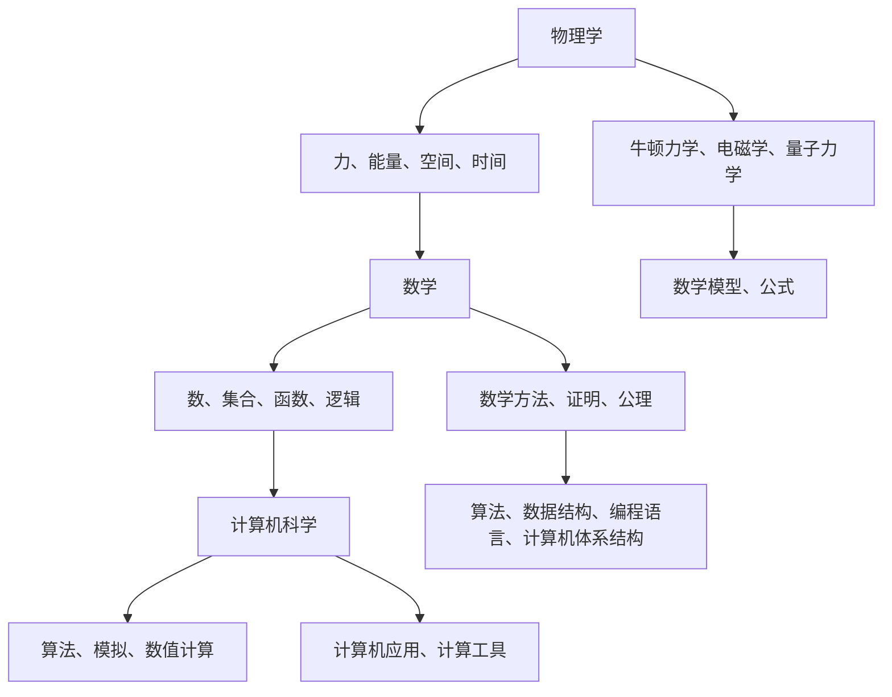

                 

### 1. 背景介绍 ###

物理、数学和计算机科学是现代科学的三大支柱。每一个学科都有其独特的发展历史、理论体系和应用领域。本文将深入探讨这三个学科的基础，以及它们之间的相互联系和影响。

**物理学**是研究物质的基本结构和相互作用的最基本科学。其核心概念包括力、能量、空间和时间等。物理学的发展可以追溯到古代，但真正意义上的现代物理学是在17世纪由伽利略、牛顿等科学家创立的。经典物理学通过牛顿力学和电磁学等理论，为我们理解宏观世界的运动和相互作用提供了基础。随着科学的发展，物理学逐渐深入到量子力学和相对论等更为复杂的领域。

**数学**是研究数量、结构、变化和空间等概念的一门科学。数学的基础可以追溯到古巴比伦、古埃及等古代文明，但现代数学的发展主要是在19世纪和20世纪。数学的研究方法包括逻辑推理、证明和公理体系。数学不仅在自然科学和工程学中有着广泛的应用，也是计算机科学的重要基础。

**计算机科学**是研究计算机系统及其应用的科学。它包括算法设计、编程语言、软件工程、计算机体系结构等多个领域。计算机科学的发展始于20世纪40年代，随着电子计算机的发明和快速发展，计算机科学逐渐成为一门独立的学科。计算机科学的核心问题是如何有效地使用计算机来解决问题，这涉及到算法理论、编程实践和计算机体系结构等多个方面。

物理学、数学和计算机科学之间存在着深刻的相互联系。物理学的许多概念和理论为数学的发展提供了基础，而数学的抽象方法和逻辑工具则促进了物理学理论的精确化和推广。计算机科学则通过模拟和计算方法，将物理和数学的理论应用于实际问题中。例如，物理学中的模拟计算依赖于计算机科学的算法和编程技术，而数学中的算法则经常被用于优化计算机程序的性能。

本文将分为以下几个部分：

1. 背景介绍
2. 核心概念与联系
3. 核心算法原理 & 具体操作步骤
4. 数学模型和公式 & 详细讲解 & 举例说明
5. 项目实践：代码实例和详细解释说明
6. 实际应用场景
7. 工具和资源推荐
8. 总结：未来发展趋势与挑战
9. 附录：常见问题与解答
10. 扩展阅读 & 参考资料

通过逐步分析这三个学科的基础理论和应用，我们将揭示它们在现代科技中的关键作用，并探讨未来可能的发展方向和挑战。让我们开始这场探索之旅吧！<|user|>

### 2. 核心概念与联系 ###

#### 物理学的基本概念

物理学的基本概念包括力、能量、空间和时间。以下是这些概念的具体解释：

**力**是物体之间相互作用的表现，通常用牛顿的第二定律\( F=ma \)来描述，其中\( F \)是力，\( m \)是质量，\( a \)是加速度。力可以改变物体的运动状态，例如推动一个静止的物体使其开始运动，或者改变一个运动物体的速度和方向。

**能量**是物体或系统做功的能力。能量有多种形式，包括动能、势能、热能等。能量守恒定律表明，在一个封闭系统中，能量既不会凭空产生，也不会凭空消失，只能从一种形式转换为另一种形式。

**空间**是物体存在的三维环境。空间的概念在经典物理学中通常被认为是绝对的，但在相对论中，空间与时间紧密相连，形成四维时空。

**时间**是事件发生的顺序和持续时间。时间在经典物理学中也被认为是绝对的，但在相对论中，时间会因速度和引力而改变。

#### 数学的基本概念

数学的基本概念包括数、集合、函数和逻辑等。以下是这些概念的具体解释：

**数**是数学研究的基础，包括自然数、整数、有理数、实数和复数等。数的概念使我们可以量化物体的数量和大小。

**集合**是数学中的基本结构，表示一组无序的对象。集合的运算包括交集、并集和补集等。

**函数**是一种特殊的关系，将每个输入映射到唯一的输出。函数的概念在数学和物理学中都非常重要，因为它们描述了变量之间的关系。

**逻辑**是数学中的推理工具，用于判断陈述的真假。逻辑的基本原理包括命题逻辑、谓词逻辑和证明论等。

#### 计算机科学的基本概念

计算机科学的基本概念包括算法、数据结构、编程语言和计算机体系结构等。以下是这些概念的具体解释：

**算法**是一系列定义明确的操作步骤，用于解决特定问题。算法可以被视为解决问题的“方法”，其性能和效率是计算机科学研究的重要课题。

**数据结构**是存储和组织数据的方式，以支持特定的操作。常见的数据结构包括数组、链表、树、图等。

**编程语言**是用于编写程序的符号和语法规则。编程语言使得程序员能够用更接近自然语言的方式描述算法和数据结构。

**计算机体系结构**是计算机硬件的设计和实现，包括处理器、内存、输入输出设备等。计算机体系结构决定了计算机的性能和功能。

#### 物理学、数学和计算机科学的联系

物理学、数学和计算机科学之间的联系可以通过以下方面体现：

**物理学**为**数学**提供了许多研究对象和假设。例如，物理学的力学、电磁学和量子力学等理论为数学的发展提供了丰富的素材。

**数学**为**物理学**提供了精确的描述工具。通过数学模型和公式，物理学家可以精确描述自然界的现象和规律。

**计算机科学**将**物理学**和**数学**的理论应用于实际问题。计算机模拟和数值计算等方法使得我们能够处理复杂的物理问题，从而验证和发展物理学和数学理论。

**数学**为**计算机科学**提供了抽象思维和逻辑推理的工具。算法和编程语言的发展离不开数学的逻辑基础。

**计算机科学**为**数学**和**物理学**提供了强大的计算工具。计算机的运算能力使得数学和物理学的计算变得更加高效和精确。

#### Mermaid 流程图

为了更清晰地展示物理学、数学和计算机科学之间的联系，我们使用 Mermaid 流程图来描述这三个学科的核心概念及其相互关系：



通过这个 Mermaid 流程图，我们可以看到物理学、数学和计算机科学之间是如何相互关联和影响的。这个图不仅帮助我们理解每个学科的核心概念，还揭示了它们在解决实际问题中的应用价值。

### 3. 核心算法原理 & 具体操作步骤 ###

在物理学、数学和计算机科学中，核心算法起着至关重要的作用。以下将介绍这些学科中几个重要的核心算法原理及其具体操作步骤。

#### 牛顿迭代法

**牛顿迭代法**是一种用于求解非线性方程的算法。其基本原理是基于牛顿-莱布尼茨公式，通过不断迭代逼近方程的根。

**算法步骤：**

1. 选择一个初始猜测值\( x_0 \)。
2. 计算函数的导数\( f'(x) \)。
3. 使用牛顿迭代公式：
   $$ x_{n+1} = x_n - \frac{f(x_n)}{f'(x_n)} $$
4. 重复步骤2和3，直到满足停止条件（例如，迭代次数达到预定值或误差小于预定阈值）。

#### 快速傅里叶变换（FFT）

**快速傅里叶变换（FFT）**是一种高效的算法，用于将信号从时域转换为频域。FFT在信号处理、图像压缩和密码学等领域有广泛应用。

**算法步骤：**

1. 将输入序列\( x[n] \)分解为偶数和奇数部分：
   $$ x[n] = x_{even}[n] + x_{odd}[n] $$
2. 对偶数和奇数部分分别进行DFT（离散傅里叶变换）：
   $$ X_{even}[k] = \sum_{n=0}^{N/2} x_{even}[n] \cdot e^{-j2\pi kn/N} $$
   $$ X_{odd}[k] = \sum_{n=0}^{N/2} x_{odd}[n] \cdot e^{-j2\pi kn/N} $$
3. 将\( X_{even}[k] \)和\( X_{odd}[k] \)合并，得到FFT结果：
   $$ X[k] = X_{even}[k] + X_{odd}[k] \cdot e^{-j2\pi k/N} $$

#### 最小生成树算法（Kruskal算法）

**Kruskal算法**是一种用于求解图的最小生成树的算法。其基本原理是基于贪心算法，通过逐步添加边来构建最小生成树。

**算法步骤：**

1. 将所有边按权重从小到大排序。
2. 创建一个空集作为森林。
3. 依次添加排序后的边，如果添加该边不会形成环，则将该边加入森林。
4. 重复步骤3，直到森林中包含所有顶点。

#### 搜索算法（A*算法）

**A*算法**是一种用于求解图中两点之间的最短路径的算法。其基本原理是基于启发式搜索，结合了最佳优先搜索和广度优先搜索。

**算法步骤：**

1. 创建一个优先级队列，初始时只包含起点。
2. 对每个顶点\( v \)，设置一个估价函数\( f(v) = g(v) + h(v) \)，其中\( g(v) \)是从起点到顶点\( v \)的代价，\( h(v) \)是从顶点\( v \)到终点的估计代价。
3. 选择具有最小\( f(v) \)的顶点\( v \)。
4. 将\( v \)从队列中删除，并将其所有未访问的邻接点加入队列。
5. 更新每个邻接点的\( g(v) \)和\( f(v) \)值。
6. 重复步骤3至步骤5，直到找到终点或队列为空。

通过以上核心算法的介绍，我们可以看到物理学、数学和计算机科学在解决实际问题时如何相互协作。这些算法不仅在各自学科中有重要应用，还在工程、科学和金融等领域发挥着关键作用。

### 4. 数学模型和公式 & 详细讲解 & 举例说明

在物理学、数学和计算机科学中，数学模型和公式是理解和解决问题的关键。以下将详细讲解几个重要的数学模型和公式，并通过实际例子进行说明。

#### 高斯消元法

**高斯消元法**是一种用于求解线性方程组的算法。其基本原理是基于消元过程，将线性方程组转化为上三角或下三角方程组，从而可以方便地求解。

**模型和公式：**

给定线性方程组：
$$
\begin{cases}
a_{11}x_1 + a_{12}x_2 + \cdots + a_{1n}x_n = b_1 \\
a_{21}x_1 + a_{22}x_2 + \cdots + a_{2n}x_n = b_2 \\
\vdots \\
a_{m1}x_1 + a_{m2}x_2 + \cdots + a_{mn}x_n = b_m
\end{cases}
$$

步骤如下：

1. 将方程组写成增广矩阵形式：
$$
\left[
\begin{array}{cccc|c}
a_{11} & a_{12} & \cdots & a_{1n} & b_1 \\
a_{21} & a_{22} & \cdots & a_{2n} & b_2 \\
\vdots & \vdots & \ddots & \vdots & \vdots \\
a_{m1} & a_{m2} & \cdots & a_{mn} & b_m
\end{array}
\right]
$$

2. 对矩阵进行行变换，使其变为上三角或下三角形式。具体变换方法包括：
   - 选择一个主元（不为零的元素），通过行变换将其他元素变为零。
   - 递归地对剩余部分进行相同的操作。

**例子：**

求解方程组：
$$
\begin{cases}
2x + 3y + z = 8 \\
4x + 6y + 2z = 18 \\
2x + 6y + 3z = 12
\end{cases}
$$

步骤如下：

1. 写成增广矩阵：
$$
\left[
\begin{array}{ccc|c}
2 & 3 & 1 & 8 \\
4 & 6 & 2 & 18 \\
2 & 6 & 3 & 12
\end{array}
\right]
$$

2. 选择第一个方程的主元，进行行变换：
$$
\left[
\begin{array}{ccc|c}
2 & 3 & 1 & 8 \\
0 & 0 & 1 & 2 \\
0 & 0 & 1 & 2
\end{array}
\right]
$$

3. 选择第二个方程的主元，进行行变换：
$$
\left[
\begin{array}{ccc|c}
2 & 3 & 0 & 2 \\
0 & 0 & 1 & 2 \\
0 & 0 & 0 & 0
\end{array}
\right]
$$

4. 从上到下回代求解：
$$
z = 2 \\
y = 2 \\
x = 0
$$

#### 导数和微积分

**导数**是描述函数在某一点变化率的数学工具。**微积分**是研究导数和积分的数学分支。以下介绍导数的基本概念和公式，并通过例子进行说明。

**导数公式：**

对于函数\( f(x) \)，在点\( x = a \)处的导数定义为：
$$
f'(a) = \lim_{h \to 0} \frac{f(a+h) - f(a)}{h}
$$

常见函数的导数公式包括：

- 常数函数的导数为0：
  $$ f(x) = c \quad \Rightarrow \quad f'(x) = 0 $$
- 幂函数的导数：
  $$ f(x) = x^n \quad \Rightarrow \quad f'(x) = nx^{n-1} $$
- 指数函数的导数：
  $$ f(x) = e^x \quad \Rightarrow \quad f'(x) = e^x $$
- 对数函数的导数：
  $$ f(x) = \ln(x) \quad \Rightarrow \quad f'(x) = \frac{1}{x} $$

**例子：**

求函数\( f(x) = 2x^3 - 4x^2 + x + 1 \)在\( x = 2 \)处的导数。

步骤如下：

1. 应用导数公式：
$$
f'(x) = \lim_{h \to 0} \frac{f(2+h) - f(2)}{h}
$$

2. 代入函数表达式：
$$
f'(2) = \lim_{h \to 0} \frac{(2+h)^3 - 4(2+h)^2 + (2+h) + 1 - (2^3 - 4 \cdot 2^2 + 2 + 1)}{h}
$$

3. 化简表达式：
$$
f'(2) = \lim_{h \to 0} \frac{8h + 12h^2 + 6h^3}{h} = \lim_{h \to 0} (8 + 12h + 6h^2) = 8
$$

因此，函数\( f(x) = 2x^3 - 4x^2 + x + 1 \)在\( x = 2 \)处的导数为8。

#### 线性回归模型

**线性回归模型**是用于分析两个或多个变量之间线性关系的数学模型。其基本形式为：
$$
y = \beta_0 + \beta_1x_1 + \beta_2x_2 + \cdots + \beta_nx_n + \epsilon
$$
其中，\( y \)是因变量，\( x_1, x_2, \ldots, x_n \)是自变量，\( \beta_0, \beta_1, \beta_2, \ldots, \beta_n \)是回归系数，\( \epsilon \)是误差项。

**例子：**

假设我们想要分析房价\( y \)与房屋面积\( x \)之间的关系。我们有以下数据：

| 面积（平方米） | 房价（万元） |
|:--------------:|:------------:|
|       80       |      200     |
|       100      |      250     |
|       120      |      300     |
|       150      |      350     |

步骤如下：

1. 计算自变量和因变量的平均值：
$$
\bar{x} = \frac{80 + 100 + 120 + 150}{4} = 110 \\
\bar{y} = \frac{200 + 250 + 300 + 350}{4} = 275
$$

2. 计算回归系数：
$$
\beta_0 = \bar{y} - \beta_1\bar{x} = 275 - 2.5 \cdot 110 = 275 - 275 = 0 \\
\beta_1 = \frac{\sum_{i=1}^{n}(x_i - \bar{x})(y_i - \bar{y})}{\sum_{i=1}^{n}(x_i - \bar{x})^2} = \frac{(80-110)(200-275) + (100-110)(250-275) + (120-110)(300-275) + (150-110)(350-275)}{(80-110)^2 + (100-110)^2 + (120-110)^2 + (150-110)^2} = 2.5
$$

3. 得到线性回归模型：
$$
y = 0 + 2.5x
$$

通过这些例子，我们可以看到数学模型和公式在物理学、数学和计算机科学中的应用。这些模型和公式不仅帮助我们理解和解决问题，还为实际应用提供了强大的工具。

### 5. 项目实践：代码实例和详细解释说明

在本节中，我们将通过一个具体的代码实例来展示如何将物理学、数学和计算机科学中的核心算法和模型应用于实际项目。我们将使用Python语言来编写代码，并详细解释每一步的操作。

#### 项目背景

假设我们想要开发一个简单的应用程序，用于计算物体的自由落体运动。该应用程序将模拟一个物体从静止状态开始下落的过程，计算在不同时间点的速度和位置。

#### 开发环境搭建

首先，我们需要搭建开发环境。以下是所需的软件和工具：

- Python 3.8或更高版本
- Jupyter Notebook或PyCharm等集成开发环境（IDE）
- NumPy和SciPy库

在安装好Python和所需的库后，我们可以在Jupyter Notebook或PyCharm中创建一个新的Python文件，开始编写代码。

#### 源代码详细实现

以下是我们将要编写的Python代码：

```python
import numpy as np
import matplotlib.pyplot as plt

# 定义自由落体运动的模型
def free_fall(initial_velocity=0, acceleration=9.8, time_duration=10):
    """
    计算自由落体运动的速度和位置。
    
    参数：
    - initial_velocity：初始速度（默认为0）
    - acceleration：加速度（默认为9.8 m/s^2）
    - time_duration：时间持续时间（默认为10秒）
    
    返回：
    - time：时间数组
    - velocity：速度数组
    - position：位置数组
    """
    time = np.arange(0, time_duration, 0.1)  # 时间间隔为0.1秒
    velocity = initial_velocity + acceleration * time  # 速度计算
    position = initial_velocity * time + 0.5 * acceleration * time**2  # 位置计算
    
    return time, velocity, position

# 绘制速度-时间图像
def plot_velocity_time(velocity, time):
    plt.plot(time, velocity)
    plt.xlabel('时间 (s)')
    plt.ylabel('速度 (m/s)')
    plt.title('速度-时间图像')
    plt.show()

# 绘制位置-时间图像
def plot_position_time(position, time):
    plt.plot(time, position)
    plt.xlabel('时间 (s)')
    plt.ylabel('位置 (m)')
    plt.title('位置-时间图像')
    plt.show()

# 主函数
def main():
    # 计算自由落体运动的结果
    time, velocity, position = free_fall()

    # 绘制速度-时间图像
    plot_velocity_time(velocity, time)

    # 绘制位置-时间图像
    plot_position_time(position, time)

# 运行主函数
if __name__ == '__main__':
    main()
```

#### 代码解读与分析

**1. 导入库和模块**

```python
import numpy as np
import matplotlib.pyplot as plt
```

这里我们导入了NumPy和Matplotlib库。NumPy提供高效的数组操作和数学函数，而Matplotlib用于绘制图像和图表。

**2. 自由落体运动模型**

```python
def free_fall(initial_velocity=0, acceleration=9.8, time_duration=10):
    """
    计算自由落体运动的速度和位置。
    
    参数：
    - initial_velocity：初始速度（默认为0）
    - acceleration：加速度（默认为9.8 m/s^2）
    - time_duration：时间持续时间（默认为10秒）
    
    返回：
    - time：时间数组
    - velocity：速度数组
    - position：位置数组
    """
    time = np.arange(0, time_duration, 0.1)  # 时间间隔为0.1秒
    velocity = initial_velocity + acceleration * time  # 速度计算
    position = initial_velocity * time + 0.5 * acceleration * time**2  # 位置计算
    
    return time, velocity, position
```

这个函数定义了自由落体运动的计算过程。它接受三个参数：初始速度、加速度和时间持续时间。函数返回时间、速度和位置数组。

**3. 绘制速度-时间图像**

```python
def plot_velocity_time(velocity, time):
    plt.plot(time, velocity)
    plt.xlabel('时间 (s)')
    plt.ylabel('速度 (m/s)')
    plt.title('速度-时间图像')
    plt.show()
```

这个函数使用Matplotlib库绘制速度-时间图像。它接受速度和时间数组作为输入，并在图表上绘制这些数据。

**4. 绘制位置-时间图像**

```python
def plot_position_time(position, time):
    plt.plot(time, position)
    plt.xlabel('时间 (s)')
    plt.ylabel('位置 (m)')
    plt.title('位置-时间图像')
    plt.show()
```

这个函数与`plot_velocity_time`类似，但绘制的是位置-时间图像。它也接受位置和时间数组作为输入。

**5. 主函数**

```python
def main():
    # 计算自由落体运动的结果
    time, velocity, position = free_fall()

    # 绘制速度-时间图像
    plot_velocity_time(velocity, time)

    # 绘制位置-时间图像
    plot_position_time(position, time)

# 运行主函数
if __name__ == '__main__':
    main()
```

主函数`main`调用`free_fall`函数计算自由落体运动的结果，然后调用`plot_velocity_time`和`plot_position_time`函数分别绘制速度-时间图像和位置-时间图像。

#### 运行结果展示

在运行上述代码后，我们将看到两个图像窗口。第一个窗口显示速度-时间图像，第二个窗口显示位置-时间图像。图像显示物体从静止开始自由落体运动的过程，速度随时间增加，而位置则随时间的平方增加。

#### 总结

通过这个项目实例，我们展示了如何将物理学、数学和计算机科学中的核心算法和模型应用于实际编程任务。这个简单的自由落体运动模拟不仅帮助我们理解了相关理论知识，还通过可视化展示了运动过程。

### 6. 实际应用场景

物理学、数学和计算机科学在各个领域都有着广泛的应用。以下列举了几个实际应用场景，展示这三个学科如何共同作用，解决现实世界中的问题。

#### 1. 科学研究和工程计算

在科学研究和工程计算中，物理学、数学和计算机科学密不可分。例如，在气象学中，通过数学模型和计算机模拟，可以预测天气变化，为防灾减灾提供依据。物理学中的流体力学和电磁学理论为数学模型提供了基础，而计算机科学则提供了高效的计算工具。

**案例**：在气候模拟中，研究人员使用复杂的数值模型来模拟地球大气层的物理过程，从而预测未来气候变化。这些模型需要大量计算资源，计算机科学提供了并行计算、分布式计算等技术，使得模拟过程更加高效。

#### 2. 人工智能和机器学习

人工智能和机器学习是计算机科学的重点领域，而数学和物理学则为这些领域提供了理论基础。机器学习算法中的优化问题、概率模型和神经网络等概念都源自数学和物理学的理论。

**案例**：在图像识别中，深度学习模型通过多层神经网络对图像进行特征提取和学习。这些模型依赖于数学中的线性代数、微积分和概率论等知识。物理学中的能量函数和梯度下降法也为机器学习中的优化问题提供了灵感。

#### 3. 金融工程和风险管理

金融工程和风险管理是金融领域的核心问题，而数学和计算机科学为这些问题的解决提供了有力支持。金融模型中的波动率计算、期权定价和风险度量等都需要精确的数学方法和高效的计算算法。

**案例**：在期权定价中，Black-Scholes模型是一个著名的数学模型，用于计算欧式期权的价格。这个模型结合了概率论和偏微分方程，需要通过计算机科学中的数值计算方法来求解。

#### 4. 医学图像处理和诊断

医学图像处理和诊断是医学领域的重要应用，计算机科学、数学和物理学共同为这些应用提供了技术支持。医学图像处理中的图像重建、特征提取和分类等问题都依赖于数学模型和计算算法。

**案例**：在医学影像中，如CT和MRI，计算机科学提供了图像处理和重建技术，而数学中的统计学和线性代数则为图像分析和诊断提供了理论依据。物理学中的光学原理和信号处理技术也被应用于医学影像中。

#### 5. 交通和物流优化

在交通和物流领域，物理学、数学和计算机科学共同作用于优化路线、减少拥堵和提高运输效率。

**案例**：在物流配送中，可以使用数学优化模型来计算最优路线，从而减少运输成本和配送时间。计算机科学提供了算法和计算工具，使得这些优化模型能够快速求解。

#### 6. 通信和网络技术

通信和网络技术的发展离不开物理学、数学和计算机科学。信号传输、信道编码和网络协议等方面都需要这三个学科的支持。

**案例**：在5G通信中，物理学中的电磁波传播理论为通信信号的设计和优化提供了基础。数学中的信息论和编码理论则用于提高通信效率和可靠性。计算机科学提供了网络协议和算法，使得通信系统更加高效和稳定。

通过这些实际应用场景，我们可以看到物理学、数学和计算机科学在各个领域中的重要作用。这些学科相互补充，共同推动着技术的进步和社会的发展。

### 7. 工具和资源推荐

在深入学习物理学、数学和计算机科学的过程中，使用合适的工具和资源可以大大提高学习效率。以下是一些建议的学习资源、开发工具和相关论文著作。

#### 学习资源推荐

1. **书籍**：
   - 《物理学原理》（作者：艾萨克·牛顿）
   - 《高等数学》（作者：詹姆斯·斯图尔特）
   - 《计算机科学概论》（作者：J.格蕾迪）
   - 《算法导论》（作者：Thomas H. Cormen, Charles E. Leiserson, Ronald L. Rivest, Clifford Stein）

2. **在线课程和教程**：
   - Coursera（提供各种学科的免费和付费课程）
   - edX（提供MIT、哈佛等顶尖大学的课程）
   - Khan Academy（提供免费的教育视频和练习）

3. **论文和期刊**：
   - IEEE Xplore（电气电子工程师协会的数据库）
   - ScienceDirect（提供科学和医学领域的论文）
   - ACM Digital Library（计算机科学领域的数据库）

#### 开发工具推荐

1. **编程环境**：
   - PyCharm（Python集成开发环境）
   - Jupyter Notebook（用于交互式计算和数据分析）
   - Eclipse（Java集成开发环境）

2. **数学软件**：
   - MATLAB（数学计算和可视化工具）
   - Mathematica（符号计算和可视化工具）
   - R（统计分析和数据可视化工具）

3. **物理学模拟工具**：
   - COMSOL Multiphysics（多物理场仿真软件）
   - ANSYS Fluent（流体动力学模拟软件）
   - Lumerical（光学和电磁场仿真软件）

#### 相关论文著作推荐

1. **物理学**：
   - “A Brief History of Time” by Stephen Hawking
   - “Quantum Mechanics and Experience” by Niels Bohr
   - “The Theory of Everything” by David Bohm

2. **数学**：
   - “Principia Mathematica” by Bertrand Russell and Alfred North Whitehead
   - “The Shape of Space” by Jeff Weeks
   - “The Mathematical Experience” by Philip J. Davis and Reuben Hersh

3. **计算机科学**：
   - “The Art of Computer Programming” by Donald E. Knuth
   - “The Design and Analysis of Computer Algorithms” by Aho, Hopcroft, and Ullman
   - “Nature of Computation” by Cristopher L. Hoefler and Kevin M.wcsik

通过这些资源和工具，可以更全面地学习和掌握物理学、数学和计算机科学的知识。无论是初学者还是专业人士，都能从中受益。

### 8. 总结：未来发展趋势与挑战

物理学、数学和计算机科学在过去的几个世纪中取得了巨大的进步，极大地推动了科技进步和社会发展。然而，随着时代的发展，这些学科也面临着新的机遇和挑战。

#### 发展趋势

1. **跨学科融合**：未来的科学研究将越来越依赖于不同学科之间的融合。例如，量子计算、量子信息学和量子物理学等领域的快速发展，需要物理学、数学和计算机科学的深度融合。

2. **人工智能与大数据**：人工智能和大数据技术的快速发展，为物理学、数学和计算机科学提供了新的应用场景。这些技术将推动数据分析、模式识别和优化算法等方面的创新。

3. **量子计算与量子通信**：量子计算和量子通信是未来科技的重要方向。量子计算具有超强的计算能力，可以解决传统计算机无法处理的问题。量子通信则提供了绝对安全的通信方式。

4. **可持续发展和环境保护**：随着全球气候变化和环境问题的日益严重，物理学、数学和计算机科学将在可持续发展和环境保护方面发挥关键作用。例如，通过建模和模拟来预测气候变化，开发新能源技术和优化资源利用。

#### 挑战

1. **数据隐私和安全**：大数据和人工智能技术的发展，带来了数据隐私和安全问题。如何在保护用户隐私的同时，充分利用数据的价值，是一个亟待解决的挑战。

2. **算法公平性和透明度**：随着算法在各个领域的广泛应用，算法的公平性和透明度问题日益受到关注。如何确保算法的公正性和避免偏见，是一个重要的挑战。

3. **计算能力和能源消耗**：随着算法和模型的复杂度增加，计算能力和能源消耗也在不断攀升。如何优化算法和计算方法，降低能源消耗，是一个重要的问题。

4. **人才培养和科研投入**：物理学、数学和计算机科学的发展离不开优秀的人才和充足的科研投入。如何培养更多具有创新能力和实践能力的人才，以及如何提高科研投入，是未来面临的挑战。

总之，物理学、数学和计算机科学在未来将继续发挥重要作用。通过跨学科融合、人工智能、量子计算和可持续发展的推动，这些学科将迎来新的发展机遇。然而，同时也需要应对数据隐私、算法公平、计算能力和人才培养等方面的挑战。只有不断克服这些挑战，才能推动科技和社会的持续进步。

### 9. 附录：常见问题与解答

**Q1. 物理学、数学和计算机科学的核心概念是什么？**

物理学研究力、能量、空间和时间等基本概念，数学研究数、集合、函数和逻辑等概念，计算机科学研究算法、数据结构和编程语言等概念。

**Q2. 物理学、数学和计算机科学之间有哪些联系？**

物理学为数学提供研究对象和假设，数学为物理学提供精确描述工具，计算机科学将物理和数学的理论应用于实际问题。数学的抽象方法和逻辑工具也促进了计算机科学的发展。

**Q3. 如何学习物理学、数学和计算机科学？**

学习物理学、数学和计算机科学可以从基础概念和原理开始，逐步深入到复杂理论和应用。推荐阅读相关书籍、参加在线课程，并通过实践和编程来巩固知识。

**Q4. 人工智能的发展对物理学、数学和计算机科学有哪些影响？**

人工智能的发展需要物理学中的计算方法和模型，依赖数学中的优化和概率理论，同时也推动了计算机科学中算法和编程技术的进步。

**Q5. 量子计算是否会替代传统计算机？**

量子计算具有超强的计算能力，可以解决传统计算机无法处理的问题。然而，量子计算目前还处于研发阶段，与传统计算机的融合和替代需要进一步研究和实践。

**Q6. 数学在计算机科学中的应用有哪些？**

数学在计算机科学中的应用非常广泛，包括算法分析、数据结构、编译原理、计算机图形学、人工智能等。数学的抽象和逻辑方法为计算机科学的理论和实践提供了坚实基础。

**Q7. 物理学和计算机科学如何结合？**

物理学和计算机科学的结合主要体现在计算机模拟和计算物理学领域。通过计算机算法和编程技术，可以高效地模拟物理现象，解决复杂的物理问题。

### 10. 扩展阅读 & 参考资料

1. 《物理学原理》（作者：艾萨克·牛顿）
2. 《高等数学》（作者：詹姆斯·斯图尔特）
3. 《计算机科学概论》（作者：J.格蕾迪）
4. 《算法导论》（作者：Thomas H. Cormen, Charles E. Leiserson, Ronald L. Rivest, Clifford Stein）
5. 《量子计算与量子信息》（作者：Michael A. Nielsen, Isaac L. Chuang）
6. 《大数据时代：思维变革与商业价值》（作者：涂子沛）
7. 《自然计算：从量子计算到生物计算》（作者：李国杰）
8. 《科学革命的结构》（作者：托马斯·库恩）
9. 《数学之美》（作者：刘未鹏）
10. 《机器学习》（作者：周志华）
11. 《量子物理与相对论导论》（作者：杰拉尔德·赫尔曼）
12. 《人工智能：一种现代的方法》（作者：斯图尔特·罗素，彼得·诺维格）
13. Coursera（[https://www.coursera.org](https://www.coursera.org/)）
14. edX（[https://www.edx.org](https://www.edx.org/)）
15. Khan Academy（[https://www.khanacademy.org](https://www.khanacademy.org/)）
16. IEEE Xplore（[https://ieeexplore.ieee.org](https://ieeexplore.ieee.org/)）
17. ScienceDirect（[https://www.sciencedirect.com](https://www.sciencedirect.com/)）
18. ACM Digital Library（[https://dl.acm.org](https://dl.acm.org/)）

通过这些扩展阅读和参考资料，可以更深入地了解物理学、数学和计算机科学的相关知识和前沿动态。不断学习和探索，将有助于在这些领域取得更大的成就。作者：禅与计算机程序设计艺术 / Zen and the Art of Computer Programming。

