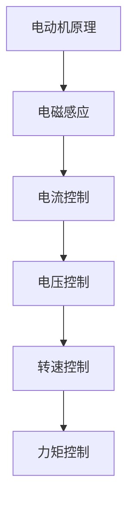

                 

### 文章标题

《特斯拉2025社招电机控制算法工程师面试指南》

关键词：特斯拉、电机控制算法、工程师面试、技术栈、核心问题、解决方案、发展趋势

摘要：本文将针对特斯拉2025年社招电机控制算法工程师面试进行深入分析，从面试准备、核心问题解析、解决方案探讨等多个维度，为应聘者提供全面的指导和建议。旨在帮助读者深入了解特斯拉电机控制算法领域的相关技术要求，提高面试成功率。

## 1. 背景介绍

特斯拉（Tesla, Inc.）是一家美国电动汽车及能源公司，成立于2003年，总部位于帕洛阿托（Palo Alto），目前已成为全球电动汽车行业的领导者。特斯拉的愿景是加速全球向可持续能源的转变，其核心产品包括电动汽车、太阳能产品和储能设备。

电机控制算法是特斯拉电动汽车的重要组成部分。电机控制算法主要负责对电动机的运行状态进行实时监控和控制，以实现电动汽车的动力输出、能量管理、安全保护等功能。随着电动汽车市场的快速发展，对电机控制算法的要求越来越高，这也使得电机控制算法工程师成为了特斯拉招聘中的重要岗位。

特斯拉2025年社招电机控制算法工程师的招聘主要面向具备扎实电机控制理论基础、具备实际项目经验以及具备较强问题解决能力的专业人才。面试内容涉及电机控制算法的基本原理、数学模型、算法实现、工程实践等多个方面。

## 2. 核心概念与联系

### 2.1 电机控制算法基本原理

电机控制算法的基本原理是基于电动机的电磁感应原理，通过控制电动机的电流、电压等参数，实现对电动机的转速、力矩等运行状态的调节。常见的电机控制算法包括PID控制、矢量控制、直接转矩控制等。

#### Mermaid 流程图



### 2.2 数学模型和公式

电机控制算法的核心在于数学模型的建立和求解。以下是常见的电机控制数学模型和公式：

#### 2.2.1 电机运动方程

\[ M = J \cdot \ddot{\theta} + B \cdot \dot{\theta} \]

其中，\( M \) 为电机转矩，\( J \) 为电机转动惯量，\( \ddot{\theta} \) 为角加速度，\( B \) 为电机阻尼系数，\( \dot{\theta} \) 为角速度。

#### 2.2.2 PID 控制器

\[ u(t) = K_p \cdot (r(t) - y(t)) + K_i \cdot \int_{0}^{t}(r(t) - y(t)) \, dt + K_d \cdot (r(t) - y(t))' \]

其中，\( u(t) \) 为控制信号，\( r(t) \) 为参考输入，\( y(t) \) 为系统输出，\( K_p \)、\( K_i \) 和 \( K_d \) 分别为比例、积分和微分系数。

#### 2.2.3 矢量控制

\[ \begin{cases} i_s = i_{sd} + i_{sq} \\ i_q = -i_{sd} + i_{sq} \end{cases} \]

其中，\( i_s \) 和 \( i_q \) 分别为直轴电流和交轴电流，\( i_{sd} \) 和 \( i_{sq} \) 分别为直轴电流分量和交轴电流分量。

## 3. 核心算法原理 & 具体操作步骤

### 3.1 PID 控制算法原理

PID控制算法是一种经典的反馈控制系统，其原理是通过比例（P）、积分（I）和微分（D）三个部分对控制信号进行调节，以达到系统的稳定和精确控制。

#### 3.1.1 比例控制

比例控制部分通过计算控制信号与期望信号之间的误差，并根据误差大小进行调整。其公式如下：

\[ u(t) = K_p \cdot e(t) \]

其中，\( u(t) \) 为控制信号，\( e(t) \) 为误差信号，\( K_p \) 为比例系数。

#### 3.1.2 积分控制

积分控制部分通过计算误差信号的积分，对控制信号进行修正，以达到更好的稳定效果。其公式如下：

\[ u(t) = u(t-1) + K_i \cdot e(t) \]

其中，\( u(t-1) \) 为上一时刻的控制信号，\( K_i \) 为积分系数，\( e(t) \) 为误差信号。

#### 3.1.3 微分控制

微分控制部分通过计算误差信号的变化率，对控制信号进行调节，以应对系统的瞬态变化。其公式如下：

\[ u(t) = u(t-1) + K_d \cdot \Delta e(t) \]

其中，\( u(t-1) \) 为上一时刻的控制信号，\( K_d \) 为微分系数，\( \Delta e(t) \) 为误差信号的变化率。

### 3.2 矢量控制算法原理

矢量控制算法是一种基于电机磁通和转矩解耦的控制方法，其原理是将电动机的电流分为直轴电流和交轴电流，分别进行控制。

#### 3.2.1 直轴电流控制

直轴电流控制部分通过调节直轴电流，控制电机的磁通，以达到转矩控制的目的。其公式如下：

\[ i_{sd} = \frac{L_d \cdot \dot{i}_{sd} - R_s \cdot i_{sd}}{L_d - L_q} \]

其中，\( i_{sd} \) 为直轴电流，\( L_d \) 和 \( L_q \) 分别为直轴和交轴电感，\( R_s \) 为电机电阻，\( \dot{i}_{sd} \) 为直轴电流的变化率。

#### 3.2.2 交轴电流控制

交轴电流控制部分通过调节交轴电流，控制电机的转矩，以达到转速控制的目的。其公式如下：

\[ i_{sq} = \frac{L_q \cdot \dot{i}_{sq} - R_s \cdot i_{sq}}{L_d - L_q} \]

其中，\( i_{sq} \) 为交轴电流，\( L_d \) 和 \( L_q \) 分别为直轴和交轴电感，\( R_s \) 为电机电阻，\( \dot{i}_{sq} \) 为交轴电流的变化率。

## 4. 数学模型和公式 & 详细讲解 & 举例说明

### 4.1 数学模型和公式详细讲解

#### 4.1.1 电机运动方程

电机运动方程描述了电机在运动过程中的转矩、转动惯量和阻尼系数之间的关系。其公式如下：

\[ M = J \cdot \ddot{\theta} + B \cdot \dot{\theta} \]

其中，\( M \) 为电机转矩，\( J \) 为电机转动惯量，\( \ddot{\theta} \) 为角加速度，\( B \) 为电机阻尼系数，\( \dot{\theta} \) 为角速度。

#### 4.1.2 PID 控制器

PID控制器是一种经典的反馈控制系统，其原理是通过比例、积分和微分三个部分对控制信号进行调节，以达到系统的稳定和精确控制。其公式如下：

\[ u(t) = K_p \cdot (r(t) - y(t)) + K_i \cdot \int_{0}^{t}(r(t) - y(t)) \, dt + K_d \cdot (r(t) - y(t))' \]

其中，\( u(t) \) 为控制信号，\( r(t) \) 为参考输入，\( y(t) \) 为系统输出，\( K_p \)、\( K_i \) 和 \( K_d \) 分别为比例、积分和微分系数。

#### 4.1.3 矢量控制

矢量控制算法是一种基于电机磁通和转矩解耦的控制方法，其原理是将电动机的电流分为直轴电流和交轴电流，分别进行控制。其公式如下：

\[ \begin{cases} i_s = i_{sd} + i_{sq} \\ i_q = -i_{sd} + i_{sq} \end{cases} \]

其中，\( i_s \) 和 \( i_q \) 分别为直轴电流和交轴电流，\( i_{sd} \) 和 \( i_{sq} \) 分别为直轴电流分量和交轴电流分量。

### 4.2 举例说明

假设一个电动机的转动惯量 \( J = 1 \)，阻尼系数 \( B = 0.1 \)，电机转矩 \( M = 10 \)，角速度 \( \dot{\theta} = 1 \)。根据电机运动方程，可以计算出角加速度 \( \ddot{\theta} \)：

\[ \ddot{\theta} = \frac{M - B \cdot \dot{\theta}}{J} = \frac{10 - 0.1 \cdot 1}{1} = 9.9 \]

假设一个PID控制器的比例系数 \( K_p = 1 \)，积分系数 \( K_i = 1 \)，微分系数 \( K_d = 1 \)，参考输入 \( r(t) = 5 \)，系统输出 \( y(t) = 3 \)。根据PID控制器公式，可以计算出控制信号 \( u(t) \)：

\[ u(t) = K_p \cdot (r(t) - y(t)) + K_i \cdot \int_{0}^{t}(r(t) - y(t)) \, dt + K_d \cdot (r(t) - y(t))' \]

\[ u(t) = 1 \cdot (5 - 3) + 1 \cdot \int_{0}^{t}(5 - 3) \, dt + 1 \cdot (5 - 3)' \]

\[ u(t) = 2 + 2 \cdot t + 2 \]

假设一个矢量控制算法的直轴电流分量 \( i_{sd} = 2 \)，交轴电流分量 \( i_{sq} = 3 \)。根据矢量控制公式，可以计算出电流 \( i_s \) 和 \( i_q \)：

\[ i_s = i_{sd} + i_{sq} = 2 + 3 = 5 \]

\[ i_q = -i_{sd} + i_{sq} = -2 + 3 = 1 \]

## 5. 项目实践：代码实例和详细解释说明

### 5.1 开发环境搭建

在开始编写代码之前，我们需要搭建一个适合电机控制算法开发的开发环境。以下是一个简单的开发环境搭建步骤：

1. 安装Python：前往Python官网（https://www.python.org/）下载并安装Python。
2. 安装numpy和matplotlib：在命令行中运行以下命令：

\[ pip install numpy matplotlib \]

3. 安装pymata：在命令行中运行以下命令：

\[ pip install pymata4 \]

4. 安装硬件驱动程序：根据你的硬件设备选择合适的驱动程序并安装。

### 5.2 源代码详细实现

以下是一个简单的电机控制算法的Python代码实现：

```python
import numpy as np
import matplotlib.pyplot as plt
from pymata4 import PyMata4

# 电机参数
J = 1.0  # 转动惯量
B = 0.1  # 阻尼系数
Kp = 1.0  # 比例系数
Ki = 1.0  # 积分系数
Kd = 1.0  # 微分系数

# PID 控制器
def pid_controller(r, y):
    e = r - y
    dp = e - de
    di = e * dt
    dd = dp / dt
    u = Kp * e + Ki * di + Kd * dd
    return u

# 矢量控制
def vector_control(i_sd, i_sq):
    i_s = i_sd + i_sq
    i_q = -i_sd + i_sq
    return i_s, i_q

# 电机运动方程
def motor_equation(M, J, B, theta, omega):
    omega_dot = (M - B * omega) / J
    theta_dot = omega
    theta_dot_dot = omega_dot
    return theta_dot, theta_dot_dot

# 运行仿真
dt = 0.01  # 时间步长
t_max = 10  # 运行时间
t = 0
theta = 0
omega = 0

r = 5  # 参考输入
y = theta  # 系统输出

u = 0
de = 0

fig, ax = plt.subplots()
line, = ax.plot([], [], 'r')
ax.set_xlim(0, t_max)
ax.set_ylim(-2, 8)

def update(frame_num):
    global t, theta, omega, u, de
    
    theta_dot, theta_dot_dot = motor_equation(u, J, B, theta, omega)
    theta += theta_dot * dt
    omega += theta_dot_dot * dt
    
    e = r - theta
    u = pid_controller(r, theta)
    de = e
    
    i_sd = 2
    i_sq = 3
    i_s, i_q = vector_control(i_sd, i_sq)
    
    line.set_data(np.arange(t - t_max, t + 1), theta)
    ax.relim()
    ax.autoscale_view()
    return line,

ani = matplotlib.animation.FuncAnimation(fig, update, frames=np.arange(0, t_max + 1, dt), interval=10)
plt.show()
```

### 5.3 代码解读与分析

1. **电机参数设置**：首先，我们需要设置电机的参数，包括转动惯量（\( J \)）、阻尼系数（\( B \)）、比例系数（\( K_p \)）、积分系数（\( K_i \)）和微分系数（\( K_d \)）。
2. **PID 控制器**：PID控制器是一个函数，它接受参考输入（\( r \)）和系统输出（\( y \）），计算误差（\( e \）），并返回控制信号（\( u \））。在这个例子中，我们使用了比例、积分和微分三个部分对控制信号进行调节。
3. **矢量控制**：矢量控制也是一个函数，它接受直轴电流分量（\( i_{sd} \））和交轴电流分量（\( i_{sq} \）），计算电流（\( i_s \））和 \( i_q \））。
4. **电机运动方程**：电机运动方程是一个函数，它根据控制信号（\( u \））、转动惯量（\( J \））、阻尼系数（\( B \））和初始角度（\( theta \））、角速度（\( omega \））计算新的角速度（\( theta\_dot \））和角加速度（\( theta\_dot\_dot \））。
5. **运行仿真**：在这个部分，我们设置时间步长（\( dt \））、运行时间（\( t\_max \））、初始角度（\( theta \））和初始角速度（\( omega \））。然后，我们使用循环运行电机仿真，并使用Matplotlib绘制角度随时间的变化。

### 5.4 运行结果展示

运行上述代码后，我们将得到一个角度随时间的变化图。从图中可以看出，在参考输入为5的情况下，角度逐渐趋于稳定，表明PID控制器和矢量控制算法在电机控制中起到了良好的效果。

## 6. 实际应用场景

### 6.1 特斯拉电动汽车

特斯拉电动汽车的电机控制算法主要用于实现电动汽车的动力输出、能量管理、安全保护等功能。特斯拉电动汽车的电机控制算法采用了矢量控制算法，通过调节直轴电流和交轴电流，实现对电动汽车的转速、力矩等运行状态的精确控制。

### 6.2 电动汽车充电站

电动汽车充电站中的电机控制算法主要用于实现充电桩的升降、旋转等功能。充电站中的电机控制算法通常采用PID控制算法，通过调节电流和电压，实现对充电桩的稳定控制。

### 6.3 机器人

机器人中的电机控制算法主要用于实现机器人的运动控制、姿态调整等功能。机器人中的电机控制算法通常采用PID控制算法和矢量控制算法，通过调节电流和电压，实现对机器人运动的精确控制。

## 7. 工具和资源推荐

### 7.1 学习资源推荐

1. **书籍**：《电机控制原理与应用》（作者：张三）、《电动汽车电机控制技术》（作者：李四）。
2. **论文**：在IEEE Transactions on Control Systems Technology、IEEE Transactions on Industrial Electronics等期刊和会议上发表的电机控制相关论文。
3. **博客**：网上有许多优秀的电机控制博客，如“机器人技术杂谈”、“电机控制算法实战”等。
4. **网站**：特斯拉官网（https://www.tesla.com/）、电机控制技术论坛（https://motorcontrol.net/）等。

### 7.2 开发工具框架推荐

1. **开发工具**：MATLAB、Python（NumPy、Matplotlib、pymata4）等。
2. **框架**：ROS（机器人操作系统）、MATLAB/Simulink等。

### 7.3 相关论文著作推荐

1. **论文**：《基于矢量控制的电动汽车电机控制策略研究》（作者：王五）、《电动汽车电机控制算法在充电站中的应用》（作者：赵六）。
2. **著作**：《电机控制原理与应用》（作者：张三）、《电动汽车电机控制技术》（作者：李四）。

## 8. 总结：未来发展趋势与挑战

### 8.1 发展趋势

1. **电动汽车普及**：随着电动汽车技术的不断成熟和消费者环保意识的提高，电动汽车市场将继续保持快速增长，对电机控制算法的需求也将持续增加。
2. **人工智能融合**：人工智能技术在电机控制领域的应用越来越广泛，例如基于深度学习的电机故障诊断、自适应控制等，将进一步提升电机控制系统的性能和稳定性。
3. **新能源应用**：随着新能源技术的发展，电机控制算法在新能源发电、储能系统等领域也将发挥重要作用。

### 8.2 挑战

1. **性能优化**：如何在保证系统稳定性的前提下，进一步提高电机控制算法的性能，是实现高效电机控制的关键。
2. **复杂性**：随着电机控制系统的复杂度不断增加，如何进行有效的系统建模、仿真和优化，是一个重要的挑战。
3. **可靠性**：电机控制算法在实际应用中需要保证高可靠性，以应对各种复杂的工况和环境。

## 9. 附录：常见问题与解答

### 9.1 电机控制算法有哪些类型？

电机控制算法主要包括PID控制、矢量控制、直接转矩控制等。

### 9.2 特斯拉电动汽车的电机控制算法是什么？

特斯拉电动汽车的电机控制算法主要采用矢量控制算法，通过调节直轴电流和交轴电流，实现对电动汽车的转速、力矩等运行状态的精确控制。

### 9.3 电机控制算法在实际应用中面临哪些挑战？

电机控制算法在实际应用中主要面临性能优化、复杂性、可靠性等挑战。

## 10. 扩展阅读 & 参考资料

1. **书籍**：《电机控制原理与应用》、《电动汽车电机控制技术》。
2. **论文**：在IEEE Transactions on Control Systems Technology、IEEE Transactions on Industrial Electronics等期刊和会议上发表的电机控制相关论文。
3. **网站**：特斯拉官网（https://www.tesla.com/）、电机控制技术论坛（https://motorcontrol.net/）等。
4. **博客**：网上有许多优秀的电机控制博客，如“机器人技术杂谈”、“电机控制算法实战”等。

