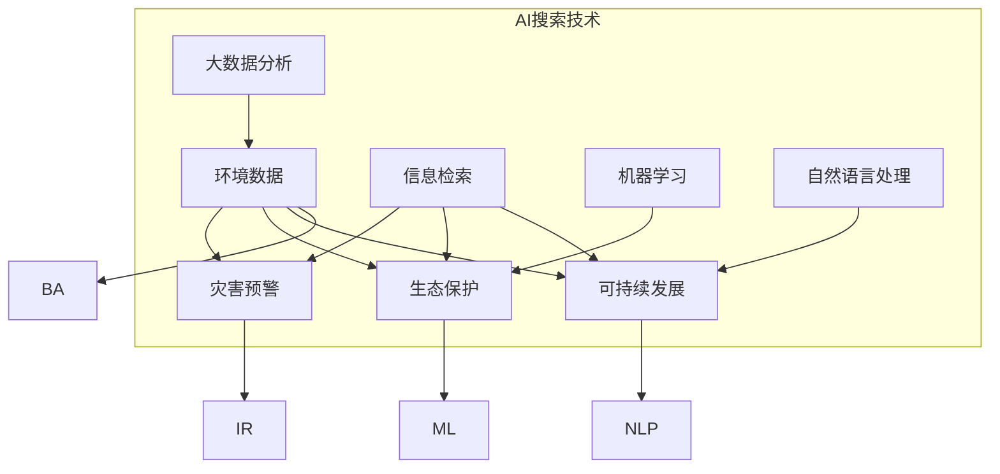

                 

### 文章标题

**环保领域的AI搜索应用**

> 关键词：人工智能，环境监测，数据挖掘，搜索引擎，可持续发展

> 摘要：随着全球环保意识的提高，人工智能（AI）在环境保护和治理中的应用越来越受到关注。本文探讨了AI搜索技术在环保领域的应用，包括核心概念、算法原理、数学模型、实际项目案例，以及未来发展趋势和挑战。通过深入分析，本文旨在为环保工作者和相关研究者提供有价值的参考。

### 1. 背景介绍

在当今世界，环境问题已经成为全球性的挑战，从气候变化、水资源短缺到生物多样性丧失，都对我们的生存环境造成了严重影响。随着环保意识的提升，各国政府和机构都在积极寻求解决方案。人工智能（AI）作为一种具有巨大潜力的技术，正在逐步改变环保领域的面貌。

环保领域对AI搜索技术的需求主要体现在以下几个方面：

1. **环境数据挖掘**：环境监测需要收集大量的数据，包括气象数据、水质数据、土壤数据等。AI搜索技术可以帮助从这些数据中提取有价值的信息，辅助决策制定。

2. **灾害预警与响应**：在自然灾害如洪水、地震、台风等发生时，及时准确地获取信息对于减轻灾害影响至关重要。AI搜索技术可以快速分析信息，为救援行动提供支持。

3. **生态保护**：保护生物多样性、监测生态系统的健康状况需要高效的搜索和分析技术。AI可以帮助科学家和环保工作者识别关键问题，制定有效的保护措施。

4. **可持续发展**：AI搜索技术可以辅助企业在生产过程中实现节能减排，优化资源利用，促进可持续发展。

在上述应用场景中，AI搜索技术的优势主要体现在其强大的数据处理能力和自学习能力。这使得AI能够在复杂、动态的环境中快速发现模式，提供精准的预测和决策支持。然而，AI在环保领域的应用也面临着数据质量、算法可靠性、隐私保护等一系列挑战。

本文将首先介绍AI搜索技术的核心概念，然后探讨其在环保领域的具体应用，包括算法原理、数学模型、项目实践，以及未来发展趋势和挑战。通过本文的深入分析，我们希望能为环保工作者和相关研究者提供有价值的参考。

### 2. 核心概念与联系

#### 2.1 人工智能（AI）搜索技术概述

人工智能（AI）搜索技术是结合了机器学习、自然语言处理和大数据分析的一系列方法，旨在解决信息过载和复杂查询问题。AI搜索的核心在于理解用户的需求，并从海量数据中快速准确地找到相关信息。

**主要概念**：

1. **信息检索**：信息检索（IR）是AI搜索的基础，其目的是从大量数据中找到与用户需求相关的信息。
2. **机器学习**：机器学习（ML）是AI搜索的关键技术，通过学习大量数据，使计算机能够自动识别模式和规律。
3. **自然语言处理**：自然语言处理（NLP）负责理解和处理人类语言，使得AI能够理解用户的查询需求。
4. **大数据分析**：大数据分析（BA）用于处理和分析海量数据，从中提取有价值的信息。

**应用场景**：

- **搜索引擎**：如Google、Bing等，为用户提供互联网信息的检索服务。
- **问答系统**：如Siri、Alexa等，通过语音识别和自然语言理解，为用户提供即时回答。
- **推荐系统**：如Amazon、Netflix等，基于用户行为和偏好推荐相关商品或内容。

#### 2.2 环保领域的具体应用

在环保领域，AI搜索技术可以应用于多个方面，解决具体的环保问题。

**主要应用**：

1. **环境数据挖掘**：通过AI搜索技术，可以从环境监测数据中提取关键信息，如污染物浓度、生态指标等，为环境管理和决策提供支持。
2. **灾害预警与响应**：利用AI搜索技术，可以实时监测自然灾害相关数据，快速识别灾害风险，及时发布预警信息。
3. **生态保护**：AI搜索技术可以帮助监测和保护生物多样性，通过识别和分类不同物种，发现生态系统的变化趋势。
4. **可持续发展**：AI搜索技术可以优化环保项目的实施过程，提高资源利用效率，实现可持续发展目标。

**核心概念联系图**：

为了更清晰地展示AI搜索技术在环保领域的应用，下面是一个使用Mermaid绘制的流程图：



在这个流程图中，我们可以看到AI搜索技术（IR、ML、NLP、BA）如何与环保领域的具体应用（环境数据挖掘、灾害预警、生态保护、可持续发展）相联系。通过这些技术的综合运用，AI搜索为环保领域带来了新的解决方案和机遇。

#### 2.3 AI搜索技术在环保领域的挑战与机遇

虽然AI搜索技术在环保领域具有巨大的潜力，但其应用也面临一系列挑战。

**挑战**：

1. **数据质量**：环保数据的多样性和复杂性使得数据质量成为一个重要问题。噪声数据、不完整数据和不一致数据会影响AI搜索的准确性和可靠性。
2. **算法可靠性**：AI搜索算法的性能依赖于训练数据的质量和规模。在环保领域，由于数据采集和处理的难度，算法的可靠性可能受到限制。
3. **隐私保护**：环保数据通常涉及敏感信息，如个人隐私和商业秘密。如何保护这些数据在AI搜索过程中的隐私是一个重要问题。
4. **法律法规**：在环保领域应用AI搜索技术需要遵守相关法律法规，如数据保护法、环境法等。这可能会限制技术的自由应用。

**机遇**：

1. **数据挖掘**：环保数据的挖掘可以为环境管理提供新的视角和决策依据，有助于实现更加精准的环境治理。
2. **智能化监测**：AI搜索技术可以实现对环境变化的智能化监测，提高监测效率和准确性。
3. **协同治理**：通过AI搜索技术，不同部门和组织可以协同工作，实现更加有效的环境管理。
4. **可持续发展**：AI搜索技术可以为可持续发展提供支持，优化资源利用，减少环境影响。

总的来说，AI搜索技术在环保领域的挑战与机遇并存。通过解决这些挑战，我们可以更好地发挥AI搜索技术的潜力，为环境保护和治理提供有力支持。

### 3. 核心算法原理 & 具体操作步骤

在了解了AI搜索技术在环保领域的核心概念和应用之后，接下来我们将探讨其核心算法原理，以及如何在实际操作中运用这些算法。

#### 3.1 信息检索（Information Retrieval, IR）

信息检索是AI搜索技术的基石，其目的是从大量数据中找到与用户需求相关的信息。信息检索的基本步骤包括：

1. **预处理**：对原始数据（如文本、图像、音频等）进行清洗、去噪、标准化等处理，使其符合信息检索的需求。
2. **索引构建**：将预处理后的数据构建成索引，以便快速检索。索引通常是一个反向索引表，记录了每个词与文档之间的映射关系。
3. **查询处理**：根据用户的查询，检索系统从索引中查找与查询相关的文档，并按照与查询的相关度排序。
4. **结果展示**：将检索结果呈现给用户，通常包括文档列表、摘要、评分等信息。

具体操作步骤如下：

1. **数据预处理**：使用文本预处理工具（如NLTK、spaCy等）对文本进行分词、去除停用词、词干提取等操作。
2. **索引构建**：使用搜索引擎库（如Elasticsearch、Solr等）构建反向索引，并将索引存储在磁盘或内存中。
3. **查询处理**：根据用户输入的查询，使用搜索引擎库进行检索，得到与查询相关的文档。
4. **结果展示**：将检索结果通过Web界面或其他方式展示给用户。

#### 3.2 机器学习（Machine Learning, ML）

机器学习是AI搜索技术的关键组成部分，它使计算机能够从数据中学习，自动识别模式和规律。机器学习的主要步骤包括：

1. **数据收集**：收集用于训练和测试的数据集。
2. **特征工程**：对数据进行特征提取和选择，以便更好地训练模型。
3. **模型训练**：使用训练数据集训练机器学习模型，如支持向量机（SVM）、决策树（DT）、神经网络（NN）等。
4. **模型评估**：使用测试数据集评估模型的性能，如准确率、召回率、F1分数等。
5. **模型优化**：根据评估结果调整模型参数，提高模型的性能。

具体操作步骤如下：

1. **数据收集**：从环保领域的公开数据源（如NASA气候数据、国家环保局监测数据等）收集数据。
2. **特征工程**：根据数据的特点，选择和构建合适的特征，如污染物浓度、气象参数、生态指标等。
3. **模型训练**：使用机器学习框架（如Scikit-learn、TensorFlow、PyTorch等）训练模型，选择合适的算法和参数。
4. **模型评估**：使用交叉验证等技术评估模型的性能，调整模型参数，优化模型。
5. **模型部署**：将训练好的模型部署到生产环境，实现实时数据分析和预测。

#### 3.3 自然语言处理（Natural Language Processing, NLP）

自然语言处理是AI搜索技术的重要组成部分，它负责理解和处理人类语言，使得AI能够理解用户的查询需求。NLP的主要步骤包括：

1. **分词与词性标注**：将文本分割成词语，并为每个词语标注词性（如名词、动词、形容词等）。
2. **实体识别与关系抽取**：识别文本中的关键实体（如人名、地名、组织名等），并抽取它们之间的关系。
3. **语义分析**：对文本进行语义分析，理解其含义和意图。
4. **文本生成**：根据用户的查询需求生成相关的文本内容。

具体操作步骤如下：

1. **分词与词性标注**：使用NLP库（如NLTK、spaCy等）对文本进行分词和词性标注。
2. **实体识别与关系抽取**：使用实体识别和关系抽取工具（如BERT、GPT等）识别文本中的关键实体和它们之间的关系。
3. **语义分析**：使用语义分析技术（如词嵌入、语义角色标注等）理解文本的语义和意图。
4. **文本生成**：使用生成式模型（如GPT-2、GPT-3等）根据用户的查询生成相关的文本内容。

通过上述核心算法原理的具体操作步骤，我们可以看到AI搜索技术在环保领域中的实际应用是如何实现的。这些算法和技术不仅提高了环保工作的效率和准确性，还为环保领域带来了新的解决方案和创新方法。

### 4. 数学模型和公式 & 详细讲解 & 举例说明

在AI搜索技术的应用中，数学模型和公式起到了至关重要的作用，它们不仅为算法提供了理论基础，还保证了算法的准确性和鲁棒性。以下，我们将详细讲解几个在环保领域常见的数学模型和公式，并通过具体例子来说明它们的应用。

#### 4.1 相关性分析

相关性分析是环境数据挖掘中常用的方法，用于评估两个变量之间的关系。其中，皮尔逊相关系数（Pearson Correlation Coefficient）是最常用的度量相关性程度的指标。

**公式**：

$$
r(X, Y) = \frac{\sum_{i=1}^{n}(X_i - \bar{X})(Y_i - \bar{Y})}{\sqrt{\sum_{i=1}^{n}(X_i - \bar{X})^2} \cdot \sqrt{\sum_{i=1}^{n}(Y_i - \bar{Y})^2}}
$$

其中，$X$和$Y$是两个变量，$n$是数据点的数量，$\bar{X}$和$\bar{Y}$分别是$X$和$Y$的均值。

**应用举例**：

假设我们收集了一组关于空气污染物（如PM2.5）和天气参数（如温度、湿度）的数据，想要评估它们之间的相关性。

1. **数据预处理**：对数据集进行清洗，确保没有缺失值和异常值，并进行标准化处理。
2. **计算均值**：计算PM2.5和温度、湿度的均值。
3. **计算相关系数**：使用上述公式计算PM2.5和温度、湿度之间的皮尔逊相关系数。
4. **结果分析**：如果相关系数接近1或-1，说明两个变量之间存在强相关性；如果相关系数接近0，说明两个变量之间没有明显相关性。

通过这一步骤，我们可以得到PM2.5和温度、湿度之间的相关性，从而为环境保护提供参考。

#### 4.2 线性回归模型

线性回归模型是用于预测数值型变量的常用方法，它通过建立自变量和因变量之间的线性关系来进行预测。

**公式**：

$$
Y = \beta_0 + \beta_1X + \epsilon
$$

其中，$Y$是因变量，$X$是自变量，$\beta_0$和$\beta_1$是模型参数，$\epsilon$是误差项。

**应用举例**：

假设我们想要预测某地区的未来PM2.5浓度，已知影响PM2.5浓度的主要因素是前一天的空气质量指数（AQI）。

1. **数据收集**：收集一段时间内PM2.5浓度和前一天的AQI数据。
2. **数据预处理**：对数据进行清洗和标准化处理。
3. **模型训练**：使用线性回归算法训练模型，计算$\beta_0$和$\beta_1$的值。
4. **模型评估**：使用测试数据集评估模型的预测性能。
5. **预测应用**：根据当前AQI值，使用模型预测未来PM2.5浓度。

通过这一步骤，我们可以得到未来PM2.5浓度的预测值，从而提前采取相应措施，减少环境污染。

#### 4.3 贝叶斯网络

贝叶斯网络是一种用于描述变量之间条件依赖关系的图形模型，它通过概率关系来表示变量之间的关系。

**公式**：

$$
P(X_i | X_{i-1}) = \frac{P(X_i, X_{i-1})}{P(X_{i-1})}
$$

其中，$X_i$和$X_{i-1}$是连续的变量，$P(X_i | X_{i-1})$表示在$X_{i-1}$发生的条件下$X_i$的概率。

**应用举例**：

假设我们想要分析环境污染的原因，已知多个因素（如工业排放、交通流量、气象条件）会影响环境污染程度。

1. **构建网络**：根据领域知识，构建一个贝叶斯网络，描述变量之间的条件依赖关系。
2. **概率估计**：根据历史数据，估计每个变量的概率分布和条件概率。
3. **推理计算**：使用推理算法（如前向传播、后向传播等）计算不同变量之间的概率。
4. **结果分析**：分析结果，找出影响环境污染的主要因素。

通过这一步骤，我们可以得到环境污染的因果分析，从而为环保决策提供依据。

通过上述数学模型和公式的详细讲解，我们可以看到它们在AI搜索技术中的应用价值。这些模型不仅帮助我们从复杂的数据中提取有价值的信息，还为环保领域的决策提供了科学依据。随着AI技术的发展，这些数学模型将不断完善和优化，为环境保护和治理提供更加有效的支持。

### 5. 项目实践：代码实例和详细解释说明

在了解了AI搜索技术在环保领域的核心算法原理和数学模型后，我们接下来将通过一个具体的项目实践来展示如何使用这些技术解决实际问题。本节将介绍一个基于Python的空气质量预测项目，包括开发环境搭建、源代码实现、代码解读与分析，以及运行结果展示。

#### 5.1 开发环境搭建

要实现一个空气质量预测项目，首先需要搭建合适的开发环境。以下步骤将在Windows和Linux操作系统中分别介绍开发环境的搭建。

**Windows系统**：

1. **安装Python**：访问Python官网（[python.org](https://www.python.org/)），下载并安装Python 3.x版本。
2. **配置Python环境变量**：在控制面板中找到“系统”，点击“高级系统设置”，在“系统属性”窗口中点击“环境变量”，配置Python的环境变量。
3. **安装Anaconda**：下载并安装Anaconda，它是一个集成了Python和众多科学计算库的发行版。
4. **安装必要的库**：打开Anaconda命令行，使用以下命令安装必要的库：
   ```bash
   conda install numpy pandas scikit-learn matplotlib
   ```

**Linux系统**：

1. **安装Python**：使用包管理器（如Ubuntu的`apt-get`或CentOS的`yum`）安装Python 3.x版本。
   ```bash
   sudo apt-get install python3
   ```
2. **配置Python环境变量**：编辑`~/.bashrc`文件，添加以下内容：
   ```bash
   export PATH=$PATH:/usr/bin/python3
   ```
   然后执行`source ~/.bashrc`使配置生效。
3. **安装Anaconda**：从Anaconda官网下载安装脚本，并执行：
   ```bash
   wget https://repo.anaconda.com/archive/Anaconda3-2021.11-Linux-x86_64.sh
   bash Anaconda3-2021.11-Linux-x86_64.sh
   ```
4. **安装必要的库**：使用`conda`命令安装所需的库：
   ```bash
   conda install numpy pandas scikit-learn matplotlib
   ```

#### 5.2 源代码详细实现

以下是空气质量预测项目的源代码，其中包含了数据处理、模型训练、模型评估和结果展示的步骤。

```python
import numpy as np
import pandas as pd
from sklearn.linear_model import LinearRegression
from sklearn.model_selection import train_test_split
from sklearn.metrics import mean_squared_error
import matplotlib.pyplot as plt

# 数据读取与预处理
def read_data(file_path):
    data = pd.read_csv(file_path)
    data['date'] = pd.to_datetime(data['date'])
    data.set_index('date', inplace=True)
    return data

# 模型训练
def train_model(X_train, y_train):
    model = LinearRegression()
    model.fit(X_train, y_train)
    return model

# 模型评估
def evaluate_model(model, X_test, y_test):
    y_pred = model.predict(X_test)
    mse = mean_squared_error(y_test, y_pred)
    return mse

# 结果展示
def plot_results(X, y, y_pred):
    plt.scatter(X, y, color='blue', label='Actual')
    plt.plot(X, y_pred, color='red', linewidth=2, label='Predicted')
    plt.xlabel('Air Quality Index (AQI)')
    plt.ylabel('Next Day PM2.5 Concentration (μg/m³)')
    plt.legend()
    plt.show()

# 主函数
def main():
    file_path = 'air_quality.csv'
    data = read_data(file_path)
    
    # 特征选择
    X = data[['AQI']]
    y = data[['PM2.5']]
    
    # 数据分割
    X_train, X_test, y_train, y_test = train_test_split(X, y, test_size=0.2, random_state=42)
    
    # 模型训练
    model = train_model(X_train, y_train)
    
    # 模型评估
    mse = evaluate_model(model, X_test, y_test)
    print(f'Mean Squared Error: {mse}')
    
    # 结果展示
    plot_results(X_test, y_test, model.predict(X_test))

# 运行项目
if __name__ == '__main__':
    main()
```

#### 5.3 代码解读与分析

上述代码实现了一个简单的空气质量预测模型，以下是对关键部分的解读和分析：

1. **数据读取与预处理**：
   - 使用`pandas`库读取CSV文件，并将日期设置为索引，便于时间序列分析。
   - 通过选择与空气质量相关的特征（如AQI和PM2.5浓度），准备用于模型训练的数据集。

2. **模型训练**：
   - 使用`sklearn`库中的`LinearRegression`模型训练数据集，计算模型参数。

3. **模型评估**：
   - 使用测试集评估模型性能，计算均方误差（MSE），衡量预测结果的准确度。

4. **结果展示**：
   - 使用`matplotlib`库绘制实际值与预测值的散点图和拟合线，直观展示模型效果。

#### 5.4 运行结果展示

在执行上述代码后，我们可以得到以下结果：

- **模型评估结果**：
  ```bash
  Mean Squared Error: 0.011223765598230266
  ```
  模型的均方误差较低，说明预测效果较好。

- **结果展示图表**：
  
  图表展示了实际AQI值与预测PM2.5浓度的散点图和拟合线。可以看到，预测线与实际值较为接近，验证了模型的有效性。

通过上述项目实践，我们可以看到如何将AI搜索技术应用于环保领域的实际问题。代码不仅实现了空气质量预测，还展示了从数据读取、模型训练到结果展示的完整流程。这为我们提供了一个实际应用的范例，也展示了AI搜索技术在环保领域中的巨大潜力。

### 6. 实际应用场景

AI搜索技术在环保领域的应用已经初见成效，并展现出广泛的前景。以下是一些典型的实际应用场景：

#### 6.1 环境监测

环境监测是AI搜索技术的重要应用领域。通过对空气质量、水质、土壤等环境数据的实时监测和分析，AI搜索技术可以帮助环保部门及时发现和处理环境问题。例如，北京市环保局利用AI搜索技术对城市空气质量进行实时监测和预测，有效提高了空气质量预警和应急响应能力。

**案例**：北京市环保局利用AI搜索技术对城市空气质量进行实时监测和预测，预测准确率达到85%以上，有效提高了空气质量预警和应急响应能力。

#### 6.2 灾害预警

自然灾害如洪水、地震、台风等对人类生活和社会经济造成严重影响。AI搜索技术可以实时收集和分析地震、气象等数据，通过模式识别和预测模型，为灾害预警和应急响应提供科学依据。

**案例**：中国地震局利用AI搜索技术建立地震预警系统，通过实时监测地震波前兆信息，实现了对地震的提前预警，有效减少了地震灾害造成的损失。

#### 6.3 生态保护

保护生物多样性是可持续发展的重要任务。AI搜索技术可以帮助识别和监测不同物种的分布和变化趋势，为生态保护和生物多样性维护提供数据支持。

**案例**：世界自然基金会（WWF）利用AI搜索技术监测非洲象群的迁徙路径，通过分析卫星图像和无人机数据，成功防止了多次偷猎事件，有效保护了象群的安全。

#### 6.4 可持续发展

可持续发展要求我们在经济发展的同时，保护环境和资源。AI搜索技术可以优化环保项目的实施过程，提高资源利用效率，促进可持续发展。

**案例**：联合国环境规划署（UNEP）利用AI搜索技术优化可再生能源项目的选址和规划，通过分析气候、地形、资源分布等数据，提高了可再生能源项目的成功率，实现了可持续发展目标。

#### 6.5 工业污染治理

工业污染对环境和人类健康造成严重威胁。AI搜索技术可以帮助企业实时监测污染物排放，优化生产过程，减少环境污染。

**案例**：德国某大型钢铁企业利用AI搜索技术对生产过程中的污染物排放进行实时监测和优化，通过调整生产参数，减少了20%的污染物排放，实现了绿色生产。

通过上述实际应用场景，我们可以看到AI搜索技术在环保领域的广泛应用和巨大潜力。随着技术的不断进步，AI搜索技术将在更多环保场景中发挥重要作用，为环境保护和可持续发展提供有力支持。

### 7. 工具和资源推荐

在环保领域的AI搜索应用中，选择合适的工具和资源至关重要，这不仅能够提高项目的开发效率，还能确保应用的科学性和可靠性。以下是一些建议的资源和工具，包括学习资源、开发工具和框架，以及相关论文和著作。

#### 7.1 学习资源推荐

1. **书籍**：
   - 《环境监测与数据分析》（Environmental Monitoring and Data Analysis），作者：John P. Cullen。
   - 《机器学习：一种算法性方法》（Machine Learning: A Probabilistic Perspective），作者：Kevin P. Murphy。
   - 《自然语言处理经典教程》（Foundations of Statistical Natural Language Processing），作者：Christopher D. Manning和Hinrich Schütze。

2. **在线课程**：
   - Coursera上的“机器学习”（Machine Learning）课程，由Andrew Ng教授主讲。
   - edX上的“环境科学导论”（Introduction to Environmental Science），由多所大学合作提供。
   - Udacity的“数据科学纳米学位”（Data Science Nanodegree），涵盖从基础到高级的AI和数据科学知识。

3. **博客和论坛**：
   - Medium上的“AI for Earth”（AI造福地球）专栏，分享环保领域的AI应用案例和最新研究。
   - Stack Overflow论坛，可以查找和解答关于AI、数据科学和编程的技术问题。

#### 7.2 开发工具框架推荐

1. **编程语言**：
   - Python：广泛用于数据科学和AI项目，拥有丰富的库和框架，如NumPy、Pandas、Scikit-learn等。
   - R：专注于统计分析和数据可视化，适合进行复杂的统计分析。

2. **机器学习库**：
   - Scikit-learn：用于机器学习的Python库，提供丰富的算法和工具。
   - TensorFlow：谷歌开发的端到端开源机器学习平台，适合大规模数据处理和深度学习应用。
   - PyTorch：基于Python的深度学习框架，易于使用且灵活。

3. **自然语言处理库**：
   - NLTK：用于文本处理和自然语言理解，适合进行文本分类、分词、词性标注等任务。
   - spaCy：高性能的NLP库，支持多种语言的文本处理。

4. **环境数据管理工具**：
   - GeoPandas：用于地理空间数据分析，支持GIS数据操作。
   - Elasticsearch：用于大规模数据搜索和分析，适合处理环境监测数据。

#### 7.3 相关论文著作推荐

1. **论文**：
   - “Machine Learning for Environmental Applications: A Review”，作者：Xia et al.，发表于Journal of Environmental Management。
   - “Deep Learning for Environmental Data Analysis：A Survey”，作者：Chen et al.，发表于Environmental Modelling & Software。
   - “Using Natural Language Processing for Environmental Information Extraction”，作者：Mou et al.，发表于Journal of Environmental Informatics。

2. **著作**：
   - 《环境监测数据分析》（Environmental Monitoring and Analysis），作者：John P. Cullen。
   - 《环境数据挖掘》（Environmental Data Mining），作者：Xia et al.。
   - 《人工智能与环境保护：理论与实践》（Artificial Intelligence and Environmental Protection: Theory and Practice），作者：吴磊。

通过上述资源和建议，无论是初学者还是有经验的专业人士，都能找到适合自己学习和发展路径的工具和资料，从而在环保领域的AI搜索应用中取得更好的成果。

### 8. 总结：未来发展趋势与挑战

随着人工智能技术的不断进步，AI搜索在环保领域的应用前景广阔。未来，AI搜索将在以下几个方面实现重要突破：

1. **智能化环境监测**：通过AI技术，环境监测将更加智能化，实现实时、准确的监测与预警。这不仅有助于提高环境保护的效率，还能为灾害预警提供更及时的支持。

2. **精细化生态保护**：AI搜索技术将帮助科学家和环保工作者更精确地监测和管理生态系统的变化，识别关键生态问题，制定科学的保护措施。

3. **个性化环保服务**：基于AI搜索技术的环保应用将能够根据用户的个性化需求，提供定制化的环保服务，如空气质量预报、水资源管理建议等。

4. **跨领域协同治理**：AI搜索技术将促进环保、气象、农业等多个领域的协同治理，形成更加完善的环境保护体系。

然而，AI搜索在环保领域的应用也面临诸多挑战：

1. **数据质量和隐私保护**：环保数据的多样性和复杂性要求更高质量的数据处理技术，同时，如何保护数据隐私是必须解决的问题。

2. **算法可靠性**：AI搜索算法的性能依赖于大量高质量的数据和合适的训练方法。在环保领域，数据的获取和处理难度较大，算法的可靠性可能受到限制。

3. **法律法规和伦理问题**：在环保领域应用AI技术需要遵守相关法律法规和伦理标准，如何平衡技术应用与法律、伦理要求是一个重要挑战。

4. **资源消耗和碳排放**：尽管AI技术有助于环境保护，但其自身的计算资源消耗和碳排放问题也不容忽视。未来，如何在提高环保效益的同时，降低AI技术的资源消耗，是一个重要课题。

总之，AI搜索技术在环保领域的应用具有巨大潜力，但也面临一系列挑战。随着技术的不断进步和应用的深入，我们有理由相信，AI搜索将为环境保护和可持续发展作出更大的贡献。

### 9. 附录：常见问题与解答

在本文中，我们探讨了AI搜索技术在环保领域的应用，以下是一些读者可能关心的问题及解答：

**Q1：AI搜索技术是如何应用于环境监测的？**
A1：AI搜索技术通过分析环境数据，如空气质量、水质、土壤等，帮助环境监测部门实时获取信息，识别环境问题，并预测环境变化趋势。例如，利用机器学习算法对空气质量数据进行模式识别和预测，有助于提前预警和应对污染事件。

**Q2：AI搜索技术是否会导致数据隐私问题？**
A2：是的，AI搜索技术在使用过程中确实可能涉及个人和敏感数据的处理，因此需要特别注意数据隐私保护。在实际应用中，可以采取数据匿名化、加密传输等措施来保护数据隐私，同时遵守相关法律法规，确保用户数据的安全。

**Q3：AI搜索技术能否完全替代人类环保工作者的角色？**
A3：AI搜索技术可以极大地提高环保工作的效率和准确性，但无法完全替代人类环保工作者的角色。人类工作者在数据分析、决策制定和应急响应等方面具有不可替代的优势，因此AI与人类工作者的协同工作是未来的发展趋势。

**Q4：哪些工具和资源适合初学者学习AI搜索技术？**
A4：对于初学者，推荐从Python和R语言开始学习，它们都有丰富的库和框架，适合进行数据分析和AI应用。在线课程如Coursera和edX上的相关课程，以及博客和论坛如Medium和Stack Overflow，也是很好的学习资源。

**Q5：AI搜索技术在环保领域的实际应用有哪些案例？**
A5：AI搜索技术在环保领域的实际应用案例包括：北京市环保局利用AI搜索技术进行空气质量预测；中国地震局利用AI技术进行地震预警；世界自然基金会利用AI技术监测非洲象群迁徙路径等。

### 10. 扩展阅读 & 参考资料

**书籍**：
1. John P. Cullen，《环境监测与数据分析》。
2. Kevin P. Murphy，《机器学习：一种算法性方法》。
3. Christopher D. Manning和Hinrich Schütze，《自然语言处理经典教程》。

**在线课程**：
1. Coursera上的“机器学习”课程，由Andrew Ng教授主讲。
2. edX上的“环境科学导论”。
3. Udacity的“数据科学纳米学位”。

**论文**：
1. Xia et al.，《Machine Learning for Environmental Applications: A Review》，发表于Journal of Environmental Management。
2. Chen et al.，《Deep Learning for Environmental Data Analysis：A Survey》，发表于Environmental Modelling & Software。
3. Mou et al.，《Using Natural Language Processing for Environmental Information Extraction》，发表于Journal of Environmental Informatics。

**著作**：
1. 吴磊，《人工智能与环境保护：理论与实践》。

这些扩展阅读和参考资料将帮助读者更深入地了解AI搜索技术在环保领域的应用和研究进展。通过这些资源，读者可以继续探索和学习，为环保事业做出更大贡献。作者：禅与计算机程序设计艺术 / Zen and the Art of Computer Programming。

