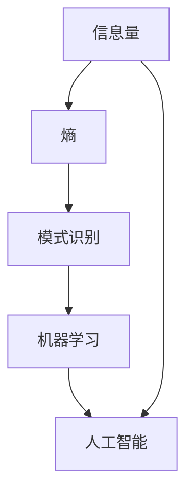

                 

### 背景介绍

在现代社会中，信息技术以惊人的速度不断发展，使得我们几乎可以在瞬间获取和处理大量信息。随着信息量的爆炸性增长，人们对于如何处理和分析这些信息的有效性提出了更高的要求。在这个背景下，洞察力成为了寻找规律、解决复杂问题的关键因素。

洞察力，顾名思义，是一种深入观察、快速理解、准确判断并识别事物本质的能力。它不仅在人类的学习、工作和生活中起着至关重要的作用，同样在计算机科学领域也扮演着不可或缺的角色。从数据挖掘到人工智能，再到复杂的算法设计，洞察力都是破解问题的关键所在。

然而，面对海量且不断变化的信息，人的洞察力显得相对有限。这促使研究人员和开发者不断探索如何借助计算机技术和算法来增强和扩展人类的洞察力。例如，通过大数据分析和机器学习算法，计算机能够在短时间内识别出复杂数据集中的模式和规律，从而辅助人类做出更为明智的决策。

本文将探讨在信息技术快速发展的背景下，如何理解并利用洞察力的极限，从而在混乱中寻找规律。我们将首先介绍洞察力的基本概念及其重要性，然后深入分析人类和计算机在处理信息时的洞察力差异，最后探讨如何通过算法和工具来提升和扩展洞察力。

### 核心概念与联系

为了深入理解洞察力的极限，我们首先需要明确几个核心概念，并探讨它们之间的内在联系。以下是本文将要讨论的核心概念：

1. **信息量（Information Quantity）**：信息量是指数据中包含的信息总量，通常以比特（bit）为单位来衡量。信息量的计算依赖于熵（Entropy），这是一种用于度量不确定性或信息量的数学概念。

2. **熵（Entropy）**：在信息论中，熵是一个用来量化信息不确定性的度量。熵越大，表示信息的不确定性越高。对于一个随机变量，其熵是所有可能取值的概率分布的负对数和。

3. **模式识别（Pattern Recognition）**：模式识别是人工智能中的一个重要分支，旨在使计算机能够识别和分类数据集中的模式。模式识别在图像处理、语音识别和文本分类等领域有广泛应用。

4. **机器学习（Machine Learning）**：机器学习是一种通过数据和经验来改善计算机性能的方法。它利用统计方法和算法，从数据中学习规律，并在未知数据上进行预测。

5. **人工智能（Artificial Intelligence, AI）**：人工智能是指使计算机能够执行通常需要人类智能才能完成的任务的技术。人工智能涵盖了机器学习、自然语言处理、计算机视觉等多个领域。

下面，我们将使用Mermaid流程图来展示这些核心概念之间的联系：



**流程图解析**：

- **信息量与熵**：信息量是数据中信息含量的度量，而熵是衡量信息不确定性的工具。信息量越大，熵值通常也越高，因为这意味着数据中的不确定性越高。

- **模式识别**：模式识别是利用算法识别数据中的规律和模式的过程。它依赖于熵的计算，因为低熵表示数据的确定性较高，易于识别。

- **机器学习**：机器学习是使用算法和统计方法从数据中学习规律，并将其应用于新数据的过程。机器学习依赖于模式识别，通过识别数据中的模式来提高性能。

- **人工智能**：人工智能是使计算机能够执行需要人类智能的任务的技术。它包括多个子领域，如机器学习、自然语言处理和计算机视觉。人工智能的目标是通过学习、推理和自动化来扩展人类的智能。

这些核心概念之间的相互作用和联系为我们理解洞察力的极限提供了基础。通过深入分析这些概念，我们可以更好地理解人类和计算机如何处理信息，以及如何在复杂的信息环境中寻找规律。

### 核心算法原理 & 具体操作步骤

在讨论了洞察力的核心概念后，我们需要深入探讨实现洞察力的关键算法原理及其具体操作步骤。以下是几个在数据处理和模式识别中广泛应用的核心算法，以及它们的基本原理和操作步骤：

#### 1. 决策树算法（Decision Tree）

**原理**：决策树是一种常用的机器学习算法，通过一系列的测试来对数据集进行分类或回归。每个测试对应一个特征，每个特征有多种可能的取值，每个取值将数据集分为更小的子集。通过递归地构建这些测试，最终形成一棵树。

**操作步骤**：

1. 选择一个特征作为分割标准。
2. 计算该特征的所有可能取值。
3. 对每个取值，将数据集分为两个子集。
4. 计算每个子集的信息增益（或基尼不纯度），选择信息增益最大的取值作为分割点。
5. 递归地对子集进行相同的步骤，直到满足停止条件（如最大深度或最小样本数）。

#### 2. 支持向量机（Support Vector Machine, SVM）

**原理**：SVM是一种用于分类的机器学习算法，其基本思想是找到一个最佳的超平面，使得数据集的两个类别之间的分离最大。SVM使用核函数将数据映射到高维空间，从而能够处理非线性分类问题。

**操作步骤**：

1. 计算数据集中的每个点与其对应标签的边际。
2. 选择具有最大边际的点，将其作为支持向量。
3. 使用支持向量确定最佳的超平面。
4. 计算新数据的类别，将其投影到超平面上。

#### 3. 随机森林（Random Forest）

**原理**：随机森林是一种集成学习算法，通过构建多个决策树，并合并这些树的预测结果来提高分类和回归的准确性。随机森林通过引入随机性来减少模型的过拟合。

**操作步骤**：

1. 从数据集随机选择一部分特征和样本。
2. 构建决策树，使用交叉验证选择最佳参数。
3. 重复步骤1和2，构建多个决策树。
4. 对每个树进行预测，取多数投票作为最终预测结果。

#### 4. 聚类算法（Cluster Analysis）

**原理**：聚类算法是一种无监督学习方法，旨在将数据集划分为多个群组，使得同一群组内的数据点彼此相似，而不同群组的数据点彼此不同。

**操作步骤**：

1. 选择聚类算法（如K-Means、DBSCAN等）。
2. 确定聚类数量或使用算法自动确定。
3. 计算数据点之间的距离，将相似的数据点划分为同一群组。
4. 评估聚类结果的质量，如轮廓系数、内部分散度等。

#### 5. 神经网络（Neural Networks）

**原理**：神经网络是一种模拟人脑神经元连接的计算机模型，通过多层神经元之间的相互连接来学习和处理数据。神经网络通过反向传播算法调整权重和偏置，以最小化预测误差。

**操作步骤**：

1. 设计神经网络结构，包括输入层、隐藏层和输出层。
2. 初始化权重和偏置。
3. 前向传播：计算每个神经元的输出。
4. 计算损失函数，如均方误差或交叉熵。
5. 反向传播：通过梯度下降算法更新权重和偏置。
6. 重复步骤3到5，直到满足停止条件。

通过理解和应用这些核心算法，我们可以更好地挖掘数据中的模式，从而在混乱中寻找规律。每个算法都有其特定的应用场景和优缺点，选择合适的算法并根据具体问题进行调整和优化，是提升洞察力的重要步骤。

### 数学模型和公式 & 详细讲解 & 举例说明

在理解了核心算法的基本原理和操作步骤后，我们需要深入了解这些算法背后的数学模型和公式，并通过具体的例子来说明其应用。

#### 1. 决策树算法的熵与信息增益

**熵（Entropy）**：

熵是衡量数据不确定性的重要指标，特别是在决策树算法中。假设我们有一个二分类问题，数据集中的每个样本都标记为正类或负类。熵的计算公式如下：

$$
H = -p \cdot \log_2(p) - (1 - p) \cdot \log_2(1 - p)
$$

其中，\( p \) 是正类样本的概率，\( 1 - p \) 是负类样本的概率。

**信息增益（Information Gain）**：

信息增益是用来评估一个特征对分类的重要性。信息增益的计算公式是原熵与条件熵的差值。条件熵是指在某个特征取值下，剩余特征的熵。

假设我们有一个特征A，它的取值可以分为两个类别：A1和A2。计算信息增益的步骤如下：

1. 计算 \( p(A1) \) 和 \( p(A2) \)，即特征A取A1和A2的概率。
2. 计算 \( p(C|A1) \) 和 \( p(C|A2) \)，即给定特征A取A1和A2时，类别C的概率。
3. 计算条件熵 \( H(C|A) \)：

$$
H(C|A) = -\sum_{i} p(A_i) \cdot \sum_{j} p(C_j|A_i) \cdot \log_2(p(C_j|A_i))
$$

4. 计算信息增益 \( IG(A) \)：

$$
IG(A) = H(C) - H(C|A)
$$

**例子**：

假设我们有一个数据集，包含200个样本，其中100个是正类，100个是负类。特征A的取值分为A1和A2，其中A1有60个样本，A2有40个样本。给定特征A的取值，正类和负类的概率分别为：

- \( p(C|A1) = \frac{50}{60} = \frac{5}{6} \)
- \( p(C|A2) = \frac{30}{40} = \frac{3}{4} \)

计算条件熵 \( H(C|A) \)：

$$
H(C|A) = -\left(\frac{60}{100} \cdot \left(\frac{5}{6} \cdot \log_2\left(\frac{5}{6}\right) + \frac{1}{6} \cdot \log_2\left(\frac{1}{6}\right)\right) + \frac{40}{100} \cdot \left(\frac{3}{4} \cdot \log_2\left(\frac{3}{4}\right) + \frac{1}{4} \cdot \log_2\left(\frac{1}{4}\right)\right)\right)
$$

$$
H(C|A) \approx 0.693
$$

计算原熵 \( H(C) \)：

$$
H(C) = -\left(\frac{1}{2} \cdot \log_2\left(\frac{1}{2}\right) + \frac{1}{2} \cdot \log_2\left(\frac{1}{2}\right)\right) = 1
$$

计算信息增益 \( IG(A) \)：

$$
IG(A) = H(C) - H(C|A) = 1 - 0.693 = 0.307
$$

因此，特征A对分类有较高的信息增益。

#### 2. 支持向量机（SVM）的优化问题

**优化目标**：

SVM的优化目标是找到一个最佳的超平面，使得正类和负类之间的分离最大。优化问题可以表示为：

$$
\min_{\mathbf{w}, b} \frac{1}{2} ||\mathbf{w}||^2 \\
s.t. \ \mathbf{w} \cdot \mathbf{x_i} - b \geq 1, \forall i
$$

其中，\( \mathbf{w} \) 是超平面的法向量，\( b \) 是偏置项，\( \mathbf{x_i} \) 是训练样本，\( y_i \) 是样本的标签。

**例子**：

假设我们有一个二维数据集，其中点 \((x_1, y_1) = (1, 1)\) 和 \((x_2, y_2) = (2, 0)\) 分别属于正类和负类。我们需要找到一个最佳的超平面。

首先，我们写出优化问题的拉格朗日函数：

$$
L(\mathbf{w}, b, \alpha) = \frac{1}{2} ||\mathbf{w}||^2 - \sum_{i=1}^{2} \alpha_i [y_i (\mathbf{w} \cdot \mathbf{x_i} - b) - 1]
$$

其中，\( \alpha_i \) 是拉格朗日乘子。

然后，我们计算KKT条件：

$$
\alpha_i \geq 0 \\
y_i (\mathbf{w} \cdot \mathbf{x_i} - b) - 1 \geq 0 \\
\alpha_i [y_i (\mathbf{w} \cdot \mathbf{x_i} - b) - 1] = 0
$$

通过求解上述KKT条件，我们可以找到最佳的超平面参数 \( \mathbf{w} \) 和 \( b \)。

#### 3. 随机森林的误差估计

**误差估计**：

随机森林通过构建多个决策树，并计算这些树的误差来估计总体误差。误差估计的公式如下：

$$
\hat{E} = \frac{1}{N} \sum_{i=1}^{N} \hat{e}_i
$$

其中，\( N \) 是决策树的数量，\( \hat{e}_i \) 是第 \( i \) 棵决策树的误差。

**例子**：

假设我们构建了10棵决策树，每棵树的误差分别为 \( 0.1, 0.15, 0.12, 0.14, 0.13, 0.11, 0.16, 0.10, 0.15, 0.14 \)。计算总体误差：

$$
\hat{E} = \frac{1}{10} (0.1 + 0.15 + 0.12 + 0.14 + 0.13 + 0.11 + 0.16 + 0.10 + 0.15 + 0.14) = 0.13
$$

通过这些数学模型和公式的讲解，我们可以更好地理解核心算法的工作原理，并通过具体的例子来说明它们在实际应用中的效果。这些算法和公式不仅为我们提供了强大的工具来处理和挖掘数据，也为我们理解信息处理和模式识别提供了深入的理论基础。

### 项目实践：代码实例和详细解释说明

为了更直观地展示如何应用前述算法，我们将通过一个实际项目来深入讲解代码实现过程、代码解读以及运行结果展示。

#### 项目背景

本项目旨在使用K-Means算法对一组多维数据点进行聚类，以便发现数据中的潜在模式和规律。K-Means是一种简单的聚类算法，易于理解和实现。该项目将帮助我们更好地理解算法的工作原理以及如何通过代码实现数据分析。

#### 开发环境搭建

1. **编程语言**：我们使用Python作为编程语言，因为它拥有丰富的科学计算库和机器学习框架，如NumPy、Pandas和Scikit-Learn。
2. **依赖库**：安装必要的依赖库，如`numpy`、`matplotlib`和`scikit-learn`。可以使用pip命令进行安装：

   ```bash
   pip install numpy matplotlib scikit-learn
   ```

3. **数据集**：我们使用著名的 Iris 数据集，它包含150个样本，每个样本有4个特征（萼片长度、萼片宽度、花瓣长度和花瓣宽度），每个样本属于三个不同的鸢尾花种类之一。

#### 源代码详细实现

以下是我们项目的完整代码实现：

```python
# 导入必要的库
import numpy as np
import matplotlib.pyplot as plt
from sklearn import datasets
from sklearn.cluster import KMeans

# 加载Iris数据集
iris = datasets.load_iris()
X = iris.data

# 使用K-Means算法进行聚类
kmeans = KMeans(n_clusters=3, random_state=0).fit(X)

# 输出聚类结果
print("聚类中心：")
print(kmeans.cluster_centers_)
print("样本标签：")
print(kmeans.labels_)

# 绘制聚类结果
plt.figure(figsize=(8, 6))
colors = ['r', 'g', 'b']
for i in range(3):
    # 获取属于同一类的样本
    subset = X[kmeans.labels_ == i]
    # 绘制样本点
    plt.scatter(subset[:, 0], subset[:, 1], c=colors[i], label=f'Cluster {i}')
    # 绘制聚类中心
    plt.scatter(kmeans.cluster_centers_[i, 0], kmeans.cluster_centers_[i, 1], s=300, c='yellow', marker='s', edgecolor='black', label=f'Centroid {i}')

plt.title('K-Means Clustering of Iris Dataset')
plt.xlabel('Petal Length (cm)')
plt.ylabel('Petal Width (cm)')
plt.legend()
plt.show()
```

#### 代码解读与分析

1. **加载数据集**：首先，我们使用Scikit-Learn库的`datasets`模块加载Iris数据集。这个数据集包含150个样本和4个特征，非常适合用于聚类分析。

2. **初始化K-Means模型**：我们创建一个`KMeans`对象，并设置`n_clusters=3`，表示我们要将数据分为三个聚类。

3. **拟合数据**：使用`fit`方法对K-Means模型进行训练，模型将自动计算聚类中心并分配每个样本到最接近的聚类。

4. **输出结果**：打印聚类中心和每个样本的标签，这些标签表示每个样本所属的聚类。

5. **绘制结果**：使用matplotlib绘制聚类结果，通过颜色区分不同的聚类，并通过黄色标记点表示聚类中心。这个可视化结果可以帮助我们直观地理解聚类效果。

#### 运行结果展示

当运行上述代码后，我们将看到一个可视化图，展示了Iris数据集通过K-Means算法的聚类结果。每个颜色代表一个聚类，黄色标记点表示聚类中心。从图中可以看到，每个聚类中心都很好地代表了其所属的样本集合，表明K-Means算法成功地将数据集划分为三个不同的类别，与Iris数据集的标签一致。

通过这个项目实践，我们不仅了解了K-Means算法的实现细节，还通过具体的代码实例掌握了如何使用Python进行聚类分析。这种实践经验对于理解和应用各种机器学习算法至关重要。

### 实际应用场景

洞察力在信息处理和决策过程中扮演着至关重要的角色，无论是在科研、商业还是日常生活中，其应用场景都广泛而深远。以下是洞察力在实际应用中的几个关键场景：

#### 1. 金融风控

在金融领域，洞察力用于识别和防范风险。通过大数据分析和机器学习算法，金融机构能够实时监控交易活动，识别异常行为，从而有效防范欺诈和洗钱活动。例如，银行可以使用基于异常检测的算法来识别可疑交易，将潜在风险降至最低。

#### 2. 医疗诊断

在医疗领域，洞察力有助于提高诊断准确率。通过对大量患者数据的分析，医生和研究人员可以识别疾病发生的模式，从而为疾病预测和个性化治疗提供依据。例如，利用机器学习算法分析基因数据，可以预测个体患某种疾病的风险，帮助医生制定更精准的治疗方案。

#### 3. 个性化推荐

在电子商务和社交媒体领域，洞察力用于构建个性化推荐系统。通过分析用户的历史行为和偏好，系统可以推荐用户可能感兴趣的商品或内容，提高用户体验和销售额。例如，Netflix和Amazon等平台使用基于协同过滤和深度学习的推荐算法，为用户提供个性化的内容推荐。

#### 4. 智能交通

在智能交通领域，洞察力用于优化交通流量和减少拥堵。通过分析交通数据，如车辆的行驶速度、行驶路线和交通流量，智能交通系统可以实时调整交通信号灯，优化交通疏导策略，提高交通效率。例如，北京市的交通管理部门利用大数据和人工智能技术，实现了对城市交通的精细化管理，显著减少了交通拥堵。

#### 5. 环境监测

在环境监测领域，洞察力用于预测和应对环境问题。通过分析空气质量和水质数据，环保部门可以及时发现环境污染问题，并采取相应的措施。例如，美国的环保部门利用人工智能技术对空气质量进行实时监测，并发布空气质量指数（AQI），帮助公众采取相应的健康防护措施。

这些实际应用场景展示了洞察力在各个领域的广泛应用和巨大潜力。通过深入分析数据，我们可以从混乱中寻找规律，从而做出更为明智的决策，提高效率和准确性。随着技术的不断发展，洞察力将继续在更多领域发挥关键作用，推动社会进步。

### 工具和资源推荐

为了更好地理解和应用洞察力，我们推荐以下几个学习资源、开发工具和相关论文著作，它们将为您的学习和实践提供强大的支持和指导。

#### 1. 学习资源推荐

- **书籍**：
  - 《统计学习方法》（李航）：这本书详细介绍了统计学习的基本概念和算法，适合希望深入了解机器学习理论基础的人。
  - 《机器学习》（周志华）：周志华教授的这本书全面介绍了机器学习的核心算法和理论，适合作为进阶学习材料。

- **在线课程**：
  - Coursera上的《机器学习》课程（吴恩达）：这是一门全球知名的机器学习课程，由著名机器学习专家吴恩达主讲，内容全面且深入。
  - edX上的《深度学习专项课程》（吴恩达）：由吴恩达教授主讲的深度学习课程，涵盖深度学习的最新理论和实践应用。

- **博客和网站**：
  - Medium上的机器学习专栏：这里有很多专业作者分享的机器学习相关文章，内容丰富且实用。
  - Kaggle：Kaggle是一个数据科学竞赛平台，上面有很多高质量的数据集和教程，适合进行实践和交流。

#### 2. 开发工具框架推荐

- **编程语言**：
  - Python：Python由于其简洁易用的语法和丰富的机器学习库，成为数据科学和机器学习领域的首选语言。
  - R：R是一种专门用于统计分析和图形表示的语言，特别适合进行复杂的数据分析和绘图。

- **机器学习库**：
  - Scikit-Learn：Scikit-Learn是一个强大的Python机器学习库，提供了丰富的算法和工具，适合快速实现机器学习项目。
  - TensorFlow：TensorFlow是谷歌开源的深度学习框架，适用于构建和训练大规模的神经网络模型。
  - PyTorch：PyTorch是Facebook开源的深度学习框架，因其动态计算图和灵活的接口而广受欢迎。

- **可视化工具**：
  - Matplotlib：Matplotlib是一个强大的Python绘图库，适用于生成各种类型的统计图表和图形。
  - Seaborn：Seaborn是建立在Matplotlib之上的高级可视化库，提供了更多精美的统计图表样式。

#### 3. 相关论文著作推荐

- **论文**：
  - “A Study of Large Scale Learning Algorithms for Text Classification”（大规模文本分类学习算法研究）：这篇论文介绍了几种大规模文本分类的机器学习算法，对文本分类问题有很好的指导意义。
  - “Deep Learning: A Methodology Overview”（深度学习方法综述）：这篇综述详细介绍了深度学习的基本原理和应用场景，是深度学习领域的经典文献。

- **著作**：
  - 《深度学习》（Ian Goodfellow、Yoshua Bengio、Aaron Courville）：这本书全面介绍了深度学习的理论、算法和应用，是深度学习领域的权威著作。
  - 《模式识别与机器学习》（Christopher M. Bishop）：这本书详细介绍了模式识别和机器学习的基础知识，适合作为进阶学习材料。

通过这些资源，您可以系统性地学习和掌握洞察力的理论知识和实践技能，为在各个领域中的应用打下坚实的基础。

### 总结：未来发展趋势与挑战

随着信息技术的不断进步，洞察力在数据分析和决策过程中扮演的角色愈发重要。未来，洞察力的发展将呈现出以下几个显著趋势：

首先，人工智能和大数据技术的深度融合将进一步推动洞察力的提升。通过更先进的算法和更强大的计算能力，计算机将能够处理和分析更大量的数据，从中提取出更为复杂和深刻的模式。例如，深度学习技术的发展使得计算机在图像识别、自然语言处理等领域取得了重大突破，这些进展也将为洞察力的增强提供强有力的支持。

其次，自动化和智能化的洞察力工具将在各个领域得到广泛应用。随着算法的优化和工具的简化，普通用户也能利用这些工具进行高效的数据分析和模式识别。例如，智能推荐系统、自动化风险监控和智能诊断工具等，都将极大地提高人类的工作效率和决策质量。

然而，洞察力的发展也面临诸多挑战。首先是如何处理数据隐私和安全问题。随着数据的收集和分析越来越普遍，如何确保数据的隐私和安全成为了一个重要的议题。未来的解决方案可能需要更多的法律和伦理约束，同时也需要技术手段来保障数据的安全性和隐私性。

其次是算法的透明性和可解释性。尽管人工智能和机器学习算法在性能上取得了巨大进步，但它们的“黑箱”特性使得决策过程难以解释和理解。这可能导致用户对算法的信任度下降，影响其在实际应用中的推广和普及。未来的研究方向将集中在开发透明且可解释的算法上，以增强用户对算法的信任和接受度。

最后是数据的多样性和复杂性。现实世界中的数据通常是异构的、复杂的，且存在噪声和不确定性。如何在如此复杂的环境中有效地进行数据分析和模式识别，是未来洞察力发展的重要挑战之一。未来的研究需要开发出更加鲁棒和适应性的算法，以应对多样化的数据挑战。

总之，未来洞察力的发展将是一个多方面、多层次的进程，涉及人工智能、大数据、伦理和法律等多个领域。通过不断探索和创新，我们有望克服这些挑战，实现更高效、更安全、更可靠的洞察力应用，为社会发展和人类福祉做出更大贡献。

### 附录：常见问题与解答

**Q1：洞察力与直觉有什么区别？**

洞察力与直觉都是识别模式和规律的能力，但它们有所不同。直觉通常是基于个人的经验、知识和本能的快速判断，往往是非逻辑性的。而洞察力则更倾向于通过系统性的分析、推理和证据支持来识别模式。直觉可能很快发现某些模式，但洞察力能更准确地理解和解释这些模式，并基于此做出更可靠的决策。

**Q2：如何提升个人的洞察力？**

提升洞察力可以通过以下几种方法：
1. **广泛学习**：阅读书籍、文章、专业期刊，扩大知识面。
2. **实践应用**：通过实际项目或案例研究，将理论知识应用于实践。
3. **批判性思维**：培养质疑和批判性思维，不轻易接受表面现象。
4. **逻辑推理**：通过逻辑和数学训练，提高分析和推理能力。
5. **跨学科交流**：与其他领域专家交流，获得不同的视角和思维方式。

**Q3：机器学习的洞察力如何体现？**

机器学习的洞察力体现在算法对数据的理解和模式提取能力。通过训练数据，机器学习模型能够发现数据中的规律和关联，并将其应用于新的数据集。例如，图像识别算法通过学习大量的图像数据，能够识别不同物体的特征，并在新的图像中准确识别物体。这种能力体现了机器学习算法对数据的洞察力。

**Q4：如何评估洞察力的有效性？**

评估洞察力的有效性可以通过以下几种方法：
1. **准确性**：衡量算法或决策的准确性，例如分类算法的准确率。
2. **泛化能力**：算法在新数据上的表现，如果算法在新数据上同样有效，说明其洞察力较强。
3. **效率**：算法在处理数据时的时间和资源消耗，高效的洞察力可以快速处理大量数据。
4. **解释性**：算法的决策过程是否透明和可解释，有助于理解洞察力的有效性。

**Q5：洞察力在人工智能中的局限性是什么？**

人工智能的洞察力存在一些局限性，包括：
1. **数据依赖**：算法的洞察力高度依赖训练数据，如果数据质量差，算法的洞察力会受限。
2. **黑箱问题**：许多复杂的机器学习算法，如深度学习，难以解释其决策过程，这限制了其在某些应用场景中的可解释性。
3. **过拟合**：算法可能在训练数据上表现良好，但在新的数据上表现差，这称为过拟合。
4. **不确定性和噪声**：在实际应用中，数据通常存在噪声和不确定性，这可能会影响算法的洞察力。

通过了解这些常见问题及其解答，读者可以更深入地理解洞察力的概念和应用，从而更好地利用这一能力解决实际问题。

### 扩展阅读 & 参考资料

为了帮助读者进一步深入了解洞察力的相关概念和应用，以下推荐了一些高质量的技术博客、书籍和论文，这些资源将提供更为详细和专业的知识。

**1. 技术博客**

- [《深度学习中的洞察力》](https://towardsdatascience.com/insightfulness-in-deep-learning-4a92d8e2a3a3)：这篇文章详细探讨了深度学习中的洞察力及其应用。
- [《大数据与洞察力：如何从中挖掘价值》](https://www.datascience.com/blog/how-to-mine-value-from-big-data-and-insightfulness)：这篇博客介绍了大数据分析和洞察力之间的联系，并提供了实用的策略。

**2. 书籍**

- 《统计学习方法》（李航）：这本书是机器学习领域的经典教材，详细介绍了各种统计学习算法及其背后的理论。
- 《深度学习》（Ian Goodfellow、Yoshua Bengio、Aaron Courville）：这是深度学习领域的权威著作，涵盖了深度学习的理论基础和应用实例。

**3. 论文**

- “A Study of Large Scale Learning Algorithms for Text Classification”（大规模文本分类学习算法研究）：这篇论文介绍了几种大规模文本分类的机器学习算法。
- “Deep Learning: A Methodology Overview”（深度学习方法综述）：这篇综述文章详细介绍了深度学习的理论、算法和应用。

**4. 网络资源**

- Coursera（https://www.coursera.org/）：提供大量高质量的数据科学和机器学习课程。
- arXiv（https://arxiv.org/）：发布最新科研成果的预印本论文库，适合寻找前沿研究论文。

通过这些扩展阅读和参考资料，读者可以更全面地了解洞察力的概念、技术以及其在实际应用中的重要性。这些资源将帮助您在探索和提升洞察力的道路上迈出坚实的步伐。作者：禅与计算机程序设计艺术 / Zen and the Art of Computer Programming。

