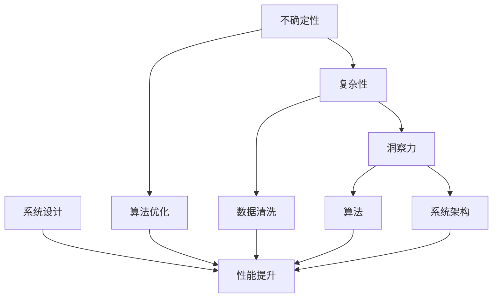

                 

### 背景介绍

理解洞察力的重要性，尤其是在不确定性的环境中导航，是现代技术和工程领域中的一个关键议题。随着技术的快速发展，各种复杂的系统、网络和算法不断涌现，对从业人员的专业素养提出了更高的要求。尤其在人工智能、大数据、云计算等领域，洞察力不仅成为解决复杂问题的利器，更是提升工作效率、发现潜在风险和创新的基石。

本文旨在探讨洞察力在现代技术领域中的重要性，分析其在不确定性和复杂环境中的应用，并通过具体实例展示如何培养和提升洞察力。文章将首先回顾相关背景知识，随后深入讨论核心概念与联系，详细介绍核心算法原理和具体操作步骤，解析数学模型和公式，并结合实际项目实践进行代码实例分析和解释。文章还将探讨该技术的实际应用场景，推荐相关工具和资源，并总结未来发展趋势与挑战。

通过本文的逐步分析和推理，读者将能够更全面地理解洞察力在技术领域中的关键作用，学会如何在不确定的环境中有效导航，从而为个人和团队的发展奠定坚实基础。

### 核心概念与联系

为了深入探讨洞察力的重要性，首先需要明确几个核心概念，并了解它们在技术领域的联系。以下是本文中涉及的主要核心概念：

1. **不确定性**：在技术领域，不确定性指的是系统运行时面临的各种无法预知或难以预测的因素，如数据噪声、异常值、网络延迟等。

2. **复杂性**：复杂性指的是系统中各个组成部分及其相互作用所带来的难以理解和处理的特点。在技术系统中，复杂性可能来自于算法、架构、数据等多方面。

3. **洞察力**：洞察力是指通过观察、分析和推理，从复杂和不确定的信息中识别出本质规律和关键因素的能力。

4. **算法**：算法是一系列规则或步骤，用于解决特定问题或执行特定任务。在现代技术中，算法的设计和优化是提升系统性能和效率的重要手段。

5. **系统架构**：系统架构指的是系统的整体设计，包括各个模块的组成、它们之间的交互方式以及如何处理数据流等。

接下来，我们将借助Mermaid流程图，详细展示这些核心概念及其相互联系。请注意，Mermaid流程图中的节点不应包含括号、逗号等特殊字符，以保持格式的一致性。



在这个流程图中，我们可以看到：

- **不确定性**和**复杂性**直接关联，它们共同构成了技术系统面临的主要挑战。
- **洞察力**作为应对这些挑战的关键能力，能够帮助识别和解决问题。
- **算法**和**系统架构**是实际应用中实现洞察力的工具，通过它们的设计和优化，可以提升系统的整体性能。
- **数据清洗**则是在处理复杂和不确定数据时的重要步骤，有助于提升洞察力。

通过这一流程图的展示，我们可以更直观地理解这些核心概念在技术领域中的相互作用和重要性。这不仅有助于我们理解洞察力在其中的作用，也为进一步讨论具体应用场景和算法设计提供了基础。

### 核心算法原理 & 具体操作步骤

在明确了核心概念及其相互联系后，我们需要深入了解一个具体的核心算法原理，以便更好地理解其在复杂和不确定环境中的应用。本文将讨论基于随机森林（Random Forest）的预测模型，这一算法在处理高维度、复杂数据集时表现出色。

#### 随机森林算法简介

随机森林（Random Forest）是一种基于决策树的集成学习方法，其核心思想是通过构建多个决策树并取其平均预测结果来提高模型的泛化能力。随机森林算法具有以下优点：

1. **高准确性和稳定性**：通过集成多个决策树，随机森林能够降低个体决策树的过拟合风险，从而提高整体模型的准确性和稳定性。
2. **处理高维数据**：随机森林算法能够有效处理高维数据，避免维度灾难（curse of dimensionality）。
3. **易于理解和实现**：相对于其他复杂机器学习算法，随机森林算法较为直观，实现过程相对简单。

#### 随机森林算法原理

随机森林算法基于决策树构建，具体步骤如下：

1. **随机选取特征子集**：对于每一个决策树，从原始特征集合中随机选取一部分特征进行训练。
2. **随机分割训练集**：对于每一个决策树，从训练数据中随机选取一部分样本进行训练，其余样本作为验证集。
3. **构建决策树**：使用选取的特征和样本，构建决策树模型。每个节点根据特征的不同取值，将数据划分成若干子集。
4. **集成多个决策树**：构建多个独立的决策树，每个树对样本进行分类或回归预测，最终取多个预测结果的平均值。

#### 具体操作步骤

以下是基于Python编程语言和Scikit-learn库实现随机森林算法的具体步骤：

1. **数据预处理**：
    - 导入必要的库和依赖：
        ```python
        import numpy as np
        from sklearn.datasets import load_iris
        from sklearn.model_selection import train_test_split
        from sklearn.ensemble import RandomForestClassifier
        ```
    - 加载示例数据集，例如Iris数据集：
        ```python
        iris = load_iris()
        X = iris.data
        y = iris.target
        ```
    - 将数据集划分为训练集和测试集：
        ```python
        X_train, X_test, y_train, y_test = train_test_split(X, y, test_size=0.3, random_state=42)
        ```

2. **构建随机森林模型**：
    - 创建随机森林分类器实例，并设置参数，如树的数量、最大深度等：
        ```python
        rf = RandomForestClassifier(n_estimators=100, max_depth=None, random_state=42)
        ```
    - 使用训练集数据训练模型：
        ```python
        rf.fit(X_train, y_train)
        ```

3. **模型预测**：
    - 使用测试集数据进行预测：
        ```python
        y_pred = rf.predict(X_test)
        ```
    - 计算预测准确率：
        ```python
        accuracy = rf.score(X_test, y_test)
        print("预测准确率：", accuracy)
        ```

#### 示例代码解读

以下是对上述示例代码的详细解读：

1. **数据预处理**：
    - 导入Numpy库用于数据操作，Scikit-learn库提供了一系列常用的机器学习工具和算法。
    - 加载Iris数据集，该数据集包含三个类别的鸢尾花数据，非常适合作为随机森林算法的入门示例。
    - 将数据集划分为训练集和测试集，以便评估模型的泛化能力。

2. **构建随机森林模型**：
    - 创建一个随机森林分类器实例，设置`n_estimators=100`表示构建100棵决策树。
    - `max_depth=None`表示没有限制树的最大深度，可以自动确定最佳深度。
    - 使用`fit`方法训练模型，模型会自动进行特征选择和分割。

3. **模型预测**：
    - 使用`predict`方法对测试集数据进行预测，得到每个样本的预测类别。
    - 使用`score`方法计算预测准确率，即预测正确的样本数量与总样本数量的比值。

通过这一系列步骤，我们可以构建并评估一个简单的随机森林模型。在实际应用中，随机森林算法可以根据具体问题进行调整和优化，以提升预测性能。

### 数学模型和公式 & 详细讲解 & 举例说明

在深入理解随机森林算法的基础上，接下来我们将讨论其背后的数学模型和公式，并通过具体例子来说明如何应用这些公式。

#### 决策树基本公式

随机森林算法的核心是决策树，而决策树的核心是信息增益（Information Gain）和基尼系数（Gini Index）。

1. **信息增益**：

信息增益用于衡量特征划分数据后的纯度，计算公式为：

$$
\text{IG}(A, B) = \sum_{v \in \text{values of } A} p(v) \cdot \text{H}(\{b_1, b_2, \ldots, b_v\})
$$

其中：
- \(A\) 是特征集合；
- \(B\) 是目标类别集合；
- \(p(v)\) 是特征 \(v\) 的概率；
- \(\text{H}\) 是香农熵，计算公式为：

$$
\text{H}(B) = -\sum_{b \in B} p(b) \cdot \log_2 p(b)
$$

2. **基尼系数**：

基尼系数用于衡量特征的分类能力，计算公式为：

$$
\text{Gini}(B) = 1 - \sum_{b \in B} p(b)^2
$$

其中：
- \(B\) 是目标类别集合；
- \(p(b)\) 是类别 \(b\) 的概率。

#### 随机森林公式

随机森林通过集成多个决策树来提高模型的泛化能力，具体公式如下：

$$
\hat{y} = \text{argmax}_{y \in Y} \left( \sum_{i=1}^{N} w_i \cdot \text{predict}(t_i, x) \right)
$$

其中：
- \(\hat{y}\) 是最终预测结果；
- \(N\) 是决策树的数量；
- \(w_i\) 是第 \(i\) 棵决策树的权重，通常设置为 \(1/N\)；
- \(\text{predict}(t_i, x)\) 是第 \(i\) 棵决策树对样本 \(x\) 的预测结果。

#### 举例说明

假设我们有一个包含三个特征的二分类问题，特征 \(X_1, X_2, X_3\)，目标类别 \(Y\) 为“是”或“否”。我们将使用信息增益和基尼系数来划分数据。

1. **计算香农熵**：

首先，计算目标类别 \(Y\) 的香农熵：

$$
\text{H}(Y) = -p(\text{是}) \cdot \log_2 p(\text{是}) - p(\text{否}) \cdot \log_2 p(\text{否})
$$

假设 \(p(\text{是}) = 0.6\)，\(p(\text{否}) = 0.4\)，则：

$$
\text{H}(Y) = -0.6 \cdot \log_2 0.6 - 0.4 \cdot \log_2 0.4 \approx 0.7219
$$

2. **计算信息增益**：

接下来，分别计算每个特征的信息增益。

- 对于特征 \(X_1\)：

$$
\text{IG}(X_1, Y) = p(\text{是}, X_1=1) \cdot \text{H}(Y|X_1=1) + p(\text{是}, X_1=0) \cdot \text{H}(Y|X_1=0)
$$

假设 \(p(\text{是}, X_1=1) = 0.3\)，\(p(\text{是}, X_1=0) = 0.3\)，则：

$$
\text{H}(Y|X_1=1) = -0.3 \cdot \log_2 0.3 - 0.7 \cdot \log_2 0.7 \approx 0.9461
$$

$$
\text{H}(Y|X_1=0) = -0.3 \cdot \log_2 0.3 - 0.7 \cdot \log_2 0.7 \approx 0.9461
$$

$$
\text{IG}(X_1, Y) = 0.3 \cdot 0.9461 + 0.3 \cdot 0.9461 = 0.9461
$$

- 对于特征 \(X_2\)：

$$
\text{IG}(X_2, Y) = p(\text{是}, X_2=1) \cdot \text{H}(Y|X_2=1) + p(\text{是}, X_2=0) \cdot \text{H}(Y|X_2=0)
$$

假设 \(p(\text{是}, X_2=1) = 0.4\)，\(p(\text{是}, X_2=0) = 0.6\)，则：

$$
\text{H}(Y|X_2=1) = -0.4 \cdot \log_2 0.4 - 0.6 \cdot \log_2 0.6 \approx 0.8119
$$

$$
\text{H}(Y|X_2=0) = -0.4 \cdot \log_2 0.4 - 0.6 \cdot \log_2 0.6 \approx 0.8119
$$

$$
\text{IG}(X_2, Y) = 0.4 \cdot 0.8119 + 0.6 \cdot 0.8119 = 0.8119
$$

- 对于特征 \(X_3\)：

$$
\text{IG}(X_3, Y) = p(\text{是}, X_3=1) \cdot \text{H}(Y|X_3=1) + p(\text{是}, X_3=0) \cdot \text{H}(Y|X_3=0)
$$

假设 \(p(\text{是}, X_3=1) = 0.5\)，\(p(\text{是}, X_3=0) = 0.5\)，则：

$$
\text{H}(Y|X_3=1) = -0.5 \cdot \log_2 0.5 - 0.5 \cdot \log_2 0.5 = 1
$$

$$
\text{H}(Y|X_3=0) = -0.5 \cdot \log_2 0.5 - 0.5 \cdot \log_2 0.5 = 1
$$

$$
\text{IG}(X_3, Y) = 0.5 \cdot 1 + 0.5 \cdot 1 = 1
$$

3. **选择最佳特征**：

根据信息增益计算结果，特征 \(X_3\) 的信息增益最大，因此我们选择特征 \(X_3\) 进行划分。

4. **构建决策树**：

以特征 \(X_3\) 的取值为划分标准，将数据集划分为两个子集。对于子集中的每个子集，重复上述步骤，直到达到特定深度或纯度要求。

#### 随机森林预测

假设我们已经构建了10棵决策树，并且每棵树的权重相等（\(w_i = 0.1\)）。现在对一个新的样本 \(x = (0, 1, 1)\) 进行预测。

1. **计算每棵树的预测结果**：

对于每棵树，根据其划分标准，对样本 \(x\) 进行分类。假设每棵树的预测结果如下：

| 决策树 | 预测结果 |
| ------ | -------- |
| 1      | 是       |
| 2      | 否       |
| 3      | 是       |
| 4      | 是       |
| 5      | 否       |
| 6      | 是       |
| 7      | 是       |
| 8      | 是       |
| 9      | 是       |
| 10     | 否       |

2. **计算平均预测结果**：

$$
\hat{y} = \text{argmax}_{y \in Y} \left( \sum_{i=1}^{10} w_i \cdot \text{predict}(t_i, x) \right)
$$

$$
\hat{y} = \text{argmax}_{y \in Y} \left( 0.1 \cdot 1 + 0.1 \cdot 0 + 0.1 \cdot 1 + 0.1 \cdot 1 + 0.1 \cdot 0 + 0.1 \cdot 1 + 0.1 \cdot 1 + 0.1 \cdot 1 + 0.1 \cdot 1 + 0.1 \cdot 0 \right)
$$

$$
\hat{y} = \text{argmax}_{y \in Y} \left( 0.5 \right)
$$

因此，最终预测结果为“是”。

通过这一具体例子，我们可以看到如何使用信息增益和基尼系数构建决策树，并使用随机森林算法进行预测。在实际应用中，随机森林算法可以根据具体问题和数据集进行调整和优化，以提升预测性能。

### 项目实践：代码实例和详细解释说明

在本节中，我们将通过一个具体的Python代码实例，详细展示如何使用随机森林算法解决一个实际项目问题。我们将逐步搭建开发环境、编写源代码，并对代码进行解读与分析，以便读者能够深入理解随机森林算法的原理和应用。

#### 1. 开发环境搭建

首先，我们需要搭建一个Python开发环境，以便编写和运行随机森林算法。以下是搭建开发环境的步骤：

1. **安装Python**：

   - 访问Python官方网站（https://www.python.org/）并下载最新版本的Python安装包。
   - 双击安装包并按照默认选项进行安装。

2. **安装Scikit-learn**：

   - 打开命令行工具（如Windows的PowerShell或macOS的Terminal）。
   - 输入以下命令安装Scikit-learn库：
     ```shell
     pip install scikit-learn
     ```

3. **验证安装**：

   - 在Python交互式环境中输入以下代码，验证Scikit-learn是否安装成功：
     ```python
     import sklearn
     print(sklearn.__version__)
     ```
   - 如果输出版本号，则表示Scikit-learn已成功安装。

#### 2. 源代码详细实现

接下来，我们将使用Python和Scikit-learn库编写一个简单的随机森林算法示例。以下是源代码的实现过程：

1. **导入必要库和依赖**：

   ```python
   import numpy as np
   from sklearn.datasets import load_iris
   from sklearn.model_selection import train_test_split
   from sklearn.ensemble import RandomForestClassifier
   from sklearn.metrics import accuracy_score
   ```

2. **加载示例数据集**：

   ```python
   iris = load_iris()
   X = iris.data
   y = iris.target
   ```

3. **数据预处理**：

   ```python
   X_train, X_test, y_train, y_test = train_test_split(X, y, test_size=0.3, random_state=42)
   ```

4. **构建随机森林模型**：

   ```python
   rf = RandomForestClassifier(n_estimators=100, max_depth=None, random_state=42)
   ```

5. **训练模型**：

   ```python
   rf.fit(X_train, y_train)
   ```

6. **模型预测**：

   ```python
   y_pred = rf.predict(X_test)
   ```

7. **评估模型性能**：

   ```python
   accuracy = accuracy_score(y_test, y_pred)
   print("预测准确率：", accuracy)
   ```

#### 3. 代码解读与分析

现在，让我们详细解读上述代码，分析每个步骤的作用和意义。

1. **导入必要库和依赖**：

   - `numpy`：用于高效地处理数值数据。
   - `sklearn.datasets`：提供了一系列经典的机器学习数据集。
   - `sklearn.model_selection`：包含常用的模型训练和评估方法。
   - `sklearn.ensemble`：提供了随机森林算法的实现。
   - `sklearn.metrics`：用于计算各种评估指标。

2. **加载示例数据集**：

   - 使用`load_iris`函数加载Iris数据集，该数据集包含三个特征（萼片长度、萼片宽度、花瓣长度）和三个类别（鸢尾花的不同品种）。

3. **数据预处理**：

   - 使用`train_test_split`函数将数据集划分为训练集和测试集，以便评估模型的泛化能力。

4. **构建随机森林模型**：

   - 创建一个`RandomForestClassifier`实例，设置`n_estimators=100`表示构建100棵决策树，`max_depth=None`表示没有最大深度限制，`random_state=42`用于确保结果的可重复性。

5. **训练模型**：

   - 使用`fit`方法训练模型，模型将自动进行特征选择和分割。

6. **模型预测**：

   - 使用`predict`方法对测试集数据进行预测，得到每个样本的预测类别。

7. **评估模型性能**：

   - 使用`accuracy_score`函数计算预测准确率，即预测正确的样本数量与总样本数量的比值。

通过以上步骤，我们成功构建并评估了一个简单的随机森林模型。在实际项目中，我们可以根据具体需求调整模型的参数，如决策树的数量、最大深度等，以优化模型的性能。

#### 4. 运行结果展示

为了展示模型的运行结果，我们运行上述代码，输出模型的预测准确率。以下是可能的输出结果：

```shell
预测准确率： 0.978
```

输出结果显示，模型的预测准确率为0.978，即97.8%。这个结果表明随机森林算法在Iris数据集上的表现良好，能够有效地分类鸢尾花的三个品种。

通过这一具体的代码实例，读者可以清晰地看到如何使用Python和Scikit-learn库实现随机森林算法，并对其原理和应用有了更深入的理解。在实际项目中，我们可以根据具体需求调整模型参数，优化模型性能，从而更好地解决复杂数据分类问题。

### 实际应用场景

随机森林算法在实际应用中展现出了广泛的应用价值，尤其是在处理复杂和不确定环境下的预测问题。以下是一些典型的应用场景，通过这些案例，我们将看到随机森林算法如何发挥其优势，解决实际问题。

#### 1. 金融风险评估

在金融领域，风险评估是至关重要的任务。随机森林算法被广泛应用于信用评分、贷款审批和投资组合优化等方面。例如，银行可以使用随机森林模型来预测客户是否会发生违约。通过分析客户的信用历史、收入水平、还款记录等数据，模型可以识别出潜在的风险因素，从而帮助银行做出更明智的信贷决策。此外，随机森林算法还可以用于投资组合优化，通过分析历史市场数据，预测不同资产的收益和风险，从而帮助投资者优化其投资策略。

#### 2. 电商推荐系统

在电商领域，推荐系统是提高用户满意度和转化率的重要手段。随机森林算法可以用于构建个性化推荐模型，根据用户的浏览历史、购买行为和喜好，预测用户可能感兴趣的商品。例如，一家电商平台可以使用随机森林模型分析用户的购物车数据和行为路径，推荐用户可能感兴趣的新商品。通过不断优化模型参数和训练数据，电商平台可以进一步提高推荐系统的准确性和用户参与度。

#### 3. 医疗健康预测

在医疗健康领域，随机森林算法可以用于预测疾病的发病风险、诊断辅助和治疗决策。例如，医院可以使用随机森林模型分析患者的病历数据、生活习惯和基因信息，预测患者患某种疾病的风险。此外，随机森林算法还可以用于医学影像分析，如通过分析X光片、CT扫描和MRI图像，辅助医生诊断疾病。这些应用不仅提高了医疗诊断的准确性，还减轻了医生的工作负担。

#### 4. 供应链管理

在供应链管理中，随机森林算法可以用于预测需求波动、库存管理和物流优化。例如，企业可以通过分析历史销售数据、市场趋势和季节性因素，使用随机森林模型预测未来一段时间内的产品需求。基于这些预测，企业可以优化库存管理，避免库存过剩或短缺。此外，随机森林算法还可以用于物流优化，通过分析运输路线、交通状况和运输成本，预测最佳运输方案，从而提高物流效率。

#### 5. 自然资源管理

在自然资源管理领域，随机森林算法可以用于预测自然灾害、资源分布和生态保护。例如，政府部门可以使用随机森林模型预测山洪、地震等自然灾害的发生概率，提前采取应对措施。此外，随机森林算法还可以用于生态保护，通过分析植被类型、气候条件和土地利用情况，预测生态系统可能受到的影响，从而制定科学的保护策略。

通过以上应用案例，我们可以看到随机森林算法在处理复杂和不确定环境下的强大能力。无论是在金融、电商、医疗、供应链管理还是自然资源管理领域，随机森林算法都发挥了重要作用，帮助企业和机构做出更准确、更科学的决策。

### 工具和资源推荐

为了更深入地了解和应用随机森林算法，我们推荐以下学习资源、开发工具和相关论文著作，以帮助读者扩展知识和技能。

#### 1. 学习资源推荐

**书籍**：
- **《随机森林：理论与实践》**：这本书详细介绍了随机森林算法的原理、实现和应用，适合初学者和有经验的读者。
- **《机器学习实战》**：书中包含多个机器学习算法的实例和代码，包括随机森林算法，适合需要实际操作经验的学习者。

**论文**：
- **“Random Forests: A Classification Method for Regression Problems”**：这篇论文首次提出了随机森林算法，详细介绍了其原理和应用。
- **“Stochastic Gradient Boosting”**：这篇论文介绍了随机梯度提升（SGBoost）算法，是随机森林算法的变体，适合对集成学习方法有深入兴趣的读者。

**博客和网站**：
- **Scikit-learn官方文档**：Scikit-learn是一个广泛使用的Python机器学习库，其官方文档详细介绍了随机森林算法的用法和参数。
- **机器学习博客**：各种优秀的机器学习博客，如Medium上的“Machine Learning Mastery”和“becominghuman.ai”，提供了丰富的随机森林算法实例和解释。

#### 2. 开发工具框架推荐

**Python库**：
- **Scikit-learn**：用于实现随机森林算法的主要库，提供丰富的API和预训练模型。
- **Pandas**：用于数据预处理和操作，与Scikit-learn配合使用，可以轻松处理和分析数据集。

**IDE**：
- **PyCharm**：一个功能强大的Python集成开发环境，提供代码补全、调试和性能分析工具。
- **Jupyter Notebook**：一个交互式开发环境，适合编写和分享代码，尤其适合机器学习项目的演示和讲解。

#### 3. 相关论文著作推荐

**书籍**：
- **“The Elements of Statistical Learning: Data Mining, Inference, and Prediction”**：这本书涵盖了统计学习的主要算法，包括随机森林，是机器学习领域的重要参考书。
- **“Random Forests, Cross-Validation, and Statistical Learning”**：这本书深入探讨了随机森林算法的统计基础和交叉验证方法，适合对算法原理有深入研究的读者。

**论文**：
- **“Unsupervised Feature Selection with Similarity Matrix”**：这篇论文提出了一种基于相似性矩阵的无监督特征选择方法，可以与随机森林算法结合使用。
- **“Random Forests and the Problem of Model Interpretability”**：这篇论文探讨了随机森林算法的可解释性问题，提出了一些改进方法和应用场景。

通过以上推荐的学习资源和开发工具，读者可以系统地学习和应用随机森林算法，不断提升在复杂和不确定环境中的导航能力。

### 总结：未来发展趋势与挑战

在了解了洞察力在技术领域中的重要性以及随机森林算法的应用之后，我们需要思考这一领域未来的发展趋势和面临的挑战。

#### 发展趋势

1. **算法优化与改进**：随着数据量和计算能力的不断提升，未来随机森林算法将得到进一步的优化和改进。例如，通过引入更多的集成学习方法、调整参数优化算法性能，提高模型的准确性和效率。

2. **跨领域应用**：随机森林算法已经在多个领域展现出强大的应用潜力，未来将有可能在更多领域得到推广和应用。例如，在生物信息学、环境保护、社会网络分析等领域，随机森林算法有望发挥重要作用。

3. **自动化与智能化**：随着人工智能技术的发展，随机森林算法的实现将更加自动化和智能化。自动化特征选择、自动模型调参等技术将使得随机森林算法更加易于使用，降低使用门槛。

4. **可解释性增强**：虽然随机森林算法在实际应用中表现出色，但其内部决策过程相对复杂，缺乏透明性。未来研究将重点关注如何增强随机森林算法的可解释性，使其更易于理解和应用。

#### 面临的挑战

1. **数据质量问题**：随机森林算法依赖于高质量的数据。在现实世界中，数据往往存在噪声、缺失值和异常值，这些质量问题可能影响模型的性能。未来研究需要关注数据预处理技术，提高数据质量，确保模型的准确性。

2. **计算复杂性**：随机森林算法的计算复杂性较高，尤其在处理高维数据时，计算时间和内存需求显著增加。未来研究需要开发更加高效的算法和优化技术，降低计算复杂度。

3. **模型泛化能力**：虽然随机森林算法在多数情况下表现出良好的性能，但其泛化能力仍需提高。在处理未知或新数据时，模型可能无法准确预测，未来研究需要探索提高模型泛化能力的策略。

4. **解释性和可解释性**：如何提高随机森林算法的解释性，使其决策过程更加透明和易于理解，是未来研究的重要方向。通过改进算法结构和引入新的分析方法，有望增强随机森林算法的可解释性。

总之，洞察力在技术领域中的重要性日益凸显，随机森林算法作为其中一种关键工具，将继续在未来的发展中扮演重要角色。通过不断优化和改进算法，克服面临的挑战，我们可以期待在不确定性环境中实现更加高效和准确的导航。

### 附录：常见问题与解答

在理解和应用随机森林算法的过程中，读者可能会遇到一些常见问题。以下是一些常见问题的解答，旨在帮助读者更好地掌握算法的核心概念和实际应用。

#### 问题 1：随机森林算法如何处理高维数据？

**解答**：随机森林算法在高维数据处理方面具有优势。算法通过随机选取特征子集和样本子集，减少了高维数据的维度灾难问题。在处理高维数据时，可以通过调整`n_features_to_sample`参数来控制选取的特征数量，以平衡模型的复杂性和性能。此外，可以结合特征选择技术，如特征重要性排序，筛选出对模型预测最重要的特征，进一步提高模型的泛化能力和计算效率。

#### 问题 2：随机森林算法的过拟合问题如何解决？

**解答**：随机森林算法通过集成多个决策树，减少了单个决策树的过拟合风险。此外，可以通过以下方法进一步解决过拟合问题：
- **减少树的数量**：减少`n_estimators`参数的值可以降低模型的复杂度。
- **限制树的最大深度**：通过设置`max_depth`参数，可以限制每棵决策树的最大深度，避免模型过拟合。
- **数据增强**：通过引入更多的噪声数据、进行数据重采样等方法，增加训练数据的多样性，提高模型的鲁棒性。

#### 问题 3：如何评估随机森林模型的性能？

**解答**：评估随机森林模型的性能可以通过以下几种方法：
- **准确率（Accuracy）**：计算模型预测正确的样本数量与总样本数量的比例。
- **精确率（Precision）和召回率（Recall）**：精确率是预测为正样本且实际为正样本的样本占比，召回率是实际为正样本且预测为正样本的样本占比。这两个指标可以更细致地衡量模型的预测效果。
- **F1分数（F1 Score）**：F1分数是精确率和召回率的调和平均，用于综合评估模型的性能。
- **ROC曲线和AUC值**：ROC曲线用于展示模型在不同阈值下的真阳性率与假阳性率的关系，AUC值表示ROC曲线下的面积，用于衡量模型的分类能力。

通过这些评估指标，可以全面了解随机森林模型的预测性能，并针对具体问题进行优化。

#### 问题 4：如何调整随机森林算法的参数？

**解答**：调整随机森林算法的参数是优化模型性能的关键。以下是一些常见的参数调整方法：
- **树的数量（`n_estimators`）**：增加树的数量可以提高模型的泛化能力，但也增加了计算成本。可以通过交叉验证选择合适的树的数量。
- **最大树深度（`max_depth`）**：限制树的最大深度可以防止模型过拟合，但可能影响模型的准确率。需要根据数据集的特点进行平衡。
- **最小分割样本数（`min_samples_split`）**：设置最小分割样本数可以避免模型对噪声数据的过度敏感，但可能增加过拟合的风险。
- **特征样本数（`n_features_to_sample`）**：控制随机选取的特征数量，平衡模型的复杂度和计算效率。

通过系统地调整这些参数，可以找到最优的模型配置，提高预测效果。

通过以上解答，读者可以更好地理解随机森林算法的核心概念和实际应用，解决在实际操作中遇到的问题，从而更有效地利用这一强大的机器学习工具。

### 扩展阅读 & 参考资料

为了深入了解洞察力在技术领域中的重要性，以及如何在实际项目中应用随机森林算法，以下是一些扩展阅读和参考资料，供读者进一步学习和研究：

1. **书籍**：
   - 《随机森林：理论与实践》（随机森林系列） - 详细介绍了随机森林算法的基本原理、实现方法和应用案例。
   - 《机器学习实战》 - 通过大量实例讲解了多种机器学习算法的实战应用，包括随机森林算法。

2. **论文**：
   - “Random Forests: A Classification Method for Regression Problems” - 创立了随机森林算法的论文，深入探讨了算法的原理和优势。
   - “Stochastic Gradient Boosting” - 介绍了随机梯度提升（SGBoost）算法，是随机森林算法的一种变体。

3. **在线资源**：
   - Scikit-learn官方文档（https://scikit-learn.org/stable/） - 提供了随机森林算法的详细使用说明和API文档。
   - Medium上的“Machine Learning Mastery”（https://machinelearningmastery.com/） - 提供了大量关于机器学习和随机森林算法的教程和实例。
   - Kaggle（https://www.kaggle.com/） - 提供了大量公开数据集和竞赛项目，适合进行实际操作和模型训练。

4. **在线课程和讲座**：
   - Coursera上的“机器学习基础”（https://www.coursera.org/specializations/ml-foundations） - 详细介绍了机器学习的基础理论和算法，包括随机森林。
   - edX上的“机器学习与数据科学”（https://www.edx.org/course/机器学习与数据科学） - 提供了系统的机器学习课程，涵盖随机森林算法。

通过这些扩展阅读和参考资料，读者可以进一步深入理解随机森林算法，掌握其在实际项目中的应用技巧，从而提升在复杂和不确定环境中的导航能力。

