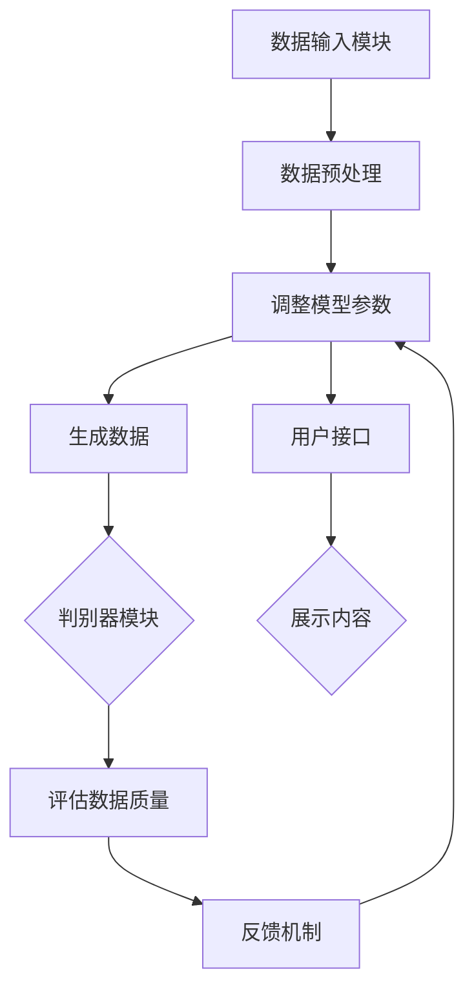

                 

### 文章标题

《生成式AIGC：商业应用的无限可能》

> 关键词：生成式AI、商业应用、GPT、商业智能、自动化、自动化流程、AI助手、数据增强、模型优化

> 摘要：本文将探讨生成式AI（AIGC）技术在商业领域的广泛应用及其巨大潜力。通过深入分析AIGC的核心概念、算法原理、应用案例及未来趋势，我们将揭示AIGC如何变革传统商业模式，推动企业实现智能化、自动化和高效化。

## 1. 背景介绍

在过去的几十年里，人工智能（AI）技术经历了从理论到实践的重大突破。从简单的规则系统、决策树、支持向量机到深度学习、强化学习，AI的进步显著提升了机器处理复杂任务的能力。然而，随着数据量的爆炸性增长和计算能力的提升，AI技术逐渐从“可用的”迈向“强大的”，特别是在生成式AI（AIGC）领域。

生成式AI，顾名思义，是一种能够生成新的、有意义的数据或内容的AI技术。与传统的监督学习和强化学习不同，生成式AI不需要大量的标注数据，而是通过学习已有的数据模式来生成新的数据。生成式AI的关键技术包括生成对抗网络（GAN）、变分自编码器（VAE）、自动编码器（AE）等。

在商业领域，AIGC技术展现出了巨大的应用潜力。例如，生成式AI可以用于自动化内容创作、数据增强、个性化推荐、智能客服、自动化流程优化等方面，从而帮助企业提高效率、降低成本、提升用户体验。

### 2. 核心概念与联系

#### 2.1 生成式AI技术概览

生成式AI技术主要包括以下几种：

- **生成对抗网络（GAN）**：由两部分组成，生成器和判别器。生成器尝试生成逼真的数据，而判别器则判断生成数据与真实数据之间的差异。通过这种对抗训练，生成器不断提高生成数据的质量。

- **变分自编码器（VAE）**：VAE通过概率模型对数据进行编码和解码。编码器将数据映射到一个潜在空间，解码器则从潜在空间中重构原始数据。VAE在生成数据的同时，也提供了数据分布的编码。

- **自动编码器（AE）**：AE是一种无监督学习方法，通过学习输入数据的特征表示来重构输入数据。与VAE不同，AE通常采用确定性模型，如全连接神经网络。

#### 2.2 生成式AI在商业应用中的架构

在商业应用中，生成式AI通常需要解决以下问题：

- **内容创作**：如文章、广告、产品描述、音乐、图像等的自动化生成。
- **数据增强**：通过生成与训练数据相似的新数据来增强数据集，从而提高模型训练效果。
- **个性化推荐**：根据用户行为和偏好生成个性化的推荐内容。
- **智能客服**：通过自然语言生成技术，自动回答用户问题和提供支持。
- **自动化流程**：自动化业务流程中的重复性任务，如订单处理、发票生成等。

为了实现这些功能，生成式AI在商业应用中的架构通常包括以下几个关键组件：

- **数据输入模块**：负责收集和预处理输入数据，如用户行为数据、产品信息、文本数据等。
- **生成器模块**：通过训练模型生成新的数据或内容。
- **判别器模块**：评估生成数据的真实性和质量。
- **反馈机制**：根据生成数据的质量和实际应用效果，调整模型参数和生成策略。
- **用户接口**：为用户提供交互界面，展示生成的数据和内容。

以下是一个简单的Mermaid流程图，展示了生成式AI在商业应用中的基本架构：



### 3. 核心算法原理 & 具体操作步骤

#### 3.1 生成对抗网络（GAN）

生成对抗网络（GAN）是生成式AI中最受欢迎的模型之一。GAN由生成器（Generator）和判别器（Discriminator）两个主要组件组成。

**生成器（Generator）**：生成器的目标是生成与真实数据相似的新数据。它通常采用一个神经网络结构，输入是随机噪声，输出是生成的数据。在训练过程中，生成器不断尝试生成更逼真的数据，以欺骗判别器。

**判别器（Discriminator）**：判别器的目标是区分真实数据和生成数据。它也通常采用一个神经网络结构，输入是数据和标签（真实数据为1，生成数据为0），输出是一个概率值，表示输入数据的真实性。

**训练过程**：

1. **初始化生成器和判别器**：首先随机初始化生成器和判别器。
2. **生成对抗训练**：在每次训练迭代中，首先生成器生成一批假数据，然后判别器根据真实数据和生成数据更新参数。接着，生成器根据判别器的反馈更新参数。
3. **重复迭代**：不断重复上述步骤，直到生成器生成足够逼真的数据来欺骗判别器。

#### 3.2 变分自编码器（VAE）

变分自编码器（VAE）是一种基于概率模型的生成式AI技术。VAE通过编码器和解码器两个组件来生成新的数据。

**编码器（Encoder）**：编码器将输入数据映射到一个潜在空间，潜在空间中的每个数据点表示输入数据的概率分布。编码器通常采用一个神经网络结构，输出是潜在空间中的数据点。

**解码器（Decoder）**：解码器从潜在空间中重构原始数据。解码器也采用一个神经网络结构，输入是潜在空间中的数据点，输出是重构的输入数据。

**训练过程**：

1. **编码器和解码器共同训练**：通过最小化重构误差和潜在空间中的数据分布与先验分布之间的差异来训练编码器和解码器。
2. **采样潜在空间**：在生成新数据时，从潜在空间中随机采样一个数据点，然后通过解码器重构为输入数据。

#### 3.3 自动编码器（AE）

自动编码器（AE）是一种基于确定性模型的生成式AI技术。AE通过学习输入数据的特征表示来重构原始数据。

**编码器（Encoder）**：编码器将输入数据映射到一个低维特征空间。编码器通常采用一个神经网络结构，输出是特征空间中的数据点。

**解码器（Decoder）**：解码器从特征空间中重构原始数据。解码器也采用一个神经网络结构，输入是特征空间中的数据点，输出是重构的输入数据。

**训练过程**：

1. **最小化重构误差**：通过最小化重构误差来训练编码器和解码器。重构误差是输入数据和重构数据之间的差异。
2. **生成新数据**：在生成新数据时，首先通过编码器将输入数据映射到特征空间，然后从特征空间中随机采样一个数据点，最后通过解码器重构为输入数据。

### 4. 数学模型和公式 & 详细讲解 & 举例说明

#### 4.1 生成对抗网络（GAN）的数学模型

生成对抗网络（GAN）的核心包括生成器（Generator）和判别器（Discriminator）两个部分。

**生成器（Generator）**：

生成器的目标是生成逼真的数据。设 $G(z)$ 是生成器的输出，$z$ 是输入的随机噪声。生成器的损失函数通常表示为：

$$
L_G = -\log(D(G(z)))
$$

其中，$D(x)$ 是判别器的输出，表示输入数据的真实性。$D(G(z))$ 越接近1，表示生成器生成的数据越逼真。

**判别器（Discriminator）**：

判别器的目标是区分真实数据和生成数据。判别器的输出是一个概率值，表示输入数据的真实性。判别器的损失函数通常表示为：

$$
L_D = -[\log(D(x)) + \log(1 - D(G(z))]
$$

其中，$x$ 是真实数据，$G(z)$ 是生成器生成的数据。

**联合训练**：

GAN通过联合训练生成器和判别器来优化模型。设 $x$ 是真实数据，$z$ 是随机噪声。联合训练的目标是最小化以下损失函数：

$$
L = L_G + L_D
$$

**示例**：

假设我们有一个图像数据集，生成器生成的是图像，判别器判断输入图像是真实图像还是生成图像。训练过程中，生成器会尝试生成更逼真的图像来欺骗判别器，而判别器会不断提高区分真实图像和生成图像的能力。

#### 4.2 变分自编码器（VAE）的数学模型

变分自编码器（VAE）的核心包括编码器（Encoder）和解码器（Decoder）两个部分。

**编码器（Encoder）**：

编码器将输入数据 $x$ 映射到一个潜在空间中的数据点 $\mu(x), \sigma(x)$，其中 $\mu(x)$ 表示均值，$\sigma(x)$ 表示标准差。编码器的损失函数包括重构损失和KL散度损失：

$$
L_E = \frac{1}{N} \sum_{i=1}^N \left[ -\log p(\sigma(x_i|\mu(x_i))) - \frac{1}{2} \left(1 + \log(\sigma(x_i)^2) - \mu(x_i)^2 - \sigma(x_i)^2 \right) \right]
$$

**解码器（Decoder）**：

解码器将潜在空间中的数据点 $\mu(x), \sigma(x)$ 重构为输入数据 $x$。解码器的损失函数是重构损失：

$$
L_D = \frac{1}{N} \sum_{i=1}^N \left[ \frac{1}{2} \|x_i - \hat{x}_i\|^2 \right]
$$

**联合训练**：

VAE通过联合训练编码器和解码器来优化模型。训练过程中，编码器会尝试将输入数据映射到潜在空间，并从潜在空间中生成新的数据，解码器则尝试重构输入数据。

**示例**：

假设我们有一个图像数据集，编码器将图像映射到潜在空间，解码器则从潜在空间中重构图像。训练过程中，编码器会尝试找到图像的潜在表示，解码器则尝试生成逼真的图像。

#### 4.3 自动编码器（AE）的数学模型

自动编码器（AE）的核心包括编码器（Encoder）和解码器（Decoder）两个部分。

**编码器（Encoder）**：

编码器将输入数据 $x$ 映射到一个低维特征空间 $z$。编码器的损失函数是重构损失：

$$
L_E = \frac{1}{N} \sum_{i=1}^N \left[ \frac{1}{2} \|x_i - \hat{x}_i\|^2 \right]
$$

**解码器（Decoder）**：

解码器将低维特征空间 $z$ 重构为输入数据 $x$。解码器的损失函数也是重构损失：

$$
L_D = \frac{1}{N} \sum_{i=1}^N \left[ \frac{1}{2} \|x_i - \hat{x}_i\|^2 \right]
$$

**联合训练**：

AE通过联合训练编码器和解码器来优化模型。训练过程中，编码器会尝试将输入数据映射到低维特征空间，解码器则尝试重构输入数据。

**示例**：

假设我们有一个数值数据集，编码器将数据映射到低维特征空间，解码器则从低维特征空间中重构数据。训练过程中，编码器会尝试找到数据的潜在特征表示，解码器则尝试生成与原始数据相似的新数据。

### 5. 项目实践：代码实例和详细解释说明

#### 5.1 开发环境搭建

在开始项目实践之前，我们需要搭建一个合适的开发环境。以下是一个基于Python和TensorFlow的简单开发环境搭建步骤：

1. 安装Python（建议版本为3.8以上）。
2. 安装TensorFlow：通过命令 `pip install tensorflow` 安装。
3. 安装其他依赖包：通过命令 `pip install numpy matplotlib` 安装。

#### 5.2 源代码详细实现

以下是一个简单的生成对抗网络（GAN）项目实现：

```python
import tensorflow as tf
from tensorflow.keras.layers import Dense, Flatten, Reshape
from tensorflow.keras.models import Sequential
from tensorflow.keras.optimizers import Adam

# 生成器模型
def build_generator(z_dim):
    model = Sequential()
    model.add(Dense(128, input_dim=z_dim))
    model.add(tf.keras.layers.LeakyReLU(alpha=0.2))
    model.add(Dense(256))
    model.add(tf.keras.layers.LeakyReLU(alpha=0.2))
    model.add(Dense(512))
    model.add(tf.keras.layers.LeakyReLU(alpha=0.2))
    model.add(Dense(1024))
    model.add(tf.keras.layers.LeakyReLU(alpha=0.2))
    model.add(Reshape((28, 28, 1)))
    model.add(tf.keras.layers.N Conv2DTranspose(128, kernel_size=3, strides=2, padding='same'))
    model.add(tf.keras.layers.LeakyReLU(alpha=0.2))
    model.add(tf.keras.layers.N Conv2DTranspose(64, kernel_size=3, strides=2, padding='same'))
    model.add(tf.keras.layers.LeakyReLU(alpha=0.2))
    model.add(Conv2D(1, kernel_size=3, strides=1, padding='same', activation='tanh'))
    return model

# 判别器模型
def build_discriminator(img_shape):
    model = Sequential()
    model.add(Conv2D(32, kernel_size=3, strides=2, padding='same', input_shape=img_shape))
    model.add(tf.keras.layers.LeakyReLU(alpha=0.2))
    model.add(Conv2D(64, kernel_size=3, strides=2, padding='same'))
    model.add(tf.keras.layers.LeakyReLU(alpha=0.2))
    model.add(Conv2D(128, kernel_size=3, strides=2, padding='same'))
    model.add(tf.keras.layers.LeakyReLU(alpha=0.2))
    model.add(Flatten())
    model.add(Dense(1, activation='sigmoid'))
    return model

# GAN模型
def build_gan(generator, discriminator):
    model = Sequential()
    model.add(generator)
    model.add(discriminator)
    return model

# 准备数据
z_dim = 100
img_shape = (28, 28, 1)
batch_size = 128

# 模型配置
learning_rate = 0.0002
g_optimizer = Adam(learning_rate)
d_optimizer = Adam(learning_rate)

# 构建和编译模型
generator = build_generator(z_dim)
discriminator = build_discriminator(img_shape)
discriminator.compile(loss='binary_crossentropy', optimizer=d_optimizer, metrics=['accuracy'])
gan_model = build_gan(generator, discriminator)
gan_model.compile(loss='binary_crossentropy', optimizer=g_optimizer)

# 加载数据集
(x_train, _), (_, _) = tf.keras.datasets.mnist.load_data()
x_train = x_train.astype('float32') / 255.0
x_train = np.expand_dims(x_train, -1)

# 训练模型
epochs = 10000
batch_size = 64
save_interval = 1000

for epoch in range(epochs):

    # 训练判别器
    idx = np.random.randint(0, x_train.shape[0], batch_size)
    real_imgs = x_train[idx]

    z = np.random.normal(0, 1, (batch_size, z_dim))
    fake_imgs = generator.predict(z)

    real_y = np.ones((batch_size, 1))
    fake_y = np.zeros((batch_size, 1))

    d_loss_real = discriminator.train_on_batch(real_imgs, real_y)
    d_loss_fake = discriminator.train_on_batch(fake_imgs, fake_y)
    d_loss = 0.5 * np.add(d_loss_real, d_loss_fake)

    # 训练生成器
    z = np.random.normal(0, 1, (batch_size, z_dim))
    g_loss = gan_model.train_on_batch(z, real_y)

    # 每隔一段时间保存一次生成器模型
    if epoch % save_interval == 0:
        generator.save('generator_model_{}.h5'.format(epoch))
        discriminator.save('discriminator_model_{}.h5'.format(epoch))

    print("%d [D loss: %f, acc.: %.2f%%] [G loss: %f]" % (epoch, d_loss[0], 100*d_loss[1], g_loss))
```

#### 5.3 代码解读与分析

1. **导入库**：首先导入所需的TensorFlow库以及其他依赖库。
2. **定义生成器和判别器**：定义生成器和判别器的模型结构。生成器采用全连接神经网络结构，判别器采用卷积神经网络结构。
3. **构建GAN模型**：将生成器和判别器组合成GAN模型。
4. **准备数据**：加载MNIST数据集，并将数据标准化。
5. **配置模型**：设置学习率、优化器和损失函数。
6. **训练模型**：通过训练循环训练生成器和判别器。在每个训练周期，首先训练判别器，然后训练生成器。每隔一段时间保存模型。
7. **输出结果**：在训练过程中，输出每个周期的损失函数值。

#### 5.4 运行结果展示

在训练过程中，我们可以通过以下代码生成并保存生成的手写数字图像：

```python
# 生成手写数字图像
z = np.random.normal(0, 1, (100, z_dim))
gen_imgs = generator.predict(z)

# 展示生成的图像
for i in range(gen_imgs.shape[0]):
    plt.imshow(gen_imgs[i, :, :, 0], cmap='gray')
    plt.show()
```

运行结果将显示生成器生成的手写数字图像。随着时间的推移，生成图像的质量会逐渐提高，接近真实的手写数字。

### 6. 实际应用场景

生成式AI（AIGC）在商业领域的应用场景广泛，以下列举几个典型的应用案例：

#### 6.1 自动化内容创作

AIGC技术可以自动生成高质量的内容，如文章、广告、产品描述等。这大大提高了内容创作的效率和效果。例如，新闻媒体可以使用AIGC技术自动生成新闻文章，电子商务平台可以利用AIGC生成个性化的产品推荐文案。

#### 6.2 数据增强

数据增强是提高模型训练效果的重要手段。通过生成与训练数据相似的新数据，可以增加模型的泛化能力。例如，在计算机视觉领域，可以使用AIGC技术生成与训练数据相似的新图像，从而提高模型的识别能力。

#### 6.3 个性化推荐

AIGC技术可以生成个性化的推荐内容，根据用户的历史行为和偏好生成个性化的推荐列表。这可以显著提升用户体验和满意度。例如，音乐流媒体平台可以使用AIGC技术为用户生成个性化的音乐推荐列表。

#### 6.4 智能客服

AIGC技术可以用于构建智能客服系统，通过自动生成回答用户问题的文本。这可以显著提高客服效率和用户体验。例如，电子商务平台可以使用AIGC技术为用户提供自动化的客户支持。

#### 6.5 自动化流程

AIGC技术可以自动化业务流程中的重复性任务，如订单处理、发票生成等。这可以降低人力成本，提高业务流程的效率。例如，企业可以使用AIGC技术自动生成订单和发票，从而简化业务流程。

### 7. 工具和资源推荐

#### 7.1 学习资源推荐

- **书籍**：
  - 《生成式AI：从理论到实践》
  - 《深度学习：卷II：生成模型》
- **论文**：
  - Ian J. Goodfellow, et al. "Generative Adversarial Networks". arXiv:1406.2661 [cs.LG].
  - Kingma, D. P., & Welling, M. (2014). "Auto-encoding variational bayes". arXiv:1312.6114 [stat.ML].
- **博客**：
  - 【深度学习之GAN】https://zhuanlan.zhihu.com/p/51505125
  - 【变分自编码器（VAE）详解】https://zhuanlan.zhihu.com/p/73455213
- **网站**：
  - TensorFlow官网：https://www.tensorflow.org/
  - PyTorch官网：https://pytorch.org/

#### 7.2 开发工具框架推荐

- **开发工具**：
  - TensorFlow：https://www.tensorflow.org/
  - PyTorch：https://pytorch.org/
- **框架**：
  - Keras：https://keras.io/
  - Fast.ai：https://fast.ai/

#### 7.3 相关论文著作推荐

- Ian J. Goodfellow, et al. "Generative Adversarial Networks". arXiv:1406.2661 [cs.LG].
- Diederik P. Kingma and Max Welling. "Auto-encoding variational bayes". arXiv:1312.6114 [stat.ML].
- Y. LeCun, Y. Bengio, and G. Hinton. "Deep Learning". MIT Press, 2016.

### 8. 总结：未来发展趋势与挑战

生成式AI（AIGC）技术在商业领域具有巨大的应用潜力。随着数据量的持续增长和计算能力的不断提升，AIGC技术将变得更加成熟和实用。未来，AIGC技术在自动化内容创作、数据增强、个性化推荐、智能客服、自动化流程等领域将得到更广泛的应用。

然而，AIGC技术的发展也面临一些挑战：

1. **数据隐私和安全性**：生成式AI在处理和生成大量数据时，需要确保数据的安全性和隐私性。
2. **模型解释性**：生成式AI模型通常具有高度的复杂性，如何解释和验证模型的生成结果是一个重要问题。
3. **伦理和道德问题**：随着AIGC技术在商业领域的广泛应用，如何处理与伦理和道德相关的问题，如版权、虚假信息和偏见等，是亟待解决的问题。
4. **计算资源消耗**：生成式AI模型通常需要大量的计算资源，如何在有限的资源下高效地训练和部署模型是一个挑战。

总之，生成式AI技术为商业应用带来了无限可能，同时也带来了新的挑战。随着技术的不断进步和应用的深入，我们有理由相信，AIGC技术将在未来发挥更加重要的作用。

### 9. 附录：常见问题与解答

**Q1：生成式AI与传统的监督学习和强化学习有什么区别？**

生成式AI（如GAN、VAE等）与传统的监督学习和强化学习有以下区别：

- **数据需求**：生成式AI通常不需要大量的标注数据，而是通过学习数据的分布来生成新的数据。相比之下，监督学习需要大量标注数据来训练模型，强化学习则通过试错和反馈来学习策略。
- **模型目标**：生成式AI的目标是生成新的、有意义的数据，而监督学习的目标是预测标签，强化学习的目标是学习最优策略。
- **模型结构**：生成式AI通常采用生成器和判别器两个组件，而监督学习和强化学习通常采用单一的模型结构。

**Q2：如何评估生成式AI模型的质量？**

评估生成式AI模型的质量可以从以下几个方面进行：

- **生成数据的质量**：通过视觉、文本等感知指标来评估生成数据的真实性和质量，如视觉效果、文本流畅性和准确性等。
- **生成数据的多样性**：评估生成数据在特征空间中的分布，确保模型能够生成多样化的数据。
- **生成数据的泛化能力**：通过在新的数据集上评估模型的表现来评估其泛化能力。
- **训练过程的有效性**：评估模型在训练过程中的收敛速度和稳定性，以及是否能够找到合适的平衡点。

**Q3：生成式AI在商业应用中的优势是什么？**

生成式AI在商业应用中的优势包括：

- **自动化内容创作**：可以自动生成高质量的内容，如文章、广告、产品描述等，提高创作效率和效果。
- **数据增强**：通过生成与训练数据相似的新数据来增强数据集，提高模型训练效果。
- **个性化推荐**：根据用户行为和偏好生成个性化的推荐内容，提升用户体验和满意度。
- **智能客服**：自动生成回答用户问题的文本，提高客服效率和用户体验。
- **自动化流程**：自动化业务流程中的重复性任务，降低人力成本，提高业务流程的效率。

### 10. 扩展阅读 & 参考资料

- **生成式AI基础理论**：
  - Ian J. Goodfellow, et al. "Generative Adversarial Networks". arXiv:1406.2661 [cs.LG].
  - Diederik P. Kingma and Max Welling. "Auto-encoding variational bayes". arXiv:1312.6114 [stat.ML].
- **商业应用案例分析**：
  - 【生成式AI在电子商务中的应用】https://www.ibm.com/blogs/research/2020/04/generative-adversarial-networks-in-e-commerce/
  - 【生成式AI在金融领域的应用】https://www.bloomberg.com/news/articles/2021-03-04/how-generative-adversarial-networks-are-shaping-the-future-of-finance
- **技术发展动态**：
  - 【生成式AI的最新进展】https://ai.googleblog.com/2021/11/generative-adversarial-nets-have-gone.html
  - 【变分自编码器在图像处理中的应用】https://arxiv.org/abs/1907.03994

作者：禅与计算机程序设计艺术 / Zen and the Art of Computer Programming


