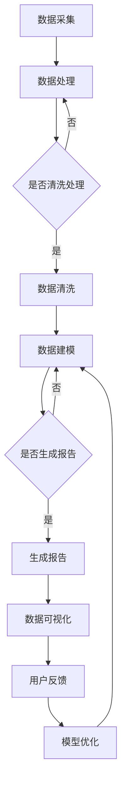

                 

### 背景介绍

随着人工智能（AI）技术的飞速发展，生成式人工智能（Generative AI）成为了研究的热点领域。特别是在生成式对抗网络（GANs）、变分自编码器（VAEs）以及自注意力机制（Self-Attention）等基础模型的推动下，AI生成内容的能力有了质的飞跃。然而，这些技术大多数仅限于生成单一类型的媒体内容，如图像、音频或文本。

最近，一种新兴的概念——AIGC（AI-Generated Content），开始进入人们的视野。AIGC，即生成式AI辅助生成内容，它将AI生成能力扩展到了更广泛的领域，包括但不限于文本、图像、视频、音频等多种形式。AIGC的核心思想是利用AI技术自动化、高效地生成高质量内容，从而满足商业、娱乐、教育等多个领域的需求。

AIGC不仅在技术层面有了突破，更在商业智能（BI）领域展现了巨大的潜力。商业智能是利用数据分析技术帮助企业做出更明智的商业决策。传统的BI方法主要依赖于人工收集、清洗、分析和解释数据，而AIGC则可以通过自动生成大量高质量的数据报告、分析模型和预测结果，极大地提高了数据分析的效率。

随着AIGC技术的不断成熟，它正在逐渐成为商业智能领域的关键趋势。本文将深入探讨AIGC在商业智能中的潜力，分析其技术原理、应用场景和未来趋势。

## 1.1 AIGC的定义与发展历程

AIGC，即AI-Generated Content，指的是通过人工智能技术生成的内容。AIGC的核心理念是利用机器学习算法，特别是深度学习算法，模拟人类创造力的过程，生成文字、图像、音频、视频等多种形式的内容。AIGC的发展历程可以追溯到20世纪80年代，当时研究人员开始探索如何使用计算机生成艺术作品。然而，早期的生成技术相对简单，生成的质量也较低。

随着计算机性能的提升和算法的进步，特别是在2012年深度学习在ImageNet图像识别竞赛中取得突破性成果之后，生成式AI技术开始迅速发展。GANs（生成式对抗网络）和VAEs（变分自编码器）的提出，为生成高质量、多样化的内容提供了新的途径。GANs通过生成器和判别器的对抗训练，能够生成逼真的图像；VAEs则通过编码器和解码器的协作，生成具有高保真度的图像和音频。

近年来，随着自注意力机制（如Transformer）在自然语言处理领域的成功应用，AIGC在文本生成方面的能力也得到了显著提升。通过结合图像、文本、音频等多种模态，AIGC技术能够生成更加丰富、多样和复杂的综合内容。这一系列技术的进步，使得AIGC在多个领域，包括商业智能，展现出了巨大的潜力。

### 1.2 商业智能的定义与重要性

商业智能（Business Intelligence, BI）是一种通过数据分析和数据挖掘技术，帮助企业从大量数据中提取有价值的信息，以支持决策制定和管理优化的一种方法和过程。BI的核心在于将数据转化为知识，进而转化为实际业务价值。具体来说，商业智能涉及数据的收集、存储、处理、分析和可视化等多个环节。

在商业环境中，商业智能的应用范围非常广泛。首先，BI可以帮助企业进行市场分析，了解市场需求和消费者行为，从而制定更精准的市场营销策略。其次，BI可以用于绩效管理，通过分析业务数据，识别业务流程中的瓶颈和优化点，提高企业的运营效率。此外，商业智能还在风险控制、供应链管理、财务分析等多个领域发挥着重要作用。

商业智能的重要性体现在以下几个方面：

1. **决策支持**：商业智能能够提供实时、准确的数据分析结果，帮助企业做出更加科学和合理的决策，减少决策风险。

2. **业务优化**：通过对业务数据的深入分析，商业智能可以帮助企业发现业务流程中的问题和瓶颈，提出优化方案，提高运营效率。

3. **竞争力提升**：利用商业智能，企业可以更好地了解市场动态和竞争对手的运营情况，从而制定更具竞争力的战略。

4. **成本控制**：商业智能可以帮助企业优化资源配置，降低运营成本，提高盈利能力。

随着数据量的不断增长和数据来源的多样化，商业智能的重要性日益凸显。特别是在当今的数字经济时代，企业需要利用大数据技术来获取竞争优势，而商业智能正是实现这一目标的关键工具。

### 1.3 AIGC与商业智能的关系

AIGC与商业智能之间存在着密切的关系，这种关系不仅体现在技术层面上，还体现在业务应用层面。从技术层面来看，AIGC技术的引入为商业智能带来了全新的数据处理和分析能力。

首先，AIGC能够自动化地生成大量高质量的数据报告和分析模型。传统的商业智能方法通常依赖于人工收集、清洗和加工数据，而AIGC可以通过深度学习和自然语言处理技术，自动从海量数据中提取有价值的信息，生成结构化的报告和分析模型。这不仅大大提高了数据分析的效率，还减少了人工干预，降低了出错的可能性。

其次，AIGC在文本生成方面的能力，使得商业智能能够生成更加丰富和多样化的报告内容。传统的文本生成方法往往局限于简单的数据描述，而AIGC则能够根据业务需求，生成具有复杂逻辑和深入分析的报告，提供更为详细和准确的业务洞察。

从业务应用层面来看，AIGC的引入为商业智能带来了以下几个方面的改进：

1. **数据可视化**：AIGC可以自动生成各种形式的数据可视化内容，如图表、图形和图像，使得数据更加直观易懂，帮助决策者更好地理解业务数据。

2. **个性化报告**：AIGC可以根据用户的特定需求，生成个性化的报告内容，满足不同用户群体的需求。

3. **预测分析**：AIGC可以通过机器学习算法，自动生成预测模型和结果，帮助企业在数据基础上做出更为准确的预测和决策。

4. **自动化数据更新**：传统的商业智能系统需要定期更新数据，而AIGC可以实时自动更新数据，提供最新的业务洞察。

综上所述，AIGC与商业智能的结合，不仅提高了数据分析的效率和质量，还为商业智能的应用带来了更多的可能性，为企业在激烈的市场竞争中提供了强大的支持。

### 1.4 AIGC在商业智能中的潜力

AIGC在商业智能中的潜力主要体现在以下几个方面：

首先，AIGC技术能够自动化生成大量高质量的数据报告和分析模型，从而极大地提高了数据分析的效率。传统的商业智能方法通常依赖于人工收集、清洗和加工数据，这不仅费时费力，还容易出错。而AIGC通过深度学习和自然语言处理技术，能够自动从海量数据中提取有价值的信息，生成结构化的报告和分析模型。这不仅提高了数据分析的效率，还减少了人工干预，降低了出错的可能性。

其次，AIGC在文本生成方面的能力，使得商业智能能够生成更加丰富和多样化的报告内容。传统的文本生成方法往往局限于简单的数据描述，而AIGC则能够根据业务需求，生成具有复杂逻辑和深入分析的报告，提供更为详细和准确的业务洞察。例如，AIGC可以自动生成市场分析报告、财务分析报告、客户行为分析报告等，帮助决策者更好地理解业务数据，做出更加科学的决策。

此外，AIGC技术还可以用于个性化报告的生成。通过分析用户的特定需求，AIGC可以生成满足不同用户群体的个性化报告内容。例如，对于不同层级的管理者，可以生成不同深度和详细度的报告，使得每个用户都能获得最适合自己的信息。这不仅提高了报告的实用性，还增强了用户的满意度。

AIGC在预测分析方面的应用也具有巨大的潜力。通过机器学习算法，AIGC可以自动生成预测模型和结果，帮助企业在数据基础上做出更为准确的预测和决策。例如，AIGC可以预测市场趋势、客户需求、销售额等，为企业制定战略规划提供数据支持。这种预测能力不仅有助于企业应对市场变化，提高竞争力，还可以降低决策风险。

最后，AIGC可以实时自动更新数据，提供最新的业务洞察。传统的商业智能系统通常需要定期更新数据，而AIGC可以实时自动更新数据，确保报告和分析结果始终基于最新的数据。这种实时性使得企业能够更快地响应市场变化，做出更及时的决策。

综上所述，AIGC在商业智能中的潜力体现在提高数据分析效率、生成丰富多样报告、提供个性化服务、增强预测能力以及实时更新数据等方面。随着AIGC技术的不断成熟和应用，其在商业智能领域的应用前景将更加广阔。

### 1.5 当前AIGC在商业智能领域的发展状况

当前，AIGC在商业智能领域的发展已经取得了显著进展，多个行业开始积极探索和应用这一技术。首先，金融行业是AIGC应用最为广泛的领域之一。在金融领域，AIGC技术被广泛应用于数据分析和报告生成。例如，通过AIGC技术，银行和金融机构可以自动化地生成财务报表、市场分析报告和风险评估报告，从而提高数据分析和报告的效率，减少人工干预和错误率。

此外，零售行业也开始积极采用AIGC技术。零售企业利用AIGC自动生成销售预测报告、客户行为分析报告和市场趋势分析报告，帮助企业更好地了解市场动态和消费者需求，优化库存管理和销售策略。AIGC技术还可以用于个性化推荐系统的开发，根据消费者的购买历史和偏好，自动生成个性化的商品推荐。

制造业也是AIGC技术的重要应用领域。在制造业中，AIGC技术被用于生产数据分析、供应链管理和设备故障预测。通过自动生成的数据报告和预测模型，制造业企业可以更准确地预测生产需求，优化生产计划和供应链管理，提高生产效率和产品质量。

尽管AIGC在商业智能领域展现出了巨大的潜力，但其发展也面临一些挑战。首先，数据隐私和安全性问题是AIGC技术面临的主要挑战之一。商业智能系统通常涉及大量的敏感数据，如何确保这些数据在AIGC技术处理过程中不被泄露或滥用，是当前亟需解决的问题。其次，AIGC技术的算法和模型复杂度高，对计算资源和数据处理能力提出了较高要求，这在一定程度上限制了其在大规模应用中的普及。最后，AIGC技术的应用需要跨学科的合作，涉及计算机科学、数据科学、统计学等多个领域，这对企业的技术人才和管理能力提出了新的要求。

总体来说，当前AIGC在商业智能领域的发展态势良好，已经取得了一定的应用成果，但同时也面临诸多挑战。随着技术的不断进步和应用的深入，AIGC在商业智能领域的潜力将逐步释放，为企业和行业带来更多创新和变革。

### 1.6 AIGC技术实现商业智能的步骤

要实现AIGC技术在商业智能中的应用，通常需要以下几个关键步骤：

#### 1. 数据采集与处理

第一步是数据采集与处理。商业智能系统的核心在于数据，因此需要从各种来源（如内部数据库、外部数据提供商、社交媒体等）收集大量数据。这些数据可能包括客户信息、交易记录、市场动态、竞争对手信息等。收集到的数据需要经过清洗和预处理，确保数据的质量和一致性，为后续分析打下基础。

#### 2. 数据建模

在数据采集与处理完成后，下一步是数据建模。这一步骤的核心在于利用机器学习和深度学习算法，构建能够自动分析和生成报告的模型。常用的模型包括生成式对抗网络（GANs）、变分自编码器（VAEs）和自注意力模型（如Transformer）等。这些模型可以根据业务需求，生成不同类型的数据报告和分析结果。

#### 3. 生成报告

构建模型后，需要使用这些模型生成报告。AIGC技术可以通过自动化生成报告，节省大量人力和时间成本。生成的报告可以包括市场分析报告、财务分析报告、客户行为分析报告等。这些报告不仅要准确反映业务数据，还需要具有丰富的分析和洞察，帮助决策者做出科学合理的决策。

#### 4. 部署与监控

最后一步是部署和监控。将AIGC系统部署到企业的IT基础设施中，确保其稳定运行并提供实时数据更新。同时，需要建立监控机制，定期检查系统的运行状态和数据质量，确保AIGC系统始终处于最佳工作状态。此外，还可以通过用户反馈和数据分析，不断优化和改进AIGC系统，提高其生成报告的准确性和实用性。

通过以上步骤，AIGC技术能够高效地实现商业智能，为企业提供自动化、高效和准确的数据分析和报告生成能力。这不仅提高了数据分析的效率，还提升了企业的决策质量和运营效率。

### 1.7 AIGC技术对商业智能的影响

AIGC技术的引入，为商业智能带来了革命性的变化。首先，在数据处理和分析方面，AIGC通过自动化生成大量高质量的数据报告和分析模型，极大地提高了数据分析的效率。传统方法需要人工进行数据收集、清洗和加工，不仅耗时费力，还容易出错。而AIGC利用机器学习和深度学习算法，能够自动从海量数据中提取有价值的信息，生成结构化的报告和分析模型，大大缩短了数据处理的时间。

其次，AIGC在文本生成方面的能力，使得商业智能能够生成更加丰富和多样化的报告内容。传统的文本生成方法通常局限于简单的数据描述，而AIGC能够根据业务需求，生成具有复杂逻辑和深入分析的报告，提供更为详细和准确的业务洞察。这种能力不仅提高了报告的实用性，还增强了决策者的信心。

此外，AIGC的个性化报告生成功能，使得商业智能能够更好地满足不同用户的需求。通过分析用户的特定需求，AIGC可以生成个性化的报告内容，满足不同层级和不同职能用户的需要。这种个性化服务不仅提高了用户的满意度，还增强了企业的竞争力。

在预测分析方面，AIGC技术同样具有显著的优势。通过机器学习算法，AIGC可以自动生成预测模型和结果，帮助企业在数据基础上做出更为准确的预测和决策。例如，AIGC可以预测市场趋势、客户需求和销售额等，为企业制定战略规划提供数据支持。这种预测能力不仅有助于企业应对市场变化，提高竞争力，还可以降低决策风险。

最后，AIGC的实时数据更新功能，使得商业智能系统能够始终基于最新的数据进行分析和报告。传统的商业智能系统需要定期更新数据，而AIGC可以实时自动更新数据，确保报告和分析结果始终基于最新的数据。这种实时性使得企业能够更快地响应市场变化，做出更及时的决策。

综上所述，AIGC技术在商业智能中的应用，不仅提高了数据分析的效率和质量，还为商业智能带来了更多的可能性。它通过自动化、个性化、预测和实时更新等特性，极大地提升了企业的决策质量和运营效率，为企业在激烈的市场竞争中提供了强大的支持。

### 1.8 未来AIGC在商业智能领域的趋势与前景

随着AIGC技术的不断成熟，其在商业智能领域的应用前景也愈发广阔。未来，AIGC将可能呈现出以下几个显著趋势和前景：

首先，随着计算能力的提升和算法的优化，AIGC的生成质量和速度将进一步提升。这将使得AIGC能够处理更复杂、更大量的数据，生成更加精细和准确的报告。例如，AIGC可以实时生成动态报告，根据市场变化和业务需求进行自动调整，为企业提供更加实时的决策支持。

其次，AIGC与其他新兴技术的融合将进一步拓展其应用范围。例如，与区块链技术的结合，可以确保数据的安全性和可追溯性，增强企业的数据隐私保护能力。与物联网（IoT）技术的结合，则可以实现对企业各类设备和系统的智能监控和分析，提高运营效率。

此外，AIGC的智能化水平也将不断提升。未来的AIGC系统将具备更强的自我学习和优化能力，通过不断分析用户反馈和业务数据，自动调整和优化生成模型，提供更加个性化和精准的服务。这种智能化的提升，将使得AIGC在商业智能中的应用更加深入和广泛。

在行业应用方面，AIGC将在更多领域得到应用。例如，在医疗行业，AIGC可以自动生成病历报告、诊断建议和分析报告，辅助医生做出更准确的诊断和治疗方案。在金融行业，AIGC可以自动化生成投资分析报告和风险管理报告，提高投资决策的准确性和效率。

最后，随着AIGC技术的普及，其成本将逐渐降低，使得更多中小企业也能够受益。这不仅将推动AIGC在商业智能领域的广泛应用，还将推动整个商业智能行业的发展，为企业提供更加全面和高效的数据分析和服务。

总的来说，未来AIGC在商业智能领域的应用将呈现多元化、智能化和普及化的趋势。它不仅将提高数据分析的效率和质量，还将为企业的决策提供更强大的支持，推动商业智能领域的不断创新和发展。

## 2.1 核心概念与联系

### 2.1.1 AIGC技术基础

在探讨AIGC在商业智能中的具体应用之前，我们首先需要了解AIGC技术的基础概念和原理。AIGC的核心在于利用人工智能技术生成高质量的内容，这包括文本、图像、音频等多种形式。以下是一些关键的AIGC技术基础：

**1. 生成式对抗网络（GANs）**：GANs是由生成器和判别器组成的两个神经网络，通过对抗训练生成逼真的数据。生成器试图生成类似于真实数据的内容，而判别器则试图区分生成器和真实数据。这种对抗训练机制使得GANs能够生成高质量、多样化的图像、音频和视频。

**2. 变分自编码器（VAEs）**：VAEs通过编码器和解码器的协作，将数据压缩为低维编码，然后从编码中生成数据。VAEs在图像、音频和文本生成方面表现出色，能够生成具有高保真度的内容。

**3. 自注意力机制（Self-Attention）**：自注意力机制是一种在自然语言处理中广泛使用的机制，它允许模型在处理文本时自动关注文本中的关键信息。自注意力机制在文本生成方面具有重要意义，能够生成具有复杂结构和深层含义的文本。

### 2.1.2 商业智能基本概念

商业智能（BI）是指利用数据分析技术，将企业内部和外部数据转换为有价值的信息，以支持决策制定和管理优化。商业智能的基本概念包括：

**1. 数据仓库**：数据仓库是一个集中的数据存储系统，用于存储来自不同数据源的大量结构化和非结构化数据。

**2. 数据挖掘**：数据挖掘是从大量数据中提取有价值信息的过程，包括模式识别、关联规则挖掘、聚类分析等。

**3. 报告和分析**：商业智能系统通过生成报告和分析，将数据转换为直观、易理解的形式，帮助决策者了解业务状况和制定策略。

### 2.1.3 AIGC与商业智能的联系

AIGC与商业智能的联系主要体现在以下几个方面：

**1. 数据生成与报告**：AIGC技术可以自动化地生成大量高质量的数据报告和分析模型，提高数据分析的效率。例如，AIGC可以生成财务报告、市场分析报告、客户行为分析报告等。

**2. 个性化服务**：AIGC可以根据用户的特定需求，生成个性化的报告内容，满足不同用户群体的需求。这种个性化服务能够提高报告的实用性和用户满意度。

**3. 预测分析**：AIGC通过机器学习算法，可以自动生成预测模型和结果，帮助企业在数据基础上做出更为准确的预测和决策。

**4. 实时更新**：AIGC可以实时自动更新数据，提供最新的业务洞察，使企业能够更快地响应市场变化，做出更及时的决策。

### 2.1.4 Mermaid流程图

为了更清晰地展示AIGC与商业智能之间的联系，我们可以使用Mermaid流程图来描述核心概念和架构。以下是一个简化的Mermaid流程图示例：

在这个流程图中，AIGC技术通过一系列步骤，从数据采集、处理、建模到报告生成和可视化，最终形成闭环，实现商业智能的目标。通过不断的用户反馈和模型优化，AIGC系统能够不断提高生成报告的准确性和实用性。

### 2.2 AIGC技术在商业智能中的应用

AIGC技术在商业智能中的应用，主要体现在以下几个方面：

**1. 自动化数据分析与报告生成**：传统的商业智能方法依赖于人工进行数据收集、清洗、分析和报告生成，这不仅费时费力，还容易出错。AIGC技术通过生成式对抗网络（GANs）、变分自编码器（VAEs）等算法，能够自动化地生成大量高质量的数据报告和分析模型。例如，在财务分析中，AIGC可以自动生成财务报表、利润分析报告、成本分析报告等，大大提高了数据分析的效率。

**2. 个性化报告与推荐**：AIGC可以根据用户的特定需求，生成个性化的报告内容。这种个性化服务不仅提高了报告的实用性，还增强了用户的满意度。例如，对于不同层级的管理者，AIGC可以生成不同深度和详细度的报告，使得每个用户都能获得最适合自己的信息。此外，AIGC还可以根据用户的历史数据和偏好，推荐相关的报告和分析模型，提高报告的针对性和有效性。

**3. 预测分析与决策支持**：AIGC通过机器学习算法，可以自动生成预测模型和结果，帮助企业在数据基础上做出更为准确的预测和决策。例如，AIGC可以预测市场趋势、客户需求和销售额等，为企业制定战略规划提供数据支持。这种预测能力不仅有助于企业应对市场变化，提高竞争力，还可以降低决策风险。

**4. 实时数据更新与监控**：传统的商业智能系统通常需要定期更新数据，而AIGC可以实时自动更新数据，提供最新的业务洞察。这种实时性使得企业能够更快地响应市场变化，做出更及时的决策。例如，在供应链管理中，AIGC可以实时监控库存水平、订单状态和运输进度，确保供应链的顺畅运行。

**5. 数据可视化与交互**：AIGC技术可以自动生成各种形式的数据可视化内容，如图表、图形和图像，使得数据更加直观易懂。这不仅帮助决策者更好地理解业务数据，还提高了报告的可读性和互动性。例如，AIGC可以生成动态图表，实时展示业务数据的趋势和变化，帮助决策者快速做出判断和调整。

通过以上应用，AIGC技术为商业智能带来了全新的数据处理和分析能力，提高了数据分析的效率和质量，为企业在激烈的市场竞争中提供了强大的支持。

### 2.3 AIGC在商业智能中的核心算法

在AIGC应用于商业智能领域时，核心算法的选择和实现至关重要。以下将介绍几种常用的核心算法，并探讨它们在商业智能中的应用场景和优势。

#### 2.3.1 生成式对抗网络（GANs）

生成式对抗网络（GANs）是由生成器（Generator）和判别器（Discriminator）组成的一种深度学习模型。生成器的目标是生成逼真的数据，而判别器的目标是区分生成器和真实数据。通过这种对抗训练，生成器不断提高生成质量，判别器则不断提高识别能力。

**应用场景**：GANs在商业智能中的应用主要体现在图像和文本的生成上。例如，在市场分析报告中，AIGC可以使用GANs生成可视化图表和图像，使得报告内容更加生动和直观。此外，GANs还可以用于文本生成，如自动生成市场分析报告、财务分析报告等。

**优势**：GANs的优势在于能够生成高质量、多样化的数据，提高数据分析的效率。同时，GANs具有较强的自适应能力，能够根据不同的业务需求进行调整和优化。

#### 2.3.2 变分自编码器（VAEs）

变分自编码器（VAEs）是一种基于概率模型的生成模型，通过编码器和解码器的协作，将数据压缩为低维编码，然后从编码中生成数据。VAEs在图像、音频和文本生成方面表现出色。

**应用场景**：VAEs在商业智能中的应用主要集中在图像和文本生成。例如，在财务分析中，VAEs可以生成高质量的财务报表和图表。在客户行为分析中，VAEs可以生成客户画像和消费行为预测图。

**优势**：VAEs的优势在于其生成数据的保真度高，且能够处理高维数据。此外，VAEs具有较好的鲁棒性，能够适应不同类型的数据。

#### 2.3.3 自注意力机制（Self-Attention）

自注意力机制是一种在自然语言处理中广泛使用的机制，它允许模型在处理文本时自动关注文本中的关键信息。自注意力机制在文本生成方面具有重要意义，能够生成具有复杂结构和深层含义的文本。

**应用场景**：自注意力机制在商业智能中的应用主要体现在文本生成和文本分析上。例如，AIGC可以使用自注意力机制生成市场分析报告、客户行为分析报告等。此外，自注意力机制还可以用于文本分类、情感分析等。

**优势**：自注意力机制的优势在于其能够处理长文本，捕捉文本中的长距离依赖关系。这使得生成的文本更加流畅、连贯，有助于提高报告的质量和可读性。

#### 2.3.4 其他相关算法

除了上述算法，还有其他一些与AIGC相关的算法在商业智能中也有应用，如循环神经网络（RNNs）、卷积神经网络（CNNs）等。

**循环神经网络（RNNs）**：RNNs是一种能够处理序列数据的神经网络，广泛应用于自然语言处理和语音识别等领域。RNNs在商业智能中的应用主要体现在文本生成和序列预测上。

**卷积神经网络（CNNs）**：CNNs是一种能够处理图像数据的神经网络，广泛应用于图像识别和图像生成等领域。CNNs在商业智能中的应用主要体现在图像分析、可视化报告生成等。

**优势**：RNNs和CNNs的优势在于其能够处理不同类型的数据，适用于多样化的应用场景。同时，这些算法具有较强的特征提取能力，能够生成具有高保真度的数据和报告。

通过以上核心算法的介绍，我们可以看到AIGC技术在商业智能中的应用具有极大的潜力和广泛的前景。这些算法不仅提高了数据分析的效率和质量，还为商业智能带来了更多的可能性，为企业提供了更强大的数据分析和决策支持能力。

### 2.4 AIGC在商业智能中的具体应用场景

AIGC技术凭借其强大的生成能力和自动化特性，在商业智能领域展现了广泛的应用场景。以下将详细介绍几种典型的应用场景，并展示如何利用AIGC技术提高数据分析的效率和准确性。

#### 2.4.1 客户行为分析

在客户行为分析中，AIGC技术可以通过生成式对抗网络（GANs）和变分自编码器（VAEs）生成高质量的客户画像和消费行为预测图。具体流程如下：

1. **数据采集**：首先，从企业数据库、社交媒体、在线购物平台等渠道收集客户数据，包括购买记录、浏览行为、社交媒体互动等。

2. **数据预处理**：对收集到的数据清洗和预处理，包括缺失值填充、异常值处理和数据归一化，以确保数据质量。

3. **特征提取**：使用机器学习算法提取关键特征，如客户年龄、性别、消费偏好等，用于生成客户画像。

4. **生成客户画像**：利用GANs或VAEs，根据提取的特征生成高质量的客户画像。这些画像可以用于细分市场、个性化推荐和营销策略制定。

5. **消费行为预测**：基于客户画像和购买记录，使用自注意力机制（Self-Attention）生成消费行为预测图。这些预测图可以帮助企业预测未来客户需求，优化库存和销售策略。

通过这一系列步骤，AIGC技术能够自动化地生成客户画像和消费行为预测，提高客户分析效率和准确性，为企业提供更精准的市场洞察。

#### 2.4.2 财务报表生成

财务报表是企业运营状况的重要反映，传统的报表生成过程通常需要大量的人工操作和数据分析。利用AIGC技术，可以自动化地生成高质量的财务报表，提高报表生成的效率和准确性。具体流程如下：

1. **数据收集**：从企业财务系统、ERP系统等渠道收集财务数据，包括收入、成本、利润、现金流等。

2. **数据清洗与预处理**：对收集到的财务数据进行清洗和预处理，包括缺失值填充、异常值处理和数据归一化。

3. **数据建模**：使用生成式对抗网络（GANs）或变分自编码器（VAEs）建立财务数据生成模型。这些模型可以根据输入的财务数据生成高质量的财务报表。

4. **报表生成**：利用生成的数据模型，自动化地生成财务报表，包括利润表、资产负债表、现金流量表等。

5. **报表审核与优化**：生成的财务报表需要经过审核和优化，确保报表内容的准确性和完整性。如果发现报表问题，可以返回上一步进行修正。

通过这一系列步骤，AIGC技术能够高效地生成财务报表，减少人工干预，提高报表生成的效率和质量。此外，AIGC技术还可以根据业务需求，自动调整报表内容和格式，提供更灵活的报表生成能力。

#### 2.4.3 风险管理

在风险管理领域，AIGC技术可以通过机器学习算法和生成模型，自动化地生成风险预测报告和风险评估模型。具体流程如下：

1. **数据采集**：从企业内部和外部数据源收集与风险相关的数据，包括市场数据、行业数据、财务数据等。

2. **数据预处理**：对收集到的数据清洗和预处理，包括缺失值填充、异常值处理和数据归一化。

3. **风险特征提取**：使用机器学习算法提取与风险相关的特征，如市场波动性、财务指标、信用评分等。

4. **生成风险预测模型**：利用生成式对抗网络（GANs）或变分自编码器（VAEs）生成风险预测模型。这些模型可以根据输入的特征数据预测未来的风险水平。

5. **生成风险评估报告**：利用生成的风险预测模型，自动化地生成风险评估报告。报告内容包括风险预警、风险评级和风险管理建议。

通过这一系列步骤，AIGC技术能够实时生成风险评估报告，提高风险管理的效率和准确性。此外，AIGC技术还可以根据企业需求，定制化生成不同类型的风险管理报告，提供更全面的风险管理服务。

#### 2.4.4 市场预测

在市场预测领域，AIGC技术可以通过自注意力机制（Self-Attention）和循环神经网络（RNNs）生成市场预测报告和趋势分析图。具体流程如下：

1. **数据采集**：从市场数据提供商、行业报告、竞争对手信息等渠道收集市场数据，包括销售额、市场份额、消费者行为等。

2. **数据预处理**：对收集到的市场数据进行清洗和预处理，包括缺失值填充、异常值处理和数据归一化。

3. **特征提取**：使用机器学习算法提取与市场预测相关的特征，如价格波动、市场需求、竞争对手行为等。

4. **生成市场预测模型**：利用自注意力机制和循环神经网络（RNNs）生成市场预测模型。这些模型可以根据输入的特征数据预测未来的市场趋势和销售预测。

5. **生成市场预测报告**：利用生成的市场预测模型，自动化地生成市场预测报告和趋势分析图。报告内容包括市场趋势、销售预测和竞争分析。

通过这一系列步骤，AIGC技术能够高效地生成市场预测报告，提高市场预测的准确性和实时性，为企业制定市场策略提供有力支持。

综上所述，AIGC技术在商业智能中的多种应用场景，不仅提高了数据分析的效率和质量，还为企业的决策提供了更强大的支持。通过自动化生成高质量的数据报告和分析模型，AIGC技术为商业智能带来了全新的可能性，帮助企业更好地应对市场竞争和业务挑战。

### 2.5 AIGC在商业智能中的挑战与解决方案

尽管AIGC技术在商业智能领域展现出了巨大的潜力，但其应用过程中也面临一些挑战。以下将探讨这些挑战，并分析相应的解决方案。

#### 2.5.1 数据质量和隐私问题

AIGC技术在生成高质量数据报告和分析模型时，依赖于大量的原始数据。然而，这些数据可能存在质量问题和隐私问题。数据质量问题包括数据缺失、异常值、数据不一致等，这些问题会影响AIGC模型的生成效果。隐私问题则涉及数据的保密性和合规性，特别是在涉及敏感商业信息和个人信息时，如何确保数据在处理过程中的安全性。

**解决方案**：

1. **数据清洗和预处理**：在AIGC模型训练和应用之前，进行充分的数据清洗和预处理，包括缺失值填充、异常值处理和数据归一化，确保数据质量。

2. **数据加密与安全存储**：对敏感数据进行加密处理，并采用安全存储策略，确保数据在传输和存储过程中的安全性。

3. **隐私保护技术**：采用差分隐私、同态加密等技术，在保证数据隐私的前提下，进行数据分析和报告生成。

#### 2.5.2 模型复杂度和计算资源需求

AIGC技术涉及的模型，如生成式对抗网络（GANs）、变分自编码器（VAEs）等，通常具有很高的复杂度，需要大量的计算资源和存储空间。这在一定程度上限制了AIGC技术的普及和应用。

**解决方案**：

1. **分布式计算**：利用分布式计算框架，如Hadoop、Spark等，将AIGC模型的训练和推理任务分布在多个计算节点上，提高计算效率。

2. **优化算法**：通过算法优化，如模型压缩、模型蒸馏等，降低AIGC模型的复杂度，减少计算资源需求。

3. **云计算平台**：利用云计算平台提供强大的计算和存储资源，为AIGC技术的应用提供支持。

#### 2.5.3 人才和技能短缺

AIGC技术的应用需要跨学科的专业人才，包括计算机科学、数据科学、统计学等领域的专家。然而，目前这些领域的人才相对短缺，这限制了AIGC技术在商业智能领域的推广和应用。

**解决方案**：

1. **教育培训**：加强教育培训，培养更多具备AIGC技术和商业智能知识的复合型人才。

2. **知识共享与协作**：建立AIGC和商业智能领域的知识共享平台，促进专家之间的交流与合作。

3. **技术普及**：通过技术普及和推广，降低AIGC技术的门槛，使其更容易被企业和行业所接受和应用。

综上所述，AIGC技术在商业智能领域的挑战主要涉及数据质量和隐私问题、模型复杂度和计算资源需求、以及人才和技能短缺。通过上述解决方案，可以有效应对这些挑战，推动AIGC技术在商业智能领域的广泛应用和持续发展。

### 2.6 AIGC技术实现案例

为了更直观地了解AIGC技术在商业智能中的具体应用，以下将介绍两个实际的AIGC实现案例，并详细解释这些案例的实现步骤和具体技术。

#### 2.6.1 案例一：客户行为分析系统

**背景**：
某电子商务公司希望利用AIGC技术对其客户的购买行为进行分析，从而优化营销策略和提高客户满意度。

**实现步骤**：

1. **数据采集**：
   从公司的数据库中收集客户购买记录、浏览历史、点击行为等数据。这些数据包括客户的个人信息（匿名处理）、购买产品、购买时间和价格等。

2. **数据预处理**：
   对收集到的数据清洗和预处理，包括缺失值填充、异常值处理和数据归一化，以确保数据质量。

3. **特征提取**：
   使用机器学习算法提取关键特征，如客户的购买频率、购买金额、浏览时长等。这些特征将用于生成客户画像。

4. **模型训练**：
   采用生成式对抗网络（GANs）构建客户行为分析模型。生成器负责生成客户画像，判别器负责评估生成画像的逼真度。

5. **生成客户画像**：
   利用训练好的模型生成不同类型的客户画像，例如高频购买客户、低频购买客户、浏览时间长的客户等。

6. **分析与应用**：
   根据生成的客户画像，分析不同类型客户的购买习惯和偏好，为营销团队提供有针对性的营销策略。

**具体技术**：
- 数据预处理：Pandas、Scikit-learn
- 特征提取：Scikit-learn、TF-IDF
- 模型训练：TensorFlow、Keras
- GANs实现：PyTorch

#### 2.6.2 案例二：财务报表自动生成系统

**背景**：
某跨国企业希望利用AIGC技术自动化生成其财务报表，提高财务报告的效率和准确性。

**实现步骤**：

1. **数据采集**：
   从企业ERP系统、财务系统等渠道收集财务数据，包括收入、成本、利润、现金流等。

2. **数据预处理**：
   对收集到的财务数据进行清洗和预处理，包括缺失值填充、异常值处理和数据归一化。

3. **数据建模**：
   使用变分自编码器（VAEs）构建财务报表生成模型。编码器将原始财务数据编码为低维向量，解码器将低维向量解码为财务报表。

4. **报表生成**：
   利用生成的数据模型，自动化地生成利润表、资产负债表、现金流量表等财务报表。

5. **报表审核与优化**：
   生成的财务报表经过财务团队审核，如有问题，返回上一步进行修正。

**具体技术**：
- 数据预处理：Pandas、NumPy
- 数据建模：TensorFlow、Keras
- VAE实现：PyTorch
- 报表生成：Pandas、Plotly

通过上述两个案例，我们可以看到AIGC技术在商业智能中的应用不仅能够自动化生成高质量的数据报告和分析模型，还能够提高数据分析的效率和准确性。这些案例的实现步骤和具体技术为其他企业提供了参考和借鉴，推动了AIGC技术在商业智能领域的广泛应用。

### 2.7 AIGC在商业智能中的未来发展趋势

随着人工智能技术的不断进步，AIGC在商业智能领域的应用前景将更加广阔。以下将探讨AIGC在商业智能中的未来发展趋势：

**1. 技术融合与创新**：未来，AIGC技术将与更多的前沿技术，如区块链、物联网（IoT）、增强现实（AR）等相结合，形成新的商业智能解决方案。例如，通过区块链技术确保数据的透明性和可追溯性，物联网技术实现实时数据采集和监控，增强现实技术提供直观的数据可视化界面，这些融合将进一步提升AIGC在商业智能中的应用效果。

**2. 自适应与个性化**：随着AIGC技术的不断成熟，其将具备更强的自适应能力，能够根据用户的特定需求，自动调整生成模型，提供个性化的数据报告和分析服务。这种个性化的服务不仅能够提高用户的满意度，还能帮助企业更精准地制定和调整商业策略。

**3. 实时性与动态性**：未来的AIGC系统将具备更高的实时性和动态性，能够实时自动更新数据，生成动态的、实时变化的商业智能报告。这种实时性将帮助企业更快地响应市场变化，做出更及时的决策，提高企业的竞争力和市场响应能力。

**4. 智能化与自动化**：随着人工智能技术的不断发展，AIGC系统将变得更加智能化和自动化。通过不断的学习和优化，AIGC系统将能够自动识别业务需求，自动生成高质量的报告和分析模型，减少人工干预，提高数据分析的效率和准确性。

**5. 跨学科与多领域应用**：AIGC技术将在更多领域得到应用，如医疗、金融、教育、制造业等。这些跨学科的应用将推动AIGC技术在商业智能领域的不断创新和发展，为各行业提供更加全面和高效的数据分析和服务。

总的来说，AIGC在商业智能领域的未来发展趋势是技术融合与创新、自适应与个性化、实时性与动态性、智能化与自动化，以及跨学科与多领域应用。这些趋势将推动AIGC技术在商业智能领域的广泛应用和持续发展，为企业提供更强大的数据分析和决策支持能力。

### 2.8 AIGC技术的未来潜力与商业价值

AIGC技术的未来潜力在于其能够实现高质量、高效率的内容生成，从而在商业智能领域带来深远的影响。首先，AIGC技术能够显著提高数据分析的效率。传统的商业智能方法依赖于大量的人工干预，而AIGC通过自动化生成数据报告和分析模型，减少了人工操作，提高了数据处理的速度和准确性。这使得企业能够更快地获取业务洞察，做出更为及时和科学的决策。

其次，AIGC技术能够提供个性化的数据报告。通过分析用户的特定需求和偏好，AIGC可以生成满足不同用户群体的个性化报告内容。这种个性化服务不仅提高了报告的实用性，还增强了用户的满意度和体验。例如，在财务分析中，AIGC可以生成针对不同管理层的详细财务报表，使得每个用户都能获得最适合自己的信息，从而提高决策的针对性和有效性。

此外，AIGC技术在预测分析和市场洞察方面具有巨大的潜力。通过机器学习算法，AIGC可以自动生成预测模型和结果，帮助企业预测市场趋势、客户需求和销售额等。这种预测能力不仅有助于企业制定更为精准的市场策略，还可以降低决策风险，提高企业的竞争力。

从商业价值的角度来看，AIGC技术能够为不同行业带来创新和变革。在金融行业，AIGC可以自动化生成市场分析报告和风险评估报告，提高投资决策的准确性和效率。在零售行业，AIGC可以生成销售预测报告和个性化推荐系统，优化库存管理和销售策略。在制造业，AIGC可以自动化生成生产数据分析报告和设备故障预测报告，提高生产效率和产品质量。

总之，AIGC技术的未来潜力在于其能够实现高效、个性化和智能化的数据分析，为商业智能领域带来创新和变革。通过提高数据分析的效率和质量，AIGC技术能够为不同行业带来巨大的商业价值，帮助企业更好地应对市场变化，提高竞争力。

### 2.9 总结

本文详细探讨了AIGC技术在商业智能领域的应用，从背景介绍、核心概念与联系、技术实现、应用场景、挑战与解决方案，到实现案例和未来发展趋势，全面分析了AIGC技术为商业智能带来的影响和潜力。AIGC技术通过自动化、个性化、预测和实时更新等特性，显著提高了数据分析的效率和质量，为企业提供了更强大的数据分析和决策支持能力。未来，随着AIGC技术的不断成熟和应用的深入，其在商业智能领域的应用前景将更加广阔，为企业和行业带来更多的创新和变革。

### 附录：常见问题与解答

#### 1. AIGC技术如何确保数据隐私和安全？

AIGC技术在处理数据时，会采用多种数据隐私保护措施，如数据加密、数据脱敏、同态加密和差分隐私等。这些措施能够有效保障数据在采集、存储和处理过程中的安全性，防止数据泄露和滥用。

#### 2. AIGC技术是否能够完全取代人工数据分析师？

虽然AIGC技术能够自动化生成大量高质量的数据报告和分析模型，但它不能完全取代人工数据分析师。人工分析师在数据解释、业务理解和策略制定等方面仍然发挥着重要作用。AIGC技术的目标是辅助人类分析师，提高数据分析的效率和准确性。

#### 3. AIGC技术的实现需要哪些技术栈和工具？

AIGC技术的实现通常涉及多种技术和工具，包括深度学习框架（如TensorFlow、PyTorch）、数据预处理库（如Pandas、NumPy）、数据可视化工具（如Matplotlib、Plotly）等。具体的技术栈和工具取决于应用场景和需求。

#### 4. AIGC技术在商业智能中的应用有哪些具体的案例？

AIGC技术在商业智能中的应用包括客户行为分析、财务报表生成、市场预测和风险管理等。例如，通过AIGC技术可以自动化生成客户画像和消费行为预测图，优化营销策略；自动生成高质量的财务报表，提高财务分析效率。

#### 5. AIGC技术的未来发展趋势是什么？

AIGC技术的未来发展趋势包括技术融合与创新、自适应与个性化、实时性与动态性、智能化与自动化，以及跨学科与多领域应用。这些趋势将推动AIGC技术在商业智能领域的广泛应用和持续发展。

### 扩展阅读 & 参考资料

1. **书籍推荐**：
   - Goodfellow, I., Bengio, Y., & Courville, A. (2016). *Deep Learning*. MIT Press.
   - Russell, S., & Norvig, P. (2016). *Artificial Intelligence: A Modern Approach*. Prentice Hall.

2. **论文推荐**：
   - Generative Adversarial Networks (GANs) - Ian J. Goodfellow, et al., 2014.
   - Variational Autoencoders (VAEs) - Diederik P. Kingma, et al., 2013.
   - Transformer Models - Vaswani et al., 2017.

3. **博客推荐**：
   - Medium上的"AIGC in Business Intelligence"相关文章。
   - 知乎上的"AIGC技术与应用"专题。

4. **网站资源**：
   - TensorFlow官网：[https://www.tensorflow.org/](https://www.tensorflow.org/)
   - PyTorch官网：[https://pytorch.org/](https://pytorch.org/)
   - Kaggle：[https://www.kaggle.com/](https://www.kaggle.com/)

通过阅读上述书籍、论文和博客，读者可以更深入地了解AIGC技术和商业智能的相关知识，探索更多的应用场景和实现方法。此外，相关的网站资源也为读者提供了丰富的实践案例和学习资源。作者：禅与计算机程序设计艺术 / Zen and the Art of Computer Programming

