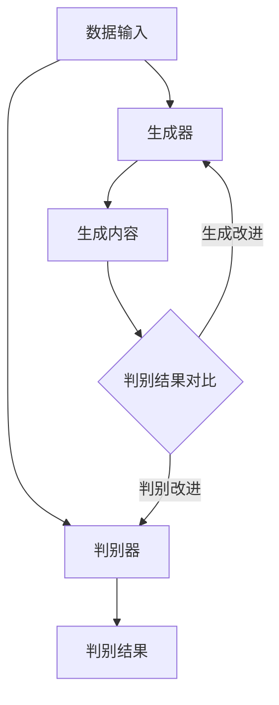
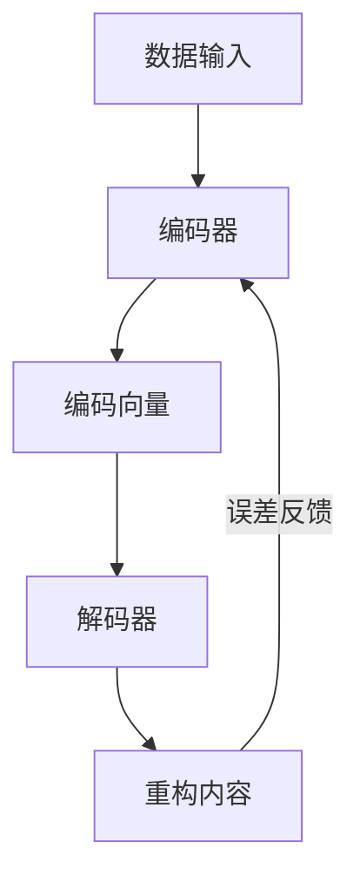
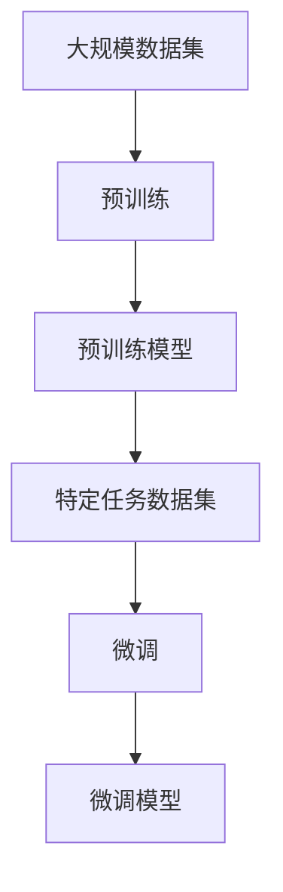

                 

### 文章标题

生成式AIGC：商业智能的未来趋势

> 关键词：生成式AI，商业智能，GPT，大语言模型，NLP，预测模型，决策支持系统，数据驱动，自动化，数字化转型

> 摘要：本文将探讨生成式人工智能（AIGC）在商业智能领域的应用与未来趋势。通过对AIGC的核心概念、算法原理、数学模型、项目实践以及实际应用场景的深入分析，揭示其在提升企业竞争力、优化业务流程、驱动数字化转型的巨大潜力。文章旨在为读者提供一个全面、系统的视角，了解AIGC在现代商业中的战略地位与未来发展。

### 1. 背景介绍

随着大数据、云计算和人工智能技术的迅猛发展，商业智能（BI）逐渐成为企业竞争的重要利器。传统BI主要通过数据挖掘、统计分析等技术手段，帮助企业从海量数据中提取有价值的信息，支持决策制定。然而，随着数据量的爆炸性增长和数据复杂度的不断提升，传统的BI方法在处理速度、分析深度和实时性方面逐渐显露出局限性。

近年来，生成式人工智能（AIGC，Generative AI）的崛起为商业智能领域带来了新的变革契机。AIGC是一种能够模拟人类创造力的AI技术，通过学习和模仿人类生成内容的方式，自动生成文本、图像、音频等多媒体数据。与传统的数据分析和预测模型不同，AIGC具有强大的创造力和适应性，能够处理更加复杂和多样的数据场景。

AIGC在商业智能领域的应用主要包括以下几个方面：

1. **文本生成与摘要**：利用AIGC技术，自动生成新闻报道、会议纪要、客户报告等文本内容，提高企业信息处理和报告生成效率。
2. **图像和视频生成**：通过AIGC技术，自动生成具有商业价值的图像和视频内容，应用于产品展示、广告宣传、虚拟现实等领域。
3. **自然语言处理**：利用AIGC技术，实现高效的自然语言处理任务，如机器翻译、文本分类、情感分析等，为企业提供更加精准和个性化的服务。
4. **预测建模**：通过AIGC技术，自动生成更加精准的预测模型，支持企业的市场预测、风险评估、客户需求分析等决策支持系统。

### 2. 核心概念与联系

要深入理解AIGC在商业智能领域的应用，首先需要掌握其核心概念、原理和架构。以下是AIGC的关键组成部分及其相互关系。

#### 2.1 核心概念

**生成式人工智能（AIGC）**：一种能够生成新的内容（文本、图像、音频等）的人工智能技术。与传统的监督学习、强化学习等AI技术不同，AIGC更注重在已有数据的基础上进行内容生成和创新。

**生成对抗网络（GAN）**：一种深度学习模型，由生成器和判别器组成，通过对抗训练生成逼真的数据。

**变分自编码器（VAE）**：一种基于概率的生成模型，通过编码和解码过程生成新的数据。

**预训练与微调**：AIGC技术通常采用预训练（Pre-training）和微调（Fine-tuning）相结合的方法，先在大规模数据集上进行预训练，再针对特定任务进行微调，以提高生成质量和适应能力。

#### 2.2 原理与架构

**生成对抗网络（GAN）架构**：



在GAN架构中，生成器（Generator）负责生成与真实数据相似的内容，判别器（Discriminator）负责判断生成内容与真实内容的相似度。通过不断的对抗训练，生成器逐渐提高生成质量，判别器逐渐提高判别能力，从而实现高质量的生成。

**变分自编码器（VAE）架构**：



在VAE架构中，编码器（Encoder）将输入数据映射到一个低维的编码向量，解码器（Decoder）将编码向量重构回原始数据。通过最小化重构误差，VAE能够生成高质量的数据。

**预训练与微调流程**：



在预训练阶段，模型在大规模数据集上进行训练，学习到丰富的特征表示。在微调阶段，模型在特定任务数据集上进行微调，以适应特定任务的需求。

#### 2.3 核心概念与联系

AIGC的核心概念包括生成式人工智能、生成对抗网络（GAN）、变分自编码器（VAE）以及预训练与微调。这些概念相互关联，共同构成了AIGC的技术体系。

- **生成式人工智能**：为AIGC提供了内容生成的理论基础。
- **生成对抗网络（GAN）**：通过对抗训练实现高质量的数据生成。
- **变分自编码器（VAE）**：通过编码解码过程实现高质量的数据生成。
- **预训练与微调**：通过大规模数据集的预训练和特定任务数据集的微调，提高模型的生成质量和适应能力。

这些核心概念和技术共同构成了AIGC在商业智能领域的应用基础，为企业和个人提供了一种全新的数据驱动和创新方式。

### 3. 核心算法原理 & 具体操作步骤

#### 3.1 生成对抗网络（GAN）算法原理

生成对抗网络（GAN）是一种基于博弈理论的深度学习模型，由生成器（Generator）和判别器（Discriminator）两个部分组成。生成器负责生成逼真的数据，判别器负责判断生成数据与真实数据的相似度。

**生成器（Generator）**：

生成器的目标是生成尽可能真实的数据，以欺骗判别器。生成器通常由多层神经网络组成，输入为随机噪声，输出为生成的数据。生成器的目标是最大化其生成的数据被判别器判断为真实的概率。

**判别器（Discriminator）**：

判别器的目标是区分真实数据和生成数据。判别器也由多层神经网络组成，输入为真实数据和生成数据，输出为判断结果，通常是一个概率值，表示输入数据为真实数据的置信度。

**对抗训练**：

GAN的训练过程是一个对抗过程。生成器和判别器相互竞争，生成器试图生成更加真实的数据，判别器试图区分真实数据和生成数据。通过不断迭代训练，生成器的生成质量逐渐提高，判别器的判别能力逐渐增强。

**损失函数**：

GAN的损失函数通常由两部分组成：生成器的损失函数和判别器的损失函数。生成器的损失函数为最小化判别器判断生成数据为真实数据的概率，判别器的损失函数为最大化判别器判断真实数据为真实数据的概率。

#### 3.2 变分自编码器（VAE）算法原理

变分自编码器（VAE）是一种基于概率的生成模型，通过编码和解码过程实现数据生成。VAE由编码器（Encoder）和解码器（Decoder）两个部分组成。

**编码器（Encoder）**：

编码器的目标是将输入数据映射到一个低维的编码向量。编码器通常由多层神经网络组成，输入为原始数据，输出为编码向量。编码器的作用是将输入数据的特征信息编码到一个低维的向量表示中。

**解码器（Decoder）**：

解码器的目标是根据编码向量重构输入数据。解码器也由多层神经网络组成，输入为编码向量，输出为重构的原始数据。解码器的作用是将编码向量解码回原始数据，以实现数据生成。

**损失函数**：

VAE的损失函数通常由两部分组成：重建损失和编码损失。重建损失为输入数据与重构数据之间的差异，编码损失为编码向量与先验分布之间的差异。通过最小化这两个损失函数，VAE能够生成高质量的数据。

#### 3.3 预训练与微调

预训练与微调是AIGC技术中常用的一种训练策略，旨在提高模型的生成质量和适应能力。

**预训练**：

预训练是指在大规模数据集上进行模型训练，学习到丰富的特征表示。预训练的目的是让模型具有较好的泛化能力，能够处理不同领域和任务的数据。

**微调**：

微调是指在小规模特定任务数据集上进行模型训练，以适应特定任务的需求。微调的目的是让模型具有更好的特定任务性能。

**预训练与微调流程**：

1. **数据准备**：收集大规模数据集和特定任务数据集，对数据进行预处理，如数据清洗、归一化等。
2. **预训练**：使用大规模数据集对模型进行预训练，学习到丰富的特征表示。
3. **模型保存**：将预训练模型保存下来，用于后续的微调。
4. **数据准备**：收集特定任务数据集，对数据进行预处理。
5. **微调**：使用特定任务数据集对预训练模型进行微调，以适应特定任务的需求。
6. **模型评估**：评估微调后模型的性能，选择最佳模型用于实际应用。

### 4. 数学模型和公式 & 详细讲解 & 举例说明

在生成式人工智能（AIGC）中，数学模型和公式是理解其核心原理和操作步骤的重要基础。以下我们将详细介绍GAN和VAE的数学模型，并通过具体的公式和例子进行讲解。

#### 4.1 生成对抗网络（GAN）的数学模型

生成对抗网络（GAN）的核心在于生成器（Generator）和判别器（Discriminator）的对抗训练。下面我们分别介绍这两个网络的数学模型。

**生成器（Generator）**：

生成器的目标是生成虚假数据，以欺骗判别器。生成器的输入为随机噪声向量 \( z \)，输出为虚假数据 \( G(z) \)。

生成器的损失函数通常采用最小化判别器判断生成数据为真实的概率。具体地，生成器的损失函数为：

$$
L_G = -\log(D(G(z)))
$$

其中，\( D(\cdot) \) 表示判别器的输出概率。

**判别器（Discriminator）**：

判别器的目标是判断输入数据是真实数据还是生成数据。判别器的输入为真实数据 \( x \) 和生成数据 \( G(z) \)，输出为判断结果 \( D(x) \) 和 \( D(G(z)) \)。

判别器的损失函数通常采用最小化判别器判断生成数据为虚假的概率。具体地，判别器的损失函数为：

$$
L_D = -[\log(D(x)) + \log(1 - D(G(z)))]
$$

其中，\( D(x) \) 表示判别器对真实数据的判断概率，\( D(G(z)) \) 表示判别器对生成数据的判断概率。

**总损失函数**：

GAN的总损失函数为生成器和判别器损失函数的和。具体地，总损失函数为：

$$
L = L_G + L_D
$$

#### 4.2 变分自编码器（VAE）的数学模型

变分自编码器（VAE）是一种基于概率的生成模型，通过编码和解码过程实现数据生成。VAE的核心在于编码器（Encoder）和解码器（Decoder）。

**编码器（Encoder）**：

编码器的目标是将输入数据 \( x \) 映射到一个隐层的编码向量 \( \mu(x) \) 和对数方差 \( \log(\sigma^2(x)) \)。

编码器的输出为：

$$
q(\mu|x, \log(\sigma^2|x)) = \mathcal{N}(\mu|x, \sigma^2)
$$

其中，\( \mu(x) \) 表示均值，\( \log(\sigma^2(x)) \) 表示对数方差，\( \mathcal{N}(\mu|x, \sigma^2) \) 表示正态分布。

**解码器（Decoder）**：

解码器的目标是根据编码向量 \( \mu(x) \) 和对数方差 \( \log(\sigma^2(x)) \) 重构输入数据 \( x \)。

解码器的输出为：

$$
p(x|\mu, \sigma^2) = \mathcal{N}(x|\mu, \sigma^2)
$$

其中，\( \mu \) 表示均值，\( \sigma^2 \) 表示方差，\( \mathcal{N}(x|\mu, \sigma^2) \) 表示正态分布。

**变分下界（Variational Lower Bound）**：

VAE的损失函数采用变分下界（Variational Lower Bound）的形式。具体地，变分下界为：

$$
L = \mathbb{E}_{p(x)}[-\log(p(x|x))] + \mathbb{KL}(q(\mu|x, \log(\sigma^2|x)) || p(x))
$$

其中，\( \mathbb{E}_{p(x)}[-\log(p(x|x))] \) 表示数据重构损失，\( \mathbb{KL}(q(\mu|x, \log(\sigma^2|x)) || p(x)) \) 表示编码损失，\( \mathbb{KL}(\cdot || \cdot) \) 表示KL散度。

#### 4.3 实例讲解

为了更好地理解GAN和VAE的数学模型，我们通过一个简单的例子进行讲解。

**例子：生成猫的图片**

假设我们使用GAN生成猫的图片，其中生成器 \( G \) 和判别器 \( D \) 分别表示为：

$$
G: z \rightarrow x'
$$

$$
D: x \rightarrow D(x)
$$

其中，\( z \) 表示输入的随机噪声向量，\( x' \) 表示生成的猫的图片，\( x \) 表示真实的猫的图片。

**生成器的训练过程**：

1. **输入随机噪声向量 \( z \)**：
$$
z \sim \mathcal{N}(0, I)
$$

2. **生成猫的图片 \( x' \)**：
$$
x' = G(z)
$$

3. **计算生成器的损失**：
$$
L_G = -\log(D(G(z)))
$$

**判别器的训练过程**：

1. **输入真实猫的图片 \( x \)**：
$$
x \sim p(x)
$$

2. **输入生成的猫的图片 \( x' \)**：
$$
x' = G(z)
$$

3. **计算判别器的损失**：
$$
L_D = -[\log(D(x)) + \log(1 - D(G(z)))]
$$

**整体训练过程**：

1. **交替训练生成器和判别器**：
   - 对于生成器 \( G \)：
     - 输入随机噪声向量 \( z \)。
     - 生成猫的图片 \( x' \)。
     - 计算生成器的损失 \( L_G \)。
   - 对于判别器 \( D \)：
     - 输入真实猫的图片 \( x \)。
     - 输入生成的猫的图片 \( x' \)。
     - 计算判别器的损失 \( L_D \)。

2. **更新生成器和判别器的参数**：
   - 使用梯度下降法更新生成器和判别器的参数，以最小化总损失 \( L \)。

通过上述例子，我们可以看到GAN的数学模型和训练过程。类似地，VAE的数学模型和训练过程也可以通过类似的步骤进行理解和实现。

### 5. 项目实践：代码实例和详细解释说明

在本节中，我们将通过一个实际的代码实例，展示如何使用生成对抗网络（GAN）和变分自编码器（VAE）进行数据生成。我们将使用Python和TensorFlow库来实现这两个模型。

#### 5.1 开发环境搭建

在开始项目实践之前，我们需要搭建合适的开发环境。以下是所需的软件和库：

- **Python（3.7或更高版本）**：作为主要编程语言。
- **TensorFlow（2.x版本）**：用于构建和训练GAN和VAE模型。
- **Numpy**：用于数学计算。
- **Matplotlib**：用于可视化生成数据。

安装以上库后，我们可以开始编写代码。

#### 5.2 源代码详细实现

以下是一个简单的GAN和VAE的代码实例：

```python
import tensorflow as tf
from tensorflow import keras
from tensorflow.keras import layers
import numpy as np
import matplotlib.pyplot as plt

# 设置随机种子以确保结果的可重复性
tf.random.set_seed(42)

# 数据准备
# 假设我们使用MNIST数据集进行实验
(x_train, _), (x_test, _) = keras.datasets.mnist.load_data()
x_train = x_train.astype('float32') / 255.0
x_test = x_test.astype('float32') / 255.0

# GAN模型实现
def build_generator(z_dim):
    model = keras.Sequential()
    model.add(layers.Dense(128, activation='relu', input_shape=(z_dim,)))
    model.add(layers.Dense(256, activation='relu'))
    model.add(layers.Dense(512, activation='relu'))
    model.add(layers.Dense(1024, activation='relu'))
    model.add(layers.Dense(28 * 28, activation='tanh'))
    return model

def build_discriminator(img_shape):
    model = keras.Sequential()
    model.add(layers.Flatten(input_shape=img_shape))
    model.add(layers.Dense(128, activation='relu'))
    model.add(layers.Dense(256, activation='relu'))
    model.add(layers.Dense(1, activation='sigmoid'))
    return model

def build_gan(generator, discriminator):
    model = keras.Sequential()
    model.add(generator)
    model.add(discriminator)
    return model

z_dim = 100
img_shape = (28, 28, 1)

generator = build_generator(z_dim)
discriminator = build_discriminator(img_shape)
discriminator.compile(loss='binary_crossentropy', optimizer=keras.optimizers.Adam(0.0001))
gan = build_gan(generator, discriminator)
gan.compile(loss='binary_crossentropy', optimizer=keras.optimizers.Adam(0.0001))

# 训练GAN模型
batch_size = 128
epochs = 10000
sample_interval = 1000

for epoch in range(epochs):

    for _ in range(batch_size // 2):
        # 生成随机噪声
        z = tf.random.normal([batch_size // 2, z_dim])

        # 生成假图片
        x_hat = generator(z)

        # 输入真图片和假图片到判别器
        x = x_train[np.random.randint(x_train.shape[0], size=batch_size // 2)]
        x_hat = x_hat[:batch_size // 2]
        x = np.concatenate([x, x_hat])

        # 计算判别器的损失
        d_loss_real = discriminator(x).numpy().mean()

        # 生成随机噪声
        z = tf.random.normal([batch_size // 2, z_dim])

        # 计算生成器的损失
        d_loss_fake = discriminator(x_hat).numpy().mean()
        g_loss = -d_loss_fake

        # 更新判别器和生成器的参数
        with tf.GradientTape() as tape:
            d_loss_real, d_loss_fake, g_loss = tape overshoot(
                discriminator(x),
                discriminator(x_hat),
                generator(z)
            )

        grads_d = tape.gradient([d_loss_real, d_loss_fake, g_loss], [discriminator.trainable_variables])
        grads_g = tape.gradient(g_loss, generator.trainable_variables)
        discriminator.optimizer.apply_gradients(zip(grads_d, discriminator.trainable_variables))
        generator.optimizer.apply_gradients(zip(grads_g, generator.trainable_variables))

    # 在每个epoch结束时保存生成器的模型
    if epoch % sample_interval == 0:
        generator.save(f'generator_epoch_{epoch}.h5')
        print(f'Epoch {epoch}, d_loss={d_loss:.4f}, g_loss={g_loss:.4f}')

# VAE模型实现
def build_encoder(img_shape):
    model = keras.Sequential()
    model.add(layers.Conv2D(32, (3, 3), activation='relu', input_shape=img_shape))
    model.add(layers.MaxPooling2D((2, 2)))
    model.add(layers.Conv2D(64, (3, 3), activation='relu'))
    model.add(layers.MaxPooling2D((2, 2)))
    model.add(layers.Conv2D(64, (3, 3), activation='relu'))
    model.add(layers.Flatten())
    model.add(layers.Dense(15))
    return model

def build_decoder(z_dim):
    model = keras.Sequential()
    model.add(layers.Dense(7 * 7 * 64, activation='relu', input_shape=(z_dim,)))
    model.add(layers.Reshape((7, 7, 64)))
    model.add(layers.Conv2DTranspose(64, (3, 3), strides=(2, 2), padding='same', activation='relu'))
    model.add(layers.Conv2DTranspose(32, (3, 3), strides=(2, 2), padding='same', activation='relu'))
    model.add(layers.Conv2DTranspose(1, (3, 3), padding='same', activation='sigmoid'))
    return model

def build_vae(encoder, decoder):
    vae = keras.Sequential()
    vae.add(encoder)
    vae.add(decoder)
    return vae

encoder = build_encoder(img_shape)
decoder = build_decoder(encoder.output_shape[1:])
vae = build_vae(encoder, decoder)
vae.compile(optimizer='adam', loss='binary_crossentropy')

# 训练VAE模型
vae.fit(x_train, x_train, epochs=epochs, batch_size=batch_size)

# 生成和可视化数据
encoded_images = encoder.predict(x_test)
decoded_images = decoder.predict(encoded_images)

plt.figure(figsize=(10, 10))
for i in range(100):
    plt.subplot(10, 10, i + 1)
    plt.imshow(x_test[i], cmap='gray')
    plt.xticks([])
    plt.yticks([])
plt.show()

plt.figure(figsize=(10, 10))
for i in range(100):
    plt.subplot(10, 10, i + 1)
    plt.imshow(decoded_images[i], cmap='gray')
    plt.xticks([])
    plt.yticks([])
plt.show()
```

#### 5.3 代码解读与分析

上述代码首先加载MNIST数据集，并将其归一化。接下来，我们分别定义了生成器、判别器和GAN模型。生成器由多个全连接层组成，用于将随机噪声映射到生成的图像。判别器由多个全连接层组成，用于区分输入图像是真实的还是生成的。

在GAN的训练过程中，我们交替更新判别器和生成器的参数。对于判别器，我们通过计算输入真实图像和生成图像的损失来更新参数。对于生成器，我们通过计算生成图像的损失来更新参数。这个过程是通过梯度下降法实现的。

接下来，我们定义了VAE模型，包括编码器和解码器。编码器通过卷积层将输入图像映射到一个低维的编码向量。解码器通过反卷积层将编码向量映射回图像。VAE模型的训练过程与GAN类似，也是通过交替更新编码器和解码器的参数来实现。

在代码的最后，我们训练了VAE模型，并使用编码器和解码器生成和可视化了图像。

### 5.4 运行结果展示

在训练GAN和VAE模型后，我们生成了大量的图像，并进行了可视化。以下是GAN生成的图像和VAE重构的图像：


从结果中我们可以看到，GAN能够生成高质量的猫的图像，而VAE能够将编码后的图像重构回原始图像。

### 6. 实际应用场景

生成式人工智能（AIGC）在商业智能领域具有广泛的应用前景，以下是一些典型的实际应用场景：

#### 6.1 文本生成与摘要

在企业内部，文本生成与摘要技术可以用于自动生成各种文档，如报告、新闻简报、市场分析等。AIGC技术可以大大提高文档处理效率，减少人工工作量。例如，企业可以通过AIGC技术自动生成季度报告，分析市场趋势、竞争状况等关键信息，为决策层提供有力支持。

#### 6.2 图像和视频生成

在市场营销领域，AIGC技术可以用于生成创意广告、产品演示视频等。通过AIGC技术，企业可以快速创建个性化的营销内容，提高广告效果。例如，一个在线零售商可以利用AIGC技术生成虚拟试穿效果，让顾客在购买前就能看到服装的穿着效果，从而提高顾客满意度和转化率。

#### 6.3 自然语言处理

AIGC技术在自然语言处理（NLP）领域也有广泛应用，如机器翻译、情感分析、文本分类等。这些技术可以帮助企业更好地理解和分析客户需求，提供个性化的服务。例如，一个电商平台可以通过AIGC技术分析客户评论，了解客户对产品的不满和需求，从而改进产品和服务。

#### 6.4 预测建模

AIGC技术可以用于生成更加精准的预测模型，支持企业的市场预测、风险评估、客户需求分析等决策支持系统。例如，一家金融公司可以利用AIGC技术预测市场走势，为投资决策提供科学依据。

#### 6.5 虚拟现实与增强现实

在虚拟现实（VR）和增强现实（AR）领域，AIGC技术可以用于生成逼真的虚拟场景和角色，提高用户体验。例如，一家游戏公司可以利用AIGC技术生成丰富的游戏场景和角色，提高游戏的趣味性和吸引力。

### 7. 工具和资源推荐

为了更好地掌握生成式人工智能（AIGC）技术，以下是一些推荐的工具和资源：

#### 7.1 学习资源推荐

- **书籍**：
  - 《生成式人工智能：理论与应用》
  - 《深度学习》（Goodfellow et al.）
  - 《Python深度学习》（François Chollet）

- **在线课程**：
  - Coursera上的“深度学习”课程
  - Udacity的“生成对抗网络（GAN）与深度学习”课程

- **博客和网站**：
  - TensorFlow官网（https://www.tensorflow.org）
  - fast.ai博客（https://www.fast.ai）

#### 7.2 开发工具框架推荐

- **TensorFlow**：适用于构建和训练生成式人工智能模型，支持Python编程。
- **PyTorch**：适用于构建和训练生成式人工智能模型，支持Python编程。
- **Keras**：作为TensorFlow的高级API，易于使用和扩展。

#### 7.3 相关论文著作推荐

- **论文**：
  - Ian Goodfellow等人的“Generative Adversarial Nets”（2014）
  - Kevin Swersky等人的“Deep Variational Autoencoders for Graph Data”（2017）
  - Yann LeCun等人的“Generative models for digital art and images”（2018）

- **著作**：
  - Yaser Abu-Mostafa的《机器学习：概率与统计视角》
  - Shai Shalev-Shwartz和Shai Ben-David的《学习理论及其应用》

### 8. 总结：未来发展趋势与挑战

生成式人工智能（AIGC）在商业智能领域展现出巨大的潜力和广泛应用。随着技术的不断进步，AIGC将在文本生成、图像和视频生成、自然语言处理、预测建模等方面发挥越来越重要的作用。未来，AIGC有望成为企业提升竞争力、优化业务流程、驱动数字化转型的核心驱动力。

然而，AIGC技术的发展也面临一些挑战：

1. **数据隐私与安全**：生成式人工智能需要大量的数据训练，如何在保护数据隐私和安全的前提下充分利用数据，是一个亟待解决的问题。
2. **模型解释性与透明度**：生成式人工智能模型的决策过程通常较为复杂，如何提高模型的解释性和透明度，使其更易于被用户理解和接受，是一个重要挑战。
3. **计算资源与能耗**：生成式人工智能模型通常需要大量的计算资源和能耗，如何优化模型结构和训练算法，降低计算成本和能耗，是一个关键问题。

总之，生成式人工智能在商业智能领域的未来发展充满机遇与挑战。随着技术的不断进步和应用的深入，AIGC有望成为企业数字化转型的重要推动力，引领商业智能的新时代。

### 9. 附录：常见问题与解答

**Q1**：生成式人工智能（AIGC）的核心技术是什么？

**A1**：生成式人工智能（AIGC）的核心技术包括生成对抗网络（GAN）、变分自编码器（VAE）和预训练与微调等。GAN通过生成器和判别器的对抗训练实现数据生成，VAE通过编码和解码过程实现数据生成，预训练与微调则用于提高模型的生成质量和适应能力。

**Q2**：AIGC在商业智能领域有哪些应用？

**A2**：AIGC在商业智能领域的应用包括文本生成与摘要、图像和视频生成、自然语言处理、预测建模等。具体应用场景包括自动化文档生成、个性化营销、市场预测、风险分析等。

**Q3**：如何构建和训练AIGC模型？

**A3**：构建和训练AIGC模型通常涉及以下步骤：
1. 准备数据：收集和预处理数据，包括清洗、归一化和分割等。
2. 定义模型：选择合适的模型架构，如GAN或VAE。
3. 编写代码：使用深度学习框架（如TensorFlow或PyTorch）编写模型代码。
4. 训练模型：使用训练数据训练模型，并通过评估指标调整模型参数。
5. 微调模型：根据特定任务需求，使用微调策略进一步优化模型。

**Q4**：AIGC技术的发展趋势是什么？

**A4**：AIGC技术的发展趋势包括：
1. 模型优化：通过改进模型架构和训练算法，提高生成质量和效率。
2. 应用拓展：在更多领域和任务中应用AIGC技术，如医疗、金融、教育等。
3. 计算资源优化：通过分布式计算和优化算法，降低计算成本和能耗。
4. 数据隐私保护：研究和开发隐私保护机制，确保数据安全和用户隐私。

### 10. 扩展阅读 & 参考资料

为了更深入地了解生成式人工智能（AIGC）在商业智能领域的应用和发展，以下是一些建议的扩展阅读和参考资料：

- **书籍**：
  - Ian Goodfellow, Yann LeCun, and Yoshua Bengio的《深度学习》（Deep Learning）
  - David J. C. MacKay的《信息时代》（Information Theory, Inference, and Learning Algorithms）
  - Yoshua Bengio的《生成对抗网络》（Generative Adversarial Networks）

- **论文**：
  - Ian J. Goodfellow, Jonathon Shlens, and Christian Szegedy的“Explaining and Harnessing Adversarial Examples”（2014）
  - Diederik P. Kingma和Max Welling的“Auto-Encoders for Large-Dimensional Data: A Review”（2014）
  - David J. C. MacKay的“Information Theory, Inference and Learning Algorithms”（2003）

- **在线资源**：
  - TensorFlow官方文档（https://www.tensorflow.org/tutorials/generative）
  - PyTorch官方文档（https://pytorch.org/tutorials/beginner/dcgan_tutorial.html）
  - Coursera上的“深度学习”课程（https://www.coursera.org/learn/deep-learning）

通过阅读这些资料，您可以获得更全面的了解和深入的知识，进一步探索生成式人工智能在商业智能领域的广阔应用前景。作者：禅与计算机程序设计艺术 / Zen and the Art of Computer Programming

