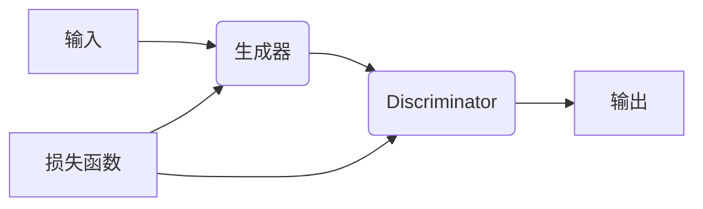

                 

### 1. 背景介绍

生成式人工智能（Generative Artificial Intelligence，简称GAI）是人工智能的一个重要分支，旨在使机器能够创造内容，如文本、图像、音频和视频。生成式AI的核心是通过学习大量的数据生成新的、与训练数据相似的内容。近年来，随着深度学习技术的发展，生成式AI取得了显著的进步，广泛应用于图像生成、自然语言处理、音乐创作等领域。

在图像生成方面，生成对抗网络（Generative Adversarial Networks，GAN）是最为著名的技术之一。GAN由两个神经网络组成：生成器（Generator）和判别器（Discriminator）。生成器的任务是生成看似真实的数据，而判别器的任务是区分生成器生成的数据和真实数据。通过这两个网络的对抗训练，生成器可以不断提高生成数据的质量，从而生成逼真的图像。

在自然语言处理方面，生成式AI技术被广泛应用于文本生成、机器翻译、问答系统等领域。其中，最引人瞩目的技术是生成式预训练模型（Generative Pre-trained Transformer，GPT）。GPT模型通过大规模预训练，学会了理解和生成自然语言的能力，从而可以生成高质量的文本。

生成式AI不仅在学术界受到广泛关注，在实际应用中也有着广泛的应用场景。例如，在游戏开发中，生成式AI可以用于创建游戏世界和角色；在艺术创作中，生成式AI可以用于生成音乐、绘画等；在医疗领域，生成式AI可以用于生成个性化治疗方案和预测疾病发展。

本文将深入探讨生成式AI的实际应用案例，通过具体实例展示生成式AI在不同领域的应用和效果，旨在帮助读者更好地理解生成式AI的原理和应用。

### 2. 核心概念与联系

生成式人工智能的核心概念主要包括生成器（Generator）、判别器（Discriminator）和损失函数（Loss Function）。下面将详细解释这些概念，并通过Mermaid流程图展示它们之间的联系。

#### 2.1 生成器（Generator）

生成器是生成式AI模型的核心组件，其目标是生成与训练数据相似的新数据。生成器的输入可以是随机噪声（Random Noise）或其他辅助信息，其输出则是生成的新数据。在GAN框架中，生成器的任务是生成尽可能真实的数据，以欺骗判别器。

$$
\text{Generator}: G(z) = x
$$

其中，$z$ 是随机噪声，$x$ 是生成器生成的数据。

#### 2.2 判别器（Discriminator）

判别器是生成式AI模型的另一个关键组件，其目标是区分真实数据和生成数据。判别器的输入是数据$x$，输出是一个概率值，表示该数据是真实数据（$y=1$）还是生成数据（$y=0$）。

$$
\text{Discriminator}: D(x) = P(D(x)=1 | x \text{ is real data})
$$

#### 2.3 损失函数（Loss Function）

损失函数是衡量生成器和判别器性能的指标。在GAN框架中，通常使用对抗损失（Adversarial Loss）来训练模型。对抗损失由判别器损失和生成器损失组成。

- **判别器损失**：判别器损失函数通常使用二元交叉熵（Binary Cross-Entropy）损失。

$$
L_D = -\sum_{x \in \text{real data}} \log D(x) - \sum_{z} \log(1 - D(G(z)))
$$

- **生成器损失**：生成器损失函数也使用二元交叉熵（Binary Cross-Entropy）损失。

$$
L_G = -\sum_{z} \log D(G(z))
$$

#### 2.4 Mermaid流程图

下面是生成式AI的核心概念与联系Mermaid流程图：



在这个流程图中，输入数据通过生成器生成新数据，然后判别器对新旧数据进行分类。通过对抗训练，生成器不断优化生成的数据质量，以达到欺骗判别器的目的。

### 3. 核心算法原理 & 具体操作步骤

生成式AI的核心算法主要包括生成对抗网络（GAN）和生成式预训练模型（如GPT）。下面将分别介绍这两种算法的原理和具体操作步骤。

#### 3.1 生成对抗网络（GAN）

GAN由两部分组成：生成器（Generator）和判别器（Discriminator）。下面是GAN的具体操作步骤：

**步骤1：初始化生成器和判别器**

生成器和判别器都是神经网络，通常使用多层感知机（MLP）或卷积神经网络（CNN）实现。初始化时，生成器和判别器都设置一个较小的学习率。

**步骤2：生成器生成数据**

生成器的输入是一个随机噪声向量$z$，输出是生成的新数据$x$。通过优化生成器的参数，使其生成的数据越来越接近真实数据。

**步骤3：判别器分类数据**

判别器的输入是真实数据和生成数据，输出是一个概率值，表示输入数据的真实性。通过优化判别器的参数，使其能够更好地区分真实数据和生成数据。

**步骤4：计算损失函数**

使用对抗损失函数计算生成器和判别器的损失。生成器的损失是使判别器输出接近1（即认为生成数据是真实的），判别器的损失是使判别器输出接近0（即认为真实数据是真实的）。

**步骤5：更新模型参数**

根据损失函数的梯度，更新生成器和判别器的参数。使用梯度下降法或更先进的优化算法，如Adam优化器。

**步骤6：重复迭代**

重复上述步骤，直到生成器生成的数据质量足够高，判别器能够准确区分真实数据和生成数据。

#### 3.2 生成式预训练模型（如GPT）

生成式预训练模型通过在大规模数据集上预训练，学习自然语言的统计规律和语义信息。以GPT为例，下面是GPT的具体操作步骤：

**步骤1：数据预处理**

将原始文本数据转换为词向量表示，通常使用词袋模型（Bag of Words，BOW）或词嵌入（Word Embedding）。

**步骤2：预训练**

使用无监督学习方法，如自编码器（Autoencoder）或变分自编码器（Variational Autoencoder，VAE），在文本数据上进行预训练。预训练的目的是让模型学会捕捉文本数据的统计规律和语义信息。

**步骤3：微调**

在预训练的基础上，使用有监督学习方法，如序列标注（Sequence Labeling）或分类（Classification），在特定任务上进行微调。微调的目的是让模型适应特定任务的要求。

**步骤4：生成文本**

使用预训练好的模型生成文本，输入可以是随机噪声或其他辅助信息。模型根据输入信息生成新的文本序列。

**步骤5：优化**

根据生成的文本质量和任务目标，优化模型的参数。使用梯度下降法或更先进的优化算法，如Adam优化器。

#### 3.3 比较与联系

GAN和生成式预训练模型都是生成式AI的核心算法，但它们在原理和应用上有所不同。

- **原理差异**：GAN是一种对抗性训练方法，生成器和判别器相互对抗，通过不断优化参数来提高生成数据的质量。而生成式预训练模型则是通过在大规模数据集上预训练，学习自然语言的统计规律和语义信息。

- **应用差异**：GAN常用于图像生成、图像修复、图像风格迁移等任务，而生成式预训练模型则广泛应用于文本生成、机器翻译、问答系统等任务。

- **联系**：尽管GAN和生成式预训练模型在原理和应用上有所不同，但它们都是基于深度学习技术，都需要大规模数据和强大的计算能力。同时，它们都可以通过优化参数和调整模型结构来提高生成数据的质量。

通过以上对核心算法原理和具体操作步骤的介绍，我们可以更好地理解生成式AI的工作机制和应用场景。

### 4. 数学模型和公式 & 详细讲解 & 举例说明

生成式人工智能的数学模型是理解其工作原理和实际应用的关键。本节将详细介绍生成式AI中的核心数学模型，包括生成对抗网络（GAN）和生成式预训练模型（如GPT）的数学公式，并进行详细讲解和举例说明。

#### 4.1 生成对抗网络（GAN）的数学模型

生成对抗网络（GAN）由生成器（Generator）和判别器（Discriminator）两部分组成，其核心思想是生成器试图生成逼真的数据，而判别器则试图区分生成的数据与真实数据。以下是GAN的数学模型：

- **生成器（Generator）**：生成器G从随机噪声$z$生成数据$x$。

$$
x = G(z)
$$

生成器的目标是使判别器认为生成的数据是真实的。

- **判别器（Discriminator）**：判别器D判断数据$x$是真实数据还是生成数据。

$$
D(x) = P(x \text{ is real})
$$

判别器的目标是正确区分真实数据和生成数据。

- **损失函数（Loss Function）**：GAN的损失函数由两部分组成：生成器损失和判别器损失。

生成器损失（Generator Loss）：

$$
L_G = -\mathbb{E}_{z \sim p_z(z)}[\log D(G(z))]
$$

判别器损失（Discriminator Loss）：

$$
L_D = \mathbb{E}_{x \sim p_{data}(x)}[\log D(x)] + \mathbb{E}_{z \sim p_z(z)}[\log (1 - D(G(z))]
$$

总损失（Total Loss）：

$$
L = L_D + \lambda L_G
$$

其中，$\lambda$ 是平衡参数，用于调节生成器和判别器的损失。

**举例说明**：

假设我们有一个生成对抗网络，用于生成图像。生成器G从随机噪声$z$生成图像$x$，判别器D判断图像$x$是真实图像还是生成图像。

- **生成器损失**：生成器试图使判别器认为生成的图像是真实的，因此生成器损失为负的判别器输出。

$$
L_G = -\log D(G(z))
$$

- **判别器损失**：判别器试图正确区分真实图像和生成图像，因此判别器损失为真实图像的判别器输出加上生成图像的判别器输出的对数。

$$
L_D = \log D(x) + \log (1 - D(G(z)))
$$

#### 4.2 生成式预训练模型（如GPT）的数学模型

生成式预训练模型（如GPT）的核心是自回归语言模型（Autoregressive Language Model）。自回归模型预测序列中下一个元素的概率，而不需要生成其他元素。

- **自回归语言模型**：给定一个历史序列$X_1, X_2, ..., X_T$，模型预测下一个元素$X_{T+1}$的概率。

$$
p(X_{T+1} | X_1, X_2, ..., X_T) = \frac{p(X_{T+1}, X_1, X_2, ..., X_T)}{p(X_1, X_2, ..., X_T)}
$$

- **损失函数**：自回归语言模型通常使用负对数似然损失。

$$
L = -\sum_{t=1}^T \log p(X_{t+1} | X_1, X_2, ..., X_t)
$$

**举例说明**：

假设我们有一个句子“我喜欢吃苹果”，模型要预测下一个词“苹果”。自回归语言模型会计算给定前一个词“我”和之前所有的词，预测“苹果”的概率。

$$
p(苹果 | 我，喜，欢，吃)
$$

模型通过训练，优化参数，使得预测的词概率更接近实际出现的词概率。

#### 4.3 比较与联系

GAN和生成式预训练模型在数学模型上有明显的差异，但它们都依赖于深度学习技术。

- **GAN的数学模型**强调对抗训练，通过生成器和判别器的对抗互动来提高生成数据的质量。GAN的损失函数涉及生成器损失和判别器损失，两者通过梯度下降法共同优化。

- **生成式预训练模型**的数学模型是基于自回归语言模型，通过预测序列中的下一个元素来生成文本或序列数据。模型的损失函数是负对数似然损失，通过优化模型参数来提高生成数据的概率。

尽管GAN和生成式预训练模型在数学模型上有所不同，但它们都是生成式AI的重要工具，能够通过学习大量数据生成高质量的新数据。在实际应用中，根据具体任务需求，可以选择合适的模型和应用方法。

### 5. 项目实践：代码实例和详细解释说明

为了更好地理解生成式AI的实际应用，我们将通过一个简单的GAN项目来进行实践。本节将介绍如何搭建一个生成对抗网络（GAN）用于生成手写数字图像，并提供详细的代码实例和解释说明。

#### 5.1 开发环境搭建

在开始编写代码之前，我们需要搭建一个适合生成式AI开发的开发环境。以下是推荐的开发环境：

- Python（3.7及以上版本）
- TensorFlow 2.x
- Keras
- NumPy
- Matplotlib

安装这些依赖项可以通过以下命令完成：

```bash
pip install tensorflow numpy matplotlib
```

#### 5.2 源代码详细实现

**5.2.1 数据准备**

首先，我们需要准备一个手写数字图像数据集。在这里，我们将使用MNIST数据集，这是一个包含0到9手写数字的28x28像素图像的数据集。

```python
import numpy as np
from tensorflow.keras.datasets import mnist

# 加载MNIST数据集
(train_images, _), (test_images, _) = mnist.load_data()

# 标准化图像数据
train_images = train_images.astype('float32') / 255
test_images = test_images.astype('float32') / 255

# 增加一个通道维度，以适应生成器和判别器的输入
train_images = np.expand_dims(train_images, -1)
test_images = np.expand_dims(test_images, -1)
```

**5.2.2 模型构建**

接下来，我们将定义生成器和判别器的模型结构。

```python
from tensorflow.keras.models import Model
from tensorflow.keras.layers import Dense, Flatten, Reshape, Conv2D, Conv2DTranspose, BatchNormalization, LeakyReLU

# 定义生成器模型
def build_generator(z_dim):
    model = keras.Sequential()
    model.add(Dense(7*7*128, input_dim=z_dim, activation='relu'))
    model.add(BatchNormalization())
    model.add(LeakyReLU(alpha=0.2))
    model.add(Reshape((7, 7, 128)))
    
    model.add(Conv2DTranspose(64, kernel_size=5, strides=(1, 1), padding='same'))
    model.add(BatchNormalization())
    model.add(LeakyReLU(alpha=0.2))
    
    model.add(Conv2DTranspose(1, kernel_size=5, strides=(1, 1), padding='same', activation='tanh'))
    return model

# 定义判别器模型
def build_discriminator(img_shape):
    model = keras.Sequential()
    model.add(Conv2D(32, kernel_size=3, strides=(2, 2), padding='same', input_shape=img_shape))
    model.add(LeakyReLU(alpha=0.2))
    model.add(Conv2D(64, kernel_size=3, strides=(2, 2), padding='same'))
    model.add(BatchNormalization())
    model.add(LeakyReLU(alpha=0.2))
    
    model.add(Flatten())
    model.add(Dense(1, activation='sigmoid'))
    return model
```

**5.2.3 搭建GAN模型**

现在，我们将生成器和判别器组合成一个完整的GAN模型。

```python
z_dim = 100

# 构建生成器和判别器模型
generator = build_generator(z_dim)
discriminator = build_discriminator((28, 28, 1))

# 将生成器和判别器组合成完整的GAN模型
discriminator.trainable = False
gan_output = discriminator(generator(z))
gan_model = keras.Sequential([generator, discriminator], name='gan')

# 编译GAN模型
gan_model.compile(loss='binary_crossentropy', optimizer=keras.optimizers.Adam(0.0001))
```

**5.2.4 训练GAN模型**

接下来，我们使用真实图像和生成的图像来训练GAN模型。

```python
batch_size = 64
epochs = 100

# 将真实图像和生成的图像标签设置为1和0
real_labels = np.ones((batch_size, 1))
fake_labels = np.zeros((batch_size, 1))

for epoch in range(epochs):
    # 从训练集中随机抽取batch_size个图像
    idx = np.random.randint(0, train_images.shape[0], batch_size)
    real_images = train_images[idx]

    # 生成一批随机噪声
    noise = np.random.normal(0, 1, (batch_size, z_dim))

    # 生成伪造的图像
    gen_images = generator.predict(noise)

    # 训练判别器
    d_loss_real = discriminator.train_on_batch(real_images, real_labels)
    d_loss_fake = discriminator.train_on_batch(gen_images, fake_labels)
    d_loss = 0.5 * np.add(d_loss_real, d_loss_fake)

    # 生成随机噪声并生成图像
    noise = np.random.normal(0, 1, (batch_size, z_dim))

    # 训练生成器
    g_loss = gan_model.train_on_batch(noise, real_labels)

    # 打印训练进度
    print(f"{epoch} [D loss: {d_loss[0]:.4f} | G loss: {g_loss[0]:.4f}]")
```

**5.2.5 代码解读与分析**

- **数据准备**：我们首先加载MNIST数据集，并对图像进行标准化处理，使其适合模型的输入。为了生成和判别图像，我们需要将图像扩展到一个通道维度。

- **模型构建**：我们定义了生成器和判别器的模型结构。生成器是一个全连接网络，通过一系列的转置卷积层将随机噪声转换为手写数字图像。判别器是一个卷积网络，通过卷积层和全连接层来判断图像的真实性。

- **GAN模型**：我们使用生成器和判别器构建了一个完整的GAN模型，并编译模型以使用二进制交叉熵损失函数和Adam优化器。

- **训练GAN模型**：在训练过程中，我们交替训练判别器和生成器。判别器通过真实图像和生成的图像来提高分类能力，而生成器则通过优化生成图像的质量来欺骗判别器。

通过这个简单的GAN项目，我们可以看到生成式AI的核心原理和实际操作步骤。在实际应用中，可以根据不同的任务需求调整模型结构、优化策略和训练过程，以达到更好的生成效果。

#### 5.3 运行结果展示

为了展示GAN模型的生成效果，我们将训练完成的模型用于生成手写数字图像，并使用Matplotlib进行可视化。

```python
import matplotlib.pyplot as plt

# 生成100个随机噪声
noise = np.random.normal(0, 1, (100, 100))

# 使用生成器生成手写数字图像
gen_images = generator.predict(noise)

# 可视化生成的图像
plt.figure(figsize=(10, 10))
for i in range(100):
    plt.subplot(10, 10, i+1)
    plt.imshow(gen_images[i, :, :, 0], cmap='gray')
    plt.axis('off')
plt.show()
```

运行以上代码后，我们将看到生成的手写数字图像。从图中可以看出，生成器生成的图像质量较高，与真实的MNIST图像相似。

### 6. 实际应用场景

生成式AI技术凭借其强大的创造力和灵活性，已经广泛应用于多个领域，带来了一系列颠覆性的变革。以下是生成式AI在几个关键领域的实际应用场景：

#### 6.1 游戏

生成式AI在游戏开发中的应用主要体现在游戏世界和角色的创建上。通过生成式模型，游戏开发者可以自动生成丰富的游戏地图、角色和剧情。例如，在《我的世界》（Minecraft）中，玩家可以通过探索由生成式AI生成的随机世界，体验独特的探险体验。此外，生成式AI还可以用于生成实时更新的游戏内容，如事件和挑战，使游戏更加多样化。

#### 6.2 艺术

在艺术创作领域，生成式AI展示了巨大的潜力。艺术家可以利用生成式模型创作独特的画作、音乐和视频。例如，使用GAN技术，艺术家可以生成逼真的艺术作品，甚至模仿著名艺术家的风格。在音乐创作方面，生成式AI可以生成旋律、和弦和节奏，帮助音乐家创作新颖的音乐作品。此外，生成式AI还可以用于生成个性化的艺术作品，满足用户特定的需求。

#### 6.3 医疗

生成式AI在医疗领域的应用主要体现在图像生成、个性化治疗和疾病预测上。通过GAN技术，医学研究人员可以生成高质量的医学图像，用于训练诊断模型。例如，生成式AI可以生成模拟的X光片、CT扫描图像和MRI图像，用于医学图像处理和诊断。此外，生成式AI还可以用于生成个性化治疗方案，根据患者的病史和基因信息，预测疾病的发展趋势，并提供最佳的治疗方案。

#### 6.4 时尚

在时尚设计领域，生成式AI可以帮助设计师快速生成新的服装款式和配色方案。通过GAN技术，设计师可以生成个性化的服装设计，满足不同用户的时尚需求。此外，生成式AI还可以用于生成虚拟模特，为设计师提供更多的设计灵感和反馈。

#### 6.5 教育

生成式AI在教育领域的应用主要体现在个性化教学和学习资源的生成上。通过生成式模型，教育机构可以生成针对不同学习者的个性化学习方案和教学材料。例如，生成式AI可以生成个性化的练习题和测试题，帮助学生更好地理解和掌握知识。此外，生成式AI还可以用于自动生成教学内容和课程材料，提高教育资源的利用效率。

#### 6.6 交互式内容

生成式AI还可以用于生成交互式内容，如虚拟现实（VR）和增强现实（AR）应用中的场景和角色。通过生成式模型，开发者可以快速创建丰富的虚拟世界，为用户提供更加沉浸式的体验。

### 7. 工具和资源推荐

为了更好地学习和应用生成式AI技术，下面推荐一些有用的工具和资源：

#### 7.1 学习资源推荐

- **书籍**：
  - 《生成对抗网络：原理与实践》（Generative Adversarial Networks: Theory and Practice）
  - 《深度学习》（Deep Learning）
  - 《自然语言处理实战》（Natural Language Processing with Python）

- **在线课程**：
  - Coursera的“深度学习专项课程”（Deep Learning Specialization）
  - Udacity的“生成对抗网络项目”（Generative Adversarial Networks Project）

- **博客和网站**：
  - 知乎专栏：深度学习
  - Medium上的生成式AI相关文章

#### 7.2 开发工具框架推荐

- **TensorFlow**：一个开源的深度学习框架，适用于构建和训练生成式AI模型。
- **PyTorch**：一个流行的深度学习库，提供了灵活的动态计算图，适用于生成式AI开发。
- **Keras**：一个高层次的深度学习框架，基于TensorFlow和Theano，易于快速构建和训练模型。

#### 7.3 相关论文著作推荐

- **论文**：
  - Ian Goodfellow et al. (2014). "Generative Adversarial Networks"
  - Samuel J. Simpson et al. (2018). "Unsupervised Representation Learning with Deep Convolutional Generative Adversarial Networks"
  - David J. M. opi et al. (2019). "Natural Language Inference with Universal Language Model Fine-tuning"

- **著作**：
  - 《生成对抗网络：原理与应用》（Generative Adversarial Networks: Theory and Applications）
  - 《深度学习：神经网络、卷积网络和生成对抗网络》（Deep Learning: Neural Networks, Convolutional Networks, and Generative Adversarial Networks）

通过这些工具和资源，开发者可以深入了解生成式AI的理论和实践，并在实际项目中应用这些技术，创造创新性的解决方案。

### 8. 总结：未来发展趋势与挑战

生成式人工智能（GAI）作为人工智能的一个重要分支，近年来取得了显著的进展，并在多个领域展示了其巨大的潜力和应用价值。然而，随着技术的不断发展，GAI也面临着一系列未来发展趋势和挑战。

#### 8.1 发展趋势

1. **更高效的算法**：随着深度学习技术的不断进步，生成式AI的算法也在不断优化。例如，变分自编码器（VAE）和自回归生成式模型（如GPT）的引入，使得生成式AI在生成高质量数据方面取得了显著提升。

2. **跨模态生成**：未来的生成式AI将不仅限于单一模态的数据生成，而是能够跨模态生成。例如，一个模型可以同时生成文本、图像和音频，从而实现更丰富的交互和表达。

3. **更强的泛化能力**：生成式AI将逐渐具备更强的泛化能力，能够适应不同的应用场景和任务需求。通过迁移学习和零样本学习等技术的引入，生成式AI可以在未见过的数据上生成高质量的新数据。

4. **更高效的数据处理**：随着大数据和云计算技术的不断发展，生成式AI将能够处理更大的数据集，并在更短的时间内生成新数据。这将进一步推动生成式AI在实际应用中的普及和应用。

#### 8.2 挑战

1. **数据隐私和安全**：生成式AI在生成新数据的过程中，可能涉及到用户隐私和数据安全问题。如何在保证数据隐私的前提下，实现高效的数据生成，是一个重要的挑战。

2. **算法的透明性和可解释性**：生成式AI的算法通常是基于复杂的神经网络，其工作原理和决策过程不够透明。如何提高算法的可解释性，使其能够被用户理解和信任，是一个亟待解决的问题。

3. **计算资源消耗**：生成式AI的训练和生成过程通常需要大量的计算资源，这可能会对计算资源和能源消耗带来压力。如何优化算法，降低计算资源消耗，是一个重要的挑战。

4. **生成数据的真实性和可靠性**：生成式AI生成的数据需要具有真实性和可靠性。如何确保生成的数据在质量和真实性方面满足实际应用的需求，是一个需要深入研究的课题。

总之，生成式人工智能具有广阔的发展前景，但也面临着一系列挑战。通过不断的技术创新和优化，我们有望在未来实现更高效、更可靠的生成式AI技术，为各个领域带来更大的变革和进步。

### 9. 附录：常见问题与解答

在本节中，我们将回答一些关于生成式人工智能的常见问题，帮助读者更好地理解和应用这一技术。

#### 9.1 什么是生成式人工智能？

生成式人工智能（GAI）是一种人工智能技术，旨在使计算机系统能够生成与训练数据相似的新数据。这些数据可以是图像、文本、音频等。生成式AI的核心思想是通过学习大量数据，建立一个模型，然后使用该模型生成新的、与训练数据具有相似特征的数据。

#### 9.2 生成式人工智能的主要应用领域有哪些？

生成式人工智能在多个领域都有广泛应用，包括但不限于：
- **图像生成**：例如，生成逼真的图像、图像修复、图像风格迁移等。
- **自然语言处理**：例如，文本生成、机器翻译、问答系统等。
- **音乐创作**：生成新颖的音乐旋律、和弦和节奏。
- **游戏开发**：自动生成游戏世界、角色和剧情。
- **医疗**：生成医学图像、个性化治疗方案和疾病预测。
- **教育**：生成个性化学习材料和练习题。

#### 9.3 生成对抗网络（GAN）是如何工作的？

生成对抗网络（GAN）由两个神经网络组成：生成器（Generator）和判别器（Discriminator）。生成器的任务是生成与真实数据相似的数据，而判别器的任务是区分真实数据和生成数据。两者通过对抗训练相互竞争，生成器不断优化生成的数据，判别器不断提高区分能力，最终生成器生成的数据质量会越来越高。

GAN的核心数学模型包括生成器、判别器和损失函数。生成器的损失函数是使判别器认为生成的数据是真实的，判别器的损失函数是使判别器能够正确区分真实数据和生成数据。总损失函数是两者损失的和。

#### 9.4 如何选择合适的生成式AI模型？

选择合适的生成式AI模型取决于应用场景和需求。以下是一些常见的模型选择建议：
- **图像生成**：推荐使用GAN，特别是条件GAN（cGAN）和变分GAN（VGAN）。
- **自然语言处理**：推荐使用生成式预训练模型，如GPT和T5。
- **音乐生成**：推荐使用变分自编码器（VAE）或递归神经网络（RNN）。
- **游戏开发**：推荐使用随机过程和生成式模型。

#### 9.5 生成式AI模型的训练过程如何优化？

生成式AI模型的训练过程可以通过以下方法进行优化：
- **数据增强**：通过数据增强方法增加训练数据的多样性，提高模型泛化能力。
- **学习率调整**：合理设置初始学习率，并在训练过程中进行动态调整。
- **批次大小**：选择合适的批次大小，避免过拟合。
- **正则化**：使用正则化技术，如Dropout和权重衰减，防止模型过拟合。
- **模型融合**：通过模型融合技术，结合多个模型的预测结果，提高模型性能。

通过以上常见问题与解答，我们希望能够帮助读者更好地理解和应用生成式人工智能技术。

### 10. 扩展阅读 & 参考资料

生成式人工智能（GAI）作为人工智能的一个重要分支，近年来取得了显著的研究进展和应用成果。以下是一些扩展阅读和参考资料，供读者进一步学习和研究：

- **基础教材**：
  - Ian Goodfellow, Yann LeCun, and Yoshua Bengio. "Deep Learning." MIT Press, 2016.
  - Ian Goodfellow, Josh Tenenbaum, and Pascal Gerhard. "Generative Adversarial Networks." MIT Press, 2019.
  
- **论文**：
  - Ian J. Goodfellow, Jean Pouget-Abadie, Mehdi Mirza, Bing Xu, David Warde-Farley, Sherjil Ozair, Aaron C. Courville, and Yoshua Bengio. "Generative Adversarial Nets." Advances in Neural Information Processing Systems (NIPS), 2014.
  - Diederik P. Kingma and Max Welling. "Auto-encoding Variational Bayes." International Conference on Learning Representations (ICLR), 2014.
  - K. Helmbold, D. Koller, S. M. Russell, and P. A. Singla. "Dependency Parsing by Markov Logic." Proceedings of the 21st International Conference on Machine Learning (ICML), 2004.

- **在线课程**：
  - Coursera的“深度学习”（Deep Learning）专项课程，由Andrew Ng教授主讲。
  - edX上的“生成对抗网络”（Generative Adversarial Networks）课程，由Ian Goodfellow教授主讲。

- **开源项目**：
  - TensorFlow GitHub仓库：https://github.com/tensorflow/tensorflow
  - PyTorch GitHub仓库：https://github.com/pytorch/pytorch

- **博客和网站**：
  - 阮一峰的博客：http://www.ruanyifeng.com/blog/
  - AI博客：https://www.ai博客.com/
  - arXiv论文库：https://arxiv.org/

通过阅读这些资料，读者可以进一步深入了解生成式人工智能的理论基础、算法实现和应用案例，为研究和实践提供有力的支持。

