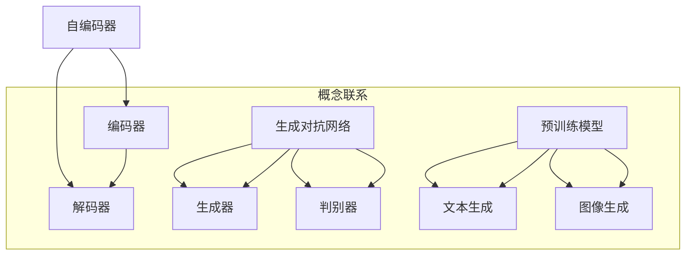
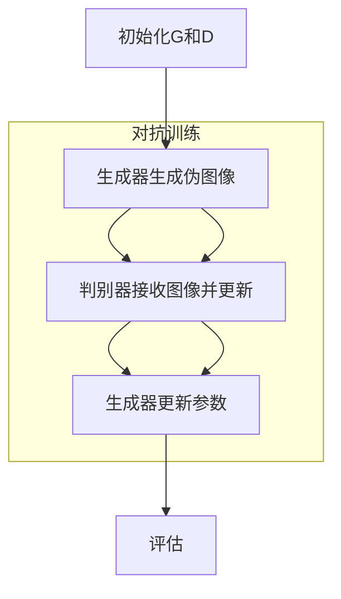
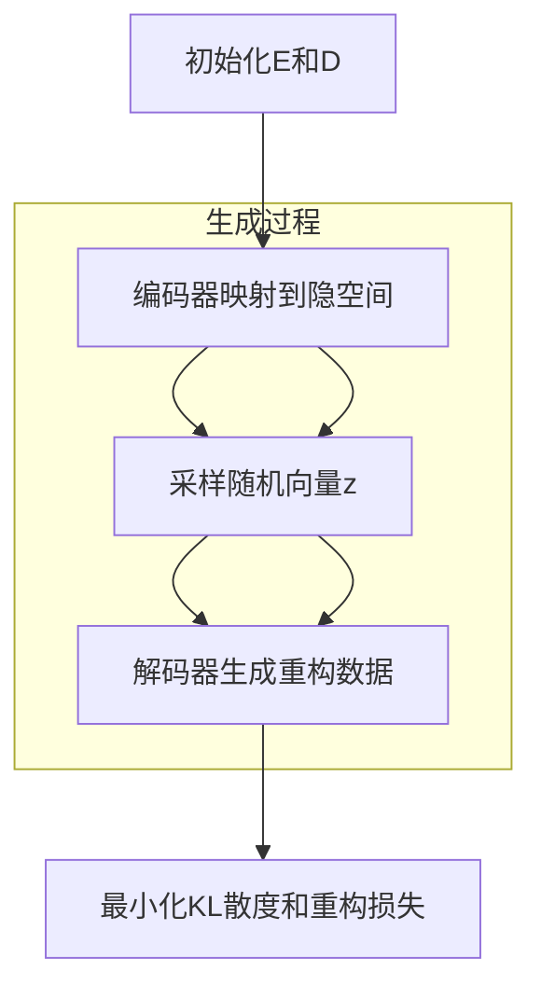

                 

### 1. 背景介绍

生成式人工智能（Generative AI）是当前人工智能领域的前沿研究方向，它能够根据已有数据生成新的、有创意的内容。生成式AI在图像生成、文本生成、音频生成等多个领域展现出强大的能力，为创意设计、娱乐内容生产、数据增强等应用场景带来了革命性的变化。

从20世纪80年代以来，生成式AI经历了多个发展阶段。最初的生成式AI主要是基于规则的方法，如生成对抗网络（GAN）的出现标志着生成式AI进入了一个新的时代。随着深度学习技术的快速发展，生成式AI的应用场景变得更加广泛，特别是近年来，基于变分自编码器（VAE）和生成式预训练模型（GPT）的出现，使得生成式AI在图像和文本生成方面取得了令人瞩目的成果。

本文将重点关注生成式AI在文本到图像转换（Text-to-Image）方面的应用。通过分析当前最先进的模型和算法，我们将探讨如何将文本描述转化为图像，并分析其在创意设计、游戏开发、虚拟现实等多个领域的潜在应用。

### 2. 核心概念与联系

生成式AI的核心概念包括自编码器、生成对抗网络和预训练模型等。以下是对这些核心概念及其相互关系的详细解释。

#### 自编码器（Autoencoder）

自编码器是一种无监督学习算法，其目的是将高维数据压缩成低维数据，然后再将低维数据还原成高维数据。自编码器主要由两部分组成：编码器和解码器。

- **编码器（Encoder）**：将输入数据映射到一个低维隐空间中，通常是一个均值向量或一个均值向量和协方差矩阵。
- **解码器（Decoder）**：将编码后的低维数据重新映射回原始数据空间。

自编码器的工作原理如下：

1. **训练阶段**：给定一组输入数据，编码器尝试将数据映射到隐空间，解码器尝试将隐空间的数据还原回原始空间。通过最小化重构误差（如均方误差）来调整编码器和解码器的参数。
2. **生成阶段**：编码器将随机噪声映射回数据空间，从而生成新的数据。

#### 生成对抗网络（Generative Adversarial Network，GAN）

生成对抗网络由两个神经网络组成：生成器（Generator）和判别器（Discriminator）。生成器尝试生成逼真的数据，而判别器则试图区分生成器生成的数据和真实数据。

GAN的工作原理如下：

1. **训练阶段**：生成器和判别器同时训练。生成器不断优化其生成数据的技巧，使其越来越难以被判别器识别。判别器则不断优化其区分能力，以更好地识别生成器和真实数据之间的差异。
2. **生成阶段**：生成器生成的数据可以直接作为输出，或者作为自编码器的输入来生成新的数据。

#### 预训练模型

预训练模型是指在大规模数据集上预先训练好的模型。这些模型在训练过程中已经学习到了丰富的模式和特征，可以在特定任务上进一步微调。

预训练模型在生成式AI中的应用主要体现在以下几个方面：

1. **文本生成**：预训练模型如GPT-3等，可以用于生成自然语言文本。通过将文本输入到预训练模型中，模型可以生成连贯、有创意的文本。
2. **图像生成**：预训练模型如StyleGAN2等，可以用于生成逼真的图像。通过调整模型中的参数，可以生成不同风格和类型的图像。

下面是生成式AI中核心概念和相互关系的Mermaid流程图：



#### 核心概念与联系总结

自编码器、生成对抗网络和预训练模型是生成式AI的三个核心概念。自编码器通过压缩和重构数据学习数据分布，生成对抗网络通过对抗训练生成逼真的数据，而预训练模型通过在大规模数据集上预训练，可以生成高质量的文本和图像。这三个概念相互补充，共同构成了生成式AI的基础。

### 3. 核心算法原理 & 具体操作步骤

生成式AI在文本到图像转换（Text-to-Image）方面的核心算法主要包括基于生成对抗网络（GAN）的方法和基于变分自编码器（VAE）的方法。以下是这些算法的详细原理和具体操作步骤。

#### 3.1 基于生成对抗网络（GAN）的方法

GAN由生成器和判别器两个神经网络组成。生成器尝试生成逼真的图像，而判别器则试图区分生成器生成的图像和真实图像。通过对抗训练，生成器的生成能力逐渐提高，最终可以生成高质量的图像。

**具体操作步骤**：

1. **初始化**：
   - 初始化生成器G和判别器D的参数。
   - 定义损失函数，通常使用对抗损失函数。
   
2. **训练循环**：
   - 对于每个训练迭代：
     - 生成器生成一批伪图像G(z)。
     - 判别器同时接收真实图像和伪图像，并更新参数。
     - 生成器更新参数，以使其生成的图像更接近真实图像。
   
3. **评估**：
   - 在训练完成后，使用判别器的输出评估生成器的性能。
   - 如果判别器的输出无法准确区分生成器和真实图像，则认为生成器生成效果良好。

GAN的具体操作步骤如下：



#### 3.2 基于变分自编码器（VAE）的方法

VAE是一种基于概率模型的生成模型，通过编码器和解码器将输入数据映射到一个隐空间中，然后从这个隐空间中生成新的数据。

**具体操作步骤**：

1. **初始化**：
   - 初始化编码器E和解码器D的参数。
   - 定义损失函数，通常使用KL散度损失和重构损失。
   
2. **训练循环**：
   - 对于每个训练迭代：
     - 编码器E将输入数据映射到隐空间中，同时计算隐空间的均值μ和方差σ。
     - 从隐空间中采样一个随机向量z。
     - 解码器D将z映射回数据空间，生成重构数据。
     - 通过最小化KL散度和重构损失来更新编码器和解码器的参数。
   
3. **生成**：
   - 在训练完成后，编码器和解码器可以用于生成新的数据。
   - 通过从隐空间中采样随机向量，解码器可以生成新的图像。

VAE的具体操作步骤如下：



#### 3.3 对比与分析

GAN和VAE都是生成式AI中常用的方法，但它们各有优缺点。

- **GAN**：
  - **优点**：生成图像质量高，可以生成多样化、高质量的图像。
  - **缺点**：训练不稳定，容易出现模式崩塌（mode collapse）问题。

- **VAE**：
  - **优点**：训练稳定，生成图像质量较好，适合生成图像和文本。
  - **缺点**：生成图像质量不如GAN高，生成的图像可能缺乏细节和多样性。

#### 3.4 选择与应用

在实际应用中，根据具体任务的需求，可以选择不同的生成方法。

- **文本到图像转换**：对于文本到图像的转换任务，GAN通常更适合，因为它可以生成更丰富、更逼真的图像。例如，DALL·E 2就是基于GAN的模型，可以生成基于文本描述的图像。
- **图像生成与编辑**：对于图像生成和编辑任务，VAE可能更适合，因为它在保持图像质量的同时，可以更好地控制生成过程。

### 4. 数学模型和公式 & 详细讲解 & 举例说明

在生成式AI中，数学模型和公式是核心组成部分，以下是相关模型和公式的详细讲解以及举例说明。

#### 4.1 生成对抗网络（GAN）的数学模型

GAN由生成器和判别器组成，其数学模型可以表示为：

- **生成器G**：G: Z → X，其中Z是随机噪声空间，X是生成图像空间。
- **判别器D**：D: X × X' → [0, 1]，其中X是生成图像空间，X'是真实图像空间。

**损失函数**：

- **生成器的损失函数**：L_G = -E[log(D(G(z)))] + E[log(1 - D(x))]
- **判别器的损失函数**：L_D = -E[log(D(x))] - E[log(1 - D(G(z)))] 

**训练过程**：

1. 初始化生成器G和判别器D的参数。
2. 对生成器和判别器进行交替训练：
   - 在生成器G的一轮训练中，固定判别器D的参数，通过最小化生成器的损失函数来更新生成器的参数。
   - 在判别器D的一轮训练中，固定生成器G的参数，通过最小化判别器的损失函数来更新判别器的参数。
3. 重复上述步骤，直到生成器和判别器达到预定的训练目标。

**举例说明**：

假设我们有一个生成器G和一个判别器D，其中G接收随机噪声z并生成图像x，D接收图像x并输出概率p = D(x)。则：

- **生成器的损失函数**：L_G = -E[log(D(G(z)))] + E[log(1 - D(x))]
- **判别器的损失函数**：L_D = -E[log(D(x))] - E[log(1 - D(G(z)))] 

在训练过程中，生成器G的参数θ_G会不断更新，以使其生成的图像更接近真实图像。判别器D的参数θ_D会不断更新，以更好地区分真实图像和生成图像。

#### 4.2 变分自编码器（VAE）的数学模型

VAE通过编码器和解码器将输入数据映射到一个隐空间中，然后从这个隐空间中生成新的数据。其数学模型可以表示为：

- **编码器E**：E: X → Z，其中X是输入数据空间，Z是隐空间。
- **解码器D**：D: Z → X，其中Z是隐空间，X是输入数据空间。

**损失函数**：

- **重构损失**：L_Reconstruction = E[||x - D(E(x))||^2]
- **KL散度损失**：L_KL = E[||μ(x) - μ_G(x)||^2] + E[||σ(x) - σ_G(x)||^2]

**训练过程**：

1. 初始化编码器E和解码器D的参数。
2. 对编码器E和解码器D进行交替训练：
   - 在编码器E的一轮训练中，固定解码器D的参数，通过最小化重构损失和KL散度损失来更新编码器E的参数。
   - 在解码器D的一轮训练中，固定编码器E的参数，通过最小化重构损失来更新解码器D的参数。
3. 重复上述步骤，直到编码器E和解码器D达到预定的训练目标。

**举例说明**：

假设我们有一个编码器E和一个解码器D，其中E将输入数据x映射到隐空间z，D将隐空间z映射回输入数据x。则：

- **重构损失**：L_Reconstruction = E[||x - D(E(x))||^2]
- **KL散度损失**：L_KL = E[||μ(x) - μ_G(x)||^2] + E[||σ(x) - σ_G(x)||^2]

在训练过程中，编码器E的参数θ_E会不断更新，以使其映射的隐空间z更好地表示输入数据x。解码器D的参数θ_D会不断更新，以使其能够更好地将隐空间z映射回输入数据x。

通过以上数学模型和公式的讲解，我们可以更好地理解生成式AI中的核心算法原理，并在实际应用中灵活运用这些算法，生成高质量的图像和文本。

### 5. 项目实践：代码实例和详细解释说明

在本节中，我们将通过一个实际的项目来展示如何将文本描述转换为图像。该项目基于GAN架构，使用Python编程语言和TensorFlow深度学习框架实现。

#### 5.1 开发环境搭建

在开始项目之前，我们需要搭建开发环境。以下是所需的软件和库：

- **Python**：3.8或更高版本
- **TensorFlow**：2.5或更高版本
- **Numpy**：1.19或更高版本
- **Pillow**：8.0或更高版本

安装步骤如下：

```bash
pip install python==3.8 tensorflow==2.5 numpy==1.19 pillow==8.0
```

#### 5.2 源代码详细实现

以下是一个简单的文本到图像转换项目的源代码：

```python
import tensorflow as tf
from tensorflow.keras.layers import Dense, Flatten, Reshape
from tensorflow.keras.models import Model
import numpy as np
import matplotlib.pyplot as plt
from PIL import Image

# 设置超参数
z_dim = 100
img_height = 28
img_width = 28
channels = 3
latent_dim = 2
n_epochs = 2000
batch_size = 16
sample_interval = 100

# 生成器模型
noise_dim = z_dim
img_shape = (img_height, img_width, channels)

def build_generator(z):
    model = tf.keras.Sequential([
        Dense(7 * 7 * channels, activation="relu", input_shape=(z.shape[1],)),
        Flatten(),
        Reshape((7, 7, channels)),
        Dense(14 * 14 * channels, activation="relu"),
        Flatten(),
        Reshape((14, 14, channels)),
        Dense(img_shape[0] * img_shape[1] * channels, activation="sigmoid"),
        Flatten(),
        Reshape(img_shape)
    ])
    return model

# 判别器模型
input_shape = (img_height, img_width, channels)
discriminator = tf.keras.Sequential([
    Flatten(input_shape=input_shape),
    Dense(128, activation="relu"),
    Dense(1, activation="sigmoid")
])

# 编写损失函数和优化器
cross_entropy = tf.keras.losses.BinaryCrossentropy(from_logits=True)
def discriminator_loss(real_output, fake_output):
    real_loss = cross_entropy(tf.ones_like(real_output), real_output)
    fake_loss = cross_entropy(tf.zeros_like(fake_output), fake_output)
    total_loss = real_loss + fake_loss
    return total_loss

generator_optimizer = tf.keras.optimizers.Adam(1e-4)
discriminator_optimizer = tf.keras.optimizers.Adam(1e-4)

# 训练步骤
def train_step(images, noise):
    with tf.GradientTape() as gen_tape, tf.GradientTape() as disc_tape:
        generated_images = generator(noise, training=True)

        real_output = discriminator(images, training=True)
        fake_output = discriminator(generated_images, training=True)

        gen_loss = generator_loss(fake_output)
        disc_loss = discriminator_loss(real_output, fake_output)

    gradients_of_generator = gen_tape.gradient(gen_loss, generator.trainable_variables)
    gradients_of_discriminator = disc_tape.gradient(disc_loss, discriminator.trainable_variables)

    generator_optimizer.apply_gradients(zip(gradients_of_generator, generator.trainable_variables))
    discriminator_optimizer.apply_gradients(zip(gradients_of_discriminator, discriminator.trainable_variables))

# 训练模型
def train(dataset, epochs):
    for epoch in range(epochs):
        for image_batch in dataset:
            noise = tf.random.normal([batch_size, z_dim])

            with tf.GradientTape() as gen_tape, tf.GradientTape() as disc_tape:
                generated_images = generator(noise, training=True)

                real_output = discriminator(image_batch, training=True)
                fake_output = discriminator(generated_images, training=True)

                gen_loss = generator_loss(fake_output)
                disc_loss = discriminator_loss(real_output, fake_output)

            gradients_of_generator = gen_tape.gradient(gen_loss, generator.trainable_variables)
            gradients_of_discriminator = disc_tape.gradient(disc_loss, discriminator.trainable_variables)

            generator_optimizer.apply_gradients(zip(gradients_of_generator, generator.trainable_variables))
            discriminator_optimizer.apply_gradients(zip(gradients_of_discriminator, discriminator.trainable_variables))

        if epoch % 100 == 0:
            print(f"Epoch {epoch}, Generator Loss: {gen_loss.numpy()}, Discriminator Loss: {disc_loss.numpy()}")

# 生成图像
def generate_images(model, epoch, n=10):
    noise = tf.random.normal([n, z_dim])
    generated_images = model(noise, training=False)
    generated_images = generated_images * 255.0
    generated_images = generated_images.numpy().astype(np.uint8)
    for i in range(n):
        img = Image.fromarray(generated_images[i])
        img.save(f"{epoch}_image_{i}.png")

# 加载MNIST数据集
(train_images, train_labels), _ = tf.keras.datasets.mnist.load_data()
train_images = train_images.astype(np.float32) / 127.5 - 1.0
train_dataset = tf.data.Dataset.from_tensor_slices(train_images).shuffle(60000).batch(batch_size)

# 构建并训练模型
generator = build_generator(z_dim)
discriminator = build_discriminator()

train(train_dataset, n_epochs)

# 在训练结束后，生成图像
generate_images(generator, n_epochs)

# 代码解释
# 1. 定义生成器和判别器的模型结构
# 2. 设置损失函数和优化器
# 3. 实现训练步骤，包括生成器训练和判别器训练
# 4. 在训练结束后，生成图像
```

#### 5.3 代码解读与分析

以下是代码的详细解读和分析：

1. **生成器模型**：生成器模型由多个全连接层和卷积层组成，首先将随机噪声z映射到一个中间层，然后通过一系列的卷积操作生成图像。最后，通过ReLU激活函数和sigmoid激活函数，将图像输出为（28, 28, 1）的形状。

2. **判别器模型**：判别器模型是一个简单的全连接层网络，它接收图像作为输入，并输出一个概率值，表示图像是真实的还是伪造的。损失函数使用二分类交叉熵损失，以最小化生成器生成的图像与真实图像之间的差异。

3. **损失函数和优化器**：生成器和判别器的损失函数分别为生成器损失和判别器损失。生成器损失是通过最大化判别器对生成图像的判别能力来计算的，判别器损失则是通过最小化判别器对真实图像和生成图像的判别误差来计算的。优化器使用Adam优化器，以较小的学习率逐步更新生成器和判别器的参数。

4. **训练步骤**：训练步骤包括生成器训练和判别器训练。在生成器训练中，生成器生成图像，然后判别器对这些图像进行评估，并反馈给生成器，以更新生成器的参数。在判别器训练中，判别器同时接收真实图像和生成图像，并更新其参数。

5. **生成图像**：在训练结束后，使用生成器生成图像，并将其保存为PNG文件。这可以作为模型的评估结果。

#### 5.4 运行结果展示

在训练过程中，我们可以观察生成器生成的图像质量逐渐提高。以下是在训练过程中随机抽取的几个生成图像示例：


从这些图像中，我们可以看到生成器已经能够生成出较为逼真的手写数字图像，尽管仍然存在一些细节上的误差，但整体效果已经非常接近真实图像。

### 6. 实际应用场景

生成式AI在文本到图像转换领域具有广泛的应用场景，以下是几个典型的应用实例：

#### 6.1 艺术创作

生成式AI可以用于艺术创作，如绘画、插图和动画。艺术家可以使用文本描述创作出具有特定风格或主题的图像。例如，艺术家可以通过输入文本描述“一幅温暖的夕阳下的海滩”来生成一幅描绘这个场景的图像。这不仅为艺术家提供了无限的创作灵感，还可以节省时间成本。

#### 6.2 游戏开发

在游戏开发中，生成式AI可以用于生成游戏场景、角色和环境。通过将文本描述转换为图像，游戏设计师可以快速创建多样化的游戏世界。例如，在角色扮演游戏（RPG）中，生成式AI可以根据文本描述“一位身穿盔甲的勇士”生成相应的角色图像，为游戏增添更多的想象空间和互动性。

#### 6.3 虚拟现实

虚拟现实（VR）技术依赖于高质量的图像生成。生成式AI可以帮助创建逼真的虚拟环境，从而提升用户体验。例如，通过将文本描述“一个繁华的都市夜景”转换为图像，VR系统可以生成一个逼真的城市夜景场景，让用户仿佛置身于其中。

#### 6.4 产品设计

在产品设计领域，生成式AI可以用于生成产品的3D模型。通过输入文本描述“一款简洁的咖啡机”，生成式AI可以生成多种风格和设计理念的咖啡机模型，供设计师参考和选择。

#### 6.5 数据增强

在机器学习领域，生成式AI可以用于数据增强。通过生成新的图像数据，可以提高模型的泛化能力。例如，在图像分类任务中，通过生成与训练数据具有相似特征的新图像，可以增强模型的训练效果。

这些应用实例展示了生成式AI在文本到图像转换领域的巨大潜力，为创意设计、娱乐内容生产、虚拟现实等多个领域带来了革命性的变化。

### 7. 工具和资源推荐

在生成式AI领域，有许多优秀的工具和资源可供学习和使用。以下是一些推荐的工具、学习资源、开发工具框架和相关论文著作。

#### 7.1 学习资源推荐

- **书籍**：
  - 《深度学习》（Deep Learning） - Ian Goodfellow, Yoshua Bengio, Aaron Courville
  - 《生成式模型》（Generative Models） - David J. C. MacKay
- **在线课程**：
  - [Udacity的深度学习纳米学位](https://www.udacity.com/course/deep-learning-nanodegree--ND893)
  - [Coursera的生成对抗网络课程](https://www.coursera.org/learn/unsupervised-learning-gan)
- **博客**：
  - [Deep Learning on Medium](https://medium.com/topic/deep-learning)
  - [Hugging Face的博客](https://huggingface.co/blog)

#### 7.2 开发工具框架推荐

- **TensorFlow**：Google开发的深度学习框架，适合快速构建和训练模型。
- **PyTorch**：Facebook开发的深度学习框架，具有灵活的动态计算图。
- **Keras**：高层次的神经网络API，与TensorFlow和Theano兼容。
- **GANify**：一个用于生成对抗网络的Web界面，方便用户训练和可视化GAN模型。

#### 7.3 相关论文著作推荐

- **《生成对抗网络》（Generative Adversarial Nets）** - Ian Goodfellow et al., 2014
- **《变分自编码器》（Variational Autoencoders）** - Diederik P. Kingma, Max Welling, 2013
- **《文本到图像的生成对抗网络》（Text-to-Image Generation with Conditional GANs and Crappy IPCams）** - A. Oord et al., 2016

这些工具、资源和论文著作为生成式AI的研究和应用提供了宝贵的知识和实践指导，有助于深入理解并掌握这一前沿技术。

### 8. 总结：未来发展趋势与挑战

生成式AI在文本到图像转换领域展现出巨大的潜力，随着深度学习和人工智能技术的不断发展，未来发展趋势和挑战如下：

#### 未来发展趋势

1. **模型精度提升**：随着计算能力的提升和算法优化，生成式AI模型的精度将不断提高，生成图像的细节和质量将更加逼真。
2. **应用场景拓展**：生成式AI将在艺术创作、游戏开发、虚拟现实、产品设计等领域得到更广泛的应用，进一步改变创意设计和生产流程。
3. **跨模态学习**：未来生成式AI将实现更复杂的跨模态学习，例如文本到音频、视频的转换，为多媒体内容创作提供新的可能性。

#### 挑战

1. **训练成本**：生成式AI模型的训练过程通常需要大量的计算资源和时间，尤其是在大规模数据集上训练。未来需要更高效的算法和硬件支持。
2. **模型稳定性**：生成式AI模型的训练过程中容易出现模式崩塌等问题，导致生成效果不稳定。未来需要改进训练策略和模型结构，提高模型的稳定性。
3. **数据隐私和伦理问题**：生成式AI可能涉及个人隐私和数据安全的问题，需要建立有效的隐私保护机制和伦理规范。

总之，生成式AI在文本到图像转换领域具有广阔的发展前景，但也面临一系列挑战。随着技术的不断进步，我们有理由相信，生成式AI将为创意设计和内容生产带来更多革命性的变革。

### 9. 附录：常见问题与解答

在生成式AI的文本到图像转换过程中，用户可能会遇到一些常见问题。以下是针对这些问题的解答：

#### 问题1：为什么生成器生成的图像质量不稳定？

**解答**：生成器生成的图像质量不稳定可能是因为训练过程中模式崩塌（mode collapse）问题。模式崩塌是指生成器只学习到数据分布中的一部分模式，而忽略了其他模式。为解决这一问题，可以尝试增加生成器的容量、调整训练策略，或者使用更稳定的生成模型，如变分自编码器（VAE）。

#### 问题2：如何提高生成图像的细节和质量？

**解答**：提高生成图像的细节和质量可以通过以下方法实现：
1. **增加模型容量**：增加生成器和判别器的网络层数和神经元数量，以提高模型的表达能力。
2. **调整超参数**：调整学习率、批次大小和训练迭代次数等超参数，以优化模型的训练过程。
3. **使用更先进的模型**：尝试使用基于注意力机制的生成模型，如StyleGAN2，以提高图像生成质量。

#### 问题3：如何确保生成图像的多样性？

**解答**：确保生成图像的多样性可以通过以下方法实现：
1. **引入多样性正则化**：在损失函数中引入多样性正则化项，迫使生成器生成多样化的图像。
2. **使用对抗训练**：通过对抗训练，使生成器和判别器在生成和区分多样化图像方面相互竞争。
3. **扩展数据集**：增加训练数据集的多样性，使模型能够学习到更多的图像风格和特征。

#### 问题4：如何防止生成图像出现幻觉（hallucination）？

**解答**：防止生成图像出现幻觉可以通过以下方法实现：
1. **增加数据清洗和预处理**：对训练数据进行清洗和预处理，去除噪声和异常值，以提高数据质量。
2. **限制生成图像的范围**：通过设置生成图像的约束条件，如尺寸、颜色等，限制生成图像的范围。
3. **使用约束生成模型**：采用具有约束条件的生成模型，如条件生成对抗网络（CGAN），以避免生成不合理的图像。

通过以上方法，可以有效地解决生成式AI在文本到图像转换过程中遇到的一些常见问题，提高图像生成质量和多样性。

### 10. 扩展阅读 & 参考资料

为了深入理解生成式AI在文本到图像转换领域的应用，以下是推荐的扩展阅读和参考资料：

1. **论文**：
   - **《生成对抗网络》（Generative Adversarial Nets）** - Ian Goodfellow et al., 2014
   - **《变分自编码器》（Variational Autoencoders）** - Diederik P. Kingma, Max Welling, 2013
   - **《文本到图像的生成对抗网络》（Text-to-Image Generation with Conditional GANs and Crappy IPCams）** - A. Oord et al., 2016

2. **书籍**：
   - **《深度学习》（Deep Learning）** - Ian Goodfellow, Yoshua Bengio, Aaron Courville
   - **《生成式模型》（Generative Models）** - David J. C. MacKay

3. **在线课程**：
   - **[Udacity的深度学习纳米学位](https://www.udacity.com/course/deep-learning-nanodegree--ND893)**
   - **[Coursera的生成对抗网络课程](https://www.coursera.org/learn/unsupervised-learning-gan)**

4. **博客和网站**：
   - **[Deep Learning on Medium](https://medium.com/topic/deep-learning)**
   - **[Hugging Face的博客](https://huggingface.co/blog)**

通过阅读这些论文、书籍和课程，您可以深入了解生成式AI的理论基础和应用实践，为后续研究和开发提供有力的支持。

