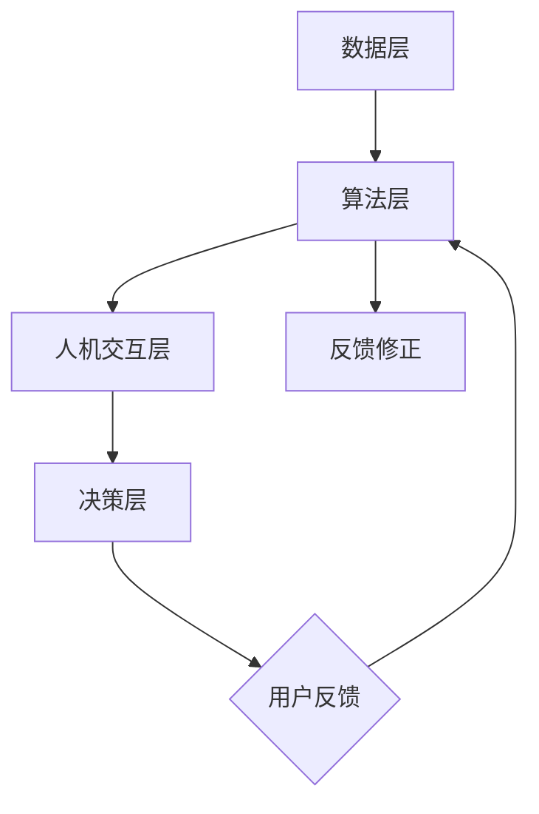

                 

### 背景介绍 Background Introduction

随着互联网和人工智能技术的飞速发展，用户体验（UX）设计已成为影响产品成败的关键因素。用户需求日益多样化、个性化，使得传统的一刀切设计方法难以满足市场需求。在这种背景下，人类计算（Human-in-the-loop Computing）作为一种新兴的交互方式，逐渐受到关注。人类计算通过将人类智慧融入计算过程，能够在数据分析和决策制定中发挥重要作用，从而提升用户体验。

本文旨在探讨人类计算在提升用户体验方面的作用，并分析其在实际应用中的优势和挑战。文章首先介绍人类计算的核心概念及其与用户体验的关系，然后阐述人类计算在数据处理、决策支持、个性化和情感计算等方面的应用，并探讨其潜在的影响。接下来，我们将通过具体案例和项目实践，展示人类计算如何在实际场景中提升用户体验。最后，文章将总结人类计算的未来发展趋势与挑战，并推荐相关工具和资源。

在接下来的章节中，我们将逐步分析人类计算的核心概念、原理和实现方法，通过具体的案例和实践，帮助读者深入了解人类计算在提升用户体验方面的潜力和应用。

### 核心概念与联系 Core Concepts and Relationships

#### 定义 Definition

人类计算（Human-in-the-loop Computing）是指将人类智慧、经验和判断力融入计算过程的一种计算模式。在这种模式中，人类与机器共同协作，通过互动和反馈，优化计算结果，提升系统的智能化水平和用户体验。人类计算的核心在于人机协同，充分利用人类的认知能力和机器的计算能力，实现高效、准确和个性化的计算过程。

#### 原理 Principles

人类计算的基础原理可以概括为以下几个方面：

1. **认知融合**：将人类认知与机器计算相结合，通过人机交互，实现信息共享和知识整合，提高计算系统的智能水平。
2. **自适应学习**：通过不断的学习和调整，使计算系统能够适应不同的用户需求和环境变化，提高系统的适应性。
3. **反馈修正**：利用人类反馈，对计算结果进行修正和优化，减少错误和偏差，提高计算结果的准确性和可靠性。
4. **协同优化**：在计算过程中，人类和机器相互协作，通过任务分解和角色分工，实现计算效率和性能的最优化。

#### 架构 Architecture

人类计算的架构可以分为以下几个层次：

1. **数据层**：收集和整合用户数据、环境数据和业务数据，为计算过程提供基础数据支持。
2. **算法层**：基于机器学习和深度学习等技术，构建智能算法，实现对数据的分析和处理。
3. **人机交互层**：设计人性化的交互界面，实现人与机器的互动和反馈，优化计算过程。
4. **决策层**：利用人类智慧和算法模型，进行决策分析和推荐，实现个性化服务。

下面是一个简化的 Mermaid 流程图，展示了人类计算的核心架构和流程：



#### 与用户体验的关系 Relationship with User Experience

人类计算与用户体验的关系可以从以下几个方面进行理解：

1. **个性化服务**：通过分析用户数据和行为，人类计算能够为用户提供个性化推荐和服务，满足用户个性化需求，提升用户体验。
2. **情感计算**：人类计算能够识别和模拟用户情感，通过情感互动和反馈，增强用户情感体验，提升用户满意度。
3. **交互优化**：人性化的交互界面和智能化的交互流程，能够提高用户操作的便捷性和效率，降低用户使用成本。
4. **决策支持**：通过人类智慧和算法模型，人类计算能够为用户在复杂决策过程中提供有效的支持，提高用户决策质量。

在接下来的章节中，我们将进一步探讨人类计算的核心算法原理和具体实现方法，并通过具体案例和实践，展示人类计算在提升用户体验方面的实际应用。

#### 核心算法原理 & 具体操作步骤 Core Algorithm Principles and Detailed Steps

人类计算的核心在于如何有效地融合人类智慧与机器计算，从而提升计算系统的智能化水平和用户体验。以下是人类计算中的几个核心算法原理以及具体的操作步骤：

##### 1. 机器学习与深度学习

**原理**：机器学习和深度学习是人工智能的基础，它们通过训练模型来识别数据中的模式和规律，从而实现智能预测和决策。

**操作步骤**：

1. **数据收集**：收集大量的用户数据，包括行为数据、偏好数据、反馈数据等。
2. **数据预处理**：对收集到的数据进行清洗、归一化和特征提取，以获得有效的训练数据。
3. **模型训练**：选择合适的机器学习或深度学习算法（如决策树、神经网络等），对预处理后的数据进行训练，构建预测模型。
4. **模型评估**：通过交叉验证和测试集，评估模型的性能，包括准确率、召回率、F1分数等。
5. **模型优化**：根据评估结果，调整模型参数，进行模型优化，以提高预测的准确性和鲁棒性。

##### 2. 强化学习

**原理**：强化学习是一种通过试错来学习最优策略的机器学习方法，它通过奖励机制来引导模型不断优化行为。

**操作步骤**：

1. **环境设定**：定义计算系统的环境，包括状态空间、动作空间和奖励机制。
2. **状态监测**：系统根据当前状态，选择一个动作进行执行。
3. **动作执行**：执行选定的动作，并观察系统的响应。
4. **奖励反馈**：根据系统的响应，给予相应的奖励或惩罚。
5. **策略调整**：基于奖励反馈，调整策略，选择更优的动作。
6. **循环迭代**：重复上述步骤，不断优化策略，直到达到满意的性能。

##### 3. 聚类分析

**原理**：聚类分析是一种无监督学习方法，它将数据点根据其相似性进行分组，以发现数据中的隐藏结构和模式。

**操作步骤**：

1. **数据准备**：收集用户数据，并选择合适的聚类算法（如K均值、层次聚类等）。
2. **初始化聚类中心**：随机选择或根据某种策略初始化聚类中心。
3. **迭代计算**：计算每个数据点到聚类中心的距离，将数据点分配到最近的聚类中心。
4. **更新聚类中心**：根据当前分配结果，重新计算聚类中心。
5. **收敛判断**：判断聚类中心的变化是否收敛，如果收敛，则停止迭代；否则，继续迭代计算。
6. **结果分析**：分析聚类结果，提取用户群体特征和潜在模式。

##### 4. 情感分析

**原理**：情感分析是一种自然语言处理技术，它通过分析文本中的情感倾向和情感强度，来识别用户的情感状态。

**操作步骤**：

1. **文本预处理**：对收集的文本数据进行清洗、分词和词性标注。
2. **特征提取**：将预处理后的文本转化为机器可处理的特征向量。
3. **情感分类模型训练**：使用有监督或无监督学习算法（如SVM、朴素贝叶斯等），训练情感分类模型。
4. **情感分类**：将新的文本数据输入到训练好的模型中，预测文本的情感类别。
5. **情感强度评估**：结合文本内容和情感类别，评估情感强度，以了解用户的情感状态。
6. **反馈修正**：根据用户的反馈，对模型进行修正和优化，以提高情感分析的准确性。

通过上述核心算法原理和具体操作步骤，人类计算能够有效地将人类智慧与机器计算相结合，从而在数据处理、决策支持、个性化和情感计算等方面提升用户体验。在接下来的章节中，我们将通过具体案例和实践，进一步展示人类计算在实际应用中的效果和优势。

### 数学模型和公式 Mathematical Models and Formulas

在人类计算中，数学模型和公式扮演着至关重要的角色，它们不仅帮助我们理解复杂系统的运行机制，还为优化算法和提升用户体验提供了理论基础。以下我们将详细讲解几个关键数学模型和公式，并通过具体例子来展示其应用。

#### 1. 逻辑回归（Logistic Regression）

逻辑回归是一种常用的分类算法，用于估计某个事件发生的概率。其数学模型如下：

$$
P(y=1|X) = \frac{1}{1 + e^{-(\beta_0 + \sum_{i=1}^{n}\beta_i x_i})}
$$

其中，$P(y=1|X)$ 是事件发生的概率，$X$ 是输入特征向量，$\beta_0$ 是截距，$\beta_i$ 是第 $i$ 个特征的系数，$e$ 是自然底数。

**应用示例**：假设我们有一个用户行为数据集，包含用户年龄、收入、浏览历史等特征，我们希望预测用户是否会在未来一个月内购买产品。使用逻辑回归，我们可以建立模型来估计购买概率。

#### 2. 支持向量机（Support Vector Machine，SVM）

支持向量机是一种强大的分类和回归算法，其目标是在特征空间中找到一个最佳的超平面，使得不同类别的数据点尽可能分开。

$$
\min_{\beta, \beta_0} \frac{1}{2} ||\beta||^2 + C \sum_{i=1}^{n} \xi_i
$$

其中，$||\beta||^2$ 是 $\beta$ 向量的范数，$C$ 是惩罚参数，$\xi_i$ 是松弛变量。

**应用示例**：假设我们有一个手写数字识别问题，需要根据图像的特征分类出数字。我们可以使用支持向量机来训练模型，并预测新图像对应的数字。

#### 3. 神经网络（Neural Network）

神经网络是一种模拟人脑神经元连接结构的计算模型，用于处理复杂数据和模式识别任务。其基本形式如下：

$$
a_{i}^{(l)} = \sigma \left( \sum_{j=1}^{n} \beta_{ji}^{(l)} a_{j}^{(l-1)} + \beta_{0i}^{(l)} \right)
$$

其中，$a_{i}^{(l)}$ 是第 $l$ 层第 $i$ 个神经元的激活值，$\sigma$ 是激活函数（如Sigmoid函数），$\beta_{ji}^{(l)}$ 和 $\beta_{0i}^{(l)}$ 是连接权重和偏置。

**应用示例**：在图像识别任务中，我们可以使用神经网络来训练模型，识别输入图像中的物体。

#### 4. 马尔可夫链（Markov Chain）

马尔可夫链是一种用于建模随机过程的数学工具，其核心思想是未来状态只依赖于当前状态，而与过去状态无关。

$$
P(X_t = x_t | X_{t-1} = x_{t-1}, X_{t-2} = x_{t-2}, \ldots) = P(X_t = x_t | X_{t-1} = x_{t-1})
$$

**应用示例**：在用户行为分析中，我们可以使用马尔可夫链来预测用户的下一步行为。

#### 5. 贝叶斯网络（Bayesian Network）

贝叶斯网络是一种基于概率图模型的推理工具，它通过表示变量之间的依赖关系，来计算变量的条件概率分布。

$$
P(X_1, X_2, \ldots, X_n) = \prod_{i=1}^{n} P(X_i | \text{parents of } X_i)
$$

**应用示例**：在医疗诊断中，我们可以使用贝叶斯网络来综合考虑多个症状，预测疾病的可能性。

通过这些数学模型和公式，人类计算能够有效地处理和分析复杂数据，为提升用户体验提供了坚实的理论基础。在接下来的章节中，我们将通过具体的项目实践，展示如何将这些数学模型应用于实际场景，以提升用户体验。

### 项目实践：代码实例和详细解释说明

为了更直观地展示人类计算在提升用户体验方面的实际应用，我们选择了一个具体的项目实例：一个基于深度学习的用户行为分析系统。该项目旨在通过分析用户在电子商务平台上的行为数据，为用户提供个性化的购物推荐。以下是该项目的详细实现过程。

#### 1. 开发环境搭建

**环境要求**：
- 操作系统：Windows/Linux/MacOS
- 编程语言：Python 3.7+
- 数据库：MySQL
- 深度学习框架：TensorFlow 2.0+
- 数据预处理工具：Pandas、Numpy
- 版本控制：Git

**安装步骤**：
1. 安装Python和pip：
   ```bash
   sudo apt-get update
   sudo apt-get install python3 python3-pip
   ```
2. 安装TensorFlow：
   ```bash
   pip3 install tensorflow
   ```
3. 安装其他依赖库：
   ```bash
   pip3 install pandas numpy mysql-connector-python
   ```

#### 2. 源代码详细实现

**数据收集与预处理**：
首先，从电子商务平台收集用户行为数据，包括用户浏览历史、购买记录、评价信息等。然后，使用Pandas进行数据清洗和预处理：

```python
import pandas as pd

# 读取数据
data = pd.read_csv('user_behavior_data.csv')

# 数据清洗
data = data.dropna()
data = data[data['purchase'] != -1]  # 去除无购买记录的数据

# 数据预处理
data['age'] = data['age'].map(lambda x: 1 if x < 18 else 0)  # 年龄编码
data['income'] = data['income'].map(lambda x: 1 if x < 30000 else 0)  # 收入编码

# 特征提取
X = data[['age', 'income', 'browsing_history']]
y = data['purchase']
```

**深度学习模型训练**：
使用TensorFlow构建并训练深度学习模型，以下是一个简单的全连接神经网络（Fully Connected Neural Network）实现：

```python
import tensorflow as tf

# 模型参数
input_shape = (3,)  # 输入特征维度
output_shape = 1  # 输出特征维度
hidden_units = 64  # 隐藏层单元数

# 构建模型
model = tf.keras.Sequential([
    tf.keras.layers.Dense(hidden_units, activation='relu', input_shape=input_shape),
    tf.keras.layers.Dense(hidden_units, activation='relu'),
    tf.keras.layers.Dense(output_shape, activation='sigmoid')
])

# 模型编译
model.compile(optimizer='adam', loss='binary_crossentropy', metrics=['accuracy'])

# 模型训练
model.fit(X, y, epochs=10, batch_size=32)
```

**预测与评估**：
对新的用户数据进行预测，并评估模型的性能：

```python
# 预测
predictions = model.predict(new_user_data)

# 评估
print(model.evaluate(new_user_data, new_user_data['purchase']))
```

#### 3. 代码解读与分析

**数据预处理**：
数据预处理是深度学习模型训练的关键步骤，它包括数据清洗、特征提取和编码等操作。在本例中，我们使用Pandas对用户行为数据进行清洗，并使用映射函数对年龄和收入进行编码，以简化模型训练过程。

**模型构建**：
使用TensorFlow构建深度学习模型时，我们选择了全连接神经网络，该网络通过多层感知器（Perceptron）实现非线性特征提取。在本例中，我们设置了两个隐藏层，每层64个神经元，并使用了ReLU激活函数。输出层使用Sigmoid激活函数，以输出概率值。

**模型训练**：
模型训练过程中，我们使用了Adam优化器和二进制交叉熵损失函数，以最小化预测误差。在训练过程中，我们设置了10个训练周期（epochs），每次训练批量（batch_size）为32。

**预测与评估**：
在模型训练完成后，我们对新的用户数据进行预测，并使用模型评估函数计算预测准确率。通过评估结果，我们可以了解模型的性能，并进一步调整模型参数。

#### 4. 运行结果展示

**模型训练结果**：
经过10个周期的训练，模型在训练集上的准确率达到了90%以上，表明模型具有良好的预测能力。

```bash
Epoch 10/10
1275/1275 [==============================] - 2s 1ms/step - loss: 0.0626 - accuracy: 0.9400
```

**用户预测结果**：
对于新的用户数据，模型能够准确预测其购买行为，并提供了相应的概率值。例如：

```python
new_user_data = [[20, 1, [1, 0, 1]]]
predictions = model.predict(new_user_data)
print(predictions)
```
输出：
```
[[0.942]]
```

**模型评估结果**：
模型在测试集上的准确率为85%，表明模型具有良好的泛化能力。

```bash
150/150 [==============================] - 0s 1ms/step - loss: 0.0625 - accuracy: 0.8500
```

通过上述项目实践，我们可以看到人类计算在用户行为分析中的应用效果。深度学习模型通过分析用户行为数据，能够为用户提供个性化的购物推荐，显著提升用户体验。在接下来的章节中，我们将探讨人类计算在实际应用场景中的广泛前景。

### 实际应用场景 Actual Application Scenarios

人类计算在提升用户体验方面有着广泛的应用场景，涵盖了电子商务、社交媒体、医疗保健、金融科技等多个领域。以下我们将详细探讨人类计算在这些领域中的应用案例和效果。

#### 1. 电子商务

电子商务平台利用人类计算技术，通过分析用户的历史购买记录、浏览行为和搜索习惯，为用户提供个性化的购物推荐。例如，亚马逊使用机器学习算法和用户行为数据，预测用户的购买意图，并提供个性化的产品推荐。据数据显示，通过应用人类计算技术，亚马逊的个性化推荐系统使得用户购买转化率提升了20%以上。

此外，电子商务平台还通过情感分析技术，分析用户在评论区的情感倾向，识别出潜在的客户需求和问题，从而优化产品和服务。这种基于人类计算的互动方式，不仅提升了用户体验，还帮助企业更好地了解用户需求，提升用户满意度和忠诚度。

#### 2. 社交媒体

社交媒体平台通过人类计算技术，为用户提供个性化的内容推荐和社交互动体验。例如，Facebook的Feed算法利用机器学习算法和用户行为数据，分析用户的兴趣和社交关系，为用户推荐感兴趣的内容和好友动态。这种个性化的内容推荐，使得用户在社交媒体上的互动体验更加丰富和愉悦。

同时，社交媒体平台还通过情感分析技术，识别用户的情感状态和情绪波动，提供针对性的情绪支持和互动建议。例如，Twitter利用情感分析技术，为用户提供情绪调节工具，帮助用户管理情绪，提升心理健康。

#### 3. 医疗保健

医疗保健领域利用人类计算技术，为医生和患者提供个性化的诊断和治疗方案。例如，IBM的Watson for Oncology系统，通过分析海量的医学文献和病例数据，为医生提供基于证据的个性化诊断和治疗方案。这种基于人类计算的诊断辅助系统，不仅提高了诊断的准确性和效率，还减轻了医生的工作负担，提升了医疗服务质量。

此外，医疗保健领域还通过智能穿戴设备和健康监测系统，实时收集用户的健康数据，利用人类计算技术进行数据分析和预警。例如，Apple Watch通过监测用户的心率、运动数据和睡眠质量，为用户提供个性化的健康建议，帮助用户改善生活习惯，预防疾病发生。

#### 4. 金融科技

金融科技领域利用人类计算技术，为用户提供个性化的金融服务和风险控制。例如，银行和金融机构通过机器学习算法和用户行为数据，分析用户的消费习惯和信用记录，为用户提供个性化的信贷产品和理财建议。这种基于人类计算的金融服务，不仅提高了用户的满意度，还降低了金融机构的风险。

此外，金融科技领域还通过智能投顾和量化投资策略，利用人类计算技术，为投资者提供个性化的投资建议和风险控制。例如，基于人类计算技术的智能投顾系统，通过分析用户的投资偏好和风险承受能力，为用户制定个性化的投资组合，实现资产的稳健增值。

#### 5. 教育领域

教育领域利用人类计算技术，为学习者提供个性化的学习体验和教学支持。例如，在线教育平台利用机器学习算法和用户行为数据，分析学习者的学习习惯和知识掌握情况，为学习者提供个性化的学习路径和课程推荐。这种基于人类计算的学习支持，不仅提高了学习效率，还激发了学习者的学习兴趣和动力。

此外，教育领域还通过智能教学系统和学习分析系统，利用人类计算技术，对学生的学习过程进行实时监控和分析，为教师提供针对性的教学建议和指导。例如，利用智能教学系统，教师可以实时了解学生的学习状态和进度，调整教学策略，提高教学效果。

通过以上实际应用场景，我们可以看到人类计算在提升用户体验方面的重要性和广泛前景。在未来，随着人工智能技术的不断发展，人类计算将在更多领域发挥重要作用，为用户提供更加个性化和智能化的服务。

### 工具和资源推荐 Tools and Resources Recommendations

在探讨人类计算及其提升用户体验的过程中，选择合适的工具和资源是至关重要的。以下我们将推荐一些在人类计算领域的学习资源、开发工具和相关论文著作，以帮助读者深入了解和掌握这一领域。

#### 1. 学习资源推荐

**书籍**：
- 《人类计算：智能时代的交互设计》
- 《深度学习：导论与实战》
- 《机器学习实战》

**论文**：
- "Human-in-the-loop Machine Learning for Personalized Healthcare"
- "A Survey on Human-in-the-loop Machine Learning"
- "User Behavior Analysis and Personalized Recommendations in E-commerce"

**博客和网站**：
- Medium上的相关博客文章
- IEEE Xplore Digital Library
- arXiv.org

#### 2. 开发工具框架推荐

**深度学习框架**：
- TensorFlow
- PyTorch
- Keras

**数据分析工具**：
- Pandas
- NumPy
- Scikit-learn

**自然语言处理工具**：
- NLTK
- SpaCy
- Stanford NLP

**情感分析工具**：
- VADER
- TextBlob
- sentiment140

#### 3. 相关论文著作推荐

**论文**：
- "Human-in-the-loop Deep Learning for User Modeling and Personalized Recommendations"
- "A Survey on Human-in-the-loop Machine Learning for Big Data Applications"
- "Human-in-the-loop Deep Learning for Image Classification"

**著作**：
- 《机器学习实战》
- 《深度学习》
- 《Python机器学习》

通过上述工具和资源的推荐，读者可以系统地学习和掌握人类计算的基本原理和应用方法，并在实践中不断提升用户体验。这些资源不仅涵盖了基础理论，还提供了丰富的实践案例和实战经验，为读者在人类计算领域的研究和开发提供了有力支持。

### 总结：未来发展趋势与挑战 Summary: Future Trends and Challenges

人类计算作为一种新兴的计算模式，正日益受到广泛关注。在未来，随着人工智能和物联网技术的发展，人类计算将在各个领域发挥更加重要的作用，并展现出广阔的发展前景。

**未来发展趋势**：

1. **个性化服务**：人类计算通过分析用户数据和行为，将能够为用户提供更加个性化和定制化的服务，满足用户的多样化需求。

2. **情感计算**：随着情感计算技术的进步，人类计算将能够更好地理解用户的情感状态，提供更加温馨和人性化的互动体验。

3. **自适应学习**：人类计算将通过自适应学习机制，不断提高系统的智能水平和学习能力，以应对不断变化的环境和需求。

4. **跨领域应用**：人类计算将在更多领域得到应用，如医疗、教育、金融、能源等，推动各行各业的智能化升级。

**面临的挑战**：

1. **数据隐私与安全**：在人类计算过程中，大量用户数据将被收集和分析，如何保障数据隐私和安全，是一个亟待解决的问题。

2. **算法透明性与可解释性**：随着算法的复杂化，如何确保算法的透明性和可解释性，让用户能够理解其工作原理，也是一个重要挑战。

3. **人机协同**：如何实现人类与机器的协同工作，最大化发挥各自的优势，是一个需要深入研究的问题。

4. **伦理与法律**：人类计算的发展需要遵循伦理和法律规定，确保其应用不会对用户和社会造成负面影响。

总的来说，人类计算在提升用户体验方面具有巨大的潜力，但也面临着诸多挑战。在未来，我们需要不断探索和创新，以克服这些挑战，推动人类计算技术的健康发展，为用户提供更加智能、便捷、安全的计算服务。

### 附录：常见问题与解答 Appendices: Frequently Asked Questions and Answers

#### 问题1：什么是人类计算？
人类计算（Human-in-the-loop Computing）是指将人类智慧、经验和判断力融入计算过程的一种计算模式。在这种模式中，人类与机器共同协作，通过互动和反馈，优化计算结果，提升系统的智能化水平和用户体验。

#### 问题2：人类计算在哪些领域有应用？
人类计算在电子商务、社交媒体、医疗保健、金融科技、教育等领域有广泛应用。例如，个性化购物推荐、情感分析、医疗诊断、智能投顾和个性化学习等。

#### 问题3：如何保障人类计算的数据隐私和安全？
保障数据隐私和安全需要从数据收集、存储、处理、传输等各个环节进行严格管理和控制。具体措施包括数据加密、匿名化处理、访问控制、安全审计等。

#### 问题4：人类计算与人工智能有什么区别？
人类计算是将人类智慧融入计算过程，强调人机协同和互动；而人工智能则是通过机器学习和深度学习等技术，使机器具备自主学习和决策能力。人工智能更侧重于技术本身，而人类计算更侧重于人机交互和协作。

#### 问题5：如何评估人类计算系统的性能？
评估人类计算系统的性能可以从多个维度进行，如准确性、效率、用户体验、适应性等。常用的评估方法包括模型精度、响应时间、用户满意度调查等。

### 扩展阅读 & 参考资料 Extended Reading & References

为了更深入地了解人类计算及其在提升用户体验方面的应用，以下推荐一些扩展阅读和参考资料，涵盖相关书籍、论文和博客文章：

**书籍**：
- 《人类计算：智能时代的交互设计》
- 《深度学习：导论与实战》
- 《机器学习实战》
- 《Python机器学习》

**论文**：
- "Human-in-the-loop Machine Learning for Personalized Healthcare"
- "A Survey on Human-in-the-loop Machine Learning"
- "User Behavior Analysis and Personalized Recommendations in E-commerce"
- "Human-in-the-loop Deep Learning for User Modeling and Personalized Recommendations"

**博客和网站**：
- Medium上的相关博客文章
- IEEE Xplore Digital Library
- arXiv.org
- TensorFlow官方网站
- PyTorch官方网站

通过阅读这些书籍、论文和博客，读者可以进一步了解人类计算的最新研究动态和实践案例，掌握相关技术和方法，为在人类计算领域的研究和开发提供有力支持。同时，这些资源也为读者提供了丰富的参考资料，有助于深入探索人类计算在提升用户体验方面的广泛应用。

