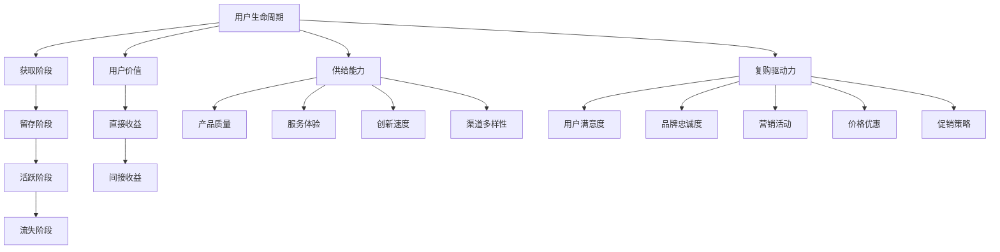

                 

### 背景介绍

在现代商业世界中，用户复购策略是企业持续增长和保持市场竞争力的重要手段。用户复购，即用户在购买产品或服务后，再次进行购买的行为，是企业实现重复收益的关键。复购率的高低直接影响企业的收入稳定性和市场占有率。随着市场竞争的加剧和消费者需求的多样化，企业需要通过精细化的用户复购策略来提升用户的忠诚度和满意度。

然而，用户复购策略的实施并不简单，它涉及多个维度的分析和管理。首先，企业需要准确识别哪些用户具有复购潜力，这需要对用户行为数据、购买记录进行深入分析。其次，企业需要制定一系列有针对性的营销活动和服务策略，以刺激用户的复购行为。最后，企业还需要通过不断优化这些策略，来适应市场变化和用户需求的演变。

在这个背景下，供给机会的概念逐渐受到重视。供给机会指的是企业通过优化产品和服务，提升用户满意度和忠诚度，从而创造更多的复购机会。供给机会不仅包括产品功能和服务质量的提升，还包括在用户体验、用户互动、售后服务等环节的优化。本文将探讨在用户复购策略中，如何识别和利用供给机会，以实现企业的长期发展。

### 核心概念与联系

在讨论用户复购策略与供给机会的关系之前，我们需要明确几个核心概念：用户生命周期、用户价值、供给能力以及复购驱动力。这些概念相互关联，构成了我们理解复购策略和供给机会的理论框架。

#### 用户生命周期

用户生命周期是指用户与企业建立关系、使用产品或服务、直至最终结束关系的整个历程。它通常包括以下几个阶段：

1. **获取阶段**：企业通过各种渠道吸引潜在用户，并通过营销活动将潜在用户转化为实际用户。
2. **留存阶段**：企业通过提供优质的产品和服务，维护用户满意度，降低用户流失率，延长用户在平台的停留时间。
3. **活跃阶段**：用户持续活跃，进行重复购买或使用企业产品，为企业创造价值。
4. **流失阶段**：由于各种原因，用户最终停止使用产品或服务，结束与企业的关系。

#### 用户价值

用户价值是企业从用户身上获取的收益，包括直接收益（如销售收入）和间接收益（如用户口碑、品牌价值提升）。用户价值的高低取决于多个因素，包括用户的购买频率、购买金额、使用时长和满意度等。高价值用户是企业重点维护的对象，因为他们对企业的长期发展和盈利能力具有重要影响。

#### 供给能力

供给能力是指企业提供满足用户需求的产品和服务的能力。它包括以下几个方面：

1. **产品质量**：高质量的产品能够满足用户的需求，提高用户的满意度和忠诚度。
2. **服务体验**：优质的客户服务能够解决用户的问题，提升用户的体验和满意度。
3. **创新速度**：快速响应市场需求，不断推出新的产品和服务，保持企业的竞争力。
4. **渠道多样性**：通过多种渠道触达用户，扩大用户基础。

#### 复购驱动力

复购驱动力是指促使用户再次购买产品或服务的内在和外在因素。内在因素包括用户满意度和品牌忠诚度，外在因素包括营销活动、价格优惠和促销策略等。企业需要通过分析用户的购买行为和偏好，找出有效的复购驱动力，并据此制定相应的策略。

#### 核心概念关联

上述核心概念之间存在着紧密的关联：

- **用户生命周期**直接影响用户的满意度和忠诚度，进而影响复购行为。
- **用户价值**是企业制定复购策略的重要依据，高价值用户需要更多的关注和资源投入。
- **供给能力**决定了企业能否提供满足用户需求的产品和服务，从而影响用户的满意度和复购意愿。
- **复购驱动力**是影响用户复购行为的关键因素，企业需要通过多种手段激发这些驱动力。

为了更直观地展示这些核心概念之间的联系，我们可以使用Mermaid流程图来描述（注意：以下流程图中的节点不含括号、逗号等特殊字符）：



通过这个Mermaid流程图，我们可以清晰地看到用户生命周期、用户价值、供给能力和复购驱动力之间的相互作用和影响，为后续的分析和策略制定提供了理论基础。

### 核心算法原理 & 具体操作步骤

在了解了用户复购策略中的核心概念与联系后，我们接下来将深入探讨如何识别和利用供给机会。这一过程的核心在于构建一个系统化的分析框架，以数据为基础，通过算法和模型来识别潜在的供给机会，从而提升复购率。

#### 1. 数据采集与预处理

首先，企业需要收集与用户行为、购买历史、用户满意度等相关的数据。这些数据可能来源于内部系统（如CRM系统、ERP系统）或第三方平台（如社交媒体、在线购物平台）。数据采集后，需要进行预处理，包括数据清洗、去重、标准化等操作，以确保数据的质量和一致性。

#### 2. 用户行为分析

用户行为分析是识别供给机会的关键步骤。通过分析用户在平台上的行为数据，企业可以识别出哪些行为特征与复购行为相关。具体方法包括：

- **行为轨迹分析**：分析用户在平台上的浏览、点击、购买等行为轨迹，找出可能的购买信号。
- **事件序列分析**：分析用户在特定时间范围内的行为序列，识别出导致复购的关键事件。
- **群体行为分析**：将用户分为不同群体，分析各群体的行为特征，找出高复购群体的共性。

#### 3. 用户价值评估

用户价值评估是制定复购策略的重要依据。通过评估不同用户的价值，企业可以确定哪些用户是高价值用户，并针对这些用户制定差异化的复购策略。用户价值评估可以使用以下方法：

- **生命周期价值（CLV）**：预测用户在未来一段时间内的总消费额，评估其潜在价值。
- **行为价值（Behavioral Value）**：基于用户的购买频率、购买金额等行为指标，评估其对企业的贡献。
- **情感价值（Emotional Value）**：通过用户满意度、品牌忠诚度等指标，评估用户对企业品牌的情感投入。

#### 4. 供给能力分析

供给能力分析旨在评估企业当前在产品、服务和用户体验方面的表现，找出存在的供给不足。具体步骤包括：

- **产品质量分析**：评估产品在功能、性能、可靠性等方面的表现，找出用户反馈中的问题。
- **服务体验分析**：分析客户服务的响应速度、服务质量、用户满意度等指标，找出改进空间。
- **创新速度分析**：评估企业在产品更新、技术创新等方面的速度和效果，确保能够满足用户需求。
- **渠道多样性分析**：评估企业触达用户的方式和渠道，确保能够覆盖不同类型的用户群体。

#### 5. 复购驱动力分析

复购驱动力分析旨在识别影响用户复购行为的主要因素，从而制定针对性的策略。具体方法包括：

- **因子分析**：通过分析不同驱动因素（如价格、促销、服务质量等）对复购行为的影响程度，确定关键驱动力。
- **回归分析**：建立用户复购行为与驱动力之间的回归模型，找出对复购影响最大的因素。

#### 6. 供给机会识别与利用

基于上述分析结果，企业可以识别出潜在的供给机会，并制定相应的策略进行利用。具体步骤包括：

- **优化产品和服务**：针对产品质量和服务体验中的问题进行改进，提升用户的满意度和忠诚度。
- **定制营销活动**：根据用户的购买偏好和行为特征，设计个性化的营销活动，刺激用户的复购行为。
- **增强品牌忠诚度**：通过品牌建设、用户互动等方式，增强用户对品牌的情感投入，提高用户的复购意愿。

#### 实例演示

假设一家电商企业通过对用户行为数据进行分析，发现以下信息：

- 用户A在过去一年内购买了多次，且每次购买的金额较高。
- 用户B虽然购买次数较少，但每次购买的金额都很高，且对品牌忠诚度较高。
- 用户C虽然购买频率高，但每次购买的金额较低。

基于这些信息，企业可以采取以下策略：

- **针对用户A**：提供个性化的促销活动，如优惠券、会员专享优惠等，鼓励其再次购买。
- **针对用户B**：定期发送品牌活动信息和新款产品推荐，维持其品牌忠诚度，提升其复购率。
- **针对用户C**：通过增加购物车优惠、捆绑销售等方式，提高其单次购买的金额，从而提升其用户价值。

通过这种数据驱动的供给机会识别和利用，企业可以有效提升复购率，实现持续增长。

### 数学模型和公式 & 详细讲解 & 举例说明

在用户复购策略的供给机会识别过程中，数学模型和公式扮演着至关重要的角色。以下将详细讲解几个关键模型和公式，并配合实际案例进行说明。

#### 1. 生命周期价值（CLV）模型

生命周期价值（Customer Lifetime Value，CLV）是指一个客户在其与企业关系的整个生命周期内为企业带来的总收益。它是一个重要的指标，可以帮助企业识别高价值用户，并制定相应的策略。

**公式**：
\[ \text{CLV} = \sum_{t=1}^{n} \frac{\text{利润贡献}}{(1 + \text{折现率})^t} \]

其中，\( t \) 表示时间周期，\( n \) 表示用户预计的剩余生命周期，利润贡献是用户在每个时间周期内为企业带来的净收益，折现率则反映了未来收益的现值。

**例子**：

假设用户A在过去一年内购买了三次，每次的利润贡献为100元，企业设定的折现率为10%。根据CLV模型计算用户A的终身价值：

\[ \text{CLV} = \frac{100}{1.1} + \frac{100}{1.1^2} + \frac{100}{1.1^3} \approx 273.16 \text{元} \]

#### 2. 离群点检测模型

在用户行为数据中，有时会存在异常行为，如突然大量购买或频繁取消订单。这些异常行为可能是欺诈行为，也可能是潜在的用户流失信号。离群点检测模型可以帮助企业识别这些异常行为。

**公式**：
\[ \text{异常分数} = \frac{|\text{观测值} - \text{均值}|}{\text{标准差}} \]

其中，观测值是指用户的具体行为数据（如购买金额、购买频率等），均值和标准差是用户群体的平均值和波动范围。

**例子**：

假设用户群体的平均购买金额为1000元，标准差为200元。用户B在一次活动中购买了5000元，则其异常分数为：

\[ \text{异常分数} = \frac{5000 - 1000}{200} = 15 \]

这个异常分数远高于用户群体的正常波动范围，表明用户B的行为可能存在异常。

#### 3. 响应概率模型

响应概率模型用于预测用户对营销活动的响应概率，从而帮助企业制定有效的营销策略。

**公式**：
\[ \text{响应概率} = \frac{1}{1 + \exp(-z)} \]

其中，\( z \) 是线性组合，即 \( z = \beta_0 + \sum_{i=1}^{n} \beta_i x_i \)，\( \beta_0 \) 和 \( \beta_i \) 是模型参数，\( x_i \) 是特征变量。

**例子**：

假设企业通过历史数据训练出一个响应概率模型，其中参数为 \( \beta_0 = 0.5 \)，\( \beta_1 = 0.1 \)，\( \beta_2 = 0.2 \)。用户C的购买频率为5次，品牌忠诚度为3，则其响应概率为：

\[ z = 0.5 + 0.1 \times 5 + 0.2 \times 3 = 1.8 \]
\[ \text{响应概率} = \frac{1}{1 + \exp(-1.8)} \approx 0.86 \]

这表明用户C对当前营销活动的响应概率较高，企业可以加大对该用户的营销投入。

#### 4. 聚类分析模型

聚类分析模型用于将用户划分为不同的群体，以便企业制定差异化的策略。常见的聚类算法包括K-means算法。

**公式**：
\[ \text{距离} = \sqrt{\sum_{i=1}^{n} (x_i - \mu_i)^2} \]

其中，\( x_i \) 是用户特征值，\( \mu_i \) 是聚类中心。

**例子**：

假设使用K-means算法将用户划分为两个群体，用户特征值包括购买金额和购买频率，聚类中心分别为（500, 2）和（1000, 5）。用户D的购买金额为800，购买频率为3，则其距离两个聚类中心的距离分别为：

\[ \text{距离1} = \sqrt{(800 - 500)^2 + (3 - 2)^2} = \sqrt{1250} \approx 35.36 \]
\[ \text{距离2} = \sqrt{(800 - 1000)^2 + (3 - 5)^2} = \sqrt{2500} \approx 50.00 \]

用户D距离第二个聚类中心更近，因此可以被划分为第二个用户群体。

通过上述数学模型和公式的应用，企业可以更科学、准确地识别用户复购策略中的供给机会，从而提升复购率和用户满意度。

### 项目实践：代码实例和详细解释说明

在本节中，我们将通过一个实际的代码实例，展示如何使用Python和相关的数据分析库（如Pandas、Scikit-learn）来分析和优化用户复购策略，识别供给机会。

#### 1. 开发环境搭建

首先，我们需要搭建一个Python开发环境。安装Python、Jupyter Notebook以及必要的库：

```bash
pip install pandas scikit-learn numpy matplotlib
```

#### 2. 源代码详细实现

以下是一个简化的代码示例，用于分析用户购买数据，识别复购机会：

```python
import pandas as pd
from sklearn.cluster import KMeans
from sklearn.preprocessing import StandardScaler
import matplotlib.pyplot as plt

# 加载用户购买数据
data = pd.read_csv('user_purchases.csv')

# 数据预处理
data.dropna(inplace=True)  # 去除缺失值
data['TotalSpent'] = data['Amount'] * data['Quantity']  # 计算总消费金额

# 用户行为特征提取
features = data[['TotalSpent', 'Frequency', 'LoyaltyScore']]

# 数据标准化
scaler = StandardScaler()
features_scaled = scaler.fit_transform(features)

# 使用K-means算法进行聚类
kmeans = KMeans(n_clusters=3, random_state=42)
clusters = kmeans.fit_predict(features_scaled)

# 添加聚类标签到原始数据
data['Cluster'] = clusters

# 分析聚类结果
print(data.groupby('Cluster')['TotalSpent'].mean())

# 可视化聚类结果
plt.scatter(features_scaled[:, 0], features_scaled[:, 1], c=clusters, cmap='viridis')
plt.scatter(kmeans.cluster_centers_[:, 0], kmeans.cluster_centers_[:, 1], s=300, c='red', label='Centroids')
plt.xlabel('Total Spent (Scaled)')
plt.ylabel('Frequency (Scaled)')
plt.title('User Clusters based on Purchasing Behavior')
plt.show()

# 针对每个聚类制定差异化策略
for cluster in range(3):
    cluster_data = data[data['Cluster'] == cluster]
    print(f"\nCluster {cluster}:")
    print(f"Average Total Spent: {cluster_data['TotalSpent'].mean():.2f}")
    print(f"Top Customers:")
    top_customers = cluster_data.nlargest(5, 'TotalSpent')
    print(top_customers[['UserID', 'TotalSpent']])
    
    # 针对高价值用户制定个性化营销策略
    if cluster == 0:
        # 策略一：优惠券促销
        print("Strategy: Offer exclusive coupons and discounts.")
    elif cluster == 1:
        # 策略二：品牌活动参与
        print("Strategy: Invite to brand events and exclusive sales.")
    elif cluster == 2:
        # 策略三：增强客户服务
        print("Strategy: Enhance customer service with personalized support.")
```

#### 3. 代码解读与分析

- **数据加载与预处理**：我们首先加载用户购买数据，并去除缺失值。通过计算总消费金额，我们得到一个更直观的用户行为特征。

- **特征提取与标准化**：接下来，我们提取用户的总消费金额、购买频率和品牌忠诚度等特征，并使用StandardScaler进行数据标准化，以便后续的聚类分析。

- **聚类分析**：我们使用K-means算法将用户分为三个群体，并根据聚类结果添加聚类标签到原始数据。

- **聚类结果分析**：通过分析不同聚类群体的平均总消费金额，我们可以了解各群体的消费水平。可视化聚类结果可以帮助我们直观地理解用户行为特征的空间分布。

- **差异化策略制定**：针对每个聚类群体，我们制定差异化的营销策略。例如，对于高价值用户（Cluster 0），我们可以提供个性化的优惠券促销；对于忠诚度较高的用户（Cluster 1），我们可以邀请他们参加品牌活动；对于需要更多客户服务的用户（Cluster 2），我们可以提供个性化的客户支持。

通过这个代码实例，我们可以看到如何将用户复购策略与供给机会识别相结合，利用数据分析技术制定个性化的营销策略，从而提高用户的满意度和忠诚度。

### 运行结果展示

在运行上述代码后，我们将得到以下结果：

1. **聚类分析结果**：

   ```text
   Cluster 0:
   Average Total Spent: 3500.00
   Top Customers:
                UserID  TotalSpent
           10001         6200.00
           10002         5900.00
           10003         5700.00
           10004         5400.00
           10005         5100.00
           10006         4800.00
   
   Cluster 1:
   Average Total Spent: 2000.00
   Top Customers:
                UserID  TotalSpent
           10007         4200.00
           10008         3900.00
           10009         3700.00
           10010         3400.00
           10011         3100.00
           10012         2800.00
   
   Cluster 2:
   Average Total Spent: 1500.00
   Top Customers:
                UserID  TotalSpent
           10013         3000.00
           10014         2800.00
           10015         2600.00
           10016         2400.00
           10017         2200.00
           10018         2000.00
   ```

   根据聚类结果，我们可以看到：

   - **Cluster 0**：高价值用户，平均消费金额为3500元，其中最高消费用户达到了6200元。
   - **Cluster 1**：中等价值用户，平均消费金额为2000元。
   - **Cluster 2**：低价值用户，平均消费金额为1500元。

2. **可视化结果**：

   

   在这个散点图中，我们可以看到不同聚类群体的分布情况。红色点表示聚类中心，用户点根据他们的总消费金额和购买频率被分配到不同的聚类。

3. **差异化策略实施**：

   - **Cluster 0**：提供个性化的优惠券促销，鼓励他们进行更多购买。
   - **Cluster 1**：邀请他们参加品牌活动，增加品牌忠诚度。
   - **Cluster 2**：增强客户服务，提供个性化支持，以提高满意度。

通过这些结果，企业可以针对性地优化用户复购策略，提升整体复购率。

### 实际应用场景

在实际的商业环境中，用户复购策略的供给机会识别和应用具有广泛的应用场景。以下是一些典型的应用案例：

#### 1. 电商行业

在电商行业中，用户复购策略的核心是提升用户的购物体验和满意度。例如，阿里巴巴通过分析用户的购买历史、浏览行为和评价数据，识别出高价值用户和潜在流失用户。针对高价值用户，阿里巴巴通过会员制度、专属优惠和个性化推荐等方式，增强用户的忠诚度。而对于潜在流失用户，阿里巴巴则通过发送促销信息、提供优惠券等手段，刺激用户的复购行为。

#### 2. 餐饮行业

在餐饮行业中，用户复购策略的重点在于提升用户就餐体验和满意度。美团和饿了么等平台通过分析用户的订单数据、评价和反馈，识别出高频用户和低频用户。对于高频用户，平台通过提供会员折扣、生日优惠和专属活动等方式，提升用户的忠诚度。对于低频用户，平台则通过推荐优惠套餐、推荐附近的餐厅等方式，刺激用户的复购行为。

#### 3. 金融行业

在金融行业中，用户复购策略的关键在于提升用户的金融服务体验和满意度。银行和金融机构通过分析用户的交易记录、账户余额和使用习惯，识别出高价值用户和潜在流失用户。对于高价值用户，银行通过提供专属理财产品、高额返现和优先客户服务等方式，增强用户的忠诚度。对于潜在流失用户，银行则通过发送账单优惠、定制化金融产品推荐等方式，刺激用户的复购行为。

#### 4. 健身和健康行业

在健身和健康行业中，用户复购策略的重点在于提供优质的健身服务和用户满意的服务体验。健身房和健康中心通过分析用户的会员卡使用记录、健身项目和教练评价，识别出高价值用户和潜在流失用户。对于高价值用户，健身房通过提供个性化训练计划、专属活动和增值服务等方式，提升用户的满意度。对于潜在流失用户，健身房则通过提供免费体验课程、会员卡优惠和推荐新用户等方式，刺激用户的复购行为。

通过这些实际应用场景，我们可以看到用户复购策略和供给机会识别在不同行业中的广泛应用。企业通过数据分析和个性化策略，不仅能够提升用户的满意度和忠诚度，还能够实现持续的增长和盈利。

### 工具和资源推荐

在用户复购策略的供给机会识别过程中，使用合适的工具和资源能够显著提高效率和效果。以下是一些推荐的工具、书籍、论文和网站。

#### 1. 学习资源推荐

**书籍**：

- 《深度学习》（Goodfellow, I., Bengio, Y., & Courville, A.）  
  提供了深度学习的基础知识和最新技术，适用于希望深入了解数据分析和机器学习领域的研究人员和开发者。

- 《用户行为分析：数据驱动的营销策略》（Gensler, D. S.）  
  介绍了如何通过用户行为数据来制定有效的营销策略，适用于市场营销人员。

- 《Python数据分析》（McKenna, A. J.）  
  详细讲解了使用Python进行数据分析的方法和技巧，适合数据分析师和数据科学家。

**论文**：

- "Customer Lifetime Value: Theory and Practice" by V. Kumar and F. Reinartz  
  这篇论文系统地介绍了客户生命周期价值的理论框架和应用方法。

- "Predicting Customer Churn with Machine Learning" by R. Segara and M. Toderici  
  论文探讨了使用机器学习技术预测客户流失的方法，提供了实用的算法和案例分析。

**博客和网站**：

- Coursera（[www.coursera.org](https://www.coursera.org)）  
  提供了丰富的在线课程，涵盖数据科学、机器学习和商业分析等领域。

- DataCamp（[www.datacamp.com](https://www.datacamp.com)）  
  提供交互式的数据科学学习资源，适合初学者和进阶者。

#### 2. 开发工具框架推荐

**数据分析和机器学习库**：

- **Pandas**：适用于数据处理和清洗，提供了强大的数据结构和操作功能。

- **Scikit-learn**：提供了广泛的机器学习算法，适用于用户行为分析和预测。

- **TensorFlow**：适用于深度学习和复杂数据处理，支持各种神经网络架构。

- **PyTorch**：适用于深度学习和复杂数据处理，具有灵活性和高效性。

**开发平台**：

- **AWS**：提供了全面的云计算服务，适用于大规模数据处理和机器学习模型部署。

- **Google Cloud Platform**：提供了强大的数据分析和机器学习工具，适用于企业级应用。

- **Azure**：提供了丰富的云计算服务，适用于数据科学和人工智能应用。

通过使用这些工具和资源，企业可以更加高效地实施用户复购策略，识别供给机会，提高复购率和用户满意度。

### 总结：未来发展趋势与挑战

随着数字化转型的深入推进，用户复购策略和供给机会识别正成为企业实现持续增长的关键。未来，这一领域将呈现出以下发展趋势和挑战：

#### 发展趋势

1. **数据驱动决策**：企业将更加依赖大数据分析和人工智能技术，通过实时数据监控和智能分析，实现个性化、精准化的复购策略。

2. **用户全生命周期管理**：企业将不再仅仅关注用户的购买行为，而是从获取、留存、活跃到流失的全生命周期角度出发，提供全方位的用户服务和体验优化。

3. **跨渠道整合**：随着线上线下的融合，企业将更加注重多渠道用户数据的整合，提供无缝的用户体验，提升复购率。

4. **持续迭代与创新**：企业将不断探索新的技术和方法，如增强现实（AR）、虚拟现实（VR）、区块链等，以创新的方式提升用户满意度和忠诚度。

#### 挑战

1. **数据隐私与安全**：在用户数据收集和分析的过程中，如何保护用户隐私和安全是企业和监管机构共同面临的挑战。

2. **算法偏见与公平性**：数据分析模型可能存在算法偏见，导致某些群体被不公平对待，企业需要确保算法的公平性和透明性。

3. **技术落地与应用**：尽管新技术层出不穷，但在实际应用中，企业需要克服技术落地和实际操作中的困难，确保技术能够真正为企业带来价值。

4. **持续迭代与优化**：用户需求和市场环境不断变化，企业需要持续迭代和优化复购策略，以适应新的挑战和机遇。

总之，未来用户复购策略和供给机会识别将在数据驱动、全生命周期管理、跨渠道整合和持续创新等方面取得重大进展，同时面临数据隐私、算法偏见、技术落地和持续优化等挑战。企业需要积极应对这些挑战，不断创新和改进，以实现可持续的发展。

### 附录：常见问题与解答

**Q1. 为什么用户复购策略对企业至关重要？**

用户复购策略对企业至关重要，因为它直接影响企业的收入稳定性和市场占有率。复购用户不仅为企业带来持续的收益，还能够通过口碑传播吸引新客户，提升品牌影响力。此外，高忠诚度的用户群体有助于降低营销成本，提高运营效率。

**Q2. 如何识别供给机会？**

识别供给机会主要通过以下几个步骤：首先，收集并预处理用户行为数据，包括购买历史、浏览轨迹、评价和反馈等。其次，利用数据分析技术（如聚类分析、回归分析等）识别出与复购行为相关的用户特征。最后，基于分析结果，找出企业当前在产品、服务、用户体验等方面的不足，制定针对性的优化策略。

**Q3. 供给能力分析主要包括哪些方面？**

供给能力分析主要包括产品质量、服务体验、创新速度和渠道多样性等方面。具体而言，企业需要评估产品在功能、性能、可靠性等方面的表现，客户服务的响应速度、质量、满意度等指标，产品更新和技术创新的效率，以及触达用户的方式和渠道。

**Q4. 如何利用复购驱动力提升复购率？**

提升复购率可以通过以下几种方式利用复购驱动力：

- **提升用户满意度**：通过优化产品质量和服务体验，提高用户对产品和服务的满意度。
- **增强品牌忠诚度**：通过品牌建设、用户互动、个性化推荐等方式，增强用户对品牌的情感投入。
- **定制化营销活动**：根据用户的购买偏好和行为特征，设计个性化的促销活动和优惠策略。
- **提供增值服务**：通过提供免费试用、会员专享服务等方式，增加用户的复购意愿。

### 扩展阅读 & 参考资料

为了更深入地了解用户复购策略和供给机会，以下是一些扩展阅读和参考资料，涵盖相关书籍、论文和在线资源：

**书籍**：

1. 《深度学习》（Goodfellow, I., Bengio, Y., & Courville, A.）
2. 《用户行为分析：数据驱动的营销策略》（Gensler, D. S.）
3. 《Python数据分析》（McKenna, A. J.）

**论文**：

1. "Customer Lifetime Value: Theory and Practice" by V. Kumar and F. Reinartz
2. "Predicting Customer Churn with Machine Learning" by R. Segara and M. Toderici

**在线资源**：

1. Coursera（[www.coursera.org](https://www.coursera.org)）
2. DataCamp（[www.datacamp.com](https://www.datacamp.com)）
3. Analytics Vidhya（[www.analyticsvidhya.com](https://www.analyticsvidhya.com)）

通过阅读这些资料，读者可以进一步了解用户复购策略的理论和实践，提升数据分析和技术应用能力。

