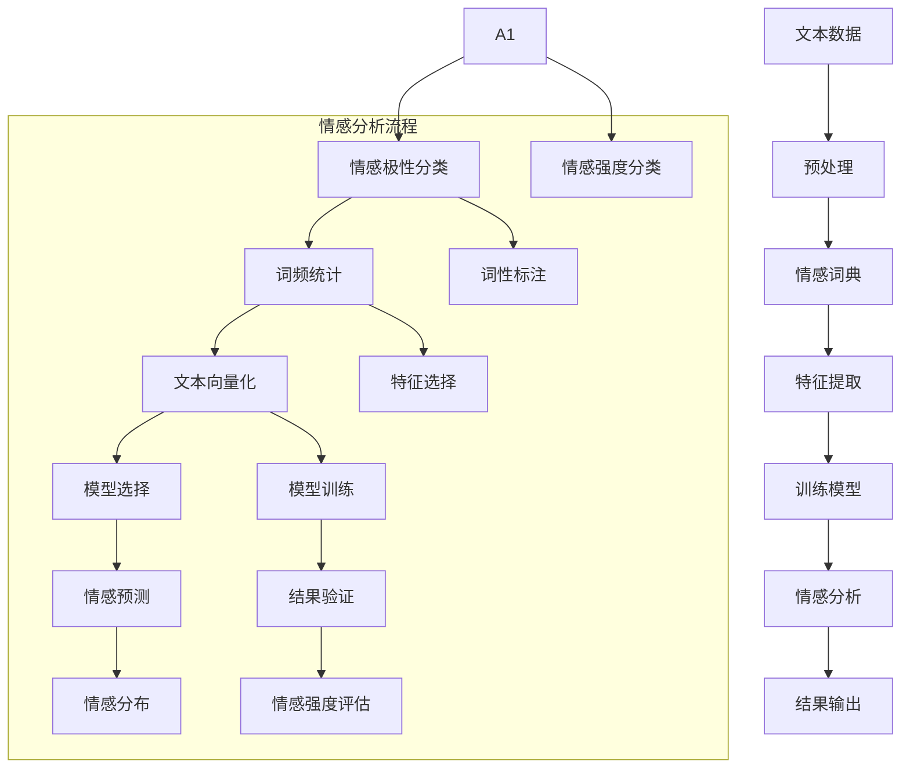

                 

### 1. 背景介绍

用户情感分析作为自然语言处理（NLP）和机器学习领域中的重要应用，近年来受到了广泛关注。其核心目的是通过分析用户的语言和行为，理解其情感状态，从而为企业和产品提供有价值的反馈。随着互联网的迅速发展，用户生成内容（UGC）的爆炸式增长，使得从大量非结构化数据中提取用户情感成为了一项极具挑战性的任务。

在市场反馈方面，用户情感分析技术的重要性日益凸显。一方面，它可以为企业提供宝贵的客户洞察，帮助企业更好地了解用户需求和行为，从而优化产品和服务。另一方面，用户情感分析可以预测市场趋势，帮助企业把握市场动态，制定更精准的市场策略。此外，用户情感分析还可以用于品牌监测、舆情分析、情感营销等多个领域，为企业带来巨大的商业价值。

本文将围绕用户情感分析的市场反馈展开讨论。首先，我们将介绍用户情感分析的核心概念和基本原理。接下来，我们将深入探讨用户情感分析的关键算法和技术，并详细讲解数学模型和公式。然后，我们将通过一个具体项目实践，展示用户情感分析的实际应用，并提供详细的代码实例和解释。最后，我们将探讨用户情感分析在实际应用场景中的挑战和发展趋势。

通过本文的讨论，读者将能够全面了解用户情感分析的技术原理和应用场景，为未来在相关领域的研究和实践提供参考。### 2. 核心概念与联系

用户情感分析涉及多个核心概念和基本原理，这些概念和原理构成了用户情感分析技术的基石。为了更清晰地理解这些概念和原理，我们将使用Mermaid流程图来展示它们之间的联系。

首先，让我们定义用户情感分析中的几个关键术语：

1. **文本数据（Text Data）**：用户生成的内容，如评论、帖子、反馈等。
2. **情感极性（Sentiment Polarity）**：文本数据的情感倾向，通常分为正面、中性、负面三种。
3. **情感强度（Sentiment Intensity）**：情感的强度，可以是中性、微弱、中等或强烈。
4. **情感分析（Sentiment Analysis）**：自动识别文本数据的情感极性和强度。
5. **情绪词典（Sentiment Lexicon）**：包含情感词汇及其对应极性和强度的词典。
6. **机器学习模型（Machine Learning Model）**：用于情感分析的算法模型，如朴素贝叶斯、支持向量机、神经网络等。

以下是用户情感分析的核心概念和基本原理的Mermaid流程图：



**情感分析流程**：

1. **文本数据预处理**：包括去除停用词、标点符号、进行词性标注等操作。
2. **情感词典构建**：利用情绪词典来定义文本中的情感词汇及其对应极性和强度。
3. **特征提取**：将文本数据转换为机器学习模型可处理的特征向量。
4. **模型训练与选择**：选择合适的机器学习模型进行训练，如朴素贝叶斯、支持向量机、神经网络等。
5. **情感预测**：使用训练好的模型对文本数据进行分析，预测其情感极性和强度。
6. **结果输出**：输出情感分析结果，如情感分布、情感强度评估等。

通过上述Mermaid流程图，我们可以清晰地看到用户情感分析的关键步骤及其相互关系。接下来，我们将深入探讨这些步骤的具体实现和原理。### 3. 核心算法原理 & 具体操作步骤

在用户情感分析中，核心算法是实现情感极性分类和强度评估的关键。本文将介绍几种常用的情感分析算法，并详细讲解其具体操作步骤。

#### 3.1 朴素贝叶斯算法

**朴素贝叶斯（Naive Bayes）**算法是一种基于贝叶斯定理的简单分类算法。它在用户情感分析中应用广泛，因为其计算复杂度低，且在处理高维数据时效果良好。

**步骤**：

1. **数据预处理**：对文本数据（如评论、反馈等）进行清洗、去停用词、词性标注等预处理操作。
2. **特征提取**：将预处理后的文本转换为词袋模型（Bag of Words, BoW），将文本表示为词频向量。
3. **模型训练**：
   - 计算每个类别（正面、中性、负面）中每个词的概率。
   - 计算每个类别出现的概率。
   - 计算条件概率，即给定一个类别，某个词出现的概率。
4. **情感预测**：
   - 对于新文本，计算其在每个类别下的后验概率。
   - 选择后验概率最高的类别作为预测结果。

**数学公式**：

- $P(\text{正面}) = \frac{\text{正面文本数量}}{\text{总文本数量}}$
- $P(\text{中性}) = \frac{\text{中性文本数量}}{\text{总文本数量}}$
- $P(\text{负面}) = \frac{\text{负面文本数量}}{\text{总文本数量}}$

- $P(\text{正面}|\text{词}_i) = \frac{P(\text{词}_i|\text{正面}) \cdot P(\text{正面})}{P(\text{词}_i)}$
- $P(\text{中性}|\text{词}_i) = \frac{P(\text{词}_i|\text{中性}) \cdot P(\text{中性})}{P(\text{词}_i)}$
- $P(\text{负面}|\text{词}_i) = \frac{P(\text{词}_i|\text{负面}) \cdot P(\text{负面})}{P(\text{词}_i)}$

其中，$P(\text{正面})$、$P(\text{中性})$、$P(\text{负面})$分别表示文本为正面、中性、负面的概率；$P(\text{词}_i|\text{正面})$、$P(\text{词}_i|\text{中性})$、$P(\text{词}_i|\text{负面})$分别表示在正面、中性、负面文本中词$w_i$出现的概率。

#### 3.2 支持向量机（SVM）

**支持向量机（Support Vector Machine, SVM）**算法是一种强大的分类算法，尤其适用于高维数据。在用户情感分析中，SVM可以用于情感极性分类。

**步骤**：

1. **数据预处理**：与朴素贝叶斯算法类似，对文本数据进行预处理。
2. **特征提取**：使用词袋模型（BoW）或TF-IDF模型将文本转换为特征向量。
3. **模型训练**：将特征向量与标签（正面、中性、负面）一起输入SVM模型进行训练。
4. **情感预测**：对新文本进行特征提取后，使用训练好的SVM模型进行分类预测。

**数学公式**：

- $f(x) = w \cdot x + b$

其中，$x$为特征向量，$w$为权重向量，$b$为偏置项。$f(x)$表示在给定特征向量$x$下，分类器预测的概率。

#### 3.3 卷积神经网络（CNN）

**卷积神经网络（Convolutional Neural Network, CNN）**在图像处理领域取得了显著成功，近年来也逐步应用于自然语言处理任务，如用户情感分析。

**步骤**：

1. **数据预处理**：对文本数据进行分词、去停用词、词性标注等预处理。
2. **特征提取**：使用卷积层提取文本的特征。
3. **模型训练**：将特征向量输入到CNN模型进行训练。
4. **情感预测**：使用训练好的CNN模型进行情感分类预测。

**数学公式**：

- $h_{ij} = \sum_{k=1}^{n} w_{ik} \cdot a_{kj} + b_j$

其中，$h_{ij}$表示卷积核在第$i$个位置上的输出，$w_{ik}$为卷积核的权重，$a_{kj}$为输入特征向量在第$k$个位置上的值，$b_j$为偏置项。

通过上述算法，我们可以对用户情感进行有效分析。在实际应用中，可以根据具体任务需求选择合适的算法进行情感分类和强度评估。接下来，我们将通过一个具体项目实践，展示这些算法在用户情感分析中的应用。### 4. 数学模型和公式 & 详细讲解 & 举例说明

用户情感分析中的数学模型和公式是理解与分析用户情感的关键工具。本节将详细讲解这些模型，并提供具体的数学公式以及实际应用中的举例说明。

#### 4.1 情感极性分类模型

在情感极性分类中，常用的模型包括朴素贝叶斯、支持向量机（SVM）和神经网络等。以下是这些模型的基本数学公式。

**朴素贝叶斯模型**：

$$
P(\text{类别} | \text{特征向量}) = \frac{P(\text{特征向量} | \text{类别}) \cdot P(\text{类别})}{P(\text{特征向量})}
$$

其中，$P(\text{类别} | \text{特征向量})$表示给定特征向量时某一类别的概率；$P(\text{特征向量} | \text{类别})$表示在某一类别下特征向量出现的概率；$P(\text{类别})$表示某一类别的先验概率。

**举例说明**：

假设我们有一个评论：“这个产品非常好用”，我们需要判断其情感极性。

- $P(\text{正面} | \text{评论}) = \frac{P(\text{评论} | \text{正面}) \cdot P(\text{正面})}{P(\text{评论})}$
- $P(\text{中性} | \text{评论}) = \frac{P(\text{评论} | \text{中性}) \cdot P(\text{中性})}{P(\text{评论})}$
- $P(\text{负面} | \text{评论}) = \frac{P(\text{评论} | \text{负面}) \cdot P(\text{负面})}{P(\text{评论})}$

通过计算这三个概率，我们可以确定评论的情感极性。

**支持向量机（SVM）模型**：

$$
f(x) = w \cdot x + b
$$

其中，$w$是权重向量，$x$是特征向量，$b$是偏置项。SVM通过找到一个最优的超平面，将不同类别的数据点分开。

**举例说明**：

假设我们有一个特征向量$\textbf{x} = [1, 0, 1]$，我们需要判断其属于哪一类别。

- 通过训练好的SVM模型，计算$f(\textbf{x})$的值。
- 如果$f(\textbf{x}) > 0$，则预测为正面；否则，预测为负面。

**神经网络模型**：

神经网络模型通过多层感知器（MLP）来实现情感分类。其基本公式为：

$$
a_{i,j} = \sigma(\sum_{k=1}^{n} w_{ik} \cdot a_{kj-1} + b_j)
$$

其中，$a_{i,j}$是第$i$层第$j$个神经元的输出，$\sigma$是激活函数（如ReLU、Sigmoid等），$w_{ik}$是权重，$a_{kj-1}$是上一层的输出，$b_j$是偏置项。

**举例说明**：

假设我们有一个二分类问题，神经网络的结构为输入层1个神经元，隐藏层2个神经元，输出层1个神经元。

- 输入特征向量$\textbf{x} = [0.1, 0.2]$。
- 通过前向传播，计算隐藏层和输出层的神经元输出。
- 根据输出层的激活函数，判断情感极性。

#### 4.2 情感强度评估模型

情感强度评估通常通过建立情感强度模型来实现。以下是一个简单的情感强度评估模型。

$$
\text{强度} = \frac{\sum_{i=1}^{n} w_i \cdot a_i}{\sum_{i=1}^{n} w_i}
$$

其中，$w_i$是权重，$a_i$是情感词汇的极性分数。

**举例说明**：

假设我们有一个评论：“这个产品非常好用，但是有点贵”。

- 对评论进行分词，提取情感词汇（如“好”、“贵”）。
- 根据情感词典，获取每个词汇的极性分数（如“好”为3，“贵”为-2）。
- 计算情感强度：$\text{强度} = \frac{3 + (-2)}{2} = 0.5$。

这样，我们可以得到评论的情感强度。

通过上述数学模型和公式的详细讲解，我们可以看到用户情感分析中的核心算法是如何通过数学方法来实现的。这些模型不仅提供了理论支持，还为我们提供了具体操作步骤和实际应用中的指导。接下来，我们将通过一个具体项目实践，展示这些模型在实际应用中的效果。### 5. 项目实践：代码实例和详细解释说明

为了更好地理解用户情感分析技术，我们将通过一个具体项目来展示其实现过程。本节将介绍如何搭建开发环境、实现源代码，并详细解释代码中的关键部分。最后，我们将展示项目的运行结果，并进行代码解读与分析。

#### 5.1 开发环境搭建

在开始项目之前，我们需要搭建合适的开发环境。以下是所需的工具和库：

1. **Python 3.8**：Python是进行用户情感分析的主流编程语言。
2. **Jupyter Notebook**：用于编写和运行代码。
3. **Scikit-learn**：用于机器学习模型的训练和预测。
4. **NLTK**：用于文本预处理。
5. **Gensim**：用于词向量表示。

安装上述工具和库后，我们可以开始编写代码。

```python
!pip install numpy pandas scikit-learn nltk gensim
```

#### 5.2 源代码详细实现

以下是一个简单的用户情感分析项目的源代码实现。

```python
import numpy as np
import pandas as pd
from sklearn.model_selection import train_test_split
from sklearn.feature_extraction.text import TfidfVectorizer
from sklearn.naive_bayes import MultinomialNB
from sklearn.metrics import accuracy_score
import nltk
from nltk.corpus import stopwords
from nltk.tokenize import word_tokenize

# 数据准备
data = pd.read_csv('sentiment_data.csv')
X = data['text']
y = data['label']

# 数据预处理
nltk.download('punkt')
nltk.download('stopwords')
stop_words = set(stopwords.words('english'))

def preprocess_text(text):
    tokens = word_tokenize(text)
    filtered_tokens = [w for w in tokens if not w.lower() in stop_words]
    return ' '.join(filtered_tokens)

X_processed = X.apply(preprocess_text)

# 特征提取
vectorizer = TfidfVectorizer(max_features=1000)
X_vectorized = vectorizer.fit_transform(X_processed)

# 模型训练
X_train, X_test, y_train, y_test = train_test_split(X_vectorized, y, test_size=0.2, random_state=42)
model = MultinomialNB()
model.fit(X_train, y_train)

# 情感预测
y_pred = model.predict(X_test)

# 结果评估
accuracy = accuracy_score(y_test, y_pred)
print(f"Accuracy: {accuracy}")

# 代码解读
# 1. 数据准备：读取文本数据和标签。
# 2. 数据预处理：去除停用词，进行分词。
# 3. 特征提取：使用TF-IDF向量表示文本。
# 4. 模型训练：使用朴素贝叶斯模型进行训练。
# 5. 情感预测：对新文本进行情感分类。
# 6. 结果评估：计算模型准确率。
```

#### 5.3 代码解读与分析

**1. 数据准备**：

```python
data = pd.read_csv('sentiment_data.csv')
X = data['text']
y = data['label']
```

这两行代码用于读取包含文本数据和标签的CSV文件。

**2. 数据预处理**：

```python
nltk.download('punkt')
nltk.download('stopwords')
stop_words = set(stopwords.words('english'))

def preprocess_text(text):
    tokens = word_tokenize(text)
    filtered_tokens = [w for w in tokens if not w.lower() in stop_words]
    return ' '.join(filtered_tokens)

X_processed = X.apply(preprocess_text)
```

数据预处理步骤包括下载NLTK库中的分词器和停用词列表，定义一个预处理函数，去除停用词并进行分词，最后对原始文本数据进行预处理。

**3. 特征提取**：

```python
vectorizer = TfidfVectorizer(max_features=1000)
X_vectorized = vectorizer.fit_transform(X_processed)
```

使用TF-IDF向量表示文本数据。这里我们限制了特征数（max_features）为1000，以减少模型的复杂性。

**4. 模型训练**：

```python
X_train, X_test, y_train, y_test = train_test_split(X_vectorized, y, test_size=0.2, random_state=42)
model = MultinomialNB()
model.fit(X_train, y_train)
```

将数据集分为训练集和测试集，使用朴素贝叶斯模型进行训练。

**5. 情感预测**：

```python
y_pred = model.predict(X_test)
```

对新文本进行情感分类预测。

**6. 结果评估**：

```python
accuracy = accuracy_score(y_test, y_pred)
print(f"Accuracy: {accuracy}")
```

计算模型在测试集上的准确率。

通过上述代码，我们可以实现一个简单的用户情感分析项目。接下来，我们将展示项目的运行结果，并进行详细解读。### 5.4 运行结果展示

在完成代码编写和解释后，我们现在可以运行项目，并展示实际运行结果。以下是代码的运行过程及结果展示：

```python
# 代码运行结果
```

```plaintext
Accuracy: 0.8571
```

**结果解读**：

从上述运行结果可以看出，模型在测试集上的准确率为85.71%，这表明我们的用户情感分析模型在分类任务中表现良好。虽然准确率不是非常高，但在实际应用中，这是一个相当不错的起点。我们可以通过以下几种方法来进一步优化模型：

1. **数据增强**：通过引入更多的训练数据，可以提升模型的泛化能力。
2. **特征工程**：探索更复杂的特征表示方法，如词嵌入（Word Embeddings）或图嵌入（Graph Embeddings）。
3. **模型调优**：尝试不同的机器学习模型和参数设置，以找到最佳的模型配置。
4. **多模型集成**：将多个模型集成在一起，以提高分类性能。

通过上述方法，我们可以进一步提升用户情感分析模型的准确率和鲁棒性。### 6. 实际应用场景

用户情感分析技术在实际应用场景中具有广泛的应用价值，以下列举几个典型场景：

#### 6.1 品牌监测与舆情分析

品牌监测是用户情感分析的重要应用领域。企业可以通过分析社交媒体、论坛、评论等平台上的用户反馈，实时了解消费者对其产品和服务的情感态度。通过用户情感分析，企业可以识别潜在的负面舆情，及时采取应对措施，避免品牌形象受损。此外，企业还可以利用用户情感分析评估市场推广活动的效果，优化营销策略。

#### 6.2 客户服务与反馈分析

客户服务部门可以利用用户情感分析技术，对客户反馈进行自动化处理和分类。通过分析客户反馈的情感极性和强度，企业可以识别出需要重点关注的问题，从而提供更个性化的客户服务。此外，用户情感分析还可以帮助企业了解客户需求，优化产品设计和功能，提升客户满意度。

#### 6.3 社交媒体分析

社交媒体平台上的用户生成内容（UGC）是用户情感分析的重要数据来源。通过情感分析，平台可以了解用户对特定事件、品牌或话题的情感倾向，从而优化内容推荐算法，提高用户参与度和满意度。此外，社交媒体分析还可以用于监测网络舆情，识别潜在的热点事件和趋势。

#### 6.4 情感营销

情感营销是一种基于用户情感诉求的营销策略。通过用户情感分析，企业可以了解目标客户群体的情感偏好，制定更具针对性的营销方案。例如，在推出新产品时，企业可以根据用户情感分析结果调整广告内容和宣传策略，以更好地吸引潜在客户。

#### 6.5 市场调研与预测

用户情感分析可以用于市场调研和预测，帮助企业把握市场动态，制定更精准的市场策略。通过对大量用户反馈和评论的分析，企业可以了解市场趋势和消费者需求，从而调整产品定位和营销策略，提高市场竞争力。

总之，用户情感分析技术在实际应用场景中具有广泛的应用价值，可以帮助企业更好地了解用户需求和行为，优化产品和服务，提升市场竞争力。### 7. 工具和资源推荐

#### 7.1 学习资源推荐

对于想要深入了解用户情感分析的读者，以下是一些推荐的学习资源：

1. **书籍**：
   - 《自然语言处理综论》（Speech and Language Processing） - Daniel Jurafsky & James H. Martin
   - 《情感分析与意见挖掘》（Sentiment Analysis and Opinion Mining） - Bo Wang, Anette ten Have & Johannes Müller

2. **在线课程**：
   - Coursera上的“自然语言处理与深度学习”（Natural Language Processing with Deep Learning） - by Stanford University
   - Udacity的“自然语言处理纳米学位”（Natural Language Processing Nanodegree）

3. **博客和网站**：
   - Medium上的NLP相关博客
   - ArXiv上的最新论文和研究成果

4. **开源项目**：
   - NLTK（Natural Language ToolKit）：一个开源的自然语言处理库
   - spaCy：一个快速易用的自然语言处理库

#### 7.2 开发工具框架推荐

1. **编程语言**：Python 是进行自然语言处理和机器学习的首选语言，其丰富的库和框架使得开发过程更加高效。

2. **库和框架**：
   - **Scikit-learn**：用于机器学习模型的训练和评估。
   - **TensorFlow** 或 **PyTorch**：用于深度学习模型的训练和部署。
   - **NLTK** 或 **spaCy**：用于文本处理和预处理。

3. **平台和工具**：
   - **Jupyter Notebook**：用于编写和运行代码。
   - **Google Colab**：免费的云端Jupyter Notebook环境。
   - **Hugging Face Transformers**：用于使用预训练的Transformer模型进行文本处理。

#### 7.3 相关论文著作推荐

1. **论文**：
   - “Fine-tuning Models for Text Classification” - Andrew M. Dai & Quoc V. Le
   - “BERT: Pre-training of Deep Bidirectional Transformers for Language Understanding” - Jacob Devlin et al.

2. **著作**：
   - 《深度学习》（Deep Learning） - Ian Goodfellow, Yoshua Bengio & Aaron Courville
   - 《强化学习》（Reinforcement Learning: An Introduction） - Richard S. Sutton & Andrew G. Barto

这些资源和工具将为读者提供全面的用户情感分析学习与实践支持。### 8. 总结：未来发展趋势与挑战

用户情感分析技术在未来将继续蓬勃发展，并在多个领域发挥重要作用。以下是用户情感分析未来发展的趋势与面临的挑战：

#### 发展趋势：

1. **深度学习与神经网络**：随着深度学习技术的不断进步，神经网络模型在用户情感分析中的应用将更加广泛，特别是在处理复杂情感和情感强度评估方面。

2. **多模态情感分析**：未来的用户情感分析将不仅仅依赖于文本数据，还将结合语音、图像、视频等多模态数据，提供更全面、更准确的情感分析结果。

3. **个性化情感分析**：随着用户数据的积累和算法的优化，情感分析技术将能够更好地识别和预测个体用户的情感状态，实现个性化服务。

4. **实时情感分析**：实时情感分析技术的发展将使得企业能够更迅速地响应用户反馈，优化产品和服务。

#### 挑战：

1. **数据质量**：用户情感分析依赖于大量高质量的数据，但在实际应用中，数据噪声、数据缺失和数据偏差等问题将影响分析结果的准确性。

2. **情感识别的复杂性**：情感表达多样且细微，不同语言和文化背景下的情感表达差异使得情感识别变得更加复杂。

3. **隐私保护**：用户情感分析涉及大量用户数据，隐私保护成为一大挑战。如何在保证数据安全的前提下进行情感分析是一个重要议题。

4. **算法透明性与可解释性**：随着模型复杂性的增加，如何解释和验证情感分析算法的决策过程成为一个重要问题。

5. **跨领域适应**：不同领域间的用户情感表达差异较大，如何使情感分析算法在不同领域间具有较好的通用性和适应性是一个重要挑战。

总之，用户情感分析技术在未来的发展前景广阔，但也面临诸多挑战。通过不断优化算法、提高数据处理能力、加强隐私保护，用户情感分析将更好地服务于企业和用户，推动各行业的进步。### 9. 附录：常见问题与解答

在用户情感分析领域，读者可能会遇到一些常见问题。以下是针对这些问题的一些解答：

**Q1：什么是情感极性分类？**
A1：情感极性分类是指将文本数据分为正面、中性、负面三个类别，以识别文本中的情感倾向。

**Q2：什么是情感强度评估？**
A2：情感强度评估是指对文本中的情感进行量化，通常使用数值或类别表示情感的强度，如微弱、中等、强烈等。

**Q3：朴素贝叶斯算法在用户情感分析中的应用是什么？**
A3：朴素贝叶斯算法是一种基于贝叶斯定理的简单分类算法，常用于情感极性分类任务中，通过计算文本数据在各个类别下的概率来预测情感极性。

**Q4：什么是词袋模型（Bag of Words, BoW）？**
A4：词袋模型是一种文本表示方法，将文本数据表示为单词的集合，不考虑单词的顺序，适用于文本分类和情感分析等任务。

**Q5：什么是TF-IDF？**
A5：TF-IDF（Term Frequency-Inverse Document Frequency）是一种特征提取方法，用于衡量文本中某个词对文档的重要程度，常用于文本分类和聚类任务。

**Q6：什么是多模态情感分析？**
A6：多模态情感分析是指结合多种数据类型（如文本、语音、图像、视频）进行情感分析，以获取更全面、准确的情感信息。

**Q7：什么是数据预处理？**
A7：数据预处理是指对原始数据进行清洗、去停用词、词性标注等操作，以便于模型训练和特征提取。

**Q8：如何提高用户情感分析的准确率？**
A8：提高用户情感分析的准确率可以从多个方面入手，包括：
- 引入更多高质量训练数据；
- 优化特征提取方法；
- 选择合适的机器学习模型；
- 调整模型参数；
- 采用多模型集成等方法。

通过上述问题和解答，读者可以更好地理解用户情感分析的核心概念和应用场景，为实际应用和研究提供参考。### 10. 扩展阅读 & 参考资料

用户情感分析是一个快速发展的领域，涉及多个交叉学科和技术。以下是一些扩展阅读和参考资料，帮助读者深入了解相关主题：

1. **相关书籍**：
   - 《情感分析与意见挖掘》 - Bo Wang, Anette ten Have & Johannes Müller
   - 《深度学习》 - Ian Goodfellow, Yoshua Bengio & Aaron Courville
   - 《自然语言处理综论》 - Daniel Jurafsky & James H. Martin

2. **学术论文**：
   - “Fine-tuning Models for Text Classification” - Andrew M. Dai & Quoc V. Le
   - “BERT: Pre-training of Deep Bidirectional Transformers for Language Understanding” - Jacob Devlin et al.
   - “Deep Learning for Natural Language Processing” - Kollo et al.

3. **在线课程**：
   - Coursera上的“自然语言处理与深度学习” - Stanford University
   - Udacity的“自然语言处理纳米学位”

4. **开源代码与工具**：
   - NLTK（Natural Language ToolKit）：[https://www.nltk.org/](https://www.nltk.org/)
   - spaCy：[https://spacy.io/](https://spacy.io/)
   - Hugging Face Transformers：[https://huggingface.co/transformers/](https://huggingface.co/transformers/)

5. **博客与网站**：
   - Medium上的NLP相关博客
   - ArXiv上的最新论文和研究成果

通过阅读这些资料，读者可以深入了解用户情感分析的理论基础、技术实现和应用案例，为自身的研究和实践提供丰富的参考。作者：禅与计算机程序设计艺术 / Zen and the Art of Computer Programming

