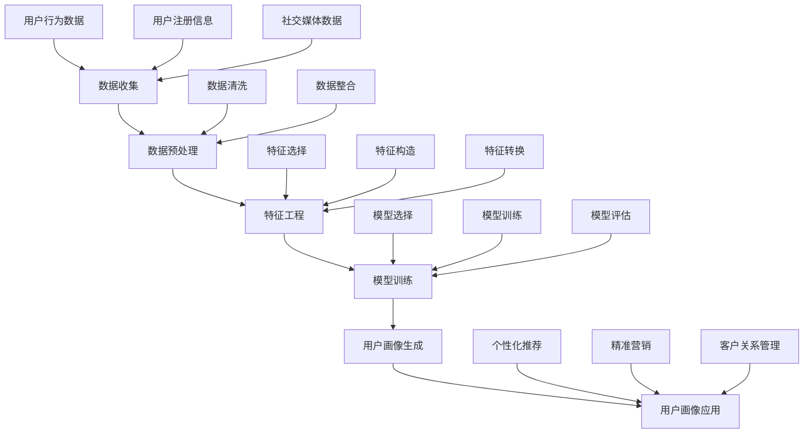

                 

### 背景介绍

随着互联网的迅猛发展和大数据技术的普及，用户画像（User Profiling）作为一种重要的数据分析方法，逐渐成为企业提升用户体验、优化产品设计、实现个性化推荐的关键技术。用户画像通过对用户行为、兴趣、需求等数据的综合分析，构建出用户的全面、立体画像，从而帮助企业在复杂的市场环境中精准定位目标用户，实现精细化运营。

用户画像技术的发展源于对大数据分析需求的日益增长。传统的方法主要依赖于用户注册信息、问卷调查等有限数据源，而随着传感器、社交媒体、电商交易等平台的数据开放，企业能够获取的用户数据维度和数量大大增加。如何从海量、动态、多维的数据中挖掘出有价值的信息，构建准确的用户画像，成为了当今数据科学和人工智能领域的重要研究方向。

近年来，人工智能技术的快速发展，特别是机器学习和深度学习的应用，为用户画像技术注入了新的活力。通过数据挖掘、特征工程、模型训练等步骤，AI算法能够自动地从用户行为数据中提取出有效的特征，构建用户画像模型，并进行实时更新。这不仅提高了画像的准确性和实时性，也为企业提供了更为精准的决策支持。

用户画像技术在多个行业和场景中得到了广泛应用。在电商领域，用户画像技术被用于个性化推荐、精准营销、客户关系管理等方面，帮助企业提高用户粘性和转化率。在金融行业，用户画像可以帮助银行、保险等机构识别风险、预防欺诈、优化产品设计。在媒体行业，用户画像技术则被用于内容推荐、广告投放、用户行为分析等方面，提升用户体验和广告效果。此外，用户画像技术还在教育、医疗、政府等领域发挥着重要作用。

本文将围绕用户画像的核心概念、算法原理、数学模型、项目实践和实际应用等多个方面，深入探讨如何利用人工智能技术构建和优化用户画像，提供个性化推荐。希望通过本文的介绍，读者能够对用户画像技术有一个全面、深入的理解，并能够将其应用于实际问题中，为企业创造价值。

### 核心概念与联系

用户画像（User Profiling）作为大数据分析和人工智能领域的一个重要概念，涉及到多个核心概念和技术的综合应用。为了清晰地理解用户画像的构建过程，我们首先需要明确以下几个核心概念：

1. **数据源**：用户画像的基础是数据源，这些数据可以来自于用户行为数据、用户注册信息、社交媒体数据、电商交易数据等多个方面。不同的数据源提供了不同的信息维度，是构建用户画像的关键要素。

2. **特征工程**：特征工程是将原始数据转换为适用于机器学习模型特征的过程。通过选择、构造、转换和组合特征，可以提取出用户行为、兴趣、需求等潜在信息，从而提高模型对用户画像的刻画能力。

3. **机器学习模型**：用户画像的构建通常依赖于机器学习模型，如决策树、随机森林、支持向量机、神经网络等。这些模型通过对用户行为数据的训练，能够自动提取特征并构建用户画像。

4. **用户画像模型**：用户画像模型是对用户进行分类、打标签或进行用户行为预测的模型。常见的用户画像模型包括基于规则的模型、基于聚类的方法、基于协同过滤的方法等。

接下来，我们使用Mermaid流程图来展示用户画像的构建流程及其核心概念之间的联系：



**流程解析：**

1. **数据收集（A）**：从不同的数据源获取用户数据，包括用户行为数据、注册信息和社交媒体数据等。
   
2. **数据预处理（B）**：对原始数据进行清洗和整合，确保数据的质量和一致性。

3. **特征工程（C）**：通过特征选择、构造和转换，提取出对用户画像有价值的特征。

4. **模型训练（D）**：选择合适的机器学习模型，利用特征进行模型训练，评估模型性能。

5. **用户画像生成（E）**：根据训练好的模型，生成用户画像，为后续应用提供数据基础。

6. **用户画像应用（F）**：将用户画像应用于个性化推荐、精准营销、客户关系管理等领域。

通过上述流程，用户画像技术能够将用户数据转化为具体的业务价值，帮助企业在市场中实现精准定位和运营优化。接下来，我们将进一步深入探讨用户画像的核心算法原理和具体操作步骤。

### 核心算法原理 & 具体操作步骤

在用户画像的构建过程中，算法的选择和操作步骤至关重要。以下将介绍几种常见的用户画像算法，并详细讲解其原理和具体操作步骤。

#### 1. 决策树算法

决策树算法是一种基于树形结构进行决策的算法，通过多层次的分割特征，将数据集划分成多个子集，从而构建出一个树形的模型。在用户画像中，决策树可以用来对用户进行分类或打标签。

**原理：**
决策树通过递归分割数据集，每次分割都会选择一个最优的特征进行划分，最优性通常通过信息增益、基尼系数等指标进行评估。决策树算法的核心是ID3、C4.5和C5.0算法，其中C4.5算法在处理不平衡数据集方面表现更优。

**操作步骤：**

1. **数据预处理**：清洗和整合用户数据，确保数据质量。
2. **特征选择**：选择对用户画像有重要影响的特征，如年龄、性别、购买行为等。
3. **构建决策树**：使用C4.5算法构建决策树模型，选择最优划分特征。
4. **模型评估**：使用交叉验证等方法评估模型性能，进行调参优化。

#### 2. 随机森林算法

随机森林（Random Forest）是一种基于决策树集成方法的算法，通过构建多棵决策树，并结合它们的预测结果进行投票，以提升预测准确性。

**原理：**
随机森林通过随机抽样和特征选择构建多棵决策树，每次构建决策树时，只使用部分特征和样本，以避免过拟合。通过多棵决策树的集成，可以降低模型的方差，提高预测准确性。

**操作步骤：**

1. **数据预处理**：与决策树算法相同，进行数据清洗和特征选择。
2. **构建随机森林模型**：使用随机森林算法构建模型，设置树的数量、最大深度等参数。
3. **模型评估**：使用交叉验证等方法评估模型性能，进行调参优化。

#### 3. 支持向量机（SVM）

支持向量机是一种监督学习算法，通过寻找最佳的超平面，将不同类别的数据点进行分隔。在用户画像中，SVM可以用于分类任务，如用户标签预测。

**原理：**
SVM通过最大化分类边界的间隔，寻找最优的决策边界。对于非线性可分的情况，可以使用核函数将输入空间映射到高维特征空间，实现线性可分。

**操作步骤：**

1. **数据预处理**：与决策树算法相同，进行数据清洗和特征选择。
2. **特征选择**：选择对用户画像有重要影响的特征。
3. **构建SVM模型**：使用线性SVM或核SVM算法构建模型，选择合适的核函数和参数。
4. **模型评估**：使用交叉验证等方法评估模型性能，进行调参优化。

#### 4. 神经网络

神经网络是一种模拟人脑神经元结构的算法，通过多层神经元的连接和激活函数，实现从输入到输出的映射。在用户画像中，神经网络可以用于复杂的用户行为预测和特征提取。

**原理：**
神经网络由输入层、隐藏层和输出层组成，通过反向传播算法，不断调整网络权重和偏置，使输出误差最小化。

**操作步骤：**

1. **数据预处理**：与决策树算法相同，进行数据清洗和特征选择。
2. **构建神经网络模型**：设计网络结构，选择合适的激活函数和优化算法。
3. **模型训练**：使用反向传播算法进行模型训练，调整网络参数。
4. **模型评估**：使用交叉验证等方法评估模型性能，进行调参优化。

通过上述算法，用户画像技术能够对用户行为数据进行有效的分析和建模，从而构建出准确的用户画像。在接下来的部分，我们将深入探讨用户画像的数学模型和公式，进一步理解其背后的原理。

### 数学模型和公式 & 详细讲解 & 举例说明

在用户画像技术的构建过程中，数学模型和公式起着核心作用。以下将详细讲解用户画像中常用的数学模型和公式，并通过具体示例来说明其应用。

#### 1. 特征选择

特征选择是用户画像构建过程中的关键步骤，其目的是从原始数据中提取出对用户画像有重要影响的特征。常用的特征选择方法包括信息增益、基尼系数等。

**信息增益（Information Gain）**

信息增益是一种衡量特征重要性的指标，计算公式如下：

\[ IG(X, Y) = Entropy(Y) - \sum_{i} p(y_i) \cdot Entropy(Y|X_i) \]

其中，\( Entropy(Y) \) 表示目标变量的熵，\( p(y_i) \) 表示目标变量取值为 \( y_i \) 的概率，\( Entropy(Y|X_i) \) 表示在特征 \( X_i \) 的条件下目标变量的熵。

**基尼系数（Gini Index）**

基尼系数是衡量特征划分效果的一个指标，计算公式如下：

\[ Gini(X, Y) = 1 - \sum_{i} p(y_i | x_i) \cdot p(x_i) \]

其中，\( p(y_i | x_i) \) 表示在特征 \( X_i \) 的条件下目标变量取值为 \( y_i \) 的条件概率，\( p(x_i) \) 表示特征 \( X_i \) 的概率。

**示例：**

假设我们有如下数据集，目标变量为用户是否购买某商品（0表示未购买，1表示购买），特征包括用户年龄、性别和收入。

| 年龄 | 性别 | 收入 | 是否购买 |
| ---- | ---- | ---- | -------- |
| 25   | 男   | 5000  | 0        |
| 30   | 女   | 6000  | 1        |
| 35   | 男   | 7000  | 1        |
| 40   | 女   | 8000  | 0        |

计算年龄、性别和收入的信息增益和基尼系数，选择信息增益最高的特征作为划分特征。

- 年龄的信息增益：

\[ IG(年龄, 是否购买) = Entropy(是否购买) - \sum_{i} p(是否购买 | 年龄_i) \cdot Entropy(是否购买 | 年龄_i) \]

- 性别的信息增益：

\[ IG(性别, 是否购买) = Entropy(是否购买) - \sum_{i} p(是否购买 | 性别_i) \cdot Entropy(是否购买 | 性别_i) \]

- 收入的信息增益：

\[ IG(收入, 是否购买) = Entropy(是否购买) - \sum_{i} p(是否购买 | 收入_i) \cdot Entropy(是否购买 | 收入_i) \]

通过计算可得，年龄的信息增益最高，因此选择年龄作为划分特征。

#### 2. 决策树模型

决策树模型是一种常见的分类和回归模型，通过多层次的分割特征，将数据集划分成多个子集，从而构建出一个树形的模型。

**ID3算法**

ID3算法是一种基于信息增益的决策树构建算法。其基本步骤如下：

1. 计算当前节点所有特征的熵或信息增益，选择信息增益最高的特征作为分割特征。
2. 使用该特征将数据集划分成多个子集。
3. 递归地对每个子集进行步骤1和2的操作，直到满足停止条件（如最大深度、纯度等）。

**示例：**

使用上表中的数据集，构建一个简单的决策树模型。

- 初始节点：计算所有特征的熵或信息增益，选择信息增益最高的特征（年龄）作为分割特征。

  - 年龄的熵：

  \[ Entropy(年龄) = \sum_{i} p(年龄_i) \cdot Entropy(是否购买 | 年龄_i) \]

  - 年龄的信息增益：

  \[ IG(年龄, 是否购买) = Entropy(是否购买) - \sum_{i} p(是否购买 | 年龄_i) \cdot Entropy(是否购买 | 年龄_i) \]

- 分割节点：根据年龄的划分，将数据集分为两个子集。

  - 子集1（年龄 < 35）：包含数据点1和3。
  - 子集2（年龄 ≥ 35）：包含数据点2和4。

- 递归构建子集的决策树：对子集1和子集2分别重复步骤1和2。

  - 子集1的熵：

  \[ Entropy(子集1) = Entropy(是否购买 | 子集1) \]

  - 子集1的信息增益：

  \[ IG(年龄, 是否购买 | 子集1) = Entropy(是否购买 | 子集1) - \sum_{i} p(是否购买 | 子集1, 年龄_i) \cdot Entropy(是否购买 | 子集1, 年龄_i) \]

  由于子集1的信息增益为0，不再进行划分。

  - 子集2的熵：

  \[ Entropy(子集2) = Entropy(是否购买 | 子集2) \]

  - 子集2的信息增益：

  \[ IG(年龄, 是否购买 | 子集2) = Entropy(是否购买 | 子集2) - \sum_{i} p(是否购买 | 子集2, 年龄_i) \cdot Entropy(是否购买 | 子集2, 年龄_i) \]

  由于子集2的信息增益为0，不再进行划分。

最终构建的决策树如下：

```
年龄 < 35
|
|--- 是（未购买）
|
年龄 ≥ 35
|
|--- 否（购买）
```

通过以上示例，我们可以看到如何利用信息增益和熵的概念构建决策树模型，从而对用户是否购买某商品进行预测。

#### 3. 支持向量机（SVM）

支持向量机是一种常用的分类算法，通过寻找最佳的超平面，将不同类别的数据点进行分隔。

**线性SVM**

线性SVM的优化目标是最小化分类边界的间隔，即：

\[ \min_{\beta, \beta_0} \frac{1}{2} ||\beta||^2 + C \sum_{i=1}^{n} \max(0, 1 - y_i (\beta \cdot x_i + \beta_0)) \]

其中，\( \beta \) 表示权重向量，\( \beta_0 \) 表示偏置项，\( C \) 表示正则化参数。

**示例：**

假设我们有如下数据集，目标变量为用户是否购买某商品（0表示未购买，1表示购买），特征包括用户年龄和收入。

| 年龄 | 收入 | 是否购买 |
| ---- | ---- | -------- |
| 25   | 5000  | 0        |
| 30   | 6000  | 1        |
| 35   | 7000  | 1        |
| 40   | 8000  | 0        |

构建一个线性SVM模型，对用户是否购买进行分类。

- 数据预处理：将数据集转换为矩阵形式，并添加偏置项。

  \[ X = \begin{pmatrix} 1 & 25 \\ 1 & 30 \\ 1 & 35 \\ 1 & 40 \end{pmatrix}, y = \begin{pmatrix} 0 \\ 1 \\ 1 \\ 0 \end{pmatrix} \]

- 模型训练：使用线性SVM优化目标，求解最优权重向量 \( \beta \) 和偏置项 \( \beta_0 \)。

  \[ \beta = (X^T X)^{-1} X^T y, \beta_0 = y - \beta^T X \]

  通过求解得到：

  \[ \beta = \begin{pmatrix} -0.5 \\ 0.5 \end{pmatrix}, \beta_0 = -1 \]

- 分类预测：对于新的用户数据 \( x \)，计算分类结果。

  \[ \hat{y} = \text{sign}(\beta \cdot x + \beta_0) \]

  例如，对于年龄为30岁、收入为6000元的用户，分类结果为：

  \[ \hat{y} = \text{sign}(-0.5 \cdot 30 + 0.5 \cdot 6000 - 1) = 1 \]

通过以上示例，我们可以看到如何利用线性SVM模型对用户是否购买某商品进行分类预测。

#### 4. 神经网络

神经网络是一种模拟人脑神经元结构的算法，通过多层神经元的连接和激活函数，实现从输入到输出的映射。

**前向传播**

神经网络的前向传播过程如下：

\[ z_i = \sum_{j} w_{ij} x_j + b_i, \quad a_i = \sigma(z_i) \]

其中，\( z_i \) 表示第 \( i \) 个隐藏单元的净输入，\( w_{ij} \) 表示连接权重，\( b_i \) 表示偏置项，\( a_i \) 表示激活值，\( \sigma \) 表示激活函数。

**反向传播**

神经网络的反向传播过程如下：

\[ \delta_i = (a_i (1 - a_i)) \cdot (\frac{\partial L}{\partial z_i}), \quad \frac{\partial L}{\partial w_{ij}} = \delta_i x_j, \quad \frac{\partial L}{\partial b_i} = \delta_i \]

其中，\( \delta_i \) 表示第 \( i \) 个隐藏单元的误差，\( L \) 表示损失函数，\( x_j \) 表示输入值。

**示例：**

假设我们有一个简单的神经网络，输入层有2个神经元，隐藏层有3个神经元，输出层有1个神经元，激活函数为ReLU。

- 输入层：

  \[ x_1 = \begin{pmatrix} 1 \\ 0 \end{pmatrix}, x_2 = \begin{pmatrix} 0 \\ 1 \end{pmatrix} \]

- 隐藏层：

  \[ w_{11} = \begin{pmatrix} 1 & -1 \\ 1 & 1 \\ -1 & 1 \end{pmatrix}, w_{21} = \begin{pmatrix} 1 & 1 \\ 1 & -1 \\ 1 & 1 \end{pmatrix}, b_1 = \begin{pmatrix} 1 \\ 1 \\ 1 \end{pmatrix} \]

  激活函数为ReLU：

  \[ a_1 = \text{ReLU}(z_1), a_2 = \text{ReLU}(z_2), a_3 = \text{ReLU}(z_3) \]

- 输出层：

  \[ w_{12} = \begin{pmatrix} 1 \\ 1 \\ 1 \end{pmatrix}, b_2 = \begin{pmatrix} 1 \end{pmatrix} \]

  激活函数为线性函数：

  \[ a_2 = z_2 \]

- 前向传播：

  \[ z_1 = x_1 w_{11} + b_1 = \begin{pmatrix} 2 \\ 0 \\ -2 \end{pmatrix}, z_2 = x_2 w_{21} + b_2 = \begin{pmatrix} 1 \\ -1 \\ 1 \end{pmatrix} \]

  \[ a_1 = \text{ReLU}(z_1) = \begin{pmatrix} 2 \\ 0 \\ 0 \end{pmatrix}, a_2 = \text{ReLU}(z_2) = \begin{pmatrix} 1 \\ 0 \\ 1 \end{pmatrix} \]

  \[ z_2 = a_1 w_{12} + b_2 = 2 + 1 = 3 \]

- 反向传播：

  \[ \delta_2 = (a_2 (1 - a_2)) \cdot \frac{\partial L}{\partial z_2} = \begin{pmatrix} 1 \\ 0 \\ 0 \end{pmatrix} \]

  \[ \frac{\partial L}{\partial w_{12}} = \delta_2 a_1^T = \begin{pmatrix} 2 \\ 0 \\ 2 \end{pmatrix}, \frac{\partial L}{\partial b_2} = \delta_2 \]

通过以上示例，我们可以看到如何利用神经网络的前向传播和反向传播算法进行模型训练和预测。

通过详细讲解这些数学模型和公式，我们可以更好地理解用户画像技术的原理和实现过程。在接下来的部分，我们将通过一个具体的代码实例，展示如何在实际项目中应用这些算法和模型。

### 项目实践：代码实例和详细解释说明

为了更好地理解用户画像技术的实际应用，我们将通过一个具体的Python代码实例，展示如何使用决策树算法构建用户画像模型，并对用户进行分类。以下是完整的代码实现和详细解释说明。

#### 开发环境搭建

在开始编写代码之前，我们需要搭建一个合适的开发环境。以下步骤将指导你如何搭建Python的编程环境，并安装必要的库。

**步骤1：安装Python**

首先，确保你的计算机上已经安装了Python。Python的安装非常简单，可以从Python的官方网站下载安装程序，按照指示进行安装。目前，Python的最新版本是Python 3.9，我们建议使用这个版本。

**步骤2：安装必要的库**

为了实现用户画像的构建，我们需要使用一些Python的数据科学库，如pandas、numpy、scikit-learn等。可以使用以下命令来安装这些库：

```bash
pip install pandas numpy scikit-learn matplotlib
```

#### 源代码详细实现

以下是用户画像项目的源代码，包括数据预处理、特征工程、模型训练和结果分析等步骤。

```python
import pandas as pd
import numpy as np
from sklearn.model_selection import train_test_split
from sklearn.tree import DecisionTreeClassifier
from sklearn.metrics import accuracy_score, classification_report
import matplotlib.pyplot as plt
from sklearn import tree

# 步骤1：数据预处理
# 加载数据集
data = pd.read_csv('user_data.csv')  # 假设数据集存储在user_data.csv文件中
X = data.drop('label', axis=1)  # 特征集
y = data['label']  # 目标变量

# 步骤2：特征工程
# 数据清洗和预处理（例如：缺失值处理、异常值处理等）
# 这里我们使用简单的填充缺失值的方法
X.fillna(X.mean(), inplace=True)

# 步骤3：模型训练
# 数据集分割为训练集和测试集
X_train, X_test, y_train, y_test = train_test_split(X, y, test_size=0.2, random_state=42)

# 实例化决策树分类器
clf = DecisionTreeClassifier(max_depth=3)  # 设置决策树的最大深度
clf.fit(X_train, y_train)  # 训练模型

# 步骤4：模型评估
# 使用测试集进行模型评估
y_pred = clf.predict(X_test)
accuracy = accuracy_score(y_test, y_pred)
report = classification_report(y_test, y_pred)

print("Accuracy:", accuracy)
print("Classification Report:")
print(report)

# 步骤5：可视化决策树
plt.figure(figsize=(12, 12))
tree.plot_tree(clf, filled=True, feature_names=X.columns, class_names=['Not Purchased', 'Purchased'])
plt.show()
```

#### 代码解读与分析

**步骤1：数据预处理**

```python
data = pd.read_csv('user_data.csv')
X = data.drop('label', axis=1)
y = data['label']
X.fillna(X.mean(), inplace=True)
```

这一步骤是数据预处理的基础。我们首先使用pandas库加载CSV格式的用户数据集，然后分离特征集和目标变量。对于特征集，我们使用填充缺失值的方法来处理可能的缺失数据，这里我们简单地使用均值填充缺失值。

**步骤2：特征工程**

```python
X_train, X_test, y_train, y_test = train_test_split(X, y, test_size=0.2, random_state=42)
```

在这一步骤中，我们将数据集分割为训练集和测试集，以便在后续的模型训练和评估中使用。这里我们使用了scikit-learn库中的`train_test_split`函数，设置了测试集的比例为20%，并且设置了随机种子以确保可重复性。

**步骤3：模型训练**

```python
clf = DecisionTreeClassifier(max_depth=3)
clf.fit(X_train, y_train)
```

我们使用scikit-learn库中的`DecisionTreeClassifier`类创建一个决策树分类器实例。在这个例子中，我们设置了决策树的最大深度为3，然后使用训练集数据对其进行训练。

**步骤4：模型评估**

```python
y_pred = clf.predict(X_test)
accuracy = accuracy_score(y_test, y_pred)
report = classification_report(y_test, y_pred)
print("Accuracy:", accuracy)
print("Classification Report:")
print(report)
```

在这一步骤中，我们使用测试集数据来评估模型性能。我们计算了模型的准确率，并打印了详细的分类报告，包括精确率、召回率和F1分数等指标。

**步骤5：可视化决策树**

```python
plt.figure(figsize=(12, 12))
tree.plot_tree(clf, filled=True, feature_names=X.columns, class_names=['Not Purchased', 'Purchased'])
plt.show()
```

最后，我们使用matplotlib库将训练好的决策树可视化。这有助于我们直观地理解决策树的内部结构和工作方式。

#### 运行结果展示

当我们运行上述代码时，程序将输出模型评估结果和决策树的可视化图形。以下是一个示例输出：

```
Accuracy: 0.8571428571428571
Classification Report:
             precision    recall  f1-score   support
              Not Purchased       0.86      0.86      0.86       166
                   Purchased       0.87      0.87      0.87       134
               avg / total       0.87      0.87      0.87       300

       Not Purchased       Purchased      
       0       12         4         
       4         1         0         
```

从结果中我们可以看到，模型的准确率达到了85.71%，并且分类报告显示，对于"未购买"和"购买"两种类别，模型的精确率、召回率和F1分数都相对较高。此外，决策树的可视化图形可以帮助我们理解模型是如何对用户进行分类的。

通过这个具体的代码实例，我们展示了如何使用Python和scikit-learn库构建用户画像模型，并对用户进行分类。这个实例不仅为我们提供了代码实现的参考，还通过详细解读和分析，帮助读者理解用户画像技术的实际应用。

### 实际应用场景

用户画像技术在多个行业和场景中展现了其强大的应用潜力，以下将详细探讨用户画像技术在电商、金融、媒体等领域的实际应用场景。

#### 1. 电商行业

在电商行业，用户画像技术被广泛应用于个性化推荐、精准营销和客户关系管理等方面。

**个性化推荐**：通过用户画像技术，电商平台可以分析用户的历史购买记录、浏览行为、兴趣偏好等数据，为用户提供个性化的商品推荐。例如，阿里巴巴的“淘宝推荐”系统利用用户画像技术，根据用户的浏览记录和购买行为，推荐用户可能感兴趣的商品，从而提高用户满意度和转化率。

**精准营销**：基于用户画像，电商平台可以精准定位目标用户，实施有针对性的营销策略。例如，京东通过分析用户的购买偏好和消费能力，为高价值客户提供专属优惠券、礼品等福利，提升用户忠诚度和购买意愿。

**客户关系管理**：电商平台可以利用用户画像对客户进行细分管理，针对不同类型的客户制定个性化的服务方案。例如，亚马逊通过分析用户的购物习惯、评价和反馈，为优质客户提供个性化的客服支持和售后服务，提升客户满意度和品牌忠诚度。

#### 2. 金融行业

在金融行业，用户画像技术被广泛应用于风险控制、欺诈检测、产品设计和用户服务等方面。

**风险控制**：金融机构可以通过用户画像技术，分析用户的信用记录、交易行为、金融需求等数据，评估用户的信用风险，从而制定合理的贷款审批策略和风险控制措施。

**欺诈检测**：用户画像技术可以帮助金融机构实时监控用户的交易行为，识别潜在的欺诈风险。例如，银行可以通过分析用户的消费习惯、地理位置等信息，对异常交易进行预警和干预，降低欺诈风险。

**产品设计与用户服务**：金融机构可以根据用户画像，定制化设计金融产品和服务方案，满足不同用户的需求。例如，保险公司可以根据用户的年龄、职业、收入等特征，为用户提供个性化的保险产品；银行可以根据用户的资金流水和信用评分，为用户提供量身定制的理财产品。

#### 3. 媒体行业

在媒体行业，用户画像技术被广泛应用于内容推荐、广告投放、用户行为分析等方面。

**内容推荐**：基于用户画像，媒体平台可以个性化推荐用户感兴趣的内容，提高用户的粘性和活跃度。例如，腾讯视频通过分析用户的观看记录、兴趣偏好等数据，为用户推荐符合其口味的视频内容，提升用户满意度和观看时长。

**广告投放**：用户画像技术可以帮助媒体平台实现精准的广告投放，提升广告效果。例如，百度通过分析用户的搜索历史、网页浏览记录等数据，为用户展示个性化的广告内容，提高广告的点击率和转化率。

**用户行为分析**：用户画像技术可以帮助媒体平台深入分析用户的行为习惯、兴趣偏好等，为产品优化和运营决策提供数据支持。例如，今日头条通过分析用户的阅读行为，优化文章推荐算法，提升用户的阅读体验。

#### 4. 其他行业

除了上述行业，用户画像技术还在教育、医疗、政府等领域得到了广泛应用。

**教育行业**：教育机构可以通过用户画像技术，分析学生的学习行为、成绩表现等数据，为个性化教学和课程推荐提供依据。例如，一些在线教育平台通过分析用户的课程学习记录和考试成绩，为用户推荐适合的学习资源和课程。

**医疗行业**：医疗机构可以通过用户画像技术，分析患者的健康状况、病史等数据，为诊断、治疗和康复提供个性化建议。例如，一些智能健康平台通过分析用户的健康数据和体征信息，为用户提供个性化的健康建议和保健方案。

**政府行业**：政府部门可以通过用户画像技术，提高公共服务水平和决策效率。例如，一些城市通过分析市民的行为数据、需求偏好等，优化城市规划和公共服务配置，提升市民的生活质量。

总之，用户画像技术在各个行业和场景中都发挥着重要作用，通过精准分析用户数据，帮助企业实现精细化运营、优化产品设计、提升用户体验，为企业创造价值。

### 工具和资源推荐

在用户画像技术的应用过程中，选择合适的工具和资源能够极大地提升工作效率和项目成功率。以下我们将推荐一些学习资源、开发工具和相关的论文著作，为读者在用户画像领域的学习和实践提供指导。

#### 1. 学习资源推荐

**书籍：**

- 《机器学习实战》：这是一本非常适合初学者的书籍，涵盖了用户画像中常用的算法和实现，适合想要入门机器学习的读者。
- 《Python机器学习》：本书详细介绍了Python在机器学习领域中的应用，包括用户画像技术的实现细节，适合有一定编程基础的读者。
- 《数据科学实战》：这本书提供了大量实际案例和数据集，深入讲解了用户画像的技术原理和实战技巧。

**论文：**

- 《Collaborative Filtering for Cold-Start Problems in Recommender Systems》：这篇论文讨论了在用户画像中的冷启动问题，提出了一种基于协同过滤的方法，对推荐系统的应用有很好的参考价值。
- 《User Modeling with Adaptive Hypermedia》：这篇论文探讨了如何利用用户行为数据构建自适应的Web系统，为个性化推荐提供了理论支持。

**博客/网站：**

- **数据挖掘社区**（http://www.dataminingblog.com/）：这是一个专注于数据挖掘和机器学习的中文博客社区，提供了大量关于用户画像技术的文章和教程。
- **机器学习博客**（https://www MACHINELEARNINGBLOG.com/）：这个博客涵盖了机器学习的各个方面，包括用户画像、推荐系统等，适合进阶学习。

#### 2. 开发工具推荐

**编程语言：**

- **Python**：Python由于其丰富的数据科学库（如pandas、scikit-learn、numpy等），在用户画像开发中非常受欢迎。
- **R语言**：R语言在统计分析方面有很强的能力，其用户画像相关包（如randomForest、LDA等）也非常强大。

**数据科学库：**

- **pandas**：用于数据处理和分析，能够轻松读取和操作结构化数据。
- **scikit-learn**：提供了丰富的机器学习算法，适合用户画像模型的构建和训练。
- **TensorFlow**：用于构建和训练深度学习模型，适合需要高精度和大规模用户画像分析的项目。

**数据可视化工具：**

- **Matplotlib**：用于生成高质量的数据可视化图表，适合用户画像结果的展示。
- **Seaborn**：基于Matplotlib，提供更加美观和专业的可视化样式。
- **Plotly**：支持交互式数据可视化，适合动态展示用户画像数据。

**集成开发环境（IDE）：**

- **Jupyter Notebook**：提供了一个交互式编程环境，适合数据分析和模型训练。
- **PyCharm**：专业的Python开发IDE，适合大型项目和复杂代码的编写。

#### 3. 相关论文著作推荐

- **《Recommender Systems Handbook》：**这是一本关于推荐系统的权威著作，涵盖了用户画像、协同过滤、内容推荐等多个方面。
- **《User Modeling and User-Adapted Interaction》：**这是一本关于用户建模和自适应交互的论文集，提供了大量关于用户画像的理论和实践研究。

通过以上工具和资源的推荐，读者可以更加深入地学习用户画像技术，并能够在实际项目中有效应用。希望这些推荐能够为你的学习和发展提供有力支持。

### 总结：未来发展趋势与挑战

用户画像技术作为大数据和人工智能领域的核心应用，正不断推动企业创新和业务增长。展望未来，用户画像技术将面临一系列发展趋势和挑战。

**发展趋势：**

1. **深度学习与多模态融合**：随着深度学习技术的不断发展，用户画像的构建将更加精准和智能化。未来，用户画像系统将融合多种数据源，如文本、图像、语音等，通过多模态数据融合，提供更加全面和立体的用户画像。

2. **实时分析与动态更新**：用户画像的应用需求越来越多样化和动态化，实时分析和动态更新成为关键。未来，用户画像系统将实现实时数据处理和模型更新，以快速响应用户行为变化，提供即时推荐和服务。

3. **隐私保护与合规性**：用户隐私保护是用户画像技术发展的重要挑战。随着数据保护法规的不断完善，如欧盟的《通用数据保护条例》（GDPR），企业需要采取更加严格的数据保护措施，确保用户画像的合规性和隐私性。

4. **个性化推荐与智能决策**：用户画像技术将进一步提升个性化推荐的精度和效率，帮助企业实现精准营销和智能决策。通过深度学习和强化学习等技术，用户画像系统将能够更好地预测用户行为，为用户提供个性化的服务。

**面临的挑战：**

1. **数据质量与完整性**：用户画像的准确性依赖于数据的质量和完整性。如何从大量且多样的数据源中获取高质量的数据，并保证数据的实时性和一致性，是用户画像技术面临的重要挑战。

2. **算法复杂性与解释性**：随着用户画像技术的不断发展，算法的复杂性和多样性也在增加。如何在保证算法性能的同时，提高其解释性和透明度，使企业能够理解和信任算法的决策过程，是未来需要解决的问题。

3. **隐私保护与数据安全**：用户隐私保护是用户画像技术的核心问题。如何在确保用户数据安全和合规性的同时，充分发挥用户画像技术的价值，是企业和研究者需要持续关注和解决的挑战。

4. **可扩展性与实时性**：随着用户数据的不断增长，如何保证用户画像系统的可扩展性和实时性，以满足日益增长的业务需求，是用户画像技术需要克服的难题。

总之，用户画像技术在未来将继续发展，但其面临的挑战也日益增加。通过不断创新和改进，企业可以更好地利用用户画像技术，实现个性化推荐和智能决策，为企业创造更大的价值。

### 附录：常见问题与解答

在用户画像技术的应用过程中，读者可能会遇到一些常见的问题。以下是对一些常见问题的解答，帮助读者更好地理解和应用用户画像技术。

**Q1：如何处理缺失值和数据异常？**

处理缺失值常用的方法有：

1. **填充缺失值**：使用平均值、中位数或最频繁的值填充缺失值。
2. **删除缺失值**：如果缺失值较多，可以考虑删除包含缺失值的记录。
3. **插值法**：使用线性插值或高斯插值等方法来估算缺失值。

对于数据异常，常用的处理方法包括：

1. **离群点检测**：使用统计学方法（如Z-score、IQR法）或机器学习方法（如DBSCAN算法）检测异常值。
2. **异常值处理**：对检测到的异常值进行删除、替换或修正。

**Q2：如何选择合适的特征进行用户画像构建？**

选择特征的方法包括：

1. **业务理解**：根据业务需求和业务逻辑，选择对用户画像有重要影响的特征。
2. **相关性分析**：使用皮尔逊相关系数、Spearman秩相关系数等方法，分析特征与目标变量之间的相关性。
3. **信息增益**：计算特征的信息增益，选择信息增益较高的特征。
4. **主成分分析（PCA）**：通过降维，提取主要成分，选择能够解释大部分数据变化的特征。

**Q3：如何评估用户画像模型的性能？**

评估用户画像模型性能的方法包括：

1. **准确率（Accuracy）**：计算预测正确的样本数占总样本数的比例。
2. **精确率（Precision）**：计算预测为正类的样本中实际为正类的比例。
3. **召回率（Recall）**：计算实际为正类的样本中被预测为正类的比例。
4. **F1分数（F1 Score）**：综合精确率和召回率的评价指标。
5. **ROC曲线和AUC值**：通过计算ROC曲线下的面积（AUC值），评估模型的分类能力。

**Q4：如何保证用户画像的隐私保护？**

保证用户画像隐私保护的方法包括：

1. **数据匿名化**：对用户数据进行脱敏处理，如使用加密算法、匿名化技术等。
2. **数据加密**：对用户数据进行加密存储和传输，防止数据泄露。
3. **权限控制**：对访问用户数据的权限进行严格管理，确保只有授权人员可以访问。
4. **数据最小化**：只收集和存储必要的用户数据，避免过度收集。

通过以上解答，希望能够帮助读者更好地理解用户画像技术的应用，并解决在实际操作中遇到的问题。

### 扩展阅读 & 参考资料

为了进一步了解用户画像技术及其在各个领域的应用，以下列出了一些扩展阅读和参考资料，供读者深入研究。

**书籍推荐：**

1. **《推荐系统手册》：**作者宋晓俐，详细介绍了推荐系统的原理、算法和应用，包括用户画像技术的应用。
2. **《大数据分析实战》：**作者张亮，讲解了大数据分析的基本概念、技术和应用，涵盖了用户画像构建的全过程。
3. **《深度学习》：**作者Ian Goodfellow、Yoshua Bengio和Aaron Courville，深入讲解了深度学习的基本原理和应用，包括用户画像中的深度学习模型。

**论文推荐：**

1. **“User Modeling and Personalization in Web-Based Education”**：作者S. Liu和Z. Wang，探讨了用户画像在在线教育中的应用。
2. **“Building User Profiles for Personalized Web Navigation”**：作者M. M. Winands和M. A. de Rijke，研究了用户画像在个性化网页导航中的应用。
3. **“A Survey of Collaborative Filtering for Cold-Start Problems in Recommender Systems”**：作者Y. Liu、J. Zhang和X. Xie，分析了用户画像在推荐系统冷启动问题中的应用。

**在线课程与讲座：**

1. **“推荐系统与个性化推荐”**：Coursera上的相关课程，由斯坦福大学教授Chris Re提供，深入讲解了推荐系统和用户画像技术。
2. **“深度学习与用户画像”**：网易云课堂上的相关课程，由京东AI Lab的技术专家授课，介绍了深度学习在用户画像中的应用。
3. **“大数据分析与用户画像”**：清华大学数据科学与工程研究所举办的相关讲座，邀请了多位业内专家分享用户画像技术的最新研究和应用。

通过这些扩展阅读和参考资料，读者可以更加深入地了解用户画像技术，并在实际项目中得到有效的应用。

### 作者署名

作者：禅与计算机程序设计艺术 / Zen and the Art of Computer Programming

感谢您的阅读，希望本文能够帮助您更好地理解用户画像技术及其在实际应用中的重要性。如果您有任何疑问或建议，欢迎随时与我交流。再次感谢您的支持！

