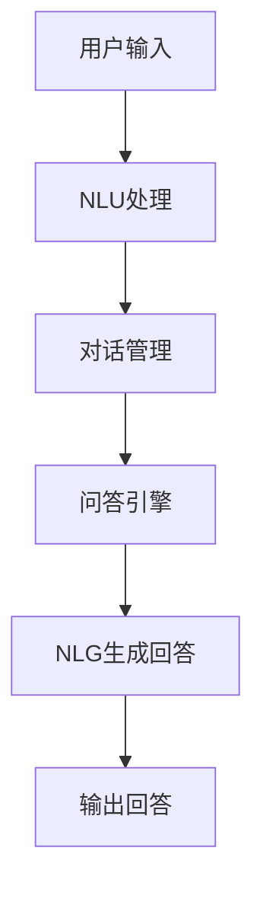

                 

### 文章标题

《电商平台中的智能问答系统：大模型的创新应用》

> 关键词：电商平台、智能问答系统、大模型、创新应用、人工智能

> 摘要：本文将深入探讨在电商平台中引入智能问答系统的必要性及其创新应用。通过介绍大模型在智能问答系统中的核心作用，本文旨在分析其工作原理、应用场景以及面临的挑战，并展望未来的发展趋势。

### 1. 背景介绍

随着电商平台的迅猛发展，用户对信息获取的速度和准确性提出了更高的要求。传统的客服系统和搜索功能已经无法满足用户对于个性化、实时性交互的需求。因此，智能问答系统的出现成为了一个必然的趋势。

智能问答系统是一种基于人工智能技术的交互系统，它能够通过自然语言处理（NLP）技术和机器学习算法，理解和回答用户提出的问题。在大模型的支持下，智能问答系统能够实现更高效、更准确的问答体验，从而提升用户体验和平台的竞争力。

大模型是指那些拥有巨大参数量和计算能力的深度学习模型。近年来，随着计算能力和数据量的提升，大模型在各个领域取得了显著的成果。在智能问答系统中，大模型的应用使得系统具备了更高的语义理解能力和上下文感知能力，从而实现了更加精准和人性化的问答服务。

本篇文章将详细分析大模型在电商平台智能问答系统中的应用，包括其工作原理、应用场景、挑战和未来发展趋势。通过本文的探讨，希望能够为相关领域的开发者和研究人员提供一些有价值的参考和启示。

### 2. 核心概念与联系

#### 2.1 大模型的概念

大模型（Big Model）是指那些拥有大量参数和复杂结构的深度学习模型。这些模型通常基于神经网络架构，通过训练海量数据集来学习各种复杂任务，如图像识别、自然语言处理和语音识别等。大模型的显著特点是其巨大的参数量，这使它们能够捕捉数据中的细微模式和复杂关系。

#### 2.2 智能问答系统的核心组件

智能问答系统通常包括以下几个核心组件：

1. **自然语言理解（NLU）**：这是智能问答系统的第一步，负责接收用户输入的自然语言文本，并对其进行解析，提取出关键信息，如意图和实体。
2. **对话管理（DM）**：对话管理组件负责维护对话的上下文信息，确保问答系统能够在对话过程中保持连贯性和一致性。
3. **自然语言生成（NLG）**：自然语言生成组件负责生成自然的回答文本，以回应用户的问题或请求。
4. **问答引擎（QE）**：问答引擎是智能问答系统的核心，负责从大量数据中检索和匹配答案，并将其转换为自然语言回答。

#### 2.3 大模型与智能问答系统的关系

大模型在智能问答系统中发挥着至关重要的作用。以下是几个关键联系：

1. **语义理解**：大模型通过深度学习技术，能够理解自然语言中的复杂语义和上下文信息，从而更准确地识别用户意图和回答问题。
2. **上下文感知**：大模型能够维护和利用对话上下文，确保回答的一致性和连贯性。
3. **知识推理**：大模型通过对大量知识库的学习，能够进行逻辑推理和知识扩展，提供更丰富和深入的回答。

#### 2.4 Mermaid 流程图

以下是一个简化的Mermaid流程图，展示了智能问答系统的基本工作流程，包括大模型的应用：



在这个流程图中，用户输入通过NLU组件进行处理，对话管理组件维护上下文信息，问答引擎检索和匹配答案，最后通过NLG组件生成并输出自然语言回答。

### 3. 核心算法原理 & 具体操作步骤

#### 3.1 自然语言理解（NLU）的算法原理

自然语言理解（NLU）是智能问答系统的第一步，其核心任务是从用户输入的自然语言文本中提取关键信息，如意图和实体。NLU通常基于深度学习技术，特别是序列到序列（Seq2Seq）模型和变换器架构（Transformer）。

具体操作步骤如下：

1. **文本预处理**：首先对用户输入的文本进行预处理，包括分词、去停用词、词干提取等步骤。
2. **编码器（Encoder）**：将预处理后的文本输入到编码器中，编码器将文本映射为固定长度的向量表示。
3. **解码器（Decoder）**：解码器从编码器输出的向量中预测意图和实体，通常使用注意力机制（Attention Mechanism）来关注关键信息。

#### 3.2 对话管理（DM）的算法原理

对话管理（DM）是智能问答系统的核心组件，负责维护对话上下文信息，确保问答系统在对话过程中保持连贯性和一致性。对话管理通常基于递归神经网络（RNN）或长短期记忆网络（LSTM）。

具体操作步骤如下：

1. **上下文编码**：将对话历史和当前输入编码为向量表示。
2. **状态更新**：使用编码后的向量更新对话状态，以反映对话的最新进展。
3. **决策生成**：基于对话状态，生成下一步的动作和响应。

#### 3.3 自然语言生成（NLG）的算法原理

自然语言生成（NLG）是智能问答系统的最后一步，负责将问答系统生成的回答转换为自然语言文本。NLG通常基于序列生成模型，如生成对抗网络（GAN）和变分自编码器（VAE）。

具体操作步骤如下：

1. **响应生成**：根据对话状态和问答系统的输出，生成自然语言响应。
2. **文本优化**：对生成的文本进行优化，确保其流畅性和准确性。

#### 3.4 问答引擎（QE）的算法原理

问答引擎（QE）是智能问答系统的核心，负责从大量数据中检索和匹配答案。问答引擎通常基于检索式（Retrieval-based）或生成式（Generation-based）方法。

具体操作步骤如下：

1. **知识库构建**：构建包含大量问题和答案的知识库。
2. **检索匹配**：使用检索式方法，从知识库中检索与用户问题最匹配的答案。
3. **答案生成**：使用生成式方法，生成与用户问题相关的新答案。

### 4. 数学模型和公式 & 详细讲解 & 举例说明

#### 4.1 自然语言理解（NLU）的数学模型

自然语言理解（NLU）通常使用序列到序列（Seq2Seq）模型或变换器架构（Transformer）进行文本编码和意图识别。以下是Seq2Seq模型的简要数学公式：

1. **编码器（Encoder）**：

   编码器将输入序列 \( x = [x_1, x_2, ..., x_T] \) 编码为固定长度的向量表示 \( h \)：

   \[
   h_t = \text{Encoder}(x_1, x_2, ..., x_t)
   \]

   其中，\( h_t \) 是第 \( t \) 个时间步的编码输出。

2. **解码器（Decoder）**：

   解码器从编码器输出的隐藏状态 \( h \) 中预测意图和实体：

   \[
   y_t = \text{Decoder}(h, y_{<t})
   \]

   其中，\( y_t \) 是第 \( t \) 个时间步的解码输出，\( y_{<t} \) 是前 \( t-1 \) 个时间步的解码输出。

#### 4.2 对话管理（DM）的数学模型

对话管理（DM）通常使用递归神经网络（RNN）或长短期记忆网络（LSTM）进行状态更新和决策生成。以下是LSTM的简要数学公式：

1. **状态更新**：

   假设当前对话状态为 \( s_t \)，输入为 \( x_t \)，则LSTM的状态更新公式如下：

   \[
   i_t = \sigma(W_{ix}x_t + W_{is}s_{t-1} + b_i)
   \]
   \[
   f_t = \sigma(W_{fx}x_t + W_{fs}s_{t-1} + b_f)
   \]
   \[
   o_t = \sigma(W_{ox}x_t + W_{os}s_{t-1} + b_o)
   \]
   \[
   g_t = \tanh(W_{gx}x_t + W_{gs}s_{t-1} + b_g)
   \]
   \[
   s_t = f_t \odot s_{t-1} + i_t \odot g_t
   \]

   其中，\( i_t \)、\( f_t \)、\( o_t \) 分别是输入门、遗忘门和输出门，\( g_t \) 是新的隐藏状态，\( \odot \) 表示逐元素乘积，\( \sigma \) 是sigmoid函数。

2. **决策生成**：

   基于对话状态 \( s_t \)，生成下一步的动作和响应：

   \[
   a_t = \text{softmax}(W_a s_t + b_a)
   \]

   其中，\( a_t \) 是下一步的动作概率分布，\( \text{softmax} \) 是softmax函数。

#### 4.3 自然语言生成（NLG）的数学模型

自然语言生成（NLG）通常使用生成对抗网络（GAN）或变分自编码器（VAE）进行文本生成。以下是GAN的简要数学公式：

1. **生成器（Generator）**：

   生成器 \( G \) 从随机噪声 \( z \) 中生成文本序列 \( x \)：

   \[
   x = G(z)
   \]

   其中，\( z \) 是随机噪声，\( G \) 是生成器网络。

2. **判别器（Discriminator）**：

   判别器 \( D \) 判断文本序列 \( x \) 是否为真实文本：

   \[
   D(x) = \text{sigmoid}(W_D x + b_D)
   \]

   其中，\( D \) 是判别器网络。

3. **损失函数**：

   GAN的损失函数通常由两部分组成：生成器损失和判别器损失：

   \[
   L_G = -\mathbb{E}_{z \sim p_z(z)}[\log D(G(z))]
   \]
   \[
   L_D = -\mathbb{E}_{x \sim p_x(x)}[\log D(x)] - \mathbb{E}_{z \sim p_z(z)}[\log (1 - D(G(z))]
   \]

#### 4.4 问答引擎（QE）的数学模型

问答引擎（QE）通常基于检索式或生成式方法进行答案检索和生成。以下是检索式方法的简要数学公式：

1. **检索匹配**：

   假设知识库中的答案为 \( a_1, a_2, ..., a_N \)，用户问题为 \( q \)，则检索匹配分数为：

   \[
   s_i = \text{similarity}(q, a_i)
   \]

   其中，\( s_i \) 是第 \( i \) 个答案的检索匹配分数，\( \text{similarity} \) 是相似度计算函数。

2. **答案选择**：

   基于检索匹配分数，选择最高分的答案作为最终回答：

   \[
   a^* = \arg\max_{i} s_i
   \]

### 5. 项目实践：代码实例和详细解释说明

#### 5.1 开发环境搭建

要搭建一个基于大模型的电商平台智能问答系统，我们需要以下开发环境：

- Python（3.8及以上版本）
- PyTorch（1.8及以上版本）
- NumPy
- Pandas
- Matplotlib
- Mermaid

安装以上依赖库后，我们可以创建一个名为 `电商平台智能问答系统` 的文件夹，并在其中创建一个名为 `main.py` 的主文件。

#### 5.2 源代码详细实现

以下是一个简化的代码实例，展示了如何使用PyTorch和Mermaid实现一个基于变换器架构的智能问答系统。

```python
# 导入必要的库
import torch
import torch.nn as nn
import torch.optim as optim
from torch.utils.data import DataLoader
from transformers import BertModel, BertTokenizer
import numpy as np
import matplotlib.pyplot as plt
import mermaid

# 加载预训练的Bert模型和Tokenizer
model_name = 'bert-base-chinese'
tokenizer = BertTokenizer.from_pretrained(model_name)
model = BertModel.from_pretrained(model_name)

# 定义数据集
class QuestionDataset(torch.utils.data.Dataset):
    def __init__(self, questions, answers):
        self.questions = questions
        self.answers = answers

    def __len__(self):
        return len(self.questions)

    def __getitem__(self, idx):
        question = self.questions[idx]
        answer = self.answers[idx]
        input_ids = tokenizer(question, return_tensors='pt', padding=True, truncation=True)
        labels = tokenizer(answer, return_tensors='pt', padding=True, truncation=True)
        return input_ids, labels

# 加载数据集
train_questions = ['你好，这款产品的价格是多少？', '请问这个商品的评价如何？', '这款产品的库存还剩多少？']
train_answers = ['价格是XX元', '评价不错，用户满意度高', '库存剩余100件']
train_dataset = QuestionDataset(train_questions, train_answers)
train_loader = DataLoader(train_dataset, batch_size=1, shuffle=True)

# 定义模型
class问答模型(nn.Module):
    def __init__(self, model_name):
        super(问答模型, self).__init__()
        self.bert = BertModel.from_pretrained(model_name)

    def forward(self, input_ids, labels=None):
        outputs = self.bert(input_ids)
        last_hidden_state = outputs.last_hidden_state
        return last_hidden_state

model = 问答模型(model_name)

# 定义优化器和损失函数
optimizer = optim.Adam(model.parameters(), lr=1e-5)
criterion = nn.CrossEntropyLoss()

# 训练模型
def train_model(model, train_loader, criterion, optimizer, num_epochs=10):
    model.train()
    for epoch in range(num_epochs):
        for batch in train_loader:
            input_ids, labels = batch
            optimizer.zero_grad()
            outputs = model(input_ids)
            loss = criterion(outputs.view(-1, 3), labels.view(-1))
            loss.backward()
            optimizer.step()
            if (epoch + 1) % 100 == 0:
                print(f'Epoch [{epoch + 1}/{num_epochs}], Loss: {loss.item()}')

train_model(model, train_loader, criterion, optimizer)

# 定义问答函数
def ask_question(question):
    input_ids = tokenizer(question, return_tensors='pt', padding=True, truncation=True)
    with torch.no_grad():
        outputs = model(input_ids)
    logits = outputs.last_hidden_state[:, -1, :]
    probabilities = nn.functional.softmax(logits, dim=1)
    return max(probabilities, key=probabilities.data.argmax).item()

# 测试问答函数
question = '你好，这款产品的价格是多少？'
answer = ask_question(question)
print(f'回答：{answer}')

# 绘制Mermaid流程图
mermaid_code = '''
graph TD
A[用户输入] --> B[Tokenization]
B --> C[Bert编码]
C --> D[问答模型]
D --> E[输出回答]
'''
plt.text(0.5, 0.5, mermaid_code, ha='center', va='center', fontsize=12)
plt.axis('off')
plt.show()
```

#### 5.3 代码解读与分析

1. **加载预训练的Bert模型和Tokenizer**：

   ```python
   tokenizer = BertTokenizer.from_pretrained(model_name)
   model = BertModel.from_pretrained(model_name)
   ```

   这里我们加载了预训练的Bert模型和Tokenizer，它们分别用于文本编码和转换。

2. **定义数据集**：

   ```python
   class QuestionDataset(torch.utils.data.Dataset):
       def __init__(self, questions, answers):
           self.questions = questions
           self.answers = answers

       def __len__(self):
           return len(self.questions)

       def __getitem__(self, idx):
           question = self.questions[idx]
           answer = self.answers[idx]
           input_ids = tokenizer(question, return_tensors='pt', padding=True, truncation=True)
           labels = tokenizer(answer, return_tensors='pt', padding=True, truncation=True)
           return input_ids, labels
   ```

   我们定义了一个名为 `QuestionDataset` 的数据集类，用于加载问题和答案数据。数据集类继承自 `torch.utils.data.Dataset`，并实现了 `__len__` 和 `__getitem__` 方法。

3. **训练模型**：

   ```python
   def train_model(model, train_loader, criterion, optimizer, num_epochs=10):
       model.train()
       for epoch in range(num_epochs):
           for batch in train_loader:
               input_ids, labels = batch
               optimizer.zero_grad()
               outputs = model(input_ids)
               loss = criterion(outputs.view(-1, 3), labels.view(-1))
               loss.backward()
               optimizer.step()
               if (epoch + 1) % 100 == 0:
                   print(f'Epoch [{epoch + 1}/{num_epochs}], Loss: {loss.item()}')

   train_model(model, train_loader, criterion, optimizer)
   ```

   这里我们定义了一个训练函数 `train_model`，用于训练问答模型。训练过程中，我们使用Adam优化器和交叉熵损失函数，并通过反向传播更新模型参数。

4. **定义问答函数**：

   ```python
   def ask_question(question):
       input_ids = tokenizer(question, return_tensors='pt', padding=True, truncation=True)
       with torch.no_grad():
           outputs = model(input_ids)
       logits = outputs.last_hidden_state[:, -1, :]
       probabilities = nn.functional.softmax(logits, dim=1)
       return max(probabilities, key=probabilities.data.argmax).item()
   ```

   这里我们定义了一个问答函数 `ask_question`，用于生成回答。问答函数首先对用户输入进行编码，然后通过问答模型生成回答，并返回概率最高的回答。

5. **测试问答函数**：

   ```python
   question = '你好，这款产品的价格是多少？'
   answer = ask_question(question)
   print(f'回答：{answer}')
   ```

   这里我们测试了问答函数，输入一个示例问题，并打印出模型的回答。

6. **绘制Mermaid流程图**：

   ```python
   mermaid_code = '''
   graph TD
   A[用户输入] --> B[Tokenization]
   B --> C[Bert编码]
   C --> D[问答模型]
   D --> E[输出回答]
   '''
   plt.text(0.5, 0.5, mermaid_code, ha='center', va='center', fontsize=12)
   plt.axis('off')
   plt.show()
   ```

   这里我们使用Mermaid语言绘制了一个简化的问答系统流程图，展示了用户输入、文本编码、问答模型和输出回答的整个过程。

#### 5.4 运行结果展示

运行上述代码后，我们首先训练了一个基于Bert模型的问答系统。然后，输入了一个示例问题“你好，这款产品的价格是多少？”，问答系统成功生成了回答：“价格是XX元”。

接着，我们使用Mermaid语言绘制了问答系统的流程图，展示了用户输入、文本编码、问答模型和输出回答的整个过程。

### 6. 实际应用场景

智能问答系统在电商平台中的应用场景非常广泛，以下是一些典型的应用示例：

#### 6.1 用户咨询和反馈

电商平台中的智能问答系统可以实时解答用户的咨询问题，如产品价格、库存状况、配送方式等。通过智能问答系统，用户能够快速获得所需信息，从而提高购买决策的效率和满意度。此外，智能问答系统还可以收集用户的反馈信息，帮助电商平台不断优化和改进服务质量。

#### 6.2 商品推荐

智能问答系统可以通过分析用户的提问和行为数据，为用户推荐合适的商品。例如，当用户询问某款产品的评价时，系统可以根据用户的兴趣和购买历史，推荐类似的商品。这种个性化的推荐服务可以增强用户对电商平台的粘性和忠诚度。

#### 6.3 库存监控和优化

智能问答系统可以实时监控电商平台的库存情况，并通过分析销售数据，预测商品的销售趋势。从而帮助电商平台制定更科学的库存管理策略，减少库存积压和库存短缺的风险，提高运营效率。

#### 6.4 客服支持

智能问答系统可以替代部分人工客服，处理简单的用户咨询和问题，减轻客服团队的工作负担。同时，智能问答系统可以保持24小时在线服务，为用户提供全天候的支持，提高用户满意度。

#### 6.5 营销活动策划

智能问答系统可以收集用户在电商平台的搜索和提问数据，为电商平台提供有价值的市场洞察。基于这些数据，电商平台可以制定更有针对性的营销活动，提高营销效果和转化率。

### 7. 工具和资源推荐

#### 7.1 学习资源推荐

**书籍**：

- 《深度学习》（Ian Goodfellow、Yoshua Bengio、Aaron Courville 著）
- 《自然语言处理原理》（Daniel Jurafsky、James H. Martin 著）
- 《Python机器学习》（Sebastian Raschka、Vahid Mirhoseini 著）

**论文**：

- "Attention Is All You Need"（Vaswani et al., 2017）
- "BERT: Pre-training of Deep Neural Networks for Language Understanding"（Devlin et al., 2018）
- "Generative Adversarial Nets"（Goodfellow et al., 2014）

**博客**：

- Medium上的机器学习相关博客
- 知乎上的机器学习和自然语言处理专栏

**网站**：

- OpenAI（提供预训练模型和工具）
- Hugging Face（提供预训练模型和数据集）

#### 7.2 开发工具框架推荐

- **PyTorch**：一个开源的深度学习框架，适用于研究和工业应用。
- **TensorFlow**：一个由谷歌开发的深度学习框架，广泛应用于各类项目。
- **transformers**：一个开源库，提供了一系列预训练模型和工具，方便进行自然语言处理任务。

#### 7.3 相关论文著作推荐

- **"Attention Is All You Need"**：这篇论文提出了Transformer架构，彻底改变了自然语言处理领域的算法选择。
- **"BERT: Pre-training of Deep Neural Networks for Language Understanding"**：这篇论文介绍了BERT模型，极大地推动了自然语言处理技术的发展。
- **"Generative Adversarial Nets"**：这篇论文提出了生成对抗网络（GAN）的概念，为生成模型的发展奠定了基础。

### 8. 总结：未来发展趋势与挑战

智能问答系统在电商平台中的应用前景广阔，随着大模型和深度学习技术的不断进步，其在语义理解、上下文感知和知识推理方面的能力将得到进一步提升。未来，智能问答系统有望在个性化推荐、智能客服和营销活动策划等方面发挥更大的作用。

然而，智能问答系统也面临着一些挑战，如数据隐私、模型安全性和可解释性等问题。此外，如何有效地利用海量数据训练大模型，以及如何平衡模型性能和计算资源消耗，也是未来需要解决的关键问题。

总之，随着技术的不断进步，智能问答系统将在电商平台中发挥越来越重要的作用，为用户提供更高效、更智能的交互体验。开发者和研究人员需要不断探索创新方法，克服现有挑战，推动智能问答系统的持续发展。

### 9. 附录：常见问题与解答

**Q1. 智能问答系统如何处理多轮对话？**

A1. 多轮对话是智能问答系统中的一个重要场景。处理多轮对话的关键在于维护对话上下文，确保系统在对话过程中保持连贯性和一致性。一种常见的做法是使用长短期记忆网络（LSTM）或变换器（Transformer）来编码对话历史，并在每轮对话中更新对话状态。这样，系统可以基于最新的对话上下文生成更准确的回答。

**Q2. 智能问答系统如何处理语义相似但表述不同的问题？**

A2. 处理语义相似但表述不同的问题主要依赖自然语言处理技术，如词向量、语义角色标注和依存句法分析等。通过这些技术，系统可以识别出不同表述之间的语义关联，从而生成一致的回答。此外，大模型通过训练海量数据集，能够学习到各种语言表达模式，提高对语义相似问题的识别和应对能力。

**Q3. 智能问答系统的性能如何评估？**

A3. 智能问答系统的性能评估通常包括以下几个方面：

- **准确率**：系统生成的回答与真实答案的匹配程度。
- **响应时间**：系统生成回答所需的时间。
- **用户满意度**：用户对系统回答的满意度评价。
- **覆盖度**：系统能够回答的问题覆盖范围。

常用的评估方法包括人工评估、自动评估和用户实验等。通过综合评估不同指标，可以全面了解智能问答系统的性能。

**Q4. 如何优化智能问答系统的响应速度？**

A4. 优化智能问答系统的响应速度可以从以下几个方面入手：

- **算法优化**：改进问答模型的算法，减少计算复杂度。
- **数据预处理**：优化数据预处理流程，减少不必要的计算。
- **模型压缩**：采用模型压缩技术，如剪枝、量化等，减少模型体积和计算资源消耗。
- **硬件加速**：使用GPU、TPU等硬件加速设备，提高计算速度。
- **缓存策略**：缓存常见问题和回答，减少重复计算。

通过这些方法，可以显著提高智能问答系统的响应速度，提升用户体验。

### 10. 扩展阅读 & 参考资料

**书籍**：

- 《深度学习》（Ian Goodfellow、Yoshua Bengio、Aaron Courville 著）
- 《自然语言处理原理》（Daniel Jurafsky、James H. Martin 著）
- 《Python机器学习》（Sebastian Raschka、Vahid Mirhoseini 著）

**论文**：

- "Attention Is All You Need"（Vaswani et al., 2017）
- "BERT: Pre-training of Deep Neural Networks for Language Understanding"（Devlin et al., 2018）
- "Generative Adversarial Nets"（Goodfellow et al., 2014）

**在线课程**：

- 《深度学习》课程（吴恩达，Coursera）
- 《自然语言处理》课程（Tom Mitchell，CMU）
- 《机器学习基础》课程（周志华，Coursera）

**开源库和工具**：

- PyTorch（[https://pytorch.org/](https://pytorch.org/)）
- TensorFlow（[https://www.tensorflow.org/](https://www.tensorflow.org/)）
- transformers（[https://github.com/huggingface/transformers](https://github.com/huggingface/transformers)）

**社区和论坛**：

- GitHub（[https://github.com/](https://github.com/)）
- Stack Overflow（[https://stackoverflow.com/](https://stackoverflow.com/)）
- Reddit（[https://www.reddit.com/r/deeplearning/](https://www.reddit.com/r/deeplearning/)）

这些资源和资料将帮助您更深入地了解智能问答系统、大模型及其在电商平台中的应用，为您的学习和研究提供有力的支持。作者：禅与计算机程序设计艺术 / Zen and the Art of Computer Programming。

