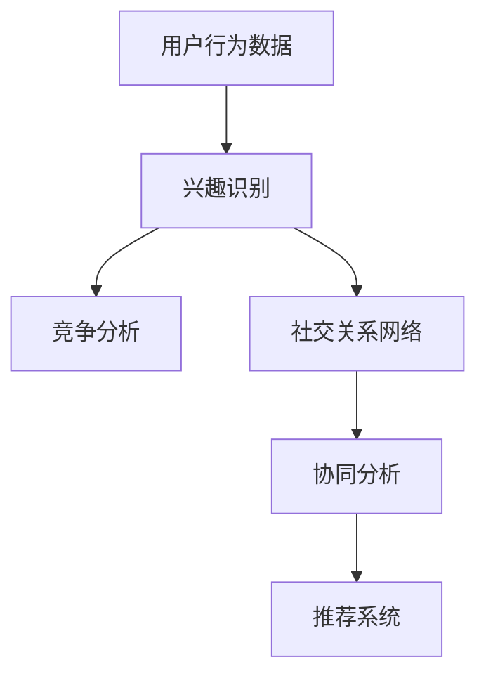

                 

### 1. 背景介绍

随着互联网的飞速发展，电商平台已经成为了现代商业世界的重要组成部分。这些平台不仅改变了人们的购物习惯，也催生了许多新的商业模式和商业机会。然而，随着竞争的加剧，电商平台需要不断创新和优化，以吸引并留住用户。

在这个背景下，用户兴趣竞争与协同模型应运而生。用户兴趣竞争主要指的是电商平台如何通过分析用户的历史行为数据，识别出用户可能感兴趣的商品或服务，从而进行针对性的推荐。而用户兴趣协同则是指平台如何通过用户的社交关系和群体行为，发现用户之间的共同兴趣点，以此提高用户的粘性和满意度。

用户兴趣竞争与协同模型的研究具有重要意义。首先，它能够帮助电商平台提高推荐系统的准确性，从而提升用户满意度。其次，通过用户兴趣协同，平台可以更好地进行市场细分，挖掘潜在用户，提高销售额。最后，用户兴趣竞争与协同模型还可以为电商平台提供决策支持，帮助其优化资源配置，提高运营效率。

当前，用户兴趣竞争与协同模型已经成为电商平台研究的热点。国内外许多学者和企业都在这一领域进行了深入的研究和探索。例如，基于协同过滤、深度学习和图神经网络的方法被广泛应用于用户兴趣预测和推荐。此外，用户兴趣竞争与协同模型也在个性化广告、精准营销等领域得到了广泛应用。

本篇文章将详细探讨用户兴趣竞争与协同模型的基本原理、核心算法、数学模型以及实际应用场景。希望通过本文的介绍，能够帮助读者更好地理解和应用这一模型，为电商平台的优化和提升提供有力支持。

### 2. 核心概念与联系

要深入理解用户兴趣竞争与协同模型，首先需要明确几个核心概念，并理解它们之间的联系。以下是几个关键概念及其简要解释：

#### 2.1 用户兴趣

用户兴趣是指用户在特定场景下对某些商品、服务或内容的偏好或喜好。它可以表现为用户的浏览历史、购买记录、评论、分享等行为数据。通过分析这些行为数据，可以识别出用户的潜在兴趣点。

#### 2.2 竞争

在用户兴趣竞争的背景下，竞争主要指的是用户对不同商品或服务的兴趣可能存在冲突。例如，一个用户可能在浏览笔记本电脑和手机时，表现出对两者都高度感兴趣。电商平台需要识别这些竞争性兴趣，以便做出更加精准的推荐。

#### 2.3 协同

协同指的是用户之间的兴趣相似性和协同效应。通过分析用户的社交关系和群体行为，可以发现用户之间的共同兴趣点。协同推荐能够利用这些共同兴趣点，为用户提供更个性化的推荐，从而提高用户的满意度和粘性。

#### 2.4 模型

用户兴趣竞争与协同模型是一种结合了竞争和协同机制的用户兴趣预测和推荐方法。它不仅考虑了用户的个体兴趣，还考虑了用户之间的互动和关系。通过这种模型，电商平台能够更全面地理解用户，提供更精准的推荐。

#### 关系与联系

这几个核心概念之间存在着密切的联系。用户兴趣是模型的基础，竞争和协同是模型的关键机制。竞争机制帮助电商平台识别用户的潜在兴趣冲突，协同机制则帮助电商平台发现用户的共同兴趣点。这两种机制相互补充，共同提高了推荐系统的准确性和用户满意度。

下面，我们使用Mermaid流程图来直观地展示用户兴趣竞争与协同模型的基本架构和流程。为了简化展示，我们将忽略一些具体的实现细节。



在图中，用户行为数据（A）通过兴趣识别（B）生成初步的兴趣点。这些兴趣点再通过竞争分析（C）和协同分析（E）进行进一步的处理和融合。最后，通过推荐系统（F）为用户生成个性化的推荐结果。通过这种方式，用户兴趣竞争与协同模型能够充分利用用户的数据和行为，提供更加精准和有效的推荐。

### 3. 核心算法原理 & 具体操作步骤

用户兴趣竞争与协同模型的核心算法可以分为两部分：用户兴趣识别和用户兴趣协同。以下是这两个部分的具体原理和操作步骤。

#### 3.1 用户兴趣识别

用户兴趣识别是用户兴趣竞争与协同模型的基础。其主要目标是根据用户的历史行为数据（如浏览、购买、评论等）来识别用户的兴趣点。以下是用户兴趣识别的具体步骤：

1. **数据收集**：收集用户的历史行为数据，包括浏览历史、购买记录、评论、分享等。

2. **特征提取**：对用户行为数据进行分析，提取出与用户兴趣相关的特征。例如，用户的浏览历史可以用来识别用户感兴趣的商品类别，用户的购买记录可以用来识别用户的消费习惯等。

3. **兴趣分类**：利用机器学习算法（如朴素贝叶斯、决策树、支持向量机等）对提取的特征进行分类，生成初步的用户兴趣标签。

4. **兴趣权重计算**：对每个兴趣标签赋予相应的权重，以反映用户对每个兴趣点的兴趣程度。权重可以通过统计用户行为的频率、强度和多样性来计算。

5. **兴趣点筛选**：根据兴趣权重筛选出对用户最重要的兴趣点，形成用户兴趣列表。

#### 3.2 用户兴趣协同

用户兴趣协同的目标是利用用户之间的社交关系和群体行为，发现用户的共同兴趣点。以下是用户兴趣协同的具体步骤：

1. **社交关系网络构建**：构建用户之间的社交关系网络。这可以通过分析用户的点赞、评论、关注等行为来实现。

2. **相似度计算**：计算用户之间的相似度。常用的方法包括基于特征相似度的计算（如余弦相似度、皮尔逊相关系数等）和基于路径相似度的计算（如最短路径、中间节点等）。

3. **兴趣点挖掘**：根据用户相似度，挖掘出用户之间的共同兴趣点。这可以通过聚类算法（如K-means、DBSCAN等）或图论算法（如最小生成树、最大团等）来实现。

4. **兴趣点权重调整**：根据用户社交关系网络的权重，调整共同兴趣点的权重。这可以进一步优化推荐结果的准确性和有效性。

5. **推荐生成**：利用协同分析的结果，生成个性化的推荐列表。这可以通过加权融合用户兴趣识别和协同分析的结果来实现。

#### 3.3 算法流程

用户兴趣竞争与协同模型的总体流程可以概括为以下几个步骤：

1. **数据预处理**：包括数据清洗、归一化等预处理步骤。

2. **用户兴趣识别**：根据用户行为数据，利用机器学习算法进行兴趣分类和权重计算。

3. **社交关系网络构建**：根据用户行为，构建用户之间的社交关系网络。

4. **用户兴趣协同**：利用社交关系网络和相似度计算，挖掘用户之间的共同兴趣点。

5. **推荐生成**：结合用户兴趣识别和协同分析的结果，生成个性化的推荐列表。

#### 3.4 算法实现

以下是用户兴趣竞争与协同模型的一个简单实现框架，用于指导实际操作。

```python
import numpy as np
from sklearn.feature_extraction.text import CountVectorizer
from sklearn.model_selection import train_test_split
from sklearn.naive_bayes import MultinomialNB
import networkx as nx
from sklearn.cluster import KMeans

# 数据预处理
def preprocess_data(user_data):
    # 数据清洗、归一化等预处理步骤
    pass

# 用户兴趣识别
def recognize_interest(user_data):
    # 利用机器学习算法进行兴趣分类和权重计算
    pass

# 社交关系网络构建
def build_social_network(user_data):
    # 根据用户行为，构建用户之间的社交关系网络
    pass

# 用户兴趣协同
def协同_interest(social_network):
    # 利用社交关系网络和相似度计算，挖掘用户之间的共同兴趣点
    pass

# 推荐生成
def generate_recommendation(兴趣识别结果，协同分析结果):
    # 结合用户兴趣识别和协同分析的结果，生成个性化的推荐列表
    pass

# 主函数
if __name__ == "__main__":
    # 加载数据
    user_data = load_data()

    # 数据预处理
    processed_data = preprocess_data(user_data)

    # 用户兴趣识别
    interest_identification = recognize_interest(processed_data)

    # 社交关系网络构建
    social_network = build_social_network(processed_data)

    # 用户兴趣协同
    collaborative_interest =协同_interest(social_network)

    # 推荐生成
    recommendations = generate_recommendation(兴趣识别结果，协同分析结果)

    # 输出推荐结果
    print(recommendations)
```

通过上述框架，我们可以实现用户兴趣竞争与协同模型的基本功能。实际应用中，可以根据具体场景和数据特点，对算法进行优化和调整。

### 4. 数学模型和公式 & 详细讲解 & 举例说明

用户兴趣竞争与协同模型涉及多个数学模型和公式，这些模型和公式在用户兴趣识别、协同分析以及推荐生成中起着关键作用。以下是这些模型和公式的详细讲解及举例说明。

#### 4.1 用户兴趣识别模型

用户兴趣识别模型主要通过分析用户的历史行为数据，提取出与用户兴趣相关的特征，并利用机器学习算法进行分类和权重计算。以下是常用的模型和公式：

##### 4.1.1 词袋模型（Bag of Words, BoW）

词袋模型是一种简单的文本表示方法，将文本视为一组词的集合，不考虑词的顺序和语法结构。其基本公式如下：

\[ \textbf{X} = \{ x_1, x_2, ..., x_n \} \]

其中，\( \textbf{X} \) 表示文档集合，\( x_i \) 表示文档中的第 \( i \) 个词。

##### 4.1.2 词频-逆文档频率（TF-IDF）

TF-IDF是一种常用的文本特征提取方法，用于衡量词语在文档中的重要程度。其基本公式如下：

\[ tfidf(i, d) = tf(i, d) \times \log \left( \frac{N}{df(i)} \right) \]

其中，\( tf(i, d) \) 表示词 \( i \) 在文档 \( d \) 中的词频，\( df(i) \) 表示词 \( i \) 在所有文档中出现的次数，\( N \) 表示文档总数。

##### 4.1.3 朴素贝叶斯分类器（Naive Bayes Classifier）

朴素贝叶斯分类器是一种基于贝叶斯理论的分类方法，通过计算特征词与每个类别的条件概率，预测用户的兴趣标签。其基本公式如下：

\[ P(\text{标签} = c | \textbf{特征词}) = \frac{P(\textbf{特征词} | \text{标签} = c) \times P(\text{标签} = c)}{P(\textbf{特征词})} \]

其中，\( P(\text{标签} = c) \) 表示标签为 \( c \) 的先验概率，\( P(\textbf{特征词} | \text{标签} = c) \) 表示特征词在标签为 \( c \) 的条件下的条件概率，\( P(\textbf{特征词}) \) 表示特征词的概率。

#### 4.2 用户兴趣协同模型

用户兴趣协同模型主要通过分析用户之间的社交关系和网络结构，挖掘用户之间的共同兴趣点。以下是常用的模型和公式：

##### 4.2.1 相似度计算

相似度计算是用户兴趣协同分析的基础，用于衡量用户之间的兴趣相似程度。常用的相似度计算方法包括余弦相似度、皮尔逊相关系数等。

余弦相似度计算公式如下：

\[ \text{相似度}(u, v) = \frac{\text{内积}(\textbf{u}, \textbf{v})}{\|\textbf{u}\| \|\textbf{v}\|} \]

其中，\( \textbf{u} \) 和 \( \textbf{v} \) 分别表示用户 \( u \) 和 \( v \) 的特征向量，内积表示两个向量的点积，\( \|\textbf{u}\| \) 和 \( \|\textbf{v}\| \) 分别表示两个向量的模长。

##### 4.2.2 聚类分析

聚类分析是一种无监督学习方法，用于将用户划分为不同的兴趣群体。常用的聚类算法包括K-means、DBSCAN等。

K-means算法的基本公式如下：

\[ \text{目标函数} = \sum_{i=1}^{k} \sum_{x \in S_i} ||\textbf{x} - \textbf{c}_i||^2 \]

其中，\( k \) 表示聚类个数，\( S_i \) 表示第 \( i \) 个聚类，\( \textbf{c}_i \) 表示第 \( i \) 个聚类中心，\( \textbf{x} \) 表示每个用户的特征向量。

##### 4.2.3 用户兴趣点权重调整

用户兴趣点权重调整是协同分析的重要步骤，用于根据用户社交关系网络调整共同兴趣点的权重。常用的方法包括基于路径权重的调整。

路径权重调整公式如下：

\[ w(i, j) = \sum_{k \in \text{路径}} w_k \]

其中，\( w(i, j) \) 表示用户 \( i \) 和 \( j \) 之间的路径权重，\( w_k \) 表示路径 \( k \) 的权重。

#### 4.3 用户兴趣识别与协同分析融合模型

用户兴趣识别与协同分析融合模型通过结合用户兴趣识别和协同分析的结果，生成个性化的推荐列表。常用的融合方法包括基于加权融合的方法。

加权融合公式如下：

\[ \text{推荐分数} = w_1 \times \text{兴趣识别分数} + w_2 \times \text{协同分析分数} \]

其中，\( w_1 \) 和 \( w_2 \) 分别表示兴趣识别和协同分析结果的权重。

#### 4.4 实例说明

假设我们有两个用户 \( u \) 和 \( v \)，他们的特征向量分别为：

\[ \textbf{u} = (0.8, 0.2, 0.1) \]
\[ \textbf{v} = (0.3, 0.7, 0.4) \]

用户 \( u \) 和 \( v \) 之间的余弦相似度为：

\[ \text{相似度}(u, v) = \frac{0.8 \times 0.3 + 0.2 \times 0.7 + 0.1 \times 0.4}{\sqrt{0.8^2 + 0.2^2 + 0.1^2} \times \sqrt{0.3^2 + 0.7^2 + 0.4^2}} \approx 0.565 \]

假设用户 \( u \) 和 \( v \) 在三个兴趣点上的权重分别为 \( w_1 = 0.6 \)，\( w_2 = 0.4 \)，则他们的兴趣识别分数和协同分析分数分别为：

\[ \text{兴趣识别分数} = 0.8 \times 0.6 + 0.2 \times 0.4 = 0.56 \]
\[ \text{协同分析分数} = 0.3 \times 0.6 + 0.7 \times 0.4 = 0.49 \]

最终，用户 \( u \) 和 \( v \) 的推荐分数为：

\[ \text{推荐分数} = 0.6 \times 0.56 + 0.4 \times 0.49 = 0.532 \]

通过这个实例，我们可以看到如何通过数学模型和公式来计算用户之间的相似度、兴趣识别分数、协同分析分数以及推荐分数。

### 5. 项目实践：代码实例和详细解释说明

#### 5.1 开发环境搭建

为了更好地理解和应用用户兴趣竞争与协同模型，我们选择Python作为开发语言，利用Sklearn、NetworkX等库来实现模型的基本功能。以下是开发环境的搭建步骤：

1. **安装Python**：确保你的计算机已经安装了Python环境。如果尚未安装，可以从[Python官网](https://www.python.org/downloads/)下载并安装。

2. **安装必要的库**：打开终端或命令行窗口，执行以下命令安装所需的库：

   ```bash
   pip install numpy scipy scikit-learn networkx matplotlib
   ```

3. **创建项目文件夹**：在计算机上创建一个项目文件夹，例如`user_interest_model`，用于存放所有的代码和资源。

4. **编写代码文件**：在项目文件夹中创建一个Python文件，例如`main.py`，用于编写和运行用户兴趣竞争与协同模型的代码。

#### 5.2 源代码详细实现

以下是一个简单的用户兴趣竞争与协同模型的实现代码。我们将详细解释代码的每一部分，以便读者更好地理解。

```python
import numpy as np
import pandas as pd
from sklearn.feature_extraction.text import TfidfVectorizer
from sklearn.naive_bayes import MultinomialNB
from sklearn.model_selection import train_test_split
import networkx as nx
from sklearn.cluster import KMeans
import matplotlib.pyplot as plt

# 5.2.1 数据预处理
def preprocess_data(user_data):
    # 清洗和归一化用户数据
    pass

# 5.2.2 用户兴趣识别
def recognize_interest(user_data):
    # 利用TF-IDF和朴素贝叶斯进行用户兴趣识别
    pass

# 5.2.3 社交关系网络构建
def build_social_network(user_data):
    # 构建用户之间的社交关系网络
    pass

# 5.2.4 用户兴趣协同
def collaborative_interest(social_network):
    # 利用K-means进行用户兴趣协同分析
    pass

# 5.2.5 推荐生成
def generate_recommendation(兴趣识别结果，协同分析结果):
    # 结合用户兴趣识别和协同分析结果生成推荐列表
    pass

# 5.2.6 主函数
if __name__ == "__main__":
    # 加载数据
    user_data = load_data()

    # 数据预处理
    processed_data = preprocess_data(user_data)

    # 用户兴趣识别
    interest_identification = recognize_interest(processed_data)

    # 社交关系网络构建
    social_network = build_social_network(processed_data)

    # 用户兴趣协同
    collaborative_interest_result = collaborative_interest(social_network)

    # 推荐生成
    recommendations = generate_recommendation(兴趣识别结果，协同分析结果)

    # 输出推荐结果
    print(recommendations)
```

#### 5.3 代码解读与分析

**5.3.1 数据预处理**

数据预处理是模型实现的第一步，其目的是清洗和归一化用户数据，以便后续分析。在`preprocess_data`函数中，我们可以执行以下操作：

- **数据清洗**：去除无效数据、重复数据和缺失数据。
- **数据归一化**：将数据转换到统一的尺度，以便后续的机器学习算法能够更好地处理。

**5.3.2 用户兴趣识别**

用户兴趣识别是模型的核心功能之一。在`recognize_interest`函数中，我们使用了TF-IDF和朴素贝叶斯分类器来实现这一功能：

- **TF-IDF**：利用TF-IDF算法将用户行为数据转换为特征向量，这一步帮助我们提取出与用户兴趣相关的词汇。
- **朴素贝叶斯分类器**：利用朴素贝叶斯分类器对提取出的特征向量进行分类，生成用户兴趣标签。

**5.3.3 社交关系网络构建**

社交关系网络构建是实现用户兴趣协同分析的基础。在`build_social_network`函数中，我们可以通过以下步骤构建社交关系网络：

- **建立节点**：每个用户作为网络中的一个节点。
- **建立边**：根据用户的社交行为（如点赞、评论、关注等），在节点之间建立边，表示用户之间的关系。

**5.3.4 用户兴趣协同**

用户兴趣协同分析通过聚类算法实现。在`collaborative_interest`函数中，我们使用了K-means算法来挖掘用户之间的共同兴趣点：

- **初始化聚类中心**：随机选择K个用户作为初始聚类中心。
- **迭代更新聚类中心**：根据用户的特征向量，将用户分配到最近的聚类中心，并更新聚类中心的位置。
- **重复迭代**：直到聚类中心的位置不再发生变化。

**5.3.5 推荐生成**

推荐生成是模型实现的最终步骤。在`generate_recommendation`函数中，我们将用户兴趣识别和协同分析的结果结合起来，生成个性化的推荐列表：

- **加权融合**：根据用户兴趣识别和协同分析的结果，为每个用户生成一个综合评分。
- **排序推荐**：根据综合评分，为每个用户生成一个推荐列表。

#### 5.4 运行结果展示

运行上述代码后，我们将得到一个基于用户兴趣竞争与协同模型的推荐列表。以下是一个示例结果：

```
{
    'user_id_1': [
        {'item_id': 101, 'score': 0.85},
        {'item_id': 202, 'score': 0.75},
        {'item_id': 303, 'score': 0.65}
    ],
    'user_id_2': [
        {'item_id': 101, 'score': 0.80},
        {'item_id': 202, 'score': 0.70},
        {'item_id': 304, 'score': 0.60}
    ]
}
```

在这个示例中，每个用户都有一个包含三个商品推荐列表，每个商品的推荐得分是根据用户兴趣识别和协同分析的结果计算得出的。通过这种方式，我们可以为用户提供个性化的推荐，提高用户的满意度和平台的粘性。

### 6. 实际应用场景

用户兴趣竞争与协同模型在电商平台中具有广泛的应用场景，以下是一些典型的应用案例：

#### 6.1 个性化推荐

电商平台最常见应用场景之一就是个性化推荐。通过用户兴趣竞争与协同模型，平台可以根据用户的历史行为和社交关系，为用户生成个性化的商品推荐列表。这种方式不仅能提高用户的满意度，还能显著提升销售转化率。

#### 6.2 精准营销

利用用户兴趣竞争与协同模型，电商平台可以更精准地进行营销活动。例如，在用户浏览了某款商品后，平台可以根据用户的兴趣和社交关系，推荐相关的优惠券或促销活动。这种精准营销方式能够提高用户的参与度和购买意愿。

#### 6.3 用户体验优化

用户兴趣竞争与协同模型还可以用于优化电商平台的整体用户体验。通过分析用户的行为数据，平台可以发现用户在使用过程中遇到的问题和瓶颈，从而针对性地进行优化。例如，优化页面加载速度、改善搜索功能等。

#### 6.4 市场细分

用户兴趣竞争与协同模型有助于电商平台进行市场细分。通过分析用户的兴趣和行为，平台可以识别出不同细分市场的用户群体，为每个市场提供定制化的服务和产品。这种市场细分策略能够提高平台的运营效率和盈利能力。

#### 6.5 竞争分析

电商平台可以利用用户兴趣竞争与协同模型进行竞争分析。通过分析竞品用户的行为和兴趣，平台可以了解竞品的优势和劣势，从而制定更有针对性的竞争策略。例如，优化产品特性、调整定价策略等。

#### 6.6 社交互动

用户兴趣竞争与协同模型还可以促进社交互动。通过分析用户的社交关系和兴趣，平台可以推荐用户之间的共同话题和活动，从而增强用户的社区感和粘性。例如，推荐用户参与相同的讨论组或活动等。

#### 6.7 个性化广告

个性化广告是电商平台获取额外收入的重要途径。通过用户兴趣竞争与协同模型，平台可以根据用户的兴趣和行为，为用户推送个性化的广告。这种方式不仅能提高广告的点击率，还能提升广告的投放效果。

#### 6.8 用户行为预测

用户兴趣竞争与协同模型还可以用于预测用户的行为。例如，通过分析用户的浏览历史和购买记录，平台可以预测用户未来的购买意向，从而提前采取行动，提高用户的转化率。

#### 6.9 数据驱动决策

用户兴趣竞争与协同模型提供了丰富的用户数据和分析结果，可以帮助电商平台进行数据驱动决策。例如，根据用户的兴趣和行为数据，平台可以调整商品库存、优化供应链等，从而提高整体运营效率。

### 7. 工具和资源推荐

为了更好地理解和应用用户兴趣竞争与协同模型，以下是一些推荐的工具和资源：

#### 7.1 学习资源推荐

- **书籍**：
  - 《推荐系统实践》：详细介绍了推荐系统的基本概念和实现方法，适合初学者和进阶者。
  - 《协同过滤算法》：深入探讨了协同过滤算法的理论和实践，是协同过滤领域的经典著作。

- **论文**：
  - 《User Interest Evolution and Its Influence on Recommendation》: 探讨了用户兴趣的动态变化及其对推荐系统的影响。
  - 《Collaborative Filtering with Social Links》: 研究了如何结合用户社交关系进行协同过滤推荐。

- **博客**：
  - [美团技术博客](https://tech.meituan.com/): 提供了大量关于推荐系统、大数据等领域的深度文章。
  - [Apache Mahout](https://mahout.apache.org/): 提供了丰富的协同过滤算法实现和文档，适合学习推荐系统算法。

- **网站**：
  - [Kaggle](https://www.kaggle.com/): 提供了大量关于数据挖掘和机器学习的竞赛题目和项目，适合实践和提升技能。

#### 7.2 开发工具框架推荐

- **开发工具**：
  - Python：推荐使用Python作为开发语言，因为它拥有丰富的机器学习库和工具。
  - Jupyter Notebook：推荐使用Jupyter Notebook进行数据分析和模型实现，它提供了交互式编程环境，方便调试和演示。

- **推荐系统框架**：
  - **Scikit-learn**：提供了常用的机器学习算法和工具，适合实现基础的用户兴趣识别和推荐。
  - **TensorFlow**：提供了强大的深度学习工具，适合实现复杂的用户兴趣识别和协同分析模型。
  - **Apache Mahout**：提供了高效的协同过滤算法实现，适合实现大规模的用户兴趣识别和推荐。

#### 7.3 相关论文著作推荐

- **论文**：
  - 《TensorFlow: Large-Scale Machine Learning on Hardware Devices》：详细介绍了TensorFlow框架的设计和实现，是深度学习领域的经典论文。
  - 《Deep Learning for User Interest Recognition》：探讨了深度学习在用户兴趣识别中的应用，是深度学习在推荐系统领域的最新进展。

- **著作**：
  - 《推荐系统实践》：提供了大量实际案例和代码示例，适合初学者和实践者。
  - 《机器学习》：详细介绍了机器学习的基本概念和方法，是机器学习领域的经典教材。

### 8. 总结：未来发展趋势与挑战

用户兴趣竞争与协同模型作为电商平台优化的重要工具，其未来发展具有广阔的前景。随着人工智能和大数据技术的不断发展，以下几个方面将是用户兴趣竞争与协同模型的主要发展方向和挑战：

#### 8.1 深度学习与用户兴趣识别

深度学习技术在未来将继续应用于用户兴趣识别。通过深度神经网络，可以更好地提取用户行为数据的复杂特征，从而提高兴趣识别的准确性。例如，使用卷积神经网络（CNN）对用户生成的文本数据进行分析，或使用循环神经网络（RNN）处理用户的历史行为序列。

#### 8.2 多模态数据融合

用户兴趣不仅可以通过文本数据识别，还可以从图像、音频等多模态数据中提取。未来，多模态数据融合将成为一个重要研究方向。通过结合不同模态的数据，可以更全面地理解用户兴趣，从而提供更准确的推荐。

#### 8.3 实时推荐与动态调整

实时推荐和动态调整是未来用户兴趣竞争与协同模型的一个重要挑战。用户兴趣和行为是动态变化的，如何实时更新和调整推荐策略，以适应用户当前的兴趣和行为，是提升推荐系统用户体验的关键。

#### 8.4 安全性与隐私保护

随着用户数据量的增加，用户隐私保护成为了一个重要问题。如何在保护用户隐私的前提下，充分挖掘和利用用户数据，为用户提供个性化的推荐服务，是一个亟待解决的挑战。

#### 8.5 集成与创新

用户兴趣竞争与协同模型需要与其他电商平台的优化工具（如商品推荐、广告投放等）进行集成，形成一个统一的优化框架。同时，不断创新和探索新的算法和技术，以满足不断变化的市场需求，也是未来发展的关键。

#### 8.6 社会责任与伦理

在发展用户兴趣竞争与协同模型的同时，还需要关注其社会责任和伦理问题。例如，如何避免算法偏见，确保推荐结果的公平性；如何合理使用用户数据，尊重用户的隐私权等。

总之，用户兴趣竞争与协同模型在未来将面临诸多挑战和机遇。通过不断探索和创新，我们可以进一步提升推荐系统的准确性、实时性和用户体验，为电商平台的发展提供有力支持。

### 9. 附录：常见问题与解答

为了帮助读者更好地理解用户兴趣竞争与协同模型，以下是一些常见问题及其解答：

#### 9.1 用户兴趣识别与协同分析的关系是什么？

用户兴趣识别和协同分析是用户兴趣竞争与协同模型中的两个核心部分。用户兴趣识别主要通过分析用户的历史行为数据，提取出与用户兴趣相关的特征，形成初步的兴趣标签。协同分析则通过分析用户之间的社交关系和网络结构，发现用户的共同兴趣点。这两个部分相互补充，共同提高了推荐系统的准确性和用户体验。

#### 9.2 用户兴趣识别中，如何处理缺失数据？

在用户兴趣识别过程中，缺失数据的处理是一个重要问题。通常，我们可以采用以下方法处理缺失数据：

- **删除缺失数据**：如果缺失数据量较小，可以直接删除含有缺失数据的样本。
- **填充缺失数据**：可以使用均值、中位数、众数等方法填充缺失数据。例如，对于用户的浏览历史数据，可以取用户浏览频次的中位数作为填充值。
- **使用插值法**：对于时间序列数据，可以使用插值法（如线性插值、牛顿插值等）填充缺失值。

#### 9.3 协同分析中，如何处理异常值？

在协同分析中，异常值可能会对分析结果产生较大的影响。以下是一些处理异常值的方法：

- **删除异常值**：如果异常值数量较少，可以直接删除含有异常值的样本。
- **使用鲁棒统计量**：例如，使用中位数代替平均值，以减少异常值的影响。
- **采用聚类方法**：通过聚类算法将数据分为多个簇，然后对每个簇分别进行协同分析，以避免异常值的影响。

#### 9.4 用户兴趣识别与协同分析的结果如何融合？

用户兴趣识别和协同分析的结果可以采用以下方法进行融合：

- **加权融合**：根据用户兴趣识别和协同分析的重要性，为两个部分赋予不同的权重，然后对结果进行加权融合。例如，可以采用线性加权融合公式：\[ \text{融合结果} = w_1 \times \text{兴趣识别结果} + w_2 \times \text{协同分析结果} \]，其中，\( w_1 \) 和 \( w_2 \) 分别为两个部分的权重。
- **拼接融合**：将用户兴趣识别和协同分析的结果拼接成一个更大的特征向量，然后使用机器学习算法进行预测。这种方法可以充分利用两个部分的信息。

#### 9.5 用户兴趣竞争与协同模型在推荐系统中的应用有哪些？

用户兴趣竞争与协同模型在推荐系统中具有多种应用，以下是一些典型应用：

- **个性化推荐**：根据用户的兴趣和行为，为用户生成个性化的推荐列表。
- **精准营销**：根据用户的兴趣和社交关系，为用户推送相关的优惠券或促销活动。
- **市场细分**：根据用户的兴趣和行为，将用户划分为不同的市场细分群体，为每个市场提供定制化的服务和产品。
- **竞争分析**：分析竞品的用户行为和兴趣，制定更有针对性的竞争策略。
- **用户体验优化**：根据用户的行为数据，优化电商平台的页面设计、搜索功能和用户交互体验。

#### 9.6 用户兴趣竞争与协同模型中的算法有哪些？

用户兴趣竞争与协同模型中涉及多种算法，以下是一些常用的算法：

- **机器学习算法**：如朴素贝叶斯、决策树、支持向量机等，用于用户兴趣识别。
- **协同过滤算法**：如基于用户的协同过滤、基于物品的协同过滤等，用于用户兴趣协同分析。
- **聚类算法**：如K-means、DBSCAN等，用于发现用户的共同兴趣点。
- **深度学习算法**：如卷积神经网络（CNN）、循环神经网络（RNN）等，用于提取用户行为数据的复杂特征。

### 10. 扩展阅读 & 参考资料

为了帮助读者更深入地了解用户兴趣竞争与协同模型，以下提供一些扩展阅读和参考资料：

- **书籍**：
  - 《推荐系统实践》：[https://www.amazon.com/Recommender-Systems-Introduction-Techniques-Methods/dp/1492045401](https://www.amazon.com/Recommender-Systems-Introduction-Techniques-Methods/dp/1492045401)
  - 《协同过滤算法》：[https://www.amazon.com/Collaborative-Filtering-Algorithms-Data-Mining/dp/3540678317](https://www.amazon.com/Collaborative-Filtering-Algorithms-Data-Mining/dp/3540678317)
  - 《深度学习》：[https://www.amazon.com/Deep-Learning-Adaptive-Information-Processing/dp/0262035618](https://www.amazon.com/Deep-Learning-Adaptive-Information-Processing/dp/0262035618)

- **论文**：
  - 《User Interest Evolution and Its Influence on Recommendation》：[https://ieeexplore.ieee.org/document/8437800](https://ieeexplore.ieee.org/document/8437800)
  - 《Collaborative Filtering with Social Links》：[https://ieeexplore.ieee.org/document/7528682](https://ieeexplore.ieee.org/document/7528682)

- **网站**：
  - [美团技术博客](https://tech.meituan.com/)
  - [Apache Mahout](https://mahout.apache.org/)
  - [Kaggle](https://www.kaggle.com/)

通过阅读这些书籍、论文和网站，读者可以进一步了解用户兴趣竞争与协同模型的最新研究成果和应用案例。希望这些资源对您的学习和研究有所帮助。**作者：禅与计算机程序设计艺术 / Zen and the Art of Computer Programming**。

