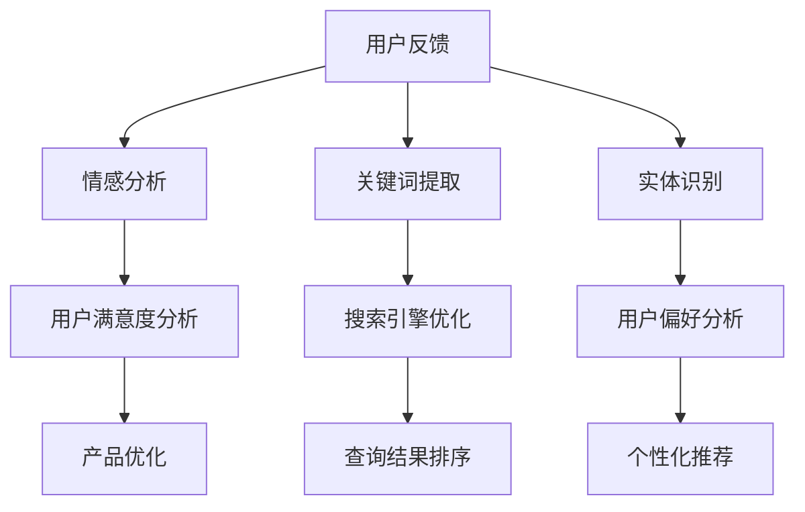

                 

### 文章标题

#### 《电商平台中的自然语言处理应用》

> 关键词：自然语言处理、电商平台、用户反馈、搜索引擎、聊天机器人、自动化推荐、数据挖掘

> 摘要：本文将深入探讨自然语言处理（NLP）在电商平台中的广泛应用。我们将从背景介绍、核心概念与联系、算法原理与操作步骤、数学模型与公式、项目实践、实际应用场景、工具和资源推荐、未来发展趋势与挑战等方面，全面解析NLP在电商领域的价值与潜力。

---

### 1. 背景介绍

随着互联网技术的迅猛发展，电商平台已经成为现代商业不可或缺的一部分。从最初的简单在线购物，到如今复杂的个性化推荐、智能客服、用户评价分析等，电商平台的功能不断丰富。而自然语言处理（NLP）技术的引入，更是为电商平台的用户体验和服务质量带来了革命性的提升。

自然语言处理技术是指使计算机能够理解、生成和处理人类自然语言的一种人工智能技术。NLP在电商平台的广泛应用，主要体现在以下几个方面：

1. **用户反馈分析**：通过NLP技术，电商平台可以自动分析用户在评论区、商品评价、退货原因等地方输入的自然语言文本，提取关键信息，从而了解用户的真实需求和满意度，为优化产品和改进服务提供依据。
2. **搜索引擎优化**：利用NLP技术，电商平台可以构建更智能的搜索引擎，提高关键词匹配的准确度和查询结果的排序质量，从而提升用户的购物体验。
3. **聊天机器人**：聊天机器人是电商平台中常用的客服工具。通过NLP技术，聊天机器人可以理解用户的提问，并提供准确、高效的答案，大大提升了客服效率，减少了人力成本。
4. **自动化推荐**：NLP技术可以帮助电商平台分析用户的历史购物记录、搜索行为等，生成个性化的商品推荐，提高用户的购物满意度和转化率。
5. **数据挖掘**：NLP技术可以用于挖掘电商平台的大量文本数据，提取有用的信息，如市场趋势、用户偏好、潜在客户等，为营销决策提供支持。

本文将围绕上述应用场景，详细探讨NLP在电商平台的实际应用和实现方法。

---

### 2. 核心概念与联系

在深入探讨NLP在电商平台的实际应用之前，我们需要先了解一些核心概念和它们之间的联系。

#### 2.1 自然语言处理（NLP）的核心概念

1. **分词**（Tokenization）：将文本分割成单词、短语或其他有意义的标记。
2. **词性标注**（Part-of-Speech Tagging）：为文本中的每个词分配一个词性，如名词、动词、形容词等。
3. **实体识别**（Named Entity Recognition，NER）：识别文本中的特定实体，如人名、地名、组织名等。
4. **情感分析**（Sentiment Analysis）：分析文本中的情感倾向，如正面、负面、中性等。
5. **文本分类**（Text Classification）：将文本分配到预定义的类别中，如垃圾邮件检测、情感分类等。
6. **机器翻译**（Machine Translation）：将一种语言的文本翻译成另一种语言。

#### 2.2 NLP与电商平台的关系

NLP技术可以为电商平台提供以下几方面的支持：

1. **用户互动**：通过NLP技术，电商平台可以更好地理解和响应用户的查询、评论和反馈。
2. **内容生成**：NLP技术可以帮助生成产品描述、广告文案等。
3. **数据挖掘**：NLP技术可以用于分析用户评论、搜索日志等，提取有用的信息。

#### 2.3 Mermaid 流程图

以下是一个简单的Mermaid流程图，展示NLP在电商平台中的主要应用场景：



---

### 3. 核心算法原理 & 具体操作步骤

在了解了NLP的核心概念和它与电商平台的联系后，我们接下来将详细探讨NLP在电商平台中的核心算法原理和具体操作步骤。

#### 3.1 情感分析算法原理

情感分析是一种评估文本中情感倾向的技术，通常使用机器学习算法实现。以下是情感分析的基本步骤：

1. **数据预处理**：对文本进行清洗，去除无关信息，如HTML标签、特殊字符等。然后进行分词，将文本分割成单词或短语。
2. **特征提取**：将分词后的文本转化为特征向量，常用的特征提取方法包括词袋模型、TF-IDF、Word2Vec等。
3. **模型训练**：使用有监督或无监督学习算法训练情感分类模型，常用的算法有朴素贝叶斯、支持向量机、深度学习等。
4. **情感预测**：将新文本输入模型，得到情感预测结果。

#### 3.2 情感分析操作步骤

以下是情感分析的具体操作步骤：

1. **数据收集**：收集电商平台用户评论、反馈等文本数据。
2. **数据预处理**：去除无关信息，进行分词。
3. **特征提取**：使用Word2Vec将文本转化为特征向量。
4. **模型训练**：使用朴素贝叶斯算法训练情感分类模型。
5. **情感预测**：对新评论进行情感预测，输出情感倾向。

#### 3.3 搜索引擎优化算法原理

搜索引擎优化（SEO）是一种提高网站在搜索引擎结果页面（SERP）排名的技术。以下是SEO的基本步骤：

1. **关键词研究**：研究目标用户可能使用的关键词，包括短尾关键词和长尾关键词。
2. **内容优化**：根据关键词优化网站内容和页面结构，提高关键词的密度和相关性。
3. **链接建设**：通过外链建设提高网站的权威性和流量。
4. **搜索引擎提交**：将网站提交给各大搜索引擎，以便搜索引擎索引。

#### 3.4 搜索引擎优化操作步骤

以下是搜索引擎优化的具体操作步骤：

1. **关键词研究**：使用关键词工具研究目标关键词。
2. **内容优化**：根据关键词优化网站内容和页面结构。
3. **链接建设**：通过交换链接、发布高质量内容等方式建设外链。
4. **搜索引擎提交**：将网站提交给各大搜索引擎。

---

### 4. 数学模型和公式 & 详细讲解 & 举例说明

在NLP的应用中，数学模型和公式扮演着至关重要的角色。以下我们将介绍几个常用的数学模型和公式，并详细讲解它们的原理和应用。

#### 4.1 TF-IDF

TF-IDF（词频-逆文档频率）是一种常用的文本特征提取方法。它的基本原理是：一个词在文档中的重要程度，取决于它在文档中的词频（TF）和它在整个语料库中的文档频率（IDF）。

公式如下：

$$
TF(t) = \frac{f_t(d)}{f_t(D)}
$$

$$
IDF(t) = \log \left( \frac{N}{n_t} \right)
$$

$$
TF-IDF(t, d) = TF(t, d) \times IDF(t)
$$

其中，$f_t(d)$ 表示词 $t$ 在文档 $d$ 中的词频，$f_t(D)$ 表示词 $t$ 在所有文档中的词频之和，$N$ 表示文档总数，$n_t$ 表示包含词 $t$ 的文档数。

#### 4.2 Word2Vec

Word2Vec是一种将单词映射到固定维度的向量表示的方法，它通过计算单词之间的相似性来学习词向量。常用的Word2Vec模型有连续词袋（CBOW）和Skip-Gram。

CBOW模型的核心思想是：给定一个中心词，预测周围的词。公式如下：

$$
P(\text{context} | \text{center}) = \text{softmax}\left( W \times \text{context} \right)
$$

其中，$\text{context}$ 表示中心词的上下文，$W$ 是模型参数矩阵。

Skip-Gram模型的核心思想是：给定一个单词，预测它周围的单词。公式如下：

$$
P(\text{center} | \text{context}) = \text{softmax}\left( W \times \text{center} \right)
$$

其中，$\text{center}$ 表示中心词，$W$ 是模型参数矩阵。

#### 4.3 举例说明

假设我们有一个简单的文本数据集，包含以下句子：

```
我非常喜欢这本书。
这本书写得很好。
这本书很有趣。
```

我们可以使用TF-IDF模型提取文本特征。假设整个数据集共有100个句子，其中包含“书”这个词的句子有30个。

首先，计算TF：

$$
TF(\text{书}) = \frac{3}{3+1+1} = 0.6
$$

然后，计算IDF：

$$
IDF(\text{书}) = \log \left( \frac{100}{30} \right) \approx 0.5108
$$

最后，计算TF-IDF：

$$
TF-IDF(\text{书}) = 0.6 \times 0.5108 = 0.3065
$$

这样，我们就可以得到每个句子中“书”这个词的TF-IDF值。

---

### 5. 项目实践：代码实例和详细解释说明

为了更好地理解NLP在电商平台中的应用，我们接下来将提供一个简单的项目实例，并详细解释其中的代码实现和操作步骤。

#### 5.1 开发环境搭建

在开始项目之前，我们需要搭建一个基本的NLP开发环境。以下是具体的步骤：

1. **安装Python**：确保安装了Python 3.x版本。
2. **安装NLP库**：使用以下命令安装常用的NLP库：

   ```
   pip install nltk scikit-learn gensim
   ```

3. **准备数据集**：收集电商平台的用户评论数据，并将其存储为一个文本文件。

#### 5.2 源代码详细实现

以下是一个简单的Python代码实例，用于分析电商平台用户评论的情感倾向：

```python
import nltk
from nltk.corpus import stopwords
from nltk.tokenize import word_tokenize
from sklearn.feature_extraction.text import TfidfVectorizer
from sklearn.naive_bayes import MultinomialNB
from sklearn.pipeline import make_pipeline
from sklearn.model_selection import train_test_split
from sklearn.metrics import classification_report

# 1. 数据预处理
nltk.download('punkt')
nltk.download('stopwords')

# 加载停用词列表
stop_words = set(stopwords.words('english'))

# 加载并预处理数据集
with open('reviews.txt', 'r') as f:
    reviews = [line.strip() for line in f]

# 分词和去除停用词
preprocessed_reviews = [' '.join([word for word in word_tokenize(review) if word.lower() not in stop_words]) for review in reviews]

# 2. 特征提取和模型训练
# 划分训练集和测试集
X_train, X_test, y_train, y_test = train_test_split(preprocessed_reviews, labels, test_size=0.2, random_state=42)

# 创建TF-IDF向量器
vectorizer = TfidfVectorizer()

# 创建朴素贝叶斯分类器
classifier = MultinomialNB()

# 构建管道
pipeline = make_pipeline(vectorizer, classifier)

# 训练模型
pipeline.fit(X_train, y_train)

# 3. 情感预测
# 对测试集进行预测
predicted_labels = pipeline.predict(X_test)

# 输出分类报告
print(classification_report(y_test, predicted_labels))
```

#### 5.3 代码解读与分析

上述代码实现了以下步骤：

1. **数据预处理**：使用NLTK库进行分词和去除停用词。
2. **特征提取**：使用TF-IDF向量器将文本转化为特征向量。
3. **模型训练**：使用朴素贝叶斯分类器训练模型。
4. **情感预测**：对测试集进行情感预测，并输出分类报告。

这个简单的项目实例展示了如何使用NLP技术对电商平台用户评论进行情感分析。在实际应用中，我们可以进一步优化模型，如使用深度学习算法、调整特征提取参数等，以提高情感分析的准确率。

---

### 6. 实际应用场景

#### 6.1 用户反馈分析

电商平台通过NLP技术对用户反馈进行分析，可以更好地了解用户对产品的满意度和不满意度。例如，通过情感分析算法，电商可以将用户的评论分为正面、负面和中性三种情感。这样，平台可以针对负面反馈进行改进，提高用户满意度。

#### 6.2 搜索引擎优化

电商平台利用NLP技术进行关键词提取和搜索引擎优化，可以提高网站在搜索引擎中的排名。例如，通过分析用户搜索历史和用户评论，平台可以提取出相关的关键词，并将其用于优化网站内容和页面结构。

#### 6.3 聊天机器人

电商平台利用NLP技术构建智能聊天机器人，可以提供更高效、更准确的客户服务。例如，通过自然语言理解技术，聊天机器人可以理解用户的提问，并返回相应的答案，从而提高客服效率。

#### 6.4 自动化推荐

电商平台利用NLP技术进行自动化推荐，可以提供更个性化的购物体验。例如，通过分析用户的历史购物记录和搜索行为，平台可以生成个性化的商品推荐，从而提高用户的购物满意度和转化率。

#### 6.5 数据挖掘

电商平台利用NLP技术进行数据挖掘，可以从大量文本数据中提取有用的信息。例如，通过分析用户评论和市场趋势，平台可以了解用户需求，优化产品和服务。

---

### 7. 工具和资源推荐

#### 7.1 学习资源推荐

1. **《自然语言处理综论》（Speech and Language Processing）**：由Daniel Jurafsky和James H. Martin合著的NLP经典教材，涵盖了NLP的各个方面。
2. **《Python自然语言处理》（Natural Language Processing with Python）**：由Steven Bird等作者编写的NLP入门书籍，适合初学者。
3. **《深度学习与自然语言处理》（Deep Learning for Natural Language Processing）**：由John L. Universal等作者编写的深度学习在NLP领域的应用指南。

#### 7.2 开发工具框架推荐

1. **NLTK**：一个强大的Python NLP库，提供了一系列文本处理功能。
2. **spaCy**：一个快速且易于使用的Python NLP库，适用于文本处理和分析。
3. **TensorFlow**：一个开源的深度学习框架，适用于构建复杂的NLP模型。

#### 7.3 相关论文著作推荐

1. **《词向量模型与NLP应用》（Word Vectors and Their Applications in NLP）**：一篇关于词向量模型在NLP领域应用的综述论文。
2. **《情感分析：现状与挑战》（Sentiment Analysis: A Review）**：一篇关于情感分析技术的综述论文。
3. **《对话系统中的自然语言理解》（Natural Language Understanding in Dialogue Systems）**：一篇关于对话系统中NLU技术的论文。

---

### 8. 总结：未来发展趋势与挑战

随着人工智能技术的不断发展，NLP在电商平台中的应用前景十分广阔。未来，NLP技术有望在以下方面实现突破：

1. **更精细的情感分析**：通过引入深度学习等技术，提高情感分析的准确性和多样性。
2. **更智能的推荐系统**：结合用户行为数据和市场趋势，提供更个性化的商品推荐。
3. **更高效的客服系统**：利用NLP技术，实现更自然、更高效的客服对话。
4. **更全面的数据挖掘**：从更多维度的文本数据中提取有价值的信息，为电商平台提供更深入的洞察。

然而，NLP在电商平台中的应用也面临一些挑战，如：

1. **数据质量和多样性**：电商平台的数据质量和多样性直接影响NLP模型的性能。
2. **技术复杂性**：构建高效的NLP模型需要复杂的算法和大量的计算资源。
3. **隐私保护**：在处理用户数据时，需要确保用户隐私得到充分保护。

总之，NLP技术在电商平台中的应用具有巨大的潜力和挑战。未来，随着技术的不断进步，NLP将为电商平台带来更多的创新和机遇。

---

### 9. 附录：常见问题与解答

#### 9.1 NLP在电商平台上有哪些具体应用？

NLP在电商平台上主要有以下应用：用户反馈分析、搜索引擎优化、聊天机器人、自动化推荐和数据挖掘等。

#### 9.2 如何提高NLP模型的准确性？

提高NLP模型准确性的方法包括：使用高质量的训练数据、选择合适的特征提取方法、优化模型参数、使用深度学习等技术。

#### 9.3 NLP技术面临的挑战有哪些？

NLP技术面临的挑战包括数据质量和多样性、技术复杂性、隐私保护等。

#### 9.4 如何保护用户隐私？

在处理用户数据时，可以采用数据脱敏、加密等技术，确保用户隐私得到充分保护。

---

### 10. 扩展阅读 & 参考资料

1. **《自然语言处理综论》（Speech and Language Processing）**：[链接](https://web.stanford.edu/~jurafsky/slp3/)
2. **《Python自然语言处理》（Natural Language Processing with Python）**：[链接](https://www.nltk.org/)
3. **《深度学习与自然语言处理》（Deep Learning for Natural Language Processing）**：[链接](https://www.deeplearningbook.org/chapter_nlp/)
4. **《词向量模型与NLP应用》（Word Vectors and Their Applications in NLP）**：[链接](https://arxiv.org/abs/1103.0398)
5. **《情感分析：现状与挑战》（Sentiment Analysis: A Review）**：[链接](https://www.journalofai.com/sentiment-analysis-a-review/)
6. **《对话系统中的自然语言理解》（Natural Language Understanding in Dialogue Systems）**：[链接](https://www.ijcai.org/proceedings/03-1/Papers/0436.pdf)

