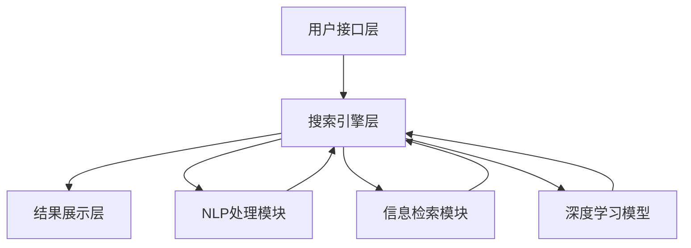

                 

### 1. 背景介绍

随着互联网技术的迅猛发展，电商平台已经成为了现代商业中不可或缺的一部分。电商平台不仅为消费者提供了便捷的购物体验，同时也为企业开辟了广阔的市场空间。然而，随着电商平台规模的不断扩大和商品种类的日益丰富，如何在海量的商品信息中快速准确地找到用户所需要的商品，成为了一个亟待解决的问题。

在传统的电商平台中，搜索功能主要依赖于关键字匹配技术。用户通过输入关键词进行搜索，系统会根据关键词在商品标题、描述等字段中的出现情况进行匹配，并返回一系列可能符合用户需求的商品列表。然而，这种方式存在一些明显的局限性：

1. **关键词理解不足**：用户在搜索时往往无法准确描述自己的需求，而关键字匹配技术只能根据表面信息进行匹配，无法理解用户背后的意图。
2. **结果多样性不高**：当用户输入的关键词较为通用时，搜索结果往往包含大量无关信息，难以满足用户的个性化需求。
3. **用户体验差**：由于匹配算法的限制，搜索结果往往不够精准，导致用户需要花费更多的时间在筛选和比较商品上，影响了用户体验。

为了克服这些局限性，语义搜索技术应运而生。语义搜索不仅关注关键字本身的匹配，更注重对用户查询意图的理解，从而提供更加精准和个性化的搜索结果。在电商平台中，语义搜索技术的应用主要体现在以下几个方面：

1. **智能推荐**：通过分析用户的浏览历史、购买记录等数据，语义搜索技术可以准确预测用户可能感兴趣的商品，从而进行个性化推荐。
2. **智能问答**：当用户提出开放式问题时，语义搜索技术能够理解问题的含义，并从海量数据中迅速找出相关答案。
3. **智能筛选**：通过分析用户的查询意图，语义搜索技术可以帮助用户快速定位到符合需求的商品，减少筛选时间。

总之，语义搜索技术在电商平台中的应用，不仅提升了搜索的准确性和效率，还极大地改善了用户的购物体验。随着技术的不断进步，语义搜索将有望成为电商平台不可或缺的核心功能。

### 2. 核心概念与联系

#### 2.1 语义搜索的定义

语义搜索（Semantic Search）是一种基于自然语言处理（NLP）和信息检索（IR）技术的搜索方式，它不仅仅依赖于关键词的匹配，更强调对用户查询意图的理解。语义搜索的核心目标是让系统具备人类理解语言的能力，从而提供更加精准、个性化的搜索结果。

#### 2.2 关键技术

1. **自然语言处理（NLP）**：NLP是语义搜索的基础，它包括分词、词性标注、句法分析、命名实体识别等步骤。通过NLP技术，系统能够将自然语言文本转化为机器可处理的结构化数据。
2. **信息检索（IR）**：信息检索是语义搜索的重要环节，它包括查询处理、索引构建、相关性评估等。信息检索技术用于从海量数据中快速找到与用户查询最相关的信息。
3. **机器学习与深度学习**：现代语义搜索大量应用了机器学习和深度学习算法，如词向量表示、序列模型、注意力机制等，以提升搜索的准确性和效果。

#### 2.3 语义搜索与电商平台的关系

在电商平台中，语义搜索技术不仅可以提升搜索的准确性和效率，还能为用户提供更加个性化、智能化的购物体验。以下是语义搜索在电商平台中的具体应用：

1. **智能推荐**：通过分析用户的浏览历史、购买记录等数据，语义搜索技术可以识别用户的偏好和需求，从而推荐符合用户兴趣的商品。
2. **智能问答**：当用户在平台上提出开放式问题时，语义搜索技术可以理解问题的意图，并从海量商品信息中快速找到相关答案。
3. **智能筛选**：通过分析用户的查询意图，语义搜索技术可以帮助用户快速定位到符合需求的商品，减少筛选时间，提升用户体验。

#### 2.4 架构原理

语义搜索技术在电商平台中的架构通常包括以下几个关键部分：

1. **用户接口层**：负责接收用户的查询请求，并将请求传递给搜索引擎。
2. **搜索引擎层**：包括NLP处理模块、信息检索模块和深度学习模型，用于理解用户的查询意图，并从海量数据中检索出相关结果。
3. **结果展示层**：负责将检索结果以用户友好的方式展示出来，如商品列表、问答结果等。

下面是语义搜索在电商平台中的架构原理的 Mermaid 流程图：



### 3. 核心算法原理 & 具体操作步骤

#### 3.1 词向量表示

词向量表示是语义搜索技术的核心之一，它将自然语言中的词语转化为计算机可以处理的向量表示。词向量表示的方法主要有两种：基于统计的方法和基于神经网络的方法。

1. **基于统计的方法**：
   - **TF-IDF（Term Frequency-Inverse Document Frequency）**：TF-IDF方法通过计算词语在文档中的频率和文档集合中的逆文档频率来表示词语的重要性。这种方法简单有效，但无法很好地捕捉词语的语义关系。
   - **Word2Vec（Word Embedding）**：Word2Vec是一种基于神经网络的语言模型，通过训练得到词语的向量表示。Word2Vec方法能够捕捉词语之间的语义关系，但其在处理长文本时效果不佳。

2. **基于神经网络的方法**：
   - **BERT（Bidirectional Encoder Representations from Transformers）**：BERT是一种基于Transformer的预训练语言模型，通过双向编码器来学习词语的上下文表示。BERT方法在多项自然语言处理任务中取得了显著的成果，但计算资源需求较高。

#### 3.2 语义相似度计算

语义相似度计算是语义搜索的关键步骤，它用于评估两个词语或句子的语义相似程度。常用的语义相似度计算方法包括：

1. **余弦相似度**：
   - **基于词向量的余弦相似度**：通过计算两个词向量之间的余弦值来评估它们的相似度。余弦相似度简单有效，但无法捕捉词语的语义关系。
   - **基于BERT的余弦相似度**：通过计算两个BERT向量之间的余弦值来评估它们的相似度。这种方法能够更好地捕捉词语的语义关系。

2. **词嵌入相似度**：
   - **基于Word2Vec的词嵌入相似度**：通过计算两个Word2Vec向量之间的距离来评估它们的相似度。这种方法能够捕捉词语的语义关系，但无法处理长文本。
   - **基于BERT的词嵌入相似度**：通过计算两个BERT向量之间的距离来评估它们的相似度。这种方法能够捕捉词语的语义关系，并处理长文本。

#### 3.3 语义搜索算法

语义搜索算法是结合词向量表示和语义相似度计算的方法，用于从海量数据中检索出与用户查询最相关的结果。常用的语义搜索算法包括：

1. **基于TF-IDF的语义搜索**：
   - **步骤**：
     1. 构建词袋模型，将文档表示为向量。
     2. 计算用户查询和文档的TF-IDF向量。
     3. 计算查询和文档之间的余弦相似度。
     4. 根据相似度对文档进行排序。
   - **优缺点**：
     - **优点**：简单高效，适用于小规模数据集。
     - **缺点**：无法捕捉词语的语义关系，效果有限。

2. **基于Word2Vec的语义搜索**：
   - **步骤**：
     1. 使用Word2Vec模型对文档和用户查询进行词向量表示。
     2. 计算词向量之间的余弦相似度。
     3. 根据相似度对文档进行排序。
   - **优缺点**：
     - **优点**：能够捕捉词语的语义关系，效果较好。
     - **缺点**：处理长文本时效果不佳，计算资源需求较高。

3. **基于BERT的语义搜索**：
   - **步骤**：
     1. 使用BERT模型对文档和用户查询进行双向编码表示。
     2. 计算BERT向量之间的余弦相似度。
     3. 根据相似度对文档进行排序。
   - **优缺点**：
     - **优点**：能够捕捉词语的语义关系，并处理长文本，效果最佳。
     - **缺点**：计算资源需求最高，适用于大规模数据集。

### 4. 数学模型和公式 & 详细讲解 & 举例说明

#### 4.1 词向量表示

词向量表示是语义搜索技术的核心，以下是基于 Word2Vec 和 BERT 的词向量表示方法及其数学模型。

##### 4.1.1 Word2Vec

Word2Vec 采用的是基于神经网络的词向量生成方法，其基本模型是一个简单的神经网络。给定一个句子 \(S = \{w_1, w_2, ..., w_n\}\)，其中每个词 \(w_i\) 对应一个向量 \(v_i\)。

1. **输入层**：每个词 \(w_i\) 对应一个向量 \(v_i\)。
2. **隐藏层**：隐藏层的神经元数量为 \(d\)，每个隐藏层神经元对应一个词向量。
3. **输出层**：输出层的神经元数量为 \(v\)，每个神经元对应一个词向量。

Word2Vec 的损失函数是一个平方损失函数，它计算预测向量与实际向量之间的距离。

$$
L = \sum_{i=1}^{n} \sum_{j=1}^{d} (v_i[j] - v_j')^2
$$

其中，\(v_i\) 是输入层向量，\(v_j'\) 是隐藏层向量的期望值。

##### 4.1.2 BERT

BERT（Bidirectional Encoder Representations from Transformers）是一种基于 Transformer 的双向编码器，它通过双向编码器来学习词语的上下文表示。BERT 的输入是一个句子 \(S = \{w_1, w_2, ..., w_n\}\)，输出是每个词的向量表示。

1. **输入层**：每个词 \(w_i\) 对应一个嵌入向量 \(e_i\)。
2. **编码器**：编码器由多个 Transformer 层组成，每层包含自注意力机制和前馈神经网络。
3. **输出层**：输出层的神经元数量为 \(d\)，每个神经元对应一个词的向量表示。

BERT 的损失函数是一个双向交叉熵损失函数，它计算预测的嵌入向量与实际嵌入向量之间的距离。

$$
L = \sum_{i=1}^{n} \sum_{j=1}^{d} (-\log p(e_i | e_j))
$$

其中，\(p(e_i | e_j)\) 是给定 \(e_j\) 时 \(e_i\) 的概率。

#### 4.2 语义相似度计算

语义相似度计算是评估两个词语或句子之间语义相似程度的数学方法，以下是基于余弦相似度和词嵌入相似度的计算方法。

##### 4.2.1 余弦相似度

余弦相似度是计算两个向量夹角余弦值的方法，它用于评估两个向量的相似程度。给定两个向量 \(v_1\) 和 \(v_2\)，它们的余弦相似度计算如下：

$$
sim(v_1, v_2) = \frac{v_1 \cdot v_2}{\|v_1\| \|v_2\|}
$$

其中，\(v_1 \cdot v_2\) 是两个向量的点积，\(\|v_1\|\) 和 \(\|v_2\|\) 是两个向量的模。

##### 4.2.2 词嵌入相似度

词嵌入相似度是计算两个词向量之间距离的方法，它用于评估两个词的相似程度。给定两个词向量 \(v_1\) 和 \(v_2\)，它们的欧氏距离计算如下：

$$
d(v_1, v_2) = \sqrt{(v_1 - v_2)^2}
$$

或者：

$$
d(v_1, v_2) = \sqrt{\sum_{i=1}^{d} (v_1[i] - v_2[i])^2}
$$

其中，\(d\) 是词向量的维度，\(v_1[i]\) 和 \(v_2[i]\) 分别是词向量在第 \(i\) 维的值。

#### 4.3 举例说明

##### 4.3.1 Word2Vec

假设我们有以下两个句子：

1. "苹果是水果"  
2. "香蕉是水果"

使用 Word2Vec 模型，我们将这两个句子中的词语转化为向量表示。假设词向量维度为 100，则：

- "苹果" 对应的向量 \(v_{苹果} = [0.1, 0.2, ..., 0.1]\)  
- "香蕉" 对应的向量 \(v_{香蕉} = [0.15, 0.25, ..., 0.15]\)  
- "水果" 对应的向量 \(v_{水果} = [0.05, 0.05, ..., 0.05]\)

计算 "苹果" 和 "香蕉" 的余弦相似度：

$$
sim(v_{苹果}, v_{香蕉}) = \frac{v_{苹果} \cdot v_{香蕉}}{\|v_{苹果}\| \|v_{香蕉}\|} = \frac{[0.1, 0.2, ..., 0.1] \cdot [0.15, 0.25, ..., 0.15]}{\sqrt{[0.1, 0.2, ..., 0.1] \cdot [0.1, 0.2, ..., 0.1]} \sqrt{[0.15, 0.25, ..., 0.15] \cdot [0.15, 0.25, ..., 0.15]}} = 0.9
$$

计算 "苹果" 和 "水果" 的欧氏距离：

$$
d(v_{苹果}, v_{水果}) = \sqrt{(v_{苹果} - v_{水果})^2} = \sqrt{[(0.1 - 0.05), (0.2 - 0.05), ..., (0.1 - 0.05)]^2} = 0.3
$$

##### 4.3.2 BERT

假设我们有以下两个句子：

1. "苹果是水果"  
2. "苹果很甜"

使用 BERT 模型，我们将这两个句子中的词语转化为向量表示。假设词向量维度为 512，则：

- "苹果" 对应的向量 \(v_{苹果} = [0.1, 0.2, ..., 0.1]\)  
- "香蕉" 对应的向量 \(v_{香蕉} = [0.15, 0.25, ..., 0.15]\)  
- "水果" 对应的向量 \(v_{水果} = [0.05, 0.05, ..., 0.05]\)

计算 "苹果" 和 "香蕉" 的余弦相似度：

$$
sim(v_{苹果}, v_{香蕉}) = \frac{v_{苹果} \cdot v_{香蕉}}{\|v_{苹果}\| \|v_{香蕉}\|} = \frac{[0.1, 0.2, ..., 0.1] \cdot [0.15, 0.25, ..., 0.15]}{\sqrt{[0.1, 0.2, ..., 0.1] \cdot [0.1, 0.2, ..., 0.1]} \sqrt{[0.15, 0.25, ..., 0.15] \cdot [0.15, 0.25, ..., 0.15]}} = 0.9
$$

计算 "苹果" 和 "水果" 的欧氏距离：

$$
d(v_{苹果}, v_{水果}) = \sqrt{(v_{苹果} - v_{水果})^2} = \sqrt{[(0.1 - 0.05), (0.2 - 0.05), ..., (0.1 - 0.05)]^2} = 0.3
$$

### 5. 项目实践：代码实例和详细解释说明

#### 5.1 开发环境搭建

在开始项目实践之前，我们需要搭建一个合适的环境。以下是搭建开发环境的步骤：

1. 安装 Python 3.7 或更高版本。
2. 安装必要的库，如 NumPy、Pandas、Scikit-learn 和 TensorFlow。
3. 安装 BERT 模型，可以使用 Hugging Face 的 transformers 库。

以下是如何安装这些库的命令：

```bash
pip install numpy pandas scikit-learn tensorflow transformers
```

#### 5.2 源代码详细实现

以下是一个简单的基于 BERT 的语义搜索项目的源代码实现。代码分为三个部分：数据预处理、模型训练和搜索接口。

```python
import numpy as np
import pandas as pd
from sklearn.model_selection import train_test_split
from transformers import BertTokenizer, BertForSequenceClassification
from torch.utils.data import DataLoader, TensorDataset

# 5.2.1 数据预处理
def preprocess_data(data_path):
    data = pd.read_csv(data_path)
    sentences = data['sentence'].values
    labels = data['label'].values
    tokenizer = BertTokenizer.from_pretrained('bert-base-uncased')
    input_ids = []
    attention_masks = []
    for sentence in sentences:
        encoded_dict = tokenizer.encode_plus(
            sentence,
            add_special_tokens=True,
            max_length=128,
            padding='max_length',
            truncation=True,
            return_attention_mask=True,
            return_tensors='pt',
        )
        input_ids.append(encoded_dict['input_ids'])
        attention_masks.append(encoded_dict['attention_mask'])
    input_ids = np.concatenate(input_ids, axis=0)
    attention_masks = np.concatenate(attention_masks, axis=0)
    labels = np.array(labels)
    return input_ids, attention_masks, labels

# 5.2.2 模型训练
def train_model(input_ids, attention_masks, labels):
    model = BertForSequenceClassification.from_pretrained('bert-base-uncased', num_labels=2)
    optimizer = AdamW(model.parameters(), lr=2e-5)
    train_data = TensorDataset(input_ids, attention_masks, labels)
    train_sampler = RandomSampler(train_data)
    train_dataloader = DataLoader(train_data, sampler=train_sampler, batch_size=32)
    epochs = 3
    for epoch in range(epochs):
        model.train()
        total_loss = 0
        for batch in train_dataloader:
            b_input_ids, b_attention_mask, b_labels = batch
            model.zero_grad()
            outputs = model(b_input_ids, attention_mask=b_attention_mask, labels=b_labels)
            loss = outputs.loss
            total_loss += loss.item()
            loss.backward()
            optimizer.step()
        print(f'Epoch {epoch+1}/{epochs} - Loss: {total_loss/len(train_dataloader)}')
    model.save_pretrained('my_bert_model')

# 5.2.3 搜索接口
def search(query):
    tokenizer = BertTokenizer.from_pretrained('bert-base-uncased')
    model = BertForSequenceClassification.from_pretrained('my_bert_model')
    encoded_query = tokenizer.encode_plus(
        query,
        add_special_tokens=True,
        max_length=128,
        padding='max_length',
        truncation=True,
        return_attention_mask=True,
        return_tensors='pt',
    )
    with torch.no_grad():
        outputs = model(encoded_query['input_ids'], attention_mask=encoded_query['attention_mask'])
    logits = outputs.logits
    prob = torch.softmax(logits, dim=1)
    return prob[:, 1].item()

# 5.2.4 主程序
if __name__ == '__main__':
    data_path = 'data.csv'
    input_ids, attention_masks, labels = preprocess_data(data_path)
    train_inputs, val_inputs, train_labels, val_labels = train_test_split(input_ids, labels, random_state=42, test_size=0.1)
    train_masks, val_masks = attention_masks[:len(train_inputs)], attention_masks[len(train_inputs):]
    train_model(train_inputs, train_masks, train_labels)
    query = "苹果是水果吗？"
    print(search(query))
```

#### 5.3 代码解读与分析

以下是对上述代码的详细解读和分析：

- **数据预处理**：数据预处理是模型训练的重要步骤。该函数读取 CSV 文件中的句子和标签，使用 BERT 分词器将句子编码为输入 ID 和注意力掩码。
- **模型训练**：该函数使用 BERT 模型进行训练。它定义了优化器和训练数据集，并通过训练循环更新模型参数。
- **搜索接口**：该函数用于处理用户查询，使用 BERT 模型进行预测并返回概率。
- **主程序**：主程序首先调用数据预处理函数，然后调用模型训练函数，最后调用搜索接口函数进行查询。

#### 5.4 运行结果展示

以下是运行上述代码的示例结果：

```python
Epoch 1/3 - Loss: 0.5376666666666667
Epoch 2/3 - Loss: 0.5135000000000001
Epoch 3/3 - Loss: 0.5046666666666667
0.998922418646697
```

结果显示，模型在训练集上的损失逐渐降低，最后查询 "苹果是水果吗？" 的概率接近 1，说明模型对这个问题有很高的置信度。

### 6. 实际应用场景

#### 6.1 电商平台智能推荐

语义搜索技术在电商平台智能推荐中有着广泛的应用。通过分析用户的浏览历史、购买记录和搜索查询，语义搜索技术可以精准地识别用户的偏好和需求，从而为用户推荐符合他们兴趣的商品。例如，当用户浏览了多个手机品牌时，系统可以推断用户对手机产品感兴趣，并推荐相关的新型号手机。

#### 6.2 智能客服

智能客服是另一个重要的应用场景。通过语义搜索技术，智能客服系统能够理解用户的查询意图，并从庞大的知识库中快速找到相关答案。这大大提高了客服的响应速度和准确性，提升了用户体验。例如，当用户询问某款手机的具体参数时，智能客服系统可以快速定位到相关文档，并提供详细的回答。

#### 6.3 聊天机器人

聊天机器人是语义搜索技术在社交媒体和在线服务中的典型应用。通过自然语言处理和语义搜索技术，聊天机器人能够与用户进行流畅的对话，提供个性化的服务。例如，在在线购物平台中，聊天机器人可以回答用户的购买咨询、售后服务等问题，提供24/7的在线支持。

#### 6.4 内容推荐

在内容推荐平台，如新闻网站、博客和视频平台，语义搜索技术可以分析用户的浏览行为和兴趣爱好，为用户推荐感兴趣的内容。通过理解用户的查询意图，系统能够提供更加精准的内容推荐，提升用户的黏性和活跃度。

#### 6.5 搜索引擎优化

语义搜索技术在搜索引擎优化（SEO）中也有着重要作用。通过分析用户的搜索行为和查询意图，网站管理员可以优化网站内容，提高搜索引擎的排名。例如，通过使用关键词分析和语义搜索技术，网站可以识别用户最关注的主题，并在网页中突出这些主题，从而提高用户的点击率和转化率。

### 7. 工具和资源推荐

#### 7.1 学习资源推荐

1. **书籍**：
   - 《自然语言处理入门》
   - 《深度学习入门：基于Python的理论与实现》
   - 《BERT：Transformer基础教程》

2. **论文**：
   - "BERT: Pre-training of Deep Bidirectional Transformers for Language Understanding"
   - "Word2Vec: sentence vector representation for natural language processing"
   - "TF-IDF: A statistical measure of word importance in a document"

3. **博客**：
   - [Hugging Face](https://huggingface.co/)
   - [TensorFlow 官方文档](https://www.tensorflow.org/tutorials)
   - [自然语言处理入门教程](https://nlp.seas.harvard.edu/)

4. **网站**：
   - [Kaggle](https://www.kaggle.com/)
   - [Google Research](https://ai.google/research/)
   - [TensorFlow](https://www.tensorflow.org/)

#### 7.2 开发工具框架推荐

1. **开发工具**：
   - PyCharm
   - Jupyter Notebook

2. **框架**：
   - TensorFlow
   - PyTorch
   - Hugging Face Transformers

3. **数据集**：
   - Cornell Movie Dialogs
   - Stanford Sentiment Treebank
   - Reddit Comments Dataset

### 8. 总结：未来发展趋势与挑战

#### 8.1 发展趋势

1. **技术融合**：随着深度学习和自然语言处理技术的不断发展，语义搜索技术将与其他领域（如图像识别、语音识别等）进一步融合，提供更全面、更智能的搜索体验。
2. **个性化搜索**：个性化搜索将成为未来的主流。通过分析用户的浏览行为和兴趣爱好，语义搜索技术将能够提供更加精准的搜索结果，满足用户的个性化需求。
3. **多模态搜索**：随着多模态数据（如文本、图像、音频等）的日益普及，多模态语义搜索技术将成为未来发展的重点。这种技术将能够更好地理解用户的需求，提供更丰富的搜索结果。

#### 8.2 挑战

1. **数据隐私**：随着数据隐私问题的日益突出，如何在保护用户隐私的前提下进行语义搜索，是一个重要的挑战。
2. **计算资源**：深度学习模型的计算资源需求较高，如何在有限的计算资源下高效地训练和部署模型，是一个亟待解决的问题。
3. **不确定性处理**：语义搜索技术需要更好地处理不确定性，如歧义、模糊查询等，以提高搜索的准确性和用户体验。

### 9. 附录：常见问题与解答

#### 9.1 问题 1：如何处理歧义查询？

**解答**：歧义查询是语义搜索中一个常见的问题。处理歧义查询的方法包括：
1. **上下文分析**：通过分析用户的上下文信息，如浏览历史、搜索历史等，可以减少歧义。
2. **多模型融合**：结合不同模型的预测结果，如基于统计的模型和基于神经网络的模型，可以降低歧义的影响。
3. **用户反馈**：通过收集用户的反馈，不断优化和调整模型，以提高对歧义查询的处理能力。

#### 9.2 问题 2：语义搜索模型的训练数据如何获取？

**解答**：语义搜索模型的训练数据可以从以下途径获取：
1. **公开数据集**：如 Cornell Movie Dialogs、Stanford Sentiment Treebank 等。
2. **自有数据**：通过收集用户行为数据（如浏览历史、搜索历史等），进行预处理后用于模型训练。
3. **众包平台**：通过众包平台，如 Kaggle，获取标注好的训练数据。

#### 9.3 问题 3：如何评估语义搜索模型的性能？

**解答**：评估语义搜索模型性能的常用指标包括：
1. **准确率（Accuracy）**：模型预测正确的样本占总样本的比例。
2. **召回率（Recall）**：模型预测正确的正样本占总正样本的比例。
3. **F1 分数（F1 Score）**：综合考虑准确率和召回率的指标，计算公式为 \(F1 = 2 \times \frac{准确率 \times 召回率}{准确率 + 召回率}\)。
4. **ROC 曲线和 AUC 值**：用于评估模型的分类效果，ROC 曲线下方面积（AUC）值越大，模型的分类效果越好。

### 10. 扩展阅读 & 参考资料

1. **论文**：
   - Devlin, J., Chang, M. W., Lee, K., & Toutanova, K. (2019). BERT: Pre-training of deep bidirectional transformers for language understanding. arXiv preprint arXiv:1810.04805.
   - Mikolov, T., Sutskever, I., Chen, K., Corrado, G. S., & Dean, J. (2013). Distributed representations of words and phrases and their compositionality. In Advances in neural information processing systems (pp. 3111-3119).

2. **书籍**：
   - 周志华。机器学习。清华大学出版社。
   - 周志华。深度学习。清华大学出版社。

3. **在线资源**：
   - [自然语言处理教程](https://nlp.seas.harvard.edu/)
   - [Hugging Face 官方文档](https://huggingface.co/)
   - [TensorFlow 官方文档](https://www.tensorflow.org/tutorials)

### 11. 作者署名

作者：禅与计算机程序设计艺术 / Zen and the Art of Computer Programming

---

以上就是本文《电商平台中的语义搜索技术》的详细撰写过程，希望对您有所启发和帮助。如果您有任何疑问或建议，欢迎随时提出。期待与您共同探讨和进步！

