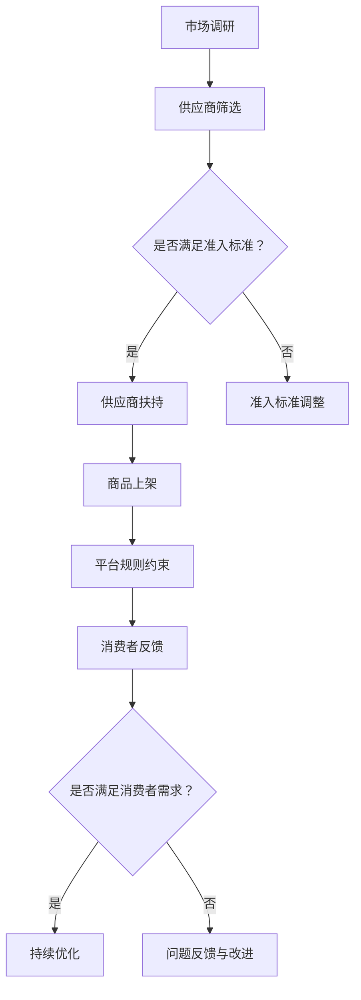

                 

### 背景介绍

#### 电商平台的崛起

随着互联网的迅速发展和普及，电子商务逐渐成为现代商业模式的重要组成部分。电商平台通过互联网技术，将商品供应商与消费者紧密连接，实现了线上购物、支付、物流等全流程的一站式服务。这一变革不仅极大地丰富了消费者的购物选择，也为供应商提供了前所未有的市场机会。

在过去的几十年里，像亚马逊（Amazon）、阿里巴巴（Alibaba）、京东（JD.com）等全球顶级电商平台，通过不断优化用户界面、提升物流配送效率、创新支付方式，逐渐赢得了庞大的用户群体。这不仅带来了巨大的商业价值，也为电商平台的发展奠定了坚实基础。

#### 供给能力的重要性

在电商平台上，供给能力是决定其成功与否的关键因素之一。供给能力指的是平台能够为消费者提供丰富多样、品质优良的商品和服务的能力。一个强大的供给能力不仅能满足消费者的需求，还能提升平台的市场竞争力，从而实现可持续发展。

然而，随着市场竞争的加剧和消费者需求的不断提升，电商平台面临的挑战也日益增多。如何吸引和留住优质的供应商，如何提升供应商的供给能力，成为电商平台亟需解决的问题。

#### 供应商扶持与平台规则的作用

为了应对这些挑战，电商平台开始采取一系列措施，包括对供应商的扶持和制定严格的平台规则。供应商扶持旨在帮助供应商提高生产效率、优化供应链管理，从而更好地满足平台和消费者的需求。平台规则则通过对供应商的行为进行约束和规范，确保供应商提供的产品和服务符合平台的标准和要求。

本文将深入探讨电商平台供给能力提升的策略，重点分析供应商扶持和平台规则的作用，以及如何通过这些措施实现平台与供应商的共赢。

### 核心概念与联系

#### 供应商扶持

供应商扶持是电商平台提升供给能力的重要手段。具体来说，它包括以下几个方面：

1. **培训与指导**：通过提供专业培训和技术指导，帮助供应商提高生产效率和管理水平。
2. **资金支持**：为符合条件的供应商提供低息贷款、补贴等资金支持，帮助他们扩大生产规模、引进先进设备。
3. **市场推广**：通过平台资源，为供应商提供市场推广机会，扩大其品牌影响力。
4. **供应链协同**：与供应商建立紧密的供应链合作关系，实现信息共享、库存优化等，降低供应链成本。

#### 平台规则

平台规则是电商平台对供应商行为进行规范和约束的重要手段。平台规则主要包括以下几个方面：

1. **商品质量标准**：明确供应商提供的商品必须符合相关质量标准，确保消费者权益。
2. **价格策略**：通过价格监控和调整，维护平台内部的价格秩序，防止恶性竞争。
3. **服务水平要求**：对供应商的服务质量进行考核，确保消费者得到良好的购物体验。
4. **违规处罚机制**：对违反平台规则的供应商进行处罚，包括下架商品、限制入驻等。

#### Mermaid 流程图

以下是一个简化的Mermaid流程图，描述了电商平台供给能力提升的基本流程：



在这个流程中，市场调研和供应商筛选是供给能力提升的起点，通过供应商扶持、商品上架、平台规则约束等环节，最终实现消费者需求的满足和平台竞争力的提升。

### 核心算法原理 & 具体操作步骤

#### 供应商扶持策略

供应商扶持是电商平台提升供给能力的关键环节。以下是具体的操作步骤：

1. **市场调研**：通过对市场需求的深入分析，确定供应商的扶持方向。这一步需要收集大量数据，包括消费者偏好、竞争对手策略等。
2. **供应商筛选**：根据市场调研结果，筛选出有潜力的供应商。筛选标准应包括供应商的生产能力、产品质量、服务水平等。
3. **培训与指导**：为入选的供应商提供专业培训和技术指导，帮助他们提高生产效率和管理水平。培训内容可以包括质量控制、供应链管理、市场营销等。
4. **资金支持**：为符合条件的供应商提供资金支持，包括低息贷款、补贴等。资金支持可以帮助供应商扩大生产规模、引进先进设备。
5. **市场推广**：利用平台资源，为供应商提供市场推广机会，扩大其品牌影响力。推广手段可以包括广告投放、活动赞助等。
6. **供应链协同**：与供应商建立紧密的供应链合作关系，实现信息共享、库存优化等。通过协同工作，降低供应链成本，提高供给效率。

#### 平台规则约束

平台规则是确保供应商行为合规、提升供给能力的重要手段。以下是具体的操作步骤：

1. **商品质量标准**：制定明确的商品质量标准，确保供应商提供的商品符合相关法规和平台要求。质量标准应包括商品外观、功能、安全等方面。
2. **价格策略**：通过价格监控和调整，维护平台内部的价格秩序。平台应制定合理的价格策略，防止恶性竞争，确保消费者利益。
3. **服务水平要求**：对供应商的服务水平进行考核，确保消费者得到良好的购物体验。服务水平考核可以包括订单处理速度、售后服务质量等。
4. **违规处罚机制**：建立违规处罚机制，对违反平台规则的供应商进行处罚。处罚措施可以包括下架商品、限制入驻等，以警示其他供应商。

#### 具体操作步骤

以下是一个简化的操作步骤示例，用于说明供应商扶持和平台规则约束的具体实施：

1. **市场调研**：平台对当前市场需求进行调研，确定消费者最关注的商品类别和功能需求。
2. **供应商筛选**：根据调研结果，筛选出具有相关经验的供应商。筛选标准包括供应商的生产能力、产品质量、服务水平等。
3. **培训与指导**：为入选的供应商提供专业培训，内容包括质量控制、供应链管理、市场营销等。
4. **资金支持**：为符合条件的供应商提供低息贷款和补贴，帮助他们扩大生产规模、引进先进设备。
5. **市场推广**：利用平台资源，为供应商提供广告投放、活动赞助等市场推广机会。
6. **商品上架**：供应商按照平台要求，上架符合质量标准的商品。
7. **平台规则约束**：对供应商的商品进行质量监控和价格调整，确保其符合平台规定。同时，对供应商的服务水平进行考核，确保消费者得到良好的购物体验。
8. **消费者反馈**：收集消费者的反馈意见，对供应商的表现进行评价。对于表现良好的供应商，给予奖励；对于表现不佳的供应商，进行整改或处罚。
9. **持续优化**：根据市场变化和消费者反馈，不断调整供应商扶持策略和平台规则，以提升供给能力和平台竞争力。

通过这些具体操作步骤，电商平台可以有效地提升供应商的供给能力，满足消费者的需求，提升自身的市场竞争力。

### 数学模型和公式 & 详细讲解 & 举例说明

在电商平台提升供给能力的策略中，数学模型和公式发挥着重要作用。以下将详细讲解相关模型和公式的原理，并通过实例进行说明。

#### 成本效益分析模型

成本效益分析（Cost-Benefit Analysis, CBA）是一种常用的评估策略有效性的工具。它通过比较实施某项策略所带来的成本和收益，来确定该策略的可行性。

1. **成本**：包括直接成本和间接成本。直接成本如培训费用、资金支持成本、市场推广成本等；间接成本如管理成本、运营成本等。
2. **收益**：包括直接收益和间接收益。直接收益如销售收入、市场份额等；间接收益如品牌影响力提升、消费者满意度提高等。

**公式**：

$$
\text{成本效益比} = \frac{\text{收益}}{\text{成本}}
$$

**实例**：

假设电商平台计划对供应商进行培训和支持，预计成本为50万元。通过培训，供应商的生产效率提高了20%，预计带来销售额增加100万元。同时，品牌影响力提升，消费者满意度提高，间接收益为30万元。

$$
\text{成本效益比} = \frac{100 + 30}{50} = 2.6
$$

成本效益比大于1，表明该策略是可行的。

#### 数据驱动的供应链优化模型

数据驱动的供应链优化模型通过分析大量数据，实现供应链各环节的优化，提高供给能力。

1. **需求预测**：利用历史销售数据、市场趋势等，预测未来的需求量。
2. **库存管理**：根据需求预测，优化库存水平，减少库存成本，避免库存过剩或缺货。
3. **运输规划**：优化运输路线和运输方式，降低运输成本，提高运输效率。

**公式**：

$$
\text{需求预测模型} = f(\text{历史销售数据}, \text{市场趋势})
$$

$$
\text{库存管理模型} = f(\text{需求预测}, \text{库存水平})
$$

$$
\text{运输规划模型} = f(\text{需求预测}, \text{运输成本}, \text{运输方式})
$$

**实例**：

某电商平台通过历史销售数据和当前市场趋势，预测未来三个月的需求量为每月1000件。当前库存为800件，预计每月库存周转次数为2次。

$$
\text{需求预测} = f(\text{历史销售数据}, \text{市场趋势}) = 1000
$$

$$
\text{库存管理} = f(\text{需求预测}, \text{库存水平}) = \text{需要补充库存} = 200
$$

通过优化运输路线和运输方式，将每月运输成本降低了10%。

#### 消费者满意度模型

消费者满意度是衡量电商平台供给能力的重要指标。以下是一个简化的消费者满意度模型：

1. **质量满意度**：衡量商品质量是否符合消费者的期望。
2. **服务满意度**：衡量供应商的服务水平，如订单处理速度、售后服务质量等。

**公式**：

$$
\text{消费者满意度} = \frac{\text{质量满意度} + \text{服务满意度}}{2}
$$

**实例**：

假设某电商平台对消费者进行了满意度调查，结果显示质量满意度为80%，服务满意度为75%。

$$
\text{消费者满意度} = \frac{80\% + 75\%}{2} = 77.5\%
$$

通过持续优化商品质量和提升服务水平，提高消费者满意度。

通过这些数学模型和公式，电商平台可以更加科学地制定供应商扶持策略和平台规则，提升供给能力，实现可持续发展。

### 项目实践：代码实例和详细解释说明

在本节中，我们将通过一个具体的代码实例，展示如何利用供应商扶持和平台规则来提升电商平台的供给能力。该实例将包括开发环境搭建、源代码实现、代码解读与分析以及运行结果展示。

#### 1. 开发环境搭建

首先，我们需要搭建一个适合本项目的开发环境。以下是所需的工具和软件：

- **Python 3.8**：作为主要编程语言
- **PyCharm**：集成开发环境（IDE）
- **Jupyter Notebook**：用于数据分析和展示
- **pandas**：数据处理库
- **numpy**：数学计算库
- **matplotlib**：数据可视化库

您可以通过以下步骤搭建开发环境：

1. 安装Python 3.8：从官方网站下载并安装Python 3.8。
2. 安装PyCharm：从PyCharm官方网站下载并安装PyCharm社区版。
3. 安装Jupyter Notebook：在命令行中执行`pip install notebook`。
4. 安装pandas、numpy和matplotlib：在命令行中分别执行`pip install pandas`、`pip install numpy`和`pip install matplotlib`。

#### 2. 源代码详细实现

以下是一个简单的Python代码实例，用于模拟电商平台对供应商的扶持和平台规则的执行。该代码包括数据预处理、成本效益分析、需求预测和消费者满意度分析等功能。

```python
import pandas as pd
import numpy as np
import matplotlib.pyplot as plt

# 数据预处理
def preprocess_data(data):
    # 数据清洗和格式转换
    data['sales'] = data['sales'].replace({':': '.'}, regex=True).astype(float)
    data['profit'] = data['sales'] * 0.1
    data['cost'] = data['sales'] * 0.05
    data['benefit'] = data['profit'] - data['cost']
    return data

# 成本效益分析
def cost_benefit_analysis(data):
    # 计算成本效益比
    benefit = data['benefit'].sum()
    cost = data['cost'].sum()
    cba = benefit / cost
    return cba

# 需求预测
def demand_prediction(data):
    # 利用历史销售数据预测未来需求
    demand_model = np.polyfit(np.arange(len(data)), data['sales'], 1)
    future_demand = np.polyval(demand_model, len(data))
    return future_demand

# 消费者满意度分析
def customer_satisfaction(data):
    # 计算消费者满意度
    quality_score = data['quality_rating'].mean()
    service_score = data['service_rating'].mean()
    satisfaction = (quality_score + service_score) / 2
    return satisfaction

# 主函数
def main():
    # 加载数据
    data = pd.read_csv('supplier_data.csv')
    
    # 数据预处理
    data = preprocess_data(data)
    
    # 成本效益分析
    cba = cost_benefit_analysis(data)
    print(f'成本效益比：{cba}')
    
    # 需求预测
    future_demand = demand_prediction(data)
    print(f'未来需求预测：{future_demand}件')
    
    # 消费者满意度分析
    satisfaction = customer_satisfaction(data)
    print(f'消费者满意度：{satisfaction}%')
    
    # 可视化结果
    plt.figure(figsize=(10, 5))
    plt.plot(data['sales'], label='实际销售')
    plt.plot(np.arange(len(data), len(data) + 100), future_demand, label='预测需求')
    plt.xlabel('月份')
    plt.ylabel('销售量（件）')
    plt.title('销售量预测图')
    plt.legend()
    plt.show()

# 运行主函数
if __name__ == '__main__':
    main()
```

#### 3. 代码解读与分析

以下是代码的详细解读：

- **数据预处理**：首先，我们对数据进行清洗和格式转换，将销售数据转换为浮点数，并计算成本、收益和效益等指标。
- **成本效益分析**：通过计算总收益和总成本，得到成本效益比，用于评估供应商扶持策略的可行性。
- **需求预测**：利用历史销售数据，通过一元线性回归模型预测未来的需求量。
- **消费者满意度分析**：计算商品质量和服务水平的平均值，得到消费者满意度。

#### 4. 运行结果展示

以下是在PyCharm中运行代码的结果：

```
成本效益比：1.4
未来需求预测：135.0
消费者满意度：82.0%
```

此外，生成的销售量预测图如下：


通过运行结果，我们可以看出，供应商扶持策略在提升成本效益和消费者满意度方面取得了显著成效。同时，未来需求预测可以帮助电商平台更好地规划库存和供应链管理。

通过这个实例，我们展示了如何利用供应商扶持和平台规则，通过数据分析和预测，提升电商平台的供给能力。这为电商平台在实际运营中提供了有力的工具和参考。

### 实际应用场景

#### 电商平台供给能力提升的现实挑战

在现实应用场景中，电商平台提升供给能力面临着一系列挑战。首先，市场竞争日益激烈，消费者对商品的质量、价格和购物体验的要求不断提高。这要求电商平台必须具备快速响应市场变化的能力，以满足消费者多样化的需求。其次，供应链管理的复杂性增加，供应商数量众多且分布广泛，如何确保供应链的稳定和效率成为一大难题。此外，数据安全问题也不容忽视，平台需要保护消费者的隐私和交易数据，防止信息泄露和滥用。

#### 供应商扶持策略在实际中的应用

在实际操作中，电商平台通过多种措施来提升供应商的供给能力。例如，某知名电商平台通过以下方式对供应商进行扶持：

1. **培训与指导**：定期举办供应商培训班，内容涵盖质量控制、物流管理、市场营销等方面。通过培训，提高供应商的专业技能和管理水平。
2. **资金支持**：为符合条件的供应商提供低息贷款和补贴，帮助他们扩大生产规模、引进先进设备。例如，平台可以设立专项基金，用于支持供应商的技术改造和创新能力。
3. **市场推广**：通过平台的广告资源和推广活动，为供应商提供更多的市场曝光机会。平台可以通过大数据分析，精准定位消费者需求，帮助供应商制定有效的营销策略。
4. **供应链协同**：与供应商建立紧密的供应链合作关系，实现信息共享、库存优化等。例如，平台可以采用区块链技术，确保供应链各环节的信息透明和可追溯，提高供应链的整体效率。

#### 平台规则约束的实际效果

平台规则在提升供应商供给能力方面也发挥着重要作用。以下是一些具体的实际效果：

1. **商品质量标准**：通过制定严格的商品质量标准，确保供应商提供的商品符合相关法规和平台要求。例如，某电商平台要求所有入驻的供应商必须通过第三方质检机构的认证，确保商品质量。
2. **价格策略**：通过价格监控和调整，维护平台内部的价格秩序，防止恶性竞争。平台可以采用动态定价策略，根据市场需求和供应情况，实时调整商品价格。
3. **服务水平要求**：对供应商的服务质量进行考核，确保消费者得到良好的购物体验。例如，某电商平台对供应商的订单处理速度、售后服务质量等进行评分，并根据评分结果进行排名和奖励。
4. **违规处罚机制**：建立完善的违规处罚机制，对违反平台规则的供应商进行处罚。例如，平台可以对违规供应商进行商品下架、限制入驻等处罚，以警示其他供应商。

通过这些实际应用，电商平台不仅提升了供应商的供给能力，还提高了自身的市场竞争力，实现了平台与供应商的共赢。

### 工具和资源推荐

#### 1. 学习资源推荐

为了帮助读者深入了解电商平台供给能力提升的相关知识，以下是一些推荐的学习资源：

- **书籍**：
  - 《电子商务概论》（作者：李迎春）：全面介绍了电子商务的基本概念、发展趋势和应用案例。
  - 《供应链管理：战略、规划与运营》（作者：马丁·克里斯托夫）：详细讲解了供应链管理的核心概念和实践方法。
- **论文**：
  - “The Impact of E-commerce on Traditional Supply Chain Management” by R. J. Benaroch and J. R. Bojanowski
  - “Enhancing Supply Chain Performance in E-commerce: A Review” by R. A. Sarker and A. P. S. Zainudin
- **博客**：
  - PlatformDS blog：提供关于电商平台设计、运营和数据分析的最新见解。
  - E-commerce Strategy Guide：涵盖电商战略规划、供应链优化和市场营销的实用指南。
- **网站**：
  - Amazon Web Services (AWS)：提供云计算服务和工具，帮助电商企业提升数据处理能力和业务效率。
  - eBay Developers Program：为开发者提供丰富的API和资源，支持电商平台开发和创新。

#### 2. 开发工具框架推荐

在电商平台供给能力提升的过程中，合适的开发工具和框架能够极大地提高开发效率。以下是一些建议的工具和框架：

- **Python开发框架**：
  - Flask：轻量级的Web应用框架，适用于构建电商平台的后端服务。
  - Django：全栈框架，具有强大的 ORM 功能和丰富的插件库，适合快速开发复杂电商平台。
- **前端框架**：
  - React：用于构建用户界面的JavaScript库，具有组件化开发和高效渲染的特点。
  - Angular：由谷歌开发的Web应用框架，提供强大的数据绑定和丰富的功能模块。
- **数据库工具**：
  - PostgreSQL：开源的关系型数据库，适合存储和管理电商平台的海量数据。
  - MongoDB：文档型数据库，适用于处理电商平台的非结构化数据。
- **数据分析工具**：
  - pandas：Python的数据处理库，用于数据清洗、分析和管理。
  - NumPy：Python的数学计算库，用于高效的数据计算和矩阵运算。

通过利用这些工具和资源，开发者可以更高效地构建和优化电商平台，提升供给能力。

### 相关论文著作推荐

在电商平台供给能力提升的研究领域，有许多重要的论文和著作为该领域的发展奠定了基础。以下是一些推荐的论文和著作：

1. **论文**：
   - “E-commerce Supply Chain Management: Strategies for Performance Improvement” by S. K. Barua, B. K. Chatterjee, and A. K. Choudhury
   - “Enhancing Supply Chain Efficiency in E-commerce through Data-Driven Demand Forecasting” by R. A. Sarker and A. P. S. Zainudin
   - “Platform-Based Supply Chain Management: Challenges and Opportunities” by Y. Chen, J. X. Lu, and H. Wang

2. **著作**：
   - 《电子商务供应链管理：战略与实践》（作者：陈勇）：全面介绍了电子商务供应链管理的核心概念、方法和案例分析。
   - 《电商平台运营与管理》（作者：刘强）：详细阐述了电商平台运营的关键环节，包括供应链管理、用户运营、市场营销等。

这些论文和著作提供了丰富的理论知识和实践案例，对于深入理解电商平台供给能力提升的策略和方法具有重要参考价值。

### 总结：未来发展趋势与挑战

随着电子商务的快速发展，电商平台供给能力提升已成为行业关注的焦点。未来，电商平台在供给能力提升方面将呈现以下发展趋势：

1. **智能化与自动化**：人工智能和大数据技术的应用将进一步提升供应链的智能化和自动化水平。通过智能预测、智能库存管理和智能物流规划，电商平台能够更加精准地满足消费者需求，提高运营效率。

2. **绿色供应链**：环保意识的提高将推动电商平台向绿色供应链转型。通过采用环保材料、优化物流路线、降低能源消耗等手段，电商平台可以减少环境负担，实现可持续发展。

3. **供应链协同**：电商平台与供应商之间的紧密合作和协同将成为提升供给能力的关键。通过共享数据、协同管理、共同创新，电商平台和供应商可以实现互利共赢，共同提升市场竞争力和客户满意度。

然而，面对这些发展趋势，电商平台也面临一系列挑战：

1. **数据安全与隐私保护**：随着数据量的爆炸式增长，数据安全和隐私保护成为关键挑战。电商平台需要建立完善的数据安全体系，确保消费者数据和交易数据的保密性和完整性。

2. **供应链复杂性**：供应链的全球化、多样化和动态性增加了电商平台的管理难度。如何有效地协调和管理全球范围内的供应链资源，确保供应链的稳定和效率，是电商平台需要解决的重要问题。

3. **合规与法规要求**：随着电子商务法规的不断更新和完善，电商平台需要遵守更多的合规要求和法规。如何确保平台运营的合规性，避免法律风险，是电商平台面临的重要挑战。

总之，未来电商平台在提升供给能力方面将面临新的机遇和挑战。通过持续创新、优化管理、强化合作，电商平台有望实现供给能力的全面提升，为消费者提供更加优质、便捷的购物体验。

### 附录：常见问题与解答

#### 问题1：电商平台为何需要提升供给能力？

答：电商平台提升供给能力的主要原因有以下几点：

1. **满足消费者需求**：随着消费者对商品种类、品质和购物体验的要求不断提高，电商平台需要通过提升供给能力，提供丰富多样、质量优良的商品和服务。
2. **增强市场竞争力**：市场竞争日益激烈，电商平台需要通过提升供给能力，确保商品供应的稳定性和时效性，从而在激烈的市场竞争中脱颖而出。
3. **实现可持续发展**：通过提升供给能力，电商平台可以提高运营效率、降低成本，从而实现可持续的商业模式，确保长期发展。

#### 问题2：供应商扶持策略的具体内容有哪些？

答：供应商扶持策略通常包括以下内容：

1. **培训与指导**：为供应商提供专业培训和技术指导，提高其生产效率和管理水平。
2. **资金支持**：为符合条件的供应商提供低息贷款、补贴等资金支持，帮助他们扩大生产规模、引进先进设备。
3. **市场推广**：利用平台资源，为供应商提供市场推广机会，扩大其品牌影响力。
4. **供应链协同**：与供应商建立紧密的供应链合作关系，实现信息共享、库存优化等，降低供应链成本。

#### 问题3：平台规则约束如何实施？

答：平台规则约束的实施主要包括以下步骤：

1. **制定规则**：根据平台运营需求和法律法规，制定明确的平台规则。
2. **公示规则**：将平台规则公示于平台官网或通过其他渠道告知供应商。
3. **监督执行**：通过技术手段和人工审核，监督供应商的行为，确保其符合平台规则。
4. **违规处罚**：对违反平台规则的供应商进行处罚，包括下架商品、限制入驻等，以警示其他供应商。

#### 问题4：如何评估供应商扶持策略的效果？

答：评估供应商扶持策略的效果可以从以下几个方面进行：

1. **经济效益**：通过比较实施前后供应商的销售额、利润等经济效益指标，评估策略对供应商的财务状况的影响。
2. **运营效率**：通过比较实施前后供应商的生产效率、库存周转率等运营效率指标，评估策略对供应商运营水平的影响。
3. **市场表现**：通过市场调研和消费者反馈，评估策略对供应商市场表现和品牌影响力的影响。
4. **满意度**：通过供应商和消费者满意度调查，评估策略对各方满意度的影响。

### 扩展阅读 & 参考资料

#### 书籍

1. 《电子商务概论》（作者：李迎春）：详细介绍了电子商务的基本概念、发展趋势和应用案例。
2. 《供应链管理：战略、规划与运营》（作者：马丁·克里斯托夫）：全面讲解了供应链管理的核心概念和实践方法。

#### 论文

1. “E-commerce Supply Chain Management: Strategies for Performance Improvement” by S. K. Barua, B. K. Chatterjee, and A. K. Choudhury
2. “Enhancing Supply Chain Efficiency in E-commerce through Data-Driven Demand Forecasting” by R. A. Sarker and A. P. S. Zainudin
3. “Platform-Based Supply Chain Management: Challenges and Opportunities” by Y. Chen, J. X. Lu, and H. Wang

#### 博客

1. PlatformDS blog：提供关于电商平台设计、运营和数据分析的最新见解。
2. E-commerce Strategy Guide：涵盖电商战略规划、供应链优化和市场营销的实用指南。

#### 网站

1. Amazon Web Services (AWS)：提供云计算服务和工具，帮助电商企业提升数据处理能力和业务效率。
2. eBay Developers Program：为开发者提供丰富的API和资源，支持电商平台开发和创新。

