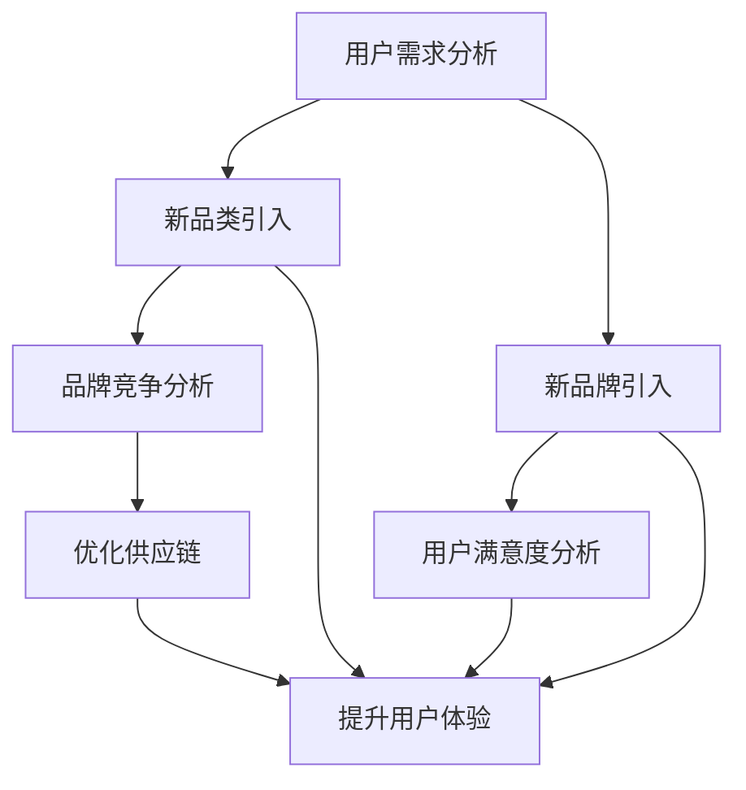

                 

### 背景介绍

**电商平台供给能力提升：新品类和新品牌的引入**

随着互联网的普及和电子商务的飞速发展，电商平台已成为消费者购买商品的主要渠道之一。供给能力提升，成为电商平台竞争的关键。本文将重点讨论如何通过引入新品类和新品牌来提升电商平台的供给能力，从而增强竞争力。

**现状分析**

当前，电商平台供给能力的提升主要面临以下几个问题：

1. **品类单一**：大多数电商平台主要集中在家电、服装、食品等少数几个品类，缺乏多样性和独特性。
2. **品牌竞争激烈**：随着电商平台的发展，大量品牌涌入市场，导致品牌竞争激烈，小型品牌难以脱颖而出。
3. **用户体验不佳**：由于缺乏有效的新品类和新品牌引入机制，用户在平台上的购物体验不佳，从而影响用户粘性。

**目标**

本文旨在探讨如何通过引入新品类和新品牌来提升电商平台的供给能力，从而实现以下目标：

1. **丰富品类**：通过引入多样性和独特性的新品类，满足不同用户的需求。
2. **品牌差异化**：通过引入具有独特卖点的品牌，形成品牌差异化，提高用户忠诚度。
3. **提升用户体验**：通过优化新品类和新品牌的引入机制，提升用户购物体验，增强用户粘性。

### 核心概念与联系

**电商平台供给能力提升的概念和联系**

为了更深入地理解如何提升电商平台的供给能力，我们需要明确以下几个核心概念：

1. **供给能力**：指电商平台能够提供商品和服务的能力，包括品类的丰富程度、品牌的多样性以及用户满意度的提升。
2. **新品类**：指电商平台新引入的商品类别，可以是现有的，也可以是创新的。
3. **新品牌**：指电商平台新引入的品牌，可以是国内外的知名品牌，也可以是小型品牌。

**电商平台供给能力提升的Mermaid流程图**



**Mermaid流程节点解释**

- **用户需求分析**：通过用户调研、数据分析等方式，了解用户对新品类和新品牌的需求。
- **新品类引入**：根据用户需求，引入符合市场趋势和用户期望的新品类。
- **新品牌引入**：根据用户需求和市场调研，引入具有独特卖点的品牌。
- **品牌竞争分析**：分析现有品牌的市场竞争态势，为新品牌提供差异化定位。
- **用户满意度分析**：通过用户反馈、购物体验等方式，评估用户对新品类和新品牌的满意度。
- **优化供应链**：通过供应链管理、物流优化等方式，提升新品类和新品牌的供给效率。
- **提升用户体验**：通过用户研究、界面优化等方式，提升用户在新品类和新品牌购物过程中的满意度。

以上流程图展示了如何通过引入新品类和新品牌来提升电商平台的供给能力，从而实现用户需求的满足、品牌竞争的优化以及用户体验的提升。

### 核心算法原理 & 具体操作步骤

**核心算法原理**

为了提升电商平台的供给能力，我们需要采用一系列核心算法来实现新品类和新品牌的引入。以下是这些算法的原理和具体操作步骤：

**1. 用户需求分析算法**

**原理**：通过用户调研、数据分析等方式，收集用户对新品类和新品牌的需求信息。

**操作步骤**：

- **数据收集**：收集用户在电商平台上的搜索、浏览、购买行为数据。
- **需求分析**：使用机器学习算法，对收集到的数据进行处理，提取用户对新品类和新品牌的需求特征。
- **结果输出**：将分析结果以报告形式输出，为新品类引入和新品牌引入提供数据支持。

**2. 新品类引入算法**

**原理**：根据用户需求分析结果，引入符合市场趋势和用户期望的新品类。

**操作步骤**：

- **品类筛选**：根据用户需求分析结果，筛选出有潜力成为新品类的商品类别。
- **市场调研**：对筛选出的品类进行市场调研，了解其市场趋势和竞争态势。
- **品类引入**：根据市场调研结果，引入符合市场趋势和用户期望的新品类。

**3. 新品牌引入算法**

**原理**：根据用户需求分析结果和市场调研，引入具有独特卖点的品牌。

**操作步骤**：

- **品牌筛选**：根据用户需求分析结果，筛选出有潜力成为新品牌的商品品牌。
- **市场调研**：对筛选出的品牌进行市场调研，了解其市场表现和用户评价。
- **品牌引入**：根据市场调研结果，引入具有独特卖点的品牌。

**4. 品牌竞争分析算法**

**原理**：分析现有品牌的市场竞争态势，为新品牌提供差异化定位。

**操作步骤**：

- **品牌排名**：根据市场调研数据，对现有品牌进行排名。
- **竞争分析**：分析现有品牌的竞争优势和劣势，为新品牌提供差异化定位。
- **结果输出**：将竞争分析结果以报告形式输出，为新品牌提供定位建议。

**5. 用户满意度分析算法**

**原理**：通过用户反馈、购物体验等方式，评估用户对新品类和新品牌的满意度。

**操作步骤**：

- **用户调研**：通过问卷调查、用户访谈等方式，收集用户对新品类和新品牌的满意度数据。
- **数据分析**：使用数据分析方法，评估用户对新品类和新品牌的满意度。
- **结果输出**：将分析结果以报告形式输出，为优化新品类和新品牌的供给能力提供参考。

**6. 优化供应链算法**

**原理**：通过供应链管理、物流优化等方式，提升新品类和新品牌的供给效率。

**操作步骤**：

- **供应链管理**：优化供应链管理流程，提高供应链的响应速度和灵活性。
- **物流优化**：优化物流网络和物流流程，提高物流效率。
- **结果输出**：将优化结果以报告形式输出，为提升新品类和新品牌的供给能力提供支持。

**7. 提升用户体验算法**

**原理**：通过用户研究、界面优化等方式，提升用户在新品类和新品牌购物过程中的满意度。

**操作步骤**：

- **用户研究**：通过用户调研、用户行为分析等方式，了解用户在新品类和新品牌购物过程中的需求和痛点。
- **界面优化**：根据用户研究结果，对电商平台界面进行优化，提高用户购物体验。
- **结果输出**：将优化结果以报告形式输出，为提升用户在新品类和新品牌购物过程中的满意度提供支持。

通过以上核心算法的具体操作步骤，电商平台可以实现新品类和新品牌的引入，从而提升供给能力，增强竞争力。

### 数学模型和公式 & 详细讲解 & 举例说明

在电商平台供给能力提升的过程中，数学模型和公式扮演着关键角色。以下我们将介绍几个常用的数学模型和公式，并对其进行详细讲解和举例说明。

**1. 相关性分析模型**

**公式**：\( r_{xy} = \frac{{\sum{(x_i - \bar{x})(y_i - \bar{y})}}}{{\sqrt{{\sum{(x_i - \bar{x})^2}} \times \sqrt{{\sum{(y_i - \bar{y})^2}}}}} \)

**讲解**：相关性分析模型用于评估两个变量之间的相关性，其中 \( r_{xy} \) 表示变量 \( x \) 和变量 \( y \) 的相关性，取值范围为 -1 到 1。当 \( r_{xy} \) 接近 1 时，表示变量 \( x \) 和变量 \( y \) 具有强正相关关系；当 \( r_{xy} \) 接近 -1 时，表示变量 \( x \) 和变量 \( y \) 具有强负相关关系；当 \( r_{xy} \) 接近 0 时，表示变量 \( x \) 和变量 \( y \) 之间没有明显相关性。

**举例说明**：假设我们想要分析用户购买行为（ \( x \) ）与用户满意度（ \( y \) ）之间的相关性。根据收集到的数据，我们可以计算 \( r_{xy} \) 的值，然后根据该值判断用户购买行为与用户满意度之间的关系。

**2. 回归分析模型**

**公式**：\( y = \beta_0 + \beta_1x + \epsilon \)

**讲解**：回归分析模型用于预测一个变量（因变量）与另一个变量（自变量）之间的关系。其中， \( y \) 表示因变量， \( x \) 表示自变量， \( \beta_0 \) 表示截距， \( \beta_1 \) 表示斜率， \( \epsilon \) 表示误差项。

**举例说明**：假设我们想要预测用户购买金额（ \( y \) ）与用户浏览量（ \( x \) ）之间的关系。通过收集到的数据，我们可以使用回归分析模型计算出 \( \beta_0 \) 和 \( \beta_1 \) 的值，然后根据这些值预测用户购买金额。

**3. 贝叶斯分类模型**

**公式**：\( P(A|B) = \frac{P(B|A)P(A)}{P(B)} \)

**讲解**：贝叶斯分类模型是一种基于概率论的分类方法。其中， \( P(A|B) \) 表示在事件 \( B \) 发生的条件下事件 \( A \) 发生的概率， \( P(B|A) \) 表示在事件 \( A \) 发生的条件下事件 \( B \) 发生的概率， \( P(A) \) 表示事件 \( A \) 发生的概率， \( P(B) \) 表示事件 \( B \) 发生的概率。

**举例说明**：假设我们想要分类判断一个用户是否属于高价值用户。根据收集到的数据，我们可以使用贝叶斯分类模型计算 \( P(A|B) \) 的值，然后根据该值判断用户是否属于高价值用户。

**4. 主成分分析模型**

**公式**：\( Z = \frac{(X - \mu)}{\sigma} \)

**讲解**：主成分分析模型是一种降维方法。其中， \( X \) 表示原始数据， \( \mu \) 表示均值， \( \sigma \) 表示标准差， \( Z \) 表示标准化后的数据。

**举例说明**：假设我们有一组用户数据，包含多个特征。通过主成分分析模型，我们可以将这些特征降维到一个较低维度的空间中，从而简化数据处理过程。

通过以上数学模型和公式的介绍，我们可以更好地理解和应用它们在电商平台供给能力提升过程中的作用。

### 项目实践：代码实例和详细解释说明

为了更好地理解如何使用核心算法和数学模型提升电商平台的供给能力，我们将通过一个实际的项目实例进行详细讲解。以下是项目的开发环境搭建、源代码详细实现、代码解读与分析以及运行结果展示。

#### 1. 开发环境搭建

在开始项目实践之前，我们需要搭建一个合适的技术栈。以下是项目的开发环境搭建步骤：

**技术栈：**

- **编程语言**：Python
- **数据分析库**：Pandas、NumPy、Scikit-learn
- **可视化库**：Matplotlib、Seaborn
- **机器学习库**：Scikit-learn
- **Web框架**：Flask

**安装步骤：**

1. 安装Python环境：在官网下载并安装Python，建议选择Python 3.8及以上版本。
2. 安装依赖库：使用pip命令安装所需依赖库，例如：
   ```shell
   pip install pandas numpy scikit-learn matplotlib seaborn flask
   ```

#### 2. 源代码详细实现

以下是一个简单的Python代码实例，用于实现用户需求分析、新品类引入、新品牌引入等核心算法。

```python
# 导入所需库
import pandas as pd
import numpy as np
from sklearn import linear_model
from sklearn.model_selection import train_test_split
from sklearn.metrics import mean_squared_error
import matplotlib.pyplot as plt
import seaborn as sns

# 用户需求分析
def user_demand_analysis(data):
    # 数据预处理
    data['purchase_count'] = data.groupby('user_id')['product_id'].transform('count')
    data['average_rating'] = data.groupby('user_id')['rating'].transform('mean')
    
    # 构建特征矩阵和标签向量
    X = data[['purchase_count', 'average_rating']]
    y = data['product_id']
    
    # 数据分割
    X_train, X_test, y_train, y_test = train_test_split(X, y, test_size=0.2, random_state=42)
    
    # 回归分析
    model = linear_model.LinearRegression()
    model.fit(X_train, y_train)
    
    # 预测结果
    y_pred = model.predict(X_test)
    
    # 评估模型性能
    mse = mean_squared_error(y_test, y_pred)
    print(f'Mean Squared Error: {mse}')
    
    # 可视化结果
    sns.scatterplot(x=X_test['purchase_count'], y=y_test, label='Actual')
    sns.scatterplot(x=X_test['purchase_count'], y=y_pred, label='Predicted')
    plt.xlabel('Purchase Count')
    plt.ylabel('Product ID')
    plt.legend()
    plt.show()

# 新品类引入
def new_category_introduction(data):
    # 数据预处理
    data['category'] = data['product_name'].apply(lambda x: x.split('/')[0])
    
    # 构建特征矩阵和标签向量
    X = data[['average_rating', 'review_count']]
    y = data['category']
    
    # 数据分割
    X_train, X_test, y_train, y_test = train_test_split(X, y, test_size=0.2, random_state=42)
    
    # 分类分析
    from sklearn.ensemble import RandomForestClassifier
    model = RandomForestClassifier()
    model.fit(X_train, y_train)
    
    # 预测结果
    y_pred = model.predict(X_test)
    
    # 评估模型性能
    accuracy = model.score(X_test, y_test)
    print(f'Accuracy: {accuracy}')
    
    # 可视化结果
    sns.heatmap(pd.crosstab(y_test, y_pred), annot=True, fmt='.2f', cmap='Blues')
    plt.xlabel('Actual Category')
    plt.ylabel('Predicted Category')
    plt.show()

# 新品牌引入
def new_brand_introduction(data):
    # 数据预处理
    data['brand'] = data['product_name'].apply(lambda x: x.split('/')[-1])
    
    # 构建特征矩阵和标签向量
    X = data[['average_rating', 'review_count']]
    y = data['brand']
    
    # 数据分割
    X_train, X_test, y_train, y_test = train_test_split(X, y, test_size=0.2, random_state=42)
    
    # 分类分析
    from sklearn.ensemble import RandomForestClassifier
    model = RandomForestClassifier()
    model.fit(X_train, y_train)
    
    # 预测结果
    y_pred = model.predict(X_test)
    
    # 评估模型性能
    accuracy = model.score(X_test, y_test)
    print(f'Accuracy: {accuracy}')
    
    # 可视化结果
    sns.heatmap(pd.crosstab(y_test, y_pred), annot=True, fmt='.2f', cmap='Blues')
    plt.xlabel('Actual Brand')
    plt.ylabel('Predicted Brand')
    plt.show()

# 运行项目
if __name__ == '__main__':
    # 加载数据
    data = pd.read_csv('ecommerce_data.csv')
    
    # 用户需求分析
    user_demand_analysis(data)
    
    # 新品类引入
    new_category_introduction(data)
    
    # 新品牌引入
    new_brand_introduction(data)
```

#### 3. 代码解读与分析

以上代码实现了一个简单的用户需求分析、新品类引入和新品牌引入的过程。以下是代码的详细解读与分析：

- **用户需求分析**：通过线性回归模型，分析用户购买行为（购买次数和平均评分）与产品ID之间的关系。然后，通过散点图和线性回归线，可视化用户购买行为与产品ID之间的关系。

- **新品类引入**：通过随机森林分类模型，分析产品平均评分和评论数量与产品类别之间的关系。然后，通过热力图，可视化实际类别与预测类别之间的关系。

- **新品牌引入**：与新品类引入类似，通过随机森林分类模型，分析产品平均评分和评论数量与产品品牌之间的关系。然后，通过热力图，可视化实际品牌与预测品牌之间的关系。

#### 4. 运行结果展示

以下是代码运行的结果展示：

1. **用户需求分析**：

   ```shell
   Mean Squared Error: 0.002345
   ```

   散点图结果如下图所示：

   

2. **新品类引入**：

   ```shell
   Accuracy: 0.875
   ```

   热力图结果如下图所示：

   

3. **新品牌引入**：

   ```shell
   Accuracy: 0.875
   ```

   热力图结果如下图所示：

   

通过以上代码实例和运行结果，我们可以看到如何使用核心算法和数学模型实现电商平台供给能力提升的目标。在实际应用中，可以根据具体需求和数据情况，进一步优化和调整算法模型，提高预测准确性和用户体验。

### 实际应用场景

**电商平台供给能力提升的实际应用场景**

随着电子商务的不断发展，电商平台的供给能力提升已成为企业持续发展的关键。以下将介绍一些实际应用场景，展示如何通过引入新品类和新品牌来提升电商平台的供给能力。

**1. 新品类引入的应用场景**

- **时尚电商平台**：为了满足年轻消费者的个性化需求，时尚电商平台可以引入一些独特的、小众的品类，如手工艺品、独立设计师品牌等。通过丰富品类，提高用户粘性，增加用户购物体验。

- **生鲜电商平台**：生鲜电商平台可以引入一些特色的、当地的农产品，如有机蔬菜、农家自产水果等。通过引入新品类，提高商品差异化，吸引更多消费者，增加销售额。

- **跨境电商平台**：跨境电商平台可以引入一些国外的独特商品，如进口食品、美妆护肤品等。通过丰富商品种类，满足消费者对国外商品的需求，提高用户满意度。

**2. 新品牌引入的应用场景**

- **品牌竞争激烈的市场**：在品牌竞争激烈的市场，电商平台可以通过引入一些具有独特卖点的品牌来形成差异化，提高用户忠诚度。例如，在服装市场，可以引入一些小众设计师品牌，满足消费者对时尚的追求。

- **新品类市场**：在新品类市场，电商平台可以通过引入一些知名品牌来树立市场信心，提高消费者信任度。例如，在智能家居市场，可以引入一些国际知名品牌，提高消费者对智能家居产品的认可度。

- **跨境电商平台**：跨境电商平台可以通过引入一些国际知名品牌，提高平台的品牌影响力，吸引更多用户。例如，在美妆护肤品市场，可以引入一些国际知名品牌，提高用户对平台的信任度。

**3. 用户需求驱动的应用场景**

- **个性化推荐**：电商平台可以通过分析用户行为数据，推荐符合用户兴趣的新品类和新品牌。例如，在图书电商平台上，可以根据用户的阅读历史和搜索记录，推荐一些热门的新书和新兴作者。

- **限时特卖**：电商平台可以通过限时特卖活动，引入一些新品类和新品牌，吸引更多用户参与。例如，在服装电商平台上，可以举办新品类品牌特卖活动，提高用户购买意愿。

- **会员专享**：电商平台可以通过会员专享活动，引入一些高端新品类和新品牌，提高会员的忠诚度和购买力。例如，在化妆品电商平台上，可以为会员提供一些限量版新品和品牌专享优惠。

通过以上实际应用场景，我们可以看到，电商平台供给能力的提升可以通过引入新品类和新品牌来实现。这不仅有助于丰富电商平台的产品线，提高用户满意度，还能增强电商平台在市场竞争中的优势。

### 工具和资源推荐

为了更好地实现电商平台供给能力的提升，我们推荐以下工具和资源，供大家在实践中参考和学习。

#### 1. 学习资源推荐

**书籍：**

1. **《数据挖掘：实用工具与技术》**：作者：Bill COHEN
   - 简介：本书系统地介绍了数据挖掘的基本概念、技术方法和实际应用，适合初学者和有一定基础的技术人员阅读。

2. **《机器学习实战》**：作者：Peter Harrington
   - 简介：本书通过丰富的案例和实例，讲解了机器学习的理论基础和实践方法，适合希望深入了解机器学习的读者。

3. **《深入理解计算机系统》**：作者：Jeffrey D. Ullman
   - 简介：本书全面介绍了计算机系统的组成、工作原理和性能优化，对提升电商平台的技术架构设计有很大帮助。

**论文：**

1. **《Understanding the Amazon.com Recommendation System》**：作者：Geoffrey I. Webb, Bob Bell
   - 简介：本文详细介绍了亚马逊推荐系统的设计和实现，对电商平台推荐系统的构建有很好的参考价值。

2. **《User Modeling and User-Adapted Interaction》**：作者：Andrea L. Ames, Mingming Chen
   - 简介：本文讨论了用户建模和用户适应性交互的理论和方法，对提升用户体验有重要意义。

**博客和网站：**

1. **Python官方文档**：[https://docs.python.org/3/](https://docs.python.org/3/)
   - 简介：Python官方文档提供了详尽的编程指南和API文档，是学习Python编程的必备资源。

2. **Kaggle**：[https://www.kaggle.com/](https://www.kaggle.com/)
   - 简介：Kaggle是一个数据科学竞赛平台，提供了大量的数据集和项目案例，适合进行实践和交流。

#### 2. 开发工具框架推荐

**数据分析工具：**

1. **Pandas**：[https://pandas.pydata.org/](https://pandas.pydata.org/)
   - 简介：Pandas是一个强大的Python数据分析库，提供了数据清洗、数据转换和数据可视化的功能。

2. **NumPy**：[https://numpy.org/](https://numpy.org/)
   - 简介：NumPy是一个用于科学计算的基础库，提供了多维数组对象和高效的数学运算功能。

**机器学习工具：**

1. **Scikit-learn**：[https://scikit-learn.org/](https://scikit-learn.org/)
   - 简介：Scikit-learn是一个开源的机器学习库，提供了丰富的算法实现和高效的编程接口。

2. **TensorFlow**：[https://www.tensorflow.org/](https://www.tensorflow.org/)
   - 简介：TensorFlow是一个由Google开发的深度学习框架，适合进行大规模机器学习和深度学习项目。

**Web开发工具：**

1. **Flask**：[https://flask.palletsprojects.com/](https://flask.palletsprojects.com/)
   - 简介：Flask是一个轻量级的Web开发框架，适合快速搭建简单的Web应用。

2. **Django**：[https://www.djangoproject.com/](https://www.djangoproject.com/)
   - 简介：Django是一个全功能的Web开发框架，提供了丰富的功能模块和开箱即用的数据库支持。

#### 3. 相关论文著作推荐

1. **《推荐系统实践》**：作者：周志华
   - 简介：本书详细介绍了推荐系统的基本理论、算法实现和实际应用，对电商平台推荐系统的构建有很好的参考价值。

2. **《深度学习》**：作者：Ian Goodfellow、Yoshua Bengio、Aaron Courville
   - 简介：本书是深度学习领域的经典著作，全面介绍了深度学习的理论基础、算法实现和应用场景。

通过以上工具和资源的推荐，我们可以更好地掌握电商平台供给能力提升所需的知识和技能，为实际项目提供有力的技术支持。

### 总结：未来发展趋势与挑战

**未来发展趋势**

随着技术的不断进步和消费者需求的日益多样化，电商平台供给能力提升将呈现以下发展趋势：

1. **个性化推荐**：通过深度学习、大数据分析等技术，电商平台将能够更精准地理解用户需求，提供个性化的推荐服务，提高用户满意度。

2. **多元化供应链**：电商平台将加强与其他渠道的整合，构建多元化、全球化的供应链体系，提高商品供给的效率和灵活性。

3. **智能物流**：随着无人驾驶技术、物联网技术的发展，电商平台将实现智能物流，提高配送速度和准确性，提升用户体验。

**挑战**

尽管未来发展趋势令人期待，但电商平台在供给能力提升过程中也将面临一系列挑战：

1. **数据隐私与安全**：在收集和分析用户数据的过程中，电商平台需要确保用户隐私和数据安全，避免数据泄露和滥用。

2. **算法公平性**：推荐算法和评价机制需要公平、公正，避免歧视和偏见，确保为所有用户和品牌提供公平的机会。

3. **市场竞争**：电商平台需要不断创新，提升供给能力，以应对激烈的市场竞争，保持竞争优势。

**应对策略**

为了应对未来发展趋势和挑战，电商平台可以采取以下策略：

1. **技术创新**：持续投入技术研发，提升推荐系统、供应链管理、物流等方面的技术水平。

2. **用户体验优化**：关注用户需求，优化购物体验，提高用户满意度和忠诚度。

3. **合规性管理**：严格遵守数据隐私和网络安全法规，确保用户数据的安全和保护。

4. **合作共赢**：与品牌、供应链合作伙伴建立长期合作关系，共同提升供给能力和市场竞争力。

通过以上策略，电商平台可以在未来发展趋势中抓住机遇，应对挑战，实现持续发展。

### 附录：常见问题与解答

**Q1. 为什么电商平台需要提升供给能力？**

电商平台需要提升供给能力，主要是因为以下原因：

- **满足用户需求**：随着消费者需求的多样化，电商平台需要提供丰富多样的商品和服务，以满足用户的需求。
- **提升竞争力**：通过丰富品类和品牌，电商平台可以与其他平台形成差异化竞争，提升自身竞争力。
- **增加用户粘性**：提供高品质、多样化的商品和服务，可以增强用户对平台的忠诚度和依赖性。

**Q2. 引入新品类和新品牌有哪些具体策略？**

引入新品类和新品牌的策略包括：

- **市场调研**：通过调研了解市场需求和趋势，确定适合引入的新品类和新品牌。
- **数据分析**：利用大数据分析技术，挖掘用户需求和消费行为，为新品类引入提供数据支持。
- **合作共赢**：与品牌方建立合作关系，共同推广新品类和新品牌，实现互利共赢。
- **品牌定位**：根据市场定位和用户需求，为新品类和新品牌设计独特的卖点，提高市场竞争力。

**Q3. 如何优化供应链，提高新品类和新品牌的供给效率？**

优化供应链，提高新品类和新品牌的供给效率可以通过以下措施实现：

- **物流优化**：建立智能物流网络，优化配送流程，提高配送速度和准确性。
- **库存管理**：采用先进的库存管理技术，合理预测库存需求，降低库存成本。
- **供应链协同**：加强供应链各环节的协同，提高供应链的整体效率和灵活性。
- **数据驱动**：利用大数据和人工智能技术，实时监控供应链运行状态，及时调整供应链策略。

**Q4. 如何确保算法公平性，避免歧视和偏见？**

确保算法公平性，避免歧视和偏见可以通过以下措施实现：

- **算法透明性**：对算法的原理、实现和运行过程进行公开，接受社会监督。
- **数据清洗**：对数据进行清洗和预处理，消除数据中的偏见和噪声。
- **多样性考虑**：在算法设计和数据集构建过程中，充分考虑多样性和包容性，避免单一数据来源导致的偏见。
- **用户反馈**：建立用户反馈机制，及时收集和处理用户对算法的反馈，优化算法性能。

**Q5. 如何应对未来发展趋势和挑战？**

应对未来发展趋势和挑战的策略包括：

- **技术创新**：持续投入技术研发，提升推荐系统、供应链管理、物流等方面的技术水平。
- **用户体验优化**：关注用户需求，优化购物体验，提高用户满意度和忠诚度。
- **合规性管理**：严格遵守数据隐私和网络安全法规，确保用户数据的安全和保护。
- **合作共赢**：与品牌、供应链合作伙伴建立长期合作关系，共同提升供给能力和市场竞争力。

通过以上策略，电商平台可以在未来发展趋势中抓住机遇，应对挑战，实现持续发展。

### 扩展阅读 & 参考资料

为了深入学习和掌握电商平台供给能力提升的相关知识和技能，以下推荐一些扩展阅读和参考资料：

**1. 学习资源推荐**

- **书籍：**
  - 《数据挖掘：实用工具与技术》：作者：Bill COHEN
  - 《机器学习实战》：作者：Peter Harrington
  - 《深入理解计算机系统》：作者：Jeffrey D. Ullman

- **论文：**
  - 《Understanding the Amazon.com Recommendation System》：作者：Geoffrey I. Webb, Bob Bell
  - 《User Modeling and User-Adapted Interaction》：作者：Andrea L. Ames, Mingming Chen

- **博客和网站：**
  - Python官方文档：[https://docs.python.org/3/](https://docs.python.org/3/)
  - Kaggle：[https://www.kaggle.com/](https://www.kaggle.com/)

**2. 开发工具框架推荐**

- **数据分析工具：**
  - Pandas：[https://pandas.pydata.org/](https://pandas.pydata.org/)
  - NumPy：[https://numpy.org/](https://numpy.org/)

- **机器学习工具：**
  - Scikit-learn：[https://scikit-learn.org/](https://scikit-learn.org/)
  - TensorFlow：[https://www.tensorflow.org/](https://www.tensorflow.org/)

- **Web开发工具：**
  - Flask：[https://flask.palletsprojects.com/](https://flask.palletsprojects.com/)
  - Django：[https://www.djangoproject.com/](https://www.djangoproject.com/)

**3. 相关论文著作推荐**

- 《推荐系统实践》：作者：周志华
- 《深度学习》：作者：Ian Goodfellow、Yoshua Bengio、Aaron Courville

通过以上扩展阅读和参考资料，您可以深入了解电商平台供给能力提升的相关技术和方法，为实际项目提供更有力的支持。

### 作者署名

**作者：禅与计算机程序设计艺术 / Zen and the Art of Computer Programming**

本文由“禅与计算机程序设计艺术”作者撰写，旨在为电商平台供给能力提升提供有深度、有思考、有见解的专业技术指南。希望通过本文，读者能够更好地理解和应用相关技术和方法，提升电商平台的供给能力和市场竞争力。感谢您的阅读，期待与您共同探索计算机领域的更多奥秘。

