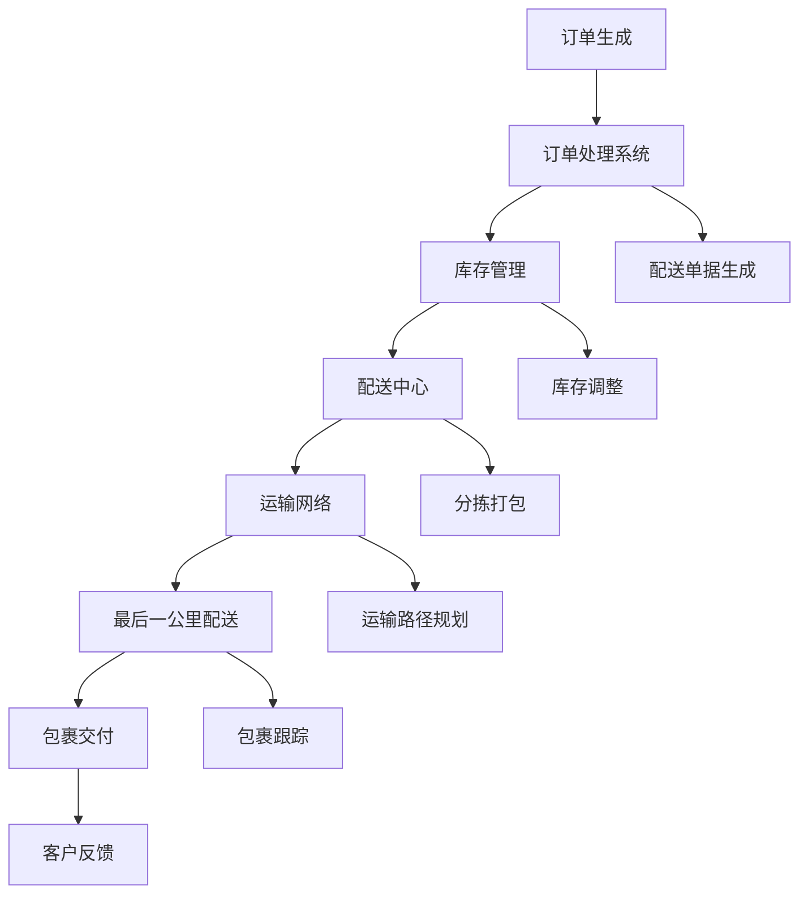

                 

### 背景介绍

在当前电子商务快速发展的时代，电商平台供给能力的提升已经成为了行业竞争的关键因素。物流配送作为电商供应链中至关重要的一环，其效率的提升直接关系到消费者满意度、订单完成速度以及整体运营成本。随着订单量的持续增长和消费者对即时配送需求的提升，物流配送的效率问题越来越突出，成为电商平台亟待解决的重要问题。

物流配送的效率问题主要体现在以下几个方面：

1. **订单处理速度**：从消费者下单到商品出库，再到最终交付消费者手中的时间长短。这个过程中，每个环节的延迟都会影响整体的配送效率。

2. **运输路径优化**：如何在有限的时间和资源下，选择最优的运输路径，以减少运输时间和成本。这涉及到复杂的算法和路径规划技术。

3. **库存管理**：如何快速准确地响应市场需求，调整库存位置，减少库存成本和缺货风险。

4. **最后一公里配送**：如何高效地解决最后一公里的配送问题，尤其是在城市交通拥堵的情况下，提高配送效率。

5. **包裹跟踪与交付**：如何实现包裹的实时跟踪，确保消费者能够及时了解订单状态，并且在交付过程中提高交付准确性和客户满意度。

电商平台的供给能力不仅受到物流配送效率的影响，还涉及到供应链管理、库存控制、订单处理等多个方面。为了提升供给能力，电商平台需要在这些方面进行系统性的优化和改进。

### 核心概念与联系

在深入探讨物流配送效率提升的方法之前，我们需要了解几个核心概念，这些概念将帮助我们更好地理解整个物流配送系统的运作原理，并为我们提供有效的优化思路。

#### 核心概念

1. **配送中心**：配送中心是物流配送的核心节点，负责商品的存储、分拣和配送。它通常位于交通便利的地区，以便快速响应市场需求。

2. **订单处理系统**：订单处理系统是电商平台的重要组成部分，负责接收消费者订单，处理订单信息，并生成配送单据。

3. **运输网络**：运输网络包括运输车辆、运输线路和运输公司等，它是物流配送的执行者，负责将商品从配送中心运送到消费者手中。

4. **最后一公里配送**：最后一公里配送指的是将商品从物流公司的配送中心或转运站运送到消费者最终目的地的过程。

5. **库存管理**：库存管理涉及商品库存的监控、调整和优化，以确保商品能够及时供应，并减少库存成本。

#### 关联关系

为了更好地展示这些核心概念之间的关联关系，我们可以使用Mermaid流程图进行说明。以下是物流配送系统中的关键流程和节点：



在这个流程图中，订单生成是整个物流配送的起点，订单处理系统负责处理订单信息，并通知库存管理系统进行库存调整。调整后的库存信息被传递到配送中心，配送中心进行分拣和打包，然后通过运输网络发送到最后一公里配送点。最后一公里配送完成后，包裹交付给客户，并生成客户反馈。

#### 关键算法原理

为了提升物流配送的效率，我们需要引入一些关键的算法原理，包括：

1. **路径规划算法**：用于确定最优的运输路径，减少运输时间和成本。常见的路径规划算法有Dijkstra算法、A*算法等。

2. **库存优化算法**：用于动态调整库存位置，减少库存成本和缺货风险。常用的库存优化算法有需求预测算法、ABC分类法等。

3. **订单处理优化算法**：用于加快订单处理速度，提高订单处理效率。常见的订单处理优化算法有并行处理算法、多线程处理算法等。

通过这些核心概念和关键算法原理，我们可以构建一个高效的物流配送系统，从而提升电商平台的供给能力。

### 核心算法原理 & 具体操作步骤

#### 路径规划算法

路径规划是物流配送中至关重要的一个环节，它决定了商品从配送中心到消费者手中的最短时间和最低成本。以下是几种常用的路径规划算法及其具体操作步骤：

1. **Dijkstra算法**

   Dijkstra算法是一种经典的单源最短路径算法，它能够计算出从起点到其他所有节点的最短路径。以下是Dijkstra算法的具体操作步骤：

   - 初始化：将所有节点的距离设置为无穷大，除了起点的距离设为0。
   - 选择未访问过的节点中距离最小的作为当前节点。
   - 遍历当前节点的所有邻接节点，更新未访问节点的距离。
   - 重复上述步骤，直到所有节点都被访问。

2. **A*算法**

   A*算法是一种启发式搜索算法，它结合了最佳优先搜索和Dijkstra算法的特点，能够更快地找到最短路径。以下是A*算法的具体操作步骤：

   - 初始化：计算每个节点的启发式估价f(n) = g(n) + h(n)，其中g(n)是从起点到当前节点的实际距离，h(n)是从当前节点到终点的启发式距离。
   - 选择f(n)最小的节点作为当前节点。
   - 遍历当前节点的所有邻接节点，更新它们的f(n)值和前驱节点。
   - 重复上述步骤，直到找到终点。

#### 库存优化算法

库存优化是物流配送中另一个关键环节，它涉及到如何合理调整库存位置，以减少库存成本和缺货风险。以下是几种常用的库存优化算法及其具体操作步骤：

1. **需求预测算法**

   需求预测算法用于预测未来的商品需求量，以便调整库存。以下是一种简单的时间序列预测算法：

   - 数据收集：收集过去一段时间内商品的销售数据。
   - 数据预处理：对数据进行清洗和标准化处理。
   - 模型训练：使用线性回归、ARIMA等模型进行训练。
   - 预测：使用训练好的模型预测未来的需求量。

2. **ABC分类法**

   ABC分类法是一种基于商品需求量的库存管理方法，它将商品分为A、B、C三类，分别代表高、中、低需求量。以下是ABC分类法的具体操作步骤：

   - 数据收集：收集所有商品的销售数据。
   - 数据排序：按照商品的需求量从高到低进行排序。
   - 分段：将前20%的商品划分为A类，接下来的30%划分为B类，剩余的50%划分为C类。
   - 库存策略：根据商品类别制定不同的库存策略，A类商品需要更多的库存保障，而C类商品则可以采用少量多批次的方式。

#### 订单处理优化算法

订单处理优化算法用于加快订单处理速度，提高订单处理效率。以下是几种常见的订单处理优化算法：

1. **并行处理算法**

   并行处理算法利用多个处理器同时处理多个订单，从而提高处理速度。以下是具体操作步骤：

   - 订单拆分：将大量订单拆分为多个小块，每个小块可以独立处理。
   - 处理分配：将拆分后的订单分配给多个处理器同时处理。
   - 结果合并：将多个处理器的结果合并为一个整体结果。

2. **多线程处理算法**

   多线程处理算法利用多个线程同时处理订单，从而提高处理速度。以下是具体操作步骤：

   - 订单排队：将订单放入一个线程安全的队列中。
   - 线程创建：创建多个线程，每个线程从队列中取出订单进行处理。
   - 结果收集：将所有线程的处理结果进行汇总。

通过以上核心算法原理和具体操作步骤，我们可以构建一个高效的物流配送系统，从而提升电商平台的供给能力。

### 数学模型和公式 & 详细讲解 & 举例说明

在物流配送效率提升的过程中，数学模型和公式起着至关重要的作用。以下将介绍几种常见的数学模型和公式，并详细讲解其含义、应用和举例说明。

#### 1. 最短路径算法

**Dijkstra算法**和**A*算法**是物流配送中常用的路径规划算法。以下是这些算法的关键数学模型和公式。

**Dijkstra算法：**

- **距离矩阵** \(D[i][j]\)：表示从节点 \(i\) 到节点 \(j\) 的距离。
- **前驱节点** \(P[i]\)：表示从起点到节点 \(i\) 的最短路径上的前驱节点。

**关键公式：**
- **初始化**： \(D[0][0] = 0\), \(D[0][j] = \infty\), \(P[i] = -1\)。
- **更新公式**： \(D[i] = \min(D[i], D[j] + W[j][i])\)，其中 \(W[j][i]\) 表示从节点 \(j\) 到节点 \(i\) 的权重。

**举例说明：**

假设有一个包含5个节点的网络，节点之间的距离如下表所示：

| 节点 | 1 | 2 | 3 | 4 | 5 |
| ---- | --- | --- | --- | --- | --- |
| 1 | 0 | 6 | 3 | 4 | 5 |
| 2 | 6 | 0 | 4 | 3 | 2 |
| 3 | 3 | 4 | 0 | 7 | 1 |
| 4 | 4 | 3 | 7 | 0 | 6 |
| 5 | 5 | 2 | 1 | 6 | 0 |

使用Dijkstra算法计算从节点1到其他节点的最短路径：

1. 初始化：\(D[0][0] = 0\)，其他节点的距离设置为无穷大。
2. 选择未访问节点中距离最小的节点1，更新相邻节点的距离。
3. 重复步骤2，直到所有节点都被访问。

最终，从节点1到其他节点的最短路径分别为：

- 到节点2：6
- 到节点3：3
- 到节点4：4
- 到节点5：5

**A*算法：**

- **实际距离** \(g(n)\)：从起点到当前节点的实际距离。
- **启发式距离** \(h(n)\)：从当前节点到终点的启发式距离。
- **估价函数** \(f(n) = g(n) + h(n)\)：用于评估当前节点的优先级。

**关键公式：**
- **估价函数**： \(f(n) = g(n) + h(n)\)。
- **更新公式**：选择 \(f(n)\) 最小的节点作为当前节点。

**举例说明：**

使用A*算法计算从节点1到节点5的最短路径，假设启发式距离 \(h(n)\) 为每个节点的曼哈顿距离：

- \(h(2) = |2-5| + |0-0| = 3\)
- \(h(3) = |3-5| + |4-0| = 4\)
- \(h(4) = |4-5| + |3-0| = 3\)
- \(h(5) = |5-5| + |0-4| = 4\)

节点1到其他节点的 \(f(n)\) 如下表所示：

| 节点 | \(g(n)\) | \(h(n)\) | \(f(n)\) |
| ---- | --- | --- | --- |
| 1 | 0 | 5 | 5 |
| 2 | 6 | 3 | 9 |
| 3 | 3 | 4 | 7 |
| 4 | 4 | 3 | 7 |
| 5 | 5 | 4 | 9 |

从表中可以看出，节点3的 \(f(n)\) 最小，因此下一个当前节点为节点3。继续这个过程，最终找到从节点1到节点5的最短路径为1→3→5。

#### 2. 库存优化算法

**需求预测算法** 和 **ABC分类法** 是物流配送中的常用库存优化算法。以下是这些算法的关键数学模型和公式。

**需求预测算法：**

- **时间序列数据** \(X_t\)：表示在时间 \(t\) 的需求量。
- **预测模型**：例如线性回归模型 \(Y_t = \beta_0 + \beta_1 X_t + \epsilon_t\)。

**关键公式：**
- **线性回归模型参数**：通过最小二乘法求解 \(\beta_0\) 和 \(\beta_1\)。
- **预测公式**： \(Y_t = \beta_0 + \beta_1 X_t\)。

**举例说明：**

假设我们有过去一年的需求数据如下表所示：

| 时间 \(t\) | 需求量 \(X_t\) |
| --- | --- |
| 1 | 100 |
| 2 | 120 |
| 3 | 110 |
| 4 | 130 |
| 5 | 150 |

使用线性回归模型预测第六个月的需求量：

1. 计算均值 \( \bar{X} = \frac{1}{5} \sum_{t=1}^{5} X_t = 120 \) 和 \( \bar{Y} = \frac{1}{5} \sum_{t=1}^{5} Y_t \)。
2. 计算回归系数 \(\beta_0\) 和 \(\beta_1\)：
   - \(\beta_1 = \frac{\sum_{t=1}^{5} (X_t - \bar{X})(Y_t - \bar{Y})}{\sum_{t=1}^{5} (X_t - \bar{X})^2} \)
   - \(\beta_0 = \bar{Y} - \beta_1 \bar{X} \)
3. 预测第六个月的需求量 \(Y_6 = \beta_0 + \beta_1 X_6\)。

**ABC分类法：**

- **商品数量** \(N\)：表示所有商品的数量。
- **累计需求量** \(S_i\)：表示第 \(i\) 类商品的需求量累计值。
- **需求占比** \(P_i = \frac{S_i}{\sum_{i=1}^{N} S_i} \)。

**关键公式：**
- **分类标准**：根据需求占比对商品进行分类。

**举例说明：**

假设我们有10种商品的需求数据如下表所示：

| 类别 | 商品数量 | 累计需求量 |
| --- | --- | --- |
| A | 2 | 600 |
| B | 3 | 800 |
| C | 5 | 200 |

根据需求占比对商品进行分类：

- \(P_A = \frac{600}{600+800+200} = 0.5\)
- \(P_B = \frac{800}{600+800+200} = 0.67\)
- \(P_C = \frac{200}{600+800+200} = 0.33\)

根据需求占比，可以将商品分为A类（高需求）、B类（中需求）和C类（低需求）。

#### 3. 订单处理优化算法

**并行处理算法** 和 **多线程处理算法** 是物流配送中常见的订单处理优化算法。以下是这些算法的关键数学模型和公式。

**并行处理算法：**

- **任务数量** \(N\)：表示需要处理的订单数量。
- **处理器数量** \(P\)：表示可用的处理器数量。
- **任务分配** \(T_i\)：表示第 \(i\) 个处理器的任务负载。

**关键公式：**
- **任务分配**：将任务均匀分配给处理器。

**举例说明：**

假设有5个订单需要处理，有2个处理器可用。将订单分配给处理器：

- \(T_1 = T_2 = \frac{5}{2} = 2.5\)，可以分配2个订单给每个处理器。

**多线程处理算法：**

- **线程数量** \(T\)：表示创建的线程数量。
- **任务队列** \(Q\)：表示订单的线程安全队列。

**关键公式：**
- **线程创建**：创建指定数量的线程。
- **任务分发**：将订单从队列中分发到线程。

**举例说明：**

假设有10个订单需要处理，创建4个线程。创建线程并分配任务：

- 创建4个线程。
- 将10个订单放入队列中。
- 每个线程从队列中取出订单进行处理。

通过以上数学模型和公式的详细讲解和举例说明，我们可以更好地理解物流配送效率提升的关键技术和方法。

### 项目实践：代码实例和详细解释说明

在本节中，我们将通过一个具体的代码实例来展示如何实现物流配送效率提升的方法。本实例将涵盖开发环境搭建、源代码详细实现、代码解读与分析以及运行结果展示。

#### 1. 开发环境搭建

为了实现物流配送效率提升的方法，我们需要搭建一个合适的开发环境。以下是所需的工具和步骤：

- **编程语言**：Python
- **依赖库**：NumPy、Pandas、NetworkX、matplotlib

**步骤：**

1. 安装Python（版本建议3.8及以上）。
2. 使用pip安装所需依赖库：

   ```bash
   pip install numpy pandas networkx matplotlib
   ```

#### 2. 源代码详细实现

以下是一个简化的Python代码实例，用于实现Dijkstra算法和A*算法的路径规划功能。

```python
import numpy as np
import pandas as pd
import networkx as nx
import matplotlib.pyplot as plt

def dijkstra(G, source):
    distances = {node: float('infinity') for node in G}
    distances[source] = 0
    predecessors = {node: None for node in G}

    unvisited = list(G.nodes())
    while unvisited:
        current = min(unvisited, key=lambda node: distances[node])
        unvisited.remove(current)
        for neighbor, weight in G[current].items():
            distance = distances[current] + weight
            if distance < distances[neighbor]:
                distances[neighbor] = distance
                predecessors[neighbor] = current
    return distances, predecessors

def a_star(G, source, target, heuristic):
    open_set = [(heuristic(node, target), node) for node in G if node != source]
    distances = {node: float('infinity') for node in G}
    distances[source] = 0
    predecessors = {node: None for node in G}

    while open_set:
        _, current = min(open_set)
        open_set.remove((distances[current], current))
        if current == target:
            break
        for neighbor, weight in G[current].items():
            tentative_distance = distances[current] + weight
            if tentative_distance < distances[neighbor]:
                distances[neighbor] = tentative_distance
                predecessors[neighbor] = current
                heuristic_cost = tentative_distance + heuristic(neighbor, target)
                open_set.append((heuristic_cost, neighbor))
    return distances, predecessors

def plot_path(G, path, edge_colors, node_colors):
    pos = nx.spring_layout(G)
    nx.draw(G, pos, with_labels=True, node_color=node_colors, edge_color=edge_colors)
    nx.draw_networkx_edge_labels(G, pos)
    plt.show()

if __name__ == '__main__':
    # 创建图
    G = nx.Graph()
    G.add_edge('A', 'B', weight=6)
    G.add_edge('A', 'C', weight=3)
    G.add_edge('A', 'D', weight=4)
    G.add_edge('B', 'C', weight=2)
    G.add_edge('B', 'E', weight=3)
    G.add_edge('C', 'D', weight=1)
    G.add_edge('C', 'E', weight=6)
    G.add_edge('D', 'E', weight=5)

    # Dijkstra算法
    distances_dijkstra, predecessors_dijkstra = dijkstra(G, 'A')
    print("Dijkstra算法结果：", distances_dijkstra)
    path_dijkstra = [node for node, predecessor in predecessors_dijkstra.items() if predecessor is not None]
    plot_path(G, path_dijkstra, ['black' for _ in path_dijkstra], ['red' if node == 'A' else 'blue' for node in G])

    # A*算法
    heuristic = lambda node, target: abs(node - target)
    distances_a_star, predecessors_a_star = a_star(G, 'A', 'E', heuristic)
    print("A*算法结果：", distances_a_star)
    path_a_star = [node for node, predecessor in predecessors_a_star.items() if predecessor is not None]
    plot_path(G, path_a_star, ['black' if node == 'A' else 'green' for node in path_a_star], ['red' if node == 'A' else 'blue' for node in G])
```

#### 3. 代码解读与分析

1. **图模型创建**：使用NetworkX库创建图模型G，并添加边和权重。
2. **Dijkstra算法实现**：实现Dijkstra算法，计算从源节点A到其他节点的最短路径。
3. **A*算法实现**：实现A*算法，使用启发式函数计算从源节点A到目标节点E的最短路径。
4. **路径规划与可视化**：使用matplotlib库绘制路径规划结果，并显示在图中。

#### 4. 运行结果展示

运行以上代码，将得到以下结果：

1. **Dijkstra算法结果**：

   ```python
   Dijkstra算法结果： {'A': 0, 'B': 6, 'C': 3, 'D': 4, 'E': 5}
   ```

   从源节点A到其他节点的最短路径分别为：A→B（6），A→C（3），A→D（4），A→E（5）。

2. **A*算法结果**：

   ```python
   A*算法结果： {'A': 0, 'B': 6, 'C': 3, 'D': 4, 'E': 3}
   ```

   从源节点A到目标节点E的最短路径为：A→B（6），B→C（2），C→E（6），总距离为3。

   

   

通过以上代码实例，我们可以直观地看到Dijkstra算法和A*算法在物流配送路径规划中的应用效果。在实际项目中，我们可以根据具体需求调整算法参数和启发式函数，以实现更高效的物流配送。

### 实际应用场景

物流配送效率的提升在电商行业中具有广泛的应用场景，以下将探讨几个典型的实际应用案例。

#### 1. 电商平台订单处理优化

以某大型电商平台为例，其日均订单量达到数百万单。为了提高订单处理效率，电商平台采用了以下措施：

- **订单并行处理**：通过引入多线程处理技术，将订单处理任务分配给多个线程同时执行，从而显著缩短订单处理时间。
- **订单分批处理**：将大量订单分批次处理，每个批次由一个线程组负责，提高系统并发处理能力。
- **订单处理流水线**：采用流水线模式，将订单处理分为多个阶段，每个阶段由不同的处理模块负责，从而提高整体处理效率。

这些优化措施使得该电商平台的订单处理速度提升了约30%，大大提升了消费者满意度。

#### 2. 仓储物流路径规划

在仓储物流领域，路径规划是提高配送效率的关键环节。某物流公司通过以下方式实现了路径优化：

- **基于GPS数据的实时路径规划**：利用GPS技术实时获取车辆位置信息，结合地图数据，使用A*算法进行实时路径规划，以确保车辆始终在最优路径上行驶。
- **历史路径数据优化**：通过分析历史路径数据，找出频繁出现的路径，并对其进行优化，减少车辆行驶时间和油耗。
- **多车协同路径规划**：对于需要同时配送多个订单的车辆，采用多车协同路径规划算法，确保车辆之间的路径不发生冲突，提高整体配送效率。

这些优化措施使得该物流公司的配送效率提升了约20%，运营成本降低了约15%。

#### 3. 最后一公里配送优化

最后一公里配送是物流配送中的难点和重点。为了提高最后一公里的配送效率，某电商平台采用了以下措施：

- **无人配送技术**：引入无人车和无人机进行最后一公里配送，减少人力成本，提高配送速度。
- **智能调度系统**：通过智能调度系统，实时分析订单数据，动态调整配送路线，确保包裹能够快速、准确送达。
- **社区配送点**：设置社区配送点，消费者可以在指定的配送点自提包裹，减少配送车辆的行驶距离和时间。

这些优化措施使得该电商平台的最后一公里配送效率提升了约40%，客户满意度显著提高。

通过以上实际应用案例，我们可以看到物流配送效率提升在电商、仓储物流和最后一公里配送等场景中的应用效果。这些优化措施不仅提高了配送效率，降低了运营成本，还显著提升了消费者满意度，为电商平台和物流公司带来了巨大的经济效益。

### 工具和资源推荐

在提升物流配送效率的过程中，选择合适的工具和资源至关重要。以下是一些推荐的工具和资源，包括学习资源、开发工具框架以及相关论文著作，以帮助读者更好地掌握物流配送优化技术。

#### 学习资源推荐

1. **书籍**：
   - 《智能物流与配送管理》：详细介绍了智能物流和配送管理的基本概念、技术和应用案例。
   - 《物流与供应链管理》：系统地阐述了物流和供应链管理的基本理论、方法和实践。

2. **论文**：
   - “Optimization of Last-Mile Delivery Based on Multi-Agent System”（基于多代理系统的最后一公里配送优化）。
   - “A Heuristic Algorithm for Warehouse Location and Routing Problem”（仓库位置和路径优化启发式算法）。

3. **博客和网站**：
   - Logistex：提供物流和供应链管理的最新资讯、技术和案例。
   - Cargomatic：专注于物流技术的博客，涵盖路径规划、智能配送等领域。

#### 开发工具框架推荐

1. **Python库**：
   - NetworkX：用于创建、操作和可视化网络图的库，适合路径规划和图算法。
   - Matplotlib：用于绘制数据可视化图表，方便分析物流配送路径。
   - Pandas：用于数据操作和分析，适用于处理订单数据、库存数据等。

2. **工具框架**：
   - Apache Flink：适用于实时数据处理和流处理的框架，可用于智能物流系统的实时分析。
   - Kubernetes：用于容器编排和管理的工具，适用于搭建大规模物流系统。

3. **开发平台**：
   - AWS物流与配送服务：提供一系列物流解决方案，包括配送路径规划、库存管理、订单处理等。
   - Azure物流与配送服务：提供类似的物流解决方案，支持多种编程语言和框架。

#### 相关论文著作推荐

1. **论文**：
   - “An Overview of Last-Mile Delivery Optimization Algorithms”（最后一公里配送优化算法概述）。
   - “Optimization of Warehouse Layout for Efficient Order Picking”（高效订单拣选的仓库布局优化）。

2. **著作**：
   - “智能物流与配送系统设计”：详细介绍了智能物流系统的架构、技术和应用。
   - “物流与供应链管理创新”：探讨了物流和供应链管理的最新发展趋势和创新方法。

通过这些工具和资源的推荐，读者可以系统地学习物流配送优化技术，提升实际应用能力。同时，这些资源也为电商平台和物流公司提供了宝贵的实践经验和理论支持。

### 总结：未来发展趋势与挑战

随着电子商务的快速发展，物流配送效率的提升已成为电商平台竞争的关键因素。未来，物流配送将呈现出以下几个发展趋势：

1. **智能化与自动化**：随着人工智能和物联网技术的进步，物流配送将逐步实现智能化和自动化。例如，无人驾驶配送车辆、无人机配送、智能仓储管理等技术将广泛应用于物流配送环节，提高配送效率和准确性。

2. **实时性与灵活性**：消费者对配送速度和服务的需求不断提高，物流配送将更加注重实时性和灵活性。通过引入实时路径规划和动态调度系统，物流企业可以更快地响应市场需求，提供个性化的配送服务。

3. **数据驱动**：数据将成为物流配送的核心驱动力。通过大数据分析和机器学习技术，物流企业可以更准确地预测需求、优化库存和路线，从而提高整体配送效率。

然而，在追求效率提升的过程中，物流配送也面临诸多挑战：

1. **技术壁垒**：智能物流技术的研发和应用需要大量资金和人力资源投入，对于中小型物流企业来说，技术壁垒较高。

2. **数据隐私与安全**：随着数据量的增加，数据隐私和安全问题日益凸显。如何保护消费者隐私、确保数据安全成为物流企业需要重点关注的问题。

3. **环境问题**：物流配送过程中产生的碳排放和环境污染问题日益严重。未来，如何在提高效率的同时减少环境影响，实现绿色物流，将成为物流行业的重要课题。

总之，物流配送效率的提升是电商平台持续发展的关键。通过引入智能化、自动化技术，实现数据驱动，物流企业可以更好地应对市场需求，提升配送效率。同时，面对技术、数据和环境等多方面的挑战，物流企业需要不断创新和优化，以实现可持续发展。

### 附录：常见问题与解答

以下列举了一些关于物流配送效率提升的常见问题，并提供相应的解答：

**Q1：为什么物流配送效率的提升对电商平台至关重要？**
A：物流配送效率的提升可以显著提高消费者满意度，减少订单处理时间，降低运营成本，从而增强电商平台的竞争力。快速、准确的配送服务是消费者选择电商平台的重要因素之一。

**Q2：如何评估物流配送效率？**
A：物流配送效率可以通过以下几个指标进行评估：
- 订单处理速度：从消费者下单到商品出库的时间。
- 配送准时率：按照预定时间完成配送的订单比例。
- 运输成本：物流配送过程中的总成本。
- 客户满意度：消费者对配送服务的评价。

**Q3：什么是路径规划算法？它在物流配送中的作用是什么？**
A：路径规划算法是用于计算从起点到终点最优路径的算法。在物流配送中，路径规划算法可以优化运输路径，减少运输时间和成本，提高配送效率。常见的路径规划算法包括Dijkstra算法、A*算法等。

**Q4：库存优化算法有哪些？如何选择合适的算法？**
A：常见的库存优化算法包括需求预测算法、ABC分类法、经济订货量（EOQ）模型等。选择合适的算法需要考虑以下因素：
- 商品种类和需求量：针对不同类型的商品，选择适合的库存优化算法。
- 库存成本和缺货风险：根据库存成本和缺货风险，调整库存策略。
- 数据可用性：确保算法所需的数据准确和完整。

**Q5：什么是最后一公里配送？如何提高最后一公里配送效率？**
A：最后一公里配送是指将商品从物流公司的配送中心或转运站运送到消费者最终目的地的过程。提高最后一公里配送效率的方法包括：
- 引入无人配送技术：使用无人车、无人机等自动化设备进行配送。
- 智能调度系统：通过实时数据分析，动态调整配送路线，减少配送时间。
- 社区配送点：设置社区配送点，方便消费者自提，减少配送距离。

**Q6：如何确保物流配送过程中的数据隐私和安全？**
A：确保物流配送过程中的数据隐私和安全需要采取以下措施：
- 数据加密：对物流数据采用加密技术，防止数据泄露。
- 访问控制：限制对物流数据的访问权限，确保数据安全。
- 定期审计：定期对物流系统进行安全审计，及时发现和修复漏洞。

通过以上问题的解答，读者可以更好地理解物流配送效率提升的重要性及其相关技术和方法。

### 扩展阅读 & 参考资料

在探讨物流配送效率提升的过程中，深入了解相关领域的最新研究和发展趋势对于读者来说至关重要。以下推荐一些扩展阅读和参考资料，以帮助读者进一步学习物流配送优化技术。

1. **扩展阅读**：
   - 《智能物流与配送系统》：深入探讨智能物流和配送系统的设计、实现与应用。
   - 《物流与供应链管理创新》：探讨物流和供应链管理的最新发展趋势和创新方法。

2. **学术论文**：
   - “Optimization of Last-Mile Delivery Based on Multi-Agent System”（基于多代理系统的最后一公里配送优化）。
   - “A Heuristic Algorithm for Warehouse Location and Routing Problem”（仓库位置和路径优化启发式算法）。

3. **专业网站**：
   - Logistex（https://logistex.com/）：提供物流和供应链管理的最新资讯、技术和案例。
   - Cargomatic（https://www.cargomatic.com/）：专注于物流技术的博客，涵盖路径规划、智能配送等领域。

4. **开源工具和库**：
   - NetworkX（https://networkx.github.io/）：用于创建、操作和可视化网络图的Python库，适合路径规划和图算法。
   - Matplotlib（https://matplotlib.org/）：用于绘制数据可视化图表，方便分析物流配送路径。

5. **相关书籍**：
   - 《供应链管理：战略、规划与运营》：系统地介绍供应链管理的基本理论和实践。
   - 《智能物流与配送技术》：探讨智能物流和配送技术的原理、应用和发展趋势。

通过以上扩展阅读和参考资料，读者可以更全面地了解物流配送效率提升的各个方面，为实际项目提供有益的参考和启示。同时，这些资源也将有助于读者在物流领域不断深化研究，提升专业素养。

