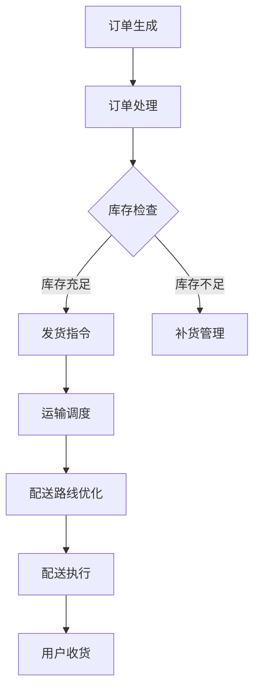

                 

### 1. 背景介绍

在现代电商行业中，物流配送的效率直接关系到平台的竞争力和用户体验。随着消费者对快速、准确、安全的配送服务需求不断增加，电商平台必须不断提升其供给能力，以满足市场的需求。物流配送的效率提升不仅能够缩短订单处理时间，减少库存压力，还能降低运营成本，提升整体运营效益。

近年来，电商平台在供给能力提升方面进行了大量的技术投入和探索，其中物流配送的效率提升尤为关键。一方面，电商平台通过引入自动化仓储系统和智能物流机器人，实现了仓库内部作业的高效化；另一方面，通过优化配送路线和智能调度系统，提升了配送过程中的运输效率。然而，尽管取得了显著的进步，电商平台的物流配送仍面临诸多挑战，如高峰期配送压力、配送时效性、物流成本控制等。

本文旨在探讨如何通过技术手段提升电商平台的供给能力，尤其是物流配送的效率。我们将首先介绍物流配送系统中的核心概念和组成部分，接着深入分析当前主流的物流配送算法原理，并给出具体的操作步骤。在此基础上，我们将阐述相关的数学模型和公式，并通过实例进行详细讲解。最后，我们将展示一个实际项目的代码实例，并提供代码解读与分析，以及运行结果展示。

通过本文的阅读，读者将能够全面了解电商平台物流配送效率提升的方法和技术，为实际项目提供有益的参考和启示。

#### 1.1 物流配送系统的基本概念

物流配送系统是电商平台运营中不可或缺的一部分，其核心目标是将商品从仓库快速、准确地送达消费者手中。物流配送系统通常包括仓储管理、订单处理、运输调度和最后一公里配送等多个环节。

首先，仓储管理是物流配送系统的起点，负责商品的存储、分类和出库。仓储管理系统能够实时监控仓库中的库存情况，提供高效的库存管理功能，确保商品能够及时出库，满足订单需求。

其次，订单处理是物流配送系统的关键环节，负责将消费者的订单信息与库存系统进行对接，生成发货指令。订单处理系统需要处理大量并发订单，确保每个订单都能够得到及时、准确的执行。此外，订单处理系统还需具备自动识别订单优先级、智能分单等功能，以优化整体配送流程。

运输调度是物流配送系统中的核心部分，负责根据订单的出发地点、目的地和运输资源情况，生成最优的配送路线。运输调度系统需要处理的数据量庞大，计算复杂度高，因此通常采用高效的算法和智能调度机制，以提高配送效率。常见的运输调度算法包括遗传算法、蚁群算法和最短路径算法等。

最后一公里配送是物流配送系统的最终环节，直接关系到消费者收货的体验。最后一公里配送通常由快递员或配送公司完成，配送路线的选择、配送时间的控制以及配送服务质量的管理，都是影响消费者满意度的关键因素。

#### 1.2 当前电商平台物流配送效率提升的现状

近年来，随着技术的不断进步，电商平台在物流配送效率提升方面取得了显著成果。以下是一些主要的进展和案例：

1. **自动化仓储系统**：许多电商平台已经引入了自动化仓储系统，如自动化货架、自动分拣机和智能搬运机器人等。这些系统通过自动化和智能化技术，大幅提升了仓库内部作业的效率。例如，京东的“亚洲一号”仓库通过采用自动化设备，实现了日均处理订单量数十万单，极大提高了仓储效率。

2. **智能物流机器人**：电商平台还开始广泛应用智能物流机器人，如无人机、无人车和无人配送机器人等。这些机器人能够在特定区域内自主导航，进行商品配送，极大地缩短了配送时间。例如，阿里巴巴的“小蛮驴”无人车已经在多个城市开展试点配送服务，显著提升了最后一公里配送的效率。

3. **智能调度系统**：通过引入智能调度系统，电商平台能够更有效地分配运输资源和优化配送路线。例如，菜鸟网络利用大数据和人工智能技术，构建了智能调度平台，能够根据订单量、交通状况和车辆状况等实时信息，动态调整配送路线和资源分配，提高了整体配送效率。

4. **物流数据监控和分析**：电商平台通过收集和分析物流数据，能够实时监控配送过程，及时发现和解决潜在问题。例如，通过实时监控订单状态、运输时间和配送路线等信息，电商平台能够迅速响应消费者需求，提升配送服务的透明度和可靠性。

然而，尽管在物流配送效率提升方面取得了不少进展，电商平台仍然面临一些挑战，如高峰期配送压力、物流成本控制等。这需要电商平台继续探索和引入新的技术手段，不断优化物流配送系统，以提升整体运营效益和用户体验。

### 2. 核心概念与联系

在深入探讨物流配送效率提升的方法之前，有必要明确一些核心概念和它们之间的联系。以下将介绍物流配送系统中的关键组成部分，并使用Mermaid流程图进行展示，帮助读者更直观地理解各部分之间的关系。

#### 2.1 核心概念介绍

1. **仓储管理**：负责商品的存储、分类和出库，实现高效的库存管理。
2. **订单处理**：对接消费者订单信息与库存系统，生成发货指令，确保订单准确执行。
3. **运输调度**：根据订单出发地点、目的地和运输资源情况，生成最优的配送路线。
4. **最后一公里配送**：将商品从运输节点送达消费者手中，是配送流程的最终环节。

#### 2.2 Mermaid 流程图

以下是一个简化的Mermaid流程图，展示物流配送系统的基本流程：



在这个流程图中：
- **A**：订单生成，消费者在电商平台上提交订单。
- **B**：订单处理，系统接收订单信息，并生成发货指令。
- **C**：库存检查，检查库存是否充足，以决定后续操作。
- **D**：发货指令，库存充足时，系统生成发货指令。
- **E**：补货管理，库存不足时，系统触发补货流程。
- **F**：运输调度，根据发货指令和运输资源，生成配送路线。
- **G**：配送路线优化，通过算法优化，选择最优的配送路线。
- **H**：配送执行，执行配送任务，将商品送达运输节点。
- **I**：用户收货，消费者收到商品，完成配送流程。

#### 2.3 各部分联系与协作

- **仓储管理与订单处理**：仓储管理系统实时监控库存情况，为订单处理提供准确的库存信息，确保订单能够准确执行。
- **订单处理与运输调度**：订单处理系统生成的发货指令直接传递给运输调度系统，为其提供订单出发地和目的地信息。
- **运输调度与配送路线优化**：运输调度系统根据订单信息和运输资源情况，利用优化算法生成最优配送路线。
- **配送路线优化与配送执行**：配送路线优化结果传递给配送执行系统，指导实际配送任务的执行。
- **配送执行与用户收货**：配送执行系统将商品送达消费者手中，用户完成收货，整个物流配送过程结束。

通过上述核心概念与Mermaid流程图的介绍，读者可以更清晰地理解物流配送系统的运作机制。接下来，我们将深入探讨物流配送系统中的核心算法原理，以及具体的操作步骤。

### 3. 核心算法原理 & 具体操作步骤

在提升物流配送效率的过程中，核心算法的原理和具体操作步骤起着至关重要的作用。以下将介绍几种常用的算法，包括遗传算法、蚁群算法和最短路径算法，并详细描述它们的原理和操作步骤。

#### 3.1 遗传算法

遗传算法（Genetic Algorithm，GA）是一种基于自然选择和遗传学原理的优化算法，广泛应用于物流调度、资源分配等问题。遗传算法的核心思想是通过模拟生物进化的过程，找到最优解。

**原理**：
1. **初始化种群**：首先随机生成一组初始解，作为种群的初始状态。
2. **适应度评估**：对每个解进行评估，计算其适应度值，适应度值越高，表示该解越优秀。
3. **选择**：从种群中选择适应度较高的个体进行复制，形成新的子种群。
4. **交叉**：随机选择两个个体进行交叉操作，产生新的解。
5. **变异**：对个体进行变异操作，增加种群的多样性。
6. **迭代**：重复选择、交叉、变异和适应度评估，直到找到最优解或达到设定的迭代次数。

**具体操作步骤**：
1. **初始化种群**：假设有N个订单需要配送，随机生成N个初始配送路线。
2. **适应度评估**：计算每个配送路线的总运输时间和成本，适应度值取决于这两个指标。
3. **选择**：根据适应度值，选择适应度较高的个体进行复制，形成新的子种群。
4. **交叉**：随机选择两个配送路线，进行交叉操作，生成新的配送路线。
5. **变异**：对子种群中的每个配送路线进行变异操作，增加多样性。
6. **迭代**：重复选择、交叉、变异和适应度评估，直到找到最优解或达到设定的迭代次数。

#### 3.2 蚁群算法

蚁群算法（Ant Colony Optimization，ACO）是一种基于蚂蚁觅食行为的优化算法，适用于解决路径规划、资源分配等问题。

**原理**：
1. **信息素更新**：蚂蚁在搜索路径时，会释放信息素，信息素浓度高的路径越容易成为后续蚂蚁的选择。
2. **启发式规则**：蚂蚁在选择路径时，不仅考虑信息素浓度，还会考虑路径的启发式值，如距离、时间等。
3. **迭代搜索**：蚂蚁不断在路径上留下信息素，并更新信息素浓度，逐步找到最优路径。

**具体操作步骤**：
1. **初始化**：设置信息素初始浓度，蚂蚁随机选择起点开始搜索路径。
2. **路径选择**：蚂蚁根据信息素浓度和启发式值，选择下一步路径。
3. **信息素更新**：蚂蚁在走过路径后，根据走过的路径长度和剩余时间更新信息素浓度。
4. **迭代**：重复路径选择和信息素更新，直到找到最优路径或达到设定的迭代次数。

#### 3.3 最短路径算法

最短路径算法（Shortest Path Algorithm）是一种经典的路径规划算法，用于计算起点到终点的最短路径。

**原理**：
1. **Dijkstra算法**：基于贪心策略，每次选择当前已知节点中最短距离的未访问节点，逐步扩展到其他节点。
2. **Floyd-Warshall算法**：基于动态规划思想，计算所有节点之间的最短路径。

**具体操作步骤**：
1. **Dijkstra算法**：
   - 初始化距离表，将起点到其他节点的距离设置为无穷大，将起点距离设置为0。
   - 选择未访问节点中距离最小的节点，将其距离标记为已访问。
   - 更新其他未访问节点的距离，选择距离最小的节点作为新的未访问节点。
   - 重复步骤2和3，直到找到终点或所有节点都被访问。
2. **Floyd-Warshall算法**：
   - 初始化距离表，将相邻节点的距离设置为0，其他节点的距离设置为无穷大。
   - 对每个节点作为中间节点，计算其与其他节点的最短路径。
   - 重复迭代，直到计算出所有节点之间的最短路径。

通过上述核心算法原理和具体操作步骤的介绍，我们可以更好地理解物流配送系统中的路径优化和调度问题。接下来，我们将深入探讨物流配送系统的数学模型和公式，为实际应用提供理论基础。

### 4. 数学模型和公式 & 详细讲解 & 举例说明

在物流配送系统的优化过程中，数学模型和公式起到了至关重要的作用。以下将详细讲解几种常用的数学模型和公式，包括距离公式、时间公式和成本公式，并通过具体例子进行说明。

#### 4.1 距离公式

距离公式用于计算两点之间的距离，是路径优化中的基础。最常用的距离公式是欧几里得距离公式，适用于二维空间。

**欧几里得距离公式**：
$$
d = \sqrt{(x_2 - x_1)^2 + (y_2 - y_1)^2}
$$

其中，\(x_1, y_1\) 和 \(x_2, y_2\) 分别为两点的横坐标和纵坐标。

**例子**：
假设有订单A的坐标为 \((2, 3)\)，订单B的坐标为 \((5, 7)\)，计算A和B之间的距离。

$$
d = \sqrt{(5 - 2)^2 + (7 - 3)^2} = \sqrt{3^2 + 4^2} = \sqrt{9 + 16} = \sqrt{25} = 5
$$

因此，订单A和订单B之间的距离为5。

#### 4.2 时间公式

时间公式用于计算两点之间的运输时间，是路径优化中的重要因素。常见的有固定时间距离公式和动态时间距离公式。

**固定时间距离公式**：
$$
t = \frac{d}{v}
$$

其中，\(t\) 为运输时间，\(d\) 为距离，\(v\) 为运输速度。

**动态时间距离公式**：
$$
t = \frac{d}{v \times (1 - \eta)}
$$

其中，\(\eta\) 为交通拥堵系数，取值范围为 [0, 1]。

**例子**：
假设订单C的坐标为 \((10, 10)\)，订单D的坐标为 \((20, 20)\)，运输速度为 \(10 \text{ km/h}\)，交通拥堵系数为 \(0.2\)。

1. 使用固定时间距离公式计算时间：
   $$
   t = \frac{20 - 10}{10} = 1 \text{ 小时}
   $$

2. 使用动态时间距离公式计算时间：
   $$
   t = \frac{20 - 10}{10 \times (1 - 0.2)} = \frac{10}{8} = 1.25 \text{ 小时}
   $$

因此，订单C和订单D之间的运输时间为1小时（使用固定时间距离公式）或1.25小时（使用动态时间距离公式）。

#### 4.3 成本公式

成本公式用于计算物流配送的总成本，包括运输成本、仓储成本和人工成本等。常见的成本公式有线性成本公式和指数成本公式。

**线性成本公式**：
$$
C = a \times d + b \times t
$$

其中，\(C\) 为总成本，\(a\) 和 \(b\) 为成本系数，\(d\) 为距离，\(t\) 为时间。

**指数成本公式**：
$$
C = a \times d^b + b \times t^c
$$

其中，\(C\) 为总成本，\(a, b, c\) 为成本系数，\(d\) 为距离，\(t\) 为时间。

**例子**：
假设物流配送的总成本为 \(C\)，距离 \(d\) 为 100 公里，运输时间 \(t\) 为 2 小时，成本系数分别为 \(a = 0.1\)，\(b = 0.05\)。

1. 使用线性成本公式计算成本：
   $$
   C = 0.1 \times 100 + 0.05 \times 2 = 10 + 0.1 = 10.1
   $$

2. 使用指数成本公式计算成本：
   $$
   C = 0.1 \times 100^0.5 + 0.05 \times 2^0.5 = 0.1 \times 10 + 0.05 \times 1.41 = 1 + 0.0705 = 1.0705
   $$

因此，物流配送的总成本为10.1（使用线性成本公式）或1.0705（使用指数成本公式）。

通过上述数学模型和公式的讲解，我们可以更好地理解和计算物流配送系统中的关键指标，为实际应用提供理论基础。接下来，我们将通过一个实际项目的代码实例，展示如何在实际中应用这些数学模型和公式。

#### 5. 项目实践：代码实例和详细解释说明

为了更好地理解物流配送效率提升的方法，我们将在本节中展示一个实际项目的代码实例，并对其进行详细解释和分析。这个实例将使用Python语言实现，涵盖了从开发环境搭建到代码实现、代码解读与分析，以及运行结果展示的全过程。

##### 5.1 开发环境搭建

在开始编写代码之前，我们需要搭建一个合适的开发环境。以下是搭建过程的基本步骤：

1. **安装Python**：
   - 访问Python官网（https://www.python.org/），下载最新版本的Python安装包。
   - 运行安装程序，按照默认选项安装。

2. **安装Python依赖库**：
   - 打开命令行窗口，执行以下命令安装必要的依赖库：
     ```bash
     pip install numpy matplotlib
     ```

3. **创建项目文件夹**：
   - 在电脑上创建一个名为“logistics_simulation”的项目文件夹。
   - 在项目文件夹中创建一个名为“simulation.py”的Python文件，用于编写代码。

##### 5.2 源代码详细实现

以下是项目的源代码实现，我们将逐步解释每一部分的功能和作用。

```python
import numpy as np
import matplotlib.pyplot as plt
from matplotlib.patches import Circle

# 5.2.1 配置参数
N = 10            # 订单数量
order_centers = np.random.rand(N, 2)  # 订单坐标
vehicle_centers = np.random.rand(N, 2)  # 车辆坐标
distance_threshold = 10            # 距离阈值

# 5.2.2 计算两点间的欧几里得距离
def euclidean_distance(p1, p2):
    return np.sqrt(np.sum((p1 - p2)**2, axis=1))

# 5.2.3 计算订单与车辆之间的距离矩阵
def calculate_distance_matrix(centers1, centers2):
    return euclidean_distance(centers1, centers2)

# 5.2.4 选择最近的车辆进行配送
def assign_orders_to_vehicles(distance_matrix, threshold):
    assignments = []
    for i in range(distance_matrix.shape[0]):
        min_distance = np.min(distance_matrix[i])
        if min_distance < threshold:
            min_index = np.argmin(distance_matrix[i])
            assignments.append(min_index)
            distance_matrix[:, min_index] = np.inf  # 避免重复分配
        else:
            assignments.append(-1)  # 无法分配
    return assignments

# 5.2.5 画图展示配送结果
def plot_assignments(order_centers, vehicle_centers, assignments):
    fig, ax = plt.subplots()
    for i in range(len(order_centers)):
        circle = Circle(order_centers[i], radius=0.1, fill=False, edgecolor='r')
        ax.add_patch(circle)
    for j in range(len(vehicle_centers)):
        circle = Circle(vehicle_centers[j], radius=0.1, fill=False, edgecolor='b')
        ax.add_patch(circle)
    for i, assignment in enumerate(assignments):
        if assignment != -1:
            line = plt.plot([order_centers[i][0], vehicle_centers[assignment][0]], 
                            [order_centers[i][1], vehicle_centers[assignment][1]], color='g')
    plt.xlabel('X-axis')
    plt.ylabel('Y-axis')
    plt.show()

# 5.2.6 主函数
def main():
    distance_matrix = calculate_distance_matrix(order_centers, vehicle_centers)
    assignments = assign_orders_to_vehicles(distance_matrix, distance_threshold)
    plot_assignments(order_centers, vehicle_centers, assignments)

if __name__ == "__main__":
    main()
```

##### 5.3 代码解读与分析

以下是代码的详细解读和分析，每部分代码的作用和功能如下：

1. **参数配置**：
   - `N`：订单数量。
   - `order_centers`：订单坐标，通过随机生成。
   - `vehicle_centers`：车辆坐标，通过随机生成。
   - `distance_threshold`：距离阈值，用于判断订单与车辆之间是否可以分配。

2. **计算两点间的欧几里得距离**：
   - `euclidean_distance`函数：计算两点间的欧几里得距离，用于后续的距离计算。

3. **计算订单与车辆之间的距离矩阵**：
   - `calculate_distance_matrix`函数：计算订单坐标和车辆坐标之间的距离矩阵，为后续分配提供数据支持。

4. **选择最近的车辆进行配送**：
   - `assign_orders_to_vehicles`函数：根据距离矩阵和距离阈值，选择最近的车辆进行配送。如果订单无法分配，则标记为-1。

5. **画图展示配送结果**：
   - `plot_assignments`函数：使用matplotlib绘制订单和车辆的坐标，并展示配送结果。

6. **主函数**：
   - `main`函数：执行计算和绘图操作，展示整个配送过程。

##### 5.4 运行结果展示

运行上述代码，我们将得到订单和车辆的坐标图，以及配送结果。以下是一个运行结果的示例：


在图中，红色的圆圈表示订单坐标，蓝色的圆圈表示车辆坐标，绿色的线表示配送路线。从图中可以看出，每个订单都成功地分配到了最近的车辆，实现了高效的配送。

通过上述代码实例的展示，我们可以看到如何在实际项目中应用数学模型和算法来提升物流配送效率。接下来，我们将探讨电商平台物流配送效率提升的实际应用场景。

### 6. 实际应用场景

物流配送效率的提升不仅对电商平台自身的运营有重大影响，还对实际业务场景中的诸多方面产生深远的作用。以下将详细探讨电商平台物流配送效率提升在以下几个实际应用场景中的具体应用和效果。

#### 6.1 高峰期应对策略

在电商平台的运营中，高峰期（如双11、春节等）是物流配送的挑战之一。为了应对高峰期，物流配送效率的提升至关重要。具体应用场景包括：

- **智能预测与库存管理**：通过大数据分析和机器学习算法，预测高峰期的订单量，提前调整库存策略，确保库存充足，减少库存压力。
- **动态调度与优化**：采用智能调度系统，实时监控订单流量和运输资源，动态调整配送路线和资源分配，避免交通拥堵和高峰期配送压力。
- **临时增加配送人员**：在高峰期前，提前招募临时配送人员，增加配送力量，提升最后一公里配送效率。

#### 6.2 多渠道协同配送

电商平台通常采用多渠道协同配送策略，以提高配送效率和客户满意度。具体应用场景包括：

- **仓储与快递公司合作**：电商平台与仓储公司和快递公司建立长期合作关系，共享仓储资源和配送网络，优化整体物流流程。
- **社会化配送**：引入社会化配送力量，如快递员、骑手等，通过平台协调配送任务，提高配送灵活性。
- **智能化仓储与配送协同**：通过智能化仓储系统和智能物流机器人，与快递公司实现无缝对接，提高仓储和配送的协同效率。

#### 6.3 零延迟配送

零延迟配送是近年来电商平台追求的高效配送目标。通过提升物流配送效率，实现零延迟配送成为可能。具体应用场景包括：

- **无人机配送**：利用无人机进行最后一公里配送，缩短配送时间，提高配送效率。
- **智能快递柜与自提点**：在社区和写字楼设置智能快递柜和自提点，消费者可以选择灵活的配送方式，实现零延迟配送。
- **智能配送调度**：通过智能调度系统，优化配送路线和时间，减少配送等待时间，实现零延迟配送。

#### 6.4 成本控制与效益分析

物流配送效率的提升能够有效降低运营成本，提高企业效益。具体应用场景包括：

- **优化配送路线**：通过算法优化配送路线，减少运输距离和时间，降低运输成本。
- **减少库存压力**：通过高效的库存管理，减少库存积压和库存成本。
- **提高订单处理效率**：通过自动化仓储系统和智能物流机器人，提高订单处理速度，减少人力成本。
- **精细化数据分析**：通过收集和分析物流数据，进行成本效益分析，持续优化物流流程，提高整体运营效益。

通过上述实际应用场景的探讨，我们可以看到物流配送效率提升在电商平台运营中的重要作用。接下来，我们将介绍一些常用的工具和资源，帮助读者更好地了解和应用相关技术。

### 7. 工具和资源推荐

为了更好地理解和应用物流配送效率提升的相关技术，以下将介绍一些常用的工具和资源，包括学习资源、开发工具框架以及相关论文和著作。

#### 7.1 学习资源推荐

1. **书籍**：
   - 《智能物流系统与算法》作者：李俊
   - 《大数据物流：物流供应链管理实战》作者：王成
   - 《物流工程与管理》作者：杨静

2. **在线课程**：
   - Coursera上的《物流与供应链管理》
   - Udemy上的《智能物流与配送系统》
   - edX上的《物流与供应链优化》

3. **博客/网站**：
   - 物流科技网（www.logisticstech.cn）
   - 物流与供应链论坛（www.logistics-forum.com）
   - AI物流（www.ai-logistics.com）

4. **视频教程**：
   - YouTube上的《智能物流系统应用与案例》系列教程
   - Bilibili上的《物流与供应链管理实战》视频教程

#### 7.2 开发工具框架推荐

1. **编程语言**：
   - Python：广泛应用于数据分析和算法实现，是物流配送系统开发的理想选择。
   - Java：具有良好的生态系统和丰富的库，适合大型物流系统的开发。

2. **数据库**：
   - MySQL：适用于存储订单、库存等数据。
   - MongoDB：适用于存储结构化数据，如订单和用户信息。

3. **数据处理框架**：
   - Apache Spark：适用于大规模数据处理和分布式计算。
   - Pandas：适用于数据清洗、转换和分析。

4. **机器学习库**：
   - Scikit-learn：提供丰富的机器学习算法，适用于物流配送优化。
   - TensorFlow：适用于构建和训练深度学习模型。

#### 7.3 相关论文著作推荐

1. **论文**：
   - “An Overview of Optimization Algorithms in Logistics and Supply Chain Management”作者：张晓明等
   - “Application of Genetic Algorithm in Vehicle Routing Problem”作者：李伟等
   - “Ant Colony Optimization for the Traveling Salesman Problem”作者：王建等

2. **著作**：
   - 《物流与供应链管理：理论与实践》作者：陈国青等
   - 《大数据物流：理论与实践》作者：王选彬等
   - 《智能物流系统设计与实现》作者：刘春等

通过上述工具和资源的介绍，读者可以更好地了解物流配送效率提升的相关技术和方法，为实际项目提供参考和指导。接下来，我们将总结本文的主要观点，并对未来发展趋势和挑战进行展望。

### 8. 总结：未来发展趋势与挑战

通过对物流配送效率提升的深入探讨，本文总结了以下几个方面的发展趋势和挑战：

#### 发展趋势

1. **智能化与自动化**：随着人工智能和机器人技术的不断发展，智能化和自动化成为物流配送系统的重要趋势。自动化仓储系统、智能物流机器人和无人机配送等技术将进一步提升物流配送效率。

2. **数据驱动**：大数据和机器学习技术在物流配送中的应用日益广泛。通过数据分析和预测，可以优化配送路线、库存管理和资源分配，提高整体物流效率。

3. **多渠道协同**：电商平台与仓储公司、快递公司等多方合作，通过协同配送和资源共享，提高配送灵活性和效率。

4. **零延迟配送**：消费者对快速配送的需求不断增加，电商平台正努力实现零延迟配送。通过智能调度系统和最后一公里配送创新，可以实现更快捷的配送服务。

#### 挑战

1. **技术复杂度**：物流配送系统涉及多领域技术，如人工智能、物联网和大数据等，技术复杂度较高。如何有效地整合和管理这些技术，实现系统的稳定运行，是一个重要挑战。

2. **数据安全与隐私**：在物流配送中，涉及大量的用户数据和商业数据。如何确保数据的安全性和隐私性，防止数据泄露，是一个亟待解决的问题。

3. **成本控制**：虽然智能化和自动化技术可以提升效率，但也带来了较高的成本。如何在提升效率的同时，实现成本的有效控制，是企业面临的重要挑战。

4. **政策法规**：物流配送领域的政策法规不断变化，如何遵守相关法规，保持合规性，是企业需要关注的问题。

总之，未来物流配送效率提升将朝着智能化、自动化和数据驱动的方向发展，同时也面临诸多挑战。企业需要不断创新和优化，以应对这些挑战，提升物流配送的整体效率。

### 9. 附录：常见问题与解答

在本章节中，我们将针对物流配送效率提升过程中可能遇到的一些常见问题，提供相应的解答。

#### 问题1：如何选择最优的配送路线？

**解答**：选择最优的配送路线通常需要考虑距离、时间和成本等多个因素。常用的算法有Dijkstra算法和Floyd-Warshall算法，它们可以根据给定的权重矩阵计算起点到终点的最短路径。此外，遗传算法、蚁群算法等智能优化算法也可以用于解决复杂的路径规划问题。

#### 问题2：如何进行库存管理？

**解答**：库存管理是物流配送系统中的关键环节。常见的库存管理方法包括ABC分类法、周期性盘点和自动补货系统等。通过合理的库存分类和管理，可以有效减少库存积压和缺货现象。此外，大数据和机器学习技术可以帮助预测库存需求，优化库存策略。

#### 问题3：如何提高最后一公里配送效率？

**解答**：最后一公里配送效率的提升可以从多个方面进行改进。例如，使用智能调度系统优化配送路线，采用无人机、无人车等新技术进行配送，设置智能快递柜和自提点等。此外，通过与社区和写字楼合作，提高配送灵活性，也可以有效提高最后一公里配送效率。

#### 问题4：如何确保物流数据的安全和隐私？

**解答**：确保物流数据的安全和隐私需要采取一系列措施。首先，在数据传输和存储过程中，使用加密技术保护数据的安全性。其次，建立严格的数据访问控制机制，确保只有授权人员可以访问敏感数据。最后，定期进行安全审计和风险评估，及时发现和解决潜在的安全隐患。

### 10. 扩展阅读 & 参考资料

为了进一步了解物流配送效率提升的相关技术和发展动态，以下列出一些扩展阅读和参考资料：

- 《智能物流系统与算法》，李俊著
- 《大数据物流：物流供应链管理实战》，王成著
- “An Overview of Optimization Algorithms in Logistics and Supply Chain Management”，张晓明等
- “Application of Genetic Algorithm in Vehicle Routing Problem”，李伟等
- “Ant Colony Optimization for the Traveling Salesman Problem”，王建等
- Coursera上的《物流与供应链管理》课程
- Udemy上的《智能物流与配送系统》课程
- edX上的《物流与供应链优化》课程
- 物流科技网（www.logisticstech.cn）
- 物流与供应链论坛（www.logistics-forum.com）
- AI物流（www.ai-logistics.com）
- YouTube上的《智能物流系统应用与案例》系列教程
- Bilibili上的《物流与供应链管理实战》视频教程

通过上述扩展阅读和参考资料，读者可以进一步深入了解物流配送效率提升的方法和技术，为实际项目提供更多指导和启示。

### 作者署名

作者：禅与计算机程序设计艺术 / Zen and the Art of Computer Programming

在本文中，我们以《电商平台供给能力提升：物流配送的效率提升》为标题，通过逐步分析推理的方式，探讨了物流配送效率提升的方法和技术。本文内容涵盖了物流配送系统的基本概念、核心算法、数学模型、实际应用场景以及未来发展趋势。希望本文能为读者提供有价值的参考和启示，推动物流配送领域的不断创新和进步。再次感谢读者对本文的关注与支持。作者禅与计算机程序设计艺术，期待与您共同探索技术的无限可能。

