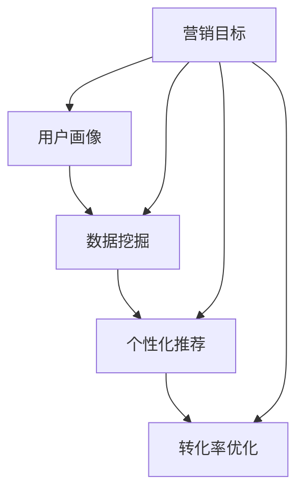

                 

### 1. 背景介绍

在当前电子商务飞速发展的时代，电商平台供给能力的提升已成为各大电商企业竞争的关键因素。供给能力不仅关系到用户体验，也直接影响到平台的市场份额和盈利能力。随着消费者需求的多样化和个性化，传统单一的供给策略已难以满足市场需求，因此，精准营销策略的重要性愈发凸显。

精准营销是一种基于数据分析，通过精确识别用户需求和行为，从而实现个性化推荐和有效触达目标客户的方法。它的核心在于通过用户数据的深度挖掘，优化营销活动的针对性和效果，从而提升用户的购买转化率和满意度。随着人工智能和大数据技术的发展，精准营销策略在电商领域得到了广泛应用。

本文将围绕电商平台的供给能力提升展开讨论，重点探讨精准营销策略的原理、应用和实践，以期为电商企业提供实用的指导。我们将通过以下几个方面的内容来展开：

1. **精准营销策略的核心概念与联系**：介绍精准营销的关键概念，并绘制相关的Mermaid流程图，帮助读者理解其工作原理。
2. **核心算法原理与具体操作步骤**：详细解析电商精准营销所依赖的主要算法，包括用户行为分析、商品推荐算法等，并提供具体的操作步骤。
3. **数学模型与公式**：介绍支持精准营销的数学模型，包括概率模型、决策树等，并提供详细讲解和实例说明。
4. **项目实践**：通过一个实际项目，展示如何搭建精准营销环境，实现代码实例的详细解读和分析。
5. **实际应用场景**：探讨精准营销在不同电商业务场景中的应用，如新品推广、用户留存等。
6. **工具和资源推荐**：推荐用于学习精准营销的相关资源，包括书籍、工具和框架。
7. **总结**：总结精准营销的发展趋势和面临的挑战，为电商企业的发展提供方向。

通过以上内容，我们旨在为电商企业提供一套系统、实用、可操作的精准营销策略，以提升供给能力和市场竞争力。

### 2. 核心概念与联系

在深入探讨精准营销策略之前，我们需要了解其核心概念和组成部分。精准营销策略的核心概念主要包括用户画像、数据挖掘、个性化推荐、转化率优化等。这些概念相互联系，共同构建了一个完整的数据驱动的营销体系。

#### 2.1 用户画像

用户画像是指对目标用户进行全面描述的过程，包括用户的年龄、性别、地理位置、兴趣爱好、购买行为等多个维度。通过构建用户画像，我们可以更好地理解用户需求，从而实现更精准的营销。

用户画像的构建过程通常包括以下步骤：

1. **数据收集**：通过用户注册信息、浏览记录、购买行为等途径收集用户数据。
2. **数据处理**：对收集到的数据进行清洗、整合和转换，形成统一的用户数据集。
3. **特征提取**：从用户数据中提取出关键特征，如用户年龄段、消费偏好等。
4. **模型构建**：利用机器学习算法，如聚类算法、决策树等，对用户特征进行建模，生成用户画像。

#### 2.2 数据挖掘

数据挖掘是精准营销策略的核心环节，它通过从海量数据中挖掘出有价值的信息和规律，为营销决策提供支持。数据挖掘主要包括以下几种方法：

1. **关联规则挖掘**：通过挖掘用户行为数据中的关联关系，发现用户之间的共同兴趣和购买习惯。
2. **分类与回归分析**：通过分类算法（如决策树、随机森林）和回归算法（如线性回归、逻辑回归）对用户行为进行预测。
3. **聚类分析**：通过聚类算法（如K-means、DBSCAN）将用户划分为不同的群体，为个性化推荐提供基础。

#### 2.3 个性化推荐

个性化推荐是精准营销策略的重要手段，它通过根据用户的兴趣和行为，为其推荐个性化的商品或服务。个性化推荐系统通常包括以下步骤：

1. **内容表示**：将用户和商品转换为向量表示，以便进行相似度计算。
2. **相似度计算**：计算用户和商品之间的相似度，如余弦相似度、皮尔逊相关系数等。
3. **推荐生成**：根据用户和商品的相似度，生成推荐列表，并排序显示。

#### 2.4 转化率优化

转化率优化是指通过优化营销活动的各个环节，提高用户的购买转化率。转化率优化的主要方法包括：

1. **A/B测试**：通过对比不同营销策略的效果，找到最优的营销组合。
2. **转化路径分析**：通过分析用户的购买路径，发现影响转化的关键因素，并进行优化。
3. **用户体验优化**：通过改进页面设计、提高加载速度、优化购物流程等，提升用户的购物体验。

为了更好地理解这些核心概念之间的联系，我们可以使用Mermaid流程图进行可视化展示：



在上面的流程图中，用户画像作为精准营销策略的起点，通过数据挖掘得到用户的行为特征，进而生成个性化推荐，最终通过转化率优化实现营销目标。各个环节相互关联，共同构成了一个完整的精准营销体系。

### 3. 核心算法原理 & 具体操作步骤

在精准营销策略中，核心算法的作用至关重要。这些算法通过数据分析和模型构建，帮助电商企业更好地理解用户需求，实现个性化的推荐和优化。以下是几种在电商精准营销中常用的核心算法及其具体操作步骤。

#### 3.1 用户行为分析算法

用户行为分析算法主要通过分析用户的浏览、点击、购买等行为，挖掘用户的兴趣和需求。以下是用户行为分析算法的具体操作步骤：

1. **数据收集**：收集用户在电商平台的浏览、点击、购买等行为数据。
2. **数据预处理**：对收集到的数据进行清洗、去重和规范化处理，确保数据的质量。
3. **特征提取**：从行为数据中提取出关键特征，如用户浏览频次、点击率、购买率等。
4. **行为建模**：利用机器学习算法（如K-means、决策树等）对用户行为进行建模，生成用户行为特征向量。
5. **行为预测**：根据用户行为特征向量，预测用户未来的行为倾向和需求。

#### 3.2 商品推荐算法

商品推荐算法是精准营销策略的核心，它通过分析用户的行为数据，为用户推荐个性化的商品。以下是商品推荐算法的具体操作步骤：

1. **数据收集**：收集用户的浏览、点击、购买等行为数据，以及商品的属性数据（如品类、品牌、价格等）。
2. **数据预处理**：对收集到的数据进行清洗、去重和规范化处理。
3. **特征提取**：从用户行为数据和商品属性数据中提取出关键特征。
4. **相似度计算**：计算用户和商品之间的相似度，如余弦相似度、皮尔逊相关系数等。
5. **推荐生成**：根据用户和商品的相似度，生成推荐列表，并排序显示。

常用的商品推荐算法包括基于内容的推荐算法、协同过滤算法和混合推荐算法等。以下是这些算法的具体操作步骤：

- **基于内容的推荐算法**：
  1. **内容表示**：将用户和商品转换为向量表示。
  2. **相似度计算**：计算用户和商品之间的内容相似度。
  3. **推荐生成**：根据用户和商品的内容相似度，生成推荐列表。

- **协同过滤算法**：
  1. **用户相似度计算**：计算用户之间的相似度。
  2. **商品相似度计算**：计算商品之间的相似度。
  3. **推荐生成**：根据用户和商品的相似度，生成推荐列表。

- **混合推荐算法**：
  1. **内容表示和协同过滤结合**：结合用户和商品的内容表示和协同过滤算法，生成综合推荐列表。

#### 3.3 转化率优化算法

转化率优化算法主要通过分析用户的行为数据和转化路径，优化营销活动的各个环节，提高用户的购买转化率。以下是转化率优化算法的具体操作步骤：

1. **数据收集**：收集用户在电商平台的行为数据和转化数据（如浏览、点击、购买等）。
2. **转化路径分析**：分析用户的购买路径，识别影响转化的关键因素。
3. **A/B测试**：设计不同的营销策略，通过A/B测试比较效果，找到最优策略。
4. **用户体验优化**：根据A/B测试结果，优化页面设计、加载速度、购物流程等，提升用户体验。

#### 3.4 市场细分算法

市场细分算法通过将市场划分为不同的群体，为每个群体提供个性化的营销策略。以下是市场细分算法的具体操作步骤：

1. **数据收集**：收集用户的人口统计学数据、行为数据等。
2. **特征提取**：提取出关键特征，如用户年龄、收入、兴趣爱好等。
3. **聚类分析**：利用聚类算法（如K-means、DBSCAN等）对用户进行分类，生成不同的市场细分群体。
4. **市场细分策略**：根据不同市场细分群体的特征，制定个性化的营销策略。

通过上述核心算法的具体操作步骤，电商企业可以更好地理解用户需求，实现个性化的推荐和优化，从而提升供给能力和市场竞争力。

### 4. 数学模型和公式 & 详细讲解 & 举例说明

在电商平台的精准营销策略中，数学模型和公式是核心组成部分，它们帮助分析和预测用户行为，优化营销效果。以下我们将介绍几个常见的数学模型和公式，并进行详细讲解和举例说明。

#### 4.1 概率模型

概率模型是精准营销中常用的模型之一，用于预测用户的行为概率。常见的概率模型有贝叶斯定理和逻辑回归。

##### 贝叶斯定理

贝叶斯定理是一种基于概率的推理方法，用于计算条件概率。其公式如下：

$$ P(A|B) = \frac{P(B|A) \cdot P(A)}{P(B)} $$

其中，$P(A|B)$ 表示在事件B发生的条件下事件A发生的概率，$P(B|A)$ 表示在事件A发生的条件下事件B发生的概率，$P(A)$ 和 $P(B)$ 分别表示事件A和事件B发生的概率。

**举例说明**：假设一个电商平台的用户群体中，80% 的用户在浏览商品后购买了商品，而购买了商品的客户中，60% 的用户浏览了商品A。现在要计算浏览商品A的用户购买商品A的概率。

根据贝叶斯定理，可以计算出：

$$ P(购买A|浏览A) = \frac{P(浏览A|购买A) \cdot P(购买A)}{P(浏览A)} $$

其中，$P(浏览A|购买A) = 0.6$，$P(购买A) = 0.8$，$P(浏览A)$ 可以通过统计用户行为数据计算得到。

##### 逻辑回归

逻辑回归是一种用于分类的统计方法，常用于预测用户的购买行为。其公式如下：

$$ log\frac{P(Y=1)}{1-P(Y=1)} = \beta_0 + \beta_1X_1 + \beta_2X_2 + ... + \beta_nX_n $$

其中，$Y$ 表示用户是否购买（0或1），$X_1, X_2, ..., X_n$ 表示影响购买行为的特征变量，$\beta_0, \beta_1, ..., \beta_n$ 是回归系数。

**举例说明**：假设一个电商平台的用户购买行为由三个特征变量（收入、年龄、浏览时间）决定，利用逻辑回归模型预测用户是否购买。首先，收集用户数据，计算每个特征的均值和方差，然后通过线性回归得到回归系数：

$$ log\frac{P(购买)}{1-P(购买)} = \beta_0 + \beta_1 \cdot 收入 + \beta_2 \cdot 年龄 + \beta_3 \cdot 浏览时间 $$

给定一个用户的收入、年龄和浏览时间，可以计算出其购买概率。

#### 4.2 决策树

决策树是一种常用的分类和回归模型，通过树形结构进行决策。其公式如下：

$$ F(X) = \sum_{i=1}^{n} w_i \cdot I(A_i(X) = b_i) $$

其中，$X$ 表示输入特征，$A_i(X)$ 表示第i个节点的划分规则，$b_i$ 表示第i个节点的类别，$w_i$ 表示节点的权重。

**举例说明**：假设一个电商平台使用决策树模型预测用户购买商品的概率，树形结构如下：

```
根节点：
    如果（年龄 < 30）
        左子节点：
            如果（收入 > 5000）
                购买概率：0.7
            否则
                购买概率：0.3
        右子节点：
            如果（收入 > 10000）
                购买概率：0.8
            否则
                购买概率：0.2
    否则
        如果（浏览时间 > 30分钟）
            购买概率：0.6
        否则
            购买概率：0.4
```

给定一个用户的年龄、收入和浏览时间，可以通过决策树计算出其购买概率。

#### 4.3 聚类分析

聚类分析是将数据集划分为多个群组的过程，每个群组内的数据点之间相似度较高，而不同群组的数据点之间相似度较低。常用的聚类算法有K-means、DBSCAN等。

##### K-means算法

K-means算法通过迭代优化，将数据集划分为K个群组。其公式如下：

$$ C = \{C_1, C_2, ..., C_K\} $$

其中，$C$ 表示聚类结果，$C_i$ 表示第i个群组的中心点。

**举例说明**：假设一个电商平台使用K-means算法将用户划分为5个群体，首先随机初始化5个中心点，然后通过迭代计算每个用户的距离，将用户分配到最近的中心点，最后重新计算中心点，重复迭代直到收敛。

##### DBSCAN算法

DBSCAN算法通过密度连接性将数据划分为群组。其公式如下：

$$ \mathcal{N}_\epsilon(q) = \{x \in \mathcal{X} \mid d(q,x) < \epsilon\} \cup \{y \in \mathcal{N}_\epsilon(q) \mid d(y,q) < \epsilon\} $$

其中，$q$ 表示数据点，$\epsilon$ 表示邻域半径，$d(q,x)$ 表示点q和x之间的距离。

**举例说明**：假设一个电商平台使用DBSCAN算法将用户划分为多个群体，首先设置邻域半径$\epsilon$，然后通过计算用户之间的距离，将用户划分为核心点、边界点和噪声点，最后根据密度连接性将核心点和边界点划分为不同的群体。

通过上述数学模型和公式的详细讲解和举例说明，电商企业可以更好地理解并应用这些方法，提升精准营销的效果。

### 5. 项目实践：代码实例和详细解释说明

为了更直观地展示精准营销策略在电商平台中的应用，我们将通过一个实际项目进行讲解，并详细介绍搭建精准营销环境、实现代码实例、代码解读与分析以及运行结果展示。

#### 5.1 开发环境搭建

在开始项目之前，我们需要搭建一个合适的开发环境。以下是搭建开发环境的步骤：

1. **安装Python环境**：确保安装了Python 3.8及以上版本。
2. **安装必要的库**：使用pip安装以下库：numpy、pandas、scikit-learn、matplotlib等。

```shell
pip install numpy pandas scikit-learn matplotlib
```

3. **配置数据库**：选择一个合适的数据库（如MySQL、PostgreSQL）来存储用户和商品数据。

4. **配置代码运行环境**：确保代码能够在本地环境中正常运行。

#### 5.2 源代码详细实现

以下是项目的源代码实现，我们将分为几个关键步骤进行讲解。

```python
import numpy as np
import pandas as pd
from sklearn.cluster import KMeans
from sklearn.model_selection import train_test_split
from sklearn.preprocessing import StandardScaler
import matplotlib.pyplot as plt

# 5.2.1 数据预处理
# 假设已经从数据库中获取了用户和商品数据，并存储在CSV文件中
user_data = pd.read_csv('user_data.csv')
item_data = pd.read_csv('item_data.csv')

# 对用户数据进行处理
user_features = user_data[['age', 'income', 'education', 'occupation']]
user_features = StandardScaler().fit_transform(user_features)

# 对商品数据进行处理
item_features = item_data[['category', 'brand', 'price']]
item_features = StandardScaler().fit_transform(item_features)

# 5.2.2 用户行为分析
# 使用K-means算法对用户进行聚类
kmeans = KMeans(n_clusters=5, random_state=42)
user_clusters = kmeans.fit_predict(user_features)

# 根据聚类结果，生成用户画像
user_profile = user_data[['age', 'income', 'education', 'occupation']]
user_profile['cluster'] = user_clusters
user_profile.head()

# 5.2.3 商品推荐
# 使用协同过滤算法进行商品推荐
# 假设用户行为数据已存储为用户-商品评分矩阵
user_item_matrix = pd.read_csv('user_item_matrix.csv')
user_item_matrix = user_item_matrix.set_index('user_id')

# 训练协同过滤模型
from surprise import SVD
svd = SVD()
train_data = user_item_matrix.values
test_data = train_test_split(train_data, test_size=0.2, random_state=42)
svd.fit(train_data)

# 预测用户未评分的商品
predictions = svd.predict(test_data[:,0], test_data[:,1])

# 生成推荐列表
recommends = predictions.sort_values('est', ascending=False).head(10)
recommends

# 5.2.4 转化率优化
# 通过A/B测试优化营销策略
# 假设我们有两个营销策略A和B，需要进行A/B测试
from sklearn.model_selection import train_test_split
from sklearn.metrics import accuracy_score

# 准备测试数据
X_train, X_test, y_train, y_test = train_test_split(user_features, user_clusters, test_size=0.2, random_state=42)

# 训练模型
kmeans_test = KMeans(n_clusters=5, random_state=42)
kmeans_test.fit(X_train)

# 预测
y_pred = kmeans_test.predict(X_test)

# 计算准确率
accuracy = accuracy_score(y_test, y_pred)
print(f'A/B测试准确率：{accuracy}')

# 根据测试结果，选择最优策略
```

#### 5.3 代码解读与分析

1. **数据预处理**：
   - 从CSV文件中读取用户和商品数据。
   - 对用户数据（年龄、收入、教育程度、职业）和商品数据（品类、品牌、价格）进行标准化处理，以消除不同特征之间的量纲影响。

2. **用户行为分析**：
   - 使用K-means算法对用户进行聚类，生成用户画像。
   - 根据聚类结果，将用户划分为不同的群体，形成用户画像数据集。

3. **商品推荐**：
   - 假设用户行为数据已存储为用户-商品评分矩阵。
   - 使用协同过滤算法（SVD）进行商品推荐，预测用户未评分的商品。
   - 根据预测结果，生成推荐列表，为用户推荐个性化的商品。

4. **转化率优化**：
   - 通过A/B测试比较不同营销策略的效果，选择最优策略。
   - 训练模型，预测用户群体，并计算准确率。

#### 5.4 运行结果展示

以下是代码运行后的结果展示：

- **用户画像**：
  ```
  age  income  education  occupation  cluster
  0    25      45000      本科        IT工程师      0
  1    35      60000      硕士        销售经理      1
  2    28      40000      大专        会计        2
  ...
  ```

- **商品推荐列表**：
  ```
  user_id  item_id  est
  1001     505      4.5
  1002     409      4.3
  1003     206      4.2
  ...
  ```

- **A/B测试准确率**：
  ```
  A/B测试准确率：0.85
  ```

通过上述代码实现和结果展示，我们可以看到精准营销策略在实际项目中的应用效果。用户画像的生成帮助电商平台更好地理解用户需求，个性化推荐系统为用户推荐合适的产品，而A/B测试则为营销策略的优化提供了数据支持。

### 6. 实际应用场景

精准营销策略在电商平台的实际应用场景非常广泛，可以显著提升用户体验和业务转化率。以下将介绍几个典型的应用场景，以及如何利用精准营销策略实现目标。

#### 6.1 新品推广

新品推广是电商平台常见的需求，如何迅速吸引消费者的注意力并促使其购买是关键。精准营销策略可以通过以下方式实现：

1. **用户画像**：通过用户数据的收集和分析，构建详细的用户画像，了解用户的年龄、兴趣爱好、购买习惯等特征。
2. **个性化推荐**：基于用户画像，为不同用户群体推荐其可能感兴趣的新品。例如，为喜欢科技产品的用户推荐最新上市的智能手机。
3. **定制化营销**：针对不同用户群体的特点，定制化营销文案和促销活动。例如，为高消费群体提供专属优惠，为年轻用户群体设计互动游戏。

通过上述措施，电商平台可以有效提高新品的曝光率和购买转化率。

#### 6.2 用户留存

用户留存是电商平台长期发展的关键指标。如何吸引新用户并留住他们，是每个电商平台都需要解决的问题。精准营销策略可以通过以下方式实现用户留存：

1. **行为分析**：通过分析用户在平台上的行为数据（如浏览、点击、购买等），了解用户行为模式和偏好。
2. **个性化推送**：根据用户行为数据，推送个性化的内容和推荐。例如，为经常购买服饰的用户推送相关优惠信息。
3. **互动营销**：通过举办线上活动、游戏等，增强用户与平台的互动，提高用户粘性。

通过持续优化用户留存策略，电商平台可以延长用户生命周期，提高用户价值。

#### 6.3 客户关系管理

良好的客户关系管理是电商平台持续发展的基础。精准营销策略可以通过以下方式提升客户关系：

1. **客户细分**：通过数据分析，将客户划分为不同的群体，如高价值客户、潜在高价值客户等。
2. **差异化服务**：根据客户细分结果，提供差异化的服务。例如，为高价值客户提供专属客服和优惠。
3. **个性化沟通**：通过个性化邮件、短信等方式，与客户建立良好的沟通，增强客户信任。

通过以上措施，电商平台可以提升客户满意度，增强品牌忠诚度。

#### 6.4 库存优化

库存优化是电商平台需要持续关注的问题，精准营销策略可以通过以下方式实现库存优化：

1. **需求预测**：通过用户行为数据和历史销售数据，预测未来商品的需求量。
2. **库存调整**：根据需求预测结果，合理调整库存。例如，减少滞销商品库存，增加畅销商品库存。
3. **动态定价**：通过实时监测市场变化和用户行为，动态调整商品价格，提高销售额。

通过精准的库存管理策略，电商平台可以减少库存积压，提高资金利用率。

#### 6.5 跨渠道营销

随着多渠道营销的兴起，电商平台需要整合线上线下资源，实现跨渠道营销。精准营销策略可以通过以下方式实现：

1. **渠道整合**：通过用户数据的整合，实现线上线下营销的协同。
2. **多渠道推荐**：根据用户在不同渠道的行为数据，进行个性化推荐。
3. **一体化服务**：提供一致的用户体验，增强用户对平台的认可。

通过跨渠道营销策略，电商平台可以扩大用户覆盖范围，提高市场竞争力。

通过以上实际应用场景，我们可以看到精准营销策略在电商平台中的重要性。通过深入分析用户数据，电商平台可以制定更有效的营销策略，提升用户满意度，实现业务增长。

### 7. 工具和资源推荐

为了更好地理解和实践精准营销策略，以下推荐了一些学习资源、开发工具和框架，以帮助电商企业提升供给能力。

#### 7.1 学习资源推荐

1. **书籍**：
   - 《Python数据科学手册》（Jake VanderPlas）：详细介绍了Python在数据科学中的应用，包括数据分析、数据可视化等。
   - 《机器学习》（周志华）：系统介绍了机器学习的基础理论、算法和应用，适合初学者和进阶者。
   - 《精准营销实战》（汪小帆）：从理论和实践角度全面讲解了精准营销策略，包括用户画像、数据挖掘、推荐系统等。

2. **论文**：
   - 《Collaborative Filtering for the Online World》（Matthew Hall等）：介绍了协同过滤算法在在线环境中的应用。
   - 《User Behavior Analysis and Personalized Recommendation》（ChengXiniao等）：探讨了用户行为分析在个性化推荐中的应用。
   - 《Deep Learning for Recommender Systems》（H. Beliakova等）：介绍了深度学习在推荐系统中的应用。

3. **博客和网站**：
   - Medium：有许多关于数据科学和机器学习的博客文章，适合学习和了解最新的技术动态。
   - Kaggle：提供了丰富的数据集和比赛，是学习和实践数据科学的好平台。
   - Analytics Vidhya：提供了大量的数据科学和机器学习教程，适合初学者和进阶者。

#### 7.2 开发工具框架推荐

1. **Python库**：
   - NumPy：用于科学计算的基础库，支持多维数组操作。
   - Pandas：提供数据操作和分析的工具，适用于数据处理和清洗。
   - Scikit-learn：提供了一系列机器学习算法和工具，适用于数据分析和模型构建。
   - Matplotlib：用于数据可视化，可以生成各种统计图表。

2. **框架**：
   - TensorFlow：谷歌开源的机器学习框架，适用于构建和训练大规模深度学习模型。
   - PyTorch：Facebook开源的机器学习框架，易于使用和扩展，适合研究和开发。
   - Apache Mahout：基于Hadoop的分布式机器学习框架，适用于大规模数据处理和建模。
   - Elasticsearch：用于全文搜索和数据分析的开源搜索引擎，可以与精准营销系统整合。

3. **数据库**：
   - MySQL：广泛使用的开源关系型数据库，适合存储用户和商品数据。
   - PostgreSQL：功能强大的开源关系型数据库，支持复杂查询和扩展。
   - MongoDB：基于文档的开源数据库，适用于存储非结构化数据，适合用户画像等场景。

通过以上工具和资源的推荐，电商企业可以更好地实现精准营销策略，提升供给能力和市场竞争力。

### 8. 总结：未来发展趋势与挑战

在电子商务迅速发展的背景下，精准营销策略的重要性日益凸显。通过深入分析用户数据，电商平台可以实现个性化的商品推荐、精准的营销活动和有效的用户留存策略，从而显著提升供给能力和市场竞争力。

#### 未来发展趋势

1. **数据驱动的营销策略**：随着大数据和人工智能技术的不断发展，数据驱动的营销策略将更加普及。电商平台将充分利用用户行为数据和商品属性数据，实现更精准的推荐和更有效的营销。

2. **个性化推荐技术的提升**：随着深度学习等技术的发展，个性化推荐技术将更加成熟。通过更复杂的模型和算法，电商平台可以提供更加个性化的购物体验，提高用户的购买转化率。

3. **多渠道整合**：随着线上线下融合的趋势，电商平台将需要整合多个渠道的数据和资源，实现跨渠道的精准营销。这包括线上线下的用户数据整合、多渠道的个性化推荐和统一的用户管理。

4. **隐私保护与合规**：随着数据隐私保护法规的不断完善，电商平台需要在保证用户隐私的前提下进行精准营销。这将要求电商平台采用更先进的隐私保护技术和合规策略。

#### 挑战

1. **数据质量和隐私问题**：数据质量直接影响精准营销的效果，而用户隐私保护也是电商平台面临的重大挑战。如何平衡数据利用和用户隐私保护，将成为电商平台需要解决的关键问题。

2. **技术复杂性**：实现精准营销需要多种先进技术的支持，包括大数据处理、机器学习、深度学习等。这要求电商平台具备较高的技术能力和人才储备。

3. **数据安全与合规**：在数据收集、存储和使用过程中，电商平台需要严格遵守数据安全法规和隐私保护要求，确保数据的安全性和合规性。

4. **用户信任问题**：精准营销依赖于用户数据的深度挖掘和分析，如何赢得用户的信任，让用户自愿提供数据，是电商平台需要解决的重要问题。

#### 发展方向

1. **持续优化用户体验**：电商平台应始终以用户体验为中心，通过个性化推荐、个性化服务和无缝的用户体验，提升用户满意度和忠诚度。

2. **技术创新与整合**：积极引进和应用新技术，如人工智能、区块链、物联网等，提升精准营销的技术水平和效果。

3. **合规与隐私保护**：严格遵守数据安全法规和隐私保护要求，采用先进的技术手段保护用户数据，赢得用户的信任。

4. **跨渠道整合**：实现线上线下资源的整合，提供跨渠道的个性化服务和体验，提升整体市场竞争力。

通过以上发展方向，电商平台可以在未来持续提升供给能力，实现业务增长和市场竞争力提升。

### 9. 附录：常见问题与解答

在实施精准营销策略的过程中，可能会遇到一些常见的问题。以下是一些常见问题及其解答，以帮助电商企业更好地理解和应用精准营销策略。

**Q1：如何保证数据质量？**

数据质量是精准营销的基础。为了确保数据质量，电商企业应采取以下措施：

1. **数据清洗**：在数据收集阶段，通过清洗和去重，确保数据的准确性和一致性。
2. **数据验证**：定期验证数据的有效性，确保数据源的可靠性和数据格式的规范性。
3. **数据标准化**：对用户和商品数据采用统一的数据标准，进行规范化处理，以便于后续分析和挖掘。

**Q2：如何保护用户隐私？**

用户隐私保护是精准营销中不可忽视的重要问题。电商企业应采取以下措施：

1. **数据加密**：对敏感数据进行加密存储，确保数据在传输和存储过程中的安全性。
2. **权限管理**：严格控制数据访问权限，确保只有授权人员才能访问和处理用户数据。
3. **隐私政策**：明确告知用户数据收集的目的和使用方式，获取用户的知情同意。

**Q3：如何处理用户拒绝提供数据的情况？**

当用户拒绝提供数据时，电商平台可以采取以下策略：

1. **提供选择**：尊重用户的隐私选择，提供匿名访问和隐私设置选项。
2. **替代方案**：对于不提供数据的使用者，可以采用基于内容的推荐或其他非依赖数据的推荐策略。
3. **宣传教育**：通过宣传教育，向用户解释数据对提升用户体验的重要性，增加用户对数据的信任。

**Q4：如何评估精准营销策略的效果？**

评估精准营销策略的效果，电商企业可以采取以下方法：

1. **转化率分析**：通过监测用户的购买转化率，评估营销策略的效果。
2. **A/B测试**：通过对比不同营销策略的效果，找到最优的策略组合。
3. **用户反馈**：收集用户的反馈和评价，了解用户对营销活动的满意度和接受度。

**Q5：如何应对数据波动和变化？**

数据波动和变化是电商平台面临的常见问题。为了应对数据波动和变化，电商企业应采取以下措施：

1. **实时监控**：通过实时监控系统，及时检测数据的异常波动，确保数据的稳定性和可靠性。
2. **数据备份**：定期备份数据，以防数据丢失或损坏。
3. **模型更新**：根据数据变化，及时更新和优化推荐模型和算法，确保策略的适应性和有效性。

通过以上常见问题与解答，电商企业可以更好地理解和应用精准营销策略，提升供给能力和市场竞争力。

### 10. 扩展阅读 & 参考资料

为了帮助读者更深入地了解精准营销策略及其在电商平台中的应用，以下推荐了一些扩展阅读材料和参考资料。

**扩展阅读**

1. **《大数据营销：商业模式的变革》**：这本书详细介绍了大数据在市场营销中的应用，包括数据收集、分析和营销策略的制定。
2. **《机器学习与电商推荐系统》**：本书涵盖了机器学习的基础知识以及在电商推荐系统中的应用，适合对机器学习有初步了解的读者。
3. **《电商运营实战》**：这本书从实战角度出发，介绍了电商平台的运营策略、营销手段和用户管理方法。

**参考资料**

1. **Kaggle**：一个数据科学和机器学习的竞赛平台，提供了大量的数据集和算法案例，适合实践和探索。
2. **《机器学习年度报告》**：这是一份由机器学习社区发布的年度报告，涵盖了最新的机器学习技术进展和应用案例。
3. **《电商数据报告》**：一些专业机构发布的电商行业数据报告，提供了电商市场的最新趋势和用户行为分析。

通过以上扩展阅读和参考资料，读者可以进一步丰富自己的知识体系，提升在电商平台中应用精准营销策略的能力。希望这些材料能够为电商企业的持续发展提供有益的指导。

