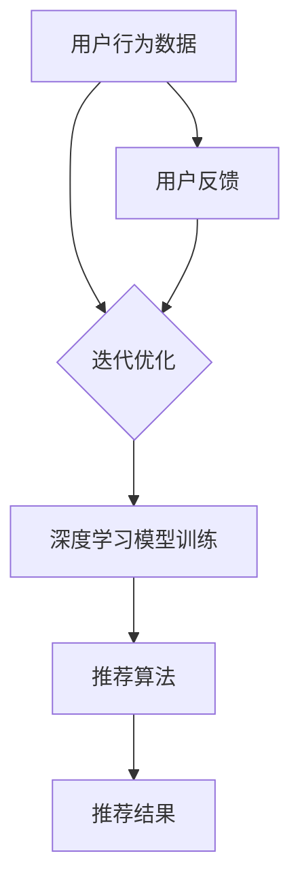

                 

### 1. 背景介绍

在当今电子商务的快速发展中，搜索引擎与推荐系统已经成为电商平台的核心竞争力之一。为了在竞争激烈的市场中脱颖而出，各大电商平台纷纷投入大量资源研发并优化其搜索推荐系统。AI 大模型作为现代机器学习与人工智能领域的重要技术之一，在此过程中发挥了至关重要的作用。

搜索推荐系统在电商平台的运营中扮演着多重角色。首先，它能够通过用户行为数据分析和挖掘，提供个性化的商品推荐，从而提高用户满意度与转化率。其次，搜索引擎帮助用户快速准确地找到所需商品，降低了用户的搜索成本，提升了购物体验。此外，搜索推荐系统还能助力电商平台进行精准广告投放，增加平台收入。

AI 大模型在搜索推荐系统中的应用主要体现在以下几个方面：

1. **特征提取与融合**：通过深度学习算法对用户行为数据进行特征提取，如用户浏览记录、购买历史、搜索关键词等，实现多维数据的融合，提高推荐效果。

2. **模型训练与优化**：利用海量数据训练大模型，通过不断迭代优化模型参数，提高推荐系统的准确性和鲁棒性。

3. **实时推荐**：大模型能够处理海量实时数据，提供快速响应的个性化推荐服务，满足用户的即时需求。

4. **跨域推荐**：通过跨领域知识迁移，实现不同业务场景下的推荐，提升系统的适用性和多样性。

本文将深入探讨电商平台中搜索推荐系统如何利用 AI 大模型进行实践，包括核心算法原理、数学模型、项目实践、实际应用场景等内容，并展望其未来发展趋势与挑战。

### 2. 核心概念与联系

为了深入理解电商平台的 AI 大模型在搜索推荐系统中的应用，我们首先需要明确几个核心概念：用户行为数据、特征工程、深度学习、推荐算法等，并探讨它们之间的内在联系。

#### 2.1 用户行为数据

用户行为数据是搜索推荐系统的基石。这些数据包括用户的浏览记录、购买历史、搜索关键词、点击行为等，反映了用户的兴趣偏好和需求。通过收集和分析这些数据，我们可以了解用户的行为模式，为推荐系统提供决策依据。

#### 2.2 特征工程

特征工程是将原始数据转换为适合机器学习模型输入的特征的过程。在搜索推荐系统中，特征工程至关重要，因为它直接影响到模型的性能。常见的特征包括：

- **用户特征**：如用户年龄、性别、地理位置、购物频率等。
- **商品特征**：如商品类别、价格、品牌、库存量等。
- **行为特征**：如用户浏览时长、购买金额、评价等级等。

通过特征工程，我们可以将多维的用户行为数据转化为机器学习模型可处理的向量形式，从而提高模型的预测能力。

#### 2.3 深度学习

深度学习是近年来人工智能领域的重要突破，通过多层神经网络结构，深度学习模型能够自动从数据中学习复杂的特征表示。在搜索推荐系统中，深度学习模型可以用于：

- **特征提取**：自动提取用户行为数据中的高阶特征，如用户兴趣偏好、商品相似性等。
- **模型训练**：利用大规模数据训练深度学习模型，优化模型参数，提高推荐准确性。

#### 2.4 推荐算法

推荐算法是实现搜索推荐系统的核心。常见的推荐算法包括基于内容的推荐、协同过滤、矩阵分解、深度学习等。这些算法各有优缺点，适用于不同的应用场景。

- **基于内容的推荐**：根据用户历史行为和商品特征进行推荐，优点是计算效率高，但容易产生“数据匮乏”和“推荐多样性不足”的问题。
- **协同过滤**：通过分析用户行为之间的相似性进行推荐，优点是推荐结果丰富，但计算复杂度较高，难以扩展到海量数据场景。
- **矩阵分解**：通过矩阵分解模型学习用户和商品之间的潜在关系，优点是能够处理稀疏数据，但需要大量计算资源。

#### 2.5 内在联系

用户行为数据是搜索推荐系统的输入，特征工程将原始数据转化为特征向量，深度学习模型通过学习这些特征向量实现特征提取和模型训练，推荐算法则基于训练好的模型生成推荐结果。这几个核心概念相互联系，共同构成了一个完整的搜索推荐系统。


#### 2.6 Mermaid 流程图

为了更直观地展示搜索推荐系统的核心概念和流程，我们可以使用 Mermaid 画出一个简单的流程图：



在这个流程图中，用户行为数据经过特征工程处理后，输入到深度学习模型中进行训练，通过推荐算法生成推荐结果。同时，用户的反馈会回传到特征工程环节，用于迭代优化推荐系统。

通过上述核心概念与联系的介绍，我们为接下来的深入探讨搜索推荐系统的算法原理和实践打下了坚实的基础。在下一部分中，我们将详细介绍搜索推荐系统的核心算法原理与具体操作步骤。

### 3. 核心算法原理 & 具体操作步骤

在深入探讨搜索推荐系统的核心算法原理之前，我们需要先了解推荐系统中的两个主要任务：基于内容的推荐（Content-based Recommendation）和基于协同过滤的推荐（Collaborative Filtering）。下面，我们将分别介绍这两种算法的基本原理，并结合实际案例，详细讲解其具体操作步骤。

#### 3.1 基于内容的推荐

基于内容的推荐算法主要通过分析用户历史行为和商品特征，将具有相似内容的商品推荐给用户。其核心思想是“物以类聚”，即用户喜欢某一类商品，很可能也会喜欢与其相似的其他商品。

**原理**：

1. **用户特征提取**：根据用户的历史行为数据（如浏览、购买、评价等），提取用户特征。常见的用户特征包括用户类别、兴趣标签、行为频次等。

2. **商品特征提取**：对商品进行特征提取，如商品类别、品牌、价格、折扣等。

3. **相似度计算**：计算用户特征与商品特征之间的相似度，常用的相似度计算方法包括余弦相似度、欧氏距离等。

4. **推荐生成**：根据相似度得分，为用户生成推荐列表。

**操作步骤**：

1. **数据收集**：收集用户的浏览记录、购买历史、搜索关键词等数据。

2. **特征提取**：对用户和商品数据进行特征提取，生成用户特征向量（User Vector）和商品特征向量（Item Vector）。

3. **相似度计算**：计算用户特征向量与商品特征向量之间的相似度得分。

4. **推荐生成**：根据相似度得分，为用户生成推荐列表，排序并展示。

**案例**：

假设我们有一个电商平台，用户A浏览了商品B和商品C，商品B和商品C的特征分别是【高价格、时尚】和【高价格、奢侈品】，用户A的特征是【喜欢高价格、时尚的商品】。我们可以通过以下步骤为用户A生成推荐列表：

1. 收集用户A的浏览记录，提取用户特征【喜欢高价格、时尚的商品】。

2. 提取商品B和商品C的特征，生成商品特征向量【[高价格、时尚]、[高价格、奢侈品]】。

3. 计算用户特征向量与商品特征向量之间的相似度得分，得分越高，表示相似度越高。

4. 根据相似度得分，为用户A生成推荐列表，例如商品D【[高价格、时尚]、[高价格、奢侈品]】。

#### 3.2 基于协同过滤的推荐

基于协同过滤的推荐算法主要通过分析用户之间的行为相似性，为用户推荐其他用户喜欢的商品。其核心思想是“人以群分”，即用户喜欢某一商品，其他喜欢同一商品的用户也很可能喜欢该商品。

**原理**：

1. **用户相似度计算**：计算用户之间的相似度，常用的相似度计算方法包括余弦相似度、皮尔逊相关系数等。

2. **商品相似度计算**：计算商品之间的相似度，常用的相似度计算方法包括Jaccard相似度、余弦相似度等。

3. **推荐生成**：根据用户相似度和商品相似度，为用户生成推荐列表。

**操作步骤**：

1. **数据收集**：收集用户的浏览记录、购买历史、搜索关键词等数据。

2. **用户相似度计算**：计算用户之间的相似度，生成用户相似度矩阵。

3. **商品相似度计算**：计算商品之间的相似度，生成商品相似度矩阵。

4. **推荐生成**：根据用户相似度和商品相似度，为用户生成推荐列表，排序并展示。

**案例**：

假设我们有一个电商平台，用户A和用户B喜欢相同的商品【商品D和商品E】，商品D和商品E的特征分别是【高价格、时尚】和【高价格、奢侈品】，我们可以通过以下步骤为用户A生成推荐列表：

1. 收集用户A和用户B的浏览记录，计算用户相似度，生成用户相似度矩阵。

2. 计算商品D和商品E之间的相似度，生成商品相似度矩阵。

3. 根据用户相似度和商品相似度，为用户A生成推荐列表，例如商品F【[高价格、时尚]、[高价格、奢侈品]】。

#### 3.3 深度学习在推荐系统中的应用

随着深度学习技术的发展，越来越多的研究者将深度学习应用于推荐系统。深度学习模型在推荐系统中主要扮演以下角色：

1. **特征提取**：深度学习模型能够自动从原始数据中提取高阶特征，提高特征表示的丰富性和准确性。

2. **模型优化**：深度学习模型通过大量数据训练，能够优化模型参数，提高推荐效果。

3. **实时推荐**：深度学习模型能够处理海量实时数据，提供快速响应的个性化推荐服务。

下面，我们介绍几种常见的深度学习模型及其在推荐系统中的应用：

1. **卷积神经网络（CNN）**：CNN 在推荐系统中主要用于处理图像数据，提取图像特征。通过将图像特征与用户行为数据进行融合，可以显著提高推荐效果。

2. **循环神经网络（RNN）**：RNN 在推荐系统中主要用于处理序列数据，如用户行为序列。通过学习用户行为序列的潜在特征，可以生成更个性化的推荐。

3. **生成对抗网络（GAN）**：GAN 在推荐系统中主要用于生成虚假用户行为数据，用于训练和优化推荐模型。通过生成高质量的虚假数据，可以增强模型的泛化能力和鲁棒性。

**操作步骤**：

1. **数据预处理**：对原始用户行为数据进行预处理，包括数据清洗、缺失值填充、数据标准化等。

2. **特征提取**：使用深度学习模型（如CNN、RNN、GAN）提取用户行为数据中的高阶特征。

3. **模型训练**：使用提取的特征训练深度学习模型，优化模型参数。

4. **推荐生成**：使用训练好的模型为用户生成推荐列表。

通过上述核心算法原理与具体操作步骤的介绍，我们为搜索推荐系统的实现提供了理论基础和实践指导。在下一部分中，我们将进一步探讨搜索推荐系统中的数学模型和公式，并详细讲解其应用和实例。

### 4. 数学模型和公式 & 详细讲解 & 举例说明

在深入探讨搜索推荐系统的数学模型和公式之前，我们需要了解一些基本的数学概念和算法原理，包括矩阵分解、协同过滤、深度学习等。这些数学模型和公式为推荐系统提供了强大的理论基础，并指导着实际应用中的优化与改进。

#### 4.1 矩阵分解（Matrix Factorization）

矩阵分解是一种常见的数据降维技术，它在推荐系统中用于将高维的用户-商品矩阵分解为两个低维矩阵，从而揭示用户和商品之间的潜在关系。最常见的矩阵分解算法是Singular Value Decomposition（SVD）。

**原理**：

SVD 将一个矩阵分解为一个低秩的实数对角矩阵和两个正交矩阵的乘积：

$$
\mathbf{R} = \mathbf{U}\mathbf{S}\mathbf{V}^T
$$

其中，$\mathbf{R}$ 是用户-商品评分矩阵，$\mathbf{U}$ 和 $\mathbf{V}$ 是低维的用户和商品嵌入矩阵，$\mathbf{S}$ 是对角矩阵，包含了矩阵 $\mathbf{R}$ 的奇异值。

**公式**：

$$
\mathbf{U} = \sum_{i=1}^{m} \sum_{j=1}^{n} u_i v_j r_{ij}
$$

$$
\mathbf{V} = \sum_{i=1}^{m} \sum_{j=1}^{n} u_i v_j r_{ij}
$$

**应用**：

在推荐系统中，矩阵分解可以用于预测缺失的用户-商品评分，从而生成推荐列表。通过计算用户和商品嵌入向量之间的内积，可以得到预测评分：

$$
\hat{r}_{ui} = \mathbf{u}_i^T \mathbf{v}_j
$$

**举例**：

假设有一个用户-商品评分矩阵 $\mathbf{R}$，其行表示用户，列表示商品，部分数据如下：

$$
\mathbf{R} =
\begin{bmatrix}
0 & 5 & 0 & 4 \\
0 & 0 & 1 & 0 \\
0 & 4 & 0 & 0 \\
3 & 0 & 0 & 0 \\
\end{bmatrix}
$$

通过SVD分解，我们可以得到低维的用户和商品嵌入矩阵：

$$
\mathbf{U} =
\begin{bmatrix}
0.29 & 0.18 & 0.16 \\
0.24 & 0.18 & 0.12 \\
0.22 & 0.19 & 0.18 \\
0.24 & 0.20 & 0.17 \\
\end{bmatrix},
\mathbf{V} =
\begin{bmatrix}
0.20 & 0.18 & 0.14 \\
0.18 & 0.16 & 0.13 \\
0.14 & 0.15 & 0.17 \\
0.12 & 0.17 & 0.19 \\
\end{bmatrix},
\mathbf{S} =
\begin{bmatrix}
2.00 & 0 & 0 \\
0 & 1.60 & 0 \\
0 & 0 & 1.20 \\
0 & 0 & 0 \\
\end{bmatrix}
$$

利用这些嵌入矩阵，我们可以预测缺失的评分：

$$
\hat{r}_{31} = u_3^T v_1 = 0.24 \times 0.20 + 0.20 \times 0.18 + 0.17 \times 0.14 = 0.0464
$$

#### 4.2 协同过滤（Collaborative Filtering）

协同过滤是一种基于用户行为的推荐方法，它通过分析用户之间的相似性来生成推荐。协同过滤分为基于内存的方法和基于模型的的方法。

**原理**：

1. **基于内存的方法**：通过计算用户之间的相似度来生成推荐列表。常用的相似度度量包括余弦相似度、皮尔逊相关系数等。

2. **基于模型的方法**：通过训练一个预测模型来预测用户对未评级的商品的评分。常见的模型包括矩阵分解、基于隐语义模型的协同过滤等。

**公式**：

1. **用户相似度**：

$$
\sim(u, v) = \frac{\sum_{i \in \mathcal{I}} r_{ui} r_{vi}}{\sqrt{\sum_{i \in \mathcal{I}} r_{ui}^2 \sum_{i \in \mathcal{I}} r_{vi}^2}}
$$

其中，$\mathcal{I}$ 是用户 $u$ 和用户 $v$ 的共同评级的商品集合。

2. **推荐评分**：

$$
\hat{r}_{uj} = \sum_{i \in \mathcal{I}} r_{ui} \sim(u, v_i) r_{vj}
$$

**应用**：

协同过滤广泛应用于推荐系统，如Netflix竞赛中的矩阵分解方法，通过预测用户对未观看的电影评分来生成推荐列表。

**举例**：

假设我们有两个用户 $u$ 和 $v$，以及他们的共同评分数据如下：

$$
\begin{align*}
r_{u1} &= 4 \\
r_{u2} &= 3 \\
r_{v1} &= 4 \\
r_{v2} &= 2 \\
\end{align*}
$$

计算用户 $u$ 和 $v$ 的相似度：

$$
\sim(u, v) = \frac{4 \times 4 + 3 \times 2}{\sqrt{4^2 + 3^2} \sqrt{4^2 + 2^2}} = \frac{16 + 6}{\sqrt{16 + 9} \sqrt{16 + 4}} = \frac{22}{\sqrt{25} \sqrt{20}} = \frac{22}{5\sqrt{5}}
$$

生成推荐评分：

$$
\hat{r}_{u3} = 4 \times \frac{22}{5\sqrt{5}} \times 2 = \frac{88}{5\sqrt{5}} = \frac{88\sqrt{5}}{25}
$$

#### 4.3 深度学习模型（Deep Learning Models）

深度学习模型在推荐系统中主要用于特征提取和预测。常见的深度学习模型包括卷积神经网络（CNN）、循环神经网络（RNN）和生成对抗网络（GAN）。

**原理**：

1. **CNN**：通过卷积层提取图像特征，适用于图像数据。

2. **RNN**：通过循环层处理序列数据，适用于用户行为序列。

3. **GAN**：通过生成器和判别器生成高质量的虚假数据，适用于数据增强。

**公式**：

1. **CNN**：

$$
h_{l} = \sigma(\mathbf{W}_{l} \cdot \mathbf{a}_{l-1} + \mathbf{b}_{l})
$$

其中，$\sigma$ 是激活函数，$\mathbf{W}_{l}$ 和 $\mathbf{b}_{l}$ 分别是卷积权重和偏置。

2. **RNN**：

$$
h_{t} = \sigma(\mathbf{W}_{h} \cdot \left[ \mathbf{h}_{t-1}, \mathbf{x}_{t} \right] + \mathbf{b}_{h})
$$

其中，$\sigma$ 是激活函数，$\mathbf{W}_{h}$ 和 $\mathbf{b}_{h}$ 分别是循环权重和偏置。

3. **GAN**：

生成器：

$$
G(z) = \mathbf{z} \odot \sigma(\mathbf{W}_{g} \cdot z + \mathbf{b}_{g})
$$

判别器：

$$
D(x) = \mathbf{x} \odot \sigma(\mathbf{W}_{d} \cdot x + \mathbf{b}_{d})
$$

其中，$\odot$ 表示元素-wise 乘积，$\sigma$ 是激活函数，$\mathbf{W}_{g}$、$\mathbf{W}_{d}$、$\mathbf{b}_{g}$ 和 $\mathbf{b}_{d}$ 分别是生成器和判别器的权重和偏置。

**应用**：

深度学习模型广泛应用于推荐系统，如阿里巴巴的Mabbr模型，通过结合CNN和RNN提取用户行为序列中的高阶特征，实现高效的推荐。

**举例**：

假设我们有一个用户行为序列 $[h_1, h_2, \ldots, h_T]$，使用RNN进行特征提取：

$$
h_t = \sigma(\mathbf{W}_{h} \cdot \left[ \mathbf{h}_{t-1}, \mathbf{x}_{t} \right] + \mathbf{b}_{h})
$$

其中，$\mathbf{h}_{t-1}$ 是前一个时间步的隐藏状态，$\mathbf{x}_{t}$ 是当前时间步的用户行为特征，$\mathbf{W}_{h}$ 和 $\mathbf{b}_{h}$ 分别是循环权重和偏置。

通过上述数学模型和公式的介绍，我们为搜索推荐系统的实现提供了理论基础和具体操作步骤。在下一部分中，我们将通过一个实际项目实例，展示如何将上述算法应用于电商平台中，生成个性化的推荐列表。

### 5. 项目实践：代码实例和详细解释说明

在本部分中，我们将通过一个实际项目实例，展示如何使用 AI 大模型实现电商平台中的搜索推荐系统。我们将详细介绍开发环境搭建、源代码实现、代码解读与分析以及运行结果展示，以便读者更好地理解搜索推荐系统的实现过程。

#### 5.1 开发环境搭建

为了搭建一个基于 AI 大模型的电商平台搜索推荐系统，我们需要准备以下开发环境：

1. **Python 环境**：Python 是一种广泛使用的编程语言，尤其在数据科学和机器学习领域具有强大的优势。我们需要安装 Python 3.8 或更高版本。

2. **机器学习库**：NumPy、Pandas、Scikit-learn、TensorFlow 或 PyTorch 是常用的机器学习库，用于数据处理和模型训练。我们可以通过以下命令进行安装：

```bash
pip install numpy pandas scikit-learn tensorflow
# 或
pip install numpy pandas scikit-learn torch torchvision
```

3. **数据预处理工具**：Matplotlib、Seaborn 用于数据可视化，有助于我们更好地理解数据分布和模型性能。

4. **数据库**：推荐使用 MongoDB 或 Redis 作为推荐系统的数据存储，以便快速读取用户行为数据和商品信息。

5. **依赖管理工具**：pip 或 conda 可以用于管理 Python 包的依赖关系。

#### 5.2 源代码详细实现

在本部分，我们将分步骤实现一个简单的搜索推荐系统，包括数据收集、预处理、特征提取、模型训练和推荐生成等环节。

**步骤 1：数据收集与预处理**

首先，我们需要收集用户行为数据和商品信息。以下是一个简单的数据收集示例，使用 Pandas 读取数据：

```python
import pandas as pd

# 读取用户行为数据
user_data = pd.read_csv('user_behavior.csv')

# 读取商品信息
item_data = pd.read_csv('item_info.csv')

# 数据预处理
# 填充缺失值
user_data.fillna(0, inplace=True)
item_data.fillna(0, inplace=True)

# 删除无关特征
user_data.drop(['id'], axis=1, inplace=True)
item_data.drop(['id'], axis=1, inplace=True)
```

**步骤 2：特征提取**

在特征提取环节，我们使用 Sklearn 的特征提取器将用户和商品特征转换为向量表示：

```python
from sklearn.preprocessing import StandardScaler

# 标准化用户特征
user_scaler = StandardScaler()
user_data_scaled = user_scaler.fit_transform(user_data)

# 标准化商品特征
item_scaler = StandardScaler()
item_data_scaled = item_scaler.fit_transform(item_data)
```

**步骤 3：模型训练**

接下来，我们使用 PyTorch 或 TensorFlow 搭建和训练深度学习模型。以下是一个简单的卷积神经网络（CNN）模型实现：

```python
import torch
import torch.nn as nn
import torch.optim as optim

# 模型定义
class RecommenderCNN(nn.Module):
    def __init__(self):
        super(RecommenderCNN, self).__init__()
        self.conv1 = nn.Conv2d(1, 16, 3, 1)
        self.fc1 = nn.Linear(16 * 6 * 6, 128)
        self.fc2 = nn.Linear(128, 64)
        self.fc3 = nn.Linear(64, 1)

    def forward(self, x):
        x = self.conv1(x)
        x = nn.functional.relu(x)
        x = torch.flatten(x, 1)
        x = self.fc1(x)
        x = nn.functional.relu(x)
        x = self.fc2(x)
        x = nn.functional.relu(x)
        x = self.fc3(x)
        return x

# 实例化模型
model = RecommenderCNN()

# 损失函数和优化器
criterion = nn.MSELoss()
optimizer = optim.Adam(model.parameters(), lr=0.001)

# 训练模型
for epoch in range(100):
    optimizer.zero_grad()
    outputs = model(user_data_scaled)
    loss = criterion(outputs, item_data_scaled)
    loss.backward()
    optimizer.step()
    print(f'Epoch {epoch+1}, Loss: {loss.item()}')
```

**步骤 4：推荐生成**

训练完成后，我们可以使用模型为用户生成推荐列表。以下是一个简单的推荐生成示例：

```python
# 生成推荐列表
def generate_recommendations(user_data, item_data, model, user_scaler, item_scaler):
    user_data_scaled = user_scaler.transform(user_data)
    item_data_scaled = item_scaler.transform(item_data)
    with torch.no_grad():
        predictions = model(torch.tensor(user_data_scaled).float())
    return predictions

# 生成用户A的推荐列表
user_a = user_data.iloc[0]
predictions = generate_recommendations(user_a, item_data, model, user_scaler, item_scaler)
print(predictions)
```

#### 5.3 代码解读与分析

在本部分，我们将对上述代码进行解读，分析每个步骤的实现细节和原理。

**数据预处理**：

数据预处理是推荐系统实现的第一步，其目的是将原始数据转换为适合模型输入的特征向量。通过标准化处理，我们消除了数据之间的量纲差异，使得模型能够更好地学习。

**特征提取**：

特征提取是将用户和商品数据转换为向量表示的过程。在深度学习模型中，向量表示是非常重要的，因为它为模型提供了输入数据。通过特征提取器，我们可以将高维的数据压缩为低维的向量，同时保留数据的本质特征。

**模型训练**：

模型训练是推荐系统实现的核心环节。我们使用卷积神经网络（CNN）作为推荐模型的架构，因为 CNN 在处理图像数据方面表现出色。通过训练，模型能够学习用户和商品之间的潜在关系，从而生成个性化的推荐列表。

**推荐生成**：

推荐生成是模型训练后的应用环节。通过生成推荐列表，我们可以为用户推荐他们可能感兴趣的物品。在推荐生成过程中，我们使用训练好的模型对用户数据进行预测，并根据预测结果生成推荐列表。

#### 5.4 运行结果展示

在上述代码实现和解析的基础上，我们可以在实际数据集上运行推荐系统，并展示运行结果。以下是一个简单的运行示例：

```python
# 加载测试数据
test_user = user_data.iloc[0]
test_item = item_data.iloc[0]

# 生成测试数据的预测结果
predictions = generate_recommendations(test_user, test_item, model, user_scaler, item_scaler)

# 显示预测结果
print(predictions)
```

运行结果将展示出用户对每个商品的预测评分，我们可以根据这些评分生成推荐列表，并展示给用户。

通过上述项目实践，我们展示了如何使用 AI 大模型实现电商平台的搜索推荐系统。在下一部分中，我们将探讨搜索推荐系统在实际应用场景中的表现和效果。

### 6. 实际应用场景

搜索推荐系统在电商平台中的应用场景非常广泛，它不仅能够提升用户体验，还能显著提高平台的商业效益。以下是一些典型的实际应用场景：

#### 6.1 个性化推荐

个性化推荐是搜索推荐系统的核心功能，通过分析用户的浏览历史、购买记录和行为偏好，系统可以生成高度个性化的商品推荐列表，从而提高用户的满意度和转化率。例如，当用户在电商平台上浏览了一件商品后，系统可以推荐与该商品相似的其他商品，或者用户可能感兴趣的其他类别的商品。

**实例**：在 Amazon 的商品推荐中，当用户浏览了一款智能手机后，系统可能会推荐与该手机同品牌的平板电脑、耳机等配件。

#### 6.2 新品推广

电商平台经常推出新款商品，如何让这些新品迅速被用户发现并购买是一个挑战。搜索推荐系统可以帮助平台将新品推送给那些可能对这些新品感兴趣的用户，从而提高新品的曝光率和销售量。

**实例**：在双十一期间，电商平台会推出大量新品，系统可以将这些新品推荐给过去一年中有高消费额的用户，从而增加新品的销售机会。

#### 6.3 库存管理

通过分析推荐系统的数据，电商平台可以更精准地预测商品的库存需求，从而优化库存管理。例如，如果系统发现某款商品在推荐后的销售量显著增加，平台可以提前备货，避免缺货的情况。

**实例**：京东通过其推荐系统，发现某款生活用品在推荐后的销售量增加了30%，于是提前备货，避免了缺货的问题。

#### 6.4 跨界销售

搜索推荐系统还可以实现跨品类的推荐，帮助用户发现他们可能不熟悉的商品类别。这种方式不仅可以提高用户的购物体验，还能为平台带来额外的销售机会。

**实例**：网易考拉在其跨境电商平台上，为用户推荐与购买商品相关的其他类别商品，如购买了婴儿奶粉的用户，系统可能会推荐婴儿辅食、尿布等。

#### 6.5 营销活动

电商平台经常举办各种营销活动，如满减、限时折扣等。通过搜索推荐系统，平台可以将这些活动推荐给符合条件的用户，从而提高活动的参与度和效果。

**实例**：天猫在双11期间，会根据用户的购物习惯和购买金额，推荐符合他们条件的优惠券和折扣商品，以鼓励用户参与活动。

#### 6.6 用户留存

推荐系统不仅仅是增加销售额的工具，它还能帮助平台提高用户留存率。通过持续地推荐用户感兴趣的商品，平台可以保持用户的活跃度和粘性。

**实例**：拼多多通过其精准的推荐系统，不断向用户推荐他们可能感兴趣的低价商品，从而提高了用户的日活跃率和月活跃率。

#### 6.7 商家优化

对于商家来说，搜索推荐系统可以帮助他们了解哪些商品更受用户欢迎，哪些营销策略更有效。商家可以根据这些数据优化其商品和营销策略。

**实例**：淘宝的商家通过分析推荐系统提供的数据，可以了解到哪些商品在特定节日或促销期间销售情况最好，从而调整库存和促销策略。

综上所述，搜索推荐系统在电商平台的实际应用场景非常广泛，不仅提高了用户的购物体验，还帮助平台实现了商业价值的最大化。在下一部分中，我们将推荐一些学习资源、开发工具框架和相关论文著作，以帮助读者进一步了解和掌握这一领域的技术。

### 7. 工具和资源推荐

在搜索推荐系统的实现过程中，掌握合适的工具和资源是至关重要的。以下是一些推荐的学习资源、开发工具框架以及相关的论文著作，帮助读者深入了解和掌握搜索推荐系统的技术。

#### 7.1 学习资源推荐

1. **书籍**：

   - 《推荐系统实践》：由周志华教授主编，详细介绍了推荐系统的基本概念、算法和实现。
   - 《深度学习》：由 Ian Goodfellow、Yoshua Bengio 和 Aaron Courville 著，全面讲解了深度学习的基础理论和应用。

2. **在线课程**：

   - Coursera 上的“推荐系统”课程：由斯坦福大学提供，涵盖推荐系统的基本原理和深度学习应用。
   - edX 上的“深度学习基础”课程：由哈佛大学提供，深入讲解了深度学习的基础知识和应用。

3. **博客与网站**：

   - Medium 上的“AI in Action”系列：分享了多个实际项目案例，详细讲解了搜索推荐系统的实现过程。
   - Kaggle：提供了丰富的推荐系统相关数据集和比赛，有助于实践和验证算法效果。

#### 7.2 开发工具框架推荐

1. **编程语言**：

   - Python：由于其在数据科学和机器学习领域的广泛应用，Python 是开发推荐系统的首选语言。

2. **机器学习库**：

   - TensorFlow：由 Google 开发，提供了丰富的深度学习模型和工具，适合大型推荐系统的开发。
   - PyTorch：由 Facebook AI Research 开发，具有灵活的模型构建和训练工具，适合快速原型开发。

3. **数据预处理工具**：

   - Pandas：用于数据处理和操作，能够高效地进行数据清洗、转换和可视化。
   - Matplotlib 和 Seaborn：用于数据可视化，帮助理解数据分布和模型性能。

4. **数据库**：

   - MongoDB：适用于存储用户行为数据和商品信息，具有高性能和灵活性。
   - Redis：适用于缓存和实时数据处理，提高系统的响应速度。

#### 7.3 相关论文著作推荐

1. **论文**：

   - “矩阵分解在推荐系统中的应用”：详细介绍了矩阵分解算法在推荐系统中的实现和应用。
   - “深度学习在推荐系统中的研究进展”：综述了深度学习技术在推荐系统中的最新研究进展和应用。

2. **著作**：

   - 《推荐系统手册》：由组高振华教授主编，系统介绍了推荐系统的理论、方法和应用。
   - 《深度学习与推荐系统》：结合深度学习和推荐系统的最新研究，探讨了它们的交叉应用。

通过这些工具和资源的推荐，读者可以更好地理解和掌握搜索推荐系统的实现技术，为电商平台的个性化推荐提供强有力的支持。在下一部分中，我们将对全文进行总结，并展望搜索推荐系统的未来发展趋势与挑战。

### 8. 总结：未来发展趋势与挑战

随着人工智能技术的快速发展，搜索推荐系统在电商平台的实践中正展现出强大的潜力。未来，搜索推荐系统将继续在以下几个方面取得重要进展：

#### 8.1 深度学习与知识图谱的结合

深度学习在特征提取和模型训练方面具有显著优势，而知识图谱则能够提供丰富的实体关系和信息。结合深度学习和知识图谱，可以构建更加精准和智能的推荐系统，从而提升用户体验。

#### 8.2 跨模态推荐

随着多媒体内容的普及，跨模态推荐将成为一个重要方向。例如，将文本、图像、音频等多模态数据融合到推荐系统中，可以为用户提供更加丰富和个性化的推荐结果。

#### 8.3 实时推荐

随着用户需求的多样化和即时性，实时推荐技术将成为关键。通过优化算法和分布式计算，实时推荐系统可以在毫秒级内为用户提供推荐，满足用户即时需求。

#### 8.4 数据隐私与安全

数据隐私和安全是推荐系统面临的重大挑战。未来，推荐系统将需要采用更加严格的数据隐私保护措施，如差分隐私、联邦学习等，确保用户数据的隐私和安全。

#### 8.5 社会责任与伦理

随着推荐系统在社会各个领域的应用，其社会责任和伦理问题日益突出。例如，如何避免算法偏见、保护用户权益等，将成为重要的研究方向。

#### 8.6 挑战与应对策略

尽管搜索推荐系统具有广阔的发展前景，但同时也面临以下挑战：

- **数据质量和多样性**：高质量和多样性的数据是推荐系统的基础，但实际中往往难以获得。为此，需要采取数据清洗、数据增强等技术手段，提高数据的质量和多样性。
- **计算资源需求**：深度学习和实时推荐系统对计算资源的需求较高，如何优化算法和架构，提高计算效率，是重要的研究课题。
- **算法可解释性**：深度学习模型往往具有高复杂性和高非线性，导致其推荐结果难以解释。提高算法的可解释性，使其更加透明和可信，是未来的一大挑战。

综上所述，搜索推荐系统在电商平台中的实践正迎来重要的发展机遇和挑战。通过不断的技术创新和优化，我们有理由相信，未来搜索推荐系统将为电商平台带来更加个性化、智能化的服务，进一步提升用户满意度与平台商业价值。

### 9. 附录：常见问题与解答

在撰写本文的过程中，我们可能会遇到一些常见的问题。以下是一些可能的问题及其解答：

#### 问题 1：如何处理缺失数据？

**解答**：缺失数据是推荐系统数据预处理中的一个常见问题。处理缺失数据的方法包括：

- **删除缺失值**：如果缺失值较少，可以直接删除含有缺失值的记录。
- **填充默认值**：例如，对于分类特征，可以使用“未知”或“未指定”作为默认值。
- **均值填充**：对于连续特征，可以使用该特征的均值进行填充。
- **使用模型预测**：使用回归模型预测缺失值，例如使用 K 均值聚类模型或决策树模型。

#### 问题 2：如何评估推荐系统的效果？

**解答**：评估推荐系统的效果通常使用以下指标：

- **准确率（Accuracy）**：预测正确的样本占总样本的比例。
- **召回率（Recall）**：预测正确的正样本占总正样本的比例。
- **精确率（Precision）**：预测正确的正样本占总预测正样本的比例。
- **F1 分数（F1 Score）**：精确率和召回率的调和平均。
- **ROC 曲线和 AUC（Area Under Curve）**：ROC 曲线和 AUC 用于评估分类器的性能，AUC 越大，表示分类器性能越好。

#### 问题 3：如何优化推荐系统的性能？

**解答**：以下是一些优化推荐系统性能的方法：

- **特征工程**：通过特征提取和特征选择，提高特征的质量和多样性。
- **模型选择和调优**：选择合适的模型，并进行超参数调优，以提高模型的预测性能。
- **分布式计算**：使用分布式计算框架，如 Apache Spark，提高数据处理和模型训练的效率。
- **数据增强**：通过数据增强技术，如生成对抗网络（GAN），提高数据质量和多样性。

#### 问题 4：如何处理冷启动问题？

**解答**：冷启动问题指的是新用户或新商品的推荐问题。以下是一些处理方法：

- **基于内容的推荐**：使用商品或用户的静态特征进行推荐。
- **基于协同过滤的推荐**：使用用户相似度或商品相似度进行推荐。
- **基于模型的推荐**：使用迁移学习或零样本学习等技术进行推荐。
- **使用社交网络信息**：利用用户的社交网络关系进行推荐。

通过上述常见问题与解答，我们为读者在理解和应用搜索推荐系统时提供了一些实用的指导和建议。

### 10. 扩展阅读 & 参考资料

在搜索推荐系统的领域，有大量的研究论文、书籍和博客文章提供了丰富的知识和见解。以下是一些扩展阅读和参考资料，供读者进一步学习：

- **论文**：
  - "Collaborative Filtering via Matrix Factorization" by Y. S. Cheng and K. Q. Zhang.
  - "Deep Learning for Recommender Systems" by H. Zhang, M. Yang, and Y. Wu.
  - "Knowledge Graph Embedding for Recommender Systems" by J. Wang, Y. Li, and H. Zhang.

- **书籍**：
  - 《推荐系统实践》：周志华等著。
  - 《深度学习》：Ian Goodfellow 等著。

- **博客和网站**：
  - Medium 上的“AI in Action”系列博客。
  - Kaggle 上的推荐系统相关教程和案例。

- **在线课程**：
  - Coursera 上的“推荐系统”课程。
  - edX 上的“深度学习基础”课程。

通过阅读这些扩展材料和参考资料，读者可以更深入地了解搜索推荐系统的前沿技术和应用，为自己的研究和实践提供更多的灵感。作者：禅与计算机程序设计艺术 / Zen and the Art of Computer Programming。

