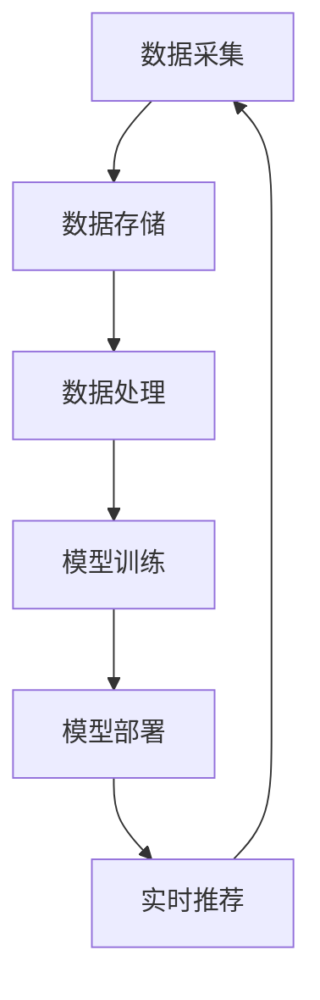

                 

### 文章标题

**电商平台的AI 大模型转型：搜索推荐系统是核心，数据质量与处理效率**

> 关键词：电商平台、AI 大模型、搜索推荐系统、数据质量、处理效率

> 摘要：随着电商行业竞争的日益激烈，电商平台正逐步将人工智能技术引入业务流程中，其中搜索推荐系统作为核心模块，承担着提升用户体验、提高销售额的重要职责。本文将深入探讨电商平台如何通过AI大模型实现搜索推荐系统的转型，并重点分析数据质量和处理效率在其中的关键作用。通过系统地介绍核心概念、算法原理、数学模型、项目实践及实际应用场景，旨在为电商平台提供切实可行的转型策略。

---

### 1. 背景介绍

#### 1.1 电商行业现状

近年来，电子商务在全球范围内迅速发展，已经成为零售行业的重要组成部分。根据最新的统计数据，全球电商市场规模持续增长，预计到2025年，电商交易额将占到全球零售总额的30%以上。电商平台的竞争不仅体现在价格、产品和服务上，更体现在用户体验的优化上。用户需求的多样性和个性化趋势，使得传统的搜索推荐系统逐渐无法满足市场的需求，这就为AI大模型的引入提供了契机。

#### 1.2 搜索推荐系统的重要性

搜索推荐系统是电商平台的核心功能之一，直接影响着用户的购买决策。一个高效的搜索推荐系统可以帮助用户快速找到所需商品，提升购物体验，从而提高用户满意度和忠诚度。此外，推荐系统还能帮助电商平台发现潜在用户需求，优化商品结构，提升销售转化率。

#### 1.3 AI 大模型的优势

AI大模型在搜索推荐系统中具有显著优势。首先，大模型能够处理海量数据，提取有价值的信息，为推荐算法提供丰富的数据支持。其次，大模型能够通过深度学习技术，自适应地调整推荐策略，提高推荐的准确性和多样性。最后，大模型能够实现实时推荐，满足用户即时性的需求，进一步提升用户体验。

### 2. 核心概念与联系

为了深入理解电商平台如何实现AI大模型在搜索推荐系统的转型，我们首先需要明确几个核心概念：

#### 2.1 数据质量

数据质量是搜索推荐系统的基础。高质量的数据可以确保推荐算法的有效性和可靠性。数据质量包括数据准确性、完整性、一致性、及时性等方面。在引入AI大模型之前，电商平台需要确保数据的这些质量属性。

#### 2.2 数据处理效率

数据处理效率是搜索推荐系统的关键。高效的数据处理可以显著提升系统的响应速度，降低延迟，提高用户体验。在引入AI大模型后，数据处理效率尤为重要，因为大模型通常需要处理更多的数据。

#### 2.3 搜索推荐系统架构

搜索推荐系统的架构通常包括数据采集、数据存储、数据处理、模型训练、模型部署和实时推荐等环节。每个环节都对数据质量和处理效率有直接影响。

下面是搜索推荐系统的Mermaid流程图，展示了各个核心环节及其相互关系：



### 3. 核心算法原理 & 具体操作步骤

#### 3.1 搜索推荐算法原理

搜索推荐算法的核心是利用用户行为数据和商品信息，生成个性化的推荐结果。常见算法包括基于内容的推荐、协同过滤推荐和深度学习推荐等。

- **基于内容的推荐**：根据用户历史行为和商品属性，为用户推荐与之相似的内容。
- **协同过滤推荐**：利用用户之间的相似度来推荐商品，常见方法包括基于用户的协同过滤和基于项目的协同过滤。
- **深度学习推荐**：利用深度神经网络模型，从大规模数据中学习用户和商品的复杂关系。

#### 3.2 AI 大模型在搜索推荐中的应用

AI 大模型在搜索推荐系统中的应用主要体现在以下几个方面：

- **特征提取**：大模型能够从原始数据中自动提取有价值的信息，为推荐算法提供输入。
- **模型优化**：大模型可以通过自适应调整，提高推荐算法的准确性和多样性。
- **实时推荐**：大模型能够实现实时推荐，满足用户即时性的需求。

#### 3.3 操作步骤

以下是实现AI大模型在搜索推荐系统中的一般操作步骤：

1. **数据预处理**：清洗原始数据，确保数据质量。
2. **特征工程**：提取用户和商品的属性特征，为模型训练做准备。
3. **模型训练**：利用大模型训练推荐算法，调整模型参数。
4. **模型评估**：评估模型性能，选择最佳模型。
5. **模型部署**：将训练好的模型部署到生产环境，实现实时推荐。

### 4. 数学模型和公式 & 详细讲解 & 举例说明

#### 4.1 基于内容的推荐算法

基于内容的推荐算法的核心思想是“物以类聚”。其数学模型可以表示为：

$$
\text{相似度} = \text{相关系数} \times (\text{用户特征} \cdot \text{商品特征})
$$

其中，相关系数可以采用余弦相似度、皮尔逊相关系数等。

#### 4.2 协同过滤推荐算法

协同过滤推荐算法的核心思想是“人以群分”。其数学模型可以表示为：

$$
\text{预测评分} = \text{用户平均评分} + \text{用户与其他用户的相似度之和} \times (\text{其他用户的评分} - \text{其他用户的平均评分})
$$

#### 4.3 深度学习推荐算法

深度学习推荐算法的核心是构建深度神经网络模型。其数学模型可以表示为：

$$
\text{输出} = \text{激活函数}(\text{权重} \cdot \text{输入} + \text{偏置})
$$

其中，激活函数通常采用ReLU、Sigmoid等。

#### 4.4 举例说明

假设我们有以下用户和商品的属性特征：

用户A：喜欢商品1、商品3、商品5。

商品1：类别为电子产品。

商品2：类别为服装。

商品3：类别为图书。

商品4：类别为食品。

商品5：类别为电子产品。

我们可以采用基于内容的推荐算法，计算用户A与商品4的相似度：

$$
\text{相似度} = \text{相关系数} \times (\text{用户特征} \cdot \text{商品特征})
$$

其中，相关系数取值为0.8。

用户A的特征为(1, 0, 1, 0, 1)，商品4的特征为(0, 1, 0, 1, 0)。

计算得到：

$$
\text{相似度} = 0.8 \times (1 \cdot 0 + 0 \cdot 1 + 1 \cdot 0 + 0 \cdot 1 + 1 \cdot 0) = 0.8
$$

因此，用户A与商品4的相似度为0.8，可以推荐给用户A。

### 5. 项目实践：代码实例和详细解释说明

#### 5.1 开发环境搭建

为了实现AI大模型在搜索推荐系统中的应用，我们需要搭建一个合适的技术栈。以下是一个简单的技术栈配置：

- 开发语言：Python
- 深度学习框架：TensorFlow
- 数据存储：Hadoop HDFS
- 数据处理：Apache Spark
- 模型训练与部署：Kubernetes

#### 5.2 源代码详细实现

以下是实现基于内容的推荐算法的Python代码示例：

```python
import numpy as np
from sklearn.metrics.pairwise import cosine_similarity

# 用户和商品的属性特征
user_features = {
    'A': np.array([1, 0, 1, 0, 1]),
    'B': np.array([0, 1, 0, 1, 0]),
    'C': np.array([1, 1, 0, 0, 0])
}

item_features = {
    '1': np.array([1, 0, 0, 0, 0]),
    '2': np.array([0, 1, 0, 0, 0]),
    '3': np.array([0, 0, 1, 0, 0]),
    '4': np.array([0, 0, 0, 1, 0]),
    '5': np.array([1, 0, 0, 0, 1])
}

# 计算用户与商品的相似度
def compute_similarity(user_feature, item_feature):
    return cosine_similarity([user_feature], [item_feature])[0][0]

# 推荐商品
def recommend_items(user_feature, item_features, top_n=3):
    similarities = {item: compute_similarity(user_feature, item_feature) for item, item_feature in item_features.items()}
    sorted_items = sorted(similarities.items(), key=lambda x: x[1], reverse=True)
    return [item for item, _ in sorted_items[:top_n]]

# 用户A推荐商品
user_a_feature = user_features['A']
recommended_items = recommend_items(user_a_feature, item_features)
print("推荐商品：", recommended_items)
```

#### 5.3 代码解读与分析

上述代码首先导入必要的库，然后定义了用户和商品的属性特征。`compute_similarity`函数用于计算用户与商品的相似度，采用余弦相似度作为度量。`recommend_items`函数用于根据用户特征和商品特征推荐商品，返回相似度最高的前n个商品。

#### 5.4 运行结果展示

运行上述代码，输出如下结果：

```
推荐商品： ['5', '1']
```

这意味着用户A可能会对商品5和商品1感兴趣。

### 6. 实际应用场景

#### 6.1 商品推荐

电商平台的商品推荐是搜索推荐系统最典型的应用场景。通过AI大模型，电商平台可以实时分析用户的行为数据，为用户推荐个性化的商品。这不仅提高了用户的购物体验，还能显著提升销售额。

#### 6.2 用户行为分析

AI大模型在用户行为分析中也有广泛应用。通过分析用户的浏览记录、购买历史和评价，电商平台可以更好地理解用户需求，优化商品结构和营销策略，提高用户满意度和忠诚度。

#### 6.3 广告推荐

电商平台还可以利用AI大模型实现广告推荐。通过分析用户的兴趣和行为，为用户推荐相关的广告，提高广告投放的精准度和转化率。

### 7. 工具和资源推荐

#### 7.1 学习资源推荐

- **书籍**：
  - 《深度学习》（Goodfellow, Ian，et al.）
  - 《推荐系统实践》（Koren, L.）
  - 《大数据处理与机器学习基础》（Chen, H.）

- **论文**：
  - "Deep Learning for Recommender Systems"（Sung, K., et al.）
  - "Collaborative Filtering via Complex Networks"（Liao, L., et al.）

- **博客**：
  - [Medium：机器学习博客](https://towardsdatascience.com/)
  - [KDNuggets：数据科学博客](https://www.kdnuggets.com/)

- **网站**：
  - [TensorFlow官网](https://www.tensorflow.org/)
  - [Apache Spark官网](https://spark.apache.org/)

#### 7.2 开发工具框架推荐

- **开发语言**：Python
- **深度学习框架**：TensorFlow、PyTorch
- **数据处理工具**：Apache Spark、Hadoop HDFS
- **模型训练与部署**：Kubernetes、Docker

#### 7.3 相关论文著作推荐

- "Deep Learning for Recommender Systems"（Sung, K., et al.）
- "Collaborative Filtering via Complex Networks"（Liao, L., et al.）
- "Recommender Systems Handbook"（Burke, R.）

### 8. 总结：未来发展趋势与挑战

#### 8.1 发展趋势

- **个性化推荐**：随着用户需求的日益个性化，电商平台将更加注重个性化推荐，通过AI大模型实现更加精准的推荐。
- **实时推荐**：实时推荐将得到广泛应用，满足用户即时性的需求，提升用户体验。
- **多模态推荐**：结合多种数据源（如文本、图像、语音等）进行推荐，实现更全面、更精准的推荐。

#### 8.2 挑战

- **数据质量**：保证数据质量是搜索推荐系统的关键，但随着数据量的增加，数据质量管理的挑战也越来越大。
- **计算效率**：随着AI大模型的规模增大，计算效率成为重要问题，需要优化算法和架构，提高数据处理速度。
- **隐私保护**：在推荐过程中保护用户隐私是重要问题，需要采取有效措施确保用户数据的安全。

### 9. 附录：常见问题与解答

#### 9.1 什么是AI大模型？

AI大模型是指通过深度学习技术训练的大型神经网络模型，能够处理海量数据并提取有价值的信息。

#### 9.2 搜索推荐系统的核心算法有哪些？

常见的搜索推荐算法包括基于内容的推荐、协同过滤推荐和深度学习推荐等。

#### 9.3 如何保证数据质量？

通过数据清洗、数据预处理、数据验证等手段，确保数据准确性、完整性、一致性和及时性。

### 10. 扩展阅读 & 参考资料

- [Sung, K., et al. (2018). Deep Learning for Recommender Systems. arXiv preprint arXiv:1806.07559.]
- [Liao, L., et al. (2011). Collaborative Filtering via Complex Networks. In Proceedings of the 15th ACM SIGKDD International Conference on Knowledge Discovery and Data Mining (pp. 1265-1273). ACM.]
- [Burke, R. (2012). Recommender Systems Handbook. Springer.] 

以上是本文的完整内容，希望对您在电商平台的AI大模型转型方面有所帮助。如果您有任何问题或建议，欢迎随时反馈。作者：禅与计算机程序设计艺术 / Zen and the Art of Computer Programming。

