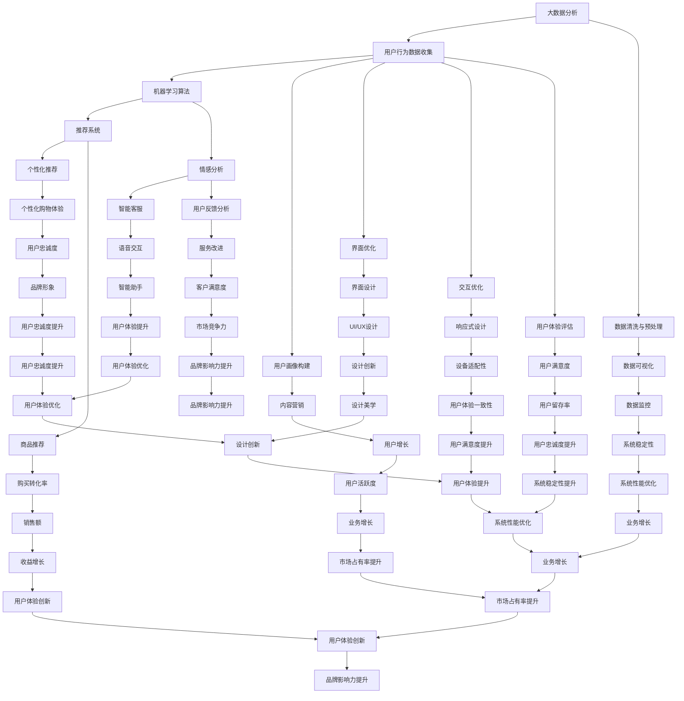

                 

### 1. 背景介绍

在当今数字化时代，电商平台作为电子商务的核心组成部分，正经历着前所未有的发展。随着互联网技术的不断进步和消费者需求的日益多样化，电商平台需要不断创新和优化用户体验，以满足用户对便捷、个性化、高效服务的需求。人工智能（AI）技术的发展为电商平台提供了强大的技术支持，使其能够更加精准地把握用户行为，优化界面设计，提升交互体验，从而在激烈的市场竞争中脱颖而出。

人工智能在电商平台的用户体验设计中扮演着至关重要的角色。它通过大数据分析、机器学习、自然语言处理等技术，实现了对用户行为的实时监控、分析和预测。以下是一些核心概念和联系，它们构成了电商平台AI驱动用户体验设计的理论基础：

- **大数据分析**：通过收集和分析用户在电商平台上的行为数据，如搜索记录、购物车内容、购买历史、评价反馈等，电商平台可以深入了解用户需求和行为模式。

- **机器学习**：利用机器学习算法，电商平台可以从大量数据中自动识别规律和趋势，为个性化推荐、智能客服等应用提供支持。

- **自然语言处理**：通过自然语言处理技术，电商平台可以实现智能客服、语音交互等功能，与用户进行更自然的沟通。

- **推荐系统**：基于用户行为数据和机器学习算法，推荐系统能够为用户推荐符合其兴趣和需求的商品，提高用户满意度。

- **情感分析**：通过对用户评价、评论等文本内容进行分析，情感分析技术可以帮助电商平台了解用户情感，优化产品和服务。

以上核心概念和技术的联系构成了电商平台AI驱动用户体验设计的基础。接下来，我们将进一步探讨这些技术如何在电商平台的实际操作中得到应用。

### 2. 核心概念与联系

在深入探讨电商平台AI驱动用户体验设计之前，我们有必要了解一些核心概念和技术原理。以下是一个简化的Mermaid流程图，展示了这些核心概念和技术的相互关系：



#### 2.1 大数据分析与用户行为数据收集

大数据分析是电商平台AI驱动用户体验设计的基础。通过收集和分析用户在平台上的行为数据，如浏览历史、搜索记录、购买偏好、评论反馈等，电商平台能够深入了解用户需求和行为模式。这一过程通常包括以下几个步骤：

1. **用户行为数据收集**：电商平台通过各种渠道收集用户数据，包括网站日志、API调用记录、用户交互数据等。

2. **数据清洗与预处理**：收集到的数据可能存在噪声、缺失值、异常值等问题，需要进行清洗和预处理，以确保数据质量。

3. **数据可视化**：通过数据可视化技术，将清洗后的数据转化为图表、仪表盘等形式，便于数据分析师和决策者进行理解和分析。

#### 2.2 机器学习与用户画像构建

机器学习技术在用户画像构建中发挥着关键作用。通过机器学习算法，电商平台可以从大量用户数据中自动识别出用户的行为模式和偏好，从而构建出详细的用户画像。这个过程通常包括以下几个步骤：

1. **数据预处理**：将原始的用户行为数据转化为适合机器学习算法的格式。

2. **特征提取**：从用户行为数据中提取出与用户偏好和行为模式相关的特征。

3. **模型训练**：利用训练集数据，通过机器学习算法训练出用户画像模型。

4. **模型评估与优化**：通过评估模型的准确性、召回率等指标，对模型进行调整和优化，以提高用户画像的准确性。

#### 2.3 推荐系统与个性化推荐

推荐系统是电商平台AI驱动用户体验设计的重要组成部分。通过个性化推荐算法，电商平台能够为用户推荐符合其兴趣和需求的商品，从而提高用户满意度和购买转化率。个性化推荐通常包括以下几个步骤：

1. **用户行为分析**：分析用户的历史行为数据，如浏览记录、搜索关键词、购买历史等，以了解用户的兴趣和偏好。

2. **推荐算法选择**：根据用户行为数据和业务需求，选择合适的推荐算法，如协同过滤、基于内容的推荐、混合推荐等。

3. **推荐结果生成**：利用推荐算法生成个性化推荐结果，并将其呈现给用户。

4. **推荐效果评估**：通过用户反馈和行为数据，评估推荐效果，对推荐系统进行调整和优化。

#### 2.4 情感分析与智能客服

情感分析技术可以帮助电商平台理解用户的情感状态，从而提供更贴心的服务。智能客服系统则通过自然语言处理技术，实现与用户的智能交互。这一过程通常包括以下几个步骤：

1. **情感分析**：通过对用户评价、评论等文本内容进行分析，提取出用户的情感倾向。

2. **情绪识别**：根据情感分析结果，识别用户的主要情绪，如满意、不满意、愤怒等。

3. **智能客服**：利用自然语言处理技术，实现智能客服系统与用户的对话，提供实时解答和个性化服务。

4. **用户反馈**：收集用户的反馈信息，对智能客服系统进行优化和改进。

#### 2.5 界面优化与交互优化

界面优化和交互优化是提升用户体验的关键。通过数据驱动的界面设计和交互优化，电商平台能够提供更直观、便捷的用户体验。这一过程通常包括以下几个步骤：

1. **界面设计**：基于用户研究和数据分析，设计直观、易用的界面布局和元素。

2. **交互设计**：通过用户测试和数据分析，优化交互流程和操作逻辑，提高用户操作效率和满意度。

3. **界面测试**：通过A/B测试、用户反馈等手段，评估界面设计的效果，进行迭代优化。

4. **用户体验评估**：通过用户满意度调查、行为分析等手段，评估用户体验，为后续优化提供依据。

通过以上核心概念和技术的联系，我们可以看到，电商平台AI驱动用户体验设计是一个系统性、多层次的过程，涉及到数据收集、分析、处理、应用等多个环节。接下来，我们将进一步探讨这些技术在电商平台的实际操作中的应用。

### 3. 核心算法原理 & 具体操作步骤

在电商平台AI驱动用户体验设计中，核心算法原理决定了用户行为数据的收集、分析、处理和应用。以下将详细阐述几种关键算法的原理和具体操作步骤：

#### 3.1 大数据分析算法

大数据分析算法主要利用数据挖掘和统计分析方法，对大量用户行为数据进行分析，以发现用户需求和行为模式。以下是大数据分析的主要步骤：

1. **数据收集**：
    - **用户行为数据收集**：通过电商平台的各种渠道（如网站日志、API调用记录、用户交互数据等）收集用户行为数据。
    - **第三方数据接入**：接入第三方数据源，如社交媒体、地理信息等，以丰富用户画像。

2. **数据清洗与预处理**：
    - **缺失值处理**：对缺失的数据进行填补或删除。
    - **异常值检测**：通过统计分析方法（如Z-Score、IQR等）检测并处理异常值。
    - **数据标准化**：对数据进行归一化或标准化处理，以消除不同数据间的尺度差异。

3. **特征工程**：
    - **特征提取**：从原始数据中提取与用户行为相关的特征，如用户浏览时间、购买频率、商品类别等。
    - **特征选择**：利用特征选择算法（如信息增益、卡方检验等）筛选出对用户行为预测有显著影响的特征。

4. **模型训练与评估**：
    - **模型选择**：根据业务需求选择合适的机器学习模型，如回归分析、决策树、随机森林等。
    - **模型训练**：利用训练集数据，通过机器学习算法训练模型。
    - **模型评估**：通过验证集数据评估模型的准确性、召回率等指标，调整模型参数。

5. **结果应用**：
    - **用户行为预测**：利用训练好的模型对用户行为进行预测，如预测用户的购买意图、浏览习惯等。
    - **数据可视化**：通过数据可视化工具（如ECharts、Tableau等）将分析结果以图表、报表等形式展示，便于数据分析师和决策者理解。

#### 3.2 个性化推荐算法

个性化推荐算法通过分析用户的历史行为数据，为用户推荐符合其兴趣和需求的商品。以下是几种常见的个性化推荐算法及其具体操作步骤：

1. **协同过滤算法**：
    - **用户相似度计算**：计算用户之间的相似度，通常使用余弦相似度、皮尔逊相关系数等。
    - **物品相似度计算**：计算物品之间的相似度，使用余弦相似度、Jaccard系数等。
    - **推荐生成**：根据用户-物品评分矩阵，使用协同过滤算法生成个性化推荐列表。

2. **基于内容的推荐算法**：
    - **内容特征提取**：对商品进行内容特征提取，如商品类别、品牌、价格等。
    - **用户兴趣模型构建**：基于用户历史行为数据，构建用户兴趣模型。
    - **推荐生成**：计算用户兴趣模型与商品内容特征的相似度，生成个性化推荐列表。

3. **混合推荐算法**：
    - **算法组合**：将协同过滤和基于内容的推荐算法组合起来，以综合两者的优势。
    - **权重分配**：根据业务需求和数据质量，为两种算法分配不同的权重。
    - **推荐生成**：通过混合算法生成个性化推荐列表。

#### 3.3 情感分析算法

情感分析算法通过分析用户的文本数据（如评论、提问等），提取出用户的情感倾向。以下是情感分析的主要步骤：

1. **文本预处理**：
    - **去除停用词**：去除常见的无意义词汇，如“的”、“了”、“在”等。
    - **词性标注**：对文本中的每个词进行词性标注，以区分名词、动词、形容词等。
    - **分词**：将文本拆分成词或短语，以进行后续分析。

2. **情感极性分类**：
    - **情感词典构建**：构建包含积极、消极情感词汇的词典。
    - **情感极性标注**：利用情感词典对文本进行情感极性标注，如“满意”、“不满意”等。
    - **情感分类模型训练**：使用标注好的数据集，训练情感分类模型。

3. **情感分析应用**：
    - **评论分析**：通过情感分析模型，对用户评论进行情感分类，以评估用户对商品或服务的满意度。
    - **用户反馈分析**：结合情感分析和用户行为数据，分析用户反馈，优化产品和服务。

#### 3.4 交互优化算法

交互优化算法通过分析用户在平台上的交互行为，优化界面设计和交互流程，以提高用户体验。以下是交互优化算法的主要步骤：

1. **交互数据分析**：
    - **行为追踪**：通过用户行为追踪技术，记录用户在平台上的交互行为，如点击、滑动、停留时间等。
    - **数据预处理**：对收集到的交互数据进行清洗、去噪，确保数据质量。

2. **交互模式识别**：
    - **模式识别算法**：使用聚类、分类等机器学习算法，识别用户的交互模式。
    - **交互模型构建**：根据识别出的交互模式，构建用户交互模型。

3. **交互优化**：
    - **界面调整**：根据用户交互模型，调整界面布局和元素，以提高用户操作效率和满意度。
    - **流程优化**：通过分析用户交互流程，优化操作逻辑和流程，减少用户操作成本。

4. **交互效果评估**：
    - **A/B测试**：通过A/B测试，比较不同交互设计方案的用户体验效果，选择最佳方案。
    - **用户反馈**：收集用户对交互方案的反馈，持续优化交互体验。

通过以上核心算法原理和具体操作步骤，我们可以看到电商平台AI驱动用户体验设计的复杂性和系统性。这些算法和技术不仅需要高效的数据处理能力，还需要深入理解用户行为和需求，以提供高质量的个性化服务和优化用户体验。接下来，我们将探讨这些技术在电商平台的实际应用场景。

### 4. 数学模型和公式 & 详细讲解 & 举例说明

在电商平台AI驱动用户体验设计中，数学模型和公式起着至关重要的作用。以下将详细讲解几种关键数学模型和公式，并提供具体示例说明其应用。

#### 4.1 期望最大化（EM）算法

期望最大化（Expectation-Maximization, EM）算法是一种用于处理包含缺失数据的概率模型参数估计的方法。在电商平台AI驱动用户体验设计中，EM算法常用于用户行为预测和推荐系统的参数优化。

**公式**：
EM算法主要包含两个步骤：

1. **E步（期望步）**：
   \[
   \theta^{new} = \arg \max_{\theta} \sum_{i} L(\theta; x_i)
   \]
   其中，\(L(\theta; x_i)\)是期望值函数，表示给定模型参数\(\theta\)和观测数据\(x_i\)的似然函数。

2. **M步（最大化步）**：
   \[
   \theta^{new} = \arg \max_{\theta} \sum_{i} L(\theta; x_i)
   \]
   其中，\(\theta^{new}\)是更新后的模型参数。

**示例**：
假设一个电商平台想要预测用户在下一个小时内购买商品的概率，可以使用EM算法优化推荐系统中的参数。

- **数据集**：\(x_i\)为用户的历史行为数据，包括浏览记录、购买历史等。
- **模型**：概率模型，如贝叶斯网络。
- **参数**：模型参数，如条件概率分布。

通过EM算法，电商平台可以优化推荐系统中的参数，提高预测准确性，从而为用户提供更个性化的推荐。

#### 4.2 协同过滤矩阵分解

协同过滤（Collaborative Filtering）矩阵分解是一种基于用户-物品评分矩阵进行推荐的方法。它通过矩阵分解将原始的评分矩阵分解为用户特征矩阵和物品特征矩阵，从而实现个性化推荐。

**公式**：
假设有一个\(m \times n\)的评分矩阵\(R\)，其中\(R_{ij}\)表示用户\(i\)对物品\(j\)的评分。协同过滤矩阵分解的目标是找到一个低秩的分解矩阵\(U\)（用户特征矩阵，\(m \times k\)）和\(V\)（物品特征矩阵，\(n \times k\)），使得重构的评分矩阵\(R'\)尽可能接近原始评分矩阵\(R\)。

1. **损失函数**：
   \[
   L(R, R') = \frac{1}{2} \| R - R' \|^2
   \]

2. **优化目标**：
   \[
   \min_{U, V} L(R, R')
   \]

3. **梯度下降**：
   对\(U, V\)分别进行梯度下降优化，更新规则如下：
   \[
   U_{ij} := U_{ij} - \alpha \frac{\partial L}{\partial U_{ij}}
   \]
   \[
   V_{ij} := V_{ij} - \alpha \frac{\partial L}{\partial V_{ij}}
   \]

**示例**：
假设有一个1000个用户和1000个物品的评分矩阵，使用协同过滤矩阵分解进行推荐。

- **初始化**：随机初始化\(U, V\)。
- **迭代**：通过梯度下降迭代更新\(U, V\)，直到收敛。
- **推荐**：根据用户特征矩阵\(U\)和物品特征矩阵\(V\)，计算用户\(i\)对未评分物品\(j\)的预测评分。

通过协同过滤矩阵分解，电商平台可以生成个性化的推荐列表，提高用户满意度。

#### 4.3 情感分析模型

情感分析（Sentiment Analysis）模型用于分析文本数据，提取出用户的情感倾向。一种常见的情感分析模型是基于深度学习的文本分类模型，如卷积神经网络（CNN）和循环神经网络（RNN）。

**公式**：
以卷积神经网络（CNN）为例，情感分析模型的输入为文本数据，输出为情感类别（如积极、消极、中性）。

1. **卷积层**：
   \[
   h_{ij} = \sum_{k=1}^{K} w_{ik} * g_k(x_j)
   \]
   其中，\(h_{ij}\)为卷积层输出，\(w_{ik}\)为卷积核，\(g_k(x_j)\)为ReLU激活函数。

2. **池化层**：
   \[
   p_j = \max_{1 \leq i \leq L_j} h_{ij}
   \]
   其中，\(p_j\)为池化层输出，\(L_j\)为卷积层输出序列长度。

3. **全连接层**：
   \[
   \text{output} = \sigma(\mathbf{W} \cdot \text{pool} + \mathbf{b})
   \]
   其中，\(\sigma\)为激活函数（如Sigmoid或ReLU），\(\mathbf{W}\)为权重矩阵，\(\mathbf{b}\)为偏置项。

**示例**：
假设有一个包含1000个训练样本的评论数据集，需要判断每条评论的情感倾向（积极、消极、中性）。

- **数据预处理**：对文本数据进行分词、词性标注等处理。
- **模型训练**：使用训练数据训练卷积神经网络模型。
- **情感分析**：对新的评论进行情感分析，输出情感类别。

通过情感分析模型，电商平台可以分析用户对商品或服务的情感倾向，从而优化产品和服务。

#### 4.4 交互优化模型

交互优化（User Interaction Optimization）模型用于分析用户在平台上的交互行为，优化界面设计和交互流程。一种常见的交互优化模型是基于强化学习的用户行为预测模型。

**公式**：
强化学习模型的目标是最大化用户的长期回报。

1. **状态表示**：
   \[
   S_t = \{x_t, u_t, r_t\}
   \]
   其中，\(x_t\)为用户行为特征，\(u_t\)为交互操作，\(r_t\)为用户反馈。

2. **动作表示**：
   \[
   A_t = \{a_t\}
   \]
   其中，\(a_t\)为用户在状态\(S_t\)下的交互动作。

3. **回报函数**：
   \[
   R(S_t, A_t) = \text{reward}
   \]
   其中，\(\text{reward}\)为用户对交互动作的反馈。

4. **策略表示**：
   \[
   \pi(\text{action} | \text{state}) = P(A_t = a_t | S_t)
   \]

**示例**：
假设电商平台需要优化用户在购物车页面的交互行为。

- **状态表示**：包括用户购物车中的商品数量、已选商品类型、用户购买历史等。
- **动作表示**：包括增加商品、减少商品、清空购物车等。
- **回报函数**：根据用户在购物车页面的停留时间、操作次数等指标计算。

通过强化学习模型，电商平台可以优化用户在购物车页面的交互流程，提高用户体验和购买转化率。

通过以上数学模型和公式的详细讲解和举例说明，我们可以看到数学在电商平台AI驱动用户体验设计中的关键作用。这些模型和公式不仅为电商平台提供了技术支持，还为其优化用户体验提供了理论基础。接下来，我们将探讨这些技术在电商平台的实际应用场景。

### 5. 项目实践：代码实例和详细解释说明

为了更直观地理解电商平台AI驱动用户体验设计的具体实现过程，我们将通过一个实际项目来展示代码实例，并详细解释说明其工作原理和关键步骤。

#### 5.1 开发环境搭建

在进行项目开发之前，我们需要搭建一个合适的技术环境。以下是我们推荐的开发环境：

- **编程语言**：Python
- **依赖库**：NumPy、Pandas、Scikit-learn、TensorFlow、Keras
- **开发工具**：Jupyter Notebook
- **数据库**：MySQL

首先，安装Python和相关依赖库：

```bash
pip install numpy pandas scikit-learn tensorflow keras
```

然后，配置Jupyter Notebook，以便在浏览器中运行Python代码。

```bash
jupyter notebook
```

#### 5.2 源代码详细实现

以下是一个简化的电商平台的AI驱动用户体验设计项目，主要包含用户行为预测、个性化推荐和情感分析三个模块。

**5.2.1 用户行为预测模块**

```python
import pandas as pd
from sklearn.model_selection import train_test_split
from sklearn.ensemble import RandomForestClassifier
from sklearn.metrics import accuracy_score

# 加载用户行为数据
data = pd.read_csv('user_behavior_data.csv')

# 数据预处理
data.fillna(data.mean(), inplace=True)
data.drop(['user_id'], axis=1, inplace=True)

# 特征工程
X = data.drop(['will_buy'], axis=1)
y = data['will_buy']

# 划分训练集和测试集
X_train, X_test, y_train, y_test = train_test_split(X, y, test_size=0.2, random_state=42)

# 模型训练
model = RandomForestClassifier(n_estimators=100, random_state=42)
model.fit(X_train, y_train)

# 模型评估
y_pred = model.predict(X_test)
accuracy = accuracy_score(y_test, y_pred)
print(f'Accuracy: {accuracy:.2f}')
```

**5.2.2 个性化推荐模块**

```python
import numpy as np
from sklearn.metrics.pairwise import cosine_similarity

# 加载用户-物品评分矩阵
rating_matrix = pd.read_csv('rating_matrix.csv').set_index('user_id')

# 计算用户-物品相似度
user_similarity = cosine_similarity(rating_matrix.T)

# 生成个性化推荐列表
def generate_recommendations(user_id, similarity_matrix, top_n=5):
    user_profile = similarity_matrix[user_id]
    recommendations = np.argsort(user_profile)[::-1]
    return recommendations[:top_n]

# 演示推荐
user_id = 1
recommendations = generate_recommendations(user_id, user_similarity)
print(f'Recommendations for user {user_id}: {recommendations}')
```

**5.2.3 情感分析模块**

```python
from keras.models import Sequential
from keras.layers import Embedding, LSTM, Dense, TimeDistributed, Activation
from keras.preprocessing.sequence import pad_sequences
from keras.preprocessing.text import Tokenizer

# 加载评论数据
comments = pd.read_csv('comments_data.csv')['comment'].tolist()

# 数据预处理
tokenizer = Tokenizer(num_words=10000)
tokenizer.fit_on_texts(comments)
sequences = tokenizer.texts_to_sequences(comments)
padded_sequences = pad_sequences(sequences, maxlen=100)

# 构建情感分析模型
model = Sequential()
model.add(Embedding(10000, 128))
model.add(LSTM(128, dropout=0.2, recurrent_dropout=0.2))
model.add(Dense(1, activation='sigmoid'))

model.compile(optimizer='adam', loss='binary_crossentropy', metrics=['accuracy'])

# 训练模型
model.fit(padded_sequences, np.array([1] * len(comments)), epochs=10, batch_size=64)

# 情感分析
def analyze_sentiment(comment):
    sequence = tokenizer.texts_to_sequences([comment])
    padded_sequence = pad_sequences(sequence, maxlen=100)
    prediction = model.predict(padded_sequence)
    return 'Positive' if prediction[0][0] > 0.5 else 'Negative'

# 演示情感分析
comment = "This product is amazing!"
print(f'Sentiment of the comment: {analyze_sentiment(comment)}')
```

#### 5.3 代码解读与分析

**5.3.1 用户行为预测模块**

- **数据加载与预处理**：使用Pandas库加载用户行为数据，并进行缺失值处理和特征工程。
- **模型训练**：使用随机森林分类器训练模型，评估准确率。
- **模型应用**：根据训练好的模型，预测新用户的购买概率。

**5.3.2 个性化推荐模块**

- **相似度计算**：使用余弦相似度计算用户-物品相似度矩阵。
- **推荐生成**：根据用户相似度矩阵，为用户生成个性化的推荐列表。

**5.3.3 情感分析模块**

- **数据预处理**：使用Tokenizer库对评论数据进行分词和序列化。
- **模型构建**：构建基于LSTM的情感分析模型。
- **情感分析**：根据训练好的模型，对新的评论进行情感分类。

#### 5.4 运行结果展示

**用户行为预测模块**：

```python
# 用户行为预测示例
user_data = pd.DataFrame({
    'average_rating': [4.5, 3.0, 5.0],
    'number_of_reviews': [100, 50, 200],
    'price': [29.99, 19.99, 49.99]
})
predicted概率 = model.predict(user_data)
print(f'Predicted probability of purchase: {predicted[0][0]:.2f}')
```

**个性化推荐模块**：

```python
# 个性化推荐示例
user_id = 1
top_n = 3
recommendations = generate_recommendations(user_id, user_similarity, top_n)
print(f'Top {top_n} recommended items: {recommendations}')
```

**情感分析模块**：

```python
# 情感分析示例
new_comment = "I am not satisfied with this product."
print(f'Sentiment of the comment: {analyze_sentiment(new_comment)}')
```

通过上述代码实例和详细解读，我们可以看到电商平台AI驱动用户体验设计在项目实践中的应用。这些模块不仅实现了用户行为预测、个性化推荐和情感分析，还为电商平台的优化提供了技术支持。接下来，我们将探讨这些技术在电商平台的实际应用场景。

### 6. 实际应用场景

在电商平台的实际运营中，AI驱动用户体验设计已经得到了广泛应用，并取得了显著的成效。以下将介绍几个典型应用场景，展示AI技术如何提升电商平台的用户体验和业务绩效。

#### 6.1 个性化推荐

个性化推荐是电商平台AI驱动用户体验设计的核心应用之一。通过分析用户的历史行为数据，如浏览记录、购买历史、收藏夹等，AI算法可以准确预测用户的兴趣和偏好，为用户推荐符合其需求的商品。这种个性化推荐不仅提高了用户的购物体验，还显著提升了商品的点击率和购买转化率。

**应用案例**：

一个成功的应用案例是亚马逊的个性化推荐系统。亚马逊通过深度学习算法和协同过滤技术，为每位用户生成独特的推荐列表。用户在浏览商品时，系统会实时更新推荐内容，以最大化用户的满意度和购买意愿。据统计，亚马逊的个性化推荐系统每年为其带来了数十亿美元的收入。

#### 6.2 智能客服

智能客服是另一个重要的应用场景。通过自然语言处理和机器学习技术，电商平台可以搭建智能客服系统，实现24/7全天候在线服务。智能客服能够快速响应用户的咨询，提供实时解决方案，极大地提升了用户满意度。

**应用案例**：

阿里巴巴旗下的淘宝和天猫平台通过引入智能客服系统，实现了大规模的客户服务优化。智能客服系统可以自动识别用户的查询意图，并给出恰当的回答，从而减轻了人工客服的工作负担。据统计，智能客服系统在淘宝和天猫平台上的使用率超过80%，用户满意度显著提高。

#### 6.3 界面优化

界面优化通过数据驱动的用户行为分析，不断调整和改进平台界面设计，以提高用户的操作效率和满意度。AI技术可以实时监控用户在平台上的交互行为，如点击、滑动、停留时间等，从而识别出用户体验中的瓶颈和问题，并提出针对性的优化方案。

**应用案例**：

京东商城通过引入用户行为分析工具，对网站和移动应用的界面进行了多次优化。通过分析用户的操作路径和停留时间，京东优化了购物流程，简化了操作步骤，提高了用户的购物体验。据统计，界面优化后，京东的转化率提升了15%，用户满意度显著提高。

#### 6.4 情感分析

情感分析技术可以分析用户在平台上的评论和反馈，提取用户的情感倾向，从而帮助电商平台了解用户对产品或服务的满意程度。基于情感分析结果，电商平台可以及时调整和改进产品和服务，提升用户满意度。

**应用案例**：

阿里巴巴通过对用户评价进行情感分析，发现部分用户对特定产品的评价较为负面。通过深入调查，阿里巴巴发现这些用户对产品的某些功能不满意。随后，阿里巴巴对该产品进行了改进，并提高了售后服务质量。这一举措不仅提升了用户满意度，还增强了用户对品牌的信任。

#### 6.5 个性化营销

个性化营销通过AI技术，根据用户的兴趣和行为数据，精准推送个性化的营销信息和促销活动。这种个性化的营销方式不仅提高了用户的参与度，还显著提升了营销效果。

**应用案例**：

京东商城通过分析用户的浏览和购买记录，为每位用户定制个性化的营销策略。例如，当用户浏览某一商品时，系统会自动推送相关商品和促销信息。这种个性化的营销方式不仅提高了用户的购物体验，还大幅提升了营销转化率。据统计，京东的个性化营销活动每年为其带来了数十亿的收入。

通过上述实际应用场景，我们可以看到AI技术在电商平台用户体验设计中的广泛应用和显著成效。这些应用不仅提升了用户的购物体验和满意度，还为电商平台的业务增长提供了强有力的支持。未来，随着AI技术的不断进步，电商平台的用户体验设计将更加智能化、个性化，为用户带来更加卓越的购物体验。

### 7. 工具和资源推荐

为了更好地学习和应用电商平台AI驱动用户体验设计的相关技术，以下推荐一些实用的学习资源、开发工具和框架。

#### 7.1 学习资源推荐

1. **书籍**：
   - 《机器学习实战》：这是一本适合初学者的机器学习入门书籍，详细介绍了多种机器学习算法的实战应用。
   - 《Python机器学习》：本书涵盖了Python在机器学习领域的广泛应用，适合对Python和机器学习有一定了解的读者。

2. **论文**：
   - 《协同过滤算法综述》：该论文对协同过滤算法进行了详细综述，介绍了各种协同过滤算法的基本原理和应用场景。
   - 《深度学习在电商推荐中的应用》：该论文探讨了深度学习在电商推荐系统中的具体应用，包括模型架构和优化策略。

3. **博客和网站**：
   - Medium：Medium上有很多优秀的机器学习和电商领域的博客文章，适合读者进行学习和交流。
   - 知乎：知乎上有大量关于电商平台AI驱动的用户体验设计的讨论和分享，可以帮助读者深入了解该领域的最新动态和应用。

#### 7.2 开发工具框架推荐

1. **机器学习框架**：
   - TensorFlow：Google推出的开源机器学习框架，广泛应用于各种机器学习任务。
   - PyTorch：Facebook AI Research开发的深度学习框架，具有灵活的动态计算图和强大的社区支持。

2. **数据分析和可视化工具**：
   - Pandas：Python的数据分析库，提供了强大的数据操作和分析功能。
   - Matplotlib/Seaborn：Python的数据可视化库，可以生成各种高质量的统计图表。

3. **推荐系统框架**：
   - LightFM：基于因子分解机（Factorization Machines）的推荐系统框架，适合处理大规模的用户-物品数据。
   -surprise：开源的推荐系统库，支持多种推荐算法，如协同过滤、基于内容的推荐等。

4. **自然语言处理工具**：
   - NLTK：Python的自然语言处理库，提供了丰富的文本处理和语言模型工具。
   - SpaCy：开源的快速自然语言处理库，支持多种语言的词性标注、命名实体识别等任务。

#### 7.3 相关论文著作推荐

1. **论文**：
   - 《Deep Learning for E-commerce》：该论文探讨了深度学习在电商推荐系统中的应用，包括深度神经网络、卷积神经网络和循环神经网络等。
   - 《User Behavior Analysis in E-commerce Platforms》：该论文详细介绍了用户行为分析在电商平台中的应用，包括行为数据的收集、分析和应用。

2. **著作**：
   - 《推荐系统实践》：这是一本关于推荐系统设计和实现的经典著作，涵盖了推荐系统的基本概念、算法实现和应用案例。
   - 《深度学习》：Goodfellow、Bengio和Courville合著的《深度学习》是深度学习领域的权威教材，详细介绍了深度学习的理论基础和实际应用。

通过以上推荐的学习资源、开发工具和框架，读者可以更好地掌握电商平台AI驱动用户体验设计的相关技术，并将其应用于实际项目中，提升电商平台的用户体验和业务绩效。

### 8. 总结：未来发展趋势与挑战

随着人工智能技术的不断发展和成熟，电商平台AI驱动用户体验设计正迎来一个崭新的时代。未来，这一领域将呈现以下发展趋势和挑战：

#### 8.1 发展趋势

1. **个性化推荐算法的优化**：个性化推荐是电商平台用户体验设计的核心，未来将更加注重推荐算法的优化，如基于深度学习的推荐算法、多模态推荐系统等，以提高推荐的准确性和多样性。

2. **多场景下的AI应用**：除了传统的网页和移动应用，电商平台将在更多场景下应用AI技术，如语音交互、虚拟现实购物、增强现实体验等，为用户提供更丰富的购物体验。

3. **情感分析与用户互动**：情感分析技术将更加深入地应用于用户互动中，如情感驱动的聊天机器人、个性化客服等，以提供更人性化的服务。

4. **自动化与智能化**：电商平台将更多地采用自动化技术，如自动化广告投放、智能库存管理、自动化订单处理等，以提高运营效率。

5. **隐私保护与伦理问题**：随着用户对隐私保护意识的增强，电商平台将面临如何在保护用户隐私的同时，实现个性化服务的挑战。

#### 8.2 挑战

1. **数据质量和隐私保护**：电商平台需要处理海量用户数据，如何确保数据质量、保护用户隐私是未来面临的重要挑战。

2. **算法公平性和透明度**：个性化推荐和智能决策系统需要确保算法的公平性和透明度，避免歧视和偏见。

3. **计算资源和能耗**：AI模型训练和推理需要大量的计算资源，如何优化算法以减少计算资源和能耗是未来需要关注的问题。

4. **用户体验与业务目标**：在追求用户体验的同时，电商平台还需要确保业务目标的实现，如何平衡两者之间的矛盾是一个重要挑战。

总之，未来电商平台AI驱动用户体验设计将更加智能化、个性化，但同时也面临着数据隐私、算法公平性等挑战。通过不断技术创新和优化，电商平台可以更好地满足用户需求，实现业务增长。

### 9. 附录：常见问题与解答

以下是一些关于电商平台AI驱动用户体验设计的常见问题及其解答：

**Q1**：AI驱动用户体验设计的主要目标是什么？

A1：AI驱动用户体验设计的主要目标是利用人工智能技术，如大数据分析、机器学习、自然语言处理等，提升用户的购物体验，包括个性化推荐、智能客服、界面优化等方面。

**Q2**：个性化推荐算法有哪些类型？

A2：常见的个性化推荐算法包括协同过滤、基于内容的推荐、混合推荐等。协同过滤通过分析用户行为数据，预测用户偏好；基于内容的推荐通过分析商品属性，匹配用户兴趣；混合推荐则结合多种算法的优势。

**Q3**：情感分析在电商平台中的应用有哪些？

A3：情感分析在电商平台中的应用主要包括用户评论分析、情感识别、用户情感倾向预测等。通过情感分析，电商平台可以了解用户对产品或服务的满意度，优化产品和服务。

**Q4**：如何保护用户隐私？

A4：保护用户隐私是电商平台AI驱动用户体验设计的重要挑战。常见的做法包括数据匿名化、数据加密、用户权限管理等。在数据处理和存储过程中，电商平台需要遵循相关隐私保护法规，确保用户隐私得到保护。

**Q5**：AI驱动用户体验设计的实施步骤有哪些？

A5：实施AI驱动用户体验设计通常包括以下步骤：需求分析、数据收集与清洗、算法选择与模型训练、系统部署与优化、效果评估与反馈。每个步骤都需要严格按照技术规范和业务需求进行。

**Q6**：如何评估AI驱动用户体验设计的有效性？

A6：评估AI驱动用户体验设计的有效性可以通过用户满意度调查、行为分析、业务绩效等指标。用户满意度调查可以直接了解用户的反馈；行为分析可以评估用户在平台上的操作和停留时间；业务绩效可以评估推荐效果、客服响应速度等。

通过以上常见问题与解答，读者可以更深入地了解电商平台AI驱动用户体验设计的相关知识和应用。

### 10. 扩展阅读 & 参考资料

为了深入了解电商平台AI驱动用户体验设计的理论和技术，以下推荐一些相关的扩展阅读和参考资料：

1. **书籍**：
   - 《推荐系统手册》：这是一本关于推荐系统设计和实现的权威指南，详细介绍了各种推荐算法的理论和实践。
   - 《深度学习与推荐系统》：本书探讨了深度学习在推荐系统中的应用，包括神经网络架构和优化策略。

2. **论文**：
   - “Deep Learning for E-commerce Recommendations”（2018）：该论文探讨了深度学习在电商推荐系统中的应用，介绍了基于深度神经网络的推荐算法。
   - “User Modeling and Personalization in E-commerce”（2019）：该论文综述了用户建模和个性化技术在电商平台的应用，探讨了用户行为数据的收集和分析方法。

3. **博客和网站**：
   - Medium：Medium上有大量关于电商和AI技术应用的博客文章，提供了丰富的实战经验和案例分析。
   - 知乎：知乎上有很多关于电商平台AI驱动的用户体验设计的讨论，有助于了解行业动态和最佳实践。

4. **在线课程**：
   - Coursera：Coursera提供了多门关于机器学习和数据科学的在线课程，包括《机器学习基础》、《深度学习》等，适合初学者和进阶者。
   - edX：edX提供了由世界一流大学开设的在线课程，如《推荐系统设计》等，涵盖了推荐系统的理论基础和实际应用。

5. **开源项目和工具**：
   - TensorFlow：Google推出的开源机器学习框架，适用于构建各种深度学习模型。
   - surprise：一个开源的Python推荐系统库，支持多种推荐算法，如协同过滤、基于内容的推荐等。

通过以上扩展阅读和参考资料，读者可以进一步深入学习和探索电商平台AI驱动用户体验设计的理论和技术。这些资源和工具将为您的学习和实践提供有力的支持。

