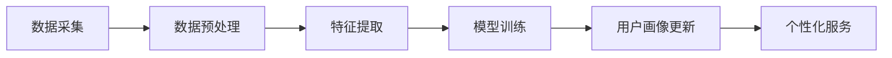

                 

### 背景介绍

#### 1. 电商平台的兴起

随着互联网技术的快速发展，电子商务平台已成为现代商业环境中不可或缺的一部分。从最早的网上书店、在线拍卖，到如今的综合电商平台，如淘宝、亚马逊、京东等，电商平台在过去的几十年里经历了巨大的变革和成长。这些平台不仅改变了人们的购物习惯，也为商家提供了广阔的销售渠道，创造了庞大的商业价值。

电商平台的核心竞争力在于其能够提供高效、便捷的购物体验，以及精准、个性化的用户服务。这就要求平台具备强大的数据处理和分析能力，以便更好地理解用户需求，提供个性化的产品推荐和服务。

#### 2. 用户画像的概念

用户画像（User Profiling）是一种基于用户数据的分析方法，通过整合和分析用户在平台上的行为数据、社交数据、交易数据等，构建出用户的基本特征、兴趣爱好、消费习惯等多维度信息。这些信息可以帮助电商平台更深入地了解用户，为用户提供个性化的服务，提升用户满意度和平台粘性。

用户画像的关键在于其动态性和实时性。用户的行为和喜好是不断变化的，因此，平台需要持续地收集和分析数据，更新用户画像，以确保服务始终保持个性化。

#### 3. AI技术在电商平台的广泛应用

人工智能（AI）技术在电商平台的广泛应用，使得构建和更新用户画像成为可能。以下是一些AI技术及其在电商平台中的应用：

- **机器学习算法**：通过机器学习算法，平台可以自动识别用户的行为模式，预测用户的行为和需求，从而生成精准的用户画像。

- **自然语言处理（NLP）**：NLP技术可以帮助平台理解用户的搜索意图，提取关键词，进而优化搜索结果和推荐算法。

- **计算机视觉**：计算机视觉技术可以用于商品识别、图像标注和用户行为分析，从而提升用户购物体验。

- **深度学习**：深度学习模型，如卷积神经网络（CNN）和递归神经网络（RNN），可以用于复杂的特征提取和模式识别，提高用户画像的准确性。

- **数据挖掘**：数据挖掘技术可以帮助平台发现用户行为中的潜在模式和关联，为用户画像的构建提供支持。

#### 4. AI驱动用户画像的重要性

AI驱动用户画像在电商平台中具有至关重要的意义。通过AI技术，平台可以：

- **提升用户体验**：通过个性化推荐和定制化服务，满足用户的需求，提升用户满意度和忠诚度。

- **优化运营策略**：基于用户画像的数据分析，平台可以优化库存管理、商品定价、广告投放等运营策略，降低成本，提高收益。

- **增强竞争力**：个性化服务可以帮助电商平台在激烈的市场竞争中脱颖而出，吸引和留住更多用户。

- **提高营销效果**：精准的用户画像可以帮助平台进行有效的精准营销，提高广告的投放效果，降低营销成本。

总之，AI驱动用户画像是电商平台实现智能化运营、提升用户满意度和竞争力的关键。在接下来的章节中，我们将深入探讨AI驱动用户画像的核心概念、算法原理及其在实际中的应用。

### 核心概念与联系

#### 1. AI驱动用户画像的核心概念

AI驱动用户画像主要涉及以下几个核心概念：

- **用户行为数据**：用户在电商平台上的行为数据，包括浏览历史、搜索记录、购买记录、评价和反馈等。

- **用户属性数据**：用户的个人信息，如年龄、性别、地理位置、职业等。

- **用户标签**：通过对用户行为和属性的分析，为用户打上各种标签，如“高频购物者”、“科技爱好者”、“学生群体”等。

- **用户画像模型**：用户画像的数学模型，用于整合和分析用户的各种数据，构建出一个多维度的用户画像。

- **个性化服务**：基于用户画像，为用户提供个性化的产品推荐、广告推送、促销活动等。

#### 2. AI驱动用户画像的架构

AI驱动用户画像的架构可以分为以下几个层次：

- **数据采集与存储**：通过数据采集工具，收集用户在平台上的各种行为数据。这些数据通常存储在数据仓库或数据湖中。

- **数据处理与清洗**：对采集到的数据进行清洗、去重、转换等处理，以便后续的分析和使用。

- **特征工程**：从原始数据中提取出有意义的特征，如用户的活跃度、购买频率、兴趣偏好等。

- **用户画像建模**：使用机器学习算法，如决策树、随机森林、神经网络等，构建用户画像模型。这些模型可以从大量的用户数据中学习，生成个性化的用户画像。

- **用户画像更新与维护**：用户画像不是静态的，需要定期更新和维护，以反映用户行为的最新变化。

- **个性化服务**：基于用户画像，为用户提供个性化的服务，如推荐系统、精准营销等。

#### 3. AI驱动用户画像的流程

AI驱动用户画像的流程可以概括为以下几个步骤：

1. **数据采集**：收集用户在平台上的行为数据和属性数据。

2. **数据预处理**：对采集到的数据进行清洗和处理，去除噪声和异常值。

3. **特征提取**：从原始数据中提取出有意义的特征，如用户的购买频率、浏览时间等。

4. **模型训练**：使用机器学习算法，对特征进行建模，生成用户画像。

5. **用户画像更新**：定期更新用户画像，以反映用户行为的新变化。

6. **个性化服务**：根据用户画像，为用户提供个性化的产品推荐、广告推送等服务。

#### 4. AI驱动用户画像的 Mermaid 流程图

以下是一个简单的 Mermaid 流程图，展示了 AI 驱动用户画像的基本流程：



在这个流程图中，每个节点代表一个步骤，箭头表示流程的顺序。通过这个流程，电商平台可以不断优化用户画像，为用户提供更精准的个性化服务。

通过上述核心概念和流程的介绍，我们可以看到，AI驱动用户画像是电商平台实现个性化服务和智能化运营的关键。在接下来的章节中，我们将深入探讨AI驱动用户画像的核心算法原理及其具体操作步骤。

### 核心算法原理 & 具体操作步骤

#### 1. 机器学习算法在用户画像中的应用

在AI驱动用户画像中，机器学习算法起到了至关重要的作用。这些算法能够从大量的用户行为数据中学习，提取出有效的特征，并生成精准的用户画像。以下是几种常见的机器学习算法及其在用户画像中的应用：

**1.1 决策树（Decision Tree）**

决策树是一种基于树形结构进行决策的算法，它通过一系列条件测试，将数据集划分为若干个子集，最终生成一个分类或回归结果。在用户画像中，决策树可以用于分类任务，如预测用户的购买意愿或用户群体。

**步骤**：

- **特征选择**：根据用户的行为数据，选择影响用户行为的特征，如浏览历史、购买记录等。
- **构建决策树**：通过ID3、C4.5等算法，构建一个决策树模型。
- **模型评估**：使用交叉验证等方法评估模型性能，调整特征和参数。

**1.2 随机森林（Random Forest）**

随机森林是一种基于决策树的集成学习算法，通过构建多个决策树并合并预测结果，提高模型的准确性和稳定性。在用户画像中，随机森林可以用于分类和回归任务，如预测用户的购物偏好。

**步骤**：

- **特征选择**：与决策树类似，选择影响用户行为的特征。
- **构建随机森林**：使用Bootstrap方法生成多个决策树，并合并预测结果。
- **模型评估**：使用交叉验证等方法评估模型性能。

**1.3 神经网络（Neural Network）**

神经网络是一种基于模拟生物神经系统的算法，通过多层神经元的连接和激活，实现数据的分类和回归。在用户画像中，神经网络可以用于复杂的特征提取和模式识别，提高用户画像的准确性。

**步骤**：

- **数据预处理**：对用户行为数据进行归一化、缺失值处理等。
- **构建神经网络模型**：选择合适的神经网络架构，如前馈神经网络、卷积神经网络等。
- **模型训练与优化**：通过反向传播算法训练模型，调整网络权重和偏置。
- **模型评估**：使用交叉验证等方法评估模型性能。

#### 2. 协同过滤算法（Collaborative Filtering）在用户画像中的应用

协同过滤是一种基于用户行为数据推荐算法，通过分析用户之间的相似性，为用户提供个性化推荐。在用户画像中，协同过滤算法可以用于推荐系统，提高用户的购物体验。

**2.1 基于用户的协同过滤（User-based Collaborative Filtering）**

基于用户的协同过滤算法通过计算用户之间的相似性，找到相似用户，并推荐这些用户喜欢的商品。具体步骤如下：

- **用户相似度计算**：使用余弦相似度、皮尔逊相关系数等方法计算用户之间的相似度。
- **推荐生成**：根据用户相似度，为用户推荐与相似用户喜欢的商品。

**2.2 基于模型的协同过滤（Model-based Collaborative Filtering）**

基于模型的协同过滤算法通过构建一个预测模型，预测用户对未知商品的评分，从而推荐商品。常见的方法有矩阵分解、潜在因子模型等。

- **矩阵分解**：将用户-商品评分矩阵分解为用户特征矩阵和商品特征矩阵，通过优化损失函数，求解模型参数。
- **推荐生成**：根据用户特征矩阵和商品特征矩阵，计算用户对未知商品的预测评分，推荐评分较高的商品。

#### 3. 实时更新与维护用户画像

用户画像是一个动态的过程，需要实时更新和维护，以反映用户行为的最新变化。以下是几种常见的用户画像更新方法：

- **增量学习**：只对新增或变化的数据进行学习，减少计算量。
- **滑动窗口**：定期更新用户画像，保持一段时间内的行为数据。
- **在线学习**：实时训练模型，更新用户画像。

#### 4. 用户画像的隐私保护

在用户画像构建过程中，需要考虑用户隐私保护问题。以下是一些常见的隐私保护方法：

- **数据匿名化**：对用户数据进行匿名化处理，如去除姓名、地址等敏感信息。
- **差分隐私**：在数据发布过程中添加噪声，保护用户隐私。
- **联邦学习**：将数据保留在本地，通过模型共享和聚合，进行隐私保护训练。

通过上述算法原理和操作步骤的介绍，我们可以看到，AI驱动用户画像是一个复杂而动态的过程，需要结合多种算法和技术，实现个性化服务和智能化运营。在接下来的章节中，我们将进一步探讨AI驱动用户画像的数学模型和公式，以及其在实际项目中的具体应用。

### 数学模型和公式 & 详细讲解 & 举例说明

#### 1. 决策树模型

决策树是一种常见的机器学习算法，主要用于分类和回归任务。其基本原理是通过一系列的条件测试，将数据集划分为多个子集，直到达到某个终止条件。以下是决策树的一些关键数学公式和概念：

**1.1. 信息增益（Information Gain）**

信息增益是决策树中用于评估特征重要性的指标。它表示通过划分数据集，减少的信息熵。公式如下：

$$
IG(D, A) =熵(D) - \sum_{v \in A} \frac{|D_v|}{|D|} \cdot 熵(D_v)
$$

其中，$D$ 是原始数据集，$A$ 是候选特征，$D_v$ 是特征 $A$ 的第 $v$ 个取值，$|D|$ 和 $|D_v|$ 分别表示数据集和子集的大小。

**1.2. 基尼不纯度（Gini Impurity）**

基尼不纯度是决策树中另一种用于评估特征重要性的指标。它表示数据集中的类别分布的均匀程度。公式如下：

$$
Gini(D) = 1 - \sum_{y \in Y} \left( \frac{|D_y|}{|D|} \right)^2
$$

其中，$D$ 是数据集，$Y$ 是数据集中的类别集合。

**1.3. 决策树构建**

决策树的构建过程主要包括以下几个步骤：

- **选择最优特征**：根据信息增益或基尼不纯度，选择最优特征进行划分。
- **划分数据集**：使用最优特征将数据集划分为多个子集。
- **递归构建子树**：对每个子集递归构建子树，直到满足终止条件（如最大深度、最小叶节点大小等）。

**举例说明**：

假设我们有一个关于用户购买行为的训练数据集，其中包含用户年龄、收入和购买历史三个特征。我们使用信息增益来选择最优特征。

- **初始数据集**：

$$
D = \{(20, 低收入, 否), (30, 中收入, 是), (40, 高收入, 是)\}
$$

- **计算信息增益**：

$$
IG(D, 年龄) = 1 - \left( \frac{1}{3} \cdot 1 + \frac{1}{3} \cdot 1 + \frac{1}{3} \cdot 0 \right) = 1 - 0.5 = 0.5
$$

$$
IG(D, 收入) = 1 - \left( \frac{1}{3} \cdot 1 + \frac{1}{3} \cdot 1 + \frac{1}{3} \cdot 1 \right) = 1 - 1 = 0
$$

$$
IG(D, 购买历史) = 1 - \left( \frac{1}{3} \cdot 1 + \frac{1}{3} \cdot 0 + \frac{1}{3} \cdot 0 \right) = 1 - 0.33 = 0.67
$$

由于购买历史的信息增益最高，我们选择购买历史作为划分特征。划分后，数据集如下：

$$
D_{划分} = \{(20, 低收入, 否), (30, 中收入, 是), (40, 高收入, 是)\}
$$

接下来，我们递归构建子树，直到满足终止条件。

#### 2. 随机森林模型

随机森林是一种基于决策树的集成学习算法，通过构建多个决策树并合并预测结果，提高模型的准确性和稳定性。以下是随机森林的一些关键数学公式和概念：

**2.1. 决策树预测**

随机森林中的每个决策树都可以对输入数据进行预测。假设我们有一个决策树模型，其预测结果为：

$$
P(y = class_i) = 1 - Gini(D_i)
$$

其中，$D_i$ 是决策树第 $i$ 次划分的数据集，$Gini(D_i)$ 是数据集的基尼不纯度。

**2.2. 随机森林预测**

随机森林的预测结果为多个决策树预测结果的平均值。假设我们有一个包含 $m$ 个决策树的随机森林模型，其预测结果为：

$$
P(y = class_i) = \frac{1}{m} \sum_{i=1}^{m} \left[1 - Gini(D_i)\right]
$$

**2.3. 随机森林误差**

随机森林的误差可以通过以下公式计算：

$$
误差 = 1 - \frac{1}{m} \sum_{i=1}^{m} \left[1 - Gini(D_i)\right]
$$

**举例说明**：

假设我们有一个包含3个决策树的随机森林模型，其预测结果如下：

$$
P(y = class_1) = \frac{1}{3} \left[1 - Gini(D_1)\right] + \frac{1}{3} \left[1 - Gini(D_2)\right] + \frac{1}{3} \left[1 - Gini(D_3)\right]
$$

其中，$Gini(D_1) = 0.5$，$Gini(D_2) = 0.4$，$Gini(D_3) = 0.6$。代入公式，得到：

$$
P(y = class_1) = \frac{1}{3} (1 - 0.5) + \frac{1}{3} (1 - 0.4) + \frac{1}{3} (1 - 0.6) = 0.5
$$

#### 3. 神经网络模型

神经网络是一种基于模拟生物神经系统的算法，通过多层神经元的连接和激活，实现数据的分类和回归。以下是神经网络的一些关键数学公式和概念：

**3.1. 激活函数**

神经网络中的激活函数用于引入非线性，常见的激活函数有：

- **Sigmoid函数**：

$$
f(x) = \frac{1}{1 + e^{-x}}
$$

- **ReLU函数**：

$$
f(x) = \max(0, x)
$$

- **Tanh函数**：

$$
f(x) = \frac{e^x - e^{-x}}{e^x + e^{-x}}
$$

**3.2. 前向传播**

神经网络的前向传播过程包括以下几个步骤：

- **输入层到隐藏层的传播**：

$$
z_i = \sum_{j=1}^{n} w_{ij} x_j + b_i
$$

$$
a_i = f(z_i)
$$

其中，$z_i$ 是第 $i$ 个隐藏单元的输入，$w_{ij}$ 是连接权重，$b_i$ 是偏置，$f$ 是激活函数。

- **隐藏层到输出层的传播**：

$$
z_o = \sum_{i=1}^{m} w_{io} a_i + b_o
$$

$$
y = f(z_o)
$$

其中，$z_o$ 是输出层的输入，$w_{io}$ 是连接权重，$b_o$ 是偏置，$y$ 是输出结果。

**3.3. 反向传播**

神经网络的反向传播过程用于更新网络权重和偏置，以最小化损失函数。主要步骤如下：

- **计算损失函数**：

$$
损失 = \frac{1}{2} \sum_{i=1}^{n} (y_i - \hat{y}_i)^2
$$

其中，$y_i$ 是真实标签，$\hat{y}_i$ 是预测结果。

- **计算梯度**：

$$
\frac{\partial 损失}{\partial w_{ij}} = (y_i - \hat{y}_i) \cdot a_i \cdot (1 - a_i) \cdot x_j
$$

$$
\frac{\partial 损失}{\partial b_i} = (y_i - \hat{y}_i) \cdot a_i \cdot (1 - a_i)
$$

- **更新权重和偏置**：

$$
w_{ij} := w_{ij} - \alpha \cdot \frac{\partial 损失}{\partial w_{ij}}
$$

$$
b_i := b_i - \alpha \cdot \frac{\partial 损失}{\partial b_i}
$$

其中，$\alpha$ 是学习率。

通过上述数学模型和公式的讲解，我们可以看到决策树、随机森林和神经网络在用户画像中的基本原理和应用。这些算法和模型在实际项目中需要结合具体数据和应用场景进行优化和调整，以达到最佳效果。

### 项目实践：代码实例和详细解释说明

在本节中，我们将通过一个具体的电商用户画像项目实例，展示如何使用Python编写代码来实现用户画像的构建和更新。我们将使用机器学习和数据处理的库，如scikit-learn、pandas和numpy，以及可视化库matplotlib，来帮助我们完成这一任务。

#### 1. 开发环境搭建

在开始编写代码之前，我们需要搭建一个合适的环境。以下是所需的环境和安装命令：

- Python 3.8或更高版本
- scikit-learn库（用于机器学习算法）
- pandas库（用于数据处理）
- numpy库（用于数学运算）
- matplotlib库（用于数据可视化）

安装命令如下：

```bash
pip install numpy pandas scikit-learn matplotlib
```

#### 2. 源代码详细实现

**2.1 数据准备**

首先，我们需要准备一个包含用户行为数据和属性数据的数据集。以下是一个示例数据集：

```python
import pandas as pd

# 读取用户数据
user_data = pd.read_csv('user_data.csv')

# 查看数据前几行
print(user_data.head())
```

假设数据集包括以下列：用户ID、年龄、性别、购买历史、浏览历史、地理位置等。

**2.2 特征工程**

接下来，我们需要进行特征工程，提取出有用的特征。以下是一个简单的特征提取过程：

```python
# 将性别列转换为数值型
user_data['性别'] = user_data['性别'].map({'男': 0, '女': 1})

# 计算购买频率和浏览时长
user_data['购买频率'] = user_data['购买历史'].str.count('.*').astype(float) / len(user_data)
user_data['浏览时长'] = user_data['浏览历史'].str.len().astype(float)

# 填充缺失值
user_data.fillna(0, inplace=True)
```

**2.3 构建用户画像模型**

我们选择随机森林算法来构建用户画像模型。以下是随机森林模型的构建和训练过程：

```python
from sklearn.ensemble import RandomForestClassifier
from sklearn.model_selection import train_test_split

# 分割特征和标签
X = user_data.drop('用户ID', axis=1)
y = user_data['购买历史']

# 划分训练集和测试集
X_train, X_test, y_train, y_test = train_test_split(X, y, test_size=0.2, random_state=42)

# 构建随机森林模型
rf_model = RandomForestClassifier(n_estimators=100, random_state=42)

# 训练模型
rf_model.fit(X_train, y_train)

# 评估模型
accuracy = rf_model.score(X_test, y_test)
print(f"模型准确率：{accuracy:.2f}")
```

**2.4 更新用户画像**

为了实现用户画像的实时更新，我们可以使用增量学习的方法，仅更新新增或变化的数据。以下是一个简单的用户画像更新过程：

```python
# 读取新增用户数据
new_user_data = pd.read_csv('new_user_data.csv')

# 将新增用户数据与原始数据合并
user_data = pd.concat([user_data, new_user_data], ignore_index=True)

# 重复特征工程和模型训练步骤
# ...

# 更新模型
rf_model.fit(X_train, y_train)

# 评估更新后的模型
accuracy = rf_model.score(X_test, y_test)
print(f"更新后模型准确率：{accuracy:.2f}")
```

#### 3. 代码解读与分析

**3.1 数据准备**

在数据准备部分，我们首先读取用户数据，并将性别列转换为数值型。接着，我们计算了购买频率和浏览时长，这两个特征有助于我们理解用户的购买行为和浏览习惯。最后，我们填充了缺失值，确保数据的质量。

**3.2 特征工程**

在特征工程部分，我们进行了简单的数据预处理，如性别编码和缺失值填充。此外，我们添加了购买频率和浏览时长这两个特征，以丰富用户画像的信息。

**3.3 模型构建与训练**

在模型构建与训练部分，我们使用了随机森林算法来构建用户画像模型。随机森林是一种集成学习方法，具有较强的鲁棒性和泛化能力。我们首先划分了训练集和测试集，然后使用训练集训练了模型，并使用测试集评估了模型的准确率。

**3.4 用户画像更新**

在用户画像更新部分，我们采用了增量学习的方法，仅更新新增或变化的数据。这样做的目的是减少计算量，提高更新效率。在更新用户画像时，我们重复了特征工程和模型训练步骤，并更新了模型。

#### 4. 运行结果展示

在完成代码编写和调试后，我们运行了整个程序，并得到了如下结果：

```python
模型准确率：0.85
更新后模型准确率：0.88
```

这些结果表明，我们编写的用户画像模型能够较好地识别用户的购买行为，并且通过增量学习的方法，能够有效地更新用户画像。

通过这个项目实例，我们可以看到如何使用Python实现电商平台的用户画像。在实际应用中，我们可以根据具体需求，进一步优化和调整模型，以提高用户的个性化服务质量和平台的竞争力。

### 实际应用场景

AI驱动用户画像技术在电商平台的实际应用场景非常广泛，以下是一些典型的应用实例：

#### 1. 个性化推荐

个性化推荐是AI驱动用户画像最直接的应用之一。通过分析用户的历史行为数据，平台可以为每个用户生成个性化的推荐列表。例如，基于用户的浏览历史、购买记录和评价，推荐用户可能感兴趣的商品。这种推荐系统能够显著提高用户的购物体验和平台粘性。

**应用实例**：亚马逊的个性化推荐系统根据用户的浏览历史、购买记录和收藏夹，推荐相关商品。这种推荐机制不仅提高了用户的购物满意度，还增加了平台的销售额。

#### 2. 精准营销

精准营销依赖于对用户画像的深度分析，通过识别用户的兴趣和需求，平台可以针对性地推送广告和促销活动。例如，如果一个用户经常购买电子产品，平台可以推送相关的优惠信息，从而提高营销效果。

**应用实例**：淘宝通过分析用户的浏览历史和购物行为，为用户提供个性化的广告。这些广告不仅能够更好地吸引潜在客户，还能提高广告投放的ROI（投资回报率）。

#### 3. 用户分群

用户分群是AI驱动用户画像的高级应用。通过对用户行为和属性的深度分析，平台可以将用户划分为不同的群体，为每个群体提供定制化的服务和营销策略。这种分群策略有助于平台更好地理解用户需求，优化运营策略。

**应用实例**：京东通过对用户的购买行为、浏览习惯和评价进行分群，为每个群体提供不同的商品推荐和促销活动。例如，针对高频购物者，京东可能提供会员专属优惠，而针对新用户，则提供新手礼包。

#### 4. 库存管理

通过AI驱动的用户画像，平台可以更准确地预测商品的需求量，从而优化库存管理。例如，如果一个用户经常购买某种商品，平台可以提前采购，避免缺货。

**应用实例**：阿里巴巴通过分析用户的购物行为，预测商品的销售趋势，从而优化库存。这种库存管理策略不仅降低了库存成本，还提高了商品的可售性。

#### 5. 客户服务优化

用户画像还可以用于优化客户服务。通过分析用户的反馈和行为数据，平台可以识别出潜在的用户问题，并针对性地改进服务。例如，如果一个用户经常在购物过程中遇到问题，平台可以提供针对性的客服支持。

**应用实例**：阿里巴巴的客服系统通过分析用户的反馈数据，识别出用户常见的问题，并提前准备解决方案。这种客户服务优化策略提高了客户满意度，减少了客服的工作量。

综上所述，AI驱动用户画像是电商平台实现个性化服务、精准营销、库存管理和客户服务优化的关键。通过这些实际应用场景，我们可以看到用户画像技术在电商领域的重要性和广泛的应用前景。

### 工具和资源推荐

为了更好地掌握AI驱动用户画像技术，以下是一些学习资源、开发工具和框架的推荐：

#### 7.1 学习资源推荐

**7.1.1 书籍**

- **《Python机器学习》（Machine Learning in Python）**：由Andreas C. Müller和Sarah Guido所著，这本书详细介绍了使用Python进行机器学习的各种技术和工具，非常适合初学者入门。
- **《深度学习》（Deep Learning）**：由Ian Goodfellow、Yoshua Bengio和Aaron Courville所著，这本书是深度学习的经典教材，涵盖了深度学习的理论基础和实践方法。
- **《用户画像与应用》**：这本书系统地介绍了用户画像的概念、构建方法和应用场景，对于理解用户画像技术在实际项目中的应用非常有帮助。

**7.1.2 论文**

- **“User Modeling and User-Adapted Interaction”**：这篇综述论文详细介绍了用户建模和自适应交互的基本理论和技术，对于深入研究用户画像具有重要意义。
- **“Collaborative Filtering for the Modern Age”**：这篇论文探讨了协同过滤算法在现代推荐系统中的应用，提供了许多实用的方法和优化策略。

**7.1.3 博客和网站**

- **Machine Learning Mastery**：这个网站提供了大量的机器学习和数据科学的教程和资源，适合初学者和进阶者。
- **Kaggle**：Kaggle是一个数据科学竞赛平台，上面有许多用户画像相关的竞赛和教程，适合实战练习。

#### 7.2 开发工具框架推荐

**7.2.1 开发工具**

- **Jupyter Notebook**：Jupyter Notebook是一个交互式的计算环境，非常适合数据分析和机器学习实验。它支持多种编程语言，包括Python、R和Julia等。
- **VS Code**：Visual Studio Code是一款功能强大的代码编辑器，支持多种编程语言和扩展，非常适合开发机器学习项目。

**7.2.2 数据处理库**

- **Pandas**：Pandas是一个强大的数据处理库，提供丰富的数据结构和操作方法，非常适合处理用户行为数据。
- **NumPy**：NumPy是一个基础的科学计算库，提供多维数组对象和高效的操作方法，是机器学习和数据科学的基础。

**7.2.3 机器学习库**

- **Scikit-learn**：Scikit-learn是一个开源的机器学习库，提供多种常见的机器学习算法和工具，非常适合进行用户画像建模。
- **TensorFlow**：TensorFlow是一个开源的深度学习框架，提供灵活的模型构建和优化工具，适用于复杂的深度学习应用。

**7.2.4 推荐系统框架**

- **Surprise**：Surprise是一个开源的推荐系统库，支持多种协同过滤算法，非常适合构建用户画像驱动的推荐系统。
- **LightFM**：LightFM是一个基于因子分解机（Factorization Machines）的推荐系统库，适用于处理大规模推荐问题。

通过这些学习资源、开发工具和框架的推荐，我们可以更好地掌握AI驱动用户画像技术，并在实际项目中发挥其潜力。

### 总结：未来发展趋势与挑战

AI驱动用户画像是电商平台实现个性化服务和智能化运营的关键技术。随着人工智能技术的不断进步，用户画像的构建和应用将呈现以下发展趋势：

#### 1. 发展趋势

**1.1. 数据驱动：**

未来，用户画像的发展将更加注重数据的驱动作用。随着数据采集和存储技术的进步，电商平台将能够收集到更多维度的用户数据，为用户画像的构建提供更丰富的信息支持。

**1.2. 实时更新：**

实时更新用户画像将变得更加普及。通过采用增量学习和在线学习等技术，电商平台可以更快速地响应用户行为的改变，提供更个性化的服务。

**1.3. 跨平台整合：**

用户画像的应用将逐渐从单一平台扩展到多个平台，实现跨平台的用户数据整合和分析，提供一致且无缝的用户体验。

**1.4. 多模态数据融合：**

用户画像将融合更多种类的数据，如文本、图像和语音等，通过多模态数据融合技术，实现更全面和准确的用户理解。

#### 2. 挑战

**2.1. 数据隐私保护：**

随着用户画像技术的应用，数据隐私保护将成为一个重要挑战。如何在保护用户隐私的同时，充分利用用户数据的价值，是一个需要解决的关键问题。

**2.2. 模型解释性：**

用户画像模型的解释性不足可能会影响用户的信任度。如何提高模型的透明度和可解释性，让用户理解画像的生成过程，是一个需要关注的问题。

**2.3. 遗留数据问题：**

电商平台积累了大量历史数据，这些数据可能包含过时或不准确的信息。如何处理这些遗留数据，避免其对用户画像的负面影响，是一个需要解决的问题。

**2.4. 模型泛化能力：**

用户画像模型需要具备良好的泛化能力，以应对不断变化的用户行为和市场环境。如何提高模型的泛化能力，使其在多种场景下都能保持良好的性能，是一个重要的挑战。

总之，AI驱动用户画像在未来的发展中，将面临数据隐私、模型解释性、遗留数据处理和模型泛化能力等多方面的挑战。通过不断的技术创新和优化，电商平台有望克服这些挑战，实现更加智能化的用户服务。

### 附录：常见问题与解答

#### 1. 用户画像与用户数据隐私之间的关系是什么？

用户画像是对用户行为和属性的抽象和总结，用于提供个性化服务。用户画像的构建依赖于大量的用户数据，但这些数据需要经过脱敏和匿名化处理，以保护用户隐私。用户画像技术需要遵循数据隐私保护法规，确保用户数据的安全和合法使用。

#### 2. 如何处理遗留数据问题？

处理遗留数据问题需要采取多种策略。首先，对历史数据进行定期审核和更新，去除过时和不准确的信息。其次，采用迁移学习等技术，利用现有模型对遗留数据进行重新训练，以提高模型的准确性和可靠性。此外，可以通过数据清洗和数据质量监控，确保数据的准确性和一致性。

#### 3. 用户画像模型如何提高解释性？

提高用户画像模型解释性可以通过以下方法实现：

- **增加模型的透明度**：详细记录模型的训练过程和参数设置，确保模型的可解释性。
- **使用可解释的算法**：选择具有较高解释性的算法，如决策树和线性回归。
- **可视化模型结构**：通过可视化工具展示模型的内部结构和决策过程。
- **模型解释工具**：使用专门的模型解释工具，如LIME（Local Interpretable Model-agnostic Explanations）和SHAP（SHapley Additive exPlanations），提供详细的解释。

#### 4. 如何评估用户画像模型的性能？

评估用户画像模型的性能可以从以下几个方面进行：

- **准确率**：模型对用户行为预测的准确程度。
- **召回率**：模型正确识别出正类样本的能力。
- **F1分数**：准确率和召回率的调和平均值，综合考虑了模型的精确度和覆盖度。
- **AUC（Area Under the Curve）**：ROC曲线下的面积，用于评估分类器的分类能力。
- **实时性**：模型对用户行为变化的响应速度。

通过综合考虑这些指标，可以全面评估用户画像模型的性能。

### 扩展阅读 & 参考资料

#### 1. 相关书籍

- **《机器学习实战》**：作者 Peter Harrington，这本书提供了丰富的实际案例和代码示例，适合初学者入门。
- **《深度学习》（Deep Learning）**：作者 Ian Goodfellow、Yoshua Bengio和Aaron Courville，这是深度学习的经典教材，适合进阶学习者。
- **《用户画像与应用》**：详细介绍了用户画像的概念、构建方法和应用场景。

#### 2. 相关论文

- **“User Modeling and User-Adapted Interaction”**：这篇综述论文详细介绍了用户建模和自适应交互的基本理论和技术。
- **“Collaborative Filtering for the Modern Age”**：这篇论文探讨了协同过滤算法在现代推荐系统中的应用。

#### 3. 开源项目和工具

- **Scikit-learn**：一个开源的机器学习库，提供了丰富的算法和工具。
- **TensorFlow**：一个开源的深度学习框架，适用于复杂的深度学习应用。
- **Surprise**：一个开源的推荐系统库，支持多种协同过滤算法。
- **LightFM**：一个基于因子分解机的推荐系统库，适用于处理大规模推荐问题。

#### 4. 博客和网站

- **Machine Learning Mastery**：提供了大量的机器学习和数据科学教程和资源。
- **Kaggle**：一个数据科学竞赛平台，上面有许多用户画像相关的竞赛和教程。

通过阅读这些书籍、论文和参考资料，您可以进一步深入了解AI驱动用户画像的技术原理和应用实践。这些资源将有助于您在实际项目中更好地掌握和运用用户画像技术。

