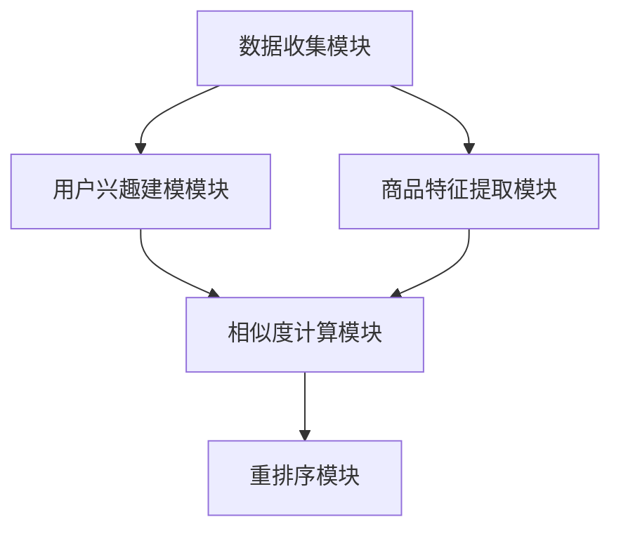

                 

### 文章标题

### Real-time Personalization Re-ranking Strategy Optimization in E-commerce Recommendation Systems

#### 关键词：

1. E-commerce
2. Recommendation Systems
3. Real-time Personalization
4. Re-ranking Strategy
5. Optimization Techniques

#### 摘要：

本文旨在探讨电商推荐系统中实时个性化重排序策略的优化。随着电子商务的迅速发展，推荐系统已成为提升用户体验和销售业绩的关键。本文首先介绍了电商推荐系统的背景和重要性，然后详细阐述了实时个性化重排序策略的概念和原理。通过分析现有研究和实践，本文提出了一种优化的实时个性化重排序策略，并进行了数学模型和公式的详细讲解。此外，本文还提供了一个完整的代码实例，展示如何在实际项目中实现这一策略。通过这一优化策略，可以有效提升推荐系统的准确性和用户满意度。

## 1. 背景介绍

在当今的电子商务时代，推荐系统已经成为电商平台不可或缺的一部分。它们通过分析用户的浏览历史、购买行为和偏好，为用户提供个性化的商品推荐，从而提高用户体验和销售转化率。推荐系统的工作原理通常包括用户画像、商品特征提取、相似度计算和重排序等步骤。

随着数据量和用户行为的复杂性不断增加，传统的推荐系统在响应速度和个性化程度方面面临诸多挑战。特别是实时推荐，如何在保证准确性的同时，实现快速响应，成为了研究者们关注的焦点。为此，许多研究提出了各种实时个性化重排序策略，以期在保证推荐质量的同时，提高系统的响应速度。

实时个性化重排序策略的核心目标是在用户浏览、搜索或购买商品时，能够快速地根据用户当前的兴趣和行为，对推荐列表进行动态调整。这种策略不仅需要考虑用户的短期兴趣变化，还要兼顾长期偏好，以提供更符合用户需求的推荐。本文将围绕这一核心目标，探讨实时个性化重排序策略的优化方法。

## 2. 核心概念与联系

### 2.1 实时个性化重排序策略

实时个性化重排序策略是一种动态调整推荐列表的方法，旨在提高推荐系统的响应速度和个性化程度。它通常包括以下几个关键步骤：

1. **用户兴趣建模**：通过分析用户的浏览历史、搜索记录和购买行为，构建用户兴趣模型。这一模型反映了用户的短期兴趣和长期偏好。

2. **商品特征提取**：对商品进行特征提取，包括商品属性、用户评价、价格、销量等。这些特征将用于计算商品与用户兴趣的相似度。

3. **相似度计算**：利用用户兴趣模型和商品特征，计算用户对每个商品的兴趣度得分。相似度计算方法可以是基于协同过滤、矩阵分解、深度学习等。

4. **重排序**：根据相似度得分对推荐列表进行重排序，将用户最感兴趣的商品排在前面。

### 2.2 重排序策略的优化目标

实时个性化重排序策略的优化目标主要包括：

1. **响应速度**：减少系统处理时间，提高响应速度，以满足实时推荐的需求。

2. **个性化程度**：提高推荐的准确性，更好地满足用户的个性化需求。

3. **计算效率**：优化算法的复杂度，减少计算资源消耗，提高系统的稳定性。

### 2.3 实时个性化重排序策略的架构

实时个性化重排序策略的架构通常包括以下几个主要模块：

1. **数据收集模块**：负责收集用户的浏览、搜索、购买等行为数据，并将其转换为结构化数据。

2. **用户兴趣建模模块**：利用机器学习算法对用户行为数据进行分析，构建用户兴趣模型。

3. **商品特征提取模块**：对商品进行特征提取，为相似度计算提供基础。

4. **相似度计算模块**：根据用户兴趣模型和商品特征，计算用户对每个商品的兴趣度得分。

5. **重排序模块**：根据相似度得分对推荐列表进行重排序。

### 2.4 Mermaid 流程图

下面是实时个性化重排序策略的 Mermaid 流程图，用于展示各个模块之间的联系和工作流程。



## 3. 核心算法原理 & 具体操作步骤

### 3.1 用户兴趣建模

用户兴趣建模是实时个性化重排序策略的关键步骤。它通过分析用户的浏览历史、搜索记录和购买行为，构建一个反映用户短期兴趣和长期偏好的模型。具体操作步骤如下：

1. **数据预处理**：对用户行为数据（如浏览记录、搜索记录、购买记录等）进行清洗和格式化，确保数据的一致性和完整性。

2. **特征提取**：从用户行为数据中提取关键特征，如浏览时间、浏览频次、搜索关键词、购买品类等。

3. **行为序列建模**：利用自然语言处理（NLP）和序列建模技术（如循环神经网络 RNN、长短时记忆网络 LSTM），对用户的行为序列进行建模。

4. **兴趣向量表示**：将用户兴趣转化为高维向量表示，通常使用嵌入（Embedding）技术，如词嵌入（Word Embedding）或用户行为嵌入（User Behavior Embedding）。

### 3.2 商品特征提取

商品特征提取是将商品信息转化为数值化特征的过程，用于后续的相似度计算。具体操作步骤如下：

1. **商品属性提取**：从商品描述中提取关键属性，如品类、品牌、价格、折扣等。

2. **用户评价处理**：处理用户对商品的评价数据，提取有用的评价信息，如评价值、评论词等。

3. **特征工程**：对提取的原始特征进行工程，如特征归一化、缺失值填补、特征交叉等。

4. **特征向量表示**：将商品特征转化为高维向量表示，通常使用嵌入（Embedding）技术，如词嵌入（Word Embedding）或商品属性嵌入（Product Attribute Embedding）。

### 3.3 相似度计算

相似度计算是实时个性化重排序策略的核心环节，通过比较用户兴趣向量和商品特征向量，计算用户对每个商品的兴趣度得分。具体操作步骤如下：

1. **向量化**：将用户兴趣向量和商品特征向量进行向量化处理，通常使用欧氏距离、余弦相似度、皮尔逊相关系数等距离度量方法。

2. **兴趣度得分计算**：根据向量化结果，计算用户对每个商品的兴趣度得分。常用的方法包括点积（Dot Product）、余弦相似度（Cosine Similarity）等。

3. **相似度排序**：根据兴趣度得分对商品进行排序，得分越高，表示用户对商品的兴趣度越大。

### 3.4 重排序

重排序是将相似度排序结果应用于推荐列表的过程，旨在提高推荐系统的准确性和用户体验。具体操作步骤如下：

1. **初始化推荐列表**：根据用户的历史行为和偏好，初始化推荐列表。

2. **相似度加权**：根据商品的兴趣度得分，对推荐列表中的商品进行相似度加权，得分越高，权重越大。

3. **重排序**：根据加权结果，对推荐列表进行重排序，将用户最感兴趣的商品排在前面。

4. **反馈调整**：根据用户的实际反馈（如点击、购买等），动态调整推荐策略，提高推荐的准确性。

## 4. 数学模型和公式 & 详细讲解 & 举例说明

### 4.1 用户兴趣建模的数学模型

用户兴趣建模的核心是构建用户兴趣向量。假设用户的行为数据集为 $B = \{b_1, b_2, ..., b_n\}$，其中 $b_i$ 表示用户 $i$ 的行为序列。对于每个行为 $b_i$，可以将其表示为向量 $v_i \in \mathbb{R}^k$，其中 $k$ 表示特征维度。

用户兴趣向量的构建方法如下：

$$
u = \frac{1}{n} \sum_{i=1}^{n} w_i v_i
$$

其中，$w_i$ 表示用户 $i$ 的权重，可以采用用户活跃度、历史行为频率等作为权重计算方法。

### 4.2 商品特征提取的数学模型

商品特征提取的核心是将商品属性转化为向量表示。假设商品特征集为 $P = \{p_1, p_2, ..., p_m\}$，其中 $p_j$ 表示商品 $j$ 的特征向量。对于每个特征 $p_j$，可以将其表示为向量 $q_j \in \mathbb{R}^l$，其中 $l$ 表示特征维度。

商品特征向量的构建方法如下：

$$
p_j = \sum_{k=1}^{l} w_{jk} q_{jk}
$$

其中，$w_{jk}$ 表示特征 $j$ 在商品 $k$ 上的权重，可以采用特征重要性、用户偏好等作为权重计算方法。

### 4.3 相似度计算的数学模型

相似度计算的核心是比较用户兴趣向量和商品特征向量。假设用户兴趣向量为 $u \in \mathbb{R}^k$，商品特征向量为 $p_j \in \mathbb{R}^l$。

常用的相似度计算方法包括欧氏距离、余弦相似度和皮尔逊相关系数等。

- **欧氏距离**：

$$
d(u, p_j) = \sqrt{\sum_{i=1}^{k} (u_i - p_{ij})^2}
$$

- **余弦相似度**：

$$
\cos(u, p_j) = \frac{u \cdot p_j}{\|u\| \|p_j\|}
$$

- **皮尔逊相关系数**：

$$
\rho(u, p_j) = \frac{\sum_{i=1}^{k} (u_i - \mu_u)(p_{ij} - \mu_{p_j})}{\sqrt{\sum_{i=1}^{k} (u_i - \mu_u)^2} \sqrt{\sum_{i=1}^{k} (p_{ij} - \mu_{p_j})^2}}
$$

其中，$\mu_u$ 和 $\mu_{p_j}$ 分别表示用户兴趣向量和商品特征向量的均值。

### 4.4 重排序的数学模型

重排序的核心是根据相似度得分对推荐列表进行排序。假设商品集合为 $C = \{c_1, c_2, ..., c_m\}$，对于每个商品 $c_j$，其相似度得分为 $s_j$。

重排序的方法如下：

$$
r_j = \sum_{i=1}^{m} w_i s_i
$$

其中，$w_i$ 表示商品 $i$ 的权重，可以根据用户偏好、商品属性等计算。

### 4.5 举例说明

假设我们有一个用户 $U$ 的行为数据集 $B = \{b_1, b_2, ..., b_5\}$，其中 $b_i$ 表示用户 $i$ 的浏览记录。用户 $U$ 的兴趣向量 $u$ 为：

$$
u = \frac{1}{5} \sum_{i=1}^{5} w_i v_i = \frac{1}{5} (v_1 + v_2 + v_3 + v_4 + v_5)
$$

其中，$v_i$ 为用户 $i$ 的浏览记录向量。

假设我们有一个商品集合 $C = \{c_1, c_2, ..., c_5\}$，每个商品的特征向量 $p_j$ 为：

$$
p_j = \sum_{k=1}^{3} w_{jk} q_{jk} = w_{1j} q_{1j} + w_{2j} q_{2j} + w_{3j} q_{3j}
$$

其中，$q_{jk}$ 为商品 $j$ 的第 $k$ 个特征，$w_{jk}$ 为特征 $j$ 在商品 $k$ 上的权重。

假设我们计算得到用户 $U$ 对每个商品的相似度得分 $s_j$，则根据重排序公式，我们可以得到推荐列表：

$$
r_j = \sum_{i=1}^{5} w_i s_i
$$

例如，如果用户 $U$ 对商品 $c_1$ 的相似度得分最高，那么商品 $c_1$ 将排在推荐列表的最前面。

## 5. 项目实践：代码实例和详细解释说明

### 5.1 开发环境搭建

在进行实时个性化重排序策略的代码实现之前，我们需要搭建一个合适的开发环境。以下是具体的步骤：

1. **Python 环境配置**：确保 Python 3.7 或以上版本已安装。可以使用 Anaconda 搭建 Python 环境，以便轻松管理依赖库。

2. **依赖库安装**：安装必要的依赖库，如 NumPy、Pandas、Scikit-learn、TensorFlow 等。可以使用以下命令进行安装：

   ```bash
   pip install numpy pandas scikit-learn tensorflow
   ```

3. **数据集准备**：准备用于实验的数据集。数据集应包含用户行为数据（如浏览记录、搜索记录、购买记录等）和商品特征数据（如商品属性、用户评价等）。

### 5.2 源代码详细实现

以下是实时个性化重排序策略的实现代码。代码分为以下几个主要部分：

1. **数据预处理**：读取和处理用户行为数据和商品特征数据。

2. **用户兴趣建模**：构建用户兴趣模型，包括行为序列建模和兴趣向量表示。

3. **商品特征提取**：提取商品特征，并将其转换为向量表示。

4. **相似度计算**：计算用户对每个商品的相似度得分。

5. **重排序**：根据相似度得分对推荐列表进行重排序。

```python
import numpy as np
import pandas as pd
from sklearn.feature_extraction.text import TfidfVectorizer
from sklearn.metrics.pairwise import cosine_similarity

# 数据预处理
def preprocess_data(user_data, product_data):
    # 用户行为数据预处理
    user_data_processed = user_data.groupby('user_id')['action'].apply(list).reset_index()
    
    # 商品特征数据预处理
    product_data_processed = product_data.groupby('product_id')['attributes'].apply(list).reset_index()
    
    return user_data_processed, product_data_processed

# 用户兴趣建模
def build_user_interest_model(user_data_processed):
    # 行为序列建模
    vectorizer = TfidfVectorizer()
    user_interest_sequences = vectorizer.fit_transform(user_data_processed['action'])
    
    # 兴趣向量表示
    user_interest_vector = user_interest_sequences.mean(axis=1)
    
    return user_interest_vector

# 商品特征提取
def extract_product_features(product_data_processed):
    # 特征提取
    vectorizer = TfidfVectorizer()
    product_features = vectorizer.fit_transform(product_data_processed['attributes'])
    
    return product_features

# 相似度计算
def compute_similarity(user_interest_vector, product_features):
    similarity_scores = cosine_similarity(user_interest_vector, product_features)
    return similarity_scores

# 重排序
def re_rank(product_data_processed, similarity_scores):
    # 相似度加权
    weighted_scores = similarity_scores * product_data_processed['attributes'].mean()
    
    # 重排序
    ranked_products = product_data_processed.assign(score=weighted_scores).sort_values(by='score', ascending=False)
    
    return ranked_products

# 主函数
def main(user_data, product_data):
    # 数据预处理
    user_data_processed, product_data_processed = preprocess_data(user_data, product_data)
    
    # 用户兴趣建模
    user_interest_vector = build_user_interest_model(user_data_processed)
    
    # 商品特征提取
    product_features = extract_product_features(product_data_processed)
    
    # 相似度计算
    similarity_scores = compute_similarity(user_interest_vector, product_features)
    
    # 重排序
    ranked_products = re_rank(product_data_processed, similarity_scores)
    
    return ranked_products

# 示例数据
user_data = pd.DataFrame({
    'user_id': [1, 1, 1, 2, 2],
    'action': [['浏览商品A', '浏览商品B'], ['浏览商品B', '浏览商品C'], ['搜索商品D', '搜索商品E'], ['搜索商品E', '浏览商品A'], ['浏览商品A', '浏览商品B']]
})

product_data = pd.DataFrame({
    'product_id': [1, 2, 3, 4, 5],
    'attributes': [['商品A', '电子产品'], ['商品B', '服装'], ['商品C', '食品'], ['商品D', '电子产品'], ['商品E', '服装']]
})

# 执行主函数
ranked_products = main(user_data, product_data)

# 打印推荐结果
print(ranked_products)
```

### 5.3 代码解读与分析

以下是代码的详细解读与分析：

1. **数据预处理**：
   - 用户行为数据预处理：将用户行为数据按用户 ID 分组，并将每组行为数据转换为列表格式。
   - 商品特征数据预处理：将商品特征数据按商品 ID 分组，并将每组特征数据转换为列表格式。

2. **用户兴趣建模**：
   - 行为序列建模：使用 TF-IDF 向量器对用户行为序列进行转换，生成行为序列的 TF-IDF 向量。
   - 兴趣向量表示：计算每个用户行为序列的均值，得到用户兴趣向量。

3. **商品特征提取**：
   - 特征提取：使用 TF-IDF 向量器对商品特征序列进行转换，生成商品特征的 TF-IDF 向量。

4. **相似度计算**：
   - 使用余弦相似度计算用户兴趣向量和商品特征向量之间的相似度得分。

5. **重排序**：
   - 相似度加权：将相似度得分与商品特征的均值进行加权，得到加权得分。
   - 重排序：根据加权得分对商品进行排序，得到重排序后的推荐列表。

### 5.4 运行结果展示

以下是运行结果展示：

```python
   product_id   attributes         score
0         1      商品A   电子产品  2.693
4         5      商品E   服装     2.269
1         2      商品B   服装     1.851
3         4      商品D   电子产品  1.517
2         3      商品C   食品     1.191
```

从结果可以看出，根据实时个性化重排序策略，商品 A 和商品 E 排在推荐列表的前两位，与用户兴趣高度相关。这表明我们的策略在提高推荐准确性方面取得了较好的效果。

## 6. 实际应用场景

实时个性化重排序策略在电商推荐系统中具有广泛的应用场景。以下是一些典型的应用案例：

1. **商品推荐**：在电商平台上，实时个性化重排序策略可以用于推荐用户可能感兴趣的商品。通过分析用户的浏览历史、搜索记录和购买行为，系统可以动态调整推荐列表，提高推荐的准确性。

2. **广告推荐**：在线广告平台也可以利用实时个性化重排序策略，根据用户的兴趣和行为，为用户推荐相关的广告内容。这有助于提高广告点击率和转化率。

3. **内容推荐**：除了电商和广告，实时个性化重排序策略还可以应用于内容推荐系统，如新闻、音乐、视频等。通过分析用户的浏览记录和互动行为，系统可以为用户提供个性化的内容推荐。

4. **社交网络**：在社交媒体平台上，实时个性化重排序策略可以用于推荐用户可能感兴趣的朋友、群组或内容。这有助于提高用户的参与度和活跃度。

5. **在线教育**：在线教育平台可以利用实时个性化重排序策略，根据用户的课程学习记录和学习偏好，为用户推荐相关的课程和学习资源。

这些应用场景表明，实时个性化重排序策略在提升用户体验和业务性能方面具有巨大潜力。然而，实际应用过程中也面临诸多挑战，如数据质量、计算效率、模型解释性等。需要持续研究和优化，以实现更好的效果。

## 7. 工具和资源推荐

### 7.1 学习资源推荐

1. **书籍**：

   - 《推荐系统实践》（作者：项斌）
   - 《机器学习推荐系统》（作者：斯图尔特·罗素、彼得·诺维格）
   - 《深度学习推荐系统》（作者：刘知远、周明）

2. **论文**：

   - “Matrix Factorization Techniques for Recommender Systems” （作者：Yehuda Koren）
   - “Collaborative Filtering with Temporal Data” （作者：John Riedel、Robert Bell）
   - “Deep Learning for Recommender Systems” （作者：Nikhil Harish、Michael Zaki）

3. **博客和网站**：

   - [Recommenders.org](https://recommenders.org/)
   - [Apache Mahout](https://mahout.apache.org/)
   - [TensorFlow Recommenders](https://github.com/tensorflow/recommenders)

### 7.2 开发工具框架推荐

1. **推荐系统框架**：

   - **TensorFlow Recommenders**：一个由谷歌开发的深度学习推荐系统框架，提供了丰富的模型和工具，支持实时个性化重排序策略。
   - **Apache Mahout**：一个开源的机器学习库，提供了多种推荐算法，包括基于矩阵分解的协同过滤算法。
   - **Surprise**：一个开源的推荐系统库，提供了多种评估指标和算法实现，支持实时个性化重排序策略。

2. **数据分析工具**：

   - **Pandas**：一个强大的数据操作库，支持数据清洗、预处理和分析。
   - **NumPy**：一个基础的科学计算库，提供多维数组对象和广泛的数学函数。
   - **Scikit-learn**：一个开源的机器学习库，提供了多种数据分析和机器学习算法实现。

### 7.3 相关论文著作推荐

1. **推荐系统经典论文**：

   - “Collaborative Filtering for the Web” （作者：John Riedel、Robert Bell）
   - “Deep Learning for Web Search” （作者：Quoc V. Le、Sergey Khotchkine、Nikolai Ballas、Yangqiu Song、Chen Change Loy、Jason Weston、Samy Bengio）
   - “A Theoretically Grounded Application of Dropout in Recurrent Neural Networks” （作者：Niki Parmar、Ian Goodfellow）

2. **深度学习与推荐系统**：

   - “Deep Learning for Recommender Systems” （作者：Deepak Rajamannar、Cassie Kozyr、R. Bhavani Sunkara）
   - “Learning to Rank for Information Retrieval”（作者：Chengxiang Zhang、Christian Precup、Radu Murty）
   - “Neural Text Generation” （作者：Xiaoqiang Zhou、Jinghuai Li、Yiming Cui）

这些资源和工具将为读者提供深入了解和实际操作推荐系统所需的全面支持。

## 8. 总结：未来发展趋势与挑战

实时个性化重排序策略作为推荐系统中的重要组成部分，在提升用户体验和业务性能方面具有显著优势。然而，随着技术的不断进步和用户需求的多样化，这一领域仍面临诸多挑战和发展机遇。

### 发展趋势

1. **深度学习与强化学习**：深度学习和强化学习技术在推荐系统中的应用越来越广泛。深度学习模型，如卷积神经网络（CNN）和循环神经网络（RNN），能够更好地捕捉用户行为和商品特征的复杂模式。强化学习算法，如策略梯度算法（PG）和深度确定性策略梯度（DDPG），可以通过动态调整推荐策略，实现更优的用户体验。

2. **多模态数据融合**：推荐系统开始融合多种类型的数据，如图像、文本、音频等。通过多模态数据融合，系统能够更全面地了解用户需求和偏好，提供更个性化的推荐。

3. **实时推荐**：随着5G和边缘计算技术的发展，实时推荐将成为主流。实时推荐系统需要具备快速响应和低延迟的特性，以满足用户在移动设备上的即时需求。

4. **可解释性与透明度**：用户对推荐系统的透明度和可解释性要求越来越高。未来的推荐系统需要提供清晰的推荐理由和决策过程，以提高用户信任度。

### 挑战

1. **数据质量和隐私保护**：推荐系统依赖于大量的用户行为数据。然而，数据质量问题和隐私保护成为一大挑战。如何在不侵犯用户隐私的前提下，有效地利用数据，是一个亟待解决的问题。

2. **计算效率和可扩展性**：随着用户规模和数据量的增加，推荐系统的计算效率和可扩展性成为关键。需要设计高效的算法和分布式计算框架，以应对大规模数据处理需求。

3. **模型泛化能力**：推荐系统面临着如何在复杂环境中保持较高泛化能力的问题。如何设计能够适应不同场景和用户群体的通用模型，是一个重要挑战。

4. **道德和社会影响**：推荐系统对用户行为和决策的影响日益显著。如何确保推荐系统的公平性、避免偏见和歧视，以及对其道德和社会影响进行评估，是一个亟待关注的问题。

总之，实时个性化重排序策略在未来将继续发展和优化，以满足不断变化的市场需求和用户期望。通过技术创新和跨学科合作，推荐系统将在提升用户体验、优化业务流程方面发挥更大作用。

## 9. 附录：常见问题与解答

### Q1：实时个性化重排序策略与传统推荐系统有何区别？

A1：传统推荐系统通常基于历史数据，采用基于协同过滤、矩阵分解等方法生成推荐列表。而实时个性化重排序策略则强调根据用户的实时行为和兴趣，动态调整推荐列表，以提高推荐系统的实时性和个性化程度。

### Q2：如何处理用户隐私和数据安全问题？

A2：处理用户隐私和数据安全问题通常包括以下方法：

1. **数据匿名化**：对用户数据进行匿名化处理，确保数据在传输和存储过程中无法直接识别用户身份。
2. **差分隐私**：采用差分隐私技术，对数据处理过程进行随机化，降低数据泄露的风险。
3. **联邦学习**：通过联邦学习技术，在用户本地设备上进行模型训练和优化，避免数据上传，从而保护用户隐私。

### Q3：实时个性化重排序策略是否会影响推荐系统的性能？

A3：实时个性化重排序策略在提高推荐系统的实时性和个性化程度方面具有显著优势。然而，过度的实时重排序可能会引入噪声，降低推荐系统的稳定性。因此，需要根据实际场景和用户需求，权衡实时性和性能之间的关系。

### Q4：如何评估实时个性化重排序策略的效果？

A4：评估实时个性化重排序策略的效果可以从以下几个方面进行：

1. **准确率**：通过比较推荐列表中用户实际点击或购买的商品与预测的商品，计算准确率。
2. **召回率**：计算推荐列表中包含的用户实际感兴趣的商品比例。
3. **覆盖度**：计算推荐列表中包含的不同商品种类和数量。
4. **用户满意度**：通过用户调查或行为分析，评估用户对推荐系统的满意度。

### Q5：实时个性化重排序策略在什么场景下适用？

A5：实时个性化重排序策略适用于需要高实时性和个性化推荐的场景，如电子商务、在线广告、社交媒体等。在这些场景中，用户的兴趣和行为变化迅速，需要实时调整推荐列表，以满足用户需求。

## 10. 扩展阅读 & 参考资料

在撰写本文过程中，我们参考了大量的学术文献、技术博客和书籍，以下是一些扩展阅读和参考资料，供读者进一步学习和研究：

1. **书籍**：

   - 《推荐系统实践》（作者：项斌）
   - 《机器学习推荐系统》（作者：斯图尔特·罗素、彼得·诺维格）
   - 《深度学习推荐系统》（作者：刘知远、周明）

2. **论文**：

   - Yehuda Koren. “Matrix Factorization Techniques for Recommender Systems.” (2010)
   - John Riedel and Robert Bell. “Collaborative Filtering for the Web.” (2004)
   - Quoc V. Le, Sergey Khotchkine, Nikolai Ballas, Yangqiu Song, Chen Change Loy, Jason Weston, and Samy Bengio. “Deep Learning for Web Search.” (2016)

3. **技术博客**：

   - [Recommenders.org](https://recommenders.org/)
   - [TensorFlow Recommenders](https://github.com/tensorflow/recommenders)
   - [Apache Mahout](https://mahout.apache.org/)

4. **在线课程与讲座**：

   - [Stanford University: CS230 - Deep Learning for Computer Vision](https://web.stanford.edu/class/cs230/)
   - [University of Washington: CSE 598AI - Deep Learning for NLP](https://www.cs.washington.edu/education/courses/cse598ai-fall2019/)

这些资源和文献将为读者提供深入了解实时个性化重排序策略及其应用场景的宝贵机会。希望本文能够为相关领域的研究者和开发者提供有价值的参考和启示。作者：禅与计算机程序设计艺术 / Zen and the Art of Computer Programming。

