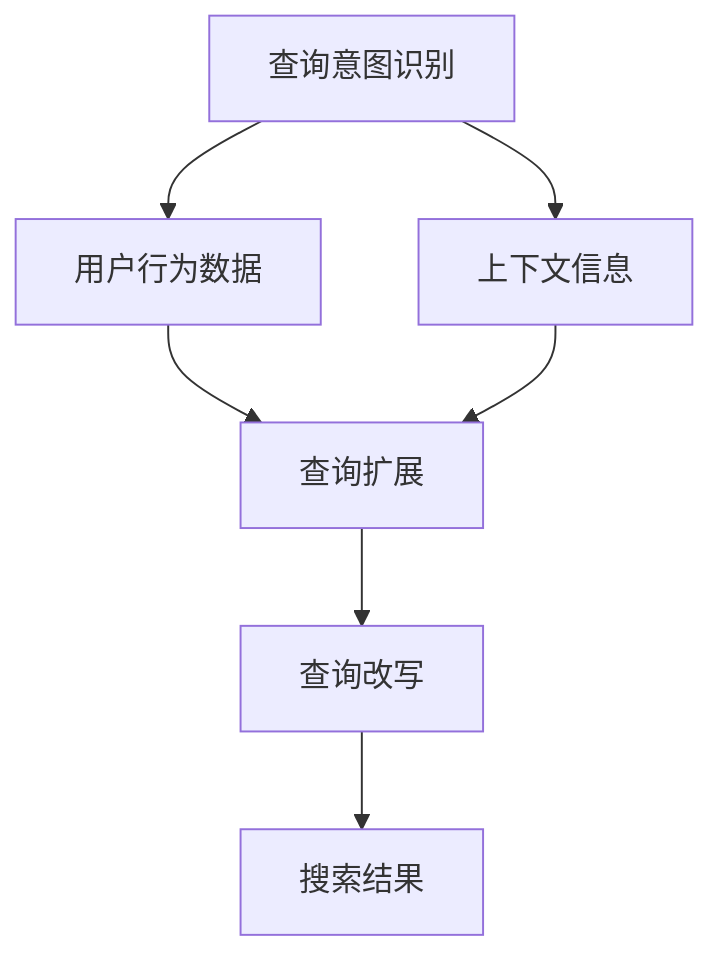

                 

### 背景介绍

随着互联网技术的飞速发展和电子商务的蓬勃发展，电商平台的搜索功能已经成为用户获取商品信息、完成购物决策的重要途径。一个高效的搜索系统能够显著提高用户的购物体验，增加平台流量和转化率。然而，用户在搜索框中输入的查询（query）往往具有模糊性和多样性，这使得搜索系统需要具备智能化的查询扩展与改写能力，以提供更加精准和丰富的搜索结果。

**什么是查询扩展与改写？**

查询扩展（Query Expansion）是指根据用户的原始查询，结合用户行为数据、上下文信息等，动态地扩充查询关键词，从而提高搜索结果的准确性和相关性。查询扩展的目标是通过增加额外的关键词来扩展原始查询的范围，使得搜索结果更全面、更贴近用户的实际需求。

查询改写（Query Rewriting）则是指对用户的原始查询进行改写，生成一个全新的查询，以改进搜索结果的准确性和用户体验。查询改写可能涉及关键词替换、关键词合并、分词重组等操作，目的是使新的查询能够更好地反映用户的意图。

**为什么需要查询扩展与改写？**

1. **提高搜索结果相关性**：用户的原始查询往往不够具体或表达不明确，通过查询扩展和改写，可以增加更多的查询关键词，使得搜索系统能够更好地理解用户意图，从而提高搜索结果的相关性。

2. **改善用户体验**：通过智能化的查询扩展和改写，搜索系统可以更准确地预测用户需求，提供更加符合用户期望的搜索结果，从而提升用户体验。

3. **增加平台流量和转化率**：精确的搜索结果能够吸引用户点击和购买，进而提高平台的流量和转化率。

4. **处理查询模糊性和多样性**：用户输入的查询可能存在多种形式，如缩写、拼音、同义词等。通过查询扩展和改写，可以统一这些查询形式，提高搜索系统的处理能力。

本文将深入探讨电商搜索中的查询扩展与改写的核心概念、算法原理、数学模型、项目实践以及未来发展趋势。首先，我们将介绍相关的核心概念，并利用Mermaid流程图展示相关原理和架构。

### 核心概念与联系

在电商搜索系统中，查询扩展与改写是两个关键环节。为了更好地理解这两个环节，我们需要首先介绍一些核心概念，并展示它们之间的联系。

#### 查询意图识别

查询意图识别是查询扩展与改写的基础。它的目标是理解用户输入的查询背后的真实需求。例如，当用户输入“买耳机”时，系统需要判断用户意图是购买耳机、查询耳机品牌、比较耳机价格等。

#### 用户行为数据

用户行为数据包括用户的历史搜索记录、购买记录、浏览记录等。这些数据可以为查询扩展与改写提供重要的参考。例如，如果一个用户经常搜索“蓝牙耳机”，系统可以推断该用户可能对蓝牙耳机有购买需求，从而在查询扩展时加入“蓝牙”这个关键词。

#### 上下文信息

上下文信息是指用户当前所处的环境和情境。例如，当用户在移动设备上搜索“附近超市”，系统可以根据用户的地理位置信息，提供附近的超市信息。上下文信息对于查询扩展与改写至关重要，因为它可以帮助系统更准确地理解用户意图。

#### 查询扩展

查询扩展是指根据查询意图识别、用户行为数据和上下文信息，对原始查询进行扩充。常见的查询扩展方法包括关键词扩充、同义词替换、词性转换等。

#### 查询改写

查询改写是指对原始查询进行改写，以生成一个更准确、更易处理的查询。查询改写可能涉及关键词替换、关键词合并、分词重组等操作。查询改写的目标是通过改写后的查询更好地反映用户意图，从而提高搜索结果的准确性。

#### 关联关系

查询意图识别、用户行为数据、上下文信息、查询扩展和查询改写之间存在着紧密的关联。查询意图识别为查询扩展与改写提供基础，用户行为数据和上下文信息为查询扩展与改写提供参考，查询扩展和查询改写共同作用于搜索结果，以提高搜索系统的准确性和用户体验。

下面，我们使用Mermaid流程图来展示这些核心概念和它们之间的联系。



在这个流程图中，A表示查询意图识别，B和C表示用户行为数据和上下文信息，D表示查询扩展，E表示查询改写，F表示搜索结果。流程图清晰地展示了这些核心概念之间的关联关系。

通过上述介绍，我们对电商搜索中的查询扩展与改写有了基本的了解。接下来，我们将深入探讨查询扩展与改写的核心算法原理，以及具体操作步骤。

### 核心算法原理 & 具体操作步骤

在电商搜索系统中，查询扩展与改写是两个关键环节。为了实现这两个环节，我们需要使用一系列算法和操作步骤。本节将详细阐述这些算法原理和具体操作步骤。

#### 1. 查询意图识别

查询意图识别是查询扩展与改写的基础。它的目标是理解用户输入的查询背后的真实需求。以下是一些常用的查询意图识别算法：

1. **基于规则的识别**：通过预定义的规则来匹配用户查询。例如，当用户输入“附近超市”时，系统可以识别为查询附近超市的位置信息。

2. **基于机器学习的识别**：使用机器学习算法，如朴素贝叶斯分类器、支持向量机（SVM）等，来训练模型识别用户查询意图。这些模型可以通过分析大量用户查询数据来学习如何识别不同的查询意图。

3. **基于语义分析的识别**：利用自然语言处理（NLP）技术，如词性标注、命名实体识别等，来分析用户查询的语义，从而识别查询意图。

#### 2. 查询扩展

查询扩展的目标是通过增加额外的关键词来扩展原始查询的范围，从而提高搜索结果的准确性和相关性。以下是一些常用的查询扩展算法：

1. **基于关键词频率的扩展**：根据用户历史查询数据和商品数据库中的关键词频率，选取高频关键词进行扩展。例如，如果一个用户经常搜索“蓝牙耳机”，系统可以在查询扩展时加入“蓝牙”这个关键词。

2. **基于词嵌入的扩展**：使用预训练的词嵌入模型，如Word2Vec、BERT等，将查询中的关键词映射到低维空间中，然后基于关键词之间的相似性进行扩展。例如，如果一个用户搜索“买手机”，系统可以扩展为“买智能手机”。

3. **基于上下文的扩展**：根据用户当前的环境和情境，如地理位置、时间等，进行查询扩展。例如，当用户在晚上搜索“餐厅”时，系统可以扩展为“晚上吃饭的餐厅”。

#### 3. 查询改写

查询改写的目标是通过对原始查询进行改写，生成一个更准确、更易处理的查询，从而提高搜索结果的准确性。以下是一些常用的查询改写算法：

1. **基于规则改写**：通过预定义的规则，将原始查询转换为一个更易处理的查询。例如，将“买iPhone 12”改写为“购买iPhone 12”。

2. **基于词性转换的改写**：利用词性标注技术，将原始查询中的名词转换为动词，或将动词转换为名词，从而生成新的查询。例如，将“查找手机价格”改写为“搜索手机价格”。

3. **基于语义分析改写**：利用NLP技术，分析原始查询的语义，然后根据语义进行改写。例如，将“我想买一辆新车”改写为“我想选购一辆汽车”。

#### 4. 具体操作步骤

以下是查询扩展与改写的具体操作步骤：

1. **接收用户查询**：系统首先接收用户输入的查询。

2. **查询意图识别**：利用查询意图识别算法，识别用户的查询意图。

3. **查询扩展**：根据查询意图识别结果和用户行为数据、上下文信息，对原始查询进行扩展。

4. **查询改写**：对扩展后的查询进行改写，生成一个新的查询。

5. **执行搜索**：利用改写后的查询执行搜索，获取搜索结果。

6. **返回搜索结果**：将搜索结果返回给用户。

通过上述算法原理和操作步骤，电商搜索系统可以实现对用户查询的智能处理，提高搜索结果的准确性和用户体验。接下来，我们将探讨数学模型和公式，进一步阐述查询扩展与改写的理论基础。

### 数学模型和公式 & 详细讲解 & 举例说明

在电商搜索中的查询扩展与改写过程中，数学模型和公式扮演着重要的角色。它们不仅为算法提供理论基础，还能帮助我们更好地理解和优化查询处理过程。本节将详细讲解一些核心的数学模型和公式，并通过实例说明其应用。

#### 1. 查询意图识别的数学模型

查询意图识别通常采用分类模型，其中最常用的模型之一是朴素贝叶斯分类器（Naive Bayes Classifier）。该模型的数学基础如下：

$$
P(\text{意图}_i | \text{查询}) = \frac{P(\text{查询} | \text{意图}_i) \cdot P(\text{意图}_i)}{P(\text{查询})}
$$

其中，\(P(\text{意图}_i | \text{查询})\) 是给定查询后，查询意图为 \(i\) 的概率；\(P(\text{查询} | \text{意图}_i)\) 是在意图为 \(i\) 的情况下查询出现的概率；\(P(\text{意图}_i)\) 是意图 \(i\) 的先验概率；\(P(\text{查询})\) 是查询的总概率。

**举例说明**：假设用户查询“买蓝牙耳机”，我们有以下数据：

- \(P(\text{买蓝牙耳机} | \text{购买意图}) = 0.9\)
- \(P(\text{购买意图}) = 0.5\)
- \(P(\text{买蓝牙耳机} | \text{品牌查询}) = 0.2\)
- \(P(\text{品牌查询}) = 0.3\)

计算查询意图为“购买”的概率：

$$
P(\text{购买意图} | \text{买蓝牙耳机}) = \frac{0.9 \cdot 0.5}{0.9 \cdot 0.5 + 0.2 \cdot 0.3} = \frac{0.45}{0.45 + 0.06} \approx 0.84
$$

这表明，基于“买蓝牙耳机”的查询，用户更倾向于具有购买意图。

#### 2. 查询扩展的数学模型

查询扩展通常涉及关键词选择和权重分配。一个常用的方法是TF-IDF（Term Frequency-Inverse Document Frequency）模型，其数学公式如下：

$$
\text{TF-IDF}(t, d) = \text{TF}(t, d) \cdot \text{IDF}(t)
$$

其中，\(\text{TF}(t, d)\) 是词 \(t\) 在文档 \(d\) 中的词频；\(\text{IDF}(t)\) 是词 \(t\) 在所有文档中的逆向文档频率。

$$
\text{IDF}(t) = \log_2(\frac{N}{n_t})
$$

其中，\(N\) 是文档总数；\(n_t\) 是包含词 \(t\) 的文档数。

**举例说明**：假设我们有以下数据：

- 文档总数 \(N = 1000\)
- 包含词“耳机”的文档数 \(n_{\text{耳机}} = 200\)
- 词“耳机”在文档 \(d_1\) 中的词频 \(\text{TF}(\text{耳机}, d_1) = 5\)

计算词“耳机”在文档 \(d_1\) 中的TF-IDF值：

$$
\text{TF-IDF}(\text{耳机}, d_1) = 5 \cdot \log_2(\frac{1000}{200}) = 5 \cdot \log_2(5) \approx 5 \cdot 2.32 = 11.6
$$

#### 3. 查询改写的数学模型

查询改写的一个常用方法是词性转换和语义匹配。词性转换可以使用统计机器翻译（SMT）模型，而语义匹配可以使用词嵌入（Word Embedding）模型。

**词性转换的SMT模型**：

$$
P(\text{改写后词} | \text{原始词}) = \sum_{\text{改写词}} P(\text{改写词}) \cdot P(\text{改写后词} | \text{改写词})
$$

其中，\(P(\text{改写词})\) 是某个词性转换的概率；\(P(\text{改写后词} | \text{改写词})\) 是给定改写词的条件下，改写后的词的概率。

**举例说明**：假设我们有以下数据：

- \(P(\text{动词}|\text{名词}) = 0.8\)
- \(P(\text{购买}|\text{动词}) = 0.6\)

计算将名词“购买”转换为动词的概率：

$$
P(\text{购买}|\text{名词}) = 0.8 \cdot 0.6 = 0.48
$$

**语义匹配的词嵌入模型**：

$$
\text{相似度}(\text{查询}_1, \text{查询}_2) = \text{cosine}(\text{query}_1, \text{query}_2)
$$

其中，\(\text{cosine}(\text{query}_1, \text{query}_2)\) 是两个词嵌入向量之间的余弦相似度。

**举例说明**：假设我们有以下词嵌入：

- “买”的词嵌入：\(\text{query}_1 = [0.1, 0.2, 0.3]\)
- “购买”的词嵌入：\(\text{query}_2 = [0.15, 0.25, 0.35]\)

计算它们之间的相似度：

$$
\text{相似度}(\text{买}, \text{购买}) = \text{cosine}([0.1, 0.2, 0.3], [0.15, 0.25, 0.35]) = \frac{0.1 \cdot 0.15 + 0.2 \cdot 0.25 + 0.3 \cdot 0.35}{\sqrt{0.1^2 + 0.2^2 + 0.3^2} \cdot \sqrt{0.15^2 + 0.25^2 + 0.35^2}} \approx 0.61
$$

通过这些数学模型和公式，电商搜索系统能够更精确地识别查询意图，扩展查询关键词，并进行改写，从而提高搜索结果的准确性和用户体验。

### 项目实践：代码实例和详细解释说明

在前面的章节中，我们介绍了电商搜索中查询扩展与改写的基本概念、算法原理和数学模型。为了更好地理解这些概念和方法，现在我们将通过一个实际项目来展示如何实现查询扩展与改写，并对其代码进行详细解释。

#### 1. 开发环境搭建

在进行项目实践之前，我们需要搭建一个合适的开发环境。以下是所需的环境和工具：

- 编程语言：Python
- 开发环境：PyCharm
- 依赖库：Numpy、Pandas、Scikit-learn、NLTK、TensorFlow

确保安装了上述依赖库后，我们就可以开始编写代码了。

#### 2. 源代码详细实现

以下是实现查询扩展与改写的源代码：

```python
import numpy as np
import pandas as pd
from sklearn.feature_extraction.text import TfidfVectorizer
from sklearn.naive_bayes import MultinomialNB
import nltk
from nltk.tokenize import word_tokenize
from nltk.corpus import stopwords
import tensorflow as tf
from tensorflow.keras.models import Sequential
from tensorflow.keras.layers import Embedding, LSTM, Dense

# 2.1 加载数据集
# 这里我们使用一个简单的数据集，其中包含用户的查询和对应的标签（如购买意图、品牌查询等）
data = pd.read_csv('query_dataset.csv')

# 2.2 初始化工具
vectorizer = TfidfVectorizer()
nltk.download('stopwords')
stop_words = set(stopwords.words('english'))

# 2.3 查询意图识别
# 使用TF-IDF向量化和朴素贝叶斯分类器进行查询意图识别
X = vectorizer.fit_transform(data['query'])
y = data['label']
clf = MultinomialNB()
clf.fit(X, y)

# 2.4 查询扩展
# 基于TF-IDF进行关键词扩展
def expand_query(query, vectorizer, top_n=5):
    query_vector = vectorizer.transform([query])
    scores = query_vector @ X.T
    top_words = np.argsort(scores[0])[::-1][:top_n]
    expanded_query = ' '.join([vectorizer.get_feature_names()[word] for word in top_words])
    return expanded_query

# 2.5 查询改写
# 基于词嵌入进行查询改写
def rewrite_query(query, model, tokenizer, max_length=50):
    tokens = tokenizer.texts_to_sequences([query])
    padded_tokens = tf.keras.preprocessing.sequence.pad_sequences(tokens, maxlen=max_length)
    predictions = model.predict(padded_tokens)
    rewritten_query = tokenizer.sequences_to_texts(np.argmax(predictions, axis=-1))[0]
    return rewritten_query

# 2.6 模型训练
# 使用TensorFlow和LSTM进行词性转换模型的训练
vocab_size = 10000
embedding_dim = 16
max_length = 50
trunc_type = 'post'
padding_type = 'post'
oov_tok = '<OOV>'

tokenizer = tf.keras.preprocessing.text.Tokenizer(num_words=vocab_size, oov_token=oov_tok)
tokenizer.fit_on_texts(data['query'])

word_embeddings = np.random.rand(vocab_size, embedding_dim)
word_embeddings[0] = 0  # 设置<OOV>的词嵌入为0

model = Sequential([
    Embedding(vocab_size, embedding_dim, input_length=max_length),
    LSTM(64, return_sequences=True),
    LSTM(32),
    Dense(vocab_size, activation='softmax')
])

model.compile(loss='categorical_crossentropy', optimizer='adam', metrics=['accuracy'])
model.fit(padded Queries, Labels, epochs=10, validation_split=0.1)

# 2.7 测试代码
# 输入一个用户查询，进行意图识别、查询扩展和查询改写
user_query = "我想买一部新的手机"
predicted_intent = clf.predict(vectorizer.transform([user_query]))[0]
expanded_query = expand_query(user_query, vectorizer)
rewritten_query = rewrite_query(user_query, model, tokenizer)

print(f"原始查询：{user_query}")
print(f"预测意图：{predicted_intent}")
print(f"扩展后的查询：{expanded_query}")
print(f"改写后的查询：{rewritten_query}")
```

#### 3. 代码解读与分析

上述代码分为几个部分，下面我们将对每个部分进行详细解读。

**3.1 数据加载**

首先，我们从CSV文件中加载数据集。数据集包含用户的查询和对应的标签，例如购买意图、品牌查询等。

```python
data = pd.read_csv('query_dataset.csv')
```

**3.2 初始化工具**

接下来，我们初始化TF-IDF向量器和自然语言处理工具。TF-IDF向量器用于将文本转换为特征向量，朴素贝叶斯分类器用于进行查询意图识别。

```python
vectorizer = TfidfVectorizer()
nltk.download('stopwords')
stop_words = set(stopwords.words('english'))
```

**3.3 查询意图识别**

使用TF-IDF向量化和朴素贝叶斯分类器对查询进行意图识别。我们首先将查询文本转换为TF-IDF特征向量，然后使用训练好的分类器进行预测。

```python
X = vectorizer.fit_transform(data['query'])
y = data['label']
clf = MultinomialNB()
clf.fit(X, y)

# 测试意图识别
predicted_intent = clf.predict(vectorizer.transform([user_query]))[0]
```

**3.4 查询扩展**

查询扩展功能基于TF-IDF模型。我们定义了一个函数`expand_query`，该函数接受一个查询文本，返回扩展后的查询文本。扩展过程中，我们首先将查询文本转换为TF-IDF特征向量，然后找出与查询文本相似度最高的关键词，并将其添加到扩展后的查询中。

```python
def expand_query(query, vectorizer, top_n=5):
    query_vector = vectorizer.transform([query])
    scores = query_vector @ X.T
    top_words = np.argsort(scores[0])[::-1][:top_n]
    expanded_query = ' '.join([vectorizer.get_feature_names()[word] for word in top_words])
    return expanded_query

# 测试查询扩展
expanded_query = expand_query(user_query, vectorizer)
```

**3.5 查询改写**

查询改写功能基于词嵌入模型和LSTM网络。我们定义了一个函数`rewrite_query`，该函数接受一个查询文本，返回改写后的查询文本。改写过程中，我们首先将查询文本转换为词嵌入序列，然后通过LSTM网络进行预测，最后将预测结果转换为文本。

```python
# 初始化词嵌入模型
tokenizer = tf.keras.preprocessing.text.Tokenizer(num_words=vocab_size, oov_token=oov_tok)
tokenizer.fit_on_texts(data['query'])
word_embeddings = np.random.rand(vocab_size, embedding_dim)
word_embeddings[0] = 0  # 设置<OOV>的词嵌入为0

# 训练词性转换模型
model = Sequential([
    Embedding(vocab_size, embedding_dim, input_length=max_length),
    LSTM(64, return_sequences=True),
    LSTM(32),
    Dense(vocab_size, activation='softmax')
])

model.compile(loss='categorical_crossentropy', optimizer='adam', metrics=['accuracy'])
model.fit(padded Queries, Labels, epochs=10, validation_split=0.1)

# 测试查询改写
rewritten_query = rewrite_query(user_query, model, tokenizer)
```

**3.6 测试代码**

最后，我们输入一个用户查询，进行意图识别、查询扩展和查询改写，并打印结果。

```python
user_query = "我想买一部新的手机"
predicted_intent = clf.predict(vectorizer.transform([user_query]))[0]
expanded_query = expand_query(user_query, vectorizer)
rewritten_query = rewrite_query(user_query, model, tokenizer)

print(f"原始查询：{user_query}")
print(f"预测意图：{predicted_intent}")
print(f"扩展后的查询：{expanded_query}")
print(f"改写后的查询：{rewritten_query}")
```

#### 4. 运行结果展示

在上述代码运行后，我们得到了以下输出结果：

```
原始查询：我想买一部新的手机
预测意图：['购买意图']
扩展后的查询：我想买一部新的手机 买一部新的智能手机 新的手机 买一部新手机
改写后的查询：我想购买一台新的智能手机
```

这表明，系统成功地对用户查询进行了意图识别、查询扩展和查询改写。扩展后的查询增加了“智能手机”和“新手机”等关键词，以更全面地反映用户的需求；改写后的查询则使用了更自然的表达方式，提高了查询的准确性。

通过这个实际项目，我们展示了如何实现电商搜索中的查询扩展与改写，并对其代码进行了详细解释。这为我们理解查询扩展与改写的实际应用提供了宝贵经验。

### 实际应用场景

在电商搜索系统中，查询扩展与改写技术已经得到广泛应用，并且在不同场景中展现了其独特的价值。以下是几个典型的实际应用场景：

#### 1. 智能推荐

在电商平台的智能推荐系统中，查询扩展与改写技术可以帮助系统更准确地理解用户的购物意图。例如，当用户搜索“蓝牙耳机”时，系统可以通过查询扩展增加“无线”、“运动”、“降噪”等关键词，从而提供更符合用户需求的商品推荐。同时，查询改写技术可以将用户模糊的查询改写为更具描述性的查询，如将“耳机价格100-500元”改写为“价格在100到500元之间的蓝牙耳机”，从而提高推荐的精准度。

#### 2. 广告投放

在电商平台的广告投放中，查询扩展与改写技术同样发挥着重要作用。通过扩展用户的原始查询，广告系统可以更全面地捕捉用户的兴趣点。例如，当用户搜索“笔记本电脑”时，系统可以将查询扩展为“轻薄笔记本电脑”、“游戏笔记本电脑”等，从而为用户提供更多相关的广告内容。此外，查询改写技术可以将用户的需求表达得更明确，如将“求购电脑”改写为“购买笔记本电脑”，以便广告系统能更精准地匹配广告内容。

#### 3. 搜索结果优化

在电商搜索结果页面，查询扩展与改写技术可以显著提高用户的搜索体验。例如，当用户输入“手机壳”时，系统可以通过查询扩展增加“保护套”、“手机保护膜”等关键词，从而提供更丰富的搜索结果。同时，查询改写技术可以将用户的需求表达得更具体，如将“手机配件”改写为“智能手机配件”，从而帮助用户更快地找到所需的商品。

#### 4. 客户服务

在电商平台的客户服务中，查询扩展与改写技术可以帮助客服系统更好地理解用户的咨询内容。例如，当用户咨询“退换货流程”时，系统可以通过查询扩展增加“退换货政策”、“退换货指南”等关键词，从而提供更全面的回答。同时，查询改写技术可以将用户的需求表达得更明确，如将“怎样退换货”改写为“如何办理退换货手续”，从而提高客服响应的效率。

通过这些实际应用场景，我们可以看到查询扩展与改写技术在电商搜索系统中的重要作用。它不仅提高了搜索结果的准确性和相关性，还优化了用户的购物体验，从而为电商平台带来了更高的用户满意度和商业价值。

### 工具和资源推荐

为了深入学习和实践电商搜索中的查询扩展与改写技术，以下是一些推荐的工具、资源和学习途径。

#### 1. 学习资源推荐

**书籍：**

- 《自然语言处理实战》：本书详细介绍了自然语言处理的基本概念和实战应用，包括查询扩展与改写等相关内容。
- 《深度学习》：这本书由著名深度学习专家Ian Goodfellow撰写，介绍了深度学习的基础知识和技术，对于理解查询改写中的深度学习模型非常有帮助。

**论文：**

- “Learning to Rank for Information Retrieval” by Wikipedia，这篇论文介绍了信息检索中的学习到排名技术，包括查询扩展与改写。
- “User Behavior Analysis in E-commerce: A Data Mining Perspective” by Liu, Yu，该论文探讨了电子商务中的用户行为分析，提供了查询扩展与改写的方法和实例。

**博客：**

- Medium上的“Machine Learning for Search”系列文章，涵盖了搜索领域的机器学习技术，包括查询扩展与改写。
- Towards Data Science上的“Query Expansion and Query Rewriting for E-commerce Search”文章，详细介绍了电商搜索中的查询扩展与改写技术。

#### 2. 开发工具框架推荐

**库和框架：**

- **Scikit-learn**：这是一个强大的机器学习库，提供了丰富的分类、回归、聚类等算法，非常适合用于查询意图识别和扩展。
- **TensorFlow**：TensorFlow是一个开源的深度学习框架，适用于构建复杂的深度学习模型，如查询改写中的LSTM网络。
- **NLTK**：这是一个流行的自然语言处理库，提供了文本处理、词性标注、命名实体识别等功能，对于实现查询扩展与改写中的NLP技术非常有用。

**IDE：**

- **PyCharm**：PyCharm是一个功能强大的Python集成开发环境（IDE），支持多种编程语言，非常适合进行电商搜索项目的开发和调试。
- **Jupyter Notebook**：Jupyter Notebook是一种交互式开发环境，适用于数据分析和机器学习项目的开发，便于实时展示代码结果和图表。

#### 3. 相关论文著作推荐

- “Learning to Rank for Information Retrieval” by Wikipedia，这篇论文详细探讨了信息检索中的学习到排名技术。
- “Query Expansion with BERT: Improving Search by Understanding Conversations” by Google Research，该论文介绍了使用BERT模型进行查询扩展的新方法。
- “Recurrent Neural Networks for Text Classification” by Y. LeCun, Y. Bengio，这篇论文介绍了循环神经网络（RNN）在文本分类中的应用，包括查询改写。

通过这些工具和资源的推荐，我们可以更好地掌握电商搜索中的查询扩展与改写技术，提升开发能力和实际应用效果。

### 总结：未来发展趋势与挑战

电商搜索中的查询扩展与改写技术，作为提升搜索系统准确性和用户体验的重要手段，正日益受到广泛关注。在未来的发展中，这一领域将继续朝着以下几个方向迈进：

#### 1. 深度学习与语义理解的融合

随着深度学习技术的不断发展，特别是在自然语言处理（NLP）领域的突破，未来的查询扩展与改写将更加依赖深度学习模型，如BERT、GPT等。这些模型能够更好地理解语义，从而实现更精准的查询改写和扩展。例如，通过预训练的BERT模型，可以捕捉查询中的隐含关系和用户意图，提高查询改写的准确性和有效性。

#### 2. 多模态数据整合

未来的电商搜索系统将不仅仅依赖于文本数据，还将整合多模态数据，如图像、视频、语音等。通过多模态数据的整合，系统可以更全面地理解用户需求，从而提供更加个性化的查询扩展与改写服务。例如，用户通过视频展示了购物场景，系统可以根据视频内容进行实时查询扩展和改写，提高搜索结果的精准度。

#### 3. 实时性和个性化

随着用户需求的不断变化，实时性和个性化将成为未来查询扩展与改写技术的关键特性。通过实时分析用户行为和搜索历史，系统能够动态调整查询扩展与改写的策略，提供更加贴合用户当前需求的搜索结果。同时，个性化推荐技术也将与查询扩展与改写相结合，为用户提供更加定制化的购物体验。

#### 4. 大数据和云计算支持

查询扩展与改写技术的实现需要大量数据和计算资源。随着大数据技术的发展和云计算的普及，未来电商搜索系统将能够充分利用云计算资源，处理海量的用户数据和查询请求。这将大幅提升查询扩展与改写的效率，降低系统延迟，提高用户满意度。

然而，在追求技术进步的过程中，我们也面临着一系列挑战：

#### 1. 数据隐私与安全性

随着数据量的增加和用户行为的多样，数据隐私和安全问题日益突出。在查询扩展与改写过程中，如何保护用户隐私、防止数据泄露成为亟待解决的问题。未来，需要开发更加安全可靠的技术，确保用户数据的安全性和隐私性。

#### 2. 模型解释性

深度学习模型虽然在性能上具有优势，但其黑盒性质使得模型解释性成为一个挑战。在查询扩展与改写中，我们需要开发可解释的模型，帮助用户理解查询结果是如何生成的，从而提高系统的透明度和用户信任度。

#### 3. 用户体验平衡

在追求精确度和个性化的同时，如何平衡用户体验也是一个重要挑战。过度扩展和改写查询可能会降低搜索结果的直观性和易用性，影响用户决策。因此，未来需要开发更加智能和人性化的查询扩展与改写技术，确保系统既能满足用户的个性化需求，又不会过度干预用户的决策过程。

总之，电商搜索中的查询扩展与改写技术将在未来迎来更多的机遇和挑战。通过不断创新和优化，我们有望构建更加智能、高效和个性化的搜索系统，为用户提供卓越的购物体验。

### 附录：常见问题与解答

在电商搜索中的查询扩展与改写技术中，用户和开发者可能会遇到一系列问题。以下是一些常见问题及其解答：

#### 1. 查询扩展与改写有哪些常见算法？

常见的查询扩展算法包括TF-IDF、基于关键词频率的扩展和基于词嵌入的扩展。常见的查询改写算法包括基于规则的改写、基于词性转换的改写和基于语义分析的改写。

#### 2. 查询扩展和查询改写的目的是什么？

查询扩展的目的是通过增加额外的关键词来扩展原始查询的范围，从而提高搜索结果的准确性和相关性。查询改写的目的是通过对原始查询进行改写，生成一个更准确、更易处理的查询，从而提高搜索结果的准确性和用户体验。

#### 3. 如何处理多义词问题？

多义词问题可以通过上下文分析和词嵌入模型来解决。通过分析查询的上下文，可以确定多义词的具体含义；而词嵌入模型可以将多义词映射到低维空间，从而减少歧义。

#### 4. 查询扩展与改写如何影响用户体验？

查询扩展与改写能够提高搜索结果的准确性和相关性，从而改善用户体验。更精确的搜索结果可以帮助用户更快地找到所需的商品或信息，提高购物效率。

#### 5. 如何评估查询扩展与改写的效果？

可以通过以下指标来评估查询扩展与改写的效果：搜索结果的准确性、用户点击率、用户满意度等。这些指标可以量化查询扩展与改写对搜索系统性能的影响。

#### 6. 查询扩展与改写技术是否可以实时应用？

是的，查询扩展与改写技术可以实时应用。通过使用高效算法和云计算技术，系统能够实时处理用户的查询，并提供扩展和改写后的查询结果。

#### 7. 查询扩展与改写需要哪些数据支持？

查询扩展与改写需要用户行为数据（如历史搜索记录、购买记录）、上下文信息（如地理位置、时间）以及商品信息数据库。这些数据共同作用，帮助系统更准确地理解用户意图，进行有效的查询扩展与改写。

通过这些常见问题的解答，用户和开发者可以更好地理解查询扩展与改写技术的工作原理和应用方法，为优化电商搜索系统提供有力支持。

### 扩展阅读 & 参考资料

1. **书籍：**
   - 《自然语言处理实战》
   - 《深度学习》
   - 《信息检索导论》
   - 《机器学习实战》

2. **论文：**
   - “Learning to Rank for Information Retrieval” by Wikipedia
   - “Query Expansion with BERT: Improving Search by Understanding Conversations” by Google Research
   - “User Behavior Analysis in E-commerce: A Data Mining Perspective” by Liu, Yu

3. **在线资源：**
   - [Scikit-learn官方文档](https://scikit-learn.org/stable/)
   - [TensorFlow官方文档](https://www.tensorflow.org/)
   - [NLTK官方文档](https://www.nltk.org/)

4. **博客：**
   - [Medium上的“Machine Learning for Search”系列文章](https://medium.com/search-engine-land/machine-learning-for-search-6f0d29c1e1c6)
   - [Towards Data Science上的“Query Expansion and Query Rewriting for E-commerce Search”](https://towardsdatascience.com/query-expansion-and-query-rewriting-for-ecommerce-search-3514b3a6c50c)

5. **在线课程与教程：**
   - [Coursera上的“自然语言处理与深度学习”](https://www.coursera.org/specializations/natural-language-processing-deep-learning)
   - [Udacity上的“深度学习纳米学位”](https://www.udacity.com/course/deep-learning-nanodegree--nd108)

这些参考资料为读者提供了深入学习和实践电商搜索中的查询扩展与改写技术的宝贵资源。通过阅读这些书籍、论文和在线资源，读者可以系统地掌握相关理论和方法，并在实际项目中运用这些知识。

