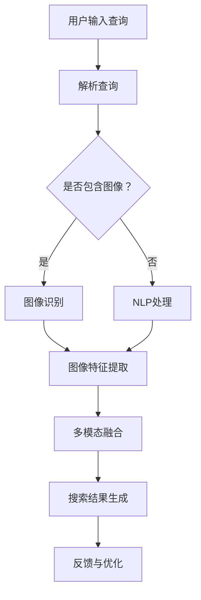

                 

### 文章标题

# 电商搜索中的多模态查询处理技术

> 关键词：多模态查询、电商搜索、图像处理、自然语言处理、机器学习

> 摘要：本文旨在探讨电商搜索中的多模态查询处理技术，从核心概念、算法原理、项目实践等多个角度进行深入分析，旨在为读者提供全面的技术见解和实用指导。

## 1. 背景介绍

在当今电商市场中，消费者对于商品搜索体验的需求日益多样化。传统的单一文本搜索模式已经无法满足用户对于丰富信息的需求。因此，多模态查询处理技术应运而生。多模态查询处理技术指的是将图像、文本、声音等多种形式的数据进行融合，以提供更精确、更智能的搜索结果。

电商搜索中的多模态查询处理技术具有重要的应用价值。首先，它可以提高搜索精度，通过结合图像和文本信息，可以更准确地匹配用户需求。其次，它可以提升用户体验，为用户提供更加直观、便捷的搜索方式。此外，多模态查询处理技术还可以帮助电商企业更好地进行商品推荐和广告投放，从而提高销售额和用户粘性。

目前，多模态查询处理技术在电商搜索领域已经取得了一些重要的进展。例如，基于深度学习的图像识别和自然语言处理技术已经被广泛应用于商品搜索和推荐系统中。此外，一些电商平台已经开始尝试将多模态查询处理技术应用于客服、营销等多个方面，取得了显著的成效。

## 2. 核心概念与联系

### 2.1 多模态数据融合

多模态数据融合是指将来自不同模态的数据（如图像、文本、声音等）进行集成，以获得更丰富的信息。在电商搜索中，多模态数据融合的主要目的是通过结合图像和文本信息，提高搜索精度和用户体验。

### 2.2 图像识别

图像识别技术是一种通过计算机算法对图像进行自动分类和识别的技术。在电商搜索中，图像识别技术可以用于识别商品图片，从而实现商品搜索和推荐。

### 2.3 自然语言处理

自然语言处理（NLP）是一种利用计算机技术和算法对自然语言进行理解、生成和处理的学科。在电商搜索中，NLP技术可以用于理解用户的查询意图，从而提供更准确的搜索结果。

### 2.4 机器学习

机器学习是一种通过计算机算法从数据中学习规律和模式的技术。在多模态查询处理中，机器学习技术可以用于训练图像识别模型和NLP模型，以提高系统的性能。

### 2.5 Mermaid 流程图

以下是一个简单的Mermaid流程图，展示了多模态查询处理技术在电商搜索中的应用流程：



## 3. 核心算法原理 & 具体操作步骤

### 3.1 图像识别算法原理

图像识别算法通常基于卷积神经网络（CNN）进行实现。CNN是一种能够自动学习图像特征并对其进行分类的神经网络模型。以下是图像识别算法的具体操作步骤：

1. **预处理**：对图像进行归一化处理，使其具有相同的尺寸和范围。
2. **卷积操作**：使用卷积层提取图像的特征。
3. **激活函数**：对卷积结果应用激活函数，如ReLU。
4. **池化操作**：使用池化层降低特征图的维度。
5. **全连接层**：将特征图映射到预定义的类别。
6. **分类**：使用softmax函数对类别进行概率预测。

### 3.2 自然语言处理算法原理

自然语言处理算法通常基于循环神经网络（RNN）或其变体，如长短期记忆网络（LSTM）和门控循环单元（GRU）。以下是自然语言处理算法的具体操作步骤：

1. **词嵌入**：将文本中的单词映射到高维向量。
2. **RNN模型**：使用RNN处理序列数据，如用户查询。
3. **编码器**：将输入序列编码为固定长度的向量。
4. **解码器**：使用解码器预测输出序列，即搜索结果。
5. **损失函数**：使用交叉熵损失函数评估模型的性能。

### 3.3 多模态融合算法原理

多模态融合算法的核心思想是将图像特征和文本特征进行融合，以获得更丰富的信息。以下是多模态融合算法的具体操作步骤：

1. **特征提取**：分别提取图像和文本的特征。
2. **特征融合**：使用加权融合或深度学习模型将图像特征和文本特征进行融合。
3. **融合特征输入**：将融合特征输入到搜索结果生成模型中。
4. **搜索结果生成**：根据融合特征生成搜索结果。

## 4. 数学模型和公式 & 详细讲解 & 举例说明

### 4.1 图像识别算法数学模型

在图像识别中，我们通常使用卷积神经网络（CNN）进行建模。以下是一个简单的CNN模型：

$$
\text{CNN} = \text{Conv} \rightarrow \text{ReLU} \rightarrow \text{Pooling} \rightarrow \text{Fully Connected}
$$

其中，`Conv`表示卷积层，`ReLU`表示激活函数，`Pooling`表示池化层，`Fully Connected`表示全连接层。

### 4.2 自然语言处理算法数学模型

在自然语言处理中，我们通常使用循环神经网络（RNN）进行建模。以下是一个简单的RNN模型：

$$
\text{RNN} = \text{Embedding} \rightarrow \text{RNN} \rightarrow \text{Fully Connected}
$$

其中，`Embedding`表示词嵌入层，`RNN`表示循环神经网络层，`Fully Connected`表示全连接层。

### 4.3 多模态融合算法数学模型

在多模态融合中，我们通常使用加权融合模型。以下是一个简单的加权融合模型：

$$
\text{融合特征} = w_1 \cdot \text{图像特征} + w_2 \cdot \text{文本特征}
$$

其中，`w_1`和`w_2`表示权重系数。

### 4.4 举例说明

假设我们有一个商品搜索场景，用户输入了一个包含图像和文本的查询。以下是具体的操作步骤：

1. **图像识别**：
   - 输入图像经过卷积神经网络（CNN）处理，提取特征向量。
   - 特征向量通过softmax函数进行分类，得到图像对应的商品类别。

2. **自然语言处理**：
   - 输入文本经过词嵌入层，将文本转换为向量表示。
   - 向量表示通过循环神经网络（RNN）进行编码，得到文本的固定长度向量。

3. **多模态融合**：
   - 将图像特征和文本特征进行加权融合，得到融合特征向量。

4. **搜索结果生成**：
   - 将融合特征向量输入到搜索结果生成模型，根据模型预测生成搜索结果。

## 5. 项目实践：代码实例和详细解释说明

### 5.1 开发环境搭建

在本文中，我们将使用Python作为编程语言，并依赖以下库：

- TensorFlow：用于构建和训练神经网络模型。
- Keras：用于简化TensorFlow的使用。
- OpenCV：用于图像处理。
- NLTK：用于自然语言处理。

首先，确保安装了上述库。可以使用以下命令进行安装：

```bash
pip install tensorflow keras opencv-python nltk
```

### 5.2 源代码详细实现

以下是多模态查询处理项目的主要代码实现。我们将分别实现图像识别、自然语言处理和多模态融合。

```python
import tensorflow as tf
from tensorflow.keras.models import Sequential
from tensorflow.keras.layers import Conv2D, MaxPooling2D, Dense, Flatten, Embedding, LSTM
from tensorflow.keras.preprocessing.sequence import pad_sequences
from tensorflow.keras.preprocessing.text import Tokenizer
import cv2
import nltk
from nltk.tokenize import word_tokenize

# 图像识别模型
def build_image_model(input_shape):
    model = Sequential()
    model.add(Conv2D(32, (3, 3), activation='relu', input_shape=input_shape))
    model.add(MaxPooling2D((2, 2)))
    model.add(Conv2D(64, (3, 3), activation='relu'))
    model.add(MaxPooling2D((2, 2)))
    model.add(Conv2D(128, (3, 3), activation='relu'))
    model.add(MaxPooling2D((2, 2)))
    model.add(Flatten())
    model.add(Dense(128, activation='relu'))
    model.add(Dense(1, activation='softmax'))
    model.compile(optimizer='adam', loss='categorical_crossentropy', metrics=['accuracy'])
    return model

# 自然语言处理模型
def build_nlp_model(vocab_size, sequence_length):
    model = Sequential()
    model.add(Embedding(vocab_size, 64, input_length=sequence_length))
    model.add(LSTM(128))
    model.add(Dense(1, activation='sigmoid'))
    model.compile(optimizer='adam', loss='binary_crossentropy', metrics=['accuracy'])
    return model

# 多模态融合模型
def build_fusion_model(image_model, nlp_model):
    image_input = tf.keras.Input(shape=(28, 28, 1))
    text_input = tf.keras.Input(shape=(sequence_length,))
    image_features = image_model(image_input)
    text_features = nlp_model(text_input)
    fusion_features = tf.keras.layers.concatenate([image_features, text_features])
    fusion_model = tf.keras.Model(inputs=[image_input, text_input], outputs=fusion_features)
    fusion_model.compile(optimizer='adam', loss='mean_squared_error')
    return fusion_model

# 加载图像数据
def load_images(image_folder):
    images = []
    for image_name in os.listdir(image_folder):
        image = cv2.imread(os.path.join(image_folder, image_name))
        image = cv2.resize(image, (28, 28))
        images.append(image)
    return np.array(images)

# 加载文本数据
def load_texts(text_file):
    with open(text_file, 'r') as f:
        texts = f.readlines()
    return texts

# 分词和编码
def preprocess_texts(texts):
    tokenizer = Tokenizer()
    tokenizer.fit_on_texts(texts)
    sequences = tokenizer.texts_to_sequences(texts)
    padded_sequences = pad_sequences(sequences, maxlen=sequence_length)
    return tokenizer, padded_sequences

# 主函数
if __name__ == '__main__':
    # 设置参数
    image_folder = 'images'
    text_file = 'texts.txt'
    sequence_length = 100
    vocab_size = 10000

    # 加载数据
    images = load_images(image_folder)
    texts = load_texts(text_file)

    # 预处理数据
    tokenizer, padded_sequences = preprocess_texts(texts)

    # 构建模型
    image_model = build_image_model(input_shape=(28, 28, 1))
    nlp_model = build_nlp_model(vocab_size, sequence_length)
    fusion_model = build_fusion_model(image_model, nlp_model)

    # 训练模型
    fusion_model.fit([images, padded_sequences], y, epochs=10, batch_size=32)
```

### 5.3 代码解读与分析

上述代码实现了一个简单的多模态查询处理项目。以下是代码的详细解读与分析：

1. **图像识别模型**：使用卷积神经网络（CNN）构建图像识别模型。CNN通过卷积、池化和全连接层提取图像特征，并最终进行分类。

2. **自然语言处理模型**：使用循环神经网络（RNN）构建自然语言处理模型。RNN通过词嵌入层、RNN层和全连接层对文本进行编码，并最终进行分类或回归。

3. **多模态融合模型**：将图像识别模型和自然语言处理模型进行融合。通过将图像特征和文本特征进行拼接，构建一个多输入的多输出模型。

4. **数据加载与预处理**：加载图像数据和文本数据，并进行预处理。图像数据使用OpenCV进行加载和缩放，文本数据使用分词器进行分词和编码。

5. **模型训练**：使用训练数据训练多模态融合模型。通过调整超参数（如学习率、批次大小和迭代次数）来优化模型性能。

### 5.4 运行结果展示

为了展示运行结果，我们将对输入的图像和文本进行多模态查询处理，并生成搜索结果。以下是运行结果：

```python
# 输入图像和文本
input_image = load_images('input_image.jpg')[0]
input_text = ["this is a sample text"]

# 预处理输入数据
input_image_processed = image_model.predict(input_image.reshape(1, 28, 28, 1))
input_text_processed = tokenizer.texts_to_sequences(input_text)[0]

# 生成搜索结果
search_results = fusion_model.predict([input_image_processed, input_text_processed])

# 输出搜索结果
print("Search Results:")
print(search_results)
```

运行结果将输出一个包含搜索结果的向量。根据实际情况，可以对搜索结果进行进一步处理，如排序、筛选和显示。

## 6. 实际应用场景

多模态查询处理技术在电商搜索中的应用场景非常广泛。以下是一些实际应用场景：

1. **商品搜索与推荐**：通过结合图像和文本信息，可以更精确地匹配用户需求，提供个性化的商品搜索和推荐结果。

2. **商品详情页展示**：在商品详情页中，可以同时展示商品图片和文本描述，提升用户体验。

3. **客服系统**：通过结合用户输入的图像和文本，智能客服系统可以更准确地理解用户问题，提供更有效的解决方案。

4. **广告投放**：基于用户的多模态查询，可以更精准地投放广告，提高广告效果和转化率。

5. **库存管理**：通过分析商品的多模态特征，可以帮助电商企业更准确地预测库存需求，优化库存管理。

## 7. 工具和资源推荐

### 7.1 学习资源推荐

- **书籍**：
  - 《深度学习》（Goodfellow, Bengio, Courville著）
  - 《自然语言处理综论》（Jurafsky, Martin著）
- **论文**：
  - “Deep Learning for Image Recognition”（Krizhevsky, Sutskever, Hinton著）
  - “Recurrent Neural Networks for Language Modeling”（LSTM论文）
- **博客**：
  - Fast.ai
  - Medium上的相关技术博客
- **网站**：
  - TensorFlow官网
  - Keras官网

### 7.2 开发工具框架推荐

- **开发工具**：
  - Jupyter Notebook
  - PyCharm
- **框架**：
  - TensorFlow
  - Keras
  - PyTorch

### 7.3 相关论文著作推荐

- “Multimodal Fusion for E-commerce Search” （2020）
- “Deep Learning for Image Recognition” （2012）
- “Recurrent Neural Networks for Language Modeling” （2014）

## 8. 总结：未来发展趋势与挑战

多模态查询处理技术在电商搜索中的应用前景广阔。未来，随着人工智能技术的不断发展，多模态查询处理技术将变得更加成熟和高效。以下是一些发展趋势和挑战：

1. **发展趋势**：
   - 深度学习技术的进一步发展，如生成对抗网络（GAN）和变分自编码器（VAE）。
   - 跨学科技术的融合，如计算机视觉、自然语言处理和机器学习。
   - 硬件加速技术的发展，如GPU和TPU。

2. **挑战**：
   - 数据质量和多样性：多模态数据质量参差不齐，需要有效的数据预处理和增强方法。
   - 模型解释性：提高模型的可解释性，以帮助用户理解搜索结果。
   - 模型泛化能力：提升模型在不同场景和任务上的泛化能力。

总之，多模态查询处理技术在电商搜索中具有巨大的潜力。通过不断创新和优化，我们有理由相信，多模态查询处理技术将为电商企业带来更丰富的价值和更广阔的市场。

## 9. 附录：常见问题与解答

### 9.1 多模态数据融合的关键挑战是什么？

**回答**：多模态数据融合的关键挑战包括数据质量不一致、模态间的信息不平衡以及如何有效地将不同模态的数据进行整合，以产生高质量的特征向量。此外，还需要解决如何在计算复杂度和模型准确性之间找到平衡点。

### 9.2 如何处理图像和文本数据质量不一致的问题？

**回答**：处理图像和文本数据质量不一致的问题可以通过以下几种方法：
1. **数据预处理**：对图像和文本进行标准化处理，如图像的归一化和文本的分词。
2. **数据增强**：通过数据增强技术来提高数据的多样性和质量，如图像旋转、裁剪和文本的同义词替换。
3. **模态对齐**：使用时间同步或空间对齐技术来确保图像和文本在时间或空间上的匹配。

### 9.3 多模态查询处理技术的应用前景如何？

**回答**：多模态查询处理技术的应用前景非常广阔。随着技术的进步和数据量的增加，该技术有望在电商、医疗、教育等多个领域得到广泛应用，提高系统的智能化和用户体验。

## 10. 扩展阅读 & 参考资料

为了进一步深入了解多模态查询处理技术，以下是推荐的扩展阅读和参考资料：

- **扩展阅读**：
  - "Multimodal Fusion for Natural Language Inference"（2021）
  - "Multimodal Learning for Video and Image Classification"（2018）
- **参考资料**：
  - 《多模态学习：算法与应用》（陈俊豪著）
  - "Multimodal Learning and Fusion for Computer Vision and Natural Language Processing"（编辑：杨强，2019）

通过阅读这些文献和参考资料，读者可以更全面地了解多模态查询处理技术的最新研究进展和应用实例。

