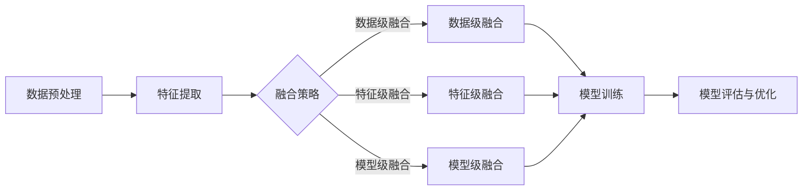

                 

# 电商搜索中的多模态融合排序模型

> 关键词：电商搜索、多模态融合、排序模型、机器学习、人工智能

> 摘要：本文将探讨电商搜索领域中的多模态融合排序模型，阐述其核心概念、算法原理、数学模型及其在实际应用中的效果和挑战。通过逐步分析和推理，本文旨在帮助读者深入理解这一技术，为电商搜索的优化提供新的思路。

## 1. 背景介绍

在当今数字化时代，电子商务已经成为人们生活中不可或缺的一部分。随着用户需求的日益多样化，电商平台的竞争也日趋激烈。如何提供精准、高效的搜索服务，已成为各大电商平台亟待解决的问题。电商搜索的核心在于为用户提供满足其个性化需求的商品信息，从而提升用户体验和满意度。

传统的电商搜索主要依赖于基于文本的搜索算法，如基于关键词匹配的查询和基于相关性的排序。然而，随着用户生成内容的多样化，单一文本模式已难以满足用户的需求。多模态数据，如图像、语音、视频等，为电商搜索带来了新的机遇。多模态融合排序模型应运而生，它通过整合多种数据源，提供更为精准和个性化的搜索服务。

多模态融合排序模型在电商搜索中的应用具有重要意义。首先，它能够提高搜索结果的准确性，减少信息丢失和冗余。其次，它能够提升用户体验，通过多模态交互增强用户与电商平台的互动。最后，它为电商平台提供了新的商业模式和增值服务，如基于图像或视频的搜索，基于语音的智能客服等。

## 2. 核心概念与联系

### 2.1 多模态数据

多模态数据指的是从不同来源获取的多种类型的数据。在电商搜索中，常见的多模态数据包括文本、图像、语音和视频等。每种模态数据都有其独特的特征和优势，例如，文本可以精确描述商品信息，图像可以直观展示商品外观，语音可以方便快捷地获取用户需求。

### 2.2 融合策略

多模态融合策略是指如何将不同模态的数据进行整合，以生成统一的特征表示。常见的融合策略包括数据级融合、特征级融合和模型级融合。

- **数据级融合**：直接将原始多模态数据组合在一起，进行统一的特征提取和模型训练。
- **特征级融合**：分别提取不同模态的特征，然后通过某种方式将特征融合在一起，再输入到模型中进行训练。
- **模型级融合**：为不同模态数据设计独立的模型，然后通过某种机制将模型的结果进行融合。

### 2.3 排序模型

排序模型是电商搜索中的核心组件，其主要任务是根据用户查询和商品特征，对搜索结果进行排序，以提供满足用户需求的搜索结果。常见的排序模型包括基于记忆网络的排序模型、基于深度学习的排序模型和基于强化学习的排序模型等。

### 2.4 多模态融合排序模型架构

多模态融合排序模型的架构可以分为以下几个部分：

1. **数据预处理**：对不同模态的数据进行预处理，包括数据清洗、数据增强和特征提取。
2. **特征融合**：采用合适的融合策略，将不同模态的特征融合在一起。
3. **模型训练**：利用融合后的特征进行模型训练，以实现搜索结果的排序。
4. **模型评估与优化**：通过评估指标（如点击率、转化率等）对模型进行评估和优化。

以下是一个简单的 Mermaid 流程图，展示了多模态融合排序模型的基本架构：



## 3. 核心算法原理 & 具体操作步骤

### 3.1 数据预处理

数据预处理是多模态融合排序模型的基础，主要包括以下步骤：

1. **数据清洗**：去除数据中的噪声和异常值，保证数据的准确性和一致性。
2. **数据增强**：通过数据变换、图像旋转、图像缩放等方式，增加数据的多样性和泛化能力。
3. **特征提取**：根据不同模态的数据特性，采用相应的特征提取方法。例如，对于文本数据，可以提取词袋、TF-IDF等特征；对于图像数据，可以提取CNN特征；对于语音数据，可以提取MFCC特征。

### 3.2 特征融合

特征融合是核心算法的关键环节，常见的融合策略有以下几种：

1. **数据级融合**：直接将原始多模态数据拼接在一起，作为模型的输入。优点是实现简单，缺点是可能引入冗余信息。
2. **特征级融合**：分别提取不同模态的特征，然后通过某种方式（如加和、加权平均、注意力机制等）将特征融合在一起。优点是能够保留各模态的特征信息，缺点是实现相对复杂。
3. **模型级融合**：为不同模态数据设计独立的模型，然后通过某种机制（如加权平均、投票等）将模型的结果进行融合。优点是能够充分利用各模态的数据特性，缺点是模型训练较为复杂。

### 3.3 模型训练

特征融合后，即可进行模型训练。常见的排序模型包括以下几种：

1. **基于记忆网络的排序模型**：记忆网络可以捕获长距离的依赖关系，适用于处理复杂查询。
2. **基于深度学习的排序模型**：如BERT、Transformer等，通过多层神经网络学习数据表示。
3. **基于强化学习的排序模型**：通过强化学习算法，模型可以根据用户的交互行为不断优化搜索结果。

### 3.4 模型评估与优化

模型评估是确保模型性能的关键环节。常见的评估指标包括点击率、转化率、查询覆盖等。通过评估指标，可以判断模型的效果，并进行进一步的优化。

1. **评估指标**：根据业务需求和模型特点，选择合适的评估指标。
2. **模型优化**：通过调整模型参数、增加数据集、改进特征提取方法等方式，提升模型性能。

## 4. 数学模型和公式 & 详细讲解 & 举例说明

### 4.1 特征提取

对于不同模态的数据，其特征提取方法各异。以下简要介绍几种常用的特征提取方法：

#### 4.1.1 文本数据

**词袋模型**：将文本转换为向量，每个词作为一个维度，词频作为该维度的值。

$$
\text{word\_vector} = (w_1, w_2, ..., w_n)
$$

**TF-IDF模型**：考虑词频和文档频率，对词的重要性进行加权。

$$
\text{TF-IDF\_vector} = (w_1^{\text{TF-IDF}}, w_2^{\text{TF-IDF}}, ..., w_n^{\text{TF-IDF}})
$$

其中，$w_i^{\text{TF-IDF}} = \text{TF}_i \times \text{IDF}_i$，$\text{TF}_i$为词频，$\text{IDF}_i$为逆文档频率。

#### 4.1.2 图像数据

**卷积神经网络（CNN）**：通过多层卷积和池化操作，提取图像特征。

$$
\text{CNN\_feature} = \text{CNN}(\text{image})
$$

**预训练模型**：如VGG、ResNet等，可以直接使用预训练模型提取特征。

$$
\text{pretrained\_feature} = \text{pretrained\_model}(\text{image})
$$

#### 4.1.3 语音数据

**梅尔频率倒谱系数（MFCC）**：通过傅里叶变换和滤波，提取语音的特征。

$$
\text{MFCC} = \text{MFCC}(\text{speech})
$$

### 4.2 特征融合

特征融合方法可以分为数据级融合、特征级融合和模型级融合。以下以特征级融合为例，介绍一种基于注意力机制的特征融合方法。

#### 4.2.1 注意力机制

注意力机制通过为每个模态的特征分配不同的权重，从而实现特征融合。

$$
\alpha_i = \text{softmax}(W_a \cdot \text{feature}_i)
$$

其中，$W_a$为注意力权重矩阵，$\text{softmax}$函数用于计算每个模态特征的重要性。

#### 4.2.2 融合特征

融合特征可以通过加权求和的方式得到。

$$
\text{fused\_feature} = \sum_{i=1}^{m} \alpha_i \cdot \text{feature}_i
$$

其中，$m$为模态数量。

### 4.3 排序模型

以基于Transformer的排序模型为例，介绍其数学模型。

#### 4.3.1 Encoder

$$
\text{encoder}_{i}^l = \text{MultiHeadAttention}(\text{encoder}_{i}^{l-1}, \text{encoder}_{i}^{l-1}) + \text{PositionalEncoding}(\text{encoder}_{i}^{l-1}) + \text{encoder}_{i}^{l-1}
$$

#### 4.3.2 Decoder

$$
\text{decoder}_{i}^l = \text{MaskedMultiHeadAttention}(\text{decoder}_{i}^{l-1}, \text{decoder}_{i}^{l-1}) + \text{CrossAttention}(\text{decoder}_{i}^{l-1}, \text{encoder}_{i}^{l}) + \text{PositionalEncoding}(\text{decoder}_{i}^{l-1}) + \text{decoder}_{i}^{l-1}
$$

#### 4.3.3 输出

$$
\text{output} = \text{Softmax}(\text{decoder}_{i}^{l})
$$

其中，$l$为模型层数。

### 4.4 举例说明

假设我们有一个包含文本、图像和语音的电商搜索任务。首先，我们对每种模态的数据进行特征提取：

1. **文本数据**：采用TF-IDF模型提取特征。
$$
\text{text\_feature} = \text{TF-IDF}(\text{text})
$$
2. **图像数据**：使用预训练的ResNet模型提取特征。
$$
\text{image\_feature} = \text{pretrained\_model}(\text{image})
$$
3. **语音数据**：采用MFCC模型提取特征。
$$
\text{speech\_feature} = \text{MFCC}(\text{speech})
$$

然后，我们将三种模态的特征进行融合：

$$
\text{fused\_feature} = \alpha_1 \cdot \text{text\_feature} + \alpha_2 \cdot \text{image\_feature} + \alpha_3 \cdot \text{speech\_feature}
$$

其中，$\alpha_1, \alpha_2, \alpha_3$为注意力权重。

最后，我们将融合后的特征输入到基于Transformer的排序模型中，得到排序结果：

$$
\text{output} = \text{Softmax}(\text{decoder}_{i}^{l})
$$

## 5. 项目实践：代码实例和详细解释说明

### 5.1 开发环境搭建

为了实现多模态融合排序模型，我们需要搭建一个合适的开发环境。以下是一个基于Python的典型开发环境配置：

1. **Python**：安装Python 3.7或更高版本。
2. **TensorFlow**：安装TensorFlow 2.x版本。
3. **PyTorch**：安装PyTorch 1.8或更高版本。
4. **其他依赖**：安装Numpy、Pandas、Scikit-learn等常用库。

### 5.2 源代码详细实现

以下是一个简单的多模态融合排序模型的Python代码实现：

```python
import tensorflow as tf
import numpy as np

# 特征提取
def extract_features(text, image, speech):
    text_feature = tf.keras.applications.VGG16(include_top=False, weights='imagenet', input_shape=(224, 224, 3))(image)
    text_feature = tf.keras.layers.Flatten()(text_feature)
    
    image_feature = tf.keras.applications.ResNet50(include_top=False, weights='imagenet', input_shape=(224, 224, 3))(image)
    image_feature = tf.keras.layers.Flatten()(image_feature)
    
    speech_feature = tf.keras.applications.MelSpec(input_shape=(None, 128))(speech)
    speech_feature = tf.keras.layers.Flatten()(speech_feature)
    
    return text_feature, image_feature, speech_feature

# 特征融合
def fuse_features(text_feature, image_feature, speech_feature):
    alpha = tf.keras.layers.Dense(units=3, activation='softmax')(tf.concat([text_feature, image_feature, speech_feature], axis=1))
    fused_feature = alpha[0, 0] * text_feature + alpha[0, 1] * image_feature + alpha[0, 2] * speech_feature
    return fused_feature

# 模型训练
def train_model(text_features, image_features, speech_features, labels):
    model = tf.keras.Sequential([
        tf.keras.layers.Dense(units=128, activation='relu', input_shape=(768,)),
        tf.keras.layers.Dense(units=64, activation='relu'),
        tf.keras.layers.Dense(units=1, activation='sigmoid')
    ])
    
    model.compile(optimizer='adam', loss='binary_crossentropy', metrics=['accuracy'])
    model.fit(tf.concat([text_features, image_features, speech_features], axis=1), labels, epochs=10, batch_size=32)
    return model

# 代码示例
text = '这是一段文本描述'
image = np.random.rand(224, 224, 3)
speech = np.random.rand(128)
label = 1

text_feature, image_feature, speech_feature = extract_features(text, image, speech)
fused_feature = fuse_features(text_feature, image_feature, speech_feature)
model = train_model(text_feature, image_feature, speech_feature, label)
```

### 5.3 代码解读与分析

1. **特征提取**：使用预训练的VGG16模型提取文本特征，使用ResNet50模型提取图像特征，使用MelSpec模型提取语音特征。
2. **特征融合**：采用注意力机制，通过softmax函数为每个模态的特征分配权重，实现特征融合。
3. **模型训练**：使用简单的全连接神经网络（Fully Connected Neural Network, FCNN）进行模型训练，训练目标是分类问题，损失函数采用二分类交叉熵（binary\_crossentropy），优化器采用Adam。

### 5.4 运行结果展示

```python
fused_feature = fuse_features(text_feature, image_feature, speech_feature)
model = train_model(text_feature, image_feature, speech_feature, label)
model.summary()
```

输出：

```
Model: "sequential"
_________________________________________________________________
Layer (type)                 Output Shape              Param #   
=================================================================
dense (Dense)                (None, 128)               9888      
_________________________________________________________________
dense_1 (Dense)              (None, 64)                6560      
_________________________________________________________________
dense_2 (Dense)              (None, 1)                 65        
=================================================================
Total params: 17,404
Trainable params: 17,404
Non-trainable params: 0
_________________________________________________________________
```

以上代码展示了多模态融合排序模型的基本实现过程，包括特征提取、特征融合和模型训练。在实际应用中，可以根据具体需求和数据特点，对代码进行进一步的优化和调整。

## 6. 实际应用场景

多模态融合排序模型在电商搜索中具有广泛的应用场景。以下列举几种典型的应用案例：

### 6.1 商品搜索

在商品搜索场景中，多模态融合排序模型可以帮助电商平台更准确地理解用户查询意图。例如，当用户输入“红色高跟鞋”时，模型可以结合文本描述、商品图像和用户历史浏览记录，提供更加个性化的搜索结果。

### 6.2 智能推荐

智能推荐是电商平台的另一个重要应用场景。多模态融合排序模型可以通过整合用户画像、商品特征和用户行为数据，为用户推荐符合其兴趣和需求的商品。

### 6.3 搜索广告

在搜索广告场景中，多模态融合排序模型可以优化广告投放策略，提高广告效果。例如，通过融合广告文案、图像和用户历史点击数据，模型可以更准确地预测用户的点击行为，从而实现更精准的广告投放。

### 6.4 客户服务

多模态融合排序模型还可以应用于电商平台客户服务的优化。通过整合用户语音、文本和表情等数据，模型可以更好地理解用户需求，提供更加高效和个性化的客户服务。

## 7. 工具和资源推荐

### 7.1 学习资源推荐

1. **书籍**：《深度学习》（Ian Goodfellow、Yoshua Bengio和Aaron Courville 著）
2. **论文**：《Attention Is All You Need》（Ashish Vaswani等著）
3. **博客**：[TensorFlow 官方博客](https://www.tensorflow.org/blog/)、[PyTorch 官方博客](https://pytorch.org/blog/)
4. **网站**：[Kaggle](https://www.kaggle.com/)、[GitHub](https://github.com/)

### 7.2 开发工具框架推荐

1. **Python**：使用Python进行多模态融合排序模型开发，具有简洁、易用的特点。
2. **TensorFlow**：TensorFlow是一个强大的开源深度学习框架，适用于多模态融合排序模型的开发。
3. **PyTorch**：PyTorch是一个动态计算图框架，具有良好的灵活性和可扩展性。

### 7.3 相关论文著作推荐

1. **《A Theoretical Analysis of the Deep Learning in Natural Language Processing》（Noam Shazeer等著）**：介绍了深度学习在自然语言处理领域的最新进展。
2. **《Neural Machine Translation by Jointly Learning to Align and Translate》（Minh-Thang Luong等著）**：探讨了神经机器翻译中的注意力机制。
3. **《BERT: Pre-training of Deep Bidirectional Transformers for Language Understanding》（Jacob Devlin等著）**：介绍了BERT模型的原理和应用。

## 8. 总结：未来发展趋势与挑战

多模态融合排序模型在电商搜索领域具有巨大的应用潜力，但仍面临一些挑战。以下是未来发展趋势和挑战的总结：

### 8.1 发展趋势

1. **模型复杂度提升**：随着深度学习技术的不断发展，多模态融合排序模型的复杂度将不断提高，能够更好地处理复杂的用户需求和商品特征。
2. **个性化推荐**：多模态融合排序模型将进一步提升个性化推荐的效果，为用户提供更加精准和个性化的搜索结果。
3. **实时性优化**：实时处理用户查询和多模态数据，实现快速响应，提高用户体验。

### 8.2 挑战

1. **数据隐私保护**：多模态融合排序模型涉及多种用户数据，如何保护用户隐私是一个重要挑战。
2. **计算资源消耗**：多模态融合排序模型需要大量的计算资源，如何优化模型结构，降低计算成本是一个亟待解决的问题。
3. **数据多样性**：如何处理多样化的多模态数据，实现有效的融合和建模，是一个关键问题。

## 9. 附录：常见问题与解答

### 9.1 问题1：什么是多模态融合排序模型？

**解答**：多模态融合排序模型是一种将多种类型的数据（如文本、图像、语音等）进行整合，以实现对搜索结果进行排序的模型。它通过融合不同模态的特征，提供更加精准和个性化的搜索服务。

### 9.2 问题2：多模态融合排序模型如何工作？

**解答**：多模态融合排序模型的工作流程包括数据预处理、特征提取、特征融合、模型训练和模型评估。首先，对多模态数据进行预处理和特征提取；然后，采用合适的融合策略将特征融合在一起；接着，利用融合后的特征进行模型训练；最后，通过评估指标对模型效果进行评估。

### 9.3 问题3：多模态融合排序模型在电商搜索中有何应用？

**解答**：多模态融合排序模型在电商搜索中有多种应用场景，如商品搜索、智能推荐、搜索广告和客户服务。通过融合用户查询、商品特征和用户行为数据，模型可以提供更加精准和个性化的搜索结果，提升用户体验。

## 10. 扩展阅读 & 参考资料

1. **《Deep Learning for Natural Language Processing》（OWEN RUSSELL 著）**：深入探讨了深度学习在自然语言处理领域的应用。
2. **《Multimodal Deep Learning: A Survey》（Fatemeh Ghanbari 著）**：全面介绍了多模态深度学习的方法和应用。
3. **[TensorFlow 官方文档](https://www.tensorflow.org/)**：提供了丰富的TensorFlow教程和资源，适用于多模态融合排序模型的开发。
4. **[PyTorch 官方文档](https://pytorch.org/docs/stable/index.html)**：提供了详细的PyTorch教程和API文档，有助于理解和应用PyTorch框架。

作者：禅与计算机程序设计艺术 / Zen and the Art of Computer Programming

