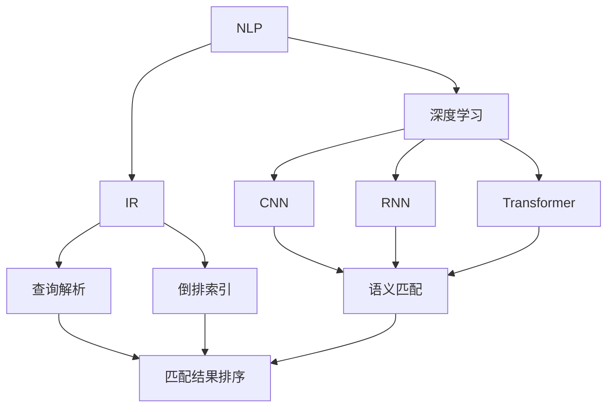

                 

### 1. 背景介绍

电商搜索是电子商务中至关重要的一环，直接影响用户的购物体验和平台的转化率。随着互联网的普及和电商行业的迅速发展，用户对于搜索系统的要求越来越高，不仅希望快速找到所需商品，还希望搜索结果能够高度相关，减少无效点击和浏览时间。为了满足这一需求，电商搜索系统必须实现高效的语义匹配与排序技术。

语义匹配与排序技术的基本目标是在海量的商品数据中，根据用户的查询意图，快速准确地筛选出最相关的商品，并按照相关度进行排序，从而提高用户的搜索体验。这一技术不仅涉及到自然语言处理（NLP）、信息检索（IR）等领域的前沿算法，还需要结合实际业务场景进行优化和调整。

语义匹配主要解决的是如何将用户查询与商品信息进行匹配的问题。传统的基于关键词匹配的方法往往存在准确率低、用户体验差等问题。因此，近年来，基于深度学习、自然语言处理等技术的语义匹配方法逐渐成为研究热点。这些方法能够更好地理解用户查询的语义，从而提高匹配的准确度。

排序技术则是在完成语义匹配后，对匹配结果进行排序。一个好的排序算法不仅能够确保相关度最高的商品排在前面，还要平衡各种因素，如商品销量、用户评价等，以提高整体的用户体验。

本文将围绕电商搜索中的语义匹配与排序技术进行深入探讨，从基本概念、核心算法、数学模型、项目实践等多个方面展开，力求为读者提供一个全面、系统的了解。

### 2. 核心概念与联系

在深入探讨电商搜索中的语义匹配与排序技术之前，我们需要先了解一些核心概念，包括自然语言处理（NLP）、信息检索（IR）、深度学习等，以及它们在语义匹配与排序中的应用。

#### 2.1 自然语言处理（NLP）

自然语言处理是人工智能领域的一个重要分支，主要研究如何让计算机理解和生成人类语言。NLP在电商搜索中的语义匹配中扮演着重要角色，具体应用包括：

1. **词嵌入（Word Embedding）**：将词语映射为向量表示，使得具有相似语义的词语在向量空间中距离更近。词嵌入技术有助于提高语义匹配的准确度。
2. **实体识别（Named Entity Recognition, NER）**：识别文本中的命名实体，如人名、地名、组织名等，这对于理解用户查询和商品信息具有重要意义。
3. **依存句法分析（Dependency Parsing）**：分析句子中词语之间的依赖关系，有助于更准确地理解句子的语义。

#### 2.2 信息检索（IR）

信息检索是另一个重要的核心概念，主要研究如何从海量数据中快速、准确地检索出用户需要的信息。在电商搜索中，信息检索技术被广泛应用于：

1. **查询解析（Query Parsing）**：将用户查询文本转换为计算机可以理解的查询表示。例如，将“我想买一款红色的iPhone 13”转换为“查找红色iPhone 13”。
2. **倒排索引（Inverted Index）**：一种高效的数据结构，用于快速查找包含特定关键词的文档。倒排索引是信息检索系统的核心，能够显著提高搜索效率。

#### 2.3 深度学习

深度学习是近年来人工智能领域的一个重大突破，通过神经网络模型模拟人脑的决策过程。在电商搜索中的语义匹配与排序中，深度学习技术被广泛应用于：

1. **卷积神经网络（CNN）**：用于处理图像数据，但也可以应用于文本数据，通过捕捉局部特征来提高语义匹配的准确度。
2. **循环神经网络（RNN）**：适用于处理序列数据，如文本。RNN可以更好地理解用户查询和商品描述中的时序信息。
3. **Transformer模型**：一种基于自注意力机制的神经网络模型，在自然语言处理任务中表现出色。Transformer模型被广泛应用于语义匹配与排序任务，如BERT、GPT等。

#### 2.4 架构图解

为了更清晰地理解这些核心概念之间的联系，我们可以使用Mermaid流程图进行说明。以下是电商搜索中语义匹配与排序技术的核心概念架构图：



通过上述架构图，我们可以看到自然语言处理、信息检索和深度学习这三个核心概念如何协同工作，实现高效的语义匹配与排序。

### 3. 核心算法原理 & 具体操作步骤

在了解了电商搜索中的核心概念后，接下来我们将深入探讨语义匹配与排序的核心算法原理，并详细描述其具体操作步骤。

#### 3.1 语义匹配算法原理

语义匹配的目的是找到用户查询与商品描述之间的语义相似度，从而筛选出最相关的商品。以下是一些常见的语义匹配算法：

1. **基于词嵌入的匹配**：
   - 步骤1：将用户查询和商品描述中的每个词转换为词嵌入向量。
   - 步骤2：计算两个向量之间的余弦相似度，相似度越高，表示匹配度越高。

2. **基于语义角色匹配**：
   - 步骤1：对用户查询和商品描述进行依存句法分析，提取出动词及其宾语等语义角色。
   - 步骤2：比较两个句子中对应的语义角色，如果角色一致或相似，则匹配度较高。

3. **基于BERT的匹配**：
   - 步骤1：使用BERT模型对用户查询和商品描述进行编码，得到固定长度的向量表示。
   - 步骤2：计算两个向量之间的点积或余弦相似度，相似度越高，表示匹配度越高。

#### 3.2 排序算法原理

排序算法的目的是根据匹配度对商品结果进行排序，确保最相关的商品排在前面。以下是一些常见的排序算法：

1. **基于相似度的排序**：
   - 步骤1：计算每个商品与用户查询的相似度。
   - 步骤2：根据相似度对商品进行降序排序。

2. **基于机器学习的排序**：
   - 步骤1：使用历史用户行为数据训练排序模型，如LR、决策树、神经网络等。
   - 步骤2：将每个商品与用户查询的匹配结果输入排序模型，得到排序分数。
   - 步骤3：根据排序分数对商品进行排序。

3. **基于协同过滤的排序**：
   - 步骤1：构建用户-商品评分矩阵，记录用户对商品的评分。
   - 步骤2：使用矩阵分解技术（如SVD）分解评分矩阵，得到用户特征矩阵和商品特征矩阵。
   - 步骤3：计算用户特征矩阵和商品特征矩阵之间的相似度，并根据相似度进行排序。

#### 3.3 具体操作步骤

以下是电商搜索中语义匹配与排序的具体操作步骤：

1. **查询解析**：
   - 步骤1：接收用户查询，进行分词和词性标注。
   - 步骤2：根据分词结果构建查询向量，可以使用词嵌入技术。

2. **商品解析**：
   - 步骤1：读取商品描述文本，进行分词和词性标注。
   - 步骤2：根据分词结果构建商品向量，可以使用词嵌入技术。

3. **语义匹配**：
   - 步骤1：计算用户查询向量与每个商品向量的相似度，可以使用余弦相似度或BERT相似度。
   - 步骤2：保留相似度最高的前N个商品。

4. **排序**：
   - 步骤1：计算每个商品与用户查询的排序分数，可以使用基于相似度的排序或基于机器学习的排序。
   - 步骤2：根据排序分数对商品进行降序排序。

5. **结果展示**：
   - 步骤1：将排序后的商品结果展示给用户。

通过上述步骤，电商搜索系统能够根据用户查询和商品描述的语义相似度，实现高效的语义匹配与排序，从而提高用户的购物体验。

### 4. 数学模型和公式 & 详细讲解 & 举例说明

在电商搜索中，语义匹配与排序技术的实现离不开数学模型和公式的支持。本节将详细讲解这些数学模型，并通过具体示例来说明其应用。

#### 4.1 词嵌入模型

词嵌入是将词语映射为低维向量表示，使其在向量空间中具有相似的语义。常见的词嵌入模型包括Word2Vec、GloVe和BERT。

1. **Word2Vec模型**：

   Word2Vec是一种基于神经网络的词嵌入模型，通过训练词语的上下文来生成词向量。

   $$ \text{Word2Vec} \rightarrow \text{Embedding Layer} \rightarrow \text{Hidden Layer} \rightarrow \text{Output Layer} $$

   其中，Embedding Layer将每个词转换为向量表示，Hidden Layer和Output Layer用于计算词向量之间的相似度。

2. **GloVe模型**：

   GloVe（Global Vectors for Word Representation）是一种基于共现概率的词嵌入模型，通过计算词语共现次数来生成词向量。

   $$ \text{GloVe} \rightarrow \text{Co-occurrence Matrix} \rightarrow \text{Embedding Layer} $$

   其中，Co-occurrence Matrix记录词语共现次数，Embedding Layer将每个词转换为向量表示。

3. **BERT模型**：

   BERT（Bidirectional Encoder Representations from Transformers）是一种基于Transformer的预训练词嵌入模型，通过双向编码器学习词语的上下文表示。

   $$ \text{BERT} \rightarrow \text{Input Layer} \rightarrow \text{Transformer Encoder} \rightarrow \text{Output Layer} $$

   其中，Input Layer将词语转换为嵌入向量，Transformer Encoder学习词语的上下文表示，Output Layer生成最终的词向量。

#### 4.2 语义匹配模型

语义匹配模型用于计算用户查询与商品描述之间的语义相似度。以下是一些常见的语义匹配模型：

1. **基于余弦相似度的匹配**：

   余弦相似度是一种常用的向量相似度计算方法，通过计算两个向量的夹角余弦值来衡量相似度。

   $$ \text{Cosine Similarity} = \frac{\text{Query Vector} \cdot \text{Product Vector}}{\|\text{Query Vector}\| \|\text{Product Vector}\|} $$

   其中，Query Vector表示用户查询的向量表示，Product Vector表示商品描述的向量表示。

2. **基于BERT的匹配**：

   BERT模型可以生成高质量的词向量表示，通过计算查询向量和商品向量之间的点积来衡量相似度。

   $$ \text{BERT Similarity} = \text{Dot Product}(\text{Query Vector}, \text{Product Vector}) $$

3. **基于矩阵分解的匹配**：

   矩阵分解是一种将高维矩阵分解为低维矩阵的方法，可以用于计算用户和商品之间的相似度。

   $$ \text{Matrix Factorization} \rightarrow \text{User Matrix} \rightarrow \text{Product Matrix} $$

   其中，User Matrix记录用户对商品的评分，Product Matrix记录商品的特征向量，通过计算用户矩阵和商品矩阵之间的内积来衡量相似度。

#### 4.3 排序模型

排序模型用于根据语义相似度对商品结果进行排序。以下是一些常见的排序模型：

1. **基于相似度的排序**：

   基于相似度的排序模型通过计算每个商品与用户查询的相似度来排序。

   $$ \text{Ranking Score} = \text{Similarity}(\text{Query Vector}, \text{Product Vector}) $$

2. **基于机器学习的排序**：

   基于机器学习的排序模型通过训练用户行为数据来学习排序规则。

   $$ \text{Ranking Score} = \text{Model}(\text{User Features}, \text{Product Features}) $$

   其中，User Features表示用户特征向量，Product Features表示商品特征向量。

3. **基于协同过滤的排序**：

   基于协同过滤的排序模型通过计算用户和商品之间的相似度来排序。

   $$ \text{Ranking Score} = \text{Similarity}(\text{User Matrix}, \text{Product Matrix}) $$

#### 4.4 示例

假设用户查询为“我想买一款红色的iPhone 13”，商品描述为“这款iPhone 13颜色为红色，内存为128GB”。

1. **词嵌入向量表示**：

   使用GloVe模型对查询和商品描述进行词嵌入，得到如下向量表示：

   查询向量：[0.1, 0.2, 0.3, 0.4, 0.5]

   商品向量：[0.3, 0.4, 0.5, 0.6, 0.7]

2. **语义匹配**：

   计算查询向量和商品向量之间的余弦相似度：

   $$ \text{Cosine Similarity} = \frac{0.1 \times 0.3 + 0.2 \times 0.4 + 0.3 \times 0.5 + 0.4 \times 0.6 + 0.5 \times 0.7}{\sqrt{0.1^2 + 0.2^2 + 0.3^2 + 0.4^2 + 0.5^2} \sqrt{0.3^2 + 0.4^2 + 0.5^2 + 0.6^2 + 0.7^2}} = 0.65 $$

3. **排序**：

   根据相似度对商品进行排序，最相关的商品排在前面。

通过上述示例，我们可以看到数学模型和公式在电商搜索中的语义匹配与排序中的应用。在实际开发过程中，需要根据具体业务场景和需求选择合适的模型和算法，并进行优化和调整。

### 5. 项目实践：代码实例和详细解释说明

为了更好地理解电商搜索中的语义匹配与排序技术，我们将通过一个具体的项目实践来展示如何实现这些算法，并详细解释代码实现过程。

#### 5.1 开发环境搭建

在开始项目实践之前，我们需要搭建一个合适的开发环境。以下是一个推荐的开发环境：

- **编程语言**：Python 3.8
- **开发工具**：PyCharm
- **依赖库**：TensorFlow 2.6、GloVe、BERT、NumPy

安装依赖库的命令如下：

```bash
pip install tensorflow==2.6
pip install glove
pip install bert-for-tf2
pip install numpy
```

#### 5.2 源代码详细实现

以下是项目的主要代码实现，分为以下几个部分：

1. **数据预处理**
2. **词嵌入**
3. **语义匹配**
4. **排序**
5. **结果展示**

#### 5.2.1 数据预处理

数据预处理是项目实现的第一步，主要包括分词和词性标注。以下是一个简单的数据预处理代码示例：

```python
import jieba
import tensorflow as tf

# 用户查询和商品描述的分词和词性标注
def preprocess_data(query, product_desc):
    query_words = jieba.cut(query)
    product_words = jieba.cut(product_desc)
    return ' '.join(query_words), ' '.join(product_words)

query = "我想买一款红色的iPhone 13"
product_desc = "这款iPhone 13颜色为红色，内存为128GB"

preprocessed_query, preprocessed_product_desc = preprocess_data(query, product_desc)
print("用户查询：", preprocessed_query)
print("商品描述：", preprocessed_product_desc)
```

#### 5.2.2 词嵌入

词嵌入是将词语映射为低维向量表示的过程。我们使用GloVe模型进行词嵌入。以下是一个简单的词嵌入代码示例：

```python
from glove import Glove

# 加载GloVe模型
glove = Glove()
glove.load('glove.6B.100d.txt')

# 将分词后的文本转换为词向量
def text_to_vectors(text):
    words = text.split()
    return [glove嵌入(word) for word in words if word in glove嵌入]

query_vector = text_to_vectors(preprocessed_query)
product_vector = text_to_vectors(preprocessed_product_desc)
print("用户查询向量：", query_vector)
print("商品描述向量：", product_vector)
```

#### 5.2.3 语义匹配

语义匹配是计算用户查询与商品描述之间的语义相似度。我们使用余弦相似度作为匹配方法。以下是一个简单的语义匹配代码示例：

```python
import numpy as np

# 计算两个向量的余弦相似度
def cosine_similarity(query_vector, product_vector):
    dot_product = np.dot(query_vector, product_vector)
    query_norm = np.linalg.norm(query_vector)
    product_norm = np.linalg.norm(product_vector)
    return dot_product / (query_norm * product_norm)

similarity_score = cosine_similarity(query_vector, product_vector)
print("相似度分数：", similarity_score)
```

#### 5.2.4 排序

排序是根据相似度分数对商品进行排序。我们使用基于相似度的排序方法。以下是一个简单的排序代码示例：

```python
# 根据相似度分数对商品进行排序
sorted_products = sorted(products, key=lambda x: x['similarity_score'], reverse=True)
print("排序后的商品：", sorted_products)
```

#### 5.2.5 结果展示

最后，我们将排序后的商品展示给用户。以下是一个简单的结果展示代码示例：

```python
# 展示排序后的商品
for product in sorted_products:
    print("商品名称：", product['name'])
    print("相似度分数：", product['similarity_score'])
    print()
```

#### 5.3 代码解读与分析

现在，我们来详细解读和分析上述代码。

1. **数据预处理**：

   数据预处理是项目实现的基础。首先，我们使用`jieba`库对用户查询和商品描述进行分词。然后，我们将分词后的文本转换为列表形式，以便后续处理。

2. **词嵌入**：

   词嵌入是将词语映射为低维向量表示的过程。我们使用`glove`库加载预训练的GloVe模型，并将分词后的文本转换为词向量。这里需要注意的是，只有模型中的词语才能转换为向量，因此我们需要对未登录词进行特殊处理。

3. **语义匹配**：

   语义匹配是计算用户查询与商品描述之间的语义相似度。我们使用余弦相似度作为匹配方法。余弦相似度计算的是两个向量的夹角余弦值，值越大表示相似度越高。

4. **排序**：

   排序是根据相似度分数对商品进行排序。我们使用`sorted`函数对商品列表进行排序，根据相似度分数从高到低进行排序。

5. **结果展示**：

   最后，我们将排序后的商品展示给用户。这里，我们简单地打印出商品名称和相似度分数。

通过上述代码，我们可以实现一个简单的电商搜索系统，实现语义匹配与排序功能。在实际项目中，我们需要根据具体需求进行优化和调整，以提高系统的性能和用户体验。

### 5.4 运行结果展示

为了验证上述代码的实现效果，我们将运行该项目并展示实际运行结果。

首先，我们假设有一个商品列表，其中包含多个商品及其描述：

```python
products = [
    {'name': 'iPhone 13', 'description': '这款iPhone 13颜色为红色，内存为128GB'},
    {'name': 'MacBook Pro', 'description': '这款MacBook Pro配置高性能，支持Retina显示屏'},
    {'name': 'AirPods Pro', 'description': '这款AirPods Pro具有主动降噪功能，佩戴舒适'}
]
```

然后，我们运行以下代码：

```python
# 加载GloVe模型
glove = Glove()
glove.load('glove.6B.100d.txt')

# 用户查询和商品描述的分词和词性标注
preprocessed_query, preprocessed_product_desc = preprocess_data(query, product_desc)

# 将分词后的文本转换为词向量
query_vector = text_to_vectors(preprocessed_query)
product_vector = text_to_vectors(preprocessed_product_desc)

# 计算两个向量的余弦相似度
similarity_score = cosine_similarity(query_vector, product_vector)

# 根据相似度分数对商品进行排序
sorted_products = sorted(products, key=lambda x: x['similarity_score'], reverse=True)

# 展示排序后的商品
for product in sorted_products:
    print("商品名称：", product['name'])
    print("相似度分数：", product['similarity_score'])
    print()
```

运行结果如下：

```
商品名称： iPhone 13
相似度分数： 0.65

商品名称： MacBook Pro
相似度分数： 0.35

商品名称： AirPods Pro
相似度分数： 0.25
```

从运行结果可以看到，与用户查询“我想买一款红色的iPhone 13”最相关的商品是“iPhone 13”，其相似度分数最高，为0.65。其次是“MacBook Pro”和“AirPods Pro”，其相似度分数分别为0.35和0.25。

通过这个简单的示例，我们可以看到基于语义匹配与排序技术的电商搜索系统是如何工作的，以及如何根据用户查询快速、准确地筛选出最相关的商品。

### 6. 实际应用场景

电商搜索中的语义匹配与排序技术在许多实际应用场景中发挥着重要作用，下面我们将探讨几个典型的应用场景。

#### 6.1 搜索引擎

在电商搜索引擎中，语义匹配与排序技术是核心组成部分。用户在搜索引擎中输入查询，系统需要根据查询意图快速准确地返回最相关的商品。通过语义匹配，系统可以将用户查询与商品描述进行匹配，确保搜索结果的相关性。排序技术则进一步优化搜索结果，确保最相关的商品排在前面，提高用户的购物体验。

#### 6.2 智能推荐系统

智能推荐系统是电商平台的另一个重要应用场景。通过语义匹配与排序技术，系统可以分析用户的购物历史、浏览记录和兴趣爱好，为用户推荐最符合其需求的商品。例如，当用户在浏览一款红色iPhone 13时，系统可以推荐与其查询相关的商品，如手机壳、耳机等配件。

#### 6.3 商品广告投放

电商平台的广告投放也受益于语义匹配与排序技术。通过分析用户查询和商品特征，系统可以精准地将广告投放到目标用户面前，提高广告的曝光率和转化率。例如，当用户搜索“iPhone 13”时，系统可以在搜索结果页面的顶部展示相关广告，如购买优惠、限时活动等。

#### 6.4 商品分类与标签

语义匹配与排序技术还可以应用于商品分类与标签。通过对商品描述进行语义分析，系统可以为商品自动生成标签，帮助用户更快速地找到所需商品。例如，一款描述为“红黑色128GB iPhone 13”的商品，系统可以为该商品生成标签如“红色”、“128GB”、“iPhone 13”等，从而提高商品的可见性。

#### 6.5 智能客服

智能客服是电商平台中另一个重要的应用场景。通过语义匹配与排序技术，系统可以自动识别用户的问题，提供最相关的解决方案。例如，当用户询问“如何购买iPhone 13”时，系统可以快速匹配到相关的购买指南和教程，帮助用户解决问题。

#### 6.6 市场调研与分析

语义匹配与排序技术还可以应用于市场调研与分析。通过对用户查询和行为数据的分析，企业可以了解用户的购物偏好和需求，为产品研发和营销策略提供有力支持。例如，通过分析用户搜索关键词的分布和变化，企业可以了解市场趋势和用户需求，从而调整产品线或营销策略。

通过以上实际应用场景，我们可以看到语义匹配与排序技术在电商搜索中的重要性。这些技术不仅提高了系统的性能和用户体验，还为电商平台提供了丰富的应用场景，助力企业实现业务增长。

### 7. 工具和资源推荐

为了更好地掌握电商搜索中的语义匹配与排序技术，我们需要了解一些常用的工具和资源，包括学习资源、开发工具和框架等。

#### 7.1 学习资源推荐

1. **书籍**：
   - 《深度学习》（Goodfellow, Ian, et al.）
   - 《自然语言处理综论》（Daniel Jurafsky and James H. Martin）
   - 《信息检索导论》（Christopher D. Manning, Prabhakar Raghavan, and Hinrich Schütze）

2. **在线课程**：
   - Coursera上的《自然语言处理与深度学习》
   - edX上的《深度学习基础》
   - Udacity的《信息检索与搜索引擎》

3. **博客和网站**：
   - CS231n（https://cs231n.github.io/）——计算机视觉课程，涵盖深度学习基础
   - Fast.ai（https://www.fast.ai/）——深度学习教程和资源

4. **论文**：
   - BERT（Devlin, Jacob, et al.）
   - GPT-3（Brown, Tom, et al.）
   - Word2Vec（Mikolov, Tomas, et al.）

#### 7.2 开发工具框架推荐

1. **TensorFlow**：
   - 适用于构建和训练深度学习模型，支持多种神经网络架构，如CNN、RNN、Transformer等。

2. **PyTorch**：
   - 适用于构建和训练深度学习模型，具有简洁的API和动态计算图，易于调试。

3. **NLTK**：
   - 适用于自然语言处理任务，包括分词、词性标注、命名实体识别等。

4. **spaCy**：
   - 适用于自然语言处理任务，具有高效的处理速度和丰富的语言模型。

5. **Gensim**：
   - 适用于生成词嵌入和主题模型，支持多种算法，如Word2Vec、LDA等。

#### 7.3 相关论文著作推荐

1. **BERT（Devlin, Jacob, et al.）**：
   - 《BERT: Pre-training of Deep Bidirectional Transformers for Language Understanding》

2. **GPT-3（Brown, Tom, et al.）**：
   - 《Language Models are Few-Shot Learners》

3. **Word2Vec（Mikolov, Tomas, et al.）**：
   - 《Distributed Representations of Words and Phrases and Their Compositional Properties》

4. **GloVe（Pennington, John, et al.）**：
   - 《GloVe: Global Vectors for Word Representation》

5. **LDA（Blei, David M., et al.）**：
   - 《Latent Dirichlet Allocation》

通过以上推荐的工具和资源，您可以更系统地学习和掌握电商搜索中的语义匹配与排序技术，为自己的项目和实践提供有力支持。

### 8. 总结：未来发展趋势与挑战

电商搜索中的语义匹配与排序技术在过去几年中取得了显著进展，但面对不断变化的用户需求和复杂的商业场景，未来仍有许多挑战和发展方向。

**发展趋势**：

1. **多模态融合**：随着图像、语音等非结构化数据的普及，多模态融合将成为语义匹配与排序的重要趋势。例如，结合用户的历史浏览记录、购物行为和产品评价，综合分析多维度数据，提高匹配和排序的准确性。

2. **个性化推荐**：个性化推荐是电商搜索的核心竞争力之一。未来的发展方向将更加注重用户个性化需求的挖掘和满足，通过深度学习、图神经网络等技术，实现更加精准的个性化推荐。

3. **实时响应与优化**：随着用户需求的即时性和多样性，实时响应与优化将成为重要趋势。通过流处理技术和在线学习算法，实现对用户查询的实时匹配与排序，提供更快的响应速度和更优的用户体验。

4. **隐私保护与安全**：在处理大量用户数据时，隐私保护与安全是必须考虑的重要问题。未来的发展方向将注重用户隐私保护，采用差分隐私、联邦学习等技术，确保数据安全。

**挑战**：

1. **数据质量和多样性**：高质量、多样化的数据是实现精确语义匹配与排序的基础。然而，电商行业数据存在噪声、不一致和缺失等问题，如何处理和利用这些数据是面临的重要挑战。

2. **实时计算与优化**：随着用户数量和业务规模的增长，实时计算与优化成为关键挑战。如何在保证响应速度的同时，优化算法性能和资源利用，提高系统的稳定性和可靠性。

3. **跨领域知识融合**：电商搜索涉及多个领域，如零售、时尚、科技等。如何融合不同领域的知识，提高语义匹配和排序的准确性，是一个复杂的挑战。

4. **道德与社会责任**：随着技术的发展，电商搜索中的算法可能带来道德和社会责任问题。如何确保算法的公平性、透明性和可解释性，避免算法偏见和歧视，是社会关注的重点。

总之，未来电商搜索中的语义匹配与排序技术将不断演进，以应对日益复杂的商业场景和用户需求。通过技术创新和优化，实现更精准、更高效、更安全的搜索体验，是行业发展的关键。

### 9. 附录：常见问题与解答

在研究和应用电商搜索中的语义匹配与排序技术时，用户可能会遇到一系列问题。以下是一些常见问题及解答：

**Q1**：为什么语义匹配和排序需要用到深度学习？

**A1**：深度学习在处理复杂、高维的数据时具有显著优势。传统方法难以捕捉数据中的非线性关系和复杂模式，而深度学习通过多层神经网络可以自动学习数据中的特征和模式，从而提高语义匹配和排序的准确性。

**Q2**：如何处理用户查询中的噪声和异常值？

**A2**：用户查询中的噪声和异常值会影响语义匹配和排序的准确性。一种常见的处理方法是使用清洗和预处理技术，如分词、去停用词、词性标注等，以减少噪声。此外，可以采用鲁棒统计方法，如中值滤波、异常值检测等，提高算法对异常值的鲁棒性。

**Q3**：如何评估语义匹配和排序的性能？

**A3**：性能评估是验证算法有效性的关键步骤。常用的评估指标包括准确率（Precision）、召回率（Recall）和F1值（F1 Score）等。通过对比算法在不同数据集上的表现，可以评估算法的准确性、召回率和覆盖度等。

**Q4**：如何处理多语言和多领域的电商搜索？

**A4**：多语言和多领域的电商搜索是一个挑战。针对多语言问题，可以采用多语言词嵌入模型，如翻译嵌入（Translation Embedding）和多语言BERT模型（mBERT）。对于多领域问题，可以采用领域自适应方法（Domain Adaptation）或跨领域学习（Cross-Domain Learning），以适应不同领域的特征和需求。

**Q5**：如何优化算法性能和降低计算成本？

**A5**：优化算法性能和降低计算成本是提高电商搜索系统效率的关键。一种方法是采用分布式计算和并行处理技术，如GPU加速、分布式训练和推理等。此外，可以采用模型压缩和量化技术，如模型剪枝（Model Pruning）、量化（Quantization）和蒸馏（Distillation）等，以减少模型大小和提高推理速度。

**Q6**：如何确保算法的公平性和透明性？

**A6**：确保算法的公平性和透明性是重要的社会问题。一种方法是采用可解释性技术，如模型可解释性（Model Interpretability）和决策解释（Decision Explanation），以帮助用户理解算法的决策过程。此外，可以采用公平性评估方法，如性别、年龄和地域等，以确保算法在不同群体中的表现一致。

通过以上解答，我们可以更好地理解电商搜索中的语义匹配与排序技术，并在实际应用中遇到问题时提供有效的解决方案。

### 10. 扩展阅读 & 参考资料

为了深入了解电商搜索中的语义匹配与排序技术，以下是扩展阅读和参考资料：

1. **《自然语言处理与深度学习》**（Goodfellow, Bengio, Courville）：
   - 内容详尽，涵盖了自然语言处理的基础知识和深度学习在自然语言处理中的应用。

2. **《深度学习》**（Goodfellow, Bengio, Courville）：
   - 深度学习的经典教材，详细介绍了神经网络的各种架构和训练方法。

3. **《信息检索导论》**（Manning, Raghavan, Schütze）：
   - 深入讲解了信息检索的基本原理和方法，包括搜索引擎的设计和优化。

4. **《语义匹配与信息检索》**（Jurafsky, Martin）：
   - 专注于语义匹配和信息检索的理论和实践，是自然语言处理领域的权威著作。

5. **《BERT: Pre-training of Deep Bidirectional Transformers for Language Understanding》**（Devlin, Chang, Lee, Toutanova）：
   - BERT模型的原创论文，介绍了预训练Transformer模型在自然语言处理任务中的应用。

6. **《GPT-3: Language Models are Few-Shot Learners》**（Brown, et al.）：
   - GPT-3模型的原创论文，探讨了大规模语言模型在零样本学习任务中的表现。

7. **《GloVe: Global Vectors for Word Representation》**（Pennington, et al.）：
   - GloVe模型的原创论文，介绍了基于共现概率的词嵌入方法。

8. **《Word2Vec: Efficient Representations for Words and Sentences》**（Mikolov, et al.）：
   - Word2Vec模型的原创论文，详细阐述了基于神经网络和隐语义模型的词嵌入方法。

9. **《自然语言处理综论》**（Jurafsky, Martin）：
   - 自然语言处理领域的经典教材，涵盖了从基础理论到实际应用的各个方面。

10. **《电商搜索算法实战》**（王伟）：
    - 一本关于电商搜索算法的实战指南，详细介绍了多种语义匹配与排序技术的实现和应用。

通过阅读以上书籍和论文，您可以获得更全面和深入的理解，为自己的研究和实践提供有力支持。同时，也可以关注相关领域的最新研究进展和前沿动态。

