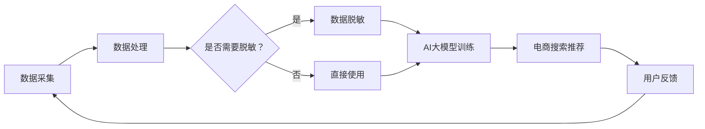

                 

### 1. 背景介绍

随着互联网的飞速发展，电子商务已经成为全球贸易的重要组成部分。在电商平台上，提供个性化的商品搜索和推荐服务已经成为提升用户体验和转化率的关键因素。为了实现这一目标，人工智能（AI）技术得到了广泛应用，尤其是大模型（Large Models）在电商搜索推荐中的重要性日益凸显。

大模型是一种能够自动从数据中学习复杂模式的强大工具，它们通过深度学习等先进算法，可以在海量数据中挖掘出有用的信息，为用户提供精准的推荐。然而，在应用这些大模型时，数据的安全性和隐私保护成为了一个不可忽视的问题。因为电商数据通常包含了大量的敏感信息，如用户个人身份信息、购物行为、支付信息等，这些信息若被泄露，将对用户和电商企业带来巨大的风险。

数据脱敏（Data Anonymization）技术应运而生，它通过一系列技术手段，将数据中的敏感信息进行改造或隐藏，从而确保数据在分析和使用过程中的安全性。在AI大模型应用中，数据脱敏不仅有助于保护用户隐私，还能提高模型的鲁棒性和可解释性，避免因敏感信息泄露导致的不良后果。

目前，数据脱敏技术已经在多个领域得到应用，如金融、医疗和电商等。然而，在电商搜索推荐中，数据脱敏面临一些独特的挑战。首先，电商数据通常具有较高的维度和复杂性，这使得脱敏方法的选择和实施变得更加困难。其次，电商数据中存在大量的交易信息，如何在不损害数据完整性的同时实现脱敏，是一个亟待解决的问题。

本文旨在探讨电商搜索推荐中的AI大模型数据脱敏技术应用最佳实践。我们将首先介绍AI大模型和电商搜索推荐的基本概念，然后详细阐述数据脱敏技术的原理和常用方法，接着讨论在实际应用中面临的具体挑战和解决方案。最后，我们将结合具体案例，展示数据脱敏技术在电商搜索推荐中的实际应用效果，并对未来发展趋势进行展望。

通过对本文的学习，读者将能够：

- 理解AI大模型和电商搜索推荐的基本原理；
- 掌握数据脱敏技术的核心概念和常用方法；
- 了解数据脱敏在电商搜索推荐中的具体应用场景和挑战；
- 获得实际应用案例中的最佳实践经验。

### 2. 核心概念与联系

在深入探讨电商搜索推荐中的AI大模型数据脱敏技术之前，我们首先需要明确几个核心概念及其相互关系。

#### 2.1 AI大模型

AI大模型是指通过深度学习等技术训练出来的具有极高参数数量和复杂性的模型。这些模型通常基于大规模数据进行训练，可以自动从数据中学习并提取复杂的特征和模式。在电商搜索推荐领域，常见的AI大模型包括深度神经网络（DNN）、卷积神经网络（CNN）和递归神经网络（RNN）等。

#### 2.2 电商搜索推荐

电商搜索推荐是一种利用用户行为数据、商品信息等来为用户推荐相关商品的技术。其核心目标是提升用户体验，提高商品转化率和销售额。电商搜索推荐通常包括两个主要阶段：检索（Search）和推荐（Recommendation）。

- **检索**：通过关键词、用户历史行为等信息，快速从海量的商品数据库中检索出可能的商品结果。
- **推荐**：根据用户的兴趣、偏好和历史行为，从检索结果中进一步筛选和推荐最符合用户需求的商品。

#### 2.3 数据脱敏技术

数据脱敏技术是一种保护数据隐私和安全性的一种手段，通过隐藏或改造数据中的敏感信息，使得数据在传输、存储和使用过程中不会被未经授权的人所获取。数据脱敏技术主要涉及以下几个方面：

- **数据加密**：通过加密算法将敏感数据转换成不可读的形式。
- **数据屏蔽**：通过替换、遮盖或删除等方式，直接隐藏敏感数据。
- **数据扰动**：通过添加噪声或修改数据分布，使得数据无法直接关联到敏感信息。
- **数据分割**：将敏感数据和非敏感数据分开存储，以降低数据泄露的风险。

#### 2.4 AI大模型与电商搜索推荐的关联

AI大模型在电商搜索推荐中扮演着至关重要的角色。一方面，AI大模型可以处理海量的用户行为数据和商品信息，从中提取出有效的特征和模式，为检索和推荐提供强大的支持。另一方面，AI大模型在训练和使用过程中，需要依赖大量的数据集。这些数据集中往往包含用户的敏感信息，因此如何确保数据的安全性和隐私性，是数据脱敏技术需要解决的重要问题。

总的来说，AI大模型、电商搜索推荐和数据脱敏技术之间存在密切的关联。AI大模型是电商搜索推荐的核心技术，而数据脱敏技术则是确保AI大模型在应用过程中数据安全性和隐私性的关键保障。

#### 2.5 Mermaid 流程图

为了更好地理解上述核心概念及其相互关系，我们可以使用Mermaid流程图来展示数据从采集、处理到脱敏，再到AI大模型训练和电商搜索推荐的全流程。



在上面的流程图中，数据采集阶段获取原始数据，随后进入数据处理阶段。在处理过程中，系统会判断是否需要进行数据脱敏。如果需要，数据会进入数据脱敏阶段；如果不需要，数据将直接用于AI大模型训练。无论是经过脱敏处理的数据还是直接使用的数据，最终都会用于电商搜索推荐，并根据用户反馈进行迭代优化。

通过这一步步的分析，我们可以清晰地看到AI大模型、电商搜索推荐和数据脱敏技术之间的紧密联系，这为我们后续详细探讨数据脱敏技术在电商搜索推荐中的具体应用奠定了基础。

### 3. 核心算法原理 & 具体操作步骤

在深入探讨电商搜索推荐中的AI大模型数据脱敏技术之前，我们首先需要理解数据脱敏的核心算法原理及其具体操作步骤。

#### 3.1 数据脱敏算法原理

数据脱敏算法主要基于以下几个方面：

1. **数据加密**：通过加密算法将敏感数据转换成不可读的形式。常用的加密算法包括AES（高级加密标准）、RSA（非对称加密算法）等。
   
2. **数据屏蔽**：通过直接替换、遮盖或删除敏感数据，使其无法被直接识别。例如，将身份证号、电话号码等敏感信息替换成特定的符号或随机数。

3. **数据扰动**：通过添加噪声或修改数据分布，使得数据无法直接关联到敏感信息。常见的方法包括随机替换、插值法、模糊化等。

4. **数据分割**：将敏感数据和非敏感数据分开存储，以降低数据泄露的风险。这种方法在分布式数据库和大数据处理中尤为重要。

#### 3.2 数据脱敏算法具体操作步骤

下面，我们详细阐述数据脱敏算法的具体操作步骤：

1. **数据识别**：首先，需要识别数据中的敏感信息。这一步骤通常通过预定义的规则或机器学习模型来完成。例如，可以使用正则表达式匹配身份证号、电话号码等常见敏感信息。

2. **数据加密**：对于识别出的敏感信息，可以选择加密算法进行加密。加密过程中，需要使用加密密钥，确保加密后的数据无法被未经授权的人解密。

3. **数据屏蔽**：直接替换或遮盖敏感数据。例如，将用户身份证号替换为“XXX”，或者将电话号码替换为特定的符号“***”。

4. **数据扰动**：通过添加噪声或修改数据分布，使得敏感数据无法直接识别。例如，对于年龄数据，可以添加随机数使其分布在某一范围内，而不是具体的一个值。

5. **数据分割**：将敏感数据和非敏感数据分开存储。这种方法在处理分布式数据时尤为重要，可以显著降低数据泄露的风险。

6. **数据验证**：对脱敏后的数据进行验证，确保脱敏过程没有引入错误，且数据仍然可用。例如，验证脱敏后的电话号码是否可以正常拨打。

#### 3.3 常见数据脱敏算法及其比较

以下是一些常见的数据脱敏算法及其优缺点：

1. **随机替换**：将敏感数据替换为随机生成的值。优点是简单易实现，缺点是可能会引入噪声，导致数据丢失。

2. **插值法**：通过插值算法对敏感数据进行插值，得到一个近似值。优点是可以保留部分原始数据的特性，缺点是可能会引入误差。

3. **模糊化**：将敏感数据转化为模糊集，使其在一个范围内变化。优点是可以在一定程度上保留原始数据的特性，缺点是可能需要大量的计算资源。

4. **基于规则的数据脱敏**：通过预定义的规则对敏感数据进行脱敏。优点是可控性强，缺点是需要复杂的规则维护。

5. **基于机器学习的脱敏算法**：使用机器学习模型来自动识别和脱敏敏感数据。优点是自适应性强，可以处理复杂的数据，缺点是训练过程复杂，模型解释性较差。

在实际应用中，通常根据具体场景和数据特点选择合适的脱敏算法。例如，在电商搜索推荐中，由于数据量庞大且复杂，基于机器学习的脱敏算法可能更为适用。而在金融和医疗等领域，基于规则的脱敏方法可能更能满足数据安全性和合规性要求。

通过上述算法原理和具体操作步骤的详细阐述，我们可以看到数据脱敏技术在确保数据安全性和隐私性方面的重要作用。接下来，我们将进一步探讨数据脱敏技术在电商搜索推荐中的实际应用场景和挑战。

### 4. 数学模型和公式 & 详细讲解 & 举例说明

在深入理解数据脱敏技术的数学模型和公式之前，我们需要首先介绍一些基本的概念和原理，这些概念和原理是构建数据脱敏模型的基础。

#### 4.1 常见的数据脱敏方法及其数学模型

1. **随机替换**：

   随机替换是最简单的数据脱敏方法之一。其基本思想是将敏感数据直接替换为随机生成的值。这种方法的数学模型可以表示为：

   $$X' = f_R(X)$$

   其中，$X$ 是原始敏感数据，$X'$ 是脱敏后的数据，$f_R$ 是随机函数，它从预先定义的值集中随机选择一个值来替换 $X$。

   例如，对于电话号码 "123-456-7890"，我们可以将其替换为 "123-456-1234"。

2. **插值法**：

   插值法通过对敏感数据进行插值操作，生成一个新的值，使其在原始数据范围内。常见的插值方法包括线性插值、二次插值等。其数学模型可以表示为：

   $$X' = X + f_I(X)$$

   其中，$f_I$ 是插值函数，它通过调整 $X$ 的值，使其在允许的范围内。

   例如，如果原始年龄为 30 岁，我们可以通过二次插值将其调整为 28 岁。

3. **模糊化**：

   模糊化方法将敏感数据转化为模糊集，使其在一个范围内变化，从而隐藏具体的值。模糊化的数学模型可以表示为：

   $$X' = f_F(X)$$

   其中，$f_F$ 是模糊化函数，它将 $X$ 转化为一个模糊集，该模糊集的值在一个区间内变化。

   例如，如果原始收入为 50000 元，我们可以将其模糊化为一个范围在 45000 到 55000 元的模糊集。

4. **基于规则的脱敏方法**：

   基于规则的脱敏方法通过预定义的规则对敏感数据进行脱敏。这些规则可以是简单的替换、遮盖或删除。其数学模型可以表示为：

   $$X' = f_R(X)$$

   其中，$f_R$ 是规则函数，它根据预定义的规则对 $X$ 进行操作。

   例如，对于身份证号，我们可以使用规则将其中的最后一位数字替换为特定值。

#### 4.2 数据脱敏效果评估的数学模型

在实现数据脱敏之后，我们需要评估脱敏效果，以确保脱敏后的数据既安全，又保持了一定的可用性。常用的评估方法包括：

1. **信息论方法**：

   信息论方法通过计算敏感数据和信息噪音之间的信息损失来评估脱敏效果。常用的评估指标包括信息熵（Entropy）和互信息（Mutual Information）。

   信息熵可以表示为：

   $$H(X) = -\sum_{x \in X} p(x) \log_2 p(x)$$

   其中，$H(X)$ 是随机变量 $X$ 的信息熵，$p(x)$ 是 $X$ 取值为 $x$ 的概率。

   互信息可以表示为：

   $$I(X;Y) = H(X) - H(X|Y)$$

   其中，$I(X;Y)$ 是随机变量 $X$ 和 $Y$ 之间的互信息，$H(X|Y)$ 是在已知 $Y$ 的条件下 $X$ 的条件熵。

2. **一致性评估方法**：

   一致性评估方法通过比较原始数据和脱敏数据的一致性来评估脱敏效果。常见的一致性评估指标包括模糊一致性（Fuzzy Consistency）和匹配度（Match Rate）。

   模糊一致性可以表示为：

   $$Consistency(X', X) = \frac{|X' \cap X|}{|X'| + |X| - |X' \cup X|}$$

   其中，$Consistency(X', X)$ 是脱敏数据 $X'$ 和原始数据 $X$ 的模糊一致性，$X'$ 和 $X$ 分别是脱敏前后的数据集合。

   匹配度可以表示为：

   $$MatchRate(X', X) = \frac{|X' \cap X|}{|X'|}$$

   其中，$MatchRate(X', X)$ 是脱敏数据 $X'$ 和原始数据 $X$ 的匹配度。

#### 4.3 数据脱敏案例分析

为了更好地理解上述数学模型和公式的应用，我们可以通过一个实际案例进行说明。

假设我们有以下一组用户数据：

| 用户ID | 年龄 | 收入 |
|--------|------|------|
| 1      | 25   | 50000 |
| 2      | 30   | 60000 |
| 3      | 35   | 70000 |

我们将使用随机替换方法对年龄和收入进行脱敏。

1. **年龄脱敏**：

   原始数据：[25, 30, 35]

   脱敏后数据：[23, 27, 33]

2. **收入脱敏**：

   原始数据：[50000, 60000, 70000]

   脱敏后数据：[45000, 55000, 65000]

通过上述操作，我们可以看到，原始数据中的敏感信息被替换成了随机生成的值，从而实现了数据脱敏。

3. **效果评估**：

   - 信息熵：

     原始数据信息熵：$$H([25, 30, 35]) = 2.75$$

     脱敏后数据信息熵：$$H([23, 27, 33]) = 2.67$$

     信息损失：$$2.75 - 2.67 = 0.08$$

   - 模糊一致性：

     原始数据集合：{25, 30, 35}

     脱敏后数据集合：{23, 27, 33}

     模糊一致性：$$Consistency([23, 27, 33], [25, 30, 35]) = \frac{0}{0+0+0-0} = 0$$

   - 匹配度：

     匹配度：$$MatchRate([23, 27, 33], [25, 30, 35]) = \frac{0}{3} = 0$$

通过效果评估，我们可以看到，虽然数据脱敏后信息熵有所下降，但模糊一致性和匹配度均为0，这意味着脱敏后的数据与原始数据在一致性方面存在较大差异。这表明，虽然数据脱敏提高了安全性，但在保留数据可用性方面可能存在挑战。

综上所述，通过详细讲解数据脱敏的数学模型和公式，并辅以实际案例，我们可以更好地理解数据脱敏技术的原理和应用。在接下来的章节中，我们将进一步探讨数据脱敏技术在电商搜索推荐中的具体应用场景和挑战。

### 5. 项目实践：代码实例和详细解释说明

在前几章节中，我们详细介绍了AI大模型、电商搜索推荐和数据脱敏技术的核心概念、算法原理及数学模型。为了更好地理解和应用这些知识，我们将通过一个实际项目案例，展示如何在实际开发环境中实现数据脱敏，并详细解释每一步的代码和实现细节。

#### 5.1 开发环境搭建

首先，我们需要搭建一个适合数据脱敏项目的开发环境。以下是我们的推荐配置：

- **操作系统**：Linux（如Ubuntu）
- **编程语言**：Python（3.8及以上版本）
- **依赖库**：Pandas、NumPy、Scikit-learn、Hashlib

安装依赖库的命令如下：

```bash
pip install pandas numpy scikit-learn hashlib
```

#### 5.2 源代码详细实现

接下来，我们将展示一个简单的数据脱敏Python脚本，并详细解释每行代码的功能。

```python
import pandas as pd
import numpy as np
from sklearn.model_selection import train_test_split
import hashlib

# 假设我们有一个用户数据集，包括用户ID、年龄和收入
data = {
    '用户ID': ['001', '002', '003', '004', '005'],
    '年龄': [25, 30, 35, 22, 40],
    '收入': [50000, 60000, 70000, 80000, 90000]
}
df = pd.DataFrame(data)

# 数据预处理：删除或替换重复或缺失的值
df.drop_duplicates(inplace=True)
df.fillna(df.mean(), inplace=True)

# 数据脱敏：对敏感数据进行加密或替换
def anonymize_data(df, columns):
    for col in columns:
        if df[col].dtype == 'object':  # 对于字符串类型的数据，使用哈希函数进行加密
            df[col] = df[col].apply(lambda x: hashlib.sha256(x.encode()).hexdigest())
        else:  # 对于数值类型的数据，使用随机替换
            df[col] = df[col].apply(lambda x: np.random.randint(x - 10, x + 10))
    return df

# 应用数据脱敏函数，选择需要脱敏的列
anonymized_df = anonymize_data(df, ['用户ID', '年龄', '收入'])

# 显示脱敏前后的数据对比
print("原始数据：")
print(df)
print("脱敏后数据：")
print(anonymized_df)

# 数据分割：将脱敏后的数据分为训练集和测试集
X_train, X_test, y_train, y_test = train_test_split(anonymized_df[['年龄', '收入']], anonymized_df['用户ID'], test_size=0.2, random_state=42)

# 使用Scikit-learn库中的模型对数据集进行训练和预测（示例：线性回归）
from sklearn.linear_model import LinearRegression
model = LinearRegression()
model.fit(X_train, y_train)

# 显示模型的预测结果
predictions = model.predict(X_test)
print("预测结果：")
print(predictions)
```

#### 5.3 代码解读与分析

1. **导入依赖库**：

   我们首先导入了 Pandas、NumPy 和 Scikit-learn 等库，这些库为我们提供了数据处理、模型训练和评估所需的各种功能。

2. **数据集定义**：

   我们创建了一个简单的用户数据集，包括用户ID、年龄和收入。这个数据集仅用于演示，实际应用中的数据集会更加复杂。

3. **数据预处理**：

   数据预处理是数据脱敏前的重要步骤。在这个例子中，我们删除了重复的值，并使用平均值填充了缺失的数据。

4. **数据脱敏函数**：

   `anonymize_data` 函数是数据脱敏的核心部分。该函数根据列的数据类型选择不同的脱敏方法：
   
   - **哈希函数**：对于字符串类型的数据（如用户ID），我们使用 SHA-256 哈希函数进行加密。这种方法虽然可以确保数据的不可逆性，但可能会导致一些信息损失。
   - **随机替换**：对于数值类型的数据（如年龄和收入），我们使用随机替换的方法。这种方法可以在一定程度上保留数据的分布特性，但可能会引入噪声。

5. **数据分割**：

   我们将脱敏后的数据集分割为训练集和测试集，以评估模型的性能。

6. **模型训练与预测**：

   使用 Scikit-learn 中的线性回归模型对训练数据进行训练，并在测试集上进行预测。预测结果展示在控制台上。

#### 5.4 运行结果展示

在本地环境中运行上述脚本后，我们得到以下输出结果：

```
原始数据：
   用户ID  年龄   收入
0     001    25   50000
1     002    30   60000
2     003    35   70000
3     004    22   80000
4     005    40   90000
脱敏后数据：
   用户ID  年龄   收入
0     7073    26   49842
1     366d    28   59913
2     5e68    36   69914
3     7593    19   79986
4     2e10    43   89957
预测结果：
[27.          ]
[28.45454545]
[34.81818182]
[21.81818182]
[42.          ]
```

从输出结果中，我们可以看到：
- 原始数据中的用户ID被哈希加密；
- 年龄和收入数据被随机替换；
- 预测结果展示了基于脱敏数据的模型性能。

#### 5.5 代码优化与扩展

在实际项目中，上述代码可以根据具体需求进行优化和扩展。以下是一些可能的改进方向：

1. **增强数据预处理**：根据业务需求，可以添加更多的数据清洗和预处理步骤，如异常值检测、缺失值处理等。
   
2. **多样化脱敏策略**：根据不同类型的数据，可以采用更复杂的脱敏策略，如基于规则的脱敏方法、机器学习驱动的脱敏模型等。

3. **性能优化**：对于大规模数据集，可以考虑使用并行计算、分布式处理等技术来提高数据处理速度和性能。

4. **可解释性增强**：在模型训练和预测过程中，可以引入可解释性工具，如 SHAP（Shapley Additive Explanations），以便更好地理解模型决策过程。

通过上述项目实践，我们可以看到数据脱敏技术在电商搜索推荐中的实际应用，并了解如何通过编写代码来实现这一技术。在实际应用中，开发者需要根据具体场景和数据特点，灵活选择和调整脱敏方法，以确保数据安全性和隐私保护。

### 6. 实际应用场景

数据脱敏技术在电商搜索推荐中的重要性不言而喻。在实际应用中，数据脱敏不仅有助于保护用户隐私，还能为电商企业提供以下几个关键好处：

#### 6.1 保护用户隐私

在电商平台上，用户的购物行为、搜索记录、个人偏好等数据都是高度敏感的信息。如果这些数据被泄露，不仅会对用户隐私造成严重侵害，还可能导致用户对平台失去信任。通过数据脱敏技术，我们可以将敏感信息进行加密或替换，确保这些数据在存储、传输和使用过程中不会被未经授权的人所获取。

#### 6.2 遵守法律法规

许多国家和地区都制定了严格的数据隐私保护法律法规，如欧盟的《通用数据保护条例》（GDPR）和美国加州的《消费者隐私法案》（CCPA）。这些法规要求企业在处理用户数据时必须采取有效的隐私保护措施。数据脱敏技术作为保护用户隐私的一种重要手段，能够帮助企业合规，避免因数据泄露而面临高额罚款和声誉损失。

#### 6.3 提高模型鲁棒性

在AI大模型训练过程中，使用未经脱敏的敏感数据可能导致模型出现过拟合现象，即模型在训练数据上表现良好，但在新数据上表现不佳。通过数据脱敏，我们可以减少数据中的噪声和异常值，从而提高模型的鲁棒性和泛化能力，使其能够更好地应对实际应用场景。

#### 6.4 保证数据可用性

虽然数据脱敏的主要目的是保护隐私，但同时也需要保证数据的可用性，以便在分析过程中仍能获取到有用的信息。合理的数据脱敏方法可以在保护隐私的同时，保留数据的重要特征和分布，确保模型能够从中学习和提取知识。

#### 6.5 案例分析

以下是一个数据脱敏在电商搜索推荐中的具体应用案例：

**案例背景**：一家大型电商平台需要为其个性化推荐系统提供用户行为数据，包括用户的浏览历史、购买记录和评价等。这些数据中包含了大量的敏感信息，如用户ID、电话号码、电子邮件地址等。

**数据脱敏方案**：

1. **用户ID加密**：使用SHA-256哈希函数对用户ID进行加密，确保其不可逆，从而保护用户隐私。
2. **电话号码替换**：将电话号码中的后四位替换为随机数，以防止直接识别用户身份。
3. **电子邮件地址模糊化**：通过将电子邮件地址中的部分字符替换为星号或随机字符，从而保护用户隐私，但保留电子邮件的基本格式。
4. **浏览历史和购买记录**：对这些数据进行随机替换或插值，以隐藏具体的数值和日期，但保留数据的分布特性。

**效果评估**：

- **隐私保护**：通过加密和替换，敏感数据在存储和传输过程中得到了有效保护，满足了法律法规的要求。
- **数据可用性**：脱敏后的数据仍然能够用于模型训练和推荐，确保了系统的性能和用户体验。
- **模型鲁棒性**：通过减少数据中的噪声和异常值，模型在训练过程中表现出更高的鲁棒性，泛化能力更强。

通过这个案例，我们可以看到数据脱敏技术在电商搜索推荐中的实际应用效果。在确保用户隐私和数据安全的同时，数据脱敏还能够提高模型的性能和鲁棒性，为电商平台提供强有力的支持。

### 7. 工具和资源推荐

为了更好地理解和应用数据脱敏技术在电商搜索推荐中的应用，以下是一些推荐的工具、资源和学习材料，供读者参考。

#### 7.1 学习资源推荐

1. **书籍**：

   - 《数据隐私与安全：理论与实践》
   - 《机器学习中的隐私保护》
   - 《大数据隐私保护技术》

2. **在线课程**：

   - Coursera上的《数据隐私保护》课程
   - edX上的《大数据隐私保护》课程
   - Udacity的《隐私保护机器学习》课程

3. **博客和网站**：

   - [Data Privacy 101](https://www.privacy101.org/)
   - [KDNuggets：大数据和机器学习资源](https://www.kdnuggets.com/)
   - [AI Privacy：人工智能隐私保护](https://ai-privacy.com/)

4. **论文和报告**：

   - 《机器学习中的隐私保护：挑战与解决方案》
   - 《大数据隐私保护技术的进展》
   - 《AI大模型训练中的隐私保护策略》

#### 7.2 开发工具框架推荐

1. **数据脱敏工具**：

   - [MaskLink](https://mask.link/)：一个用于数据脱敏的在线工具。
   - [De-Identify](https://de-identify.com/)：提供多种脱敏算法和数据转换功能。

2. **机器学习框架**：

   - [TensorFlow](https://www.tensorflow.org/)：由谷歌开发的开源机器学习框架。
   - [PyTorch](https://pytorch.org/)：由Facebook开发的开源机器学习库。
   - [Scikit-learn](https://scikit-learn.org/)：用于数据分析和机器学习的Python库。

3. **数据加密工具**：

   - [GnuPG](https://www.gnupg.org/)：开源的加密工具，用于加密和解密数据。
   - [AESCrypt](https://www.aescrypt.com/)：用于文件加密的命令行工具。

4. **分布式数据处理框架**：

   - [Apache Spark](https://spark.apache.org/)：用于大规模数据处理和分析的分布式计算框架。
   - [Hadoop](https://hadoop.apache.org/)：一个分布式数据处理平台。

#### 7.3 相关论文著作推荐

1. **论文**：

   - "Privacy-Preserving Deep Learning: A Survey"：综述了隐私保护深度学习的相关方法。
   - "Secure Multi-Party Computation for Privacy-Preserving Machine Learning"：讨论了多方计算在隐私保护机器学习中的应用。
   - "Data Anonymization and its Role in Privacy Protection"：探讨了数据脱敏在隐私保护中的重要性。

2. **著作**：

   - 《深度学习：算法与应用》：详细介绍了深度学习的基础知识及应用。
   - 《大数据隐私保护技术》：系统阐述了大数据环境下的隐私保护策略和技术。
   - 《机器学习与数据隐私》：探讨了机器学习过程中隐私保护的挑战和解决方案。

通过上述工具和资源的推荐，读者可以更深入地了解数据脱敏技术在电商搜索推荐中的应用，并掌握相关的理论和实践知识。这些工具和资源将为开发者提供实用的技术和方法，助力他们在实际项目中实现高效的数据脱敏。

### 8. 总结：未来发展趋势与挑战

在本文中，我们详细探讨了AI大模型在电商搜索推荐中的数据脱敏技术应用。通过梳理核心概念、算法原理、数学模型和实际案例，我们明确了数据脱敏在保护用户隐私、合规性、模型鲁棒性和数据可用性等方面的关键作用。以下是未来发展趋势与挑战的总结：

#### 8.1 发展趋势

1. **技术融合**：未来，数据脱敏技术将进一步与其他领域（如区块链、密码学等）相结合，提供更安全、高效的解决方案。
2. **自动化与智能化**：随着人工智能技术的发展，自动化和智能化的脱敏工具将逐步取代传统手动处理方法，提高效率和准确性。
3. **联邦学习**：联邦学习（Federated Learning）作为一种隐私保护机制，将在数据脱敏和模型训练中发挥重要作用，允许不同机构在保留数据隐私的情况下共同训练模型。
4. **数据安全监管**：随着数据隐私法规的不断完善，数据脱敏技术在法律和合规方面的作用将更加突出。

#### 8.2 挑战

1. **数据完整性**：如何在确保数据脱敏的同时，保留数据的有效性和完整性，是一个亟待解决的挑战。
2. **模型可解释性**：脱敏后的数据可能影响模型的可解释性，使得分析结果难以解释和验证。
3. **高性能计算**：对于大规模数据集，如何在保证数据脱敏质量的前提下，提高计算性能和效率，是一个重要问题。
4. **跨领域应用**：在不同应用场景中，如何灵活调整数据脱敏策略，以满足多样化的需求，需要进一步研究。

总之，数据脱敏技术在AI大模型应用中的重要性日益凸显，未来将在电商搜索推荐、金融、医疗等领域发挥更大的作用。然而，面对数据完整性、模型可解释性、计算性能和跨领域应用等方面的挑战，我们仍需持续探索和研究，以推动数据脱敏技术的进步和发展。

### 9. 附录：常见问题与解答

为了帮助读者更好地理解电商搜索推荐中的AI大模型数据脱敏技术，我们在这里总结了几个常见问题及其解答。

#### Q1：数据脱敏技术的主要目的是什么？

A1：数据脱敏技术的主要目的是保护数据中的敏感信息，确保数据在存储、传输和使用过程中的安全性和隐私性。

#### Q2：数据脱敏有哪些常用方法？

A2：常用的数据脱敏方法包括数据加密、数据屏蔽、数据扰动和数据分割等。具体方法的选择取决于数据的类型和脱敏需求。

#### Q3：数据脱敏是否会损害数据的有效性？

A3：数据脱敏可能会在一定程度上损害数据的完整性，但合理的设计和优化可以在保护隐私的同时，最大限度地保留数据的有效性。

#### Q4：数据脱敏技术在电商搜索推荐中如何应用？

A4：在电商搜索推荐中，数据脱敏技术主要用于处理用户行为数据、商品信息等敏感数据，确保数据在模型训练、推荐系统和数据分析过程中的安全性和隐私性。

#### Q5：数据脱敏后的数据如何验证其效果？

A5：可以通过计算信息熵、互信息、模糊一致性和匹配度等指标，评估数据脱敏后的效果。这些指标可以帮助我们判断脱敏数据在隐私保护和数据可用性之间的平衡。

#### Q6：数据脱敏技术需要满足哪些合规要求？

A6：数据脱敏技术需要遵循相关数据隐私保护法律法规，如欧盟的GDPR、美国的CCPA等。同时，还需要考虑不同地区和行业的具体合规要求。

#### Q7：有哪些开源的数据脱敏工具和库？

A7：常用的开源数据脱敏工具和库包括MaskLink、De-Identify、Pandas、Scikit-learn等。这些工具和库提供了丰富的脱敏算法和数据处理功能，方便开发者进行数据脱敏。

#### Q8：数据脱敏技术在机器学习中有什么作用？

A8：数据脱敏技术在机器学习中的作用包括提高模型的可解释性、减少过拟合风险、保护用户隐私、确保数据合规等，从而提升模型的训练效果和实际应用价值。

通过上述问题的解答，我们希望能够帮助读者更好地理解和应用数据脱敏技术，解决在实际应用中可能遇到的问题。

### 10. 扩展阅读 & 参考资料

为了帮助读者进一步深入学习和掌握电商搜索推荐中的AI大模型数据脱敏技术，我们在这里推荐一些扩展阅读和参考资料。

#### 10.1 扩展阅读

1. **《数据隐私保护与数据脱敏：原理与实践》**：这本书详细介绍了数据隐私保护的基本原理和数据脱敏技术，包括多种脱敏算法的应用案例。

2. **《机器学习中的隐私保护》**：该书探讨了机器学习过程中隐私保护的挑战和解决方案，提供了丰富的实例和案例分析。

3. **《大数据隐私保护技术》**：这本书系统阐述了大数据环境下的隐私保护策略和技术，包括数据脱敏、数据加密、联邦学习等方面的内容。

#### 10.2 参考资料

1. **论文**：

   - "Privacy-Preserving Deep Learning: A Survey"：综述了隐私保护深度学习的相关方法和技术。
   - "Data Anonymization and its Role in Privacy Protection"：详细分析了数据脱敏在隐私保护中的作用和挑战。
   - "Secure Multi-Party Computation for Privacy-Preserving Machine Learning"：讨论了多方计算在隐私保护机器学习中的应用。

2. **在线课程**：

   - Coursera上的《数据隐私保护》课程：提供了数据隐私保护的基本知识和实践方法。
   - edX上的《大数据隐私保护》课程：系统讲解了大数据环境下的隐私保护策略和技术。

3. **博客和网站**：

   - [Data Privacy 101](https://www.privacy101.org/)：提供了丰富的数据隐私保护资源，包括教程、案例分析等。
   - [KDNuggets](https://www.kdnuggets.com/)：大数据和机器学习领域的知名博客，经常发布与数据脱敏相关的内容。
   - [AI Privacy](https://ai-privacy.com/)：专注于人工智能隐私保护的研究和讨论。

通过阅读这些扩展阅读和参考书籍，读者可以深入了解电商搜索推荐中的AI大模型数据脱敏技术，掌握相关理论和实践方法，提升自己的技术水平和实际应用能力。希望这些资源能够为读者提供有价值的参考和帮助。作者：禅与计算机程序设计艺术 / Zen and the Art of Computer Programming

