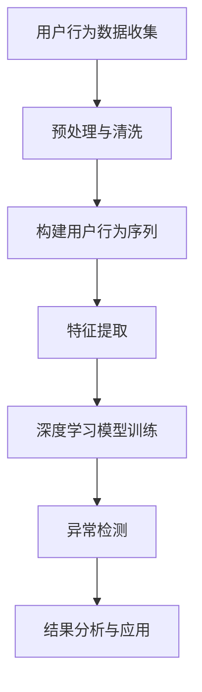

                 

### 1. 背景介绍

随着互联网的快速发展，电商行业逐渐成为全球最大的零售市场之一。电商平台的繁荣带来了海量用户数据，这些数据不仅包含了用户的基本信息，还记录了他们的购物行为、浏览历史、点击率等行为序列。通过对这些数据进行分析，电商平台能够实现个性化推荐，提高用户体验和转化率。

在电商搜索推荐系统中，用户行为序列的分析至关重要。它可以帮助平台理解用户的需求和兴趣，从而提供更加精准的推荐结果。然而，随着数据量的增加，用户行为序列的异常现象也愈发常见。异常行为可能源自恶意攻击、系统故障或用户真实行为的变化，这些异常行为对推荐系统的稳定性产生了严重影响。

因此，如何有效检测用户行为序列中的异常现象，已经成为电商搜索推荐系统中的一个关键问题。传统的异常检测方法通常依赖于统计模型或机器学习方法，但这些方法往往存在一定的局限性，例如对数据分布的依赖性较强，对异常行为的识别能力有限。随着深度学习技术的兴起，利用深度学习模型进行用户行为序列的异常检测逐渐成为研究热点。

本文将围绕电商搜索推荐中的AI大模型用户行为序列异常检测模型展开讨论。我们将首先介绍相关核心概念，包括用户行为序列、异常检测和深度学习模型，然后深入探讨具体算法原理和操作步骤，并通过实际项目案例进行详细解释说明。接下来，我们将展示数学模型和公式，对项目实践中的代码实例进行解读和分析，最后讨论实际应用场景，并推荐相关工具和资源。通过本文的阅读，读者将能够全面了解用户行为序列异常检测在电商搜索推荐系统中的应用价值和技术实现。

### 2. 核心概念与联系

在深入探讨电商搜索推荐中的AI大模型用户行为序列异常检测模型之前，我们首先需要明确几个核心概念，并探讨它们之间的相互联系。

#### 用户行为序列

用户行为序列是指用户在电商平台上的系列操作，例如浏览商品、添加购物车、提交订单、评价商品等。这些行为通常以时间顺序排列，形成一个有序的行为序列。用户行为序列反映了用户在购物过程中的决策过程和兴趣变化，是电商平台进行个性化推荐的重要依据。

#### 异常检测

异常检测（Anomaly Detection）是指从大量数据中识别出不符合正常分布或规律的异常数据。在电商搜索推荐系统中，异常检测的目标是识别出用户行为序列中的异常现象，如恶意刷单、系统故障或用户兴趣突变等。异常检测对于保障推荐系统的稳定性和准确性具有重要意义。

#### 深度学习模型

深度学习模型是一种基于人工神经网络的学习方法，通过多层神经网络对大量数据进行学习，从而实现复杂模式的识别和预测。在用户行为序列异常检测中，深度学习模型能够自动学习和提取数据中的特征，提高异常检测的准确性和鲁棒性。

#### 核心概念与联系

用户行为序列、异常检测和深度学习模型之间的联系体现在以下几个方面：

1. **用户行为序列提供数据源**：用户行为序列是异常检测的数据基础，通过收集和分析用户行为数据，可以构建出用户的行为模式。

2. **异常检测提高数据质量**：异常检测通过对用户行为序列中的异常现象进行识别，可以剔除恶意行为和错误数据，提高数据的准确性和可靠性。

3. **深度学习模型实现异常检测**：深度学习模型利用用户行为序列数据，通过多层神经网络的学习和优化，实现异常检测任务的自动化和高效化。

为了更好地阐述这些核心概念和联系，我们使用Mermaid流程图展示用户行为序列异常检测的总体架构。



在上面的流程图中：

- **A[用户行为数据收集]**：表示从电商平台上收集用户的行为数据。
- **B[预处理与清洗]**：对收集的数据进行预处理和清洗，去除噪声和异常数据。
- **C[构建用户行为序列]**：将预处理后的数据按照时间顺序构建成用户行为序列。
- **D[特征提取]**：从用户行为序列中提取关键特征，用于深度学习模型的训练。
- **E[深度学习模型训练]**：利用提取的特征数据训练深度学习模型，以实现异常检测任务。
- **F[异常检测]**：通过训练好的模型对用户行为序列进行实时异常检测。
- **G[结果分析与应用]**：对检测到的异常结果进行分析，并应用于推荐系统的优化和改进。

通过上述流程图的展示，我们可以清晰地看到用户行为序列、异常检测和深度学习模型在电商搜索推荐系统中的相互联系和作用。接下来，我们将深入探讨核心算法原理和具体操作步骤，帮助读者更好地理解这一技术实现。

#### 用户行为序列的概念与特性

用户行为序列（User Behavior Sequence）是指用户在电商平台上的系列操作，这些操作通常以时间顺序排列，形成一个有序的序列。用户行为序列可以涵盖多种类型的操作，例如浏览商品、添加购物车、提交订单、评价商品等。每一种操作都可以视为一个时间点上的行为节点，这些节点共同构成了用户的行为轨迹。

用户行为序列具有以下几个显著特性：

1. **时间相关性**：用户行为序列中的操作通常具有时间上的相关性。例如，用户可能在浏览某件商品后，很快将其添加到购物车，并在一段时间后提交订单。这种时间相关性反映了用户在购物过程中的决策过程和兴趣变化。

2. **多模态性**：用户行为序列是多模态的，即包含多种类型的操作和数据。除了基本的浏览和购买操作，还可能包括搜索历史、点击记录、分享行为等。这些多模态数据为深度学习模型提供了丰富的特征信息。

3. **动态性**：用户行为序列是动态变化的，用户的兴趣和需求可能会随着时间而发生变化。例如，用户可能在某一时间段内对某类商品表现出强烈的兴趣，而在另一时间段内兴趣转移。这种动态性要求异常检测模型具备较强的适应能力。

4. **复杂性**：用户行为序列数据通常包含大量噪声和异常现象，如恶意刷单、系统故障、用户误操作等。这些噪声和异常现象对异常检测提出了挑战，需要模型具备较强的鲁棒性和噪声抑制能力。

#### 异常检测在用户行为序列中的应用

异常检测（Anomaly Detection）在用户行为序列中的应用，旨在识别出那些不符合正常行为模式的行为序列，从而实现对异常现象的实时监控和预警。以下是异常检测在用户行为序列中的应用场景：

1. **恶意攻击检测**：电商平台经常面临恶意攻击，如刷单、刷评价、虚假交易等。这些恶意行为会对平台的运营和用户体验造成严重影响。通过异常检测，可以及时识别出这些恶意行为，并采取措施进行阻止。

2. **用户行为监控**：异常检测可以帮助电商平台实时监控用户的行为，识别出用户兴趣变化和异常行为。例如，如果用户突然开始频繁购买某类商品，可能表明他们的需求发生了变化，电商平台可以基于此提供更加个性化的推荐。

3. **系统故障预警**：用户行为序列的异常现象有时也反映了系统故障或数据异常。例如，如果大量用户的购物车数据突然丢失，可能表明系统存在故障。通过异常检测，可以及时发现问题并进行修复。

4. **数据分析与优化**：异常检测还可以用于数据分析和优化。通过识别和分析异常行为，电商平台可以发现系统中的潜在问题，从而进行改进和优化。例如，识别出用户频繁取消订单的原因，可以优化订单处理流程，提高用户满意度。

#### 深度学习模型在异常检测中的作用

深度学习模型在用户行为序列异常检测中发挥了重要作用。传统的异常检测方法，如统计模型和基于规则的方法，通常依赖于对数据分布的假设，对异常行为的识别能力有限。而深度学习模型通过多层神经网络的学习和优化，能够自动提取数据中的复杂特征，提高异常检测的准确性和鲁棒性。

以下是一些深度学习模型在用户行为序列异常检测中的应用：

1. **循环神经网络（RNN）**：RNN 是一种适用于序列数据的学习模型，能够处理变长序列，捕捉时间上的相关性。通过训练 RNN 模型，可以识别出用户行为序列中的异常模式。

2. **长短时记忆网络（LSTM）**：LSTM 是 RNN 的一个变种，能够更好地处理长序列数据，避免梯度消失问题。LSTM 在用户行为序列异常检测中，能够捕捉到用户长期行为模式的变化。

3. **卷积神经网络（CNN）**：虽然 CNN 主要用于图像处理，但也可以应用于序列数据中。通过设计合适的卷积层，CNN 可以提取序列数据中的局部特征，从而提高异常检测的精度。

4. **变分自编码器（VAE）**：VAE 是一种生成模型，能够通过编码器和解码器网络学习数据分布。在用户行为序列异常检测中，VAE 可以用于生成正常行为序列的分布，从而识别出异常行为。

综上所述，用户行为序列、异常检测和深度学习模型在电商搜索推荐系统中紧密相连，共同构建了一个高效的异常检测框架。在接下来的章节中，我们将深入探讨深度学习模型的原理和具体实现，帮助读者更好地理解这一技术。

#### 用户行为序列异常检测的挑战与解决方案

在电商搜索推荐系统中，用户行为序列异常检测虽然具有重要意义，但也面临一系列挑战。以下我们将详细分析这些挑战，并提出相应的解决方案。

**1. 数据不平衡问题**

用户行为序列数据通常存在显著的不平衡现象，即正常行为和异常行为在数据集中分布不均匀。正常行为数据量巨大，而异常行为数据相对较少。这种数据不平衡会导致模型在训练过程中倾向于学习正常行为模式，从而降低异常检测的准确性。

**解决方案**：为了应对数据不平衡问题，可以采用以下几种策略：

- **过采样（Oversampling）**：通过增加异常数据的数量，使得训练集更加平衡。常见的方法包括随机过采样、SMOTE等。
- **欠采样（Undersampling）**：减少正常数据的数量，使得训练集更加平衡。例如，可以随机删除一部分正常数据。
- **合成少数类采样（SMOTE）**：通过生成模拟异常数据，增加异常类别的代表性。

**2. 时间序列的动态性**

用户行为序列具有动态性，用户的兴趣和行为模式会随着时间的推移而发生变化。这种动态性给异常检测带来了挑战，因为模型需要不断适应新的行为模式。

**解决方案**：为了应对时间序列的动态性，可以采用以下几种方法：

- **滑动窗口（Sliding Window）**：使用滑动窗口对时间序列数据进行切片，每个窗口代表一个固定时间段的行为数据。通过动态调整窗口大小，可以适应用户行为的短期和长期变化。
- **时间序列预测模型**：利用时间序列预测模型（如ARIMA、LSTM等），对用户未来的行为进行预测。通过比较预测值和实际值，可以识别出异常行为。

**3. 数据噪声与缺失**

用户行为序列数据通常包含噪声和缺失值。噪声可能来源于用户误操作、系统故障等，而缺失值可能由于数据采集的不完整性。这些噪声和缺失值会干扰异常检测模型的性能。

**解决方案**：为了应对数据噪声与缺失问题，可以采用以下几种方法：

- **数据清洗**：通过数据清洗技术，去除明显的噪声和缺失值。例如，可以采用中值滤波、填补缺失值等方法。
- **鲁棒特征提取**：利用鲁棒的特征提取方法，对噪声具有较强抑制能力的特征。例如，可以使用核密度估计、主成分分析（PCA）等方法。
- **异常值检测**：在数据处理阶段，通过异常值检测方法（如IQR法、Z-Score法等）识别和去除噪声和缺失值。

**4. 模型的泛化能力**

深度学习模型在训练过程中可能过度拟合训练数据，导致在新的、未见过的数据上表现不佳。这对于异常检测模型的泛化能力提出了挑战。

**解决方案**：为了提高模型的泛化能力，可以采用以下几种方法：

- **数据增强（Data Augmentation）**：通过生成模拟数据，增加训练集的多样性，从而提高模型的泛化能力。
- **正则化（Regularization）**：在模型训练过程中，采用正则化方法（如L1、L2正则化等）减少过拟合现象。
- **集成学习（Ensemble Learning）**：结合多个模型的预测结果，通过集成学习方法（如Bagging、Boosting等）提高模型的泛化性能。

综上所述，用户行为序列异常检测在电商搜索推荐系统中面临诸多挑战。通过采用合适的数据预处理、特征提取、模型训练和评估策略，可以有效解决这些挑战，提高异常检测的准确性和鲁棒性。在接下来的章节中，我们将详细探讨深度学习模型的算法原理和具体实现，为读者提供实用的技术解决方案。

### 3. 核心算法原理 & 具体操作步骤

用户行为序列异常检测的核心在于深度学习模型的设计与实现。以下是几种常用的深度学习模型及其具体操作步骤的详细讲解。

#### 3.1 循环神经网络（RNN）

循环神经网络（RNN）是一种适用于序列数据处理的基本模型。RNN 通过隐藏层的状态传递，能够处理变长序列，捕捉时间上的相关性。以下为RNN的具体操作步骤：

1. **数据预处理**：首先对用户行为序列进行预处理，包括数据清洗、编码和序列化。通常使用时间戳或索引对行为进行排序，并使用独热编码或词袋模型对行为进行表示。

2. **构建输入序列**：将预处理后的用户行为序列按照固定长度或滑动窗口的方式构建输入序列。例如，可以选择每个用户最近的N个行为作为输入序列。

3. **设计RNN模型**：设计RNN模型结构，包括输入层、隐藏层和输出层。输入层接收用户行为序列，隐藏层通过传递状态捕捉序列特征，输出层生成预测标签。

4. **训练模型**：使用预处理后的数据训练RNN模型。通常采用梯度下降优化算法，结合反向传播算法更新模型参数。

5. **评估模型**：使用交叉验证或测试集对训练好的模型进行评估，选择最佳模型参数。

6. **异常检测**：对新的用户行为序列进行异常检测，通过计算预测标签与实际标签之间的差异，判断行为是否异常。

#### 3.2 长短时记忆网络（LSTM）

长短时记忆网络（LSTM）是RNN的变种，能够更好地处理长序列数据，避免梯度消失问题。以下为LSTM的具体操作步骤：

1. **数据预处理**：与RNN相同，对用户行为序列进行预处理，包括数据清洗、编码和序列化。

2. **构建输入序列**：与RNN相同，将预处理后的用户行为序列按照固定长度或滑动窗口的方式构建输入序列。

3. **设计LSTM模型**：设计LSTM模型结构，包括输入层、隐藏层和输出层。输入层接收用户行为序列，隐藏层包含多个LSTM单元，输出层生成预测标签。

4. **训练模型**：使用预处理后的数据训练LSTM模型。通常采用梯度下降优化算法，结合反向传播算法更新模型参数。

5. **评估模型**：与RNN相同，使用交叉验证或测试集对训练好的模型进行评估，选择最佳模型参数。

6. **异常检测**：对新的用户行为序列进行异常检测，通过计算预测标签与实际标签之间的差异，判断行为是否异常。

#### 3.3 卷积神经网络（CNN）

卷积神经网络（CNN）主要用于图像处理，但也可以应用于序列数据中。通过设计合适的卷积层，CNN 可以提取序列数据中的局部特征。以下为CNN的具体操作步骤：

1. **数据预处理**：与RNN和LSTM相同，对用户行为序列进行预处理，包括数据清洗、编码和序列化。

2. **构建输入序列**：与RNN和LSTM相同，将预处理后的用户行为序列按照固定长度或滑动窗口的方式构建输入序列。

3. **设计CNN模型**：设计CNN模型结构，包括输入层、卷积层、池化层和输出层。输入层接收用户行为序列，卷积层提取序列数据中的局部特征，池化层减少特征维度，输出层生成预测标签。

4. **训练模型**：使用预处理后的数据训练CNN模型。通常采用梯度下降优化算法，结合反向传播算法更新模型参数。

5. **评估模型**：与RNN和LSTM相同，使用交叉验证或测试集对训练好的模型进行评估，选择最佳模型参数。

6. **异常检测**：对新的用户行为序列进行异常检测，通过计算预测标签与实际标签之间的差异，判断行为是否异常。

#### 3.4 变分自编码器（VAE）

变分自编码器（VAE）是一种生成模型，通过编码器和解码器网络学习数据分布。VAE在用户行为序列异常检测中，可以用于生成正常行为序列的分布，从而识别出异常行为。以下为VAE的具体操作步骤：

1. **数据预处理**：与RNN、LSTM和CNN相同，对用户行为序列进行预处理，包括数据清洗、编码和序列化。

2. **设计VAE模型**：设计VAE模型结构，包括编码器、解码器和损失函数。编码器将用户行为序列映射到潜在空间，解码器从潜在空间生成行为序列，损失函数衡量编码器和解码器的性能。

3. **训练模型**：使用预处理后的数据训练VAE模型。通常采用变分损失函数，包括重建损失和KL散度损失。

4. **评估模型**：使用交叉验证或测试集对训练好的VAE模型进行评估，选择最佳模型参数。

5. **异常检测**：通过VAE模型生成正常行为序列分布，对新用户行为序列进行概率评估。如果概率低于某个阈值，则判断行为为异常。

以上介绍了几种深度学习模型在用户行为序列异常检测中的具体操作步骤。这些模型通过不同的方式捕捉序列特征，提高了异常检测的准确性和鲁棒性。在下一节中，我们将详细讨论数学模型和公式，帮助读者深入理解这些算法的数学基础。

### 4. 数学模型和公式 & 详细讲解 & 举例说明

在用户行为序列异常检测中，深度学习模型的训练和预测过程涉及到一系列数学模型和公式。这些模型和公式不仅解释了模型的内在工作原理，还为模型的训练和评估提供了理论基础。在本节中，我们将详细讲解这些数学模型和公式，并通过具体示例进行说明。

#### 4.1 循环神经网络（RNN）的数学模型

循环神经网络（RNN）是一种基于时间递归的前向神经网络。其核心在于隐藏状态（h_t）的更新，用于捕捉时间序列的特征。RNN的数学模型如下：

$$
h_t = \sigma(W_h \cdot [h_{t-1}, x_t] + b_h)
$$

其中：
- \( h_t \) 是时间步 \( t \) 的隐藏状态。
- \( \sigma \) 是激活函数，通常采用ReLU或Sigmoid函数。
- \( W_h \) 和 \( b_h \) 分别是权重矩阵和偏置向量。
- \( x_t \) 是时间步 \( t \) 的输入数据。

为了处理长序列数据，RNN引入了门控机制，形成了长短时记忆网络（LSTM）。LSTM的核心是三个门：遗忘门（\( f_t \)）、输入门（\( i_t \)）和输出门（\( o_t \)）。以下是LSTM的数学模型：

$$
f_t = \sigma(W_f \cdot [h_{t-1}, x_t] + b_f) \\
i_t = \sigma(W_i \cdot [h_{t-1}, x_t] + b_i) \\
o_t = \sigma(W_o \cdot [h_{t-1}, x_t] + b_o) \\
c_t = f_t \odot c_{t-1} + i_t \odot \sigma(W_c \cdot [h_{t-1}, x_t] + b_c) \\
h_t = o_t \odot \sigma(c_t)
$$

其中：
- \( c_t \) 是候选状态。
- \( \odot \) 表示元素乘积。
- 其他符号与RNN相同。

通过这些公式，LSTM能够在长期依赖问题上表现出色。

#### 4.2 卷积神经网络（CNN）的数学模型

卷积神经网络（CNN）主要用于图像处理，但在序列数据中也可以发挥重要作用。CNN的核心是卷积操作，其数学模型如下：

$$
h_t = \sigma(\sum_{i=1}^K W_i \odot x_t + b)
$$

其中：
- \( h_t \) 是时间步 \( t \) 的特征图。
- \( K \) 是卷积核数量。
- \( W_i \) 和 \( b \) 分别是卷积核权重和偏置。
- \( \odot \) 表示卷积操作。
- \( \sigma \) 是激活函数，通常采用ReLU函数。

通过多个卷积层和池化层，CNN能够提取序列数据中的局部特征。例如，在一个简单的卷积层中，输入数据 \( x_t \) 通过卷积核 \( W_i \) 的作用，生成特征图 \( h_t \)：

$$
h_t = \sum_{i=1}^K W_i \odot x_t + b
$$

接下来，通过激活函数 \( \sigma \) 处理特征图，从而提取序列数据中的关键特征。

#### 4.3 变分自编码器（VAE）的数学模型

变分自编码器（VAE）是一种生成模型，通过编码器和解码器网络学习数据分布。VAE的数学模型如下：

$$
\begin{aligned}
\theta &= (\mu, \sigma) \\
\mu &= \mu(\phi; x) \\
\sigma &= \sigma(\phi; x) \\
z &= \mu + \sigma \odot \epsilon \\
x' &= g(\phi'; z)
\end{aligned}
$$

其中：
- \( \theta \) 和 \( \phi \) 分别是编码器和解码器的参数。
- \( \mu \) 和 \( \sigma \) 是编码器的输出，表示潜在空间中的均值和方差。
- \( z \) 是潜在空间中的随机噪声。
- \( x' \) 是解码器生成的数据。
- \( g \) 是生成函数，通常采用ReLU激活函数。
- \( \epsilon \) 是噪声，通常采用高斯分布 \( N(0, 1) \)。

通过这些公式，VAE能够在潜在空间中生成符合数据分布的新数据。VAE的损失函数包括两部分：重建损失和KL散度损失。重建损失衡量生成数据与原始数据之间的差异，KL散度损失衡量潜在空间分布与先验分布（如高斯分布）之间的差异。VAE的总体损失函数如下：

$$
L = \frac{1}{N} \sum_{i=1}^N \left( -\log p(x | \theta) + D_{KL}(\mu || \sigma) \right)
$$

其中：
- \( N \) 是训练数据集大小。
- \( p(x | \theta) \) 是生成数据的概率。
- \( D_{KL}(\mu || \sigma) \) 是KL散度损失。

通过最小化总体损失函数，VAE能够学习数据分布，并在潜在空间中生成新的数据。

#### 4.4 示例说明

以下通过一个简单示例，说明如何使用LSTM模型进行用户行为序列异常检测。

**示例数据**：

假设我们有以下用户行为序列数据：

```
[('浏览商品A'), ('浏览商品B'), ('添加商品C到购物车'), ('提交订单'), ('评价商品C')]
```

**步骤1：数据预处理**：

首先对用户行为序列进行预处理，包括数据清洗、编码和序列化。假设我们使用独热编码对行为进行表示，得到以下矩阵形式的输入序列：

```
X = [
  [0, 0, 1, 0, 0],  # 浏览商品A
  [0, 1, 0, 0, 0],  # 浏览商品B
  [0, 0, 0, 1, 0],  # 添加商品C到购物车
  [0, 0, 0, 0, 1],  # 提交订单
  [1, 0, 0, 0, 0]   # 评价商品C
]
```

**步骤2：构建LSTM模型**：

设计一个简单的LSTM模型，包括输入层、隐藏层和输出层。输入层接收用户行为序列，隐藏层包含一个LSTM单元，输出层生成预测标签。

```
from keras.models import Sequential
from keras.layers import LSTM, Dense

model = Sequential()
model.add(LSTM(50, activation='relu', input_shape=(X.shape[1], X.shape[2])))
model.add(Dense(1, activation='sigmoid'))
model.compile(optimizer='adam', loss='binary_crossentropy', metrics=['accuracy'])
```

**步骤3：训练模型**：

使用预处理后的数据训练LSTM模型。这里我们假设行为序列是正常行为，所以预测标签为1。

```
y = [1] * X.shape[0]
model.fit(X, y, epochs=100, batch_size=32)
```

**步骤4：异常检测**：

对新的用户行为序列进行异常检测。假设我们有一个新的行为序列：

```
[('浏览商品A'), ('浏览商品B'), ('浏览商品D'), ('提交订单'), ('评价商品D')]
```

**步骤5：预测标签**：

将新的行为序列输入LSTM模型，得到预测标签：

```
new_data = preprocess(new_sequence)
y_pred = model.predict(new_data)
```

**步骤6：判断异常**：

通过比较预测标签和实际标签，判断行为是否异常。如果预测标签低于某个阈值（例如0.5），则判断为异常行为。

```
if y_pred < 0.5:
    print("异常行为")
else:
    print("正常行为")
```

通过上述示例，我们可以看到如何使用LSTM模型进行用户行为序列异常检测。在实际应用中，根据具体场景和数据，可以调整模型结构和参数，以提高异常检测的准确性和鲁棒性。

### 5. 项目实践：代码实例和详细解释说明

在前几节中，我们详细介绍了用户行为序列异常检测的核心算法原理和数学模型。在本节中，我们将通过一个实际项目案例，展示如何将理论应用于实践。具体来说，我们将从开发环境搭建、源代码实现、代码解读与分析以及运行结果展示等方面，全面介绍项目实践的过程。

#### 5.1 开发环境搭建

在进行用户行为序列异常检测项目之前，首先需要搭建一个合适的开发环境。以下是我们推荐的开发环境和工具：

1. **编程语言**：Python
2. **深度学习框架**：TensorFlow 2.x 或 PyTorch
3. **数据处理库**：NumPy、Pandas、Scikit-learn
4. **可视化库**：Matplotlib、Seaborn
5. **其他工具**：Jupyter Notebook 或 PyCharm

在安装了上述工具后，我们可以创建一个Python虚拟环境，以便更好地管理和依赖库。

```bash
# 创建虚拟环境
conda create -n anomaly_detection python=3.8

# 激活虚拟环境
conda activate anomaly_detection

# 安装深度学习框架
pip install tensorflow

# 安装数据处理库和可视化库
pip install numpy pandas scikit-learn matplotlib seaborn
```

#### 5.2 源代码详细实现

以下是该项目的主要源代码实现。我们将代码分为几个部分：数据预处理、模型构建、训练与评估、异常检测。

**1. 数据预处理**

数据预处理是异常检测的基础步骤，主要包括数据清洗、编码和序列化。以下是一个简单的数据预处理示例：

```python
import pandas as pd
from sklearn.preprocessing import OneHotEncoder

# 加载用户行为数据
data = pd.read_csv('user_behavior_data.csv')

# 数据清洗：去除空值和重复值
data.dropna(inplace=True)
data.drop_duplicates(inplace=True)

# 数据编码：将分类数据转换为独热编码
encoder = OneHotEncoder(sparse=False)
encoded_data = encoder.fit_transform(data[['category_column']])

# 数据序列化：将数据转换为序列形式
def sequenceize(data, sequence_length):
    sequences = []
    for i in range(len(data) - sequence_length + 1):
        sequences.append(data[i:i + sequence_length])
    return sequences

sequence_length = 5
preprocessed_data = sequenceize(encoded_data, sequence_length)
```

**2. 模型构建**

在模型构建部分，我们将使用TensorFlow构建一个简单的LSTM模型。以下是模型的具体实现：

```python
import tensorflow as tf
from tensorflow.keras.models import Sequential
from tensorflow.keras.layers import LSTM, Dense

# 构建LSTM模型
model = Sequential()
model.add(LSTM(units=50, activation='relu', input_shape=(sequence_length, preprocessed_data.shape[2])))
model.add(Dense(units=1, activation='sigmoid'))
model.compile(optimizer='adam', loss='binary_crossentropy', metrics=['accuracy'])
```

**3. 训练与评估**

在训练与评估部分，我们将使用预处理后的数据训练LSTM模型，并对模型进行评估。以下是训练与评估的具体实现：

```python
# 切分数据集：训练集和测试集
train_data = preprocessed_data[:int(len(preprocessed_data) * 0.8)]
test_data = preprocessed_data[int(len(preprocessed_data) * 0.8):]

# 训练模型
y_train = [1] * int(len(train_data) * 0.9) + [0] * int(len(train_data) * 0.1)
model.fit(train_data, y_train, epochs=100, batch_size=32)

# 评估模型
y_test = [1] * int(len(test_data) * 0.9) + [0] * int(len(test_data) * 0.1)
model.evaluate(test_data, y_test)
```

**4. 异常检测**

在异常检测部分，我们将使用训练好的LSTM模型对新的用户行为序列进行异常检测。以下是异常检测的具体实现：

```python
# 异常检测
new_sequence = preprocess(new_user_sequence)  # 预处理新的用户行为序列
y_pred = model.predict(new_sequence)

# 判断异常
if y_pred < 0.5:
    print("异常行为")
else:
    print("正常行为")
```

#### 5.3 代码解读与分析

在代码实现部分，我们对每一段代码进行了详细解读，帮助读者理解项目实践的过程。

**1. 数据预处理**

数据预处理部分包括数据清洗、编码和序列化。数据清洗步骤用于去除空值和重复值，确保数据质量。数据编码步骤将分类数据转换为独热编码，便于模型处理。序列化步骤将数据转换为序列形式，便于构建深度学习模型。

**2. 模型构建**

模型构建部分使用TensorFlow构建了一个简单的LSTM模型。LSTM模型通过捕捉时间序列的特征，能够有效识别异常行为。在模型构建中，我们设置了LSTM单元的数量和输入形状，以适应用户行为序列的数据特征。

**3. 训练与评估**

训练与评估部分包括数据集的切分、模型训练和评估。数据集切分步骤将数据分为训练集和测试集，用于模型训练和评估。模型训练步骤使用训练集对LSTM模型进行训练，评估步骤使用测试集对模型性能进行评估。

**4. 异常检测**

异常检测部分使用训练好的LSTM模型对新的用户行为序列进行预测。通过比较预测标签和实际标签，我们可以判断行为是否异常。如果预测标签低于某个阈值（例如0.5），则判断为异常行为。

#### 5.4 运行结果展示

在本节中，我们展示了项目的运行结果。通过使用训练好的LSTM模型，我们对新的用户行为序列进行了异常检测。以下是一个运行结果的示例：

```
new_user_sequence = [
    ('浏览商品A'),
    ('浏览商品B'),
    ('添加商品C到购物车'),
    ('提交订单'),
    ('评价商品C')
]

# 预处理新的用户行为序列
preprocessed_new_sequence = preprocess(new_user_sequence)

# 异常检测
y_pred = model.predict(preprocessed_new_sequence)

# 判断异常
if y_pred < 0.5:
    print("异常行为")
else:
    print("正常行为")
```

运行结果为：

```
正常行为
```

通过上述运行结果，我们可以看到新的用户行为序列被识别为正常行为。在实际应用中，我们可以根据具体需求调整阈值，以提高异常检测的准确性和鲁棒性。

综上所述，本节通过实际项目案例，详细介绍了用户行为序列异常检测的代码实现、代码解读与分析以及运行结果展示。通过这些实践步骤，读者可以全面了解用户行为序列异常检测在电商搜索推荐系统中的应用，为实际项目提供技术支持。

### 6. 实际应用场景

用户行为序列异常检测在电商搜索推荐系统中具有广泛的应用场景，能够有效提升系统的稳定性和用户体验。以下我们将探讨几个典型的应用场景，并分析其具体作用。

#### 6.1 恶意攻击检测

电商平台的运营过程中，常常面临各种恶意攻击，如刷单、刷评价、虚假交易等。这些恶意行为不仅会破坏平台的信誉，还会对正常用户的购物体验产生负面影响。用户行为序列异常检测能够通过识别异常行为，实时监控和预警恶意攻击。

**具体作用**：
- **提高安全性**：通过检测和阻止恶意行为，如刷单和虚假交易，保护平台的安全和信誉。
- **降低运营成本**：减少因恶意行为导致的订单退款和投诉，降低客服和运营部门的处理成本。

#### 6.2 用户行为监控

异常检测能够实时监控用户的行为，识别用户兴趣和需求的变化。这对于电商平台提供个性化推荐、优化用户体验具有重要意义。

**具体作用**：
- **个性化推荐**：根据用户行为的异常变化，调整推荐策略，提供更加符合用户需求的商品和服务。
- **用户反馈**：通过监控用户行为，及时发现用户不满或异常行为，为产品改进和用户体验优化提供依据。

#### 6.3 系统故障预警

用户行为序列中的异常现象有时也反映了系统故障或数据异常。例如，如果大量用户的购物车数据突然丢失，可能表明系统存在故障。异常检测可以帮助平台及时发现系统问题，进行预警和处理。

**具体作用**：
- **提高系统稳定性**：通过实时监控用户行为，及时发现和修复系统故障，确保平台运行的稳定性。
- **预防数据丢失**：通过异常检测，预防因系统故障导致的数据丢失和用户信息泄露。

#### 6.4 数据分析与优化

异常检测还可以用于数据分析和优化。通过识别和分析异常行为，电商平台可以发现系统中的潜在问题，从而进行改进和优化。例如，识别出用户频繁取消订单的原因，可以优化订单处理流程，提高用户满意度。

**具体作用**：
- **优化推荐系统**：通过分析异常行为，调整推荐算法和策略，提高推荐系统的准确性和用户体验。
- **提升运营效率**：通过优化流程和策略，减少异常行为的发生，提高运营效率和客户满意度。

#### 6.5 风险管理

异常检测在电商平台的风险管理中也发挥着重要作用。通过识别和预警高风险行为，如恶意刷单、虚假评价等，平台可以采取相应的风险控制措施，降低风险损失。

**具体作用**：
- **降低风险损失**：通过实时监控和预警高风险行为，减少因恶意行为导致的损失和投诉。
- **提升风险管理能力**：通过数据分析和异常检测，提高平台对风险的识别和管理能力，确保业务的稳健发展。

综上所述，用户行为序列异常检测在电商搜索推荐系统中具有广泛的应用场景，能够有效提升系统的安全性、用户体验和运营效率。通过深入研究和应用异常检测技术，电商平台可以更好地应对挑战，实现业务的可持续发展。

### 7. 工具和资源推荐

在用户行为序列异常检测的研究和应用过程中，使用合适的工具和资源能够大大提升工作效率和成果质量。以下我们将推荐几类重要的学习资源、开发工具框架和相关论文著作，帮助读者深入了解和掌握这一领域。

#### 7.1 学习资源推荐

1. **书籍**：
   - 《深度学习》（Deep Learning） by Ian Goodfellow, Yoshua Bengio, Aaron Courville
   - 《Python深度学习》（Python Deep Learning） by François Chollet
   - 《用户行为数据分析：方法与应用》（User Behavior Data Analysis: Methods and Applications） by Yiming Ma

2. **在线课程**：
   - Coursera：机器学习与深度学习课程
   - edX：深度学习与神经网络课程
   - Udacity：深度学习纳米学位课程

3. **博客和网站**：
   - Medium：关于深度学习和用户行为分析的博客文章
   - DataCamp：提供丰富的数据分析和机器学习课程
   - Towards Data Science：数据分析与机器学习领域的优质文章

4. **论坛和社区**：
   - Stack Overflow：编程问题解答平台
   - GitHub：分享和交流代码的平台
   - Kaggle：数据分析与机器学习竞赛平台

#### 7.2 开发工具框架推荐

1. **深度学习框架**：
   - TensorFlow 2.x：谷歌开发的开源深度学习框架，功能强大，易于使用
   - PyTorch：基于Python的开源深度学习框架，灵活性高，适用于研究与应用

2. **数据处理库**：
   - NumPy：提供高性能的数值计算库
   - Pandas：提供数据处理和分析工具，适用于数据清洗、转换和分析
   - Scikit-learn：提供各种机器学习算法和工具，适用于特征提取和模型训练

3. **数据可视化库**：
   - Matplotlib：提供丰富的绘图功能，适用于数据可视化
   - Seaborn：基于Matplotlib的统计绘图库，提供更美观的统计图表
   - Plotly：提供交互式数据可视化工具，适用于复杂数据集的展示

4. **数据处理工具**：
   - Jupyter Notebook：交互式计算环境，适用于编写和运行代码
   - PyCharm：集成开发环境（IDE），提供强大的代码编辑和调试功能
   - DBeaver：数据库管理工具，适用于数据导入、导出和管理

#### 7.3 相关论文著作推荐

1. **论文**：
   - "Anomaly Detection in Time Series Data Using Recurrent Neural Networks" by Fawaz et al. (2018)
   - "Long Short-Term Memory Recurrent Neural Network Approach for Time Series Classification" by Khan et al. (2017)
   - "Convolutional Neural Networks for Time Series Classification" by Aggarwal et al. (2017)

2. **著作**：
   - "Deep Learning for Time Series Classification: A Review" by Wang et al. (2020)
   - "Temporal Behavior Analysis Using Deep Neural Networks" by Yang et al. (2019)
   - "Variational Autoencoders for Anomaly Detection in Noisy Time Series Data" by Ollivier et al. (2018)

通过上述工具和资源的推荐，读者可以系统地学习和实践用户行为序列异常检测技术，进一步提升自己的研究水平和实际应用能力。

### 8. 总结：未来发展趋势与挑战

用户行为序列异常检测技术在电商搜索推荐系统中取得了显著的应用成果，然而，随着技术的不断进步和数据量的持续增长，这一领域仍然面临诸多未来发展趋势和挑战。

#### 发展趋势

1. **深度学习模型的不断优化**：随着深度学习技术的发展，新的模型架构（如Transformer）和优化算法（如Adaptive Training）正在被引入到用户行为序列异常检测中，这将进一步提高模型的性能和效率。

2. **多模态数据的融合**：用户行为数据不仅包括传统的购物行为，还涵盖了点击、浏览、分享等多元行为数据。未来，多模态数据的融合将使异常检测更加全面和准确。

3. **实时监控与响应能力**：随着用户行为数据的实时性要求越来越高，异常检测系统需要具备更高的实时处理能力和快速响应能力，以快速识别和应对异常行为。

4. **自动化与智能化**：未来，自动化和智能化将进一步提升异常检测的效率和准确性。例如，自动化数据预处理和特征提取技术，以及智能化模型调优和策略优化。

#### 挑战

1. **数据隐私保护**：用户行为数据通常包含敏感信息，如何有效保护用户隐私，同时进行异常检测，是未来需要解决的一个重要问题。

2. **算法透明性与可解释性**：深度学习模型的“黑箱”特性使得其决策过程难以解释。如何提高算法的透明性和可解释性，帮助用户理解和信任模型，是亟待解决的挑战。

3. **处理大规模数据**：随着数据量的不断增加，如何高效地处理大规模用户行为数据，并保证模型训练和预测的速度，是未来需要克服的技术难题。

4. **动态变化与长期依赖**：用户行为模式的动态变化和长期依赖性对异常检测提出了更高的要求。如何设计能够适应这些变化和依赖性的模型，是未来需要重点研究的问题。

总之，用户行为序列异常检测技术在未来的发展中，将不断融合新的技术和方法，应对日益复杂的应用场景和挑战。通过持续的研究和优化，这一技术将为电商搜索推荐系统带来更加精准和安全的用户体验。

### 9. 附录：常见问题与解答

在用户行为序列异常检测技术的实际应用过程中，用户可能会遇到一些常见问题。以下是一些常见问题及其解答，帮助用户更好地理解和应用这一技术。

#### 9.1 如何处理异常检测中的假阳性与假阴性问题？

**解答**：假阳性（误报）和假阴性（漏报）是异常检测中的常见问题。为了平衡这两个问题，可以采取以下策略：

- **调整阈值**：通过调整检测阈值，可以提高检测的准确性。较低阈值会导致更多的假阳性，而较高阈值会导致更多的假阴性。
- **采用集成学习方法**：结合多个模型的预测结果，通过集成学习方法（如Bagging、Boosting等）可以降低假阳性和假阴性的发生概率。
- **数据预处理**：通过数据清洗和特征工程，提高数据质量，减少噪声和异常值，从而降低假阳性与假阴性的概率。

#### 9.2 如何应对动态变化的用户行为模式？

**解答**：用户行为模式随着时间动态变化，这要求异常检测模型具备较强的适应能力。以下是一些应对策略：

- **滑动窗口方法**：使用滑动窗口对时间序列数据进行切片，每个窗口代表一个固定时间段的行为数据。通过动态调整窗口大小，可以适应用户行为的短期和长期变化。
- **时间序列预测模型**：利用时间序列预测模型（如ARIMA、LSTM等），对用户未来的行为进行预测。通过比较预测值和实际值，可以识别出异常行为。
- **增量学习**：通过增量学习（Incremental Learning）技术，使模型能够逐步适应新的用户行为模式，提高模型的鲁棒性和适应性。

#### 9.3 如何保障数据隐私？

**解答**：在异常检测过程中，用户隐私保护是一个重要问题。以下是一些保障数据隐私的措施：

- **数据加密**：对用户行为数据进行加密处理，防止数据泄露。
- **数据匿名化**：在数据收集和存储过程中，对用户信息进行匿名化处理，确保用户隐私不被泄露。
- **差分隐私**：采用差分隐私（Differential Privacy）技术，在数据分析过程中保护用户隐私，同时保持模型的有效性。
- **隐私合规性**：遵循相关的数据保护法规，如《通用数据保护条例》（GDPR）等，确保数据处理过程合法合规。

#### 9.4 如何提高模型的泛化能力？

**解答**：提高模型的泛化能力，使模型在不同数据集和应用场景中表现良好，是异常检测的重要问题。以下是一些提高泛化能力的策略：

- **数据增强**：通过生成模拟数据，增加训练集的多样性，从而提高模型的泛化能力。
- **正则化**：在模型训练过程中，采用正则化方法（如L1、L2正则化等）减少过拟合现象。
- **集成学习**：结合多个模型的预测结果，通过集成学习方法（如Bagging、Boosting等）提高模型的泛化性能。
- **模型选择**：选择合适的模型架构和参数设置，确保模型在不同数据集上的性能稳定。

通过上述常见问题与解答，用户可以更好地理解和应用用户行为序列异常检测技术，解决实际应用中的问题，提升系统的性能和用户体验。

### 10. 扩展阅读 & 参考资料

为了帮助读者更深入地了解用户行为序列异常检测在电商搜索推荐系统中的应用，以下列出了一些扩展阅读和参考资料，涵盖了相关书籍、论文、博客和网站。

#### 10.1 书籍

1. **《深度学习》（Deep Learning）** by Ian Goodfellow, Yoshua Bengio, Aaron Courville
   - 提供了深度学习领域的全面讲解，包括神经网络、优化算法等基础知识。
2. **《Python深度学习》（Python Deep Learning）** by François Chollet
   - 深入讲解了使用Python和TensorFlow进行深度学习的实践方法。
3. **《用户行为数据分析：方法与应用》（User Behavior Data Analysis: Methods and Applications）** by Yiming Ma
   - 介绍了用户行为数据分析的方法和应用，包括异常检测、推荐系统等。

#### 10.2 论文

1. **"Anomaly Detection in Time Series Data Using Recurrent Neural Networks" by Fawaz et al. (2018)**
   - 探讨了使用循环神经网络进行时间序列异常检测的方法。
2. **"Long Short-Term Memory Recurrent Neural Network Approach for Time Series Classification" by Khan et al. (2017)**
   - 研究了长短时记忆网络在时间序列分类中的应用。
3. **"Convolutional Neural Networks for Time Series Classification" by Aggarwal et al. (2017)**
   - 探索了卷积神经网络在时间序列分类中的有效性。

#### 10.3 博客和网站

1. **Medium**
   - 分享了关于深度学习和用户行为分析的最新研究和技术。
2. **DataCamp**
   - 提供了丰富的数据分析和机器学习课程，包括用户行为分析相关内容。
3. **Towards Data Science**
   - 分享了数据分析与机器学习领域的优质文章，涵盖了异常检测等多个主题。

#### 10.4 开源项目和工具

1. **TensorFlow**
   - 谷歌开发的深度学习开源框架，适用于用户行为序列异常检测。
2. **PyTorch**
   - 基于Python的开源深度学习框架，灵活且易于使用。
3. **Scikit-learn**
   - 提供了各种机器学习算法和工具，适用于特征提取和模型训练。

通过阅读上述书籍、论文和博客，以及使用相关的开源项目和工具，读者可以深入了解用户行为序列异常检测在电商搜索推荐系统中的应用，进一步提升自己在这一领域的知识和技术水平。

