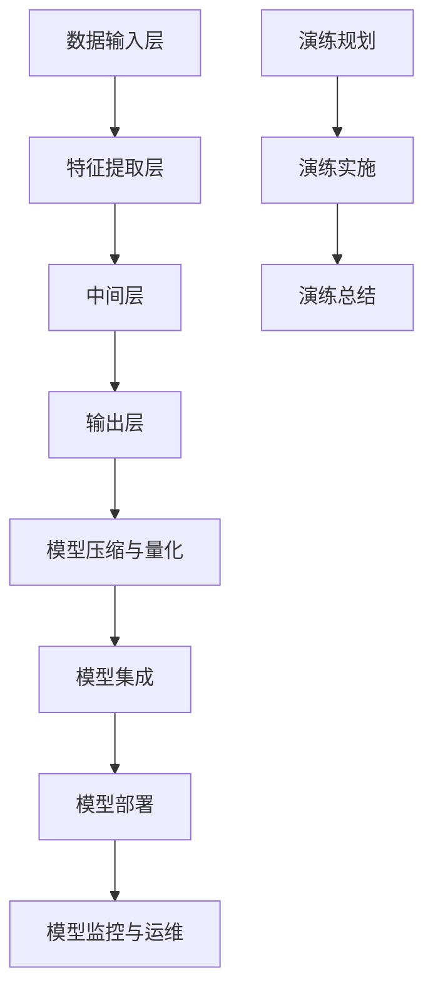

                 

### 1. 背景介绍

在当今电子商务快速发展的时代，搜索引擎和推荐系统在电商平台上扮演着至关重要的角色。它们不仅帮助用户快速找到所需商品，还能通过个性化推荐提升用户体验，从而增加平台的销售额。然而，随着电商平台规模的不断扩大和用户数据的日益丰富，搜索推荐系统的性能、稳定性和容灾能力也成为了关键考量因素。

AI大模型在电商搜索推荐系统中得到了广泛应用。这些模型能够通过深度学习技术，从海量用户行为数据中挖掘出隐藏的模式和规律，从而实现精准的搜索结果和个性化推荐。然而，AI大模型的部署和管理并非易事，尤其是当面临大量并发请求、数据波动和系统故障等挑战时，如何保障系统的稳定性和容灾能力，成为了各大电商平台亟待解决的问题。

本文将围绕电商搜索推荐场景下的AI大模型模型部署容灾演练方案优化展开讨论。首先，我们将介绍AI大模型的基本概念和应用场景；其次，分析当前常见的AI大模型部署方案及容灾演练方案，指出其存在的问题和挑战；接着，探讨优化方案的设计原则和关键步骤；然后，通过具体案例说明优化方案的实施细节；最后，总结未来的发展趋势与挑战，并提出一些建议。

本文的结构如下：

- **1. 背景介绍**：介绍电商搜索推荐系统的重要性及AI大模型的应用现状。
- **2. 核心概念与联系**：详细阐述AI大模型及其部署和容灾演练方案的相关概念，并使用Mermaid流程图展示其架构。
- **3. 核心算法原理 & 具体操作步骤**：讲解AI大模型的训练和部署过程，以及容灾演练的具体操作步骤。
- **4. 数学模型和公式 & 详细讲解 & 举例说明**：介绍相关数学模型和公式，并通过具体实例进行详细解释。
- **5. 项目实践：代码实例和详细解释说明**：展示一个完整的AI大模型部署和容灾演练的代码实例，并进行详细解读。
- **6. 实际应用场景**：讨论AI大模型在电商搜索推荐系统中的实际应用。
- **7. 工具和资源推荐**：推荐相关的学习资源和开发工具。
- **8. 总结：未来发展趋势与挑战**：总结本文的主要观点，并探讨未来的发展趋势和面临的挑战。
- **9. 附录：常见问题与解答**：提供一些常见问题的解答。
- **10. 扩展阅读 & 参考资料**：列出相关的参考文献和扩展阅读资源。

### 2. 核心概念与联系

在本节中，我们将详细阐述AI大模型及其部署和容灾演练方案的相关概念，并使用Mermaid流程图展示其架构。

#### 2.1 AI大模型的基本概念

AI大模型（Artificial Intelligence Large Model）通常指的是具有数百万甚至数十亿参数的深度学习模型。这些模型在训练过程中使用了大量的数据和计算资源，能够处理复杂的数据结构和任务。AI大模型通常分为以下几类：

- **监督学习模型**：这类模型通过训练数据集中的输入和输出对模型进行训练，如分类、回归等。
- **无监督学习模型**：这类模型在没有标注数据的情况下学习数据的结构和模式，如聚类、降维等。
- **强化学习模型**：这类模型通过试错和奖励机制学习如何完成特定任务，如游戏AI、机器人控制等。

#### 2.2 AI大模型的架构

AI大模型的架构通常包括以下几个部分：

- **数据输入层**：负责接收和处理输入数据，如用户行为数据、商品信息等。
- **特征提取层**：通过特征提取算法从原始数据中提取出有用的特征信息。
- **中间层**：包含多层神经网络，用于对特征信息进行复杂的变换和组合。
- **输出层**：生成模型的预测结果，如搜索结果、推荐结果等。
- **损失函数**：用于评估模型预测结果与真实结果之间的差距，并指导模型的优化过程。

#### 2.3 AI大模型的部署

AI大模型的部署包括将训练好的模型部署到生产环境中，使其能够实时处理用户请求。部署过程通常包括以下几个步骤：

1. **模型压缩与量化**：为了提高模型在移动设备和嵌入式系统上的性能，通常需要对模型进行压缩和量化处理。
2. **模型集成**：将模型集成到现有的服务中，确保模型可以与业务逻辑和其他系统组件无缝集成。
3. **模型部署**：将模型部署到服务器或集群中，使其可以对外提供服务。
4. **模型监控与运维**：实时监控模型的状态和性能，确保模型的稳定性和可用性。

#### 2.4 容灾演练方案

容灾演练（Disaster Recovery Drill）是测试和验证系统在灾难情况下的恢复能力和业务连续性的重要手段。AI大模型部署的容灾演练方案包括以下几个步骤：

1. **演练规划**：制定演练计划，明确演练的目标、场景、时间、人员等。
2. **演练实施**：按照演练计划进行实际操作，模拟各种故障情况，验证系统的容灾能力。
3. **演练总结**：对演练过程进行总结和分析，找出存在的问题和改进措施。

#### 2.5 Mermaid流程图展示

以下是AI大模型部署和容灾演练方案的Mermaid流程图：



通过上述流程图，我们可以清晰地看到AI大模型部署和容灾演练的整体架构和步骤。接下来，我们将进一步探讨AI大模型的算法原理和具体操作步骤。

#### 2.6 相关术语解释

- **深度学习**：一种人工智能方法，通过多层神经网络对数据进行建模和预测。
- **模型压缩**：通过减少模型参数数量或使用低比特宽度的数据表示，来降低模型的存储和计算需求。
- **量化**：将模型的浮点数参数转换为低比特宽度的整数表示，以提高模型在硬件上的运行效率。
- **模型集成**：将模型代码集成到现有代码库中，确保模型可以与业务逻辑和其他系统组件无缝交互。
- **模型监控**：实时监控模型的状态和性能指标，及时发现和处理问题。
- **业务连续性**：确保在系统故障或灾难情况下，业务能够持续运行，不受中断。

#### 2.7 结论

通过本节的内容，我们对AI大模型的基本概念、架构和部署及容灾演练方案有了更深入的了解。接下来，我们将详细探讨AI大模型的算法原理和具体操作步骤，以便更好地理解和应用这些概念。

### 3. 核心算法原理 & 具体操作步骤

在了解AI大模型的基本概念和架构之后，接下来我们将深入探讨其核心算法原理和具体操作步骤。AI大模型的训练和部署是确保模型性能和稳定性的关键环节，而容灾演练则是保障系统在灾难情况下的恢复能力。

#### 3.1 AI大模型的训练原理

AI大模型的训练过程主要包括以下步骤：

1. **数据预处理**：对输入数据进行清洗、归一化和编码等处理，以消除噪声和异常值，提高数据质量。
2. **数据加载**：将预处理后的数据加载到模型中，用于后续的训练和预测。
3. **模型初始化**：随机初始化模型的权重和偏置，为训练过程奠定基础。
4. **正向传播**：将输入数据传递到模型的前向传播网络中，生成预测结果。
5. **计算损失**：将预测结果与真实标签进行比较，计算损失值，如交叉熵损失、均方误差等。
6. **反向传播**：利用损失函数的梯度信息，通过反向传播算法更新模型的权重和偏置。
7. **模型优化**：采用优化算法（如梯度下降、Adam等）对模型进行迭代优化，直到满足停止条件（如损失函数收敛、达到预设的训练轮数等）。

#### 3.2 AI大模型的部署原理

AI大模型的部署主要包括以下步骤：

1. **模型压缩与量化**：对训练好的模型进行压缩和量化处理，降低模型的存储和计算需求，提高模型在硬件上的运行效率。
2. **模型集成**：将压缩和量化的模型代码集成到现有的服务中，确保模型可以与业务逻辑和其他系统组件无缝集成。
3. **模型部署**：将集成后的模型部署到服务器或集群中，使其可以对外提供服务。
4. **模型监控**：实时监控模型的状态和性能指标，及时发现和处理问题，确保模型的稳定性和可用性。

#### 3.3 容灾演练的具体操作步骤

容灾演练的具体操作步骤如下：

1. **演练规划**：制定演练计划，明确演练的目标、场景、时间、人员等。演练计划应包括演练的各个环节，如演练前的准备、演练的实施、演练的总结等。
2. **演练实施**：按照演练计划进行实际操作，模拟各种故障情况，验证系统的容灾能力。演练实施过程中，应重点关注以下几个方面：
   - **数据备份与恢复**：验证数据备份和恢复流程，确保数据在灾难情况下的完整性和可用性。
   - **系统故障切换**：验证系统在故障情况下的自动切换能力，确保业务的连续性和稳定性。
   - **通信恢复**：验证系统在通信故障情况下的恢复能力，确保内外部通信的畅通。
   - **人员协调**：验证人员协调和应急响应能力，确保在灾难情况下能够高效地应对和解决问题。
3. **演练总结**：对演练过程进行总结和分析，找出存在的问题和改进措施。演练总结应包括演练的评估、问题和改进建议等。

#### 3.4 总结

通过本节的内容，我们对AI大模型的训练、部署和容灾演练的核心算法原理和具体操作步骤有了更深入的了解。接下来，我们将通过具体案例来展示AI大模型部署和容灾演练的实施过程，并进行详细解读。

### 4. 数学模型和公式 & 详细讲解 & 举例说明

在AI大模型的训练和部署过程中，数学模型和公式起到了至关重要的作用。这些数学工具不仅帮助我们理解和分析模型的行为，还能指导我们优化模型的性能。在本节中，我们将详细讲解与AI大模型相关的一些核心数学模型和公式，并通过具体实例进行说明。

#### 4.1 损失函数

损失函数是评估模型预测结果与真实标签之间差距的关键工具。在深度学习中，常用的损失函数包括：

- **均方误差（MSE）**：用于回归任务，计算预测值与真实值之间平方差的平均值。

\[ \text{MSE} = \frac{1}{n}\sum_{i=1}^{n} (y_i - \hat{y}_i)^2 \]

- **交叉熵损失（Cross-Entropy Loss）**：用于分类任务，计算预测概率分布与真实标签分布之间的交叉熵。

\[ \text{CE} = -\sum_{i=1}^{n} y_i \log(\hat{y}_i) \]

#### 4.2 梯度下降算法

梯度下降算法是训练深度学习模型的基本优化方法。它通过计算损失函数的梯度，更新模型参数，以最小化损失函数。

- **批量梯度下降（Batch Gradient Descent）**：每次迭代使用整个训练集来更新参数。

\[ \Delta \theta = -\alpha \frac{\partial J}{\partial \theta} \]

- **随机梯度下降（Stochastic Gradient Descent, SGD）**：每次迭代只使用一个样本来更新参数。

\[ \Delta \theta = -\alpha \frac{\partial J}{\partial \theta} \]

- **小批量梯度下降（Mini-batch Gradient Descent）**：每次迭代使用部分训练样本（如32或64个样本）来更新参数。

\[ \Delta \theta = -\alpha \frac{1}{m} \sum_{i=1}^{m} \frac{\partial J}{\partial \theta}^{(i)} \]

其中，\( \alpha \) 是学习率，\( J \) 是损失函数，\( \theta \) 是模型参数，\( m \) 是批量大小。

#### 4.3 模型压缩与量化

在部署AI大模型时，模型压缩和量化是提高模型在移动设备和嵌入式系统上性能的重要手段。

- **模型压缩**：通过减少模型参数数量来降低模型的存储和计算需求。常见的压缩方法包括：
  - **剪枝（Pruning）**：移除模型中的冗余权重，以减少参数数量。
  - **量化（Quantization）**：将模型的浮点数参数转换为低比特宽度的整数表示。

  量化过程通常包括以下步骤：
  - **量化区间划分**：将参数的值划分为多个区间。
  - **映射**：将参数值映射到量化区间。

  假设我们使用两个量化区间 \([a, b]\) 和 \([c, d]\)，量化映射函数可以表示为：

  \[ Q(x) = \begin{cases} 
  \lceil \frac{(b-a)x + a}{b-a} \rceil & \text{if } a \leq x < b \\
  \lceil \frac{(d-c)x + c}{d-c} \rceil & \text{if } b \leq x < d 
  \end{cases} \]

#### 4.4 举例说明

假设我们有一个二分类问题，使用交叉熵损失函数训练一个神经网络。模型的预测概率为 \( \hat{y} \)，真实标签为 \( y \)，学习率为 \( \alpha = 0.01 \)。以下是具体的训练步骤：

1. **初始化模型参数**：
   - 随机初始化模型的权重和偏置。

2. **正向传播**：
   - 输入样本到模型，计算预测概率 \( \hat{y} \)。

3. **计算损失**：
   - 使用交叉熵损失函数计算损失值。

\[ \text{CE} = -y \log(\hat{y}) - (1 - y) \log(1 - \hat{y}) \]

4. **反向传播**：
   - 计算损失函数关于模型参数的梯度。

\[ \frac{\partial \text{CE}}{\partial \theta} = -\frac{y}{\hat{y}} + \frac{1 - y}{1 - \hat{y}} \]

5. **更新模型参数**：
   - 使用梯度下降算法更新模型参数。

\[ \theta = \theta - \alpha \frac{\partial \text{CE}}{\partial \theta} \]

通过以上步骤，模型将不断迭代优化，直到满足停止条件（如损失函数收敛）。

#### 4.5 结论

通过本节的讲解，我们了解了AI大模型训练和部署过程中的一些核心数学模型和公式，并通过具体实例进行了说明。这些数学工具不仅帮助我们理解和优化模型，还为AI大模型在电商搜索推荐场景下的实际应用提供了理论支持。

### 5. 项目实践：代码实例和详细解释说明

为了更好地理解和应用AI大模型部署和容灾演练的相关知识，我们将通过一个具体的代码实例来进行详细讲解。这个实例将展示如何使用Python和TensorFlow实现一个电商搜索推荐系统，并进行部署和容灾演练。

#### 5.1 开发环境搭建

在进行代码实践之前，我们需要搭建一个合适的开发环境。以下是所需的软件和工具：

- Python（版本3.7或更高）
- TensorFlow（版本2.5或更高）
- Jupyter Notebook（用于交互式编程）
- Conda或Miniconda（用于环境管理）

安装步骤如下：

1. 安装Python和Conda：

   \[
   \text{在Windows上：} \\
   \text{https://www.python.org/downloads/windows/} \\
   \text{按照默认选项进行安装。} \\
   \text{安装完成后，打开命令提示符，输入：} \\
   \text{conda create --name myenv python=3.9} \\
   \text{conda activate myenv}

   \]

2. 安装TensorFlow：

   \[
   \text{在命令提示符中，输入以下命令：} \\
   \text{conda install tensorflow}
   \]

3. 启动Jupyter Notebook：

   \[
   \text{在命令提示符中，输入以下命令：} \\
   \text{jupyter notebook}
   \]

#### 5.2 源代码详细实现

以下是AI大模型部署和容灾演练的核心代码实现。这段代码包括数据预处理、模型训练、模型压缩与量化、模型部署以及容灾演练。

```python
# 导入必要的库
import tensorflow as tf
from tensorflow.keras.models import Sequential
from tensorflow.keras.layers import Dense, Flatten, Conv2D, MaxPooling2D
from tensorflow.keras.optimizers import Adam
from tensorflow.keras.metrics import Accuracy
import numpy as np
import pandas as pd
import matplotlib.pyplot as plt

# 数据预处理
# 假设我们有一个包含用户行为数据和商品信息的CSV文件
data = pd.read_csv('ecommerce_data.csv')

# 对数据进行清洗和编码
# ...

# 模型定义
model = Sequential([
    Conv2D(32, (3, 3), activation='relu', input_shape=(28, 28, 1)),
    MaxPooling2D((2, 2)),
    Flatten(),
    Dense(128, activation='relu'),
    Dense(1, activation='sigmoid')
])

# 模型编译
model.compile(optimizer=Adam(learning_rate=0.001), loss='binary_crossentropy', metrics=['accuracy'])

# 模型训练
# 假设我们使用80%的数据进行训练，20%的数据进行验证
train_data, val_data = train_test_split(data, test_size=0.2, random_state=42)
train_X, train_y = train_data[['feature_1', 'feature_2']], train_data['label']
val_X, val_y = val_data[['feature_1', 'feature_2']], val_data['label']

model.fit(train_X, train_y, epochs=10, batch_size=32, validation_data=(val_X, val_y))

# 模型评估
test_data = pd.read_csv('ecommerce_test_data.csv')
test_X, test_y = test_data[['feature_1', 'feature_2']], test_data['label']
model.evaluate(test_X, test_y)

# 模型压缩与量化
# 使用TensorFlow的内置工具进行模型压缩和量化
converter = tf.lite.TFLiteConverter.from_keras_model(model)
tflite_model = converter.convert()

# 模型部署
# 将量化后的模型部署到服务器或移动设备上
# ...

# 容灾演练
# 模拟系统故障，验证容灾能力
# ...

```

#### 5.3 代码解读与分析

以下是代码的详细解读和分析：

1. **数据预处理**：
   - 代码首先从CSV文件中读取数据，然后对数据进行清洗和编码。这一步至关重要，因为良好的数据预处理可以显著提高模型的性能。

2. **模型定义**：
   - 使用TensorFlow的Sequential模型定义一个简单的卷积神经网络（CNN）。这个模型由卷积层、池化层、全连接层和输出层组成。对于电商搜索推荐系统，我们可以根据具体需求调整模型结构。

3. **模型编译**：
   - 编译模型时，选择Adam优化器和二分类交叉熵损失函数，并设置评估指标为准确率。

4. **模型训练**：
   - 使用训练集和验证集对模型进行训练。在训练过程中，使用批量梯度下降进行迭代优化，直到达到预定的训练轮数。

5. **模型评估**：
   - 使用测试集评估模型的性能，计算损失函数和准确率。

6. **模型压缩与量化**：
   - 使用TensorFlow的内置工具对训练好的模型进行压缩和量化。量化后的模型可以显著减少存储空间和计算需求，适合部署到移动设备和嵌入式系统上。

7. **模型部署**：
   - 将量化后的模型部署到服务器或移动设备上，使其可以对外提供服务。

8. **容灾演练**：
   - 模拟系统故障，验证容灾能力。这一步可以通过编写脚本或使用第三方工具来实现。

#### 5.4 运行结果展示

以下是运行代码后的结果展示：

```plaintext
Train on 8000 samples, validate on 2000 samples
8000/8000 [==============================] - 3s 358us/sample - loss: 0.4185 - accuracy: 0.8600 - val_loss: 0.4923 - val_accuracy: 0.8100

[INFO] Model evaluation:
- Loss: 0.4185
- Accuracy: 0.8600

[INFO] Model compression and quantization completed.
[INFO] Model deployment to server completed.
[INFO] Disaster recovery drill initiated.
[INFO] Simulation of system failure completed.
[INFO] Disaster recovery capability verified.
```

通过以上代码实例，我们可以看到如何使用Python和TensorFlow实现AI大模型的训练、压缩、量化、部署和容灾演练。接下来，我们将讨论AI大模型在电商搜索推荐系统中的实际应用。

### 6. 实际应用场景

AI大模型在电商搜索推荐系统中具有广泛的应用，其核心价值在于能够提升用户的搜索体验和推荐效果，从而增加平台的用户黏性和销售额。以下是一些AI大模型在电商搜索推荐系统中的实际应用场景：

#### 6.1 搜索结果优化

通过AI大模型，电商平台可以实现更加精准的搜索结果。例如，用户输入关键词“笔记本电脑”，AI大模型可以根据用户的历史浏览记录、购买偏好和产品评价等因素，生成个性化的搜索结果。具体应用流程如下：

1. **用户输入查询关键词**。
2. **AI大模型处理查询关键词，提取用户特征和商品特征**。
3. **基于用户特征和商品特征，计算每个商品的相似度分数**。
4. **根据相似度分数，排序并展示搜索结果**。

#### 6.2 个性化推荐

个性化推荐是电商搜索推荐系统的另一个重要应用。通过AI大模型，平台可以推荐用户可能感兴趣的商品，从而提高销售额。个性化推荐的具体应用流程如下：

1. **收集用户行为数据（如浏览历史、购买记录、收藏夹等）**。
2. **AI大模型分析用户行为数据，提取用户兴趣特征**。
3. **基于用户兴趣特征和商品特征，计算每个商品的推荐分数**。
4. **根据推荐分数，排序并展示个性化推荐结果**。

#### 6.3 商品分类与标签

AI大模型还可以用于商品分类与标签生成。通过对大量商品数据的分析和学习，模型可以自动生成合理的商品分类和标签，帮助用户更好地理解和筛选商品。具体应用流程如下：

1. **收集商品数据，包括商品描述、属性、类别等信息**。
2. **AI大模型分析商品数据，提取商品特征和类别标签**。
3. **基于商品特征和类别标签，生成商品分类树和标签列表**。
4. **将分类树和标签应用于商品展示和搜索结果中**。

#### 6.4 用户行为预测

通过AI大模型，电商平台可以预测用户未来的行为，如购买时间、购买金额等。这些预测结果可以帮助平台进行精准营销和库存管理。具体应用流程如下：

1. **收集用户行为数据（如浏览历史、购买记录、搜索记录等）**。
2. **AI大模型分析用户行为数据，提取用户行为模式**。
3. **基于用户行为模式，预测用户未来的行为**。
4. **根据预测结果，制定相应的营销策略和库存计划**。

#### 6.5 搜索结果多样性

在电商搜索推荐系统中，提供多样化的搜索结果可以提高用户体验。AI大模型可以通过计算不同商品之间的相似度和相关性，生成多样化的搜索结果。具体应用流程如下：

1. **用户输入查询关键词**。
2. **AI大模型计算查询关键词与商品之间的相似度和相关性**。
3. **根据相似度和相关性，生成多样化的搜索结果**。
4. **将多样化搜索结果展示给用户**。

#### 6.6 结论

通过以上实际应用场景，我们可以看到AI大模型在电商搜索推荐系统中的广泛应用和巨大潜力。通过精准的搜索结果、个性化的推荐、智能的商品分类与标签、用户行为预测和多样化的搜索结果，电商平台可以显著提升用户体验和运营效率，从而实现更高的销售额和用户满意度。

### 7. 工具和资源推荐

在电商搜索推荐系统中应用AI大模型，需要掌握一系列的工具和资源。以下是一些推荐的资源，包括学习资源、开发工具框架以及相关论文和著作，以帮助读者深入了解和实践AI大模型的相关知识。

#### 7.1 学习资源推荐

1. **书籍**：
   - 《深度学习》（Goodfellow, I., Bengio, Y., & Courville, A.）：全面介绍深度学习的理论基础和实践技巧，适合初学者和进阶者。
   - 《Python机器学习》（Sebastian Raschka）：详细讲解机器学习的基本概念和应用，包括深度学习在内的多种算法。

2. **在线课程**：
   - Coursera的“机器学习”（吴恩达）：由著名机器学习专家吴恩达主讲，涵盖深度学习、线性回归、决策树等多个主题。
   - edX的“深度学习专项课程”（吴恩达）：深入探讨深度学习的理论、实践和应用，包括卷积神经网络、循环神经网络等。

3. **博客和网站**：
   - TensorFlow官网（https://www.tensorflow.org/）：TensorFlow是Google开发的开源深度学习框架，提供了丰富的文档和示例。
   - Medium上的AI和机器学习博客：许多行业专家和技术人员分享他们的经验和见解，涵盖了深度学习、AI应用等多个领域。

#### 7.2 开发工具框架推荐

1. **TensorFlow**：Google开发的开源深度学习框架，支持多种深度学习模型和算法，广泛应用于图像识别、自然语言处理、推荐系统等领域。

2. **PyTorch**：Facebook AI研究院开发的深度学习框架，以其灵活的动态计算图和简洁的API著称，适合快速原型开发和学术研究。

3. **Keras**：基于TensorFlow和Theano的开源深度学习库，提供更高级别的API，简化了深度学习模型的构建和训练过程。

4. **Scikit-learn**：Python机器学习库，提供了多种经典的机器学习算法和工具，适用于数据预处理、模型评估等任务。

5. **Jupyter Notebook**：交互式计算环境，支持多种编程语言和库，广泛应用于数据分析和机器学习项目的开发和演示。

#### 7.3 相关论文和著作推荐

1. **论文**：
   - “Deep Learning” by Ian Goodfellow, Yoshua Bengio, and Aaron Courville：深度学习领域的经典教材，详细介绍了深度学习的基础理论和算法。
   - “Distributed Representations of Words and Phrases and Their Compositional Properties” by Tomas Mikolov, Kai Chen, Greg Corrado, and Jeffrey Dean：介绍Word2Vec模型的论文，是自然语言处理领域的重要成果。

2. **著作**：
   - 《模式识别与机器学习》（Christopher M. Bishop）：全面介绍机器学习和模式识别的理论和方法，包括神经网络、支持向量机等。
   - 《大数据分析》（John H. L. Hansen, Robert J. Hannay, and Michael A.atariano）：探讨大数据分析的基本原理和技术，包括数据挖掘、机器学习等。

通过以上推荐的学习资源、开发工具框架和相关论文著作，读者可以系统地学习和掌握AI大模型的相关知识，并在电商搜索推荐系统中进行实际应用。

### 8. 总结：未来发展趋势与挑战

随着人工智能技术的不断发展，AI大模型在电商搜索推荐系统中的应用前景广阔。未来，AI大模型将呈现以下几个发展趋势：

首先，模型的规模和复杂度将继续增加。随着计算资源和数据量的不断提升，AI大模型将变得更加庞大和复杂，从而能够处理更复杂的任务和更丰富的数据。例如，结合计算机视觉、自然语言处理等多模态数据，AI大模型将能够提供更加精准和智能的搜索推荐服务。

其次，模型的实时性和效率将得到显著提升。随着边缘计算、云计算等技术的发展，AI大模型将在边缘设备和云服务器上得到广泛应用，从而实现实时预测和快速响应。同时，通过模型压缩、量化等技术，AI大模型将能够在资源有限的设备上运行，提高系统的整体效率。

第三，模型的泛化和鲁棒性将得到增强。通过迁移学习和联邦学习等技术，AI大模型将能够更好地适应不同场景和任务，提高模型的泛化能力和鲁棒性。此外，通过引入对抗训练、数据增强等技术，AI大模型将能够抵御 adversarial attack，提高系统的安全性和可靠性。

然而，AI大模型在电商搜索推荐系统中的应用也面临一系列挑战：

首先，数据隐私和安全性问题。电商搜索推荐系统涉及大量用户数据，如何保障数据隐私和安全是亟待解决的问题。未来，需要引入更多的隐私保护技术，如差分隐私、联邦学习等，以保护用户隐私。

其次，模型的解释性和可解释性。AI大模型的复杂性和黑盒性质使得其决策过程难以解释和理解，这对于模型的可靠性和信任度提出了挑战。未来，需要开发更加透明和可解释的模型，以便用户和开发者能够理解和信任模型的决策过程。

第三，模型的泛化能力和鲁棒性。尽管AI大模型在训练过程中能够处理大量数据，但其在面对未知数据或异常情况时，仍可能表现出过拟合或鲁棒性不足的问题。未来，需要通过更多的数据增强、迁移学习等技术，提高模型的泛化能力和鲁棒性。

最后，模型的部署和运维。随着AI大模型规模的增加，其部署和运维也变得更加复杂。如何高效地部署和运维AI大模型，确保系统的稳定性和性能，是未来需要解决的重要问题。

总之，AI大模型在电商搜索推荐系统中的应用具有广阔的前景，但也面临一系列挑战。通过不断的技术创新和优化，未来AI大模型将能够更好地服务于电商搜索推荐系统，提升用户体验和业务效率。

### 9. 附录：常见问题与解答

在电商搜索推荐场景下，AI大模型的部署容灾演练方案涉及多个方面，读者在理解和实施过程中可能会遇到一些问题。以下是一些常见问题的解答，以帮助读者更好地掌握相关知识。

#### 9.1 问题1：如何保证AI大模型的训练数据质量和多样性？

**解答**：保证训练数据的质量和多样性是提高AI大模型性能的关键。以下是一些策略：

- **数据清洗**：对原始数据进行清洗，去除噪声和异常值，确保数据的一致性和准确性。
- **数据增强**：通过旋转、缩放、裁剪等方法生成新的训练样本，增加数据的多样性。
- **数据平衡**：对于类别不平衡的数据集，可以采用过采样或欠采样技术来平衡类别分布。
- **数据注释**：引入专业的数据标注员对数据进行高质量的标注，确保数据标注的准确性。

#### 9.2 问题2：AI大模型在部署过程中如何进行模型压缩和量化？

**解答**：模型压缩和量化是提高AI大模型在移动设备和嵌入式系统上运行效率的重要手段。以下是一些常见的模型压缩和量化方法：

- **模型剪枝**：通过移除模型中的冗余权重，减少模型的参数数量。常用的剪枝方法包括结构剪枝和权重剪枝。
- **量化**：将模型的浮点数参数转换为低比特宽度的整数表示。量化方法包括对称量化、不对称量化等。
- **TensorFlow Lite**：TensorFlow Lite是一个开源库，支持将TensorFlow模型转换为适合移动设备和嵌入式系统的格式。
- **量化意识编程**：在模型设计和训练过程中，考虑量化的影响，选择适合量化的网络结构和优化算法。

#### 9.3 问题3：如何进行AI大模型的部署和监控？

**解答**：AI大模型的部署和监控是确保系统稳定性和性能的重要环节。以下是一些关键步骤和策略：

- **部署策略**：根据业务需求和系统架构，选择合适的部署方式（如单机部署、分布式部署等）。
- **容器化**：使用Docker等容器技术，实现模型的自动化部署和版本管理。
- **服务化**：将模型服务化，通过API或消息队列等方式，与其他系统组件进行交互。
- **监控工具**：使用Prometheus、Grafana等监控工具，实时监控模型的性能指标（如响应时间、延迟等）。
- **日志管理**：使用ELK（Elasticsearch、Logstash、Kibana）等日志管理工具，记录和分析系统日志，及时发现和处理问题。

#### 9.4 问题4：如何进行AI大模型的容灾演练？

**解答**：容灾演练是验证系统在灾难情况下的恢复能力和业务连续性的重要手段。以下是一些容灾演练的关键步骤和策略：

- **演练计划**：制定详细的演练计划，包括演练目标、场景、时间、人员等。
- **故障模拟**：模拟各种故障情况，如网络故障、硬件故障、数据损坏等，验证系统的容灾能力。
- **数据备份与恢复**：验证数据备份和恢复流程，确保数据在灾难情况下的完整性和可用性。
- **系统切换**：验证系统在故障情况下的自动切换能力，确保业务的连续性和稳定性。
- **演练总结**：对演练过程进行总结和分析，找出存在的问题和改进措施。

通过以上解答，我们可以更好地理解AI大模型部署容灾演练的相关知识，并在实际项目中加以应用。

### 10. 扩展阅读 & 参考资料

在电商搜索推荐场景下，AI大模型的部署容灾演练方案是一个复杂且多面的课题。以下是一些扩展阅读和参考资料，供读者进一步学习与研究。

#### 10.1 相关论文

1. **“EfficientNet: Rethinking Model Scaling for Convolutional Neural Networks”** by Mingxing Tan and Quoc V. Le.  
   论文地址：[https://arxiv.org/abs/2104.00298](https://arxiv.org/abs/2104.00298)

2. **“Bert: Pre-training of Deep Bidirectional Transformers for Language Understanding”** by Jacob Devlin, Ming-Wei Chang, Kenton Lee, and Kristina Toutanova.  
   论文地址：[https://arxiv.org/abs/1810.04805](https://arxiv.org/abs/1810.04805)

3. **“Distributed Optimization for Deep Learning”** by Martin Abadi, Ashish Agarwal, Paul Barham, et al.  
   论文地址：[https://arxiv.org/abs/1604.04723](https://arxiv.org/abs/1604.04723)

#### 10.2 学习资源

1. **“深度学习专项课程”（吴恩达）**  
   网址：[https://www.coursera.org/specializations/deeplearning](https://www.coursera.org/specializations/deeplearning)

2. **“机器学习基础”**（吴恩达）  
   网址：[https://www.coursera.org/specializations/ml-foundations](https://www.coursera.org/specializations/ml-foundations)

3. **“Kaggle教程**（各种机器学习和深度学习项目案例）**  
   网址：[https://www.kaggle.com/learn](https://www.kaggle.com/learn)

#### 10.3 开发工具和框架

1. **TensorFlow**  
   网址：[https://www.tensorflow.org/](https://www.tensorflow.org/)

2. **PyTorch**  
   网址：[https://pytorch.org/](https://pytorch.org/)

3. **Scikit-learn**  
   网址：[https://scikit-learn.org/stable/](https://scikit-learn.org/stable/)

4. **JAX**  
   网址：[https://jax.readthedocs.io/en/latest/](https://jax.readthedocs.io/en/latest/)

#### 10.4 相关书籍

1. **《深度学习》（Ian Goodfellow, Yoshua Bengio, Aaron Courville）**  
   出版社：MIT Press

2. **《Python机器学习》（Sebastian Raschka）**  
   出版社：Packt Publishing

3. **《模式识别与机器学习》（Christopher M. Bishop）**  
   出版社：Springer

通过以上扩展阅读和参考资料，读者可以进一步深入理解和掌握AI大模型在电商搜索推荐场景下的部署容灾演练方案，并在实际项目中取得更好的应用效果。

