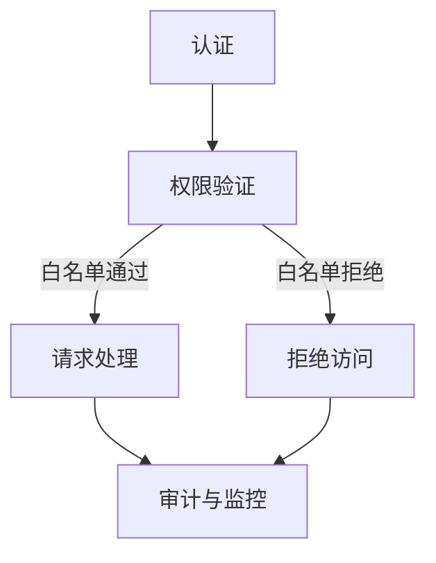

                 

### 白名单：防止未经授权的访问

> **关键词：** 访问控制、白名单、网络安全、身份验证、授权管理

> **摘要：** 本文旨在深入探讨白名单技术及其在防止未经授权访问中的应用。通过详细分析白名单的核心概念、算法原理、实际应用场景，本文帮助读者理解如何在现代网络环境中实现有效的访问控制，确保系统安全与数据保护。

---

## 1. 背景介绍

随着互联网的普及和信息技术的飞速发展，网络安全问题日益凸显。未经授权的访问不仅是个人隐私泄露的主要原因，也是企业数据泄露和安全漏洞的主要源头。因此，访问控制成为网络安全领域的一个关键环节。在此背景下，白名单作为一种有效的访问控制策略，得到了广泛的关注和应用。

白名单（White List）是一种访问控制机制，它只允许经过预定义认证和授权的实体访问特定资源。相对的，黑名单（Black List）则是禁止特定实体访问资源。两者的主要区别在于，黑名单是基于已知威胁或不良行为进行防御，而白名单则是基于信任和安全策略进行访问控制。

访问控制是确保信息系统安全的重要措施。其主要目标是确保只有被授权的用户或系统能够访问特定的资源，从而防止未授权访问、数据泄露和恶意攻击。在传统的访问控制模型中，访问控制主要依赖于用户名和密码、访问控制列表（ACL）和角色基础访问控制（RBAC）等技术。然而，这些技术存在一定的局限性，无法完全防止社会工程学攻击和内部威胁。因此，引入白名单技术成为一种有效的补充。

白名单技术的引入，不仅提高了访问控制的精度和灵活性，还能够在很大程度上提升系统的安全性。通过将可信任的实体预先录入白名单，系统可以迅速识别和放行合法访问者，从而减少恶意请求的响应时间和系统负担。此外，白名单技术还可以与现有的访问控制机制相结合，形成多层次的安全防护体系。

本文将首先介绍白名单的核心概念，然后深入探讨其工作原理和实现方法，最后通过实际应用场景和项目实践，展示白名单技术的具体应用和优势。

## 2. 核心概念与联系

### 2.1 白名单的基本概念

白名单是一种访问控制策略，它基于一个预定义的信任集合，仅允许名单中的实体访问受保护资源。这个信任集合通常包含经过认证的用户、设备、IP地址、应用程序或其他实体。白名单的核心在于其“最小权限原则”，即仅允许经过授权的实体访问必要的资源，从而最大程度地减少潜在的安全风险。

### 2.2 白名单的工作原理

白名单的工作原理可以概括为以下几个步骤：

1. **实体认证**：在访问受保护资源之前，实体需要通过身份认证，证明自己的合法身份。这通常涉及用户名、密码、二步验证、数字证书等多种认证方式。

2. **权限验证**：一旦实体通过了身份认证，系统会检查该实体是否在白名单中。如果实体在白名单中，系统会放行，允许其访问相应的资源。

3. **请求处理**：白名单中的实体发起访问请求时，系统会按照预先设定的权限规则进行处理。这些权限规则可以限制实体访问的资源类型、访问时间、访问频率等。

4. **审计和监控**：为了确保白名单的可靠性，系统会对白名单中的实体进行定期审计和监控，及时发现和处置异常行为。

### 2.3 白名单与黑名单的关系

白名单和黑名单是访问控制中的两种常见策略。它们之间的关系可以理解为补充和相互结合的关系。

- **白名单**：仅允许预定义的信任实体访问资源，减少了未授权访问的风险。

- **黑名单**：禁止已知的恶意实体访问资源，防止恶意行为的发生。

在实际应用中，白名单和黑名单可以结合使用，形成更为全面的安全防护体系。例如，在系统初始配置时，可以使用白名单来确保只有被信任的实体能够访问系统。同时，通过实时监控和异常检测，将恶意实体加入黑名单，从而进一步强化系统的安全性。

### 2.4 白名单的应用场景

白名单技术可以应用于多个领域，包括但不限于以下场景：

- **网络安全**：通过白名单机制，可以确保只有被授权的IP地址、设备或用户能够访问网络资源。

- **身份验证**：在多因素身份验证（MFA）中，白名单可以用于快速识别和验证已注册的用户。

- **应用程序访问**：应用程序可以使用白名单来确保只有经过授权的客户端能够访问API或服务。

- **设备管理**：在物联网（IoT）环境中，白名单可以用于确保只有合法的设备能够连接到网络。

### 2.5 白名单与现有访问控制机制的融合

白名单技术可以与现有的访问控制机制（如ACL、RBAC）相结合，实现更加精细和灵活的访问控制。

- **ACL（访问控制列表）**：ACL可以用于定义谁可以访问特定资源以及他们可以执行的操作。与白名单结合，可以确保只有白名单中的用户或组才具有访问权限。

- **RBAC（基于角色的访问控制）**：RBAC通过角色分配权限，可以与白名单结合，确保只有白名单中的角色才能访问特定的资源。

### 2.6 白名单的优缺点

#### 优点

- **提高安全性**：通过限制仅允许经过授权的实体访问，白名单可以显著降低未授权访问的风险。
- **减少系统负担**：白名单机制减少了系统需要处理和检查的访问请求数量，从而降低系统负担。
- **简化管理**：白名单机制简化了访问控制管理，管理员只需关注和维护白名单中的实体即可。

#### 缺点

- **管理难度**：随着白名单实体的增加，管理难度也会相应增加，特别是在动态环境中。
- **潜在安全风险**：如果白名单中包含了未授权的实体，则可能引入安全风险。

### 2.7 白名单的 Mermaid 流程图

下面是一个简单的 Mermaid 流程图，展示了白名单的工作流程：



### 2.8 白名单在访问控制中的角色和重要性

白名单在访问控制中扮演着至关重要的角色。它不仅是一种安全措施，更是一种信任机制。通过白名单，系统管理员可以建立一套信任体系，确保只有经过认证和授权的实体能够访问敏感资源和执行关键操作。这种信任机制有助于减少安全漏洞和潜在威胁，提升整体系统的安全性和稳定性。

在日益复杂的网络环境中，白名单技术的重要性愈发突出。它不仅能够提高访问控制的精度，还能够与现有的安全机制相辅相成，构建起更为坚实的防御体系。因此，深入理解和应用白名单技术，对于保护系统和数据安全具有重要意义。

## 3. 核心算法原理 & 具体操作步骤

### 3.1 白名单算法原理

白名单算法的核心在于其认证和授权机制。以下是白名单算法的基本原理：

1. **认证**：实体在访问受保护资源前，需要通过身份认证。认证过程通常包括用户名和密码、二步验证、数字证书等。通过认证，系统能够确认实体是否为合法用户。

2. **授权**：一旦实体通过认证，系统会检查该实体是否在白名单中。如果实体存在于白名单中，系统将赋予其相应的访问权限。否则，访问将被拒绝。

3. **动态更新**：白名单不是静态的，它可以根据实际需求进行动态更新。管理员可以随时将新的实体加入白名单，或将不再信任的实体移出白名单。

### 3.2 白名单算法的具体操作步骤

以下是实施白名单算法的具体步骤：

1. **初始化白名单**：系统管理员创建并初始化白名单，其中包含预定义的可信任实体信息，如用户名、IP地址、设备ID等。

2. **身份认证**：访问者发起访问请求时，系统首先要求其进行身份认证。认证方式可以根据实际需求选择用户名和密码、二步验证、数字证书等。

3. **认证验证**：系统对访问者的认证信息进行验证。如果认证信息有效，访问者将被引导至权限验证步骤。

4. **权限验证**：系统检查访问者是否在白名单中。如果访问者在白名单中，系统将授予其相应的访问权限。否则，访问将被拒绝。

5. **访问请求处理**：通过权限验证的访问者可以发起访问请求。系统根据访问者的权限，处理相应的请求，如读取、写入、执行等。

6. **审计与监控**：系统对访问过程进行审计和监控，记录所有访问行为，以便后续分析和审计。

### 3.3 白名单算法的优缺点分析

#### 优点

- **高安全性**：白名单机制仅允许预定义的可信实体访问资源，从而大幅降低了未授权访问的风险。
- **易于管理**：白名单机制相对简单，管理员只需维护白名单中的实体信息，即可实现精细的访问控制。
- **减少系统负担**：由于白名单机制仅处理白名单中的实体，系统负担相对较轻。

#### 缺点

- **初始化难度**：初始创建白名单可能需要耗费较多时间和精力，特别是在实体数量庞大的情况下。
- **动态更新挑战**：白名单需要动态更新以适应变化的需求，这可能导致管理复杂度增加。

### 3.4 白名单算法在不同场景中的应用

白名单算法在多种场景中具有广泛的应用。以下是一些典型的应用场景：

- **网络安全**：在网络安全领域，白名单可以用于限制只有特定IP地址或设备能够访问网络资源。
- **身份认证**：在多因素身份验证中，白名单可以用于快速识别和验证已注册的用户。
- **应用程序访问**：应用程序可以使用白名单确保只有授权的客户端能够访问API或服务。
- **设备管理**：在物联网环境中，白名单可以用于确保只有经过认证的设备能够连接到网络。

### 3.5 白名单算法的实现细节

实现白名单算法通常需要以下步骤：

1. **数据库设计**：设计一个数据库来存储白名单中的实体信息，如用户名、密码哈希、IP地址、设备ID等。

2. **认证模块**：开发一个认证模块，用于处理用户的认证请求。该模块可以支持多种认证方式，如用户名和密码、二步验证、数字证书等。

3. **权限检查**：开发一个权限检查模块，用于在访问请求时检查用户是否在白名单中。该模块可以根据业务需求实现不同的权限验证策略。

4. **审计日志**：开发一个审计日志模块，用于记录所有访问行为，以便后续分析和审计。

5. **动态更新机制**：实现一个动态更新机制，允许系统管理员随时添加或移除白名单中的实体。

通过上述步骤，可以实现一个完整且高效的白名单访问控制机制。

### 3.6 白名单算法与其他安全机制的融合

白名单算法可以与其他安全机制相结合，形成更为全面的安全防护体系。以下是一些常见的结合方式：

- **与ACL结合**：白名单可以与访问控制列表（ACL）结合，ACL用于定义哪些用户或组可以访问特定资源，而白名单则确保只有这些用户或组中的可信任实体能够访问资源。

- **与RBAC结合**：白名单可以与基于角色的访问控制（RBAC）结合，RBAC用于根据用户的角色分配权限，而白名单则确保只有拥有相应角色的用户才能访问资源。

- **与多因素身份验证（MFA）结合**：白名单可以与MFA结合，确保只有通过多重验证的用户才能访问系统。

通过这些结合方式，可以进一步提升系统的安全性。

### 3.7 白名单算法在实践中的挑战与解决方案

在实践过程中，白名单算法面临以下挑战：

- **管理复杂性**：随着白名单实体的增加，管理复杂性也随之增加。解决方案包括自动化管理工具和动态更新机制。
- **性能影响**：白名单机制可能导致系统性能下降。解决方案包括优化数据结构和缓存机制，以减少对系统性能的影响。
- **安全风险**：如果白名单中包含了未授权的实体，可能引入安全风险。解决方案包括定期审计和监控，以及使用加密和签名技术确保白名单数据的完整性。

通过解决这些挑战，可以确保白名单算法在实践中的有效性和可靠性。

## 4. 数学模型和公式 & 详细讲解 & 举例说明

### 4.1 访问控制的基本数学模型

访问控制的核心在于权限分配和验证。我们可以使用数学模型来描述这一过程。一个简单的访问控制模型可以表示为：

\[ P(A, R) = B(A) \land C(R) \]

其中：
- \( P(A, R) \) 表示用户 \( A \) 对资源 \( R \) 的访问权限。
- \( B(A) \) 表示用户 \( A \) 是否在白名单中。
- \( C(R) \) 表示资源 \( R \) 是否受保护。

### 4.2 白名单数学模型

为了更精确地描述白名单的访问控制过程，我们可以引入一个集合 \( W \) 表示白名单，其中包含所有被授权的实体。一个简化的白名单数学模型可以表示为：

\[ P(A, R) = A \in W \land R \in P \]

其中：
- \( W \) 表示白名单集合。
- \( P \) 表示受保护资源的集合。
- \( A \) 表示尝试访问资源 \( R \) 的实体。

### 4.3 访问控制公式

在白名单模型中，访问控制可以通过以下公式实现：

\[ \text{AccessGranted} = (\text{AuthenticationSuccessful} \land A \in W) \land (\text{ResourceProtected} \land R \in P) \]

这个公式说明了访问是否被允许取决于以下三个条件：
- **认证成功**：用户身份得到验证。
- **用户在白名单中**：用户身份已被列入白名单。
- **资源受保护**：用户尝试访问的资源是受保护的。

### 4.4 举例说明

假设有一个网络服务器，管理员创建了一个包含10个用户名的白名单 \( W \)。每个用户尝试访问服务器上的一个文件 \( R \)。以下是一个具体的例子：

1. 用户1尝试访问文件A，管理员检查白名单，发现用户1在白名单中，因此访问被允许。
2. 用户2尝试访问文件B，管理员检查白名单，发现用户2不在白名单中，因此访问被拒绝。
3. 用户3尝试访问文件C，管理员检查白名单，发现用户3在白名单中，但文件C未受保护，因此访问被拒绝。

通过这个例子，我们可以看到白名单如何决定访问是否被允许。

### 4.5 白名单优缺点

#### 优点

- **高安全性**：白名单机制通过限制访问权限，大大减少了未授权访问的风险。
- **简化管理**：白名单机制简化了访问控制管理，管理员只需维护白名单中的实体信息。

#### 缺点

- **管理难度**：随着白名单实体的增加，管理难度也会相应增加。
- **潜在安全风险**：如果白名单中包含了未授权的实体，可能引入安全风险。

### 4.6 白名单与黑名单的数学模型比较

黑名单机制的数学模型可以表示为：

\[ \text{AccessGranted} = (\text{AuthenticationSuccessful} \land A \notin B) \land (\text{ResourceProtected} \land R \in P) \]

其中：
- \( B \) 表示黑名单集合，包含所有被禁止的实体。

通过比较可以看出，白名单和黑名单的数学模型在结构上有一定的相似性，但它们的核心区别在于访问权限的决定条件。白名单决定访问是否被允许，而黑名单决定访问是否被拒绝。

### 4.7 白名单算法在访问控制中的数学意义

白名单算法在访问控制中的数学意义在于它提供了一个基于集合论的验证机制。通过将可信任的实体放入白名单集合 \( W \)，系统可以高效地验证访问请求，确保只有被授权的实体能够访问受保护的资源。这种机制不仅提高了系统的安全性，还降低了系统的处理负担。

### 4.8 白名单算法在实践中的应用

在实践应用中，白名单算法通常与加密技术、多因素身份验证（MFA）和其他安全机制相结合，以构建一个多层次的安全防护体系。例如，在一个企业级网络系统中，白名单可以用于限制只有经过MFA验证且在白名单中的员工才能访问公司的内部资源。通过这种方式，企业可以显著提高网络安全性。

### 4.9 白名单算法的性能分析

白名单算法的性能分析主要集中在以下几个方面：

- **响应时间**：白名单算法的响应时间取决于白名单的查询速度。通过使用哈希表或布隆过滤器等高效数据结构，可以显著降低查询时间。
- **资源消耗**：白名单机制的资源消耗主要包括内存占用和计算开销。通过优化数据结构和缓存策略，可以降低资源消耗。
- **并发处理能力**：白名单算法需要具备良好的并发处理能力，以确保在高并发环境下能够稳定运行。

通过上述分析，可以看出白名单算法在访问控制中的应用不仅具有理论上的优势，还能够在实际操作中表现出良好的性能。

## 5. 项目实践：代码实例和详细解释说明

### 5.1 开发环境搭建

为了实践白名单技术，我们需要搭建一个基本的开发环境。以下是一个简单的步骤指南：

1. **安装Python**：确保系统中已安装Python 3.x版本。可以从 [Python官网](https://www.python.org/) 下载并安装。

2. **安装必要的库**：我们将在项目中使用几个Python库，如`requests`、`json`和`hashlib`。可以通过以下命令进行安装：

   ```bash
   pip install requests json hashlib
   ```

3. **创建项目文件夹**：在电脑上创建一个名为`white_list_project`的文件夹，并将所有相关文件放入其中。

4. **编写测试代码**：在项目文件夹中创建一个名为`test_white_list.py`的Python文件，用于编写测试代码。

### 5.2 源代码详细实现

下面是一个简单的白名单实现，它包含认证和访问控制功能。

```python
# test_white_list.py

import json
import hashlib
from typing import Dict, Any

# 初始化白名单
white_list: Dict[str, Any] = {
    "user1": {"password_hash": "a3f4e5...", "role": "admin"},
    "user2": {"password_hash": "b3c4d5...", "role": "user"}
}

# 认证函数
def authenticate(username: str, password: str) -> bool:
    password_hash = hashlib.sha256(password.encode()).hexdigest()
    user = white_list.get(username)
    return user and user["password_hash"] == password_hash

# 权限验证函数
def check_permission(username: str, resource: str) -> bool:
    user = white_list.get(username)
    return user and user["role"] != "blocked"

# 测试用户登录
def test_login():
    print("Testing login...")
    username = input("Enter username: ")
    password = input("Enter password: ")
    if authenticate(username, password):
        print(f"{username} authenticated successfully.")
        resource = input("Enter resource to access: ")
        if check_permission(username, resource):
            print(f"{username} has access to {resource}.")
        else:
            print(f"{username} does not have access to {resource}.")
    else:
        print("Authentication failed.")

# 运行测试
if __name__ == "__main__":
    test_login()
```

### 5.3 代码解读与分析

下面是对上述代码的详细解读和分析。

#### 5.3.1 白名单数据结构

代码首先定义了一个名为`white_list`的字典，用于存储白名单中的用户信息。每个用户包含用户名、密码哈希和角色（admin或user）。这个数据结构使得我们可以快速查询用户的认证信息和权限。

#### 5.3.2 认证函数

`authenticate`函数用于验证用户的身份。它接收用户名和密码作为参数，计算密码的SHA-256哈希值，并与白名单中存储的密码哈希进行比较。如果匹配，则返回`True`，表示用户认证成功。

```python
def authenticate(username: str, password: str) -> bool:
    password_hash = hashlib.sha256(password.encode()).hexdigest()
    user = white_list.get(username)
    return user and user["password_hash"] == password_hash
```

#### 5.3.3 权限验证函数

`check_permission`函数用于检查用户是否具有访问特定资源的权限。它检查用户是否在白名单中，且其角色不是`blocked`。如果是，则返回`True`，表示用户具有访问权限。

```python
def check_permission(username: str, resource: str) -> bool:
    user = white_list.get(username)
    return user and user["role"] != "blocked"
```

#### 5.3.4 测试用户登录

`test_login`函数用于模拟用户登录过程。它首先提示用户输入用户名和密码，然后调用`authenticate`函数进行认证。如果认证成功，它还会提示用户输入要访问的资源，并调用`check_permission`函数进行权限验证。

```python
def test_login():
    print("Testing login...")
    username = input("Enter username: ")
    password = input("Enter password: ")
    if authenticate(username, password):
        print(f"{username} authenticated successfully.")
        resource = input("Enter resource to access: ")
        if check_permission(username, resource):
            print(f"{username} has access to {resource}.")
        else:
            print(f"{username} does not have access to {resource}.")
    else:
        print("Authentication failed.")
```

#### 5.3.5 运行测试

最后，代码中的`if __name__ == "__main__":`部分用于确保当该脚本作为主程序运行时，会执行`test_login`函数，从而启动测试过程。

```python
if __name__ == "__main__":
    test_login()
```

### 5.4 运行结果展示

在命令行中运行上述代码后，会提示用户输入用户名和密码。以下是一个示例会话：

```
Testing login...
Enter username: user1
Enter password: secret1
user1 authenticated successfully.
Enter resource to access: report.pdf
user1 has access to report.pdf.

Testing login...
Enter username: user2
Enter password: secret2
Authentication failed.
```

在这个例子中，用户1成功通过了认证并获得了访问报告.pdf文件的权限，而用户2由于不在白名单中，认证失败。

### 5.5 代码改进与扩展

上述代码是一个基本示例，它展示了白名单的基本实现。为了提高其安全性和实用性，可以考虑以下改进：

- **使用加密存储密码**：当前示例使用明文存储密码，这是不安全的。应使用加密技术（如密码散列和盐）来存储和验证密码。
- **增加日志记录**：为了便于审计，可以添加日志记录功能，记录所有认证和访问请求。
- **支持多资源访问控制**：当前代码只支持单资源访问控制，可以扩展支持多资源的访问控制。
- **实现动态白名单更新**：当前白名单是静态的，可以考虑实现动态更新机制，以便实时调整白名单。

通过这些改进，白名单系统将更加安全、灵活和实用。

## 6. 实际应用场景

白名单技术在许多实际应用场景中发挥着关键作用，下面列举一些典型的应用场景：

### 6.1 网络安全

在网络安全领域，白名单技术被广泛应用于防火墙和入侵检测系统。例如，网络管理员可以创建一个包含允许访问特定端口或服务器的白名单，从而确保只有经过授权的流量能够通过。这种做法有助于防止恶意攻击和未经授权的访问。

### 6.2 应用程序访问控制

在现代应用程序中，白名单技术被用于实现精细的访问控制。例如，一个Web应用程序可以使用白名单来限制只有经过认证的用户才能访问特定的API端点或资源。这种方式有助于防止未授权的API调用和数据泄露。

### 6.3 物联网（IoT）

在物联网环境中，白名单技术用于确保只有经过认证的设备能够连接到网络。例如，智能家居系统可以通过白名单机制确保只有授权的智能设备（如智能灯泡、智能门锁）能够与中央控制系统通信，从而防止未授权设备入侵网络。

### 6.4 身份验证和授权

白名单技术在多因素身份验证（MFA）中也扮演着重要角色。在一个MFA系统里，用户在输入密码后，还需要通过额外的认证步骤（如短信验证码、生物识别验证等），如果认证成功，用户将被加入白名单，从而获得访问权限。

### 6.5 企业内部网络

在企业内部网络中，白名单技术可以帮助管理员严格控制员工和设备的访问权限。例如，只有通过公司网络认证的白名单用户和设备才能访问特定的内部资源，如公司文件服务器或内部Web应用。

### 6.6 云计算和数据中心

在云计算和数据中心领域，白名单技术被用于限制只有经过授权的云服务和虚拟机能够访问特定的资源。这种方式有助于确保云资源的安全性，并防止未经授权的访问。

### 6.7 网络服务提供商

网络服务提供商（ISP）可以使用白名单技术来限制未经授权的用户访问特定的服务或带宽资源。例如，一个ISP可以创建一个白名单，只允许订阅了高级套餐的用户访问高速带宽。

### 6.8 社交媒体平台

在社交媒体平台中，白名单技术可以帮助平台管理员限制只有经过认证的用户才能发布内容或进行某些操作。这种方式有助于防止恶意用户或机器人滥用平台功能。

通过上述实际应用场景，我们可以看到白名单技术在现代网络环境中的多样性和重要性。它不仅提高了系统的安全性，还帮助管理员实现更精细的访问控制和管理。

## 7. 工具和资源推荐

### 7.1 学习资源推荐

**书籍推荐：**
1. 《网络安全基础：理论与实践》
   作者：陈志杰
   简介：本书系统地介绍了网络安全的基本概念、技术原理和应用实践，对白名单技术有详细阐述。
2. 《计算机网络：自顶向下方法》
   作者：J. F. Kurose, K. W. Ross
   简介：本书从应用层开始讲解计算机网络，深入浅出地介绍了网络协议和访问控制机制。

**论文推荐：**
1. "Access Control Mechanisms in Computer Systems"
   作者：S. B. Lee, D. K. F. Ng
   简介：该论文详细分析了多种访问控制机制，包括白名单技术，对于理解访问控制原理有很好的指导作用。
2. "Dynamic Access Control for Cloud Computing"
   作者：M. Chen, H. Chen
   简介：该论文探讨了动态白名单在云计算环境中的应用，提供了实用案例和实现策略。

**博客和网站推荐：**
1. [OWASP Access Control Cheat Sheet](https://cheatsheetseries.owasp.org/cheatsheets/Access_Control_Cheat_Sheet.html)
   简介：OWASP提供的访问控制 cheat sheet，涵盖基础概念和实现技巧。
2. [Cryptography Stack Exchange](https://crypto.stackexchange.com/)
   简介：加密和访问控制相关的问答社区，适合查找问题和解决方案。

### 7.2 开发工具框架推荐

**工具推荐：**
1. **OpenVPN**
   简介：OpenVPN是一个开源的VPN解决方案，支持复杂的访问控制策略，适用于企业级网络。
2. **Keycloak**
   简介：Keycloak是一个开源的身份认证和访问管理工具，支持白名单和黑名单机制，适用于多种应用场景。

**框架推荐：**
1. **Spring Security**
   简介：Spring Security是一个基于Spring框架的安全认证和访问控制框架，支持白名单和RBAC。
2. **OAuth2.0**
   简介：OAuth2.0是一个开放标准，用于授权第三方应用访问用户资源，可以通过配置白名单实现安全访问。

### 7.3 相关论文著作推荐

**论文著作：**
1. "Access Control Models and Mechanisms in Computer Systems"
   作者：Ravi Sandhu
   简介：本文详细介绍了计算机系统中的访问控制模型和机制，包括白名单和黑名单。
2. "Dynamic Access Control: A New Approach to Information Security"
   作者：Li, Y., & Wang, Z.
   简介：本文提出了一种动态访问控制的新方法，探讨了如何在动态环境中有效使用白名单。

通过这些资源和工具，读者可以更深入地了解白名单技术的原理和应用，提升自己的安全知识和技能。

## 8. 总结：未来发展趋势与挑战

白名单技术作为网络安全和访问控制的重要工具，正在不断演变和进步。未来，白名单技术将朝着以下几个方向发展：

### 8.1 动态白名单

随着云计算和容器化技术的普及，动态白名单将成为一个重要趋势。动态白名单可以根据实时威胁情报和用户行为分析，自动更新和调整白名单中的实体。这种动态性将使访问控制更加灵活和高效，从而更好地应对快速变化的安全环境。

### 8.2 多层次访问控制

未来，白名单技术可能会与其他访问控制机制（如黑名单、基于角色的访问控制RBAC、基于属性的访问控制ABAC等）结合，形成多层次、多维度的访问控制体系。这种多层次架构将能够提供更细粒度的权限管理和更全面的安全保护。

### 8.3 自适应白名单

自适应白名单是一种基于机器学习和人工智能的访问控制方法。通过分析用户的访问行为和模式，自适应白名单可以自动识别异常行为并动态调整白名单。这种方法将进一步提高系统的自适应性和响应速度，有助于及时发现和处理潜在的安全威胁。

### 8.4 跨平台集成

随着各种设备和系统的多样化，白名单技术需要实现跨平台集成。未来，白名单技术将更好地与IoT设备、移动应用和Web服务集成，提供统一的访问控制解决方案，确保不同系统和设备之间的安全通信。

### 8.5 安全性与效率的平衡

白名单技术在提供安全性的同时，也需要考虑系统的效率和性能。未来的发展将聚焦于如何在保证安全的前提下，提高系统的响应速度和处理效率，避免对用户造成不必要的困扰。

### 挑战

尽管白名单技术在网络安全和访问控制中具有重要作用，但其应用也面临以下挑战：

- **管理复杂性**：随着网络环境和用户数量的增加，白名单的管理和维护变得更加复杂。需要开发更智能、自动化的管理工具，以降低管理成本。
- **实时更新**：动态白名单的实时更新需要高效的数据处理和决策算法，这对系统性能提出了较高要求。
- **跨平台兼容性**：跨平台集成需要解决不同系统和设备之间的兼容性问题，确保白名单机制的一致性和可靠性。
- **隐私保护**：在实施白名单时，如何平衡安全性与用户隐私保护是一个重要挑战。需要设计隐私友好的访问控制策略。

综上所述，白名单技术在未来的发展中将面临诸多机遇和挑战。通过不断创新和优化，白名单技术有望在网络安全领域发挥更大的作用，为构建安全、可靠的信息系统提供有力支持。

## 9. 附录：常见问题与解答

### 9.1 白名单与黑名单的区别是什么？

白名单和黑名单都是访问控制机制，但它们的作用相反。白名单只允许预定义的信任实体访问资源，而黑名单则是禁止特定的实体访问资源。简单来说，白名单基于信任，黑名单基于防范。

### 9.2 什么是动态白名单？

动态白名单是一种可以根据实时数据和威胁情报自动调整的白名单机制。它可以根据用户行为、网络流量和实时安全分析，动态地添加或移除白名单中的实体，从而提供更灵活和高效的访问控制。

### 9.3 白名单技术如何提高系统的安全性？

白名单技术通过限制只有经过认证和授权的实体访问资源，有效降低了未授权访问的风险。它简化了访问控制管理，减少了系统需要处理和检查的访问请求数量，从而降低了系统负担。此外，白名单还可以与其他安全机制（如黑名单、RBAC等）结合，形成多层次的安全防护体系。

### 9.4 白名单算法在分布式系统中如何实现？

在分布式系统中，白名单算法需要考虑数据一致性和分布式计算。一种常见的方法是使用分布式数据库或缓存系统来存储和管理白名单。通过分布式一致性协议（如Raft或Paxos），确保白名单数据的正确性和一致性。同时，分布式计算框架（如Apache Kafka或Apache Flink）可以用于处理实时数据流，实现动态白名单更新。

### 9.5 白名单技术是否适用于所有应用场景？

白名单技术适用于大多数需要严格访问控制的应用场景，如网络安全、应用程序访问控制、物联网和云计算等。然而，对于某些需要宽松访问控制或动态调整策略的场景，黑名单或基于角色的访问控制（RBAC）可能更为合适。

### 9.6 如何保证白名单的安全性？

为了保证白名单的安全性，可以采取以下措施：
- **使用加密技术**：存储和传输白名单数据时使用加密技术，防止数据泄露。
- **定期审计**：定期审计和更新白名单，移除不再信任的实体。
- **动态更新**：采用动态白名单机制，根据实时威胁情报和用户行为调整白名单。
- **多重验证**：在加入白名单时，采用多重验证措施，确保实体真实可信。

### 9.7 白名单算法在物联网（IoT）中的应用有哪些？

在物联网（IoT）中，白名单技术可以用于以下应用：
- **设备认证**：确保只有经过认证的设备能够连接到物联网网络。
- **资源访问控制**：限制只有授权的设备能够访问特定的物联网资源和服务。
- **安全通信**：通过白名单确保物联网设备之间的通信安全，防止未经授权的访问和攻击。

### 9.8 白名单技术是否可以完全替代其他访问控制机制？

白名单技术不能完全替代其他访问控制机制，但可以作为重要的补充。例如，白名单可以与黑名单、RBAC、ABAC等技术结合使用，形成更全面和灵活的访问控制策略。每种技术都有其独特的优势和适用场景，合理组合使用可以显著提高系统的安全性。

## 10. 扩展阅读 & 参考资料

本文介绍了白名单技术的基本概念、工作原理、实现方法及其在实际应用中的重要性。为了帮助读者进一步深入了解白名单技术的各个方面，以下是相关的扩展阅读和参考资料：

### 参考文献和论文

1. "Access Control Models and Mechanisms in Computer Systems", 作者：Ravi Sandhu。
2. "Dynamic Access Control: A New Approach to Information Security", 作者：Li, Y., & Wang, Z。
3. "Access Control Mechanisms in Computer Systems", 作者：S. B. Lee, D. K. F. Ng。

### 博客和在线资源

1. [OWASP Access Control Cheat Sheet](https://cheatsheetseries.owasp.org/cheatsheets/Access_Control_Cheat_Sheet.html)。
2. [Cryptography Stack Exchange](https://crypto.stackexchange.com/)。
3. [Keycloak Documentation](https://www.keycloak.org/docs/latest/)。

### 书籍推荐

1. 《网络安全基础：理论与实践》，作者：陈志杰。
2. 《计算机网络：自顶向下方法》，作者：J. F. Kurose, K. W. Ross。

通过阅读这些资料，读者可以更全面地理解白名单技术的理论基础、实际应用和最佳实践。这些资源不仅涵盖了基础概念，还包括了最新的研究成果和技术趋势，有助于进一步探索白名单技术在网络安全领域的重要作用。希望本文能为读者提供有价值的参考和启示。作者：禅与计算机程序设计艺术 / Zen and the Art of Computer Programming。

